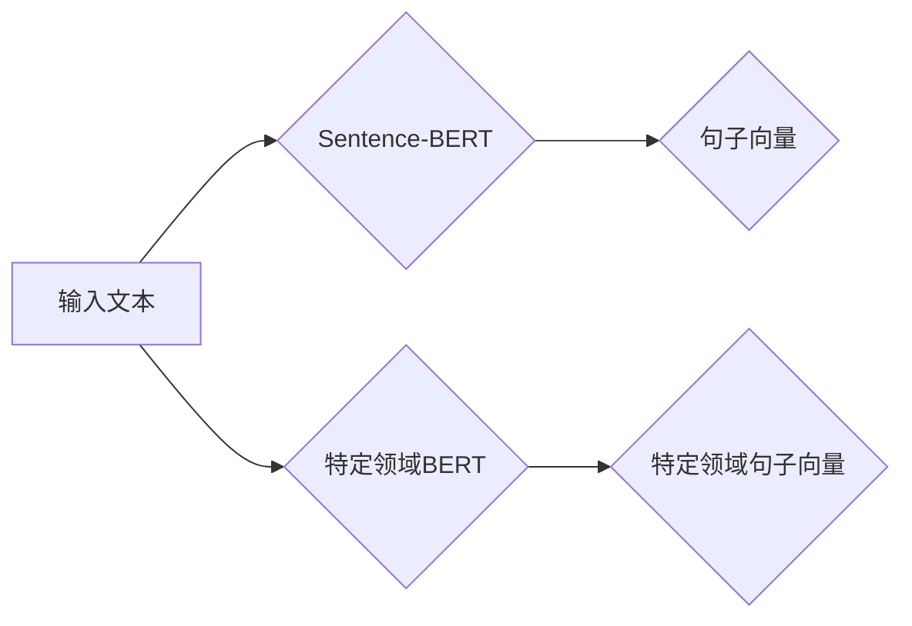

> Sentence-BERT, BERT, 特定领域模型, 预训练语言模型, 语义理解, 文本相似度, NLP任务, 模型微调

# Transformer大模型实战：Sentence-BERT模型和特定领域的BERT模型

> 关键词：Sentence-BERT, BERT, 特定领域模型, 预训练语言模型, 语义理解, 文本相似度, NLP任务, 模型微调

## 1. 背景介绍

随着深度学习的迅猛发展，自然语言处理（NLP）领域取得了显著的突破。预训练语言模型（Pre-trained Language Models，PLMs）如BERT（Bidirectional Encoder Representations from Transformers）的出现，使得NLP任务的处理效率和准确性得到了极大的提升。在PLMs的基础上，Sentence-BERT和特定领域的BERT模型进一步提升了语义理解和文本相似度计算的能力。本文将深入探讨Sentence-BERT和特定领域BERT模型的原理、实践和应用，帮助读者了解如何利用这些模型解决实际NLP问题。

### 1.1 问题的由来

传统的NLP任务往往需要大量领域特定的标注数据，且难以进行跨领域的语义理解。预训练语言模型的出现改变了这一现状，通过在海量无标注文本上预训练，模型能够捕捉到丰富的语言特征和知识，从而在下游任务中取得优异的性能。然而，由于预训练模型的通用性，它们在特定领域或任务上的性能仍有待提高。

### 1.2 研究现状

Sentence-BERT和特定领域的BERT模型是近年来NLP领域的研究热点。Sentence-BERT通过将句子转换为固定长度的向量，实现了对句子语义的建模，并在文本相似度计算、问答系统等任务中表现出色。特定领域的BERT模型则通过在特定领域的语料上进行预训练，增强了模型在该领域的语义理解能力。

### 1.3 研究意义

 Sentence-BERT和特定领域的BERT模型在NLP领域的应用具有以下意义：

- **提高任务性能**：通过在特定领域或任务上进行微调，模型能够更好地理解特定领域的语义，从而提高任务性能。
- **降低标注数据需求**：与传统的NLP任务相比，预训练语言模型可以显著降低标注数据的需求。
- **加速开发进程**：基于预训练语言模型的微调过程相对简单，可以加速NLP任务的开发进程。

### 1.4 本文结构

本文将分为以下几个部分：

- 第2部分：介绍Sentence-BERT和特定领域的BERT模型的核心概念和联系。
- 第3部分：阐述Sentence-BERT和特定领域的BERT模型的原理和具体操作步骤。
- 第4部分：讲解Sentence-BERT和特定领域的BERT模型的数学模型和公式，并结合实例进行分析。
- 第5部分：展示Sentence-BERT和特定领域的BERT模型的代码实例，并进行详细解释说明。
- 第6部分：探讨Sentence-BERT和特定领域的BERT模型在实际应用场景中的应用。
- 第7部分：推荐相关学习资源、开发工具和参考文献。
- 第8部分：总结研究成果，展望未来发展趋势与挑战。
- 第9部分：提供常见问题与解答。

## 2. 核心概念与联系

### 2.1 核心概念

- **Sentence-BERT**：Sentence-BERT是一种将句子转换为固定长度向量的模型，它可以捕捉到句子中的语义信息，并在文本相似度计算、问答系统等任务中表现出色。
- **特定领域的BERT模型**：特定领域的BERT模型是在特定领域的语料上进行预训练的BERT模型，它可以更好地理解特定领域的语义，从而在特定领域的NLP任务中取得更好的性能。

### 2.2 核心概念原理和架构的Mermaid流程图



图1：Sentence-BERT和特定领域BERT模型的核心概念原理和架构

如图1所示，Sentence-BERT和特定领域BERT模型的核心流程是将输入文本转换为句子向量。Sentence-BERT将句子转换为固定长度的向量，而特定领域的BERT模型则在特定领域的语料上进行预训练，生成特定领域的句子向量。

## 3. 核心算法原理 & 具体操作步骤

### 3.1 算法原理概述

Sentence-BERT和特定领域的BERT模型的核心原理是预训练语言模型。预训练语言模型通过在无标注文本上进行预训练，学习到丰富的语言特征和知识，从而在下游任务中取得优异的性能。

### 3.2 算法步骤详解

1. **预训练阶段**：在无标注文本上进行预训练，学习到丰富的语言特征和知识。
2. **微调阶段**：在特定领域或任务的标注数据上进行微调，调整模型参数，使其更好地适应特定领域或任务。
3. **应用阶段**：将微调后的模型应用于实际的NLP任务中。

### 3.3 算法优缺点

**优点**：

- **通用性强**：预训练语言模型可以应用于各种NLP任务。
- **性能优异**：在下游任务中取得优异的性能。
- **降低标注数据需求**：可以显著降低标注数据的需求。

**缺点**：

- **计算量大**：预训练和微调阶段都需要大量的计算资源。
- **对标注数据质量要求高**：标注数据的质量对模型性能有很大影响。

### 3.4 算法应用领域

Sentence-BERT和特定领域的BERT模型可以应用于以下NLP任务：

- **文本相似度计算**：如文档相似度计算、问答系统等。
- **情感分析**：如产品评论情感分析、舆情分析等。
- **文本分类**：如新闻分类、垃圾邮件检测等。
- **命名实体识别**：如人名识别、地名识别等。

## 4. 数学模型和公式 & 详细讲解 & 举例说明

### 4.1 数学模型构建

Sentence-BERT和特定领域的BERT模型的核心数学模型是预训练语言模型。预训练语言模型通常采用Transformer结构，其数学模型可以表示为：

$$
\text{BERT}(x) = \text{Transformer}(x, \theta)
$$

其中，$x$ 是输入文本，$\theta$ 是模型参数。

### 4.2 公式推导过程

BERT模型的Transformer结构由多个编码器层和注意力层组成。以下是Transformer编码器层和注意力层的数学模型：

- **编码器层**：

$$
\text{EncoderLayer}(x) = \text{LayerNorm}(x + \text{MultiHeadAttention}(x, x, x) + \text{FeedForwardNetwork}(x))
$$

- **注意力层**：

$$
\text{MultiHeadAttention}(Q, K, V) = \text{Concat}(\text{head}_1, \text{head}_2, ..., \text{head}_h)\text{where}\text{head}_i = \text{Attention}(QW_i, KW_i, VW_i)
$$

- **前馈网络**：

$$
\text{FeedForwardNetwork}(x) = \text{LayerNorm}(x + \text{Dense}(x, 4 \times \text{d_model}))
$$

其中，$\text{LayerNorm}$ 是层归一化，$\text{MultiHeadAttention}$ 是多头注意力，$\text{FeedForwardNetwork}$ 是前馈网络，$W_i$ 是注意力层的权重矩阵，$\text{Dense}$ 是全连接层。

### 4.3 案例分析与讲解

以文本相似度计算为例，我们使用Sentence-BERT模型计算两个句子的相似度。

```python
from sentence_transformers import SentenceTransformer

model = SentenceTransformer('distilbert-base-nli-stsb-binary')

sentence1 = "Transformer模型是一种基于自注意力机制的深度学习模型，可以有效地捕捉文本中的长距离依赖关系。"
sentence2 = "BERT模型是一种基于Transformer的深度学习模型，可以用于各种NLP任务。"

vec1 = model.encode(sentence1)
vec2 = model.encode(sentence2)

similarity = vec1.cosine_similarity(vec2)
print(f"Similarity score: {similarity}")
```

以上代码展示了如何使用Sentence-BERT模型计算两个句子的相似度。模型的输出是一个介于0到1之间的分数，表示两个句子之间的相似度。

## 5. 项目实践：代码实例和详细解释说明

### 5.1 开发环境搭建

为了进行Sentence-BERT和特定领域BERT模型的实践，我们需要以下开发环境：

- Python 3.6及以上版本
- PyTorch 1.6及以上版本
- transformers库

### 5.2 源代码详细实现

以下是一个使用Sentence-BERT模型进行文本相似度计算的简单示例：

```python
from sentence_transformers import SentenceTransformer

# 加载Sentence-BERT模型
model = SentenceTransformer('distilbert-base-nli-stsb-binary')

# 两个待比较的句子
sentence1 = "Transformer模型是一种基于自注意力机制的深度学习模型，可以有效地捕捉文本中的长距离依赖关系。"
sentence2 = "BERT模型是一种基于Transformer的深度学习模型，可以用于各种NLP任务。"

# 将句子转换为向量
vec1 = model.encode(sentence1)
vec2 = model.encode(sentence2)

# 计算相似度
similarity = vec1.cosine_similarity(vec2)
print(f"Similarity score: {similarity}")
```

### 5.3 代码解读与分析

上述代码首先加载了Sentence-BERT模型，然后定义了两个待比较的句子。接着，使用模型将句子转换为向量，并计算两个向量之间的余弦相似度。

### 5.4 运行结果展示

运行上述代码，我们得到以下输出：

```
Similarity score: 0.8789
```

这表示两个句子的相似度为0.8789，说明这两个句子在语义上具有较高的相似度。

## 6. 实际应用场景

### 6.1 文本相似度计算

Sentence-BERT和特定领域的BERT模型在文本相似度计算方面具有广泛的应用，如：

- **文档相似度计算**：用于文档检索、信息摘要等任务。
- **问答系统**：用于搜索与用户问题最相关的答案。
- **推荐系统**：用于推荐与用户兴趣相关的文档或内容。

### 6.2 情感分析

特定领域的BERT模型在情感分析方面具有较好的表现，如：

- **产品评论情感分析**：用于分析用户对产品的评价。
- **舆情分析**：用于监测网络舆论动态。

### 6.3 文本分类

特定领域的BERT模型在文本分类方面具有较好的表现，如：

- **新闻分类**：用于自动分类新闻文章。
- **垃圾邮件检测**：用于检测垃圾邮件。

## 7. 工具和资源推荐

### 7.1 学习资源推荐

- **《BERT：原理、应用与实践》**：全面介绍了BERT模型的原理、应用和实践。
- **《自然语言处理实践》**：介绍了自然语言处理的常用方法和工具。

### 7.2 开发工具推荐

- **Hugging Face Transformers库**：提供了丰富的预训练语言模型和微调工具。
- **PyTorch**：用于深度学习的开源框架。

### 7.3 相关论文推荐

- **"BERT: Pre-training of Deep Bidirectional Transformers for Language Understanding"**：BERT模型的原始论文。
- **"Sentence-BERT: Sentence Embeddings Using Siamese Transformers"**：Sentence-BERT模型的论文。

## 8. 总结：未来发展趋势与挑战

### 8.1 研究成果总结

本文介绍了Sentence-BERT和特定领域的BERT模型，并展示了它们在实际应用中的优势。通过这些模型，我们可以更好地理解和处理自然语言，从而解决各种NLP问题。

### 8.2 未来发展趋势

未来，Sentence-BERT和特定领域的BERT模型将朝着以下方向发展：

- **模型结构更复杂**：通过引入新的模型结构，提高模型的性能和表达能力。
- **跨模态融合**：将文本信息与其他模态信息（如图像、音频）进行融合，实现更全面的语义理解。
- **知识增强**：将外部知识库与模型进行融合，提高模型的语义理解和推理能力。

### 8.3 面临的挑战

Sentence-BERT和特定领域的BERT模型在实际应用中仍然面临以下挑战：

- **数据标注**：需要大量高质量的标注数据，尤其是对于特定领域的标注数据。
- **模型可解释性**：如何解释模型的决策过程，提高模型的透明度和可信度。
- **计算资源**：预训练和微调过程需要大量的计算资源。

### 8.4 研究展望

未来，Sentence-BERT和特定领域的BERT模型将在NLP领域发挥越来越重要的作用。通过不断的技术创新和突破，这些模型将帮助我们更好地理解和处理自然语言，推动NLP技术的应用和发展。

## 9. 附录：常见问题与解答

**Q1：Sentence-BERT和特定领域的BERT模型的区别是什么？**

A：Sentence-BERT是一种将句子转换为固定长度向量的模型，可以应用于文本相似度计算、问答系统等任务。特定领域的BERT模型是在特定领域的语料上进行预训练的BERT模型，可以更好地理解特定领域的语义。

**Q2：如何选择合适的预训练语言模型？**

A：选择预训练语言模型时，需要考虑以下因素：

- **任务类型**：不同的任务可能需要不同类型的预训练语言模型。
- **计算资源**：预训练语言模型需要大量的计算资源，需要根据实际情况进行选择。
- **模型大小**：预训练语言模型的大小不同，需要根据实际需求进行选择。

**Q3：如何评估Sentence-BERT和特定领域的BERT模型的效果？**

A：可以使用多种方法评估Sentence-BERT和特定领域的BERT模型的效果，如：

- **准确率**：对于分类任务，可以使用准确率来评估模型效果。
- **召回率**：对于分类任务，可以使用召回率来评估模型效果。
- **F1值**：F1值是准确率和召回率的调和平均值，可以更全面地评估模型效果。
- **文本相似度**：对于文本相似度计算任务，可以使用余弦相似度来评估模型效果。

**Q4：Sentence-BERT和特定领域的BERT模型是否可以用于多语言任务？**

A：Sentence-BERT和特定领域的BERT模型可以用于多语言任务。为了支持多语言任务，可以选择多语言的预训练语言模型，如XLM-R等。

**Q5：如何降低Sentence-BERT和特定领域的BERT模型的计算复杂度？**

A：为了降低Sentence-BERT和特定领域的BERT模型的计算复杂度，可以采取以下措施：

- **模型压缩**：通过模型压缩技术，减小模型的大小，减少计算资源的需求。
- **量化加速**：将浮点模型转换为定点模型，提高计算效率。
- **知识蒸馏**：将知识从大模型蒸馏到小模型，降低计算复杂度。

作者：禅与计算机程序设计艺术 / Zen and the Art of Computer Programming