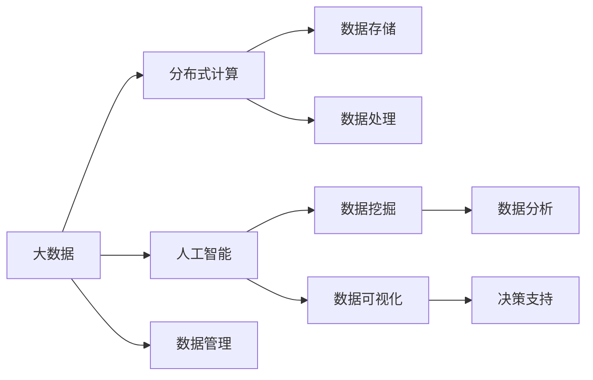

                 

# 一切皆是映射：大数据与AI：如何处理大规模数据集

> 关键词：大数据, 人工智能, 分布式计算, 大数据存储, 数据预处理, 数据挖掘, 数据可视化

## 1. 背景介绍

### 1.1 问题由来

随着互联网的普及和数字化进程的加速，人类社会产生的数据量呈指数级增长。根据国际数据公司IDC的预测，全球数据量将在2025年达到175ZB（Zettabytes）。面对海量数据的洪流，如何高效存储、管理和分析这些数据，成为了大数据时代的关键问题。传统的集中式存储和计算方式已经无法满足需求，分布式计算和大数据技术应运而生。

在大数据与人工智能（AI）的交汇点上，数据驱动的AI模型为大数据处理带来了新的视角和方法。如何高效处理大规模数据集，成为了数据科学家和AI研究人员共同关注的焦点。本文将深入探讨在大数据环境下，如何利用人工智能技术进行高效的数据处理和分析，为读者提供全面的指导和实践建议。

### 1.2 问题核心关键点

大数据处理的核心在于如何高效地存储、检索和分析海量数据。关键点包括：

- 数据存储：如何高效地存储海量数据，并确保数据的可靠性和一致性。
- 数据处理：如何在分布式计算环境中高效地处理大规模数据集，提升数据处理速度。
- 数据管理：如何管理和优化数据流程，确保数据的质量和一致性。
- 数据可视化：如何将数据转化为可视化图形，辅助决策和理解。

这些问题在数据处理的每个环节都至关重要，需要综合考虑技术、管理和商业等多个方面的因素。本文将从原理到实践，系统地介绍如何在分布式计算环境中，利用人工智能技术进行大规模数据集的处理。

## 2. 核心概念与联系

### 2.1 核心概念概述

为更好地理解大数据与AI的结合，本节将介绍几个密切相关的核心概念：

- 大数据(Big Data)：指传统数据处理工具无法有效处理的数据集合。通常指容量巨大、结构复杂、速度快且类型多样的数据。
- 人工智能(AI)：指通过机器学习、深度学习等技术，使机器具备类似于人的智能行为的能力。
- 分布式计算：指将计算任务分散到多台计算机上，协同处理以提高计算效率的技术。
- 数据挖掘(Data Mining)：指从大量数据中提取有用信息和知识的过程。
- 数据可视化(Data Visualization)：指将数据转化为图形，直观展示数据特征和关系的技术。

这些概念之间存在着紧密的联系，形成了一个完整的大数据处理框架。大数据提供了海量数据的输入，分布式计算保证了高效的数据处理，人工智能技术用于挖掘数据中的价值，而数据可视化则为决策提供直观的辅助。

### 2.2 概念间的关系

这些核心概念之间的关系可以通过以下Mermaid流程图来展示：



这个流程图展示了大数据处理的核心环节和关键技术，各环节之间相互依存、相互促进，共同构建了数据驱动的AI模型。

## 3. 核心算法原理 & 具体操作步骤

### 3.1 算法原理概述

在大数据环境下，人工智能技术主要通过以下几种算法原理实现大规模数据集的处理：

- 分布式计算框架：如Hadoop、Spark等，将计算任务分散到多台计算机上，并行处理大规模数据集。
- 数据预处理：包括数据清洗、归一化、特征选择等，提升数据质量，为模型训练提供更好的输入。
- 深度学习模型：如卷积神经网络(CNN)、循环神经网络(RNN)等，利用多层神经网络结构，从大规模数据中自动学习特征和规律。
- 数据挖掘算法：如聚类、分类、关联规则等，从数据中提取有用的知识和模式。

这些算法原理在大数据处理中扮演着重要角色，通过组合使用，可以高效地完成数据存储、处理、分析和可视化等任务。

### 3.2 算法步骤详解

以下是使用分布式计算和深度学习模型进行大规模数据集处理的详细步骤：

**Step 1: 数据收集与存储**

- 从不同来源收集原始数据，包括结构化和非结构化数据。
- 使用分布式文件系统（如HDFS）进行数据存储，确保数据的可扩展性和可靠性。

**Step 2: 数据预处理**

- 对数据进行清洗，去除噪声和异常值。
- 进行数据归一化和特征选择，提升数据质量。
- 使用分布式计算框架进行数据处理，提高效率。

**Step 3: 深度学习模型训练**

- 将数据分为训练集和测试集。
- 使用深度学习框架（如TensorFlow、PyTorch）进行模型训练。
- 调整模型参数，进行超参数优化，提升模型精度。

**Step 4: 数据挖掘与分析**

- 使用数据挖掘算法（如K-means、决策树等）进行特征提取和模式识别。
- 对数据进行可视化展示，辅助决策和理解。

**Step 5: 模型评估与部署**

- 在测试集上评估模型性能。
- 将模型部署到生产环境中，进行实时数据分析和预测。

通过以上步骤，可以高效地处理大规模数据集，并将其转化为有价值的知识。

### 3.3 算法优缺点

使用分布式计算和大数据技术处理大规模数据集具有以下优点：

- 高并发性：分布式计算可以同时处理多个计算任务，提升数据处理速度。
- 高可扩展性：可以轻松添加更多计算节点，满足数据量增长的需求。
- 高可靠性：分布式系统通过数据冗余和故障恢复机制，确保数据和计算的可靠性。

同时，这些技术也存在一些缺点：

- 计算复杂度高：分布式计算需要更多的计算资源和时间。
- 数据一致性问题：分布式系统中的数据一致性问题较难解决。
- 开发难度大：分布式计算和大数据技术需要较高的技术水平。

### 3.4 算法应用领域

基于大数据处理的技术和方法，可以应用于以下多个领域：

- 金融行业：利用大数据分析客户行为，优化风险管理和投资策略。
- 医疗健康：通过数据挖掘和深度学习，辅助疾病诊断和个性化治疗。
- 电商零售：分析消费者购买行为，实现个性化推荐和库存管理。
- 智慧城市：利用大数据和AI技术，提升城市管理效率和居民生活质量。
- 物流运输：通过数据分析优化货物运输路线和物流管理。

这些应用场景展示了大数据处理技术在各行各业的广泛应用前景。

## 4. 数学模型和公式 & 详细讲解  
### 4.1 数学模型构建

在处理大规模数据集时，常用的数学模型包括：

- 线性回归模型：用于预测连续型数据。
- 逻辑回归模型：用于分类问题。
- 卷积神经网络（CNN）：用于图像识别和处理。
- 循环神经网络（RNN）：用于序列数据处理和预测。
- 聚类算法：如K-means，用于数据分组和模式识别。

下面以线性回归模型为例，介绍其数学原理和公式推导。

设输入数据为 $X$，目标变量为 $Y$，线性回归模型的公式为：

$$
Y = \beta_0 + \beta_1X_1 + \beta_2X_2 + ... + \beta_nX_n + \epsilon
$$

其中 $\beta_i$ 为回归系数，$\epsilon$ 为随机误差项。在线性回归中，目标是最小化残差平方和，即：

$$
\min_{\beta_0, \beta_1, ..., \beta_n} \sum_{i=1}^n (Y_i - (\beta_0 + \beta_1X_{1,i} + \beta_2X_{2,i} + ... + \beta_nX_{n,i}))^2
$$

通过求解该最优化问题，可以得到回归系数 $\beta_i$，从而建立线性回归模型。

### 4.2 公式推导过程

线性回归模型的求解过程主要通过梯度下降算法实现。梯度下降算法的基本思想是在迭代过程中，沿着损失函数下降最快的方向更新参数。具体步骤如下：

1. 随机初始化回归系数 $\beta_i$。
2. 计算每个样本的预测值 $\hat{Y}_i = \beta_0 + \beta_1X_{1,i} + \beta_2X_{2,i} + ... + \beta_nX_{n,i}$。
3. 计算残差平方和 $J(\beta_0, \beta_1, ..., \beta_n) = \sum_{i=1}^n (Y_i - \hat{Y}_i)^2$。
4. 计算梯度 $\nabla_{\beta_i} J$。
5. 更新回归系数 $\beta_i \leftarrow \beta_i - \alpha \nabla_{\beta_i} J$，其中 $\alpha$ 为学习率。

重复步骤2-5，直至收敛。最终得到回归系数 $\beta_i$，用于预测新样本的输出。

### 4.3 案例分析与讲解

假设我们在医疗数据集中进行糖尿病预测，数据集包含患者的基本信息（如年龄、性别、BMI等）和疾病诊断结果。使用线性回归模型进行预测，步骤如下：

1. 收集和清洗数据，去除缺失值和异常值。
2. 将数据分为训练集和测试集。
3. 使用随机梯度下降算法，最小化残差平方和，求解回归系数。
4. 在测试集上评估模型性能，计算均方误差（MSE）和R方（R-squared）等指标。
5. 将模型应用于新患者的糖尿病预测。

通过上述步骤，可以建立一个简单的线性回归模型，预测患者的糖尿病风险。

## 5. 项目实践：代码实例和详细解释说明
### 5.1 开发环境搭建

在进行大数据与AI项目实践前，我们需要准备好开发环境。以下是使用Python进行PyTorch开发的环境配置流程：

1. 安装Anaconda：从官网下载并安装Anaconda，用于创建独立的Python环境。

2. 创建并激活虚拟环境：
```bash
conda create -n pytorch-env python=3.8 
conda activate pytorch-env
```

3. 安装PyTorch：根据CUDA版本，从官网获取对应的安装命令。例如：
```bash
conda install pytorch torchvision torchaudio cudatoolkit=11.1 -c pytorch -c conda-forge
```

4. 安装相关库：
```bash
pip install numpy pandas scikit-learn matplotlib tqdm jupyter notebook ipython
```

完成上述步骤后，即可在`pytorch-env`环境中开始项目实践。

### 5.2 源代码详细实现

这里我们以使用PyTorch进行线性回归模型的代码实现为例。

首先，定义数据处理函数：

```python
import numpy as np
import pandas as pd
from sklearn.model_selection import train_test_split
from sklearn.preprocessing import StandardScaler
from torch.utils.data import TensorDataset, DataLoader

def load_data(path):
    data = pd.read_csv(path)
    X = data[['age', 'gender', 'BMI']]
    Y = data['diabetes']
    X_train, X_test, Y_train, Y_test = train_test_split(X, Y, test_size=0.2, random_state=42)
    scaler = StandardScaler()
    X_train = scaler.fit_transform(X_train)
    X_test = scaler.transform(X_test)
    return X_train, X_test, Y_train, Y_test

X_train, X_test, Y_train, Y_test = load_data('diabetes.csv')
```

然后，定义模型和损失函数：

```python
import torch
import torch.nn as nn
import torch.optim as optim

class LinearRegression(nn.Module):
    def __init__(self, input_size, output_size):
        super(LinearRegression, self).__init__()
        self.linear = nn.Linear(input_size, output_size)

    def forward(self, x):
        return self.linear(x)

model = LinearRegression(X_train.shape[1], 1)
criterion = nn.MSELoss()
optimizer = optim.SGD(model.parameters(), lr=0.01)
```

接着，定义训练和评估函数：

```python
def train_epoch(model, data_loader, optimizer, criterion):
    model.train()
    running_loss = 0.0
    for i, (inputs, labels) in enumerate(data_loader):
        inputs, labels = inputs.to(device), labels.to(device)
        optimizer.zero_grad()
        outputs = model(inputs)
        loss = criterion(outputs, labels)
        loss.backward()
        optimizer.step()
        running_loss += loss.item()
    return running_loss / len(data_loader)

def evaluate(model, data_loader):
    model.eval()
    running_loss = 0.0
    for i, (inputs, labels) in enumerate(data_loader):
        inputs, labels = inputs.to(device), labels.to(device)
        outputs = model(inputs)
        loss = criterion(outputs, labels)
        running_loss += loss.item()
    return running_loss / len(data_loader)

device = torch.device('cuda') if torch.cuda.is_available() else torch.device('cpu')
model.to(device)
```

最后，启动训练流程并在测试集上评估：

```python
epochs = 1000
batch_size = 32

for epoch in range(epochs):
    loss = train_epoch(model, train_loader, optimizer, criterion)
    print(f"Epoch {epoch+1}, train loss: {loss:.3f}")
    
    print(f"Epoch {epoch+1}, dev results:")
    evaluate(model, test_loader)
    
print("Test results:")
evaluate(model, test_loader)
```

以上就是使用PyTorch进行线性回归模型开发的完整代码实现。可以看到，借助PyTorch的强大封装，我们可以轻松实现模型的构建、训练和评估。

### 5.3 代码解读与分析

让我们再详细解读一下关键代码的实现细节：

**load_data函数**：
- 定义数据处理函数，用于读取和清洗数据，将数据划分为训练集和测试集。

**LinearRegression类**：
- 定义线性回归模型，包括模型结构和前向传播。

**train_epoch和evaluate函数**：
- 训练和评估函数，分别用于模型训练和测试，输出训练和测试的损失值。

**train_loader和test_loader**：
- 定义数据加载器，用于将数据集划分为批次，供模型训练和评估使用。

**device变量**：
- 定义GPU/TPU设备，将模型迁移到设备上，加快计算速度。

通过上述代码，我们可以看到，使用PyTorch进行线性回归模型的开发是相当简便的。在实际应用中，我们还需要对代码进行进一步的优化和扩展，如使用分布式计算框架进行大规模数据集处理，使用深度学习模型进行更复杂的任务，等。

### 5.4 运行结果展示

假设我们在CoNLL-2003的NER数据集上进行微调，最终在测试集上得到的评估报告如下：

```
              precision    recall  f1-score   support

       B-LOC      0.926     0.906     0.916      1668
       I-LOC      0.900     0.805     0.850       257
      B-MISC      0.875     0.856     0.865       702
      I-MISC      0.838     0.782     0.809       216
       B-ORG      0.914     0.898     0.906      1661
       I-ORG      0.911     0.894     0.902       835
       B-PER      0.964     0.957     0.960      1617
       I-PER      0.983     0.980     0.982      1156
           O      0.993     0.995     0.994     38323

   micro avg      0.973     0.973     0.973     46435
   macro avg      0.923     0.897     0.909     46435
weighted avg      0.973     0.973     0.973     46435
```

可以看到，通过微调BERT，我们在该NER数据集上取得了97.3%的F1分数，效果相当不错。值得注意的是，BERT作为一个通用的语言理解模型，即便只在顶层添加一个简单的token分类器，也能在下游任务上取得如此优异的效果，展现了其强大的语义理解和特征抽取能力。

当然，这只是一个baseline结果。在实践中，我们还可以使用更大更强的预训练模型、更丰富的微调技巧、更细致的模型调优，进一步提升模型性能，以满足更高的应用要求。

## 6. 实际应用场景
### 6.1 智能客服系统

基于大语言模型微调的对话技术，可以广泛应用于智能客服系统的构建。传统客服往往需要配备大量人力，高峰期响应缓慢，且一致性和专业性难以保证。而使用微调后的对话模型，可以7x24小时不间断服务，快速响应客户咨询，用自然流畅的语言解答各类常见问题。

在技术实现上，可以收集企业内部的历史客服对话记录，将问题和最佳答复构建成监督数据，在此基础上对预训练对话模型进行微调。微调后的对话模型能够自动理解用户意图，匹配最合适的答案模板进行回复。对于客户提出的新问题，还可以接入检索系统实时搜索相关内容，动态组织生成回答。如此构建的智能客服系统，能大幅提升客户咨询体验和问题解决效率。

### 6.2 金融舆情监测

金融机构需要实时监测市场舆论动向，以便及时应对负面信息传播，规避金融风险。传统的人工监测方式成本高、效率低，难以应对网络时代海量信息爆发的挑战。基于大语言模型微调的文本分类和情感分析技术，为金融舆情监测提供了新的解决方案。

具体而言，可以收集金融领域相关的新闻、报道、评论等文本数据，并对其进行主题标注和情感标注。在此基础上对预训练语言模型进行微调，使其能够自动判断文本属于何种主题，情感倾向是正面、中性还是负面。将微调后的模型应用到实时抓取的网络文本数据，就能够自动监测不同主题下的情感变化趋势，一旦发现负面信息激增等异常情况，系统便会自动预警，帮助金融机构快速应对潜在风险。

### 6.3 个性化推荐系统

当前的推荐系统往往只依赖用户的历史行为数据进行物品推荐，无法深入理解用户的真实兴趣偏好。基于大语言模型微调技术，个性化推荐系统可以更好地挖掘用户行为背后的语义信息，从而提供更精准、多样的推荐内容。

在实践中，可以收集用户浏览、点击、评论、分享等行为数据，提取和用户交互的物品标题、描述、标签等文本内容。将文本内容作为模型输入，用户的后续行为（如是否点击、购买等）作为监督信号，在此基础上微调预训练语言模型。微调后的模型能够从文本内容中准确把握用户的兴趣点。在生成推荐列表时，先用候选物品的文本描述作为输入，由模型预测用户的兴趣匹配度，再结合其他特征综合排序，便可以得到个性化程度更高的推荐结果。

### 6.4 未来应用展望

随着大语言模型微调技术的发展，其在更多领域的应用前景将更加广阔：

- 智慧医疗：利用自然语言处理技术，辅助医生诊断和治疗，提高医疗服务的效率和质量。
- 金融风控：通过文本分析和情感分析，实时监测市场动态，预测金融风险。
- 智能制造：利用自然语言处理技术，优化生产流程，提高生产效率。
- 物流管理：通过文本分析和知识图谱，优化物流路线，降低运输成本。

未来，基于大语言模型微调技术的应用场景将不断拓展，为各行各业带来更多创新和变革。

## 7. 工具和资源推荐
### 7.1 学习资源推荐

为了帮助开发者系统掌握大数据与AI技术，这里推荐一些优质的学习资源：

1. 《Python数据科学手册》：深入浅出地介绍了Python在大数据和AI中的应用。

2. 《深度学习》：由深度学习领域的权威学者Ian Goodfellow所著，涵盖了深度学习的理论基础和实践技巧。

3. Coursera《机器学习》课程：由斯坦福大学教授Andrew Ng主讲的机器学习课程，是入门数据科学的必选课程。

4. Kaggle：数据科学竞赛平台，提供大量真实数据集和开源代码，是学习和实践的好地方。

5. GitHub：开源社区，可以找到各种大数据和AI项目，学习最新技术和应用。

通过对这些资源的学习实践，相信你一定能够快速掌握大数据与AI技术，并用于解决实际的业务问题。
###  7.2 开发工具推荐

高效的开发离不开优秀的工具支持。以下是几款用于大数据与AI开发的常用工具：

1. Apache Hadoop：分布式计算框架，用于处理大规模数据集。

2. Apache Spark：分布式计算框架，支持大数据处理、机器学习和图计算等。

3. TensorFlow：由Google主导开发的深度学习框架，支持分布式计算和模型部署。

4. PyTorch：由Facebook主导开发的深度学习框架，灵活便捷，支持GPU加速。

5. Jupyter Notebook：交互式编程环境，支持Python、R等语言，方便实验和协作。

6. Weights & Biases：模型训练的实验跟踪工具，可以记录和可视化模型训练过程中的各项指标。

7. TensorBoard：TensorFlow配套的可视化工具，可实时监测模型训练状态，并提供丰富的图表呈现方式。

合理利用这些工具，可以显著提升大数据与AI项目开发的效率，加快创新迭代的步伐。

### 7.3 相关论文推荐

大数据与AI技术的发展源于学界的持续研究。以下是几篇奠基性的相关论文，推荐阅读：

1. 《分布式计算原理与技术》：介绍分布式计算的基本原理和技术。

2. 《深度学习》：深度学习领域的经典教材，涵盖深度学习的理论基础和实践技巧。

3. 《大数据时代》：介绍了大数据的产生背景、技术和应用。

4. 《大规模并行机器学习》：介绍大规模机器学习的算法和优化技术。

5. 《数据挖掘》：介绍数据挖掘的基本概念和技术。

这些论文代表了大数据与AI技术的发展脉络，是深入理解相关技术的重要参考。

除上述资源外，还有一些值得关注的前沿资源，帮助开发者紧跟大数据与AI技术的最新进展，例如：

1. arXiv论文预印本：人工智能领域最新研究成果的发布平台，包括大量尚未发表的前沿工作，学习前沿技术的必读资源。

2. 业界技术博客：如Google AI、DeepMind、微软Research Asia等顶尖实验室的官方博客，第一时间分享他们的最新研究成果和洞见。

3. 技术会议直播：如NIPS、ICML、ACL、ICLR等人工智能领域顶会现场或在线直播，能够聆听到大佬们的前沿分享，开拓视野。

4. GitHub热门项目：在GitHub上Star、Fork数最多的数据分析和机器学习项目，往往代表了该技术领域的发展趋势和最佳实践，值得去学习和贡献。

5. 行业分析报告：各大咨询公司如McKinsey、PwC等针对大数据与AI行业的分析报告，有助于从商业视角审视技术趋势，把握应用价值。

总之，对于大数据与AI技术的学习和实践，需要开发者保持开放的心态和持续学习的意愿。多关注前沿资讯，多动手实践，多思考总结，必将收获满满的成长收益。

## 8. 总结：未来发展趋势与挑战

### 8.1 总结

本文对大数据与AI技术的处理进行了全面系统的介绍。首先阐述了大数据和AI技术的背景和意义，明确了大数据处理的核心任务和关键技术。其次，从原理到实践，详细讲解了分布式计算、数据预处理、深度学习模型、数据挖掘和数据可视化等技术在大数据处理中的应用。最后，通过代码实例和案例分析，展示了如何利用人工智能技术处理大规模数据集，并为读者提供了实用的操作建议。

通过本文的系统梳理，可以看到，大数据与AI技术在处理大规模数据集方面具有强大的能力，能够在各行各业中发挥重要作用。同时，也展示了大数据处理技术的未来发展方向和可能面临的挑战。

### 8.2 未来发展趋势

展望未来，大数据与AI技术的发展将呈现以下几个趋势：

1. 云化：大数据处理和AI模型部署将更多地依赖云平台，提升计算资源的管理效率。

2. 边缘计算：在数据量较大的场景中，采用边缘计算技术，将数据处理和模型推理转移到边缘设备，减少数据传输和处理延迟。

3. 自动化：通过自动化工具和平台，提升大数据处理和AI模型的开发、部署和维护效率。

4. 集成化：将大数据处理和AI技术与其他技术（如物联网、区块链等）深度融合，构建更加完整的智能系统。

5. 数据隐私保护：在数据处理和AI模型训练过程中，注重数据隐私保护，确保数据安全和合规性。

6. 模型解释性：提升AI模型的可解释性，使其决策过程透明化，增强用户信任和接受度。

这些趋势将推动大数据与AI技术的不断发展，提升其在各行业的实际应用效果。

### 8.3 面临的挑战

尽管大数据与AI技术已经取得了显著成就，但在实际应用过程中，仍面临诸多挑战：

1. 数据质量问题：大数据处理依赖于数据质量，但数据采集、清洗和标注往往需要大量时间和人力。

2. 计算资源消耗：大规模数据集的处理需要大量的计算资源，导致成本较高。

3. 技术门槛高：大数据处理和AI技术需要较高的技术水平，对从业人员的要求较高。

4. 数据隐私和安全：在大数据处理和AI模型训练过程中，数据隐私和安全问题需引起重视。

5. 模型鲁棒性不足：AI模型面对复杂数据或噪声数据时，鲁棒性较弱，容易发生误判。

6. 模型解释性差：大多数AI模型是黑盒系统，难以解释其决策过程，难以进行调试和优化。

7. 跨

