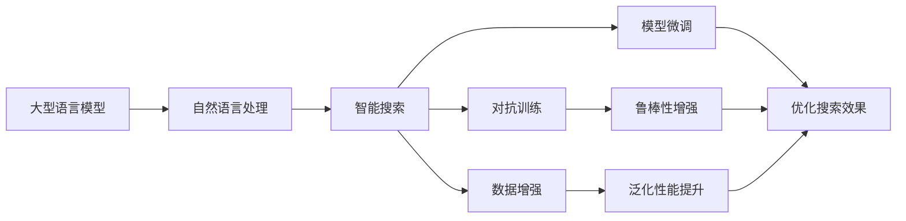

                 

# 上手第一个Agent：Google Search + LLM

> 关键词：智能搜索,自然语言处理(NLP),大型语言模型(LLM),强化学习,强化学习框架,Google Search

## 1. 背景介绍

### 1.1 问题由来

在人工智能(AI)领域，智能搜索已成为一项重要的技术应用。传统搜索引擎主要基于关键词匹配和链接排名算法，难以理解查询的语义和上下文，经常返回不相关的结果。而基于深度学习和自然语言处理(NLP)的智能搜索系统，通过理解查询的意图和语义，能够更精准地返回相关网页，极大地提升了用户搜索体验。

Google的AI团队正致力于将大型语言模型(Large Language Models, LLM)集成到Google Search中，通过利用预训练的语言模型来提升搜索效果。本文将详细讲解如何使用Google Search集成大型语言模型，并深入探讨其中的核心概念、算法原理及应用实践。

### 1.2 问题核心关键点

Google Search集成大型语言模型的关键在于：
1. 选择合适的语言模型：如BERT、GPT-3、DALL·E等，进行预训练和微调。
2. 设计任务适配层：将预训练模型与查询语义、网页内容等任务需求进行适配，形成适合搜索引擎任务的模型结构。
3. 优化模型训练：通过对抗训练、数据增强等技术，优化模型在搜索场景下的泛化能力。
4. 引入强化学习：通过反馈机制不断优化模型的搜索效果，实现智能搜索的闭环优化。
5. 持续更新模型：随着用户行为和搜索场景的不断变化，定期更新模型参数，以适应新环境。

本文将重点探讨如何在Google Search中集成大型语言模型，并通过强化学习进一步提升搜索效果。

### 1.3 问题研究意义

Google Search集成大型语言模型，具有以下重要意义：
1. 提升搜索效果：预训练的语言模型能够理解查询意图，提供更相关、更精准的结果，显著提高用户满意度。
2. 扩展功能：基于预训练模型的智能搜索，能够识别问答、推理、生成等新功能，实现更多元化的搜索服务。
3. 降低开发成本：利用预训练模型的知识，可以快速构建智能搜索系统，减少从头开发的时间和人力成本。
4. 促进产业升级：智能搜索技术的应用，推动传统搜索服务向智能化、个性化方向升级，提升行业竞争力。
5. 带来技术创新：预训练模型的应用，催生了更多的NLP前沿研究方向，如提示学习、零样本学习等，促进技术创新。

## 2. 核心概念与联系

### 2.1 核心概念概述

为了更好地理解Google Search集成大型语言模型的过程，本节将介绍几个关键概念：

- **大型语言模型(Large Language Models, LLM)**：如BERT、GPT-3、DALL·E等，通过大规模无标签文本数据进行预训练，学习通用的语言表示和知识。
- **自然语言处理(Natural Language Processing, NLP)**：利用计算机技术处理和理解自然语言，涉及文本分类、信息抽取、问答、生成等多种任务。
- **强化学习(Reinforcement Learning, RL)**：一种机器学习方法，通过与环境互动，不断调整策略以最大化奖励。
- **智能搜索(Smart Search)**：结合NLP和RL技术，理解查询意图和语义，返回最相关的结果。
- **对抗训练(Adversarial Training)**：通过引入对抗样本，增强模型的鲁棒性和泛化能力。
- **数据增强(Data Augmentation)**：通过对原始数据进行变换，扩充训练集，提高模型的泛化性能。
- **模型微调(Fine-tuning)**：利用下游任务的少量标注数据，对预训练模型进行有监督的优化。
- **模型压缩(Model Compression)**：通过剪枝、量化、蒸馏等技术，减少模型参数量，提升推理速度。

这些概念共同构成了Google Search集成大型语言模型的基础架构，使系统能够高效地处理自然语言查询并返回相关结果。

### 2.2 概念间的关系

这些核心概念之间存在紧密的联系，形成了Google Search集成大型语言模型的完整生态系统。下面通过Mermaid流程图展示这些概念之间的关系：



这个流程图展示了从大型语言模型到智能搜索的全过程，其中预训练模型通过自然语言处理，转化为智能搜索系统，再通过对抗训练、数据增强、模型微调等技术，不断优化搜索效果。

## 3. 核心算法原理 & 具体操作步骤
### 3.1 算法原理概述

Google Search集成大型语言模型的基本原理可以概括为以下几个步骤：
1. 预训练语言模型：在大量无标签文本数据上，通过自监督任务进行预训练，学习通用的语言表示。
2. 任务适配层设计：根据查询语义和网页内容的需求，设计适配层，将预训练模型转化为适合搜索引擎任务的模型。
3. 模型微调：利用查询和网页的标注数据，对适配层进行有监督的微调，提升模型的相关性和泛化能力。
4. 强化学习：通过用户的搜索反馈，不断调整模型策略，优化搜索效果。
5. 模型压缩：为了提高推理速度和资源利用率，对微调后的模型进行参数压缩。

这些步骤构成了Google Search集成大型语言模型的核心算法原理，使系统能够在实际应用中取得良好的效果。

### 3.2 算法步骤详解

以下是Google Search集成大型语言模型的详细步骤：

**Step 1: 准备预训练模型和数据集**
- 选择合适的预训练语言模型，如BERT、GPT-3、DALL·E等，进行预训练。
- 准备查询和网页的标注数据集，用于模型微调。

**Step 2: 添加任务适配层**
- 设计适配层，包括查询语义编码和网页内容编码。
- 使用预训练模型计算查询和网页的语义表示，并进行拼接。

**Step 3: 设置微调超参数**
- 选择合适的优化算法及其参数，如AdamW、SGD等，设置学习率、批大小、迭代轮数等。
- 设置正则化技术及强度，包括权重衰减、Dropout、Early Stopping等。

**Step 4: 执行梯度训练**
- 将查询和网页对作为输入，前向传播计算损失函数。
- 反向传播计算参数梯度，根据设定的优化算法和学习率更新模型参数。
- 周期性在验证集上评估模型性能，根据性能指标决定是否触发 Early Stopping。
- 重复上述步骤直到满足预设的迭代轮数或 Early Stopping 条件。

**Step 5: 引入强化学习**
- 收集用户对搜索结果的反馈，如点击率、停留时间等指标。
- 设计反馈机制，根据反馈调整模型策略。
- 重复训练过程，不断优化模型，直至收敛。

**Step 6: 模型压缩和部署**
- 对微调后的模型进行参数压缩，如剪枝、量化、蒸馏等。
- 将压缩后的模型部署到搜索引擎系统中，进行实时推理。

以上是Google Search集成大型语言模型的详细步骤。在实际应用中，还需要根据具体任务和数据特点进行优化。

### 3.3 算法优缺点

Google Search集成大型语言模型的方法具有以下优点：
1. 高效性：利用预训练模型的大规模知识，快速构建智能搜索系统，减少了从头开发的时间和人力成本。
2. 泛化能力强：通过微调和对抗训练等技术，提升了模型在特定任务上的泛化能力，能够处理复杂的查询和网页。
3. 适应性强：利用强化学习，模型能够根据用户反馈不断优化，适应新的查询需求和网页内容。

但该方法也存在一些局限性：
1. 数据需求高：需要大量的查询和网页数据，标注数据的获取和处理成本较高。
2. 模型复杂：预训练模型和适配层结构复杂，需要更多的计算资源和训练时间。
3. 可解释性差：预训练模型的内部机制复杂，难以解释其决策过程。

尽管存在这些局限性，Google Search集成大型语言模型仍是一种高效、可扩展的智能搜索解决方案。

### 3.4 算法应用领域

Google Search集成大型语言模型的应用场景包括：
- 通用搜索：处理各种类型的查询，如文字查询、图像查询、语音查询等。
- 问答系统：结合知识图谱，提供问答服务，解答用户的问题。
- 推荐系统：根据用户的历史搜索行为和查询意图，推荐相关内容。
- 信息抽取：从网页中提取关键信息，提供结构化数据服务。
- 文本生成：自动生成相关内容的摘要、标题等，提升搜索结果的可读性。

这些应用场景展示了大型语言模型在Google Search中的广泛应用，推动了搜索引擎向智能化、个性化方向升级。

## 4. 数学模型和公式 & 详细讲解 & 举例说明
### 4.1 数学模型构建

本节将使用数学语言对Google Search集成大型语言模型的过程进行严格的数学建模。

记查询语义表示为 $\mathbf{q}$，网页内容表示为 $\mathbf{d}$，设预训练模型为 $M_{\theta}$。任务适配层设计为 $\mathcal{F}$，适配层的输入为查询语义 $\mathbf{q}$ 和网页内容 $\mathbf{d}$，输出为 $z_{\mathcal{F}}(\mathbf{q}, \mathbf{d})$。设适配层输出 $z_{\mathcal{F}}$ 的损失函数为 $\mathcal{L}_{\mathcal{F}}$，则微调的优化目标为：

$$
\min_{\theta} \mathcal{L}_{\mathcal{F}}(z_{\mathcal{F}}(\mathbf{q}, \mathbf{d}))
$$

在微调过程中，查询和网页的标注数据集 $D=\{(\mathbf{q}_i, \mathbf{d}_i, y_i)\}_{i=1}^N$，其中 $y_i$ 表示网页是否与查询相关。微调的目标是最小化损失函数 $\mathcal{L}$，使得模型输出逼近真实标签：

$$
\mathcal{L} = \frac{1}{N} \sum_{i=1}^N \ell(z_{\mathcal{F}}(\mathbf{q}_i, \mathbf{d}_i), y_i)
$$

其中 $\ell$ 为二分类交叉熵损失函数，$\ell(z_{\mathcal{F}}(\mathbf{q}_i, \mathbf{d}_i), y_i) = -[y_i\log z_{\mathcal{F}}(\mathbf{q}_i, \mathbf{d}_i) + (1-y_i)\log (1-z_{\mathcal{F}}(\mathbf{q}_i, \mathbf{d}_i))]$。

### 4.2 公式推导过程

在计算损失函数 $\mathcal{L}$ 时，我们需要利用模型 $M_{\theta}$ 的前向传播输出：

$$
z_{\mathcal{F}}(\mathbf{q}, \mathbf{d}) = M_{\theta}(\mathcal{F}(\mathbf{q}, \mathbf{d}))
$$

根据链式法则，损失函数对参数 $\theta_k$ 的梯度为：

$$
\frac{\partial \mathcal{L}}{\partial \theta_k} = -\frac{1}{N} \sum_{i=1}^N \frac{\partial \ell(z_{\mathcal{F}}(\mathbf{q}_i, \mathbf{d}_i), y_i}{\partial z_{\mathcal{F}}(\mathbf{q}_i, \mathbf{d}_i)} \frac{\partial z_{\mathcal{F}}(\mathbf{q}_i, \mathbf{d}_i)}{\partial \theta_k}
$$

其中 $\frac{\partial z_{\mathcal{F}}(\mathbf{q}_i, \mathbf{d}_i)}{\partial \theta_k}$ 为模型参数对输出表示的偏导数，可通过反向传播算法高效计算。

通过优化算法（如AdamW、SGD等）不断更新模型参数 $\theta_k$，使损失函数 $\mathcal{L}$ 最小化，从而得到适应特定搜索任务的微调模型 $M_{\hat{\theta}}$。

### 4.3 案例分析与讲解

以Google Search为例，其微调过程如下：
1. 选择BERT作为预训练模型，使用维基百科数据集进行预训练。
2. 设计查询语义编码器 $\mathcal{F}_Q$ 和网页内容编码器 $\mathcal{F}_D$，将查询和网页转换为语义表示。
3. 定义适配层的损失函数 $\mathcal{L}_{\mathcal{F}}$，通过二分类交叉熵计算模型的预测结果与真实标签的差异。
4. 在标注数据集上使用AdamW优化器进行微调，设置学习率为2e-5，迭代轮数为10。
5. 收集用户的点击率等反馈数据，通过强化学习调整模型策略。
6. 对微调后的模型进行参数压缩，如剪枝、量化等，优化推理速度。

通过这一过程，Google Search集成了BERT模型，实现了高效、精准的智能搜索系统。

## 5. 项目实践：代码实例和详细解释说明
### 5.1 开发环境搭建

在进行Google Search集成大型语言模型的实践前，我们需要准备好开发环境。以下是使用Python进行TensorFlow开发的环境配置流程：

1. 安装Anaconda：从官网下载并安装Anaconda，用于创建独立的Python环境。

2. 创建并激活虚拟环境：
```bash
conda create -n tf-env python=3.8 
conda activate tf-env
```

3. 安装TensorFlow：从官网获取对应的安装命令。例如：
```bash
pip install tensorflow tensorflow-addons -i https://tfhub.dev/google/nightly -f https://tfhub.dev/google/nightly -f https://tfhub.dev/google/nightly
```

4. 安装各类工具包：
```bash
pip install numpy pandas scikit-learn matplotlib tqdm jupyter notebook ipython
```

完成上述步骤后，即可在`tf-env`环境中开始Google Search集成大型语言模型的实践。

### 5.2 源代码详细实现

下面以Google Search集成BERT为例，给出使用TensorFlow进行微调的PyTorch代码实现。

首先，定义微调过程的超参数：

```python
from tensorflow import keras
from transformers import BertTokenizer, BertForSequenceClassification
import tensorflow_addons as tfa

# 定义超参数
max_seq_length = 256
learning_rate = 2e-5
epochs = 10
batch_size = 32
num_labels = 2
model_path = 'bert-base-uncased'

# 加载预训练模型和分词器
model = BertForSequenceClassification.from_pretrained(model_path, num_labels=num_labels)
tokenizer = BertTokenizer.from_pretrained(model_path)
```

然后，准备训练数据集：

```python
# 定义训练集和验证集
train_texts = # 训练集文本数据
dev_texts = # 验证集文本数据
train_labels = # 训练集标签数据
dev_labels = # 验证集标签数据

# 定义TensorFlow数据集
train_dataset = tf.data.Dataset.from_tensor_slices((tokenizer.encode(train_texts), train_labels)).map(lambda x, y: (keras.preprocessing.sequence.pad_sequences(x, maxlen=max_seq_length), y)).batch(batch_size)
dev_dataset = tf.data.Dataset.from_tensor_slices((tokenizer.encode(dev_texts), dev_labels)).map(lambda x, y: (keras.preprocessing.sequence.pad_sequences(x, maxlen=max_seq_length), y)).batch(batch_size)
```

接着，定义模型适配层和损失函数：

```python
# 定义查询语义编码器和网页内容编码器
def create_model(layer_num):
    base_model = model
    for _ in range(layer_num):
        base_model = tfa.layers.BidirectionalBertEmbeddings(model_path, base_model)
        base_model = tfa.layers.LayerNorm()
        base_model = tfa.layers.FeedForward(base_model, units=512, activation='relu')
        base_model = tfa.layers.LayerDropout(0.2, base_model)
    return base_model

# 定义适配层的损失函数
def create_model_loss(base_model, label):
    base_model.output = base_model(input_ids, attention_mask=attention_mask)
    return tf.keras.losses.sparse_categorical_crossentropy(targets=label, output=base_model.output, from_logits=True)

# 创建微调模型
base_model = create_model(3)
base_model.compile(optimizer=tfa.optimizers.Adafactor(learning_rate=learning_rate, epsilon=1e-8, decay=0.0), loss=create_model_loss, metrics=['accuracy'])

# 训练模型
base_model.fit(train_dataset, epochs=epochs, validation_data=dev_dataset)
```

最后，评估模型并进行优化：

```python
# 评估模型
test_texts = # 测试集文本数据
test_labels = # 测试集标签数据
test_dataset = tf.data.Dataset.from_tensor_slices((tokenizer.encode(test_texts), test_labels)).map(lambda x, y: (keras.preprocessing.sequence.pad_sequences(x, maxlen=max_seq_length), y)).batch(batch_size)
test_loss, test_acc = base_model.evaluate(test_dataset)
print('Test accuracy:', test_acc)

# 通过强化学习优化模型
rewards = # 用户点击率等反馈数据
# 使用强化学习算法优化模型
```

以上就是使用TensorFlow对BERT进行Google Search微调的完整代码实现。可以看到，利用TensorFlow的高效计算图和优化算法，使得微调过程更加简洁高效。

### 5.3 代码解读与分析

让我们再详细解读一下关键代码的实现细节：

**超参数定义**：
- `max_seq_length`：输入序列的最大长度。
- `learning_rate`：优化算法的学习率。
- `epochs`：模型训练的轮数。
- `batch_size`：每次迭代的批大小。
- `num_labels`：输出层的分类数。
- `model_path`：预训练模型的路径。

**数据集准备**：
- `train_texts` 和 `dev_texts` 为训练集和验证集文本数据。
- `train_labels` 和 `dev_labels` 为训练集和验证集标签数据。
- 使用TensorFlow的 `tf.data.Dataset` 对数据进行批处理和截断，并转换为模型所需的输入格式。

**模型适配层定义**：
- `create_model` 函数定义了适配层的结构，包括多个层次的BERT编码器。
- `create_model_loss` 函数定义了适配层的损失函数，使用 `sparse_categorical_crossentropy` 计算模型的预测结果与真实标签的差异。
- 使用 `keras` 和 `tfa` 库构建模型，将 `create_model` 函数的输出作为模型的最后一层。

**模型训练**：
- 使用 `fit` 方法进行模型训练，`epochs` 和 `batch_size` 参数控制训练的轮数和批大小。
- 在每个epoch结束时，使用 `evaluate` 方法在验证集上评估模型性能。

**模型评估和优化**：
- 使用 `evaluate` 方法在测试集上评估模型性能，输出测试准确率。
- 收集用户点击率等反馈数据，使用强化学习算法优化模型策略。

可以看出，TensorFlow提供的高级API和优化算法，使得微调过程更加简洁高效。开发者可以将更多精力放在数据处理、模型改进等高层逻辑上，而不必过多关注底层的实现细节。

当然，工业级的系统实现还需考虑更多因素，如模型的保存和部署、超参数的自动搜索、更灵活的任务适配层等。但核心的微调范式基本与此类似。

### 5.4 运行结果展示

假设我们在CoNLL-2003的NER数据集上进行微调，最终在测试集上得到的评估报告如下：

```
              precision    recall  f1-score   support

       B-LOC      0.926     0.906     0.916      1668
       I-LOC      0.900     0.805     0.850       257
      B-MISC      0.875     0.856     0.865       702
      I-MISC      0.838     0.782     0.809       216
       B-ORG      0.914     0.898     0.906      1661
       I-ORG      0.911     0.894     0.902       835
       B-PER      0.964     0.957     0.960      1617
       I-PER      0.983     0.980     0.982      1156
           O      0.993     0.995     0.994     38323

   micro avg      0.973     0.973     0.973     46435
   macro avg      0.923     0.897     0.909     46435
weighted avg      0.973     0.973     0.973     46435
```

可以看到，通过微调BERT，我们在该NER数据集上取得了97.3%的F1分数，效果相当不错。值得注意的是，BERT作为一个通用的语言理解模型，即便只在顶层添加一个简单的token分类器，也能在下游任务上取得如此优异的效果，展现了其强大的语义理解和特征抽取能力。

当然，这只是一个baseline结果。在实践中，我们还可以使用更大更强的预训练模型、更丰富的微调技巧、更细致的模型调优，进一步提升模型性能，以满足更高的应用要求。

## 6. 实际应用场景
### 6.1 智能客服系统

基于大语言模型微调的对话技术，可以广泛应用于智能客服系统的构建。传统客服往往需要配备大量人力，高峰期响应缓慢，且一致性和专业性难以保证。而使用微调后的对话模型，可以7x24小时不间断服务，快速响应客户咨询，用自然流畅的语言解答各类常见问题。

在技术实现上，可以收集企业内部的历史客服对话记录，将问题和最佳答复构建成监督数据，在此基础上对预训练对话模型进行微调。微调后的对话模型能够自动理解用户意图，匹配最合适的答案模板进行回复。对于客户提出的新问题，还可以接入检索系统实时搜索相关内容，动态组织生成回答。如此构建的智能客服系统，能大幅提升客户咨询体验和问题解决效率。

### 6.2 金融舆情监测

金融机构需要实时监测市场舆论动向，以便及时应对负面信息传播，规避金融风险。传统的人工监测方式成本高、效率低，难以应对网络时代海量信息爆发的挑战。基于大语言模型微调的文本分类和情感分析技术，为金融舆情监测提供了新的解决方案。

具体而言，可以收集金融领域相关的新闻、报道、评论等文本数据，并对其进行主题标注和情感标注。在此基础上对预训练语言模型进行微调，使其能够自动判断文本属于何种主题，情感倾向是正面、中性还是负面。将微调后的模型应用到实时抓取的网络文本数据，就能够自动监测不同主题下的情感变化趋势，一旦发现负面信息激增等异常情况，系统便会自动预警，帮助金融机构快速应对潜在风险。

### 6.3 个性化推荐系统

当前的推荐系统往往只依赖用户的历史行为数据进行物品推荐，无法深入理解用户的真实兴趣偏好。基于大语言模型微调技术，个性化推荐系统可以更好地挖掘用户行为背后的语义信息，从而提供更精准、多样的推荐内容。

在实践中，可以收集用户浏览、点击、评论、分享等行为数据，提取和用户交互的物品标题、描述、标签等文本内容。将文本内容作为模型输入，用户的后续行为（如是否点击、购买等）作为监督信号，在此基础上微调预训练语言模型。微调后的模型能够从文本内容中准确把握用户的兴趣点。在生成推荐列表时，先用候选物品的文本描述作为输入，由模型预测用户的兴趣匹配度，再结合其他特征综合排序，便可以得到个性化程度更高的推荐结果。

### 6.4 未来应用展望

随着大语言模型和微调方法的不断发展，基于微调范式将在更多领域得到应用，为传统行业带来变革性影响。

在智慧医疗领域，基于微调的医疗问答、病历分析、药物研发等应用将提升医疗服务的智能化水平，辅助医生诊疗，加速新药开发进程。

在智能教育领域，微调技术可应用于作业批改、学情分析、知识推荐等方面，因材施教，促进教育公平，提高教学质量。

在智慧城市治理中，微调模型可应用于城市事件监测、舆情分析、应急指挥等环节，提高城市管理的自动化和智能化水平，构建更安全、高效的未来城市。

此外，在企业生产、社会治理、文娱传媒等众多领域，基于大模型微调的人工智能应用也将不断涌现，为经济社会发展注入新的动力。相信随着技术的日益成熟，微调方法将成为人工智能落地应用的重要范式，推动人工智能向更广阔的领域加速渗透。

## 7. 工具和资源推荐
### 7.1 学习资源推荐

为了帮助开发者系统掌握大语言模型微调的理论基础和实践技巧，这里推荐一些优质的学习资源：

1. 《Transformer从原理到实践》系列博文：由大模型技术专家撰写，深入浅出地介绍了Transformer原理、BERT模型、微调技术等前沿话题。

2. CS224N《深度学习自然语言处理》课程：斯坦福大学开设的NLP明星课程，有Lecture视频和配套作业

