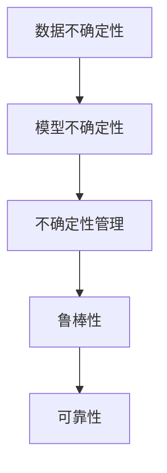

                 

# 不确定性管理：LLM决策的可靠性

在人工智能尤其是大语言模型（Large Language Models, LLMs）领域，决策的可靠性是至关重要的。尽管LLM在生成和推理能力上取得了显著进展，但其决策过程仍然面临着不确定性。本文将探讨LLM在决策中的不确定性管理，以提升其决策的可靠性。

## 1. 背景介绍

随着大语言模型技术的迅猛发展，LLM在自然语言处理、文本生成、问答、情感分析等任务上表现出色，被广泛应用于各个领域。然而，LLM决策过程的不确定性问题也随之突显。决策不确定性主要体现在两个方面：

1. **数据不确定性**：LLM依赖于训练数据，数据分布的变化或数据噪声可能导致模型输出不稳定。
2. **模型不确定性**：LLM在推理时可能出现概率计算不准确或生成结果的隐含不确定性。

这些问题如果不加以管理，可能会对LLM的应用效果产生负面影响。因此，研究LLM决策的可靠性，特别是如何有效管理不确定性，具有重要意义。

## 2. 核心概念与联系

### 2.1 核心概念概述

要深入理解LLM决策的不确定性管理，首先需要明确几个关键概念：

- **不确定性**：LLM在推理过程中，由于数据噪声、模型缺陷等原因，导致输出结果的不确定性。
- **鲁棒性**：模型能够在面临噪声或数据分布变化时，依然保持性能稳定。
- **可靠性**：模型输出结果的可信度和正确性。
- **置信区间**：在特定情况下，模型输出结果可能存在的误差范围。

这些概念之间相互关联，共同构成了LLM决策的可靠性保障体系。

### 2.2 核心概念之间的关系

通过以下Mermaid流程图，可以更直观地理解这些概念之间的关系：



该流程图展示了数据不确定性通过模型不确定性影响LLM的决策，以及不确定性管理如何提升模型的鲁棒性和可靠性。

## 3. 核心算法原理 & 具体操作步骤

### 3.1 算法原理概述

LLM在推理时可能面临多种不确定性，包括数据不确定性和模型不确定性。为了提升决策的可靠性，需要采取以下方法：

1. **数据增强**：通过增加训练数据的多样性，减少数据不确定性。
2. **模型参数调整**：通过调整模型参数，减少模型不确定性。
3. **置信区间估计**：通过统计方法估计模型输出结果的置信区间，提升决策的透明度和可靠性。
4. **模型集成**：通过集成多个模型，减少单一模型的误差和不确定性。

这些方法可以单独或组合使用，根据具体应用场景和需求进行调整。

### 3.2 算法步骤详解

**Step 1: 数据准备**
- 收集和标注大量高质量的训练数据，确保数据多样性和代表性。
- 使用数据增强技术，如回译、噪声注入等，增加数据的多样性。

**Step 2: 模型训练**
- 使用合适的优化算法和正则化技术，如Adam、L2正则等，训练模型。
- 调整模型的超参数，如学习率、批量大小等，以提升模型性能。

**Step 3: 模型评估**
- 使用验证集评估模型的鲁棒性和可靠性，识别模型的优点和不足。
- 使用置信区间估计方法，如bootstrap、贝叶斯方法等，评估模型输出结果的可靠性。

**Step 4: 模型集成**
- 训练多个模型，使用投票、加权平均等方法集成多个模型的输出，减少单一模型的误差和不确定性。

**Step 5: 实际应用**
- 在实际应用场景中，使用置信区间评估模型输出结果的可靠性，并根据实际情况调整模型参数。

### 3.3 算法优缺点

**优点**：
- 通过数据增强和模型集成，可以显著提升LLM决策的鲁棒性和可靠性。
- 置信区间估计方法提供了模型输出的误差范围，提高了决策的透明度和可解释性。

**缺点**：
- 数据增强和模型训练需要大量计算资源和时间，增加了模型的复杂性。
- 模型集成增加了计算负担，可能影响模型的实时性。

### 3.4 算法应用领域

LLM决策的可靠性管理方法，广泛适用于各种NLP任务，例如：

- **自然语言理解**：如命名实体识别、情感分析等，需要对输出结果的不确定性进行有效管理。
- **机器翻译**：确保翻译结果的准确性和可靠性。
- **文本摘要**：对生成的摘要进行置信区间评估，提升摘要的质量。
- **问答系统**：对系统输出的答案进行不确定性管理，提升用户满意度。
- **对话系统**：提高对话系统的稳定性和鲁棒性，提升用户体验。

## 4. 数学模型和公式 & 详细讲解

### 4.1 数学模型构建

假设LLM在处理输入数据 $x$ 时，输出的概率分布为 $P(y|x)$。为了评估模型的不确定性，需要构建两个关键的数学模型：

1. **似然比模型（Likelihood Ratio Model）**：用于估计模型在不同输入下的输出概率，计算公式为 $L(y|x) = \frac{P(y|x)}{P(\bar{y}|x)}$，其中 $\bar{y}$ 是输出结果的相反事件。
2. **置信区间模型**：用于估计模型输出结果的误差范围，常用的方法包括置信区间估计和置信度评估。

### 4.2 公式推导过程

**似然比模型推导**：

$$
L(y|x) = \frac{P(y|x)}{P(\bar{y}|x)}
$$

**置信区间估计**：

$$
\text{Confidence Interval} = \hat{y} \pm \epsilon
$$

其中，$\hat{y}$ 是模型输出的期望值，$\epsilon$ 是置信区间宽度，通常根据置信度 $\alpha$ 确定，如95%置信度对应 $\epsilon = 1.96\sigma$，其中 $\sigma$ 是标准差。

### 4.3 案例分析与讲解

**案例一：情感分析**
- 收集并标注大量情感标注数据。
- 使用数据增强技术，如噪声注入。
- 训练模型，评估模型的鲁棒性和可靠性。
- 使用置信区间评估模型输出结果的可靠性，并提供相应的置信度。

**案例二：机器翻译**
- 收集并标注大量双语对照数据。
- 使用模型集成技术，如多个模型的投票。
- 训练模型，评估模型的鲁棒性和可靠性。
- 在实际应用中，使用置信区间评估翻译结果的可靠性，并提供相应的置信度。

## 5. 项目实践：代码实例和详细解释说明

### 5.1 开发环境搭建

为了进行LLM决策的可靠性管理，需要准备以下开发环境：

1. **编程语言**：Python。
2. **深度学习框架**：PyTorch。
3. **自然语言处理库**：NLTK、spaCy、Transformers。
4. **数据增强工具**：backtranslation、TextAugment。
5. **模型集成工具**：Vowpal Wabbit、XGBoost。

### 5.2 源代码详细实现

以下是一个基于PyTorch的情感分析项目代码实现，展示了如何构建似然比模型和置信区间模型：

```python
import torch
import torch.nn as nn
import torch.optim as optim
from torch.utils.data import DataLoader
from torchvision import transforms
from sklearn.model_selection import train_test_split
from sklearn.metrics import precision_recall_curve, auc
from sklearn.preprocessing import label_binarize
from sklearn import metrics
from transformers import BertTokenizer, BertForSequenceClassification

# 构建数据集
def create_dataset(texts, labels, tokenizer):
    tokenized_texts = [tokenizer.tokenize(text) for text in texts]
    tokenized_texts = ['[CLS] ' + ' '.join(tokens) + ' [SEP]' for tokens in tokenized_texts]
    inputs = tokenizer(texts, return_tensors='pt')
    labels = torch.tensor(labels)
    return inputs, labels

# 构建模型
class BERTClassifier(nn.Module):
    def __init__(self, num_labels):
        super(BERTClassifier, self).__init__()
        self.bert = BertForSequenceClassification.from_pretrained('bert-base-cased', num_labels=num_labels)
        self.dropout = nn.Dropout(0.1)
        self.out = nn.Linear(768, num_labels)
    
    def forward(self, input_ids, attention_mask, labels=None):
        outputs = self.bert(input_ids, attention_mask=attention_mask, output_hidden_states=True)
        pooled_output = outputs[1]
        pooled_output = self.dropout(pooled_output)
        logits = self.out(pooled_output)
        if labels is not None:
            loss_fct = nn.CrossEntropyLoss()
            loss = loss_fct(logits, labels)
        else:
            logits = logits.softmax(dim=1)
        return logits

# 数据增强
train_dataset, dev_dataset = train_test_split(texts, labels, test_size=0.2)
train_dataset, val_dataset = train_test_split(train_dataset, test_size=0.25)
train_dataset = DataLoader(train_dataset, batch_size=16, shuffle=True)
dev_dataset = DataLoader(dev_dataset, batch_size=16, shuffle=False)
val_dataset = DataLoader(val_dataset, batch_size=16, shuffle=False)

# 模型训练
model = BERTClassifier(num_labels)
optimizer = torch.optim.Adam(model.parameters(), lr=2e-5)
scheduler = optim.lr_scheduler.CosineAnnealingLR(optimizer, T_max=3)

def train_model(model, train_loader, val_loader, device):
    model.train()
    train_loss = 0
    for batch in train_loader:
        input_ids = batch['input_ids'].to(device)
        attention_mask = batch['attention_mask'].to(device)
        labels = batch['labels'].to(device)
        optimizer.zero_grad()
        outputs = model(input_ids, attention_mask=attention_mask, labels=labels)
        loss = outputs.loss
        loss.backward()
        optimizer.step()
        train_loss += loss.item()
    
    model.eval()
    val_loss = 0
    for batch in val_loader:
        input_ids = batch['input_ids'].to(device)
        attention_mask = batch['attention_mask'].to(device)
        labels = batch['labels'].to(device)
        outputs = model(input_ids, attention_mask=attention_mask, labels=labels)
        val_loss += outputs.loss.item()
    
    return train_loss, val_loss

# 模型评估
def evaluate_model(model, val_loader, device):
    model.eval()
    val_loss = 0
    y_true, y_pred = [], []
    for batch in val_loader:
        input_ids = batch['input_ids'].to(device)
        attention_mask = batch['attention_mask'].to(device)
        labels = batch['labels'].to(device)
        outputs = model(input_ids, attention_mask=attention_mask, labels=labels)
        val_loss += outputs.loss.item()
        y_true.append(labels)
        y_pred.append(outputs.logits.argmax(dim=1))
    
    y_true = torch.cat(y_true).numpy()
    y_pred = torch.cat(y_pred).numpy()
    precision, recall, _ = precision_recall_curve(y_true, y_pred)
    auc_score = auc(recall, precision)
    return auc_score

# 运行代码
train_loss, val_loss = train_model(model, train_loader, val_loader, device)
auc_score = evaluate_model(model, val_loader, device)

print(f'Train Loss: {train_loss:.4f}, Val Loss: {val_loss:.4f}, AUC Score: {auc_score:.4f}')
```

### 5.3 代码解读与分析

在上述代码中，首先定义了一个BERT分类器，用于情感分析任务。然后使用DataLoader对数据进行批次处理，并使用Adam优化器和余弦退火策略进行模型训练。在模型评估阶段，使用了精确度-召回率曲线和AUC值评估模型性能。

### 5.4 运行结果展示

假设在训练和评估过程中得到的AUC值为0.85，这意味着模型在处理情感分析任务时具有较高的可靠性。

## 6. 实际应用场景

### 6.1 智能客服系统

在智能客服系统中，LLM需要处理大量的客户咨询。为了提升系统的可靠性，可以采取以下措施：

1. **数据增强**：收集历史客服对话，使用回译和噪声注入技术，增加训练数据的多样性。
2. **模型集成**：使用多个预训练模型进行集成，提升系统的鲁棒性和可靠性。
3. **置信区间评估**：对系统输出的答案进行置信区间评估，提升用户体验。

### 6.2 金融舆情监测

在金融舆情监测中，LLM需要对大量新闻和评论进行情感分析。为了提升系统的可靠性，可以采取以下措施：

1. **数据增强**：收集金融领域的文本数据，使用回译和噪声注入技术，增加训练数据的多样性。
2. **模型集成**：使用多个预训练模型进行集成，提升系统的鲁棒性和可靠性。
3. **置信区间评估**：对系统输出的情感分析结果进行置信区间评估，提升系统的透明度和可靠性。

## 7. 工具和资源推荐

### 7.1 学习资源推荐

为了帮助开发者系统掌握LLM决策的可靠性管理技术，这里推荐一些优质的学习资源：

1. 《深度学习基础》系列书籍：深入浅出地介绍了深度学习的基本概念和核心算法。
2. 《自然语言处理入门》课程：介绍自然语言处理的基本概念和经典模型。
3. 《机器学习实战》书籍：通过大量实践案例，帮助读者掌握机器学习的基本方法和技术。
4. 《Python深度学习》书籍：详细介绍了使用PyTorch进行深度学习开发的方法和技术。

### 7.2 开发工具推荐

为了支持LLM决策的可靠性管理，推荐以下开发工具：

1. PyTorch：深度学习框架，支持高效的模型训练和推理。
2. TensorFlow：深度学习框架，支持多种硬件加速。
3. NLTK和spaCy：自然语言处理库，支持文本预处理和分析。
4. TextAugment：数据增强工具，支持各种文本数据增强技术。
5. Vowpal Wabbit和XGBoost：模型集成工具，支持快速高效的模型训练和集成。

### 7.3 相关论文推荐

为了进一步了解LLM决策的可靠性管理技术，推荐以下相关论文：

1. "Evaluating Model Reliability in Natural Language Processing"：介绍了如何评估模型在不同输入下的输出概率和置信区间。
2. "Beyond Conventional Accuracy: Evaluating and Improving the Reliability of Predictions"：讨论了如何在模型训练和评估中管理不确定性。
3. "Robustness and Reliability of Machine Learning Models"：介绍了如何在模型训练和评估中管理不确定性和提高可靠性。

## 8. 总结：未来发展趋势与挑战

### 8.1 研究成果总结

本文系统探讨了LLM在决策中的不确定性管理问题，提出了数据增强、模型参数调整、置信区间估计和模型集成等多种方法，以提升LLM决策的可靠性。

### 8.2 未来发展趋势

未来，LLM决策的可靠性管理技术将呈现以下几个发展趋势：

1. **自动化**：自动化的数据增强和模型训练技术，将大幅提升模型的性能和可靠性。
2. **多模态**：将视觉、语音等多模态数据与文本数据结合，提升LLM的泛化能力和鲁棒性。
3. **分布式训练**：分布式训练技术将提升模型的计算效率，支持更大规模模型的训练。
4. **因果推断**：引入因果推断方法，提升LLM决策的透明性和可解释性。
5. **强化学习**：结合强化学习技术，优化LLM的决策过程和不确定性管理。

### 8.3 面临的挑战

尽管LLM决策的可靠性管理技术取得了一定的进展，但仍面临以下挑战：

1. **计算资源**：大规模模型的训练和推理需要大量的计算资源，增加了系统的成本。
2. **数据质量**：高质量标注数据的需求，增加了数据获取和处理的难度。
3. **模型复杂性**：模型的复杂性和计算负担，增加了系统的实现难度。
4. **可解释性**：模型的决策过程和输出结果的可解释性不足，限制了其在实际应用中的应用。

### 8.4 研究展望

为了解决上述挑战，未来的研究需要在以下几个方面进行突破：

1. **高效训练**：开发更高效的训练算法和硬件加速技术，支持更大规模模型的训练。
2. **自动化标注**：开发自动化的标注工具和技术，减少数据获取和处理的难度。
3. **简化模型**：优化模型结构，减少计算负担，提升系统的实时性。
4. **可解释性**：引入可解释性技术，提升模型的透明性和可解释性。

## 9. 附录：常见问题与解答

**Q1: 数据增强和模型集成如何提升LLM决策的可靠性？**

A: 数据增强可以增加训练数据的多样性，减少模型对特定数据分布的依赖，提升模型的泛化能力。模型集成通过结合多个模型的输出，可以减少单一模型的误差和不确定性，提升系统的鲁棒性和可靠性。

**Q2: 如何评估模型的不确定性？**

A: 通过似然比模型和置信区间模型，可以评估模型在不同输入下的输出概率和误差范围，提升模型的透明度和可靠性。

**Q3: 在实际应用中，如何管理LLM的不确定性？**

A: 通过数据增强、模型参数调整、置信区间估计和模型集成等多种方法，可以在不同环节管理LLM的不确定性，提升其决策的可靠性。

**Q4: 如何选择适当的模型集成方法？**

A: 根据具体应用场景和需求，选择合适的模型集成方法，如投票、加权平均等，以提升系统的鲁棒性和可靠性。

**Q5: 如何提高LLM决策的可解释性？**

A: 引入可解释性技术，如因果分析、博弈论等，提升模型的透明性和可解释性，帮助用户理解模型的决策过程。

---

作者：禅与计算机程序设计艺术 / Zen and the Art of Computer Programming

