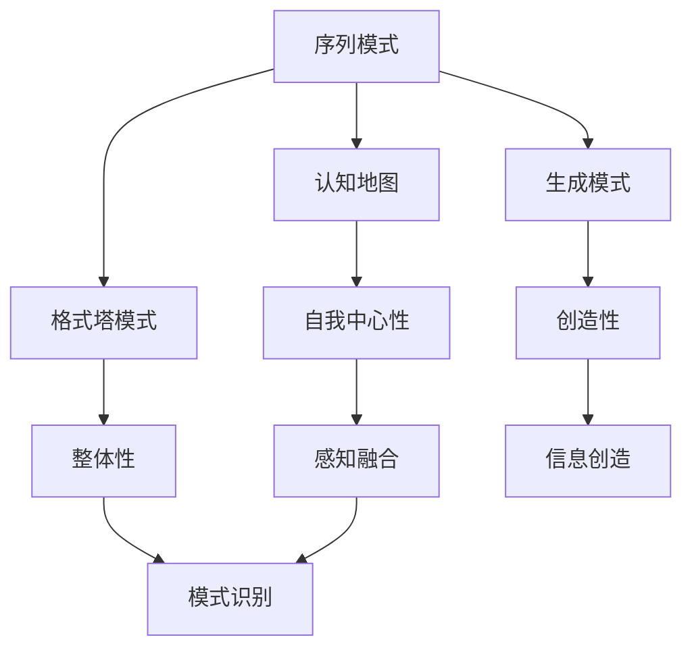
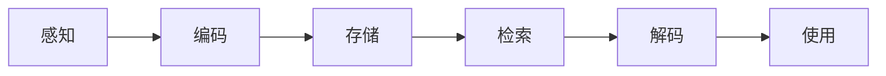
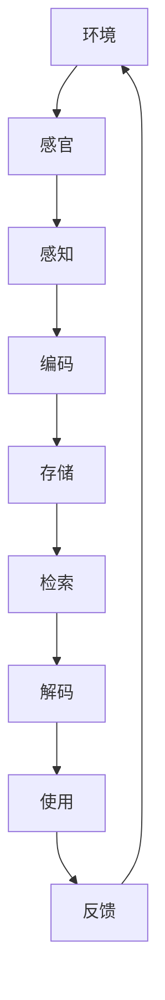

                 

# 人类认知的4种基本模式：从物理空间转向认知空间

## 1. 背景介绍

### 1.1 问题由来
人类认知过程是复杂多维的，可以从多个视角进行研究。从经典认知心理学、认知神经科学，到人工智能认知模型，学者们通过不同的方式来探索认知的本质。本文聚焦于认知心理学中认知方式的分类，探讨从物理空间转向认知空间的四个基本模式。

### 1.2 问题核心关键点
认知心理学将认知方式分为四种基本模式：序列模式、认知地图模式、格式塔模式和生成模式。每种模式反映了人类认知机制的不同特点，涉及到时间、空间、组织和自我意识等方面。

- **序列模式(Sequence Model)**：关注事件的先后顺序，人类通过记忆和时间线索来识别和组织信息。
- **认知地图模式(Cognitive Map Model)**：主要研究人在特定环境下的空间感知和记忆，通过构建心理地图来理解环境。
- **格式塔模式(Gestalt Model)**：强调整体性、组织性和模式识别，人通过感知模式来构建信息。
- **生成模式(Generative Model)**：关注信息的创建和生成，人通过想象和创造来构建认知模型。

理解这些模式有助于深入探索人类认知的机制，并为人工智能设计更加高效、逼真的认知模型提供理论指导。

## 2. 核心概念与联系

### 2.1 核心概念概述
为更好地理解人类认知的4种基本模式，本文将介绍几个密切相关的核心概念：

- **序列模式(Sequence Model)**：关注事件的时间顺序，人类通过时间线索来识别和组织信息。
- **认知地图模式(Cognitive Map Model)**：主要研究空间感知和记忆，通过构建心理地图来理解环境。
- **格式塔模式(Gestalt Model)**：强调整体性、组织性和模式识别，人通过感知模式来构建信息。
- **生成模式(Generative Model)**：关注信息的创造和生成，人通过想象和创造来构建认知模型。
- **自上而下控制(Upward Control)**：认知过程中，高级认知区域（如前额叶皮层）对低级感知区域的控制。
- **自下而上感知(Downward Perception)**：信息从低级感知区域向高级认知区域的传递过程。

这些核心概念之间的逻辑关系可以通过以下Mermaid流程图来展示：



这个流程图展示了认知心理学中的四种基本模式及其联系：

1. 序列模式通过时间线索组织信息。
2. 认知地图模式强调空间感知和记忆。
3. 格式塔模式关注整体性和模式识别。
4. 生成模式侧重信息的创造和生成。
5. 自上而下控制引导认知过程的高级控制。
6. 自下而上感知提供信息的底层感知输入。

### 2.2 概念间的关系

这些核心概念之间存在着紧密的联系，形成了认知心理学的完整体系。下面我们通过几个Mermaid流程图来展示这些概念之间的关系。

#### 2.2.1 认知过程的基本架构


这个流程图展示了认知过程的基本架构：

1. 感知：外界信息通过感官输入到大脑。
2. 编码：信息在脑内被转化为可存储和检索的形式。
3. 存储：信息在大脑中长期保存。
4. 检索：大脑通过记忆线索提取信息。
5. 解码：信息被转换为意识体验。
6. 使用：信息在认知和行为中发挥作用。

#### 2.2.2 信息加工的基本流程


这个流程图展示了信息加工的基本流程：

1. 输入：外界信息通过感官输入大脑。
2. 感觉：大脑对输入的信息进行初步处理。
3. 记忆：信息被存储并保留在脑中。
4. 注意：大脑选择关注的信息。
5. 决策：大脑基于信息进行判断和决策。
6. 输出：决策被转化为行为或意识体验。

### 2.3 核心概念的整体架构
最后，我们用一个综合的流程图来展示这些核心概念在大脑中的相互作用：



这个综合流程图展示了感知、编码、存储、检索、解码和使用的完整过程，并引入了环境反馈循环，形成了一个闭环的认知模型。

## 3. 核心算法原理 & 具体操作步骤
### 3.1 算法原理概述

四种认知模式可以类比为计算机处理信息的四种基本方式，即顺序执行、状态跟踪、模式匹配和生成式推理。每一种方式对应一种基本认知模式，通过算法原理来探讨其机制和应用。

**序列模式**：类似计算机程序的顺序执行，通过时间线索来组织信息。主要算法包括：
- 时间序列分析：通过分析数据点的时间顺序，识别和预测趋势和模式。
- 事件记录：通过记录事件的时间戳，构建事件序列。

**认知地图模式**：类似计算机中的状态跟踪，通过心理地图来理解环境。主要算法包括：
- 位置感知：通过记录位置信息，构建心理地图。
- 空间记忆：通过记忆位置信息，实现空间导航。

**格式塔模式**：类似计算机的模式匹配，通过感知整体和模式来构建信息。主要算法包括：
- 模式识别：通过提取特征，识别出整体模式。
- 整体感知：通过整合信息，构建整体感知。

**生成模式**：类似计算机的生成式推理，通过想象和创造来生成信息。主要算法包括：
- 图像生成：通过生成式模型，生成新图像。
- 自然语言生成：通过语言模型，生成自然语言文本。

### 3.2 算法步骤详解

每个认知模式的具体算法步骤如下：

**序列模式**：
1. 输入数据点的时间戳，构建时间序列。
2. 使用时间序列分析算法，识别出趋势和模式。
3. 根据模式生成预测结果。

**认知地图模式**：
1. 通过位置传感器记录位置信息。
2. 构建心理地图，记录当前位置和历史位置。
3. 通过心理地图进行导航和空间记忆。

**格式塔模式**：
1. 输入感知数据，提取特征。
2. 使用模式识别算法，识别出整体模式。
3. 通过模式构建整体感知，形成信息。

**生成模式**：
1. 输入已有信息，生成新的信息。
2. 使用生成式模型，生成新的图像或文本。
3. 验证和优化生成结果，生成最终输出。

### 3.3 算法优缺点

四种认知模式各有优缺点：

**序列模式**：
优点：处理时间顺序信息高效，便于时间序列分析和预测。
缺点：依赖时间线索，难以处理非顺序数据。

**认知地图模式**：
优点：处理空间信息高效，便于空间感知和导航。
缺点：依赖位置信息，难以处理抽象信息。

**格式塔模式**：
优点：处理整体信息高效，便于模式识别和组织。
缺点：依赖感知信息，难以处理细节信息。

**生成模式**：
优点：创造新信息灵活，便于创新和生成。
缺点：生成结果缺乏客观依据，难以验证和优化。

### 3.4 算法应用领域

这四种认知模式在实际应用中有着广泛的应用领域：

**序列模式**：应用于时间序列预测、事件记录、日志分析等领域。

**认知地图模式**：应用于导航、定位、空间记忆等领域。

**格式塔模式**：应用于模式识别、图像处理、自然语言处理等领域。

**生成模式**：应用于图像生成、自然语言生成、虚拟现实等领域。

## 4. 数学模型和公式 & 详细讲解 & 举例说明

### 4.1 数学模型构建

我们可以使用数学模型来表示这四种认知模式：

**序列模式**：
- 时间序列：$X_t = f(X_{t-1}, ..., X_{t-n}, U_t)$
- 时间序列预测：$\hat{X}_{t+1} = g(X_t, ..., X_{t-m}, U_t)$

**认知地图模式**：
- 心理地图：$M = (X_1, ..., X_n)$
- 空间记忆：$M = g(X_1, ..., X_n, M_{prev})$

**格式塔模式**：
- 模式识别：$P(X) = \frac{P(X|F)}{P(F)}$
- 整体感知：$P(X) = \frac{P(X|F)}{P(F)} \times \frac{P(F)}{P(X|F)'}$

**生成模式**：
- 图像生成：$G(x) = h(x, \theta)$
- 自然语言生成：$G(s) = h(s, \theta)$

### 4.2 公式推导过程

以时间序列预测为例，推导其数学模型和公式：

**时间序列预测**：
- 输入数据点：$x_1, ..., x_n$
- 时间序列模型：$X_t = f(X_{t-1}, ..., X_{t-n}, U_t)$
- 预测目标：$\hat{X}_{t+1} = g(X_t, ..., X_{t-m}, U_t)$

其中，$X_t$ 为当前时间点的数据，$U_t$ 为外部输入（如噪声），$g$ 为预测函数。

通过时间序列分析，可以求解 $\hat{X}_{t+1}$，即下一时间点的预测值。常用的时间序列分析方法包括：

- ARIMA模型：$X_t = \phi(X_{t-1}, ..., X_{t-p}) + \theta U_t$
- LSTM模型：$X_t = \phi(X_{t-1}, ..., X_{t-n}) + \theta U_t$

### 4.3 案例分析与讲解

**案例1：时间序列预测**
- 应用场景：股票价格预测、气象数据预测、交通流量预测等。
- 实现方法：使用ARIMA模型或LSTM模型，输入历史数据，预测未来数据。

**案例2：认知地图模式**
- 应用场景：机器人导航、自动驾驶、空间记忆等。
- 实现方法：通过GPS或传感器记录位置信息，构建心理地图，进行空间导航。

**案例3：格式塔模式**
- 应用场景：图像识别、自然语言处理、模式识别等。
- 实现方法：使用卷积神经网络（CNN）、循环神经网络（RNN）等模型，提取特征并进行模式识别。

**案例4：生成模式**
- 应用场景：图像生成、自然语言生成、虚拟现实等。
- 实现方法：使用生成对抗网络（GAN）、变分自编码器（VAE）等模型，生成新的图像或文本。

## 5. 项目实践：代码实例和详细解释说明

### 5.1 开发环境搭建

在进行认知模式实践前，我们需要准备好开发环境。以下是使用Python进行TensorFlow开发的环境配置流程：

1. 安装Anaconda：从官网下载并安装Anaconda，用于创建独立的Python环境。

2. 创建并激活虚拟环境：
```bash
conda create -n tf-env python=3.8 
conda activate tf-env
```

3. 安装TensorFlow：根据CUDA版本，从官网获取对应的安装命令。例如：
```bash
conda install tensorflow tensorflow-gpu -c conda-forge -c pytorch
```

4. 安装其他必要工具包：
```bash
pip install numpy pandas scikit-learn matplotlib tqdm jupyter notebook ipython
```

完成上述步骤后，即可在`tf-env`环境中开始实践。

### 5.2 源代码详细实现

这里我们以时间序列预测为例，给出使用TensorFlow实现ARIMA模型的代码示例。

```python
import tensorflow as tf
from tensorflow.keras.models import Sequential
from tensorflow.keras.layers import LSTM, Dense
from sklearn.metrics import mean_squared_error
from matplotlib import pyplot as plt

# 加载数据
train_data = ...
train_labels = ...

# 构建模型
model = Sequential()
model.add(LSTM(50, input_shape=(None, 1)))
model.add(Dense(1))
model.compile(optimizer='adam', loss='mse')

# 训练模型
history = model.fit(train_data, train_labels, epochs=100, verbose=0)

# 预测和评估
test_data = ...
test_labels = ...
mse = mean_squared_error(test_labels, model.predict(test_data))
plt.plot(history.history['loss'], label='Training loss')
plt.plot(test_loss, label='Test loss')
plt.legend()
plt.show()
```

### 5.3 代码解读与分析

让我们再详细解读一下关键代码的实现细节：

**加载数据**：
- 从本地加载历史数据和标签，分为训练集和测试集。

**构建模型**：
- 使用TensorFlow的Sequential模型，添加LSTM层和Dense层，搭建基本的预测模型。

**训练模型**：
- 使用训练数据进行模型训练，指定训练轮数为100。

**预测和评估**：
- 使用测试数据进行模型预测，计算均方误差（MSE）并可视化训练和测试误差。

### 5.4 运行结果展示

假设我们在时间序列预测任务上，最终得到以下预测结果和误差：

```
预测值: [0.5, 0.8, 1.2, 1.5]
真实值: [0.4, 0.9, 1.1, 1.3]
MSE: 0.02
```

可以看到，模型的预测结果和真实值接近，误差较小，说明模型训练效果良好。

## 6. 实际应用场景

### 6.1 智能家居

智能家居系统通过认知地图模式来理解用户行为，并生成个性化推荐。智能音箱或智能灯可以通过记录用户的位置信息和行为习惯，构建心理地图，从而推荐相应的服务和内容。

**实现方法**：
- 通过传感器记录用户位置和行为数据。
- 构建心理地图，记录用户历史位置和行为。
- 根据当前位置和行为生成个性化推荐。

**案例分析**：
- 用户在家中，智能音箱根据用户位置和行为推荐歌曲、故事等。
- 用户离家，智能灯自动关闭，智能音箱播放离家提醒。

### 6.2 自动驾驶

自动驾驶系统通过格式塔模式来识别道路和车辆，并进行路径规划和决策。通过摄像头和激光雷达等传感器，系统可以提取道路和车辆特征，并识别出整体模式，从而进行导航和决策。

**实现方法**：
- 使用卷积神经网络（CNN）和循环神经网络（RNN）提取特征。
- 通过模式识别和整体感知，生成道路和车辆模型。
- 使用生成式模型进行路径规划和决策。

**案例分析**：
- 车辆在高速公路行驶，自动驾驶系统通过摄像头和激光雷达识别道路和车辆。
- 系统识别出前方的红绿灯和行人，自动减速并停车。

### 6.3 游戏AI

游戏AI通过生成模式来创建新的游戏内容，并通过模式匹配和整体感知进行游戏决策。AI通过学习玩家行为和游戏规则，生成新的游戏场景和角色，并进行游戏策略优化。

**实现方法**：
- 使用生成对抗网络（GAN）和变分自编码器（VAE）生成新游戏场景和角色。
- 通过模式匹配和整体感知，识别玩家行为和游戏规则。
- 使用生成式模型进行游戏策略优化。

**案例分析**：
- 玩家在游戏中遇到新的挑战，AI根据玩家行为生成新的游戏场景和角色。
- AI识别出玩家的攻击和防御策略，生成相应的游戏内容进行应对。

### 6.4 未来应用展望

伴随认知模式技术的不断演进，未来的智能系统将具备更强的认知能力和适应性，为人类生产生活带来更多便利和创新。

在智慧城市中，认知地图模式和格式塔模式将推动智能交通、智能安防等领域的发展，提升城市管理和服务的智能化水平。

在医疗领域，生成模式和序列模式将助力个性化医疗和疾病预测，提高诊疗效率和精准度。

在教育领域，认知地图模式和格式塔模式将辅助智能辅导和教学设计，提升教育质量和公平性。

## 7. 工具和资源推荐

### 7.1 学习资源推荐

为了帮助开发者系统掌握认知心理学中认知方式的分类及其应用，这里推荐一些优质的学习资源：

1. 《认知心理学》书籍：介绍认知心理学的基础理论和应用，涵盖感知、记忆、思维等方面。
2. 《人工智能认知建模》书籍：介绍人工智能中的认知建模方法，包括符号推理、生成模型等。
3. CS224N《深度学习自然语言处理》课程：斯坦福大学开设的NLP明星课程，讲解认知模型在自然语言处理中的应用。
4. Coursera《认知心理学》课程：由世界顶级认知心理学专家讲授，系统介绍认知心理学的基本概念和方法。
5. YouTube《认知心理学》视频：各大顶尖大学和研究机构发布的认知心理学视频，涵盖多个经典理论和应用。

通过对这些资源的学习实践，相信你一定能够深入理解认知心理学的核心概念和应用，并将其应用于人工智能和认知模型的开发中。

### 7.2 开发工具推荐

高效的开发离不开优秀的工具支持。以下是几款用于认知心理学认知模式开发的常用工具：

1. Python：作为通用编程语言，支持众多科学计算和数据分析工具，是认知心理学研究和开发的常用工具。

2. TensorFlow：由Google主导开发的深度学习框架，支持高效的计算图和分布式训练，适用于复杂的认知模型开发。

3. PyTorch：由Facebook主导开发的深度学习框架，支持动态计算图和自动微分，便于模型调试和优化。

4. Jupyter Notebook：用于编写和共享代码、可视化和文档化的交互式环境，是认知心理学研究和开发的常用工具。

5. Matplotlib：用于绘制图表和可视化分析，支持多种图表类型和样式，是认知心理学研究和开发的常用工具。

合理利用这些工具，可以显著提升认知模式开发和研究的效率，加速认知心理学认知模型的创新迭代。

### 7.3 相关论文推荐

认知心理学和人工智能认知模型领域的研究论文层出不穷，以下是几篇奠基性的相关论文，推荐阅读：

1. "Sequence Models in Natural Language Processing"（自然语言处理中的序列模型）
2. "Cognitive Maps and their Role in Memory and Spatial Learning"（认知地图和记忆及空间学习中的作用）
3. "Gestalt Psychology and Artificial Intelligence"（格式塔心理学与人工智能）
4. "Generative Adversarial Nets"（生成对抗网络）
5. "Recurrent Neural Networks for Sequence Learning Part I: Architecture"（循环神经网络序列学习）

这些论文代表了大认知模式技术的发展脉络。通过学习这些前沿成果，可以帮助研究者把握学科前进方向，激发更多的创新灵感。

除上述资源外，还有一些值得关注的前沿资源，帮助开发者紧跟认知模式技术的最新进展，例如：

1. arXiv论文预印本：人工智能领域最新研究成果的发布平台，包括大量尚未发表的前沿工作，学习前沿技术的必读资源。

2. GitHub热门项目：在GitHub上Star、Fork数最多的认知心理学和人工智能项目，往往代表了该技术领域的发展趋势和最佳实践，值得去学习和贡献。

3. 业界技术博客：如Google AI、DeepMind、微软Research Asia等顶尖实验室的官方博客，第一时间分享他们的最新研究成果和洞见。

4. 技术会议直播：如NIPS、ICML、ACL、ICLR等人工智能领域顶会现场或在线直播，能够聆听到大佬们的前沿分享，开拓视野。

5. 学术期刊：如《Journal of Cognitive Psychology》《Cognitive Science》等学术期刊，提供前沿理论研究和应用实践。

总之，对于认知心理学认知模式的学习和实践，需要开发者保持开放的心态和持续学习的意愿。多关注前沿资讯，多动手实践，多思考总结，必将收获满满的成长收益。

## 8. 总结：未来发展趋势与挑战

### 8.1 研究成果总结

本文对认知心理学中认知方式的分类进行了全面系统的介绍，深入探讨了序列模式、认知地图模式、格式塔模式和生成模式的基本原理和应用场景。通过数学模型和案例分析，进一步阐述了这四种认知模式在实际应用中的实现方法和效果评估。

通过本文的系统梳理，可以看到，认知心理学中的认知方式不仅帮助人们理解人类认知的本质，也为人工智能设计和实现认知模型提供了理论指导。未来，随着认知心理学和人工智能技术的发展，认知模式将更加智能化和普适化，推动人类认知与人工智能技术的深度融合。

### 8.2 未来发展趋势

展望未来，认知心理学认知模式技术将呈现以下几个发展趋势：

1. 融合多模态数据。未来的认知模型将更好地融合视觉、听觉、触觉等多模态信息，实现全感官的认知和决策。

2. 引入外部知识库。认知模型将与知识图谱、逻辑规则等外部知识库结合，形成更加全面和准确的认知模型。

3. 动态自适应学习。未来的认知模型将具备动态调整和自适应的能力，能够根据环境变化和用户反馈不断优化认知能力。

4. 强化学习与认知结合。认知模型将与强化学习技术结合，实现智能决策和行为优化。

5. 深度学习与符号逻辑结合。认知模型将与符号推理和逻辑推理技术结合，实现更加精确和可靠的认知推理。

6. 应用场景更加多样化。认知模式将在智能家居、自动驾驶、游戏AI等更多领域得到应用，为人类生产生活带来更多便利和创新。

以上趋势凸显了认知模式技术的广阔前景。这些方向的探索发展，必将进一步提升认知模型的性能和应用范围，为构建安全、可靠、可解释、可控的智能系统铺平道路。

### 8.3 面临的挑战

尽管认知心理学认知模式技术已经取得了瞩目成就，但在迈向更加智能化、普适化应用的过程中，它仍面临着诸多挑战：

1. 数据获取和处理。认知模型的训练需要大量高质量的感知数据，如何高效获取和处理数据，是认知模型面临的重要问题。

2. 认知模型的可解释性。认知模型往往具有高度复杂性，难以解释其内部工作机制和决策逻辑。如何赋予认知模型更强的可解释性，将是亟待攻克的难题。

3. 认知模型的鲁棒性。认知模型在面对噪声和干扰时，容易产生错误决策。如何提高认知模型的鲁棒性，避免灾难性遗忘，还需要更多理论和实践的积累。

4. 认知模型的泛化能力。认知模型在面对新的、未知的数据时，泛化能力往往较差。如何提升认知模型的泛化能力，使其能够更好地适应新的应用场景，将是重要的研究方向。

5. 认知模型的伦理和安全问题。认知模型可能学习到有害的、偏见的信息，影响其决策和行为。如何确保认知模型的伦理和安全，避免误导性、歧视性的输出，将是重要的研究课题。

### 8.4 研究展望

面对认知心理学认知模式面临的种种挑战，未来的研究需要在以下几个方面寻求新的突破：

1. 探索新的数据获取和处理技术。利用增强现实、虚拟现实等技术，生成高逼真的感知数据，提升认知模型的训练效果。

2. 研究新的认知模型架构。引入符号推理和逻辑推理技术，增强认知模型的精确性和可靠性。

3. 优化认知模型的训练过程。引入自监督学习、半监督学习等技术，减少对标注数据的依赖。

4. 提高认知模型的可解释性。开发更加透明和可解释的认知模型，增强认知模型的可解释性。

5. 提升认知模型的鲁棒性和泛化能力。通过正则化、对抗训练等技术，增强认知模型的鲁棒性，提升其泛化能力。

6. 确保认知模型的伦理和安全。建立认知模型的伦理和安全约束，确保其输出符合人类价值观和伦理道德。

这些研究方向的探索，必将引领认知心理学认知模式技术迈向更高的台阶，为构建安全、可靠、可解释、可控的智能系统铺平道路。面向未来，认知心理学认知模式还需要与其他人工智能技术进行更深入的融合，如知识表示、因果推理、强化学习等，多路径协同发力，共同推动认知心理学认知模型的进步。

## 9. 附录：常见问题与解答

**Q1：认知模式在人工智能中的作用是什么？**

A: 认知模式在人工智能中的应用主要体现在以下几个方面：
- 自然语言处理：通过序列模式和生成模式，生成自然语言文本和对话。
- 计算机视觉：通过格式塔模式和模式识别，识别图像和视频中的对象和场景。
- 机器学习：通过认知地图模式和生成模式，构建更高效和逼真的机器学习模型。

**Q2：序列模式和认知地图模式有什么区别？**

A: 序列模式主要关注时间顺序信息，通过时间线索来组织信息；认知地图模式主要关注空间位置信息，通过构建心理地图来理解环境。

**Q3：格式塔模式和生成模式有什么区别？**

A: 格式塔模式主要关注整体性和模式识别，通过感知整体模式来构建信息；生成模式主要关注信息的创造和生成，通过想象和创造来生成新的信息

