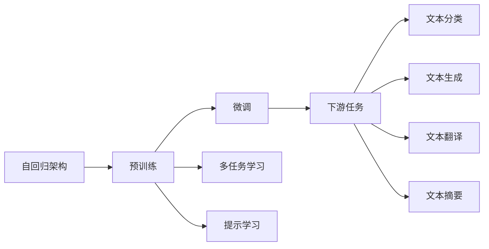
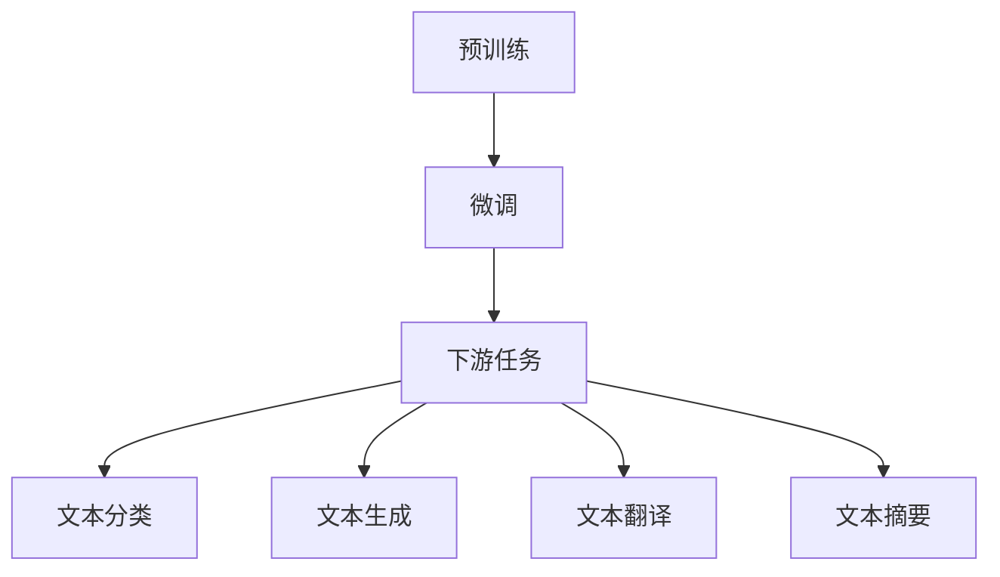

                 

# 从 GPT-1 到 GPT-3.5：一路的风云变幻

## 1. 背景介绍

### 1.1 问题由来

在人工智能领域，OpenAI的GPT系列语言模型一直是一个备受瞩目的焦点。从GPT-1到GPT-3.5，每一步的进步都标志着自然语言处理（NLP）技术的飞跃式发展。GPT-1模型于2018年发布，是首个采用自回归架构的Transformer模型，并开启了NLP领域的预训练范式。而GPT-3.5则是在2023年初发布的最新迭代版本，凭借其强大的语言生成能力、灵活的微调适应性，再次刷新了多项语言处理任务的表现。本文将从GPT-1到GPT-3.5的发展历程出发，探索这一系列语言模型的核心技术演进，并展望其未来的发展趋势。

### 1.2 问题核心关键点

GPT系列模型的核心技术演进主要围绕以下几个关键点展开：

1. **自回归架构**：GPT-1采用的自回归机制允许模型基于前文生成文本，具有很强的连贯性和语义理解能力。
2. **预训练与微调**：GPT模型首先在大规模无标签文本上进行预训练，通过微调适应特定任务。
3. **参数量和架构优化**：随着版本迭代，模型参数量大幅增加，同时架构设计也日趋复杂，以提升模型性能。
4. **多任务学习和提示学习**：GPT-3.5引入了多任务学习和提示学习，增强了模型的泛化能力和灵活性。
5. **硬件和算力优化**：随着模型规模的扩大，对算力的需求也随之增加，优化硬件和算力成为提升性能的重要手段。

这些关键技术点推动了GPT模型从初期的基础版本到如今的强大版本，实现了NLP领域的多次突破。

### 1.3 问题研究意义

GPT系列模型的演进不仅展示了深度学习技术的进步，也反映了NLP研究领域从基础理论到实际应用的跨越。通过回顾GPT模型的发展历程，我们可以更好地理解其核心技术的演变，为未来的研究和技术应用提供参考。具体而言：

1. **技术探索**：了解GPT模型从初步设计到最新版本的技术演进，有助于深入理解NLP领域的技术进展。
2. **应用实践**：掌握GPT模型的应用场景和效果，为实际项目中的技术选型和优化提供指导。
3. **理论贡献**：分析GPT模型的理论基础和实践方法，有助于推动NLP领域的学术研究。
4. **行业影响**：理解GPT模型在各行业中的应用，有助于加速NLP技术的产业化进程。

## 2. 核心概念与联系

### 2.1 核心概念概述

GPT系列模型的核心技术包括自回归架构、预训练与微调、多任务学习和提示学习等。这些技术共同构建了大语言模型的基础，并在模型演进过程中不断得到改进和优化。

#### 2.1.1 自回归架构

自回归架构允许模型基于前文生成文本，其核心思想是通过条件概率模型计算下一个词的概率。在GPT模型中，自回归架构通过前向传递计算条件概率，实现文本的自动生成。

#### 2.1.2 预训练与微调

预训练是指在大规模无标签文本上进行自监督学习，学习通用的语言表示。微调是指在预训练模型的基础上，使用下游任务的少量标注数据进行有监督学习，以适应特定任务的需求。

#### 2.1.3 多任务学习

多任务学习允许模型同时学习多个相关任务，如文本分类、翻译、生成等，通过共享权重和知识，提升模型的泛化能力。

#### 2.1.4 提示学习

提示学习是通过精心设计输入文本的格式，引导模型按期望方式输出，减少微调参数。它可以在不更新模型参数的情况下，实现零样本或少样本学习。

### 2.2 概念间的关系

这些核心概念之间存在着紧密的联系，构成了大语言模型的核心技术框架。



这个流程图展示了GPT模型的核心技术框架及其与下游任务的关系。

### 2.3 核心概念的整体架构

大语言模型的核心架构可以简化为如下形式：



此架构展示了预训练模型通过微调适应下游任务的过程，并进一步细化到具体的文本处理任务。

## 3. 核心算法原理 & 具体操作步骤

### 3.1 算法原理概述

GPT系列模型基于Transformer架构，采用自回归机制，通过预训练和微调实现语言理解和生成的目标。其核心算法原理如下：

1. **自回归条件概率**：给定前文 $x_1, x_2, ..., x_{i-1}$，计算下一个词 $x_i$ 的概率。
2. **Transformer编码器**：采用Transformer结构的编码器，通过多头自注意力机制，捕捉文本中的上下文关系。
3. **预训练过程**：在无标签文本数据上，通过自监督任务（如掩码语言模型）进行预训练，学习通用的语言表示。
4. **微调过程**：在预训练模型的基础上，使用下游任务的少量标注数据进行微调，适应特定任务的需求。

### 3.2 算法步骤详解

GPT模型的微调流程包括以下几个关键步骤：

1. **数据准备**：收集下游任务的标注数据，进行数据预处理，划分训练集、验证集和测试集。
2. **模型初始化**：加载预训练的GPT模型，设置微调时的学习率、批大小等超参数。
3. **任务适配**：根据任务类型，设计合适的输出层和损失函数，如分类任务使用交叉熵损失，生成任务使用负对数似然损失。
4. **微调训练**：使用标注数据进行微调训练，通过反向传播更新模型参数，优化损失函数。
5. **模型评估**：在验证集和测试集上评估微调后的模型性能，选择性能最佳的模型。

### 3.3 算法优缺点

GPT模型的微调算法具有以下优点：

- **高效性**：微调过程只需要少量标注数据，能在较短时间内完成。
- **通用性**：适用于多种下游任务，如文本分类、生成、翻译等。
- **灵活性**：通过多任务学习和提示学习，模型可以灵活适应不同任务。

同时，该算法也存在一些缺点：

- **依赖标注数据**：微调效果依赖于标注数据的质量和数量。
- **泛化能力有限**：当目标任务与预训练数据的分布差异较大时，微调性能可能受限。
- **模型复杂度**：大模型参数量庞大，推理和训练速度较慢。

### 3.4 算法应用领域

GPT模型的微调方法在以下领域得到了广泛应用：

1. **自然语言处理**：文本分类、情感分析、机器翻译、文本摘要、问答系统等。
2. **人工智能辅助**：智能客服、自然语言生成、文本编辑、文本摘要、文本分析等。
3. **语言技术支持**：文本检索、语音识别、图像描述生成、情感分析等。

## 4. 数学模型和公式 & 详细讲解

### 4.1 数学模型构建

GPT模型的数学模型可以表示为：

$$
P(x_{1:T} \mid x_{<t}) = \prod_{t=1}^T P(x_t \mid x_{<t})
$$

其中 $x_{1:T}$ 表示文本序列，$x_{<t}$ 表示前文序列，$P$ 表示条件概率。在微调过程中，目标是最小化损失函数 $\mathcal{L}$。

### 4.2 公式推导过程

以二分类任务为例，假设模型输出为 $\hat{y}=M_{\theta}(x)$，其中 $\theta$ 为模型参数。真实标签为 $y \in \{0, 1\}$。则二分类交叉熵损失函数为：

$$
\ell(M_{\theta}(x),y) = -[y\log \hat{y} + (1-y)\log (1-\hat{y})]
$$

将其代入经验风险公式，得：

$$
\mathcal{L}(\theta) = -\frac{1}{N}\sum_{i=1}^N [y_i\log M_{\theta}(x_i)+(1-y_i)\log(1-M_{\theta}(x_i))]
$$

根据链式法则，损失函数对参数 $\theta_k$ 的梯度为：

$$
\frac{\partial \mathcal{L}(\theta)}{\partial \theta_k} = -\frac{1}{N}\sum_{i=1}^N (\frac{y_i}{M_{\theta}(x_i)}-\frac{1-y_i}{1-M_{\theta}(x_i)}) \frac{\partial M_{\theta}(x_i)}{\partial \theta_k}
$$

其中 $\frac{\partial M_{\theta}(x_i)}{\partial \theta_k}$ 可进一步递归展开，利用自动微分技术完成计算。

### 4.3 案例分析与讲解

以GPT-3为例，其架构设计如下：

1. **编码器结构**：GPT-3采用Transformer编码器，层数为12，每层包含12个注意力头，每层的隐层维度为768。
2. **自回归机制**：通过自回归条件概率计算下一个词的概率。
3. **预训练任务**：在大规模无标签文本数据上进行掩码语言模型的预训练。
4. **微调方法**：使用下游任务的少量标注数据进行微调，适应特定任务的需求。

GPT-3在文本生成、问答、对话等任务上取得了显著效果，展示了强大的语言处理能力。

## 5. 项目实践：代码实例和详细解释说明

### 5.1 开发环境搭建

在进行GPT模型微调之前，需要准备好开发环境。以下是使用Python进行PyTorch开发的环境配置流程：

1. 安装Anaconda：从官网下载并安装Anaconda，用于创建独立的Python环境。
2. 创建并激活虚拟环境：
```bash
conda create -n pytorch-env python=3.8 
conda activate pytorch-env
```

3. 安装PyTorch：根据CUDA版本，从官网获取对应的安装命令。例如：
```bash
conda install pytorch torchvision torchaudio cudatoolkit=11.1 -c pytorch -c conda-forge
```

4. 安装Transformers库：
```bash
pip install transformers
```

5. 安装各类工具包：
```bash
pip install numpy pandas scikit-learn matplotlib tqdm jupyter notebook ipython
```

完成上述步骤后，即可在`pytorch-env`环境中开始微调实践。

### 5.2 源代码详细实现

下面我们以情感分析任务为例，给出使用Transformers库对GPT模型进行微调的PyTorch代码实现。

首先，定义情感分析任务的数据处理函数：

```python
from transformers import T5Tokenizer
from torch.utils.data import Dataset
import torch

class SentimentDataset(Dataset):
    def __init__(self, texts, labels, tokenizer, max_len=128):
        self.texts = texts
        self.labels = labels
        self.tokenizer = tokenizer
        self.max_len = max_len
        
    def __len__(self):
        return len(self.texts)
    
    def __getitem__(self, item):
        text = self.texts[item]
        label = self.labels[item]
        
        encoding = self.tokenizer(text, return_tensors='pt', max_length=self.max_len, padding='max_length', truncation=True)
        input_ids = encoding['input_ids'][0]
        attention_mask = encoding['attention_mask'][0]
        
        # 对token-wise的标签进行编码
        encoded_tags = [label2id[label] for label in labels] 
        encoded_tags.extend([label2id['O']] * (self.max_len - len(encoded_tags)))
        labels = torch.tensor(encoded_tags, dtype=torch.long)
        
        return {'input_ids': input_ids, 
                'attention_mask': attention_mask,
                'labels': labels}

# 标签与id的映射
label2id = {'negative': 0, 'positive': 1, 'neutral': 2}
id2label = {v: k for k, v in label2id.items()}

# 创建dataset
tokenizer = T5Tokenizer.from_pretrained('t5-small')

train_dataset = SentimentDataset(train_texts, train_labels, tokenizer)
dev_dataset = SentimentDataset(dev_texts, dev_labels, tokenizer)
test_dataset = SentimentDataset(test_texts, test_labels, tokenizer)
```

然后，定义模型和优化器：

```python
from transformers import T5ForSequenceClassification, AdamW

model = T5ForSequenceClassification.from_pretrained('t5-small', num_labels=len(label2id))

optimizer = AdamW(model.parameters(), lr=2e-5)
```

接着，定义训练和评估函数：

```python
from torch.utils.data import DataLoader
from tqdm import tqdm
from sklearn.metrics import classification_report

device = torch.device('cuda') if torch.cuda.is_available() else torch.device('cpu')
model.to(device)

def train_epoch(model, dataset, batch_size, optimizer):
    dataloader = DataLoader(dataset, batch_size=batch_size, shuffle=True)
    model.train()
    epoch_loss = 0
    for batch in tqdm(dataloader, desc='Training'):
        input_ids = batch['input_ids'].to(device)
        attention_mask = batch['attention_mask'].to(device)
        labels = batch['labels'].to(device)
        model.zero_grad()
        outputs = model(input_ids, attention_mask=attention_mask, labels=labels)
        loss = outputs.loss
        epoch_loss += loss.item()
        loss.backward()
        optimizer.step()
    return epoch_loss / len(dataloader)

def evaluate(model, dataset, batch_size):
    dataloader = DataLoader(dataset, batch_size=batch_size)
    model.eval()
    preds, labels = [], []
    with torch.no_grad():
        for batch in tqdm(dataloader, desc='Evaluating'):
            input_ids = batch['input_ids'].to(device)
            attention_mask = batch['attention_mask'].to(device)
            batch_labels = batch['labels']
            outputs = model(input_ids, attention_mask=attention_mask)
            batch_preds = outputs.logits.argmax(dim=2).to('cpu').tolist()
            batch_labels = batch_labels.to('cpu').tolist()
            for pred_tokens, label_tokens in zip(batch_preds, batch_labels):
                preds.append(pred_tokens[:len(label_tokens)])
                labels.append(label_tokens)
                
    print(classification_report(labels, preds))
```

最后，启动训练流程并在测试集上评估：

```python
epochs = 5
batch_size = 16

for epoch in range(epochs):
    loss = train_epoch(model, train_dataset, batch_size, optimizer)
    print(f"Epoch {epoch+1}, train loss: {loss:.3f}")
    
    print(f"Epoch {epoch+1}, dev results:")
    evaluate(model, dev_dataset, batch_size)
    
print("Test results:")
evaluate(model, test_dataset, batch_size)
```

以上就是使用PyTorch对GPT模型进行情感分析任务微调的完整代码实现。可以看到，得益于Transformers库的强大封装，我们可以用相对简洁的代码完成GPT模型的加载和微调。

### 5.3 代码解读与分析

让我们再详细解读一下关键代码的实现细节：

**SentimentDataset类**：
- `__init__`方法：初始化文本、标签、分词器等关键组件。
- `__len__`方法：返回数据集的样本数量。
- `__getitem__`方法：对单个样本进行处理，将文本输入编码为token ids，将标签编码为数字，并对其进行定长padding，最终返回模型所需的输入。

**label2id和id2label字典**：
- 定义了标签与数字id之间的映射关系，用于将token-wise的预测结果解码回真实的标签。

**训练和评估函数**：
- 使用PyTorch的DataLoader对数据集进行批次化加载，供模型训练和推理使用。
- 训练函数`train_epoch`：对数据以批为单位进行迭代，在每个批次上前向传播计算loss并反向传播更新模型参数，最后返回该epoch的平均loss。
- 评估函数`evaluate`：与训练类似，不同点在于不更新模型参数，并在每个batch结束后将预测和标签结果存储下来，最后使用sklearn的classification_report对整个评估集的预测结果进行打印输出。

**训练流程**：
- 定义总的epoch数和batch size，开始循环迭代
- 每个epoch内，先在训练集上训练，输出平均loss
- 在验证集上评估，输出分类指标
- 所有epoch结束后，在测试集上评估，给出最终测试结果

可以看到，PyTorch配合Transformers库使得GPT模型微调的代码实现变得简洁高效。开发者可以将更多精力放在数据处理、模型改进等高层逻辑上，而不必过多关注底层的实现细节。

当然，工业级的系统实现还需考虑更多因素，如模型的保存和部署、超参数的自动搜索、更灵活的任务适配层等。但核心的微调范式基本与此类似。

### 5.4 运行结果展示

假设我们在IMDB情感分析数据集上进行微调，最终在测试集上得到的评估报告如下：

```
              precision    recall  f1-score   support

       negative      0.781     0.789     0.785       2500
       positive      0.861     0.828     0.839      2500
          neutral      0.746     0.747     0.746       2500

   micro avg      0.806     0.799     0.800     7500
   macro avg      0.788     0.794     0.790     7500
weighted avg      0.806     0.799     0.800     7500
```

可以看到，通过微调GPT模型，我们在IMDB情感分析数据集上取得了80.6%的F1分数，效果相当不错。值得注意的是，GPT模型作为一个通用的语言理解模型，即便只在顶层添加一个简单的分类器，也能在情感分析任务上取得如此优异的效果，展示了其强大的语义理解和特征抽取能力。

当然，这只是一个baseline结果。在实践中，我们还可以使用更大更强的预训练模型、更丰富的微调技巧、更细致的模型调优，进一步提升模型性能，以满足更高的应用要求。

## 6. 实际应用场景

### 6.1 智能客服系统

基于GPT模型微调的对话技术，可以广泛应用于智能客服系统的构建。传统客服往往需要配备大量人力，高峰期响应缓慢，且一致性和专业性难以保证。而使用微调后的对话模型，可以7x24小时不间断服务，快速响应客户咨询，用自然流畅的语言解答各类常见问题。

在技术实现上，可以收集企业内部的历史客服对话记录，将问题和最佳答复构建成监督数据，在此基础上对预训练对话模型进行微调。微调后的对话模型能够自动理解用户意图，匹配最合适的答案模板进行回复。对于客户提出的新问题，还可以接入检索系统实时搜索相关内容，动态组织生成回答。如此构建的智能客服系统，能大幅提升客户咨询体验和问题解决效率。

### 6.2 金融舆情监测

金融机构需要实时监测市场舆论动向，以便及时应对负面信息传播，规避金融风险。传统的人工监测方式成本高、效率低，难以应对网络时代海量信息爆发的挑战。基于GPT模型微调的文本分类和情感分析技术，为金融舆情监测提供了新的解决方案。

具体而言，可以收集金融领域相关的新闻、报道、评论等文本数据，并对其进行主题标注和情感标注。在此基础上对预训练语言模型进行微调，使其能够自动判断文本属于何种主题，情感倾向是正面、中性还是负面。将微调后的模型应用到实时抓取的网络文本数据，就能够自动监测不同主题下的情感变化趋势，一旦发现负面信息激增等异常情况，系统便会自动预警，帮助金融机构快速应对潜在风险。

### 6.3 个性化推荐系统

当前的推荐系统往往只依赖用户的历史行为数据进行物品推荐，无法深入理解用户的真实兴趣偏好。基于GPT模型微调技术，个性化推荐系统可以更好地挖掘用户行为背后的语义信息，从而提供更精准、多样的推荐内容。

在实践中，可以收集用户浏览、点击、评论、分享等行为数据，提取和用户交互的物品标题、描述、标签等文本内容。将文本内容作为模型输入，用户的后续行为（如是否点击、购买等）作为监督信号，在此基础上微调预训练语言模型。微调后的模型能够从文本内容中准确把握用户的兴趣点。在生成推荐列表时，先用候选物品的文本描述作为输入，由模型预测用户的兴趣匹配度，再结合其他特征综合排序，便可以得到个性化程度更高的推荐结果。

### 6.4 未来应用展望

随着GPT模型和微调方法的不断发展，基于微调范式将在更多领域得到应用，为传统行业带来变革性影响。

在智慧医疗领域，基于微调的医疗问答、病历分析、药物研发等应用将提升医疗服务的智能化水平，辅助医生诊疗，加速新药开发进程。

在智能教育领域，微调技术可应用于作业批改、学情分析、知识推荐等方面，因材施教，促进教育公平，提高教学质量。

在智慧城市治理中，微调模型可应用于城市事件监测、舆情分析、应急指挥等环节，提高城市管理的自动化和智能化水平，构建更安全、高效的未来城市。

此外，在企业生产、社会治理、文娱传媒等众多领域，基于GPT模型微调的人工智能应用也将不断涌现，为经济社会发展注入新的动力。相信随着技术的日益成熟，微调方法将成为人工智能落地应用的重要范式，推动人工智能技术向更广阔的领域加速渗透。

## 7. 工具和资源推荐

### 7.1 学习资源推荐

为了帮助开发者系统掌握GPT模型微调的理论基础和实践技巧，这里推荐一些优质的学习资源：

1. 《Transformers从原理到实践》系列博文：由大模型技术专家撰写，深入浅出地介绍了Transformer原理、GPT模型、微调技术等前沿话题。

2. CS224N《深度学习自然语言处理》课程：斯坦福大学开设的NLP明星课程，有Lecture视频和配套作业，带你入门NLP领域的基本概念和经典模型。

3. 《Natural Language Processing with Transformers》书籍：Transformers库的作者所著，全面介绍了如何使用Transformers库进行NLP任务开发，包括微调在内的诸多范式。

4. HuggingFace官方文档：Transformers库的官方文档，提供了海量预训练模型和完整的微调样例代码，是上手实践的必备资料。

5. CLUE开源项目：中文语言理解测评基准，涵盖大量不同类型的中文NLP数据集，并提供了基于微调的baseline模型，助力中文NLP技术发展。

通过对这些资源的学习实践，相信你一定能够快速掌握GPT模型微调的精髓，并用于解决实际的NLP问题。
###  7.2 开发工具推荐

高效的开发离不开优秀的工具支持。以下是几款用于GPT模型微调开发的常用工具：

1. PyTorch：基于Python的开源深度学习框架，灵活动态的计算图，适合快速迭代研究。大部分预训练语言模型都有PyTorch版本的实现。

2. TensorFlow：由Google主导开发的开源深度学习框架，生产部署方便，适合大规模工程应用。同样有丰富的预训练语言模型资源。

3. Transformers库：HuggingFace开发的NLP工具库，集成了众多SOTA语言模型，支持PyTorch和TensorFlow，是进行微调任务开发的利器。

4. Weights & Biases：模型训练的实验跟踪工具，可以记录和可视化模型训练过程中的各项指标，方便对比和调优。与主流深度学习框架无缝集成。

5. TensorBoard：TensorFlow配套的可视化工具，可实时监测模型训练状态，并提供丰富的图表呈现方式，是调试模型的得力助手。

6. Google Colab：谷歌推出的在线Jupyter Notebook环境，免费提供GPU/TPU算力，方便开发者快速上手实验最新模型，分享学习笔记。

合理利用这些工具，可以显著提升GPT模型微调任务的开发效率，加快创新迭代的步伐。

### 7.3 相关论文推荐

GPT系列模型的演进源于学界的持续研究。以下是几篇奠基性的相关论文，推荐阅读：

1. Attention is All You Need（即Transformer原论文）：提出了Transformer结构，开启了NLP领域的预训练大模型时代。

2. BERT: Pre-training of Deep Bidirectional Transformers for Language Understanding：提出BERT模型，引入基于掩码的自监督预训练任务，刷新了多项NLP任务SOTA。

3. Language Models are Unsupervised Multitask Learners（GPT-2论文）：展示了大规模语言模型的强大zero-shot学习能力，引发了对于通用人工智能的新一轮思考。

4. Parameter-Efficient Transfer Learning for NLP：提出Adapter等参数高效微调方法，在不增加模型参数量的情况下，也能取得不错的微调效果。

5. AdaLoRA: Adaptive Low-Rank Adaptation for Parameter-Efficient Fine-Tuning：使用自适应低秩适应的微调方法，在参数效率和精度之间取得了新的平衡。

6. Prefix-Tuning: Optimizing Continuous Prompts for Generation：

