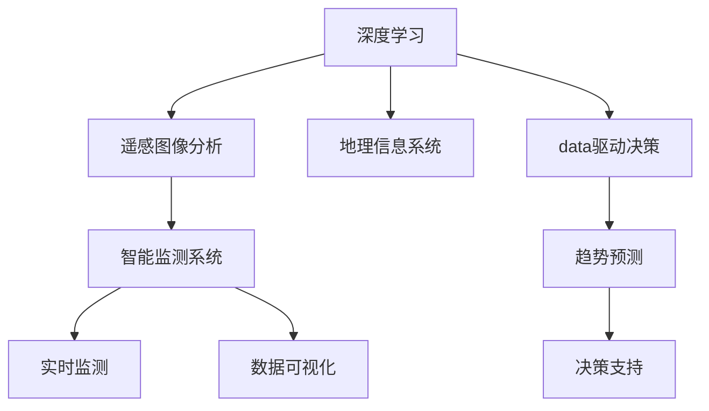
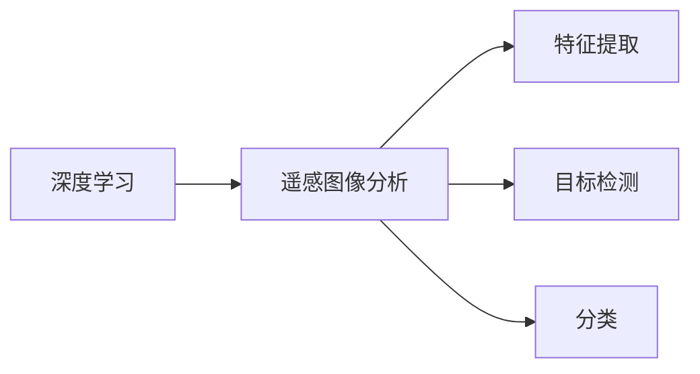
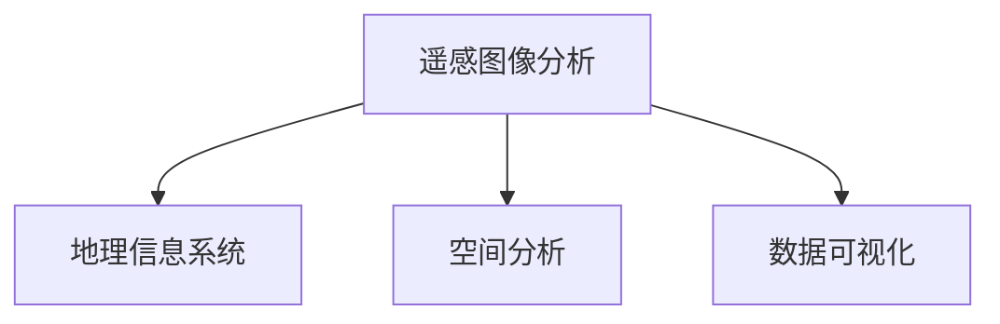
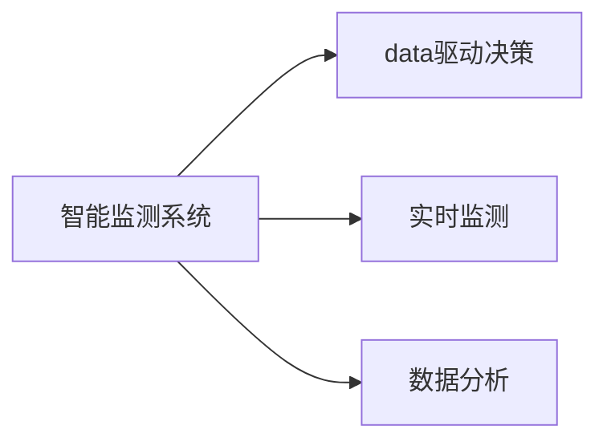
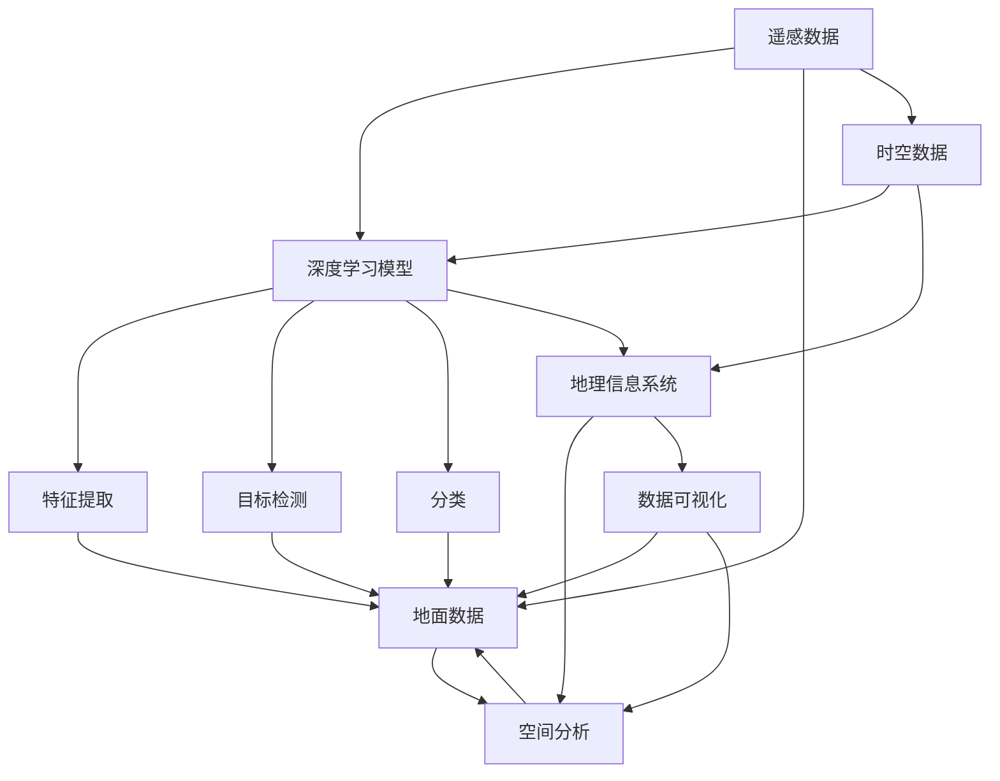

                 

# 一切皆是映射：深度学习在环境监测中的应用

> 关键词：深度学习,环境监测,遥感图像分析,地理信息系统(GIS),智能监测系统,数据驱动,环境保护

## 1. 背景介绍

### 1.1 问题由来
环境监测作为保护生态环境、改善生态环境质量的重要手段，近年来越来越受到国家和社会的重视。传统的监测方法如人工巡视、水质检测等，不仅耗时耗力，而且数据收集的实时性和全面性也受到限制。随着深度学习技术的崛起，遥感图像分析和地理信息系统(GIS)等技术逐步引入到环境监测领域，大大提升了数据采集和分析的效率和准确性。

环境监测数据通常包括时间序列数据、遥感图像数据、地理数据等，数据量大、类型多样，需要高效、准确的分析和处理技术。深度学习模型，特别是卷积神经网络(CNN)、循环神经网络(RNN)、长短期记忆网络(LSTM)等，具有强大的非线性拟合能力和泛化能力，能够从大规模数据中提取高层次的语义特征，成为环境监测领域的重要工具。

### 1.2 问题核心关键点
深度学习在环境监测中的应用主要集中在以下几个方面：
1. 遥感图像分析：利用深度学习模型对遥感图像进行特征提取、目标检测、分类等任务，提取环境变化信息。
2. 地理信息系统(GIS)：将遥感图像与地理信息相结合，进行环境数据的空间分析和可视化。
3. 智能监测系统：构建基于深度学习的环境监测系统，实现实时、动态的环境监测与分析。
4. 数据驱动决策：利用深度学习模型进行环境数据的时序分析，预测环境变化趋势，辅助决策。

深度学习在环境监测中的应用，使得环境监测变得更加智能化、高效化和科学化，为生态环境保护提供了强大的技术支持。

### 1.3 问题研究意义
深度学习在环境监测中的应用，不仅能够显著提升监测效率和数据准确性，还能够在复杂环境下进行更精确的分析和预测。通过深度学习，可以处理海量、复杂的环境数据，从中挖掘出人类难以直接观察的隐藏模式和规律。同时，深度学习还能够自动适应环境变化，提高监测系统的鲁棒性和适应性。

深度学习在环境监测中的应用，有助于实现环境保护和治理的智能化转型，为生态文明建设和可持续发展提供有力支撑。深度学习技术的应用，可以加快环境监测信息的收集和处理速度，及时发现和处理环境问题，保障生态环境的长期稳定和可持续发展。

## 2. 核心概念与联系

### 2.1 核心概念概述

为更好地理解深度学习在环境监测中的应用，本节将介绍几个密切相关的核心概念：

- 深度学习(Deep Learning)：一种基于神经网络的机器学习技术，通过多层次的特征提取和表示学习，解决复杂模式识别和预测问题。
- 遥感图像分析(Remote Sensing Image Analysis)：利用卫星、无人机等设备获取的遥感图像数据，通过深度学习模型进行目标检测、分类、变化检测等任务，提取环境变化信息。
- 地理信息系统(GIS)：融合遥感数据、地面数据等，实现空间数据管理和分析，支持环境监测、规划和决策。
- 智能监测系统(Intelligent Monitoring System)：利用深度学习、GIS等技术，构建实时、动态的环境监测系统，实现环境变化自动化、智能化监测。
- 数据驱动决策(Data-Driven Decision Making)：通过深度学习模型进行环境数据的时序分析，预测环境变化趋势，辅助科学决策。

这些核心概念之间的逻辑关系可以通过以下Mermaid流程图来展示：



这个流程图展示了大语言模型微调过程中各个核心概念的关系和作用：

1. 深度学习作为技术基础，为遥感图像分析、地理信息系统、智能监测系统等提供了实现手段。
2. 遥感图像分析通过深度学习模型对遥感数据进行提取、检测、分类等任务，为环境监测提供数据支撑。
3. 地理信息系统融合遥感数据和地面数据，实现空间分析和可视化，辅助监测和决策。
4. 智能监测系统利用深度学习、GIS等技术，实现实时、动态的环境监测与分析。
5. 数据驱动决策通过深度学习模型进行环境数据的时序分析，预测环境变化趋势，辅助科学决策。

这些概念共同构成了深度学习在环境监测中的完整生态系统，使得监测变得更加智能化、高效化和科学化。通过理解这些核心概念，我们可以更好地把握深度学习在环境监测中的应用方向和优化方向。

### 2.2 概念间的关系

这些核心概念之间存在着紧密的联系，形成了深度学习在环境监测中的完整应用生态。下面我们通过几个Mermaid流程图来展示这些概念之间的关系。

#### 2.2.1 深度学习与遥感图像分析的关系



这个流程图展示了深度学习在遥感图像分析中的应用：

1. 深度学习模型通过卷积神经网络(CNN)等技术，从遥感图像中提取高层次的语义特征。
2. 通过特征提取，深度学习模型能够自动识别遥感图像中的目标和变化。
3. 通过目标检测和分类，深度学习模型可以对遥感图像进行详细的分析和标注。

#### 2.2.2 遥感图像分析与GIS的关系



这个流程图展示了遥感图像分析与GIS的结合：

1. 遥感图像分析提取的环境数据，与GIS中的地面数据相结合，进行空间分析。
2. 通过GIS技术，可以将遥感图像数据进行地理信息编码，实现数据的可视化展示。
3. 利用GIS进行环境监测数据的展示和分析，提供直观、易懂的监测结果。

#### 2.2.3 智能监测系统与数据驱动决策的关系



这个流程图展示了智能监测系统与数据驱动决策的联系：

1. 智能监测系统利用深度学习、GIS等技术，实现实时、动态的环境监测。
2. 通过数据分析，智能监测系统提取环境变化数据，进行趋势预测。
3. 数据驱动决策通过深度学习模型，辅助科学决策，优化环境管理措施。

### 2.3 核心概念的整体架构

最后，我们用一个综合的流程图来展示这些核心概念在深度学习在环境监测中的整体架构：



这个综合流程图展示了从遥感数据到智能监测系统的完整过程：

1. 遥感数据通过深度学习模型提取特征、进行目标检测和分类，实现环境监测数据的预处理。
2. 地理信息系统将遥感数据与地面数据相结合，进行空间分析和可视化展示。
3. 智能监测系统利用深度学习、GIS等技术，实现实时、动态的环境监测与分析。
4. 数据驱动决策通过深度学习模型进行环境数据的时序分析，辅助科学决策。

通过这些流程图，我们可以更清晰地理解深度学习在环境监测中的应用过程和各个环节的关键技术。

## 3. 核心算法原理 & 具体操作步骤
### 3.1 算法原理概述

深度学习在环境监测中的应用主要通过以下几个核心步骤实现：

1. 数据预处理：将遥感图像数据、地面数据等进行预处理，包括数据清洗、归一化、尺度变换等。
2. 特征提取：利用深度学习模型提取遥感图像中的高层次语义特征，进行目标检测、分类等任务。
3. 空间分析：将遥感图像数据与地面数据结合，进行地理空间分析，实现环境数据的空间分布和变化趋势的可视化。
4. 时序分析：通过深度学习模型对环境数据进行时序分析，预测环境变化趋势，辅助科学决策。
5. 智能监测：构建基于深度学习、GIS等技术的智能监测系统，实现实时、动态的环境监测与分析。

这些步骤共同构成了一个深度学习在环境监测中的应用框架，为环境监测提供了一个从数据预处理到智能决策的完整流程。

### 3.2 算法步骤详解

#### 3.2.1 数据预处理

深度学习模型需要大量的数据进行训练和测试，因此数据的预处理是非常重要的一步。常见的数据预处理技术包括：

- 数据清洗：去除噪声、缺失数据等，提高数据质量。
- 归一化：将数据进行归一化处理，使其符合模型的输入要求。
- 尺度变换：将不同尺度的数据进行统一处理，便于模型处理。
- 数据增强：通过对数据进行旋转、缩放、裁剪等操作，增加数据的多样性，提高模型的泛化能力。

#### 3.2.2 特征提取

深度学习模型利用卷积神经网络(CNN)、循环神经网络(RNN)、长短期记忆网络(LSTM)等结构，从遥感图像中提取高层次的语义特征。常见的特征提取方法包括：

- 目标检测：利用目标检测模型，对遥感图像中的目标进行定位和标注。
- 分类：通过分类模型，对遥感图像中的目标进行分类。
- 变化检测：通过变化检测模型，对遥感图像进行变化检测，识别环境变化。

#### 3.2.3 空间分析

遥感图像分析与地理信息系统(GIS)结合，进行空间分析和可视化展示。常见的操作包括：

- 空间分析：利用GIS技术，进行环境数据的地理空间分析，识别环境变化区域。
- 数据可视化：将分析结果进行可视化展示，直观呈现环境变化信息。

#### 3.2.4 时序分析

利用深度学习模型对环境数据进行时序分析，预测环境变化趋势。常见的方法包括：

- 时间序列预测：通过时间序列预测模型，预测环境数据的时间变化趋势。
- 异常检测：通过异常检测模型，识别环境变化中的异常情况，及时预警。

#### 3.2.5 智能监测

构建基于深度学习、GIS等技术的智能监测系统，实现实时、动态的环境监测与分析。常见的操作包括：

- 实时监测：利用深度学习模型对环境数据进行实时监测，及时发现环境变化。
- 数据分析：对监测数据进行综合分析，提取环境变化规律和特征。
- 智能决策：结合深度学习模型和GIS技术，进行科学决策，优化环境管理措施。

### 3.3 算法优缺点

深度学习在环境监测中的应用具有以下优点：

1. 高效处理大规模数据：深度学习模型能够高效处理海量、复杂的环境数据，从中提取高层次的语义特征。
2. 精准识别环境变化：通过目标检测、分类、变化检测等技术，深度学习模型能够精准识别环境变化，提取环境变化信息。
3. 空间和时序分析：利用地理信息系统(GIS)和时序分析技术，深度学习模型能够进行空间和时序分析，提供全面的环境监测信息。
4. 实时动态监测：构建基于深度学习的智能监测系统，能够实现实时、动态的环境监测与分析，提高监测效率。

同时，深度学习在环境监测中也存在一些缺点：

1. 数据依赖：深度学习模型需要大量的高质量标注数据进行训练，而环境监测数据往往标注困难，数据质量难以保证。
2. 计算资源消耗：深度学习模型参数量大，计算资源消耗大，对计算硬件要求高。
3. 模型复杂度：深度学习模型结构复杂，训练和推理难度较大，需要专业知识进行调参和优化。
4. 解释性不足：深度学习模型作为黑盒模型，难以解释其内部工作机制和决策逻辑，缺乏可解释性。

尽管存在这些缺点，但深度学习在环境监测中的应用前景仍然十分广阔，未来还需要进一步研究和优化。

### 3.4 算法应用领域

深度学习在环境监测中的应用非常广泛，涵盖了以下几个领域：

1. 水质监测：利用遥感图像分析和深度学习模型，监测水体污染和生态变化，实现水质预测和预警。
2. 森林火灾监测：利用遥感图像分析，识别森林火灾的蔓延区域，进行预警和应急响应。
3. 大气污染监测：利用遥感图像分析，监测大气污染物浓度和分布，进行环境评估和治理。
4. 土壤监测：利用遥感图像分析，监测土壤侵蚀和质量变化，进行土地保护和利用规划。
5. 生态系统监测：利用遥感图像分析和深度学习模型，监测生态系统变化和生物多样性，实现生态保护和可持续发展。

除了上述这些领域，深度学习在环境监测中的应用还在不断扩展，为生态环保事业提供了强有力的技术支撑。

## 4. 数学模型和公式 & 详细讲解  
### 4.1 数学模型构建

在环境监测中，深度学习模型通常采用卷积神经网络(CNN)、循环神经网络(RNN)等结构，进行特征提取、分类、变化检测等任务。以遥感图像分类为例，常用的数学模型包括卷积神经网络(CNN)和长短期记忆网络(LSTM)。

### 4.2 公式推导过程

#### 4.2.1 卷积神经网络(CNN)

卷积神经网络(CNN)是一种经典的深度学习模型，常用于图像处理和特征提取。其基本结构包括卷积层、池化层、全连接层等。下面以遥感图像分类为例，推导CNN的数学模型。

设遥感图像数据为 $X \in \mathbb{R}^{H \times W \times C}$，其中 $H$ 为图像高度，$W$ 为图像宽度，$C$ 为图像通道数。假设卷积核大小为 $k \times k$，步长为 $s$，卷积核数为 $d$。卷积层操作可以表示为：

$$
X_{conv} = \sum_{i=1}^{d} \sum_{x=0}^{H-s} \sum_{y=0}^{W-s} (X_{i,(x,k)} * W_{i,k}) + b
$$

其中 $W_{i,k}$ 为卷积核权重，$b$ 为偏置项。池化层操作可以表示为：

$$
X_{pool} = \sum_{i=1}^{d} \sum_{x=0}^{H/2} \sum_{y=0}^{W/2} \max(X_{i,2x,2y})
$$

全连接层操作可以表示为：

$$
Z = W \cdot X_{pool} + b
$$

其中 $W$ 为全连接层权重，$b$ 为偏置项。分类层操作可以表示为：

$$
\hat{Y} = softmax(Z)
$$

其中 $softmax$ 函数将 $Z$ 转换为概率分布，表示预测类别。

#### 4.2.2 长短期记忆网络(LSTM)

长短期记忆网络(LSTM)是一种适合处理序列数据的深度学习模型，常用于时间序列分析和变化检测。其基本结构包括输入门、遗忘门、输出门和记忆单元等。下面以遥感图像变化检测为例，推导LSTM的数学模型。

设遥感图像序列为 $X_t \in \mathbb{R}^{H \times W \times C}$，其中 $t$ 表示时间序列。假设LSTM的输入门为 $I_t$，遗忘门为 $F_t$，输出门为 $O_t$，记忆单元为 $C_t$。LSTM的操作可以表示为：

$$
I_t = \sigma(I_{i}(X_t, C_{t-1}))
$$

$$
F_t = \sigma(F_{i}(X_t, C_{t-1}))
$$

$$
O_t = \sigma(O_{i}(X_t, C_{t-1}))
$$

$$
C_t = f_t \cdot C_{t-1} + i_t \cdot tanh(W_{h}X_t + b_h)
$$

其中 $\sigma$ 为sigmoid函数，$f_t$ 为遗忘门输出，$i_t$ 为输入门输出，$W_{h}$ 为权重矩阵，$b_h$ 为偏置项。

通过LSTM模型，可以对遥感图像序列进行变化检测，识别环境变化趋势。

### 4.3 案例分析与讲解

#### 4.3.1 遥感图像分类

以遥感图像分类为例，展示深度学习在环境监测中的应用。遥感图像分类通常分为两个阶段：特征提取和分类。下面以卷积神经网络(CNN)为例，展示遥感图像分类的具体实现步骤。

1. 数据预处理：将遥感图像数据进行归一化、归一化等预处理操作，使其符合模型的输入要求。
2. 特征提取：利用卷积神经网络(CNN)对遥感图像进行特征提取，提取高层次的语义特征。
3. 分类：通过分类层对提取的特征进行分类，得到分类结果。

#### 4.3.2 遥感图像变化检测

遥感图像变化检测是环境监测的重要任务之一，利用长短期记忆网络(LSTM)可以实现该任务。遥感图像变化检测通常分为两个阶段：变化检测和变化分析。下面以LSTM为例，展示遥感图像变化检测的实现步骤。

1. 数据预处理：将遥感图像序列进行归一化、归一化等预处理操作，使其符合模型的输入要求。
2. 变化检测：利用LSTM对遥感图像序列进行变化检测，识别环境变化趋势。
3. 变化分析：对检测到的变化进行分析和可视化展示，辅助决策。

## 5. 项目实践：代码实例和详细解释说明
### 5.1 开发环境搭建

在进行项目实践前，我们需要准备好开发环境。以下是使用Python进行TensorFlow和Keras开发的环境配置流程：

1. 安装Anaconda：从官网下载并安装Anaconda，用于创建独立的Python环境。

2. 创建并激活虚拟环境：
```bash
conda create -n tf-env python=3.8 
conda activate tf-env
```

3. 安装TensorFlow和Keras：
```bash
pip install tensorflow keras
```

4. 安装各类工具包：
```bash
pip install numpy pandas scikit-learn matplotlib tqdm jupyter notebook ipython
```

完成上述步骤后，即可在`tf-env`环境中开始项目实践。

### 5.2 源代码详细实现

下面我们以遥感图像分类为例，给出使用TensorFlow和Keras对卷积神经网络(CNN)进行遥感图像分类的PyTorch代码实现。

首先，定义数据处理函数：

```python
import tensorflow as tf
from tensorflow.keras import layers, models

def create_model(input_shape, num_classes):
    model = models.Sequential()
    model.add(layers.Conv2D(32, (3, 3), activation='relu', input_shape=input_shape))
    model.add(layers.MaxPooling2D((2, 2)))
    model.add(layers.Conv2D(64, (3, 3), activation='relu'))
    model.add(layers.MaxPooling2D((2, 2)))
    model.add(layers.Conv2D(128, (3, 3), activation='relu'))
    model.add(layers.MaxPooling2D((2, 2)))
    model.add(layers.Flatten())
    model.add(layers.Dense(64, activation='relu'))
    model.add(layers.Dense(num_classes, activation='softmax'))
    return model
```

然后，加载数据集并进行预处理：

```python
train_dataset = tf.keras.preprocessing.image_dataset_from_directory(
    'path/to/train/directory',
    validation_split=0.2,
    subset='training',
    seed=123,
    image_size=(256, 256),
    batch_size=32)

val_dataset = tf.keras.preprocessing.image_dataset_from_directory(
    'path/to/train/directory',
    validation_split=0.2,
    subset='validation',
    seed=123,
    image_size=(256, 256),
    batch_size=32)

test_dataset = tf.keras.preprocessing.image_dataset_from_directory(
    'path/to/test/directory',
    image_size=(256, 256),
    batch_size=32)

train_dataset = train_dataset.prefetch(buffer_size=32)
val_dataset = val_dataset.prefetch(buffer_size=32)
test_dataset = test_dataset.prefetch(buffer_size=32)
```

接着，定义模型和优化器：

```python
model = create_model((256, 256, 3), num_classes=5)
optimizer = tf.keras.optimizers.Adam(lr=0.001)
```

最后，执行训练流程并进行评估：

```python
model.compile(optimizer=optimizer,
              loss='categorical_crossentropy',
              metrics=['accuracy'])

history = model.fit(train_dataset, validation_data=val_dataset, epochs=10)

test_loss, test_acc = model.evaluate(test_dataset)
print('Test accuracy:', test_acc)
```

以上就是使用TensorFlow和Keras对卷积神经网络(CNN)进行遥感图像分类的完整代码实现。可以看到，TensorFlow和Keras提供了一站式的深度学习开发工具，使得模型构建、训练、评估等步骤变得简单高效。

### 5.3 代码解读与分析

让我们再详细解读一下关键代码的实现细节：

**create_model函数**：
- 定义了卷积神经网络(CNN)的模型结构，包括卷积层、池化层、全连接层等。
- 通过`Sequential`模型堆叠多个`Conv2D`、`MaxPooling2D`、`Dense`层，构成完整的CNN模型。

**数据加载函数**：
- 利用`image_dataset_from_directory`函数从指定目录加载遥感图像数据集，并进行预处理。
- 通过`prefetch`函数提高数据加载速度，利用`validation_split`参数分割训练集和验证集。

**模型编译和训练**：
- 利用`compile`函数编译模型，指定优化器、损失函数和评估指标。
- 通过`fit`函数执行训练流程，指定训练集、验证集和训练轮数。
- 通过`evaluate`函数评估模型性能，输出测试集上的准确率。

通过这些关键代码，可以直观理解遥感图像分类模型的构建和训练流程。实际应用中，还需要根据具体任务调整模型结构、优化器参数等，才能得到理想的分类效果。

## 6. 实际应用场景
### 6.1 水质监测

水质监测是环境监测的重要任务之一，利用深度学习模型可以对水质数据进行分析和预测。例如，利用遥感图像分析技术，可以从卫星图像中提取水质参数，进行水质评估和预警。

具体实现时，可以将遥感图像数据作为输入，通过卷积神经网络(CNN)提取水质参数的特征，结合历史水质数据进行时间序列预测。当水质参数超过预设阈值时，系统自动报警，及时通知相关部门进行处理。

### 6.2 森林火灾监测

森林火灾监测是环境保护的重要任务之一，利用深度学习模型可以对森林火灾进行预警和应急响应。例如，利用遥感图像分析技术，可以从卫星图像中识别森林火灾的蔓延区域，进行火灾预警。

具体实现时，可以将遥感图像数据作为输入，通过卷积神经网络(CNN)进行目标检测和分类，识别森林火灾的蔓延区域。结合历史火灾数据进行时间序列预测，当火灾风险超过预设阈值时，系统自动报警，及时通知相关部门进行灭火和救援。

### 6.3 大气污染监测

大气污染监测是环境保护的重要任务之一，利用深度学习模型可以对大气污染物浓度进行分析和预测。例如，利用遥感图像分析技术，可以从卫星图像中提取大气污染物的浓度分布，进行大气污染预警。

具体实现时，可以将遥感图像数据作为输入，通过卷积神经网络(CNN)提取大气污染物的特征，结合历史大气数据进行时间序列预测。当大气污染物浓度超过预设阈值时，系统自动报警，及时通知相关部门进行应对。

### 6.4 土壤监测

土壤监测是环境保护的重要任务之一，利用深度学习模型可以对土壤侵蚀和质量变化进行分析和预测。例如，利用遥感图像分析技术，可以从卫星图像中提取土壤侵蚀的特征，进行土壤监测。

具体实现时，可以将遥感图像数据作为输入，通过卷积神经网络(CNN)进行目标检测和分类，识别土壤侵蚀区域。结合历史土壤数据进行时间序列预测，当土壤侵蚀超过预设阈值时，系统自动报警，及时通知相关部门进行治理。

### 6.5 生态系统监测

生态系统监测是环境保护的重要任务之一，利用深度学习模型可以对生态系统的变化进行分析和预测。例如，利用遥感图像分析技术，可以从卫星图像中提取生态系统的变化特征，进行生态系统监测。

具体实现时，可以将遥感图像数据作为输入，通过卷积神经网络(CNN)进行目标检测和分类，识别生态系统的变化区域。结合历史生态数据进行时间序列预测，当生态系统变化超过预设阈值时，系统自动报警，及时通知相关部门进行治理。

## 7. 工具和资源推荐
### 7.1 学习资源推荐

为了帮助开发者系统掌握深度学习在环境监测中的应用，这里推荐一些优质的学习资源：


