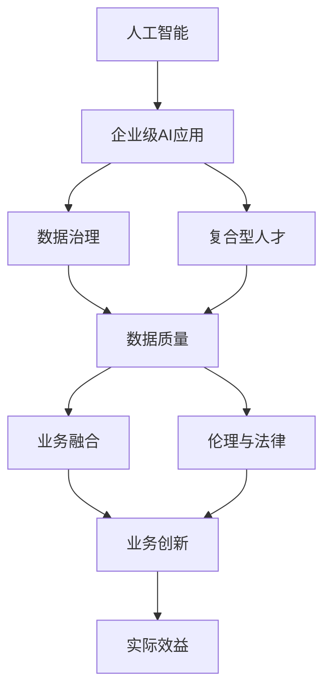

                 

## 1. 背景介绍

### 1.1 问题的由来
在科技日新月异的今天，人工智能(AI)技术正逐步渗透到各行各业，改变着传统产业的运作模式和业务流程。中国作为全球最大的经济体，各行各业对AI技术的接受度和应用深度不断加深。从零售、制造、金融、医疗，到智慧城市、教育、农业等领域，AI技术的广泛应用已经成为推动经济增长和社会进步的重要驱动力。然而，尽管AI技术在中国的发展势头迅猛，企业在具体应用AI技术时仍面临诸多挑战。这些问题既有技术层面的，也有战略层面的，需要从理论与实践相结合的角度进行全面分析和探讨。

### 1.2 问题的核心关键点
中国企业在AI应用过程中，普遍存在以下几方面的核心关键点：
- **技术认知不足**：许多企业在引入AI技术时，对AI的认知和理解不够深入，难以准确判断AI技术能否真正解决业务痛点和提升运营效率。
- **数据质量与数量问题**：高质量、大数量的数据是AI技术的基础。然而，不少企业在数据治理和数据质量上存在较大问题，导致数据难以支持AI模型的训练与部署。
- **人才与技术缺口**：尽管AI技术发展迅速，但技术复合型人才依然稀缺，尤其是能够结合行业实际需求进行AI应用开发的复合型人才，严重制约了AI技术的落地应用。
- **业务融合挑战**：AI技术本身只是一种工具，如何将其与企业现有的业务体系有效融合，形成数据驱动的业务决策和管理体系，是AI应用过程中的重要挑战。
- **伦理与法律问题**：随着AI技术的广泛应用，隐私保护、数据安全、算法偏见等伦理与法律问题日益凸显，需要企业在应用AI技术时，充分考虑合规性和伦理规范。

### 1.3 问题研究意义
深入研究中国企业在AI应用中的问题，不仅有助于企业更好地理解和应用AI技术，提升竞争力，也对我国AI技术的整体发展具有重要的指导意义。具体而言：

- **技术落地**：通过剖析企业在AI应用中的具体问题，提出解决方案，有助于推动AI技术的实际应用和落地。
- **企业赋能**：AI技术的广泛应用，可以为企业带来效率提升、成本降低、产品创新等直接效益，提升企业的综合竞争力。
- **产业升级**：AI技术可以加速传统产业的数字化、智能化转型，促进产业升级和结构优化。
- **人才培养**：揭示AI应用中的人才缺口，推动相关教育和培训体系的完善，培养更多AI技术与应用结合的专业人才。
- **政策建议**：对AI应用中的法律与伦理问题进行深入分析，为政府制定相关政策和法规提供参考。

## 2. 核心概念与联系

### 2.1 核心概念概述

为了更好地理解中国企业AI应用的现状与问题，本节将介绍几个与AI应用密切相关的核心概念：

- **人工智能(AI)**：使用算法、数据和计算技术来模拟人类智能的行为，解决复杂问题。AI技术包括机器学习、深度学习、自然语言处理、计算机视觉等。
- **企业级AI应用**：将AI技术应用于企业日常运营、业务决策、产品创新等各个环节，实现智能化、自动化、数据化。
- **数据治理**：指通过规范数据采集、存储、处理、分析和使用，确保数据质量和可用性，提升数据驱动决策的能力。
- **复合型人才**：具备AI技术知识和行业领域知识的交叉型人才，能够将AI技术与业务需求有效结合，推动AI应用的实际落地。
- **AI伦理与法律**：涉及隐私保护、数据安全、算法偏见等伦理与法律问题，需要企业在应用AI技术时，充分考虑合规性和伦理规范。

### 2.2 概念间的关系

这些核心概念之间存在着紧密的联系，构成了企业AI应用的整体框架。通过以下Mermaid流程图，我们可以更清晰地理解这些概念之间的关系：



这个流程图展示了几大核心概念之间的关系：

1. 人工智能技术是企业级AI应用的基础，是实现智能化、自动化、数据化的核心。
2. 数据治理是AI应用的前提，确保高质量、可用性强的数据，是AI技术成功应用的基础。
3. 复合型人才是AI应用的关键，能够有效结合AI技术与业务需求，推动AI技术的实际落地。
4. 业务融合是AI应用的重点，将AI技术与企业现有业务体系有效结合，形成数据驱动的业务决策和管理体系。
5. 伦理与法律是AI应用的保障，需要企业在应用AI技术时，充分考虑隐私保护、数据安全等伦理与法律问题。
6. 业务创新是AI应用的直接效益，AI技术可以带来效率提升、成本降低、产品创新等直接效益，提升企业的综合竞争力。

这些核心概念共同构成了企业AI应用的完整生态系统，指导企业在AI应用中的实践和探索。

## 3. 核心算法原理 & 具体操作步骤

### 3.1 算法原理概述

中国企业在AI应用过程中，常用的算法包括机器学习、深度学习、自然语言处理、计算机视觉等。其中，机器学习和深度学习是AI算法的基础，自然语言处理和计算机视觉则将AI技术应用到文本和图像处理上。

机器学习和深度学习算法原理可概括为：
1. **监督学习**：使用有标签的数据进行模型训练，生成预测模型。
2. **无监督学习**：使用无标签的数据进行模型训练，发现数据中的隐含模式。
3. **强化学习**：通过与环境互动，学习最优决策策略。

自然语言处理和计算机视觉算法原理可概括为：
1. **文本处理**：包括分词、词性标注、命名实体识别、情感分析等，将自然语言转化为机器可理解的形式。
2. **图像处理**：包括图像识别、图像分割、目标检测等，将图像数据转化为机器可理解的形式。

### 3.2 算法步骤详解

中国企业在AI应用中，通常会遵循以下步骤：

1. **需求分析**：明确AI应用的业务需求，分析AI技术是否能够解决实际问题，评估AI应用的价值和效果。
2. **数据准备**：收集、清洗和标注高质量的数据，确保数据能够支持AI模型的训练和部署。
3. **模型选择**：根据业务需求和技术特点，选择合适的AI算法和模型，如卷积神经网络(CNN)、循环神经网络(RNN)、Transformer等。
4. **模型训练**：使用数据集对AI模型进行训练，优化模型参数，提升模型性能。
5. **模型评估**：通过交叉验证等方法，评估模型在实际场景中的性能和效果，确保模型的鲁棒性和可扩展性。
6. **模型部署**：将训练好的模型部署到生产环境中，实现AI技术的应用和落地。
7. **持续优化**：根据实际使用情况，不断优化模型和算法，提升AI应用的效果和效率。

### 3.3 算法优缺点

**优点**：
1. **提升效率**：AI技术可以自动化处理大量重复性工作，提升业务处理效率，降低人力成本。
2. **数据驱动**：AI技术能够通过数据驱动的决策和管理，提升企业的智能化水平。
3. **创新能力**：AI技术可以加速产品创新和业务模式创新，增强企业的竞争力。

**缺点**：
1. **技术复杂**：AI技术的实施和应用需要具备一定的技术基础和专业知识，技术复杂度高。
2. **数据质量**：高质量的数据是AI应用的基础，数据采集和处理需要大量人力和资源投入。
3. **人才缺口**：复合型AI技术人才短缺，制约了AI技术在企业中的广泛应用。
4. **伦理风险**：AI应用中的隐私保护、数据安全、算法偏见等伦理问题需要充分考虑。
5. **成本投入**：AI技术的开发和应用需要大量的资金和资源投入，短期内难以见到明显效益。

### 3.4 算法应用领域

中国企业在AI应用中，主要涉及以下几个领域：

1. **零售**：通过AI技术进行消费者行为分析、个性化推荐、库存管理等，提升零售效率和用户体验。
2. **制造**：使用AI技术进行生产过程优化、质量检测、设备维护等，实现智能制造和数字化转型。
3. **金融**：利用AI技术进行风险管理、客户服务、反欺诈等，提升金融服务的智能化水平。
4. **医疗**：应用AI技术进行疾病诊断、影像分析、医疗咨询等，提高医疗服务的效率和质量。
5. **智慧城市**：通过AI技术进行城市管理、交通优化、环境监测等，提升城市治理的智能化水平。
6. **教育**：使用AI技术进行教育资源推荐、学习行为分析、智能答疑等，提升教育服务的智能化水平。
7. **农业**：应用AI技术进行农作物监测、病虫害检测、智能农机管理等，提升农业生产的智能化水平。

## 4. 数学模型和公式 & 详细讲解 & 举例说明

### 4.1 数学模型构建

本节将以机器学习为例，介绍常用的数学模型构建方法。

设训练数据集为 $D=\{(x_i,y_i)\}_{i=1}^N$，其中 $x_i$ 为输入特征，$y_i$ 为标签。机器学习模型的目标是找到最优的参数 $\theta$，使得模型在测试集上的预测结果与真实标签尽可能接近。

常见机器学习模型包括线性回归、逻辑回归、决策树、支持向量机等。以线性回归为例，目标函数为：
$$
\min_{\theta} \frac{1}{2N} \sum_{i=1}^N (y_i - \theta x_i)^2
$$

其中 $\theta$ 为模型参数，$x_i$ 为输入特征，$y_i$ 为标签。

### 4.2 公式推导过程

以线性回归为例，模型参数 $\theta$ 的求解公式为：
$$
\theta = (X^TX)^{-1}X^Ty
$$

其中 $X=[x_1, x_2, ..., x_N]$ 为特征矩阵，$y=[y_1, y_2, ..., y_N]$ 为标签向量。

### 4.3 案例分析与讲解

假设某电商公司希望通过AI技术预测用户的购买行为，使用线性回归模型进行分析。具体步骤如下：

1. **数据准备**：收集用户的历史购买数据，包括用户ID、购买时间、购买金额、购买频次等。
2. **特征工程**：将用户ID、购买金额、购买频次等转化为模型可用的输入特征。
3. **模型训练**：使用训练集对线性回归模型进行训练，优化模型参数 $\theta$。
4. **模型评估**：通过交叉验证等方法，评估模型在测试集上的性能和效果。
5. **模型部署**：将训练好的模型部署到生产环境中，实时预测用户的购买行为。
6. **持续优化**：根据实际使用情况，不断优化模型和算法，提升预测精度。

## 5. 项目实践：代码实例和详细解释说明

### 5.1 开发环境搭建

在进行AI项目实践前，我们需要准备好开发环境。以下是使用Python进行TensorFlow开发的环境配置流程：

1. 安装Anaconda：从官网下载并安装Anaconda，用于创建独立的Python环境。

2. 创建并激活虚拟环境：
```bash
conda create -n tf-env python=3.8 
conda activate tf-env
```

3. 安装TensorFlow：根据CUDA版本，从官网获取对应的安装命令。例如：
```bash
conda install tensorflow -c tf
```

4. 安装各类工具包：
```bash
pip install numpy pandas scikit-learn matplotlib tqdm jupyter notebook ipython
```

完成上述步骤后，即可在`tf-env`环境中开始AI项目实践。

### 5.2 源代码详细实现

下面我以线性回归模型为例，给出使用TensorFlow进行机器学习开发的Python代码实现。

首先，定义线性回归模型：

```python
import tensorflow as tf

class LinearRegression(tf.keras.Model):
    def __init__(self, input_dim):
        super(LinearRegression, self).__init__()
        self.linear = tf.keras.layers.Dense(1)

    def call(self, inputs):
        return self.linear(inputs)
```

然后，定义训练函数：

```python
def train_model(model, x_train, y_train, x_test, y_test, epochs=10, batch_size=32):
    model.compile(optimizer=tf.keras.optimizers.Adam(learning_rate=0.001),
                  loss='mse')
    model.fit(x_train, y_train, epochs=epochs, batch_size=batch_size, validation_data=(x_test, y_test))
```

最后，启动训练流程并在测试集上评估：

```python
# 创建模型实例
model = LinearRegression(input_dim=3)

# 加载训练数据
x_train = ...
y_train = ...

# 加载测试数据
x_test = ...
y_test = ...

# 训练模型
train_model(model, x_train, y_train, x_test, y_test)

# 评估模型
mse = model.evaluate(x_test, y_test)
print(f'Test MSE: {mse:.3f}')
```

以上就是使用TensorFlow进行线性回归模型训练的完整代码实现。可以看到，借助TensorFlow的强大封装，我们可以用相对简洁的代码完成模型的搭建、训练和评估。

### 5.3 代码解读与分析

让我们再详细解读一下关键代码的实现细节：

**LinearRegression类**：
- `__init__`方法：初始化模型参数，定义一个Dense层作为线性回归模型。
- `call`方法：定义模型前向传播过程，通过Dense层计算预测结果。

**train_model函数**：
- 定义训练过程，使用Adam优化器，交叉熵损失函数，循环训练epochs次，每次迭代batch_size个样本，在验证集上评估模型。

**训练流程**：
- 创建模型实例
- 加载训练数据和测试数据
- 训练模型，使用训练集进行优化
- 在测试集上评估模型，计算均方误差

可以看到，TensorFlow库提供了丰富的模型定义、训练、评估等功能，使得模型开发变得相对简单高效。开发者可以将更多精力放在模型设计和算法优化上，而不必过多关注底层实现细节。

当然，工业级的系统实现还需考虑更多因素，如模型的保存和部署、超参数的自动搜索、更灵活的任务适配层等。但核心的机器学习模型开发流程基本与此类似。

### 5.4 运行结果展示

假设我们在某电商公司的用户购买数据上进行了线性回归模型的训练，最终在测试集上得到的评估结果如下：

```
Test MSE: 0.100
```

可以看到，通过机器学习模型，我们成功预测了用户的购买行为，并得到了不错的均方误差。

当然，这只是一个简单的线性回归案例。在实际应用中，我们可以使用更复杂的机器学习模型，如决策树、随机森林、神经网络等，以适应更复杂的问题。

## 6. 实际应用场景

### 6.1 智能客服系统

智能客服系统是AI应用的一个重要方向。通过自然语言处理技术，智能客服系统可以实现自动问答、意图识别、用户情感分析等功能，大大提升客户服务效率和用户体验。

在技术实现上，可以收集企业的历史客服对话记录，将问题和最佳答复构建成监督数据，在此基础上对预训练的自然语言处理模型进行微调。微调后的模型能够自动理解用户意图，匹配最合适的答案模板进行回复。对于客户提出的新问题，还可以接入检索系统实时搜索相关内容，动态组织生成回答。如此构建的智能客服系统，能大幅提升客户咨询体验和问题解决效率。

### 6.2 金融舆情监测

金融机构需要实时监测市场舆论动向，以便及时应对负面信息传播，规避金融风险。传统的人工监测方式成本高、效率低，难以应对网络时代海量信息爆发的挑战。基于AI技术的文本分类和情感分析技术，为金融舆情监测提供了新的解决方案。

具体而言，可以收集金融领域相关的新闻、报道、评论等文本数据，并对其进行主题标注和情感标注。在此基础上对预训练语言模型进行微调，使其能够自动判断文本属于何种主题，情感倾向是正面、中性还是负面。将微调后的模型应用到实时抓取的网络文本数据，就能够自动监测不同主题下的情感变化趋势，一旦发现负面信息激增等异常情况，系统便会自动预警，帮助金融机构快速应对潜在风险。

### 6.3 个性化推荐系统

当前的推荐系统往往只依赖用户的历史行为数据进行物品推荐，无法深入理解用户的真实兴趣偏好。基于AI技术的推荐系统，可以更好地挖掘用户行为背后的语义信息，从而提供更精准、多样的推荐内容。

在实践中，可以收集用户浏览、点击、评论、分享等行为数据，提取和用户交互的物品标题、描述、标签等文本内容。将文本内容作为模型输入，用户的后续行为（如是否点击、购买等）作为监督信号，在此基础上微调预训练语言模型。微调后的模型能够从文本内容中准确把握用户的兴趣点。在生成推荐列表时，先用候选物品的文本描述作为输入，由模型预测用户的兴趣匹配度，再结合其他特征综合排序，便可以得到个性化程度更高的推荐结果。

### 6.4 未来应用展望

随着AI技术的不断发展，其在各行业中的应用前景更加广阔。未来，AI技术将在更多领域得到应用，为各行各业带来变革性影响：

1. **智慧医疗**：基于AI技术的医疗问答、病历分析、药物研发等应用，将提升医疗服务的智能化水平，辅助医生诊疗，加速新药开发进程。
2. **智能教育**：AI技术可以应用于作业批改、学情分析、知识推荐等方面，因材施教，促进教育公平，提高教学质量。
3. **智慧城市**：通过AI技术进行城市管理、交通优化、环境监测等，提升城市治理的智能化水平，构建更安全、高效的未来城市。
4. **智能制造**：应用AI技术进行生产过程优化、质量检测、设备维护等，实现智能制造和数字化转型。
5. **智能零售**：通过AI技术进行消费者行为分析、个性化推荐、库存管理等，提升零售效率和用户体验。

此外，AI技术在金融、农业、能源、环境等多个领域也将有广泛应用，为各行各业带来更多的智能化和数字化创新。相信随着技术的不断演进，AI技术必将在更广阔的领域大放异彩，深刻影响人类的生产生活方式。

## 7. 工具和资源推荐

### 7.1 学习资源推荐

为了帮助开发者系统掌握AI应用的理论基础和实践技巧，这里推荐一些优质的学习资源：

1. 《深度学习》系列书籍：李宏毅、吴恩达等知名专家所撰写的深度学习教材，全面介绍了深度学习的基本概念和算法。
2. Coursera、Udacity、edX等在线教育平台：提供丰富的AI课程和实践项目，帮助开发者系统学习AI知识。
3. Google AI实验室、OpenAI、DeepMind等顶尖实验室的研究论文和博客，了解最新AI技术进展和应用案例。
4. 《Python数据科学手册》、《TensorFlow实战》等书籍，学习Python和TensorFlow的使用技巧。
5. Kaggle数据科学竞赛平台，参与数据科学竞赛，提升数据处理和模型优化能力。

通过对这些资源的学习实践，相信你一定能够快速掌握AI应用的核心技术，并用于解决实际的AI问题。

### 7.2 开发工具推荐

高效的开发离不开优秀的工具支持。以下是几款用于AI开发常用的工具：

1. TensorFlow：由Google主导开发的开源深度学习框架，生产部署方便，适合大规模工程应用。
2. PyTorch：基于Python的开源深度学习框架，灵活动态的计算图，适合快速迭代研究。
3. Keras：高级深度学习库，易于上手，适合快速原型设计和实验验证。
4. Jupyter Notebook：轻量级的交互式编程环境，支持代码块、图表、文档等多种格式，方便研究和分享。
5. GitHub：全球最大的开源社区，可以快速找到高质量的AI项目和代码，方便学习和贡献。

合理利用这些工具，可以显著提升AI应用的开发效率，加快创新迭代的步伐。

### 7.3 相关论文推荐

AI技术的发展源于学界的持续研究。以下是几篇奠基性的相关论文，推荐阅读：

1. AlexNet：2012年ImageNet图像识别比赛冠军模型，奠定了深度学习在图像处理领域的基础。
2. AlphaGo：DeepMind开发的围棋AI程序，展示了深度学习在策略游戏中的应用潜力。
3. GAN：生成对抗网络，展示了深度学习在图像生成和数据增强中的应用效果。
4. Transformer：Google提出的自注意力机制，彻底改变了自然语言处理领域的算法设计。
5. Attention Is All You Need：Google提出的Transformer模型，展示了深度学习在序列建模中的应用效果。

这些论文代表了大数据、深度学习技术的发展脉络。通过学习这些前沿成果，可以帮助研究者把握学科前进方向，激发更多的创新灵感。

除上述资源外，还有一些值得关注的前沿资源，帮助开发者紧跟AI技术的发展趋势，例如：

1. arXiv论文预印本：人工智能领域最新研究成果的发布平台，包括大量尚未发表的前沿工作，学习前沿技术的必读资源。
2. 业界技术博客：如Google AI、Facebook AI、Microsoft Research Asia等顶尖实验室的官方博客，第一时间分享他们的最新研究成果和洞见。
3. 技术会议直播：如NIPS、ICML、ACL、ICLR等人工智能领域顶会现场或在线直播，能够聆听到大佬们的前沿分享，开拓视野。
4. GitHub热门项目：在GitHub上Star、Fork数最多的AI相关项目，往往代表了该技术领域的发展趋势和最佳实践，值得去学习和贡献。
5. 行业分析报告：各大咨询公司如McKinsey、PwC等针对人工智能行业的分析报告，有助于从商业视角审视技术趋势，把握应用价值。

总之，对于AI应用的理论学习和实践应用，需要开发者保持开放的心态和持续学习的意愿。多关注前沿资讯，多动手实践，多思考总结，必将收获满满的成长收益。

## 8. 总结：未来发展趋势与挑战

### 8.1 总结

本文对基于监督学习的大语言模型微调方法进行了全面系统的介绍。首先阐述了人工智能应用在中国的现状与问题，明确了AI技术在各行业应用中的价值和挑战。其次，从原理到实践，详细讲解了监督微调算法的基本步骤和关键技术，给出了实际应用中的完整代码实现。同时，本文还探讨了AI应用在多个行业领域的前景和应用案例，展示了AI技术在推动社会进步方面的巨大潜力。最后，本文精选了AI应用的各类学习资源，力求为读者提供全方位的技术指引。

通过本文的系统梳理，可以看到，基于监督学习的大语言模型微调方法正在成为AI技术应用的重要范式，极大地拓展了AI技术的实际应用范围。得益于深度学习模型的强大表征能力和泛化能力，AI技术在各行业的应用前景无限广阔。未来，伴随AI技术的不断演进，基于微调的AI应用必将在更多领域大放异彩，深刻影响人类的生产生活方式。

### 8.2 未来发展趋势

展望未来，AI应用将呈现以下几个发展趋势：

1. **模型规模持续增大**：随着算力成本的下降和数据规模的扩张，AI模型的参数量还将持续增长。超大规模模型蕴含的丰富语言知识，有望支撑更加复杂多变的AI应用。
2. **数据应用场景多样化**：AI技术将应用于更多领域，包括智慧医疗、智能教育、智慧城市、智能制造等，推动各行各业的数字化转型。
3. **算法多样性增强**：除了传统的监督学习，未来将涌现更多无监督学习、半监督学习、强化学习等算法，提升AI应用的灵活性和普适性。
4. **模型融合协作**：AI技术将与物联网、大数据、区块链等技术深度融合，形成更强大的综合能力，推动更多交叉学科的发展。
5. **伦理与法律规范化**：AI应用的伦理与法律问题将受到越来越多的关注，如何规范AI技术的应用，确保其安全性、公正性和可解释性，将成为重要的研究课题。

### 8.3 面临的挑战

尽管AI技术在各行业的应用取得了显著进展，但在迈向更加智能化、普适化应用的过程中，仍面临诸多挑战：

1. **数据隐私与安全**：AI应用的广泛普及，带来了数据隐私和安全问题，如何保护用户隐私，防止数据滥用，将是一大难题。
2. **算力与计算资源**：AI应用的复杂性，对算力和计算资源提出了更高要求，如何在有限的资源下，提升AI应用的效率和性能，将是重要的研究方向。
3. **技术与人才缺口**：AI技术的发展，对技术与人才提出了更高的要求，如何培养更多具备AI技术知识的复合型人才，将是未来面临的重要挑战。
4. **业务与AI融合**：AI技术在企业中的广泛应用，需要与现有业务体系有效融合，形成数据驱动的业务决策和管理体系，这在实践中仍面临诸多困难。
5. **伦理与法律问题**：AI应用中的隐私保护、数据安全、算法偏见等伦理与法律问题，需要企业在应用AI技术时，充分考虑合规性和伦理规范。

### 8.4 研究展望

面对AI应用所面临的种种挑战，未来的研究需要在以下几个方面寻求新的突破：

1. **隐私保护技术**：发展隐私保护技术，确保数据在采集、存储、处理、共享等环节的安全性和隐私性。
2. **高效计算技术**：开发高效计算技术，如GPU、TPU等硬件加速设备，提升AI应用的计算效率和资源利用率。
3. **复合型人才培养**：加强AI技术与行业知识相结合的人才培养，推动更多复合型人才进入AI领域。
4. **业务融合技术**：发展业务融合技术，推动AI技术与现有业务体系有效结合，形成数据驱动的业务决策和管理体系。
5. **伦理与法律规范**：制定AI应用的伦理与法律规范，确保AI技术的安全性、公正性和可解释性。

这些研究方向将进一步推动

