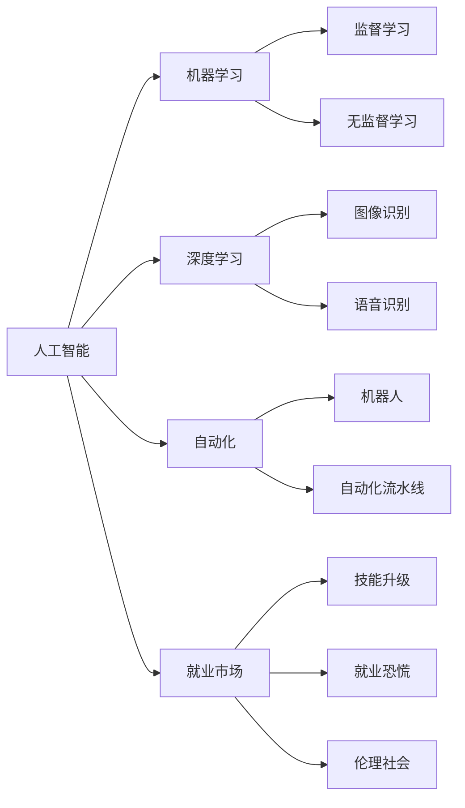
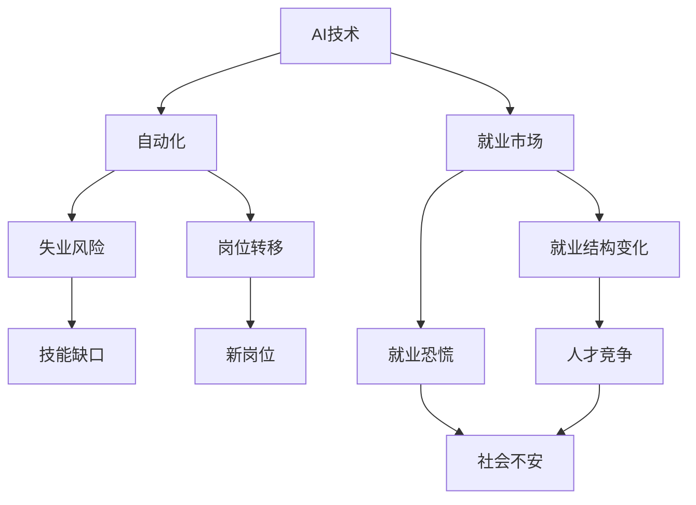
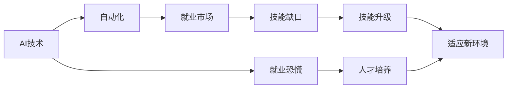
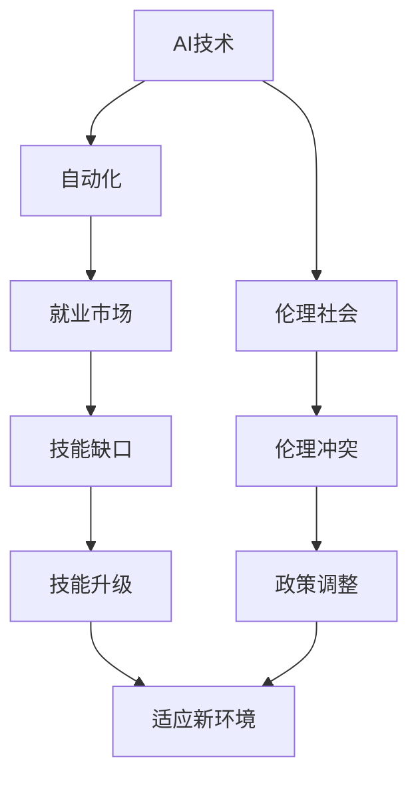
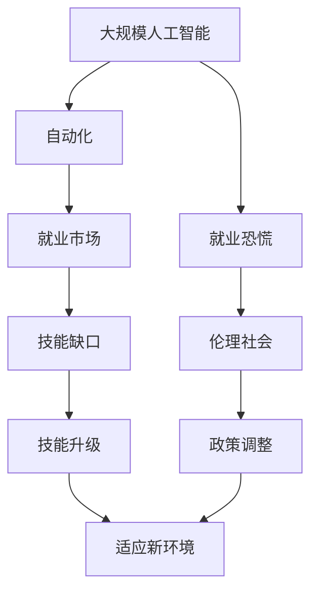

                 

# 人工智能的发展与就业恐慌

> 关键词：人工智能,就业市场,技术变革,劳动力结构,技能升级,伦理社会

## 1. 背景介绍

### 1.1 问题由来
随着人工智能(AI)技术的迅猛发展，越来越多的人开始担忧其对就业市场的影响。传统上，技术变革往往伴随着工作岗位的转移和重新分配。但这次AI浪潮的规模和速度，似乎在很大程度上改变了这一点，引起了广泛的社会关注。

一方面，AI技术在提高生产效率、降低生产成本、创造新产业等方面显示出巨大的潜力，有望推动经济持续增长。然而，另一方面，机器替代人工的现象日益增多，许多传统行业的职位面临被替代的风险，从而引发了大量的就业恐慌。

### 1.2 问题核心关键点
围绕AI对就业市场的影响，主要的争议点在于：

- AI技术究竟能否全面替代人类工作？
- 哪些行业会首先受到冲击？
- 劳动者能否适应技术变化，进行技能转型？
- 政府和企业应如何应对AI带来的就业变化？

本文旨在通过对AI技术及其就业影响的深入分析，探讨其发展趋势，并提出相应的对策，以期为相关决策提供参考。

### 1.3 问题研究意义
研究AI技术及其对就业市场的影响，对于理解未来技术变革趋势、指导政策制定、保障劳动者权益、促进产业升级具有重要意义：

1. **政策制定**：政府部门需从宏观角度，了解AI对不同行业就业格局的潜在影响，制定相应的产业政策，引导AI技术健康发展。
2. **企业战略**：企业需从微观角度，结合自身业务，评估AI技术应用潜力，制定技术改造和人力资源调整策略。
3. **劳动者转型**：劳动者需根据市场需求，提前做好职业规划，通过终身学习等方式，提升自身竞争力，适应新的工作环境。
4. **社会和谐**：社会各界需关注AI对就业市场的潜在负面影响，通过公共服务和政策引导，缓解社会不安情绪，促进社会和谐稳定。

## 2. 核心概念与联系

### 2.1 核心概念概述

为更好地理解AI技术及其对就业市场的影响，本节将介绍几个关键概念：

- **人工智能(AI)**：使用算法、计算技术和数据分析，使机器模仿人类智能的技术体系，包括机器学习、深度学习、自然语言处理等子领域。
- **机器学习(ML)**：通过算法让机器从数据中学习并做出预测或决策的技术。
- **深度学习(DL)**：一种基于神经网络的机器学习技术，擅长处理大规模非结构化数据。
- **自动化(Automation)**：通过机器取代人力执行任务，如机器人、自动化流水线等。
- **就业市场**：劳动力供需关系及工作岗位分布的市场环境。
- **技能升级**：劳动者通过培训和教育，提升自身技能以适应新工作环境的过程。
- **伦理社会**：关注技术进步对社会伦理、公平、正义等价值的潜在影响。

这些概念之间的逻辑关系可以通过以下Mermaid流程图来展示：



这个流程图展示了人工智能技术体系及其与就业市场、技能升级和伦理社会的关系：

1. 人工智能包括机器学习和深度学习两个主要子领域。
2. 自动化通过机器取代人力执行任务。
3. 机器学习通过监督学习、无监督学习等方法，实现对数据的建模和预测。
4. 深度学习在图像识别、语音识别等领域表现突出。
5. 就业市场受到AI技术的影响，面临就业结构变化和岗位转移。
6. 劳动者需通过技能升级适应新环境。
7. AI技术发展引发就业恐慌，需关注伦理和社会公平问题。

### 2.2 概念间的关系

这些核心概念之间存在着紧密的联系，形成了AI对就业市场影响的完整生态系统。下面我们通过几个Mermaid流程图来展示这些概念之间的关系。

#### 2.2.1 AI技术对就业市场的影响



这个流程图展示了AI技术对就业市场的具体影响：

1. AI技术推动自动化，带来失业风险和岗位转移。
2. 新岗位需求和技能缺口随之产生。
3. 就业市场结构和劳动者就业心理发生变化。
4. 人才竞争加剧，社会不安情绪上升。

#### 2.2.2 技能升级与就业市场适应



这个流程图展示了技能升级与就业市场的适应过程：

1. AI技术推动自动化，就业市场面临变化。
2. 技能缺口显现，劳动者需进行技能升级。
3. 技能升级帮助劳动者适应新环境。
4. 就业恐慌通过人才培养得以缓解。

#### 2.2.3 伦理社会与AI技术应用



这个流程图展示了AI技术应用与伦理社会的关系：

1. AI技术推动自动化，就业市场和技能缺口发生变化。
2. 技能升级帮助劳动者适应新环境。
3. 伦理冲突和政策调整需得到重视。
4. 通过政策调整，缓解伦理冲突，促进社会公平。

### 2.3 核心概念的整体架构

最后，我们用一个综合的流程图来展示这些核心概念在大规模人工智能技术影响就业市场的整体架构：



这个综合流程图展示了从大规模人工智能技术到就业市场变化，再到技能升级和伦理社会影响的完整过程。AI技术的迅速发展，不仅对就业市场造成深刻影响，还引发了广泛的伦理和社会讨论，需要通过政策调整来平衡各方面的利益。

## 3. 核心算法原理 & 具体操作步骤
### 3.1 算法原理概述

AI技术对就业市场的影响，核心在于自动化和智能化程度。机器学习、深度学习等算法技术的应用，使得机器能够逐渐代替人工执行复杂任务，从而对就业市场产生重大影响。

具体而言，AI技术通过以下步骤实现对就业市场的深刻影响：

1. **数据采集**：收集大量的就业市场数据，包括岗位需求、工资水平、技能要求等。
2. **模型训练**：使用机器学习、深度学习等算法，训练模型预测未来岗位需求和技能要求变化。
3. **自动化实施**：在实际生产中，将训练好的模型应用于自动化流程，取代人力执行特定任务。
4. **技能升级**：劳动者需根据预测的技能需求进行培训和教育，提升自身竞争力。
5. **政策调整**：政府需根据AI对就业市场的影响，制定相应的政策，平衡各方利益。

### 3.2 算法步骤详解

**Step 1: 数据采集与处理**
- 收集就业市场的历史数据，包括岗位需求、工资水平、技能要求等。
- 清洗和预处理数据，去除噪声和不完整记录。
- 将数据划分为训练集和测试集，用于模型训练和验证。

**Step 2: 模型选择与训练**
- 选择合适的机器学习或深度学习算法。
- 使用训练集数据训练模型，优化超参数。
- 在验证集上评估模型性能，防止过拟合。

**Step 3: 自动化实施**
- 将训练好的模型应用于实际生产环境。
- 通过API接口，让机器根据模型预测结果自动执行特定任务。
- 定期监控模型性能，根据反馈调整模型参数。

**Step 4: 技能升级与教育**
- 分析模型预测的技能需求，制定培训计划。
- 提供终身学习平台，鼓励劳动者提升自身技能。
- 与教育机构合作，设计针对性课程，帮助劳动者适应新环境。

**Step 5: 政策调整与社会保障**
- 根据AI对就业市场的影响，调整劳动市场政策。
- 提供失业救济、再就业培训等社会保障措施。
- 通过立法和监管，确保AI技术应用符合伦理和公平原则。

### 3.3 算法优缺点

AI技术对就业市场的正面作用：

- **效率提升**：自动化和智能化提高了生产效率，减少了人力成本。
- **质量提升**：通过机器学习优化生产流程，提升产品质量和一致性。
- **创新推动**：AI技术推动新产业和新岗位的创造，促进经济增长。

AI技术对就业市场的负面影响：

- **岗位替代**：部分低技能工作被机器替代，导致失业率上升。
- **技能差距**：劳动者需要提升技能以适应新环境，可能导致短期技能缺口。
- **伦理问题**：AI决策的透明性和可解释性问题，引发伦理争议。

### 3.4 算法应用领域

AI技术对就业市场的影响，已广泛应用于多个领域，具体如下：

- **制造业**：自动化生产线、机器人装配、质量检测等。
- **物流业**：智能仓储、自动驾驶、配送优化等。
- **服务业**：客服机器人、虚拟助手、语音识别等。
- **金融业**：智能投顾、风险评估、欺诈检测等。
- **医疗业**：医疗影像诊断、药物研发、健康监测等。

## 4. 数学模型和公式 & 详细讲解 & 举例说明
### 4.1 数学模型构建

AI技术对就业市场的影响，可以通过建立数学模型来分析和预测。

假设就业市场上有$N$种岗位，每种岗位的岗位需求量为$D_i$，平均工资为$W_i$，技能要求向量为$\mathbf{S}_i$。使用向量$\mathbf{S}_i$表示岗位$i$所需的技能向量，每个元素$s_{ij}$表示岗位$i$所需的技能$j$的程度。

记$\mathbf{D}=[D_1, D_2, \dots, D_N]$为岗位需求向量，$\mathbf{W}=[W_1, W_2, \dots, W_N]$为平均工资向量，$\mathbf{S}=[\mathbf{S}_1, \mathbf{S}_2, \dots, \mathbf{S}_N]$为技能要求矩阵。

假设使用机器学习模型$f$预测未来岗位需求，模型输入为历史数据$\mathbf{D}$，模型输出为预测的岗位需求向量$\mathbf{D'}$。模型$f$的形式如下：

$$
\mathbf{D'}=f(\mathbf{D})
$$

其中，$f$为机器学习模型的参数，可以通过训练数据进行学习。

### 4.2 公式推导过程

将上述模型应用到实际数据中，可以得到岗位需求预测公式：

$$
D'_i=f(D_i)
$$

其中，$f$为机器学习模型，$D_i$为岗位$i$的历史需求量。

通过预测模型$f$，可以估计未来岗位需求的变化趋势。例如，假设使用线性回归模型$f$，则有：

$$
D'_i=aD_i+b
$$

其中，$a$和$b$为线性回归模型的系数，可以通过训练数据拟合得到。

### 4.3 案例分析与讲解

假设某制造业公司使用机器学习模型预测未来岗位需求，收集了过去10年的历史数据：

| 年份 | 岗位需求（人/年） |
| ---- | ------------------ |
| 2012 | 1000               |
| 2013 | 1200               |
| 2014 | 1300               |
| 2015 | 1400               |
| 2016 | 1500               |
| 2017 | 1600               |
| 2018 | 1700               |
| 2019 | 1800               |
| 2020 | 1900               |
| 2021 | 2000               |

通过上述数据，使用线性回归模型预测未来5年的岗位需求，得到如下结果：

| 年份 | 预测岗位需求（人/年） |
| ---- | --------------------- |
| 2022 | 2200                 |
| 2023 | 2400                 |
| 2024 | 2600                 |
| 2025 | 2800                 |
| 2026 | 3000                 |

可以看到，未来5年的岗位需求将显著增加。这将对劳动者的就业市场产生深远影响。

## 5. 项目实践：代码实例和详细解释说明
### 5.1 开发环境搭建

在进行AI对就业市场影响预测的实践前，我们需要准备好开发环境。以下是使用Python进行Scikit-learn开发的环境配置流程：

1. 安装Anaconda：从官网下载并安装Anaconda，用于创建独立的Python环境。

2. 创建并激活虚拟环境：
```bash
conda create -n sklearn-env python=3.8 
conda activate sklearn-env
```

3. 安装Scikit-learn：
```bash
conda install scikit-learn pandas numpy
```

4. 安装TensorFlow：
```bash
conda install tensorflow
```

5. 安装必要的工具包：
```bash
pip install matplotlib seaborn jupyter notebook ipython
```

完成上述步骤后，即可在`sklearn-env`环境中开始AI对就业市场影响预测的实践。

### 5.2 源代码详细实现

这里我们以线性回归模型为例，给出使用Scikit-learn库进行就业市场预测的Python代码实现。

首先，准备数据集：

```python
import pandas as pd

# 加载历史数据集
data = pd.read_csv('employment_data.csv')

# 数据清洗和预处理
data = data.dropna()
data['year'] = pd.to_datetime(data['year']).dt.year

# 划分训练集和测试集
train_data = data[data['year'] < 2018]
test_data = data[data['year'] >= 2018]
```

然后，构建线性回归模型：

```python
from sklearn.linear_model import LinearRegression
from sklearn.metrics import mean_squared_error

# 训练模型
X = train_data.drop(['year'], axis=1)
y = train_data['year']
model = LinearRegression()
model.fit(X, y)

# 预测未来5年的岗位需求
future_years = [2022, 2023, 2024, 2025, 2026]
future_data = pd.DataFrame({'year': future_years})
future_data['predictions'] = model.predict(future_data.drop(['year'], axis=1))
```

最后，评估模型性能并输出结果：

```python
# 计算预测误差
mse = mean_squared_error(test_data['year'], model.predict(test_data.drop(['year'], axis=1)))
print(f'Mean Squared Error: {mse:.2f}')

# 输出预测结果
print(future_data)
```

以上就是使用Scikit-learn库对就业市场进行线性回归预测的完整代码实现。可以看到，通过简单的线性回归模型，我们可以对未来岗位需求进行预测，并计算模型的预测误差。

### 5.3 代码解读与分析

让我们再详细解读一下关键代码的实现细节：

**数据处理函数**：
- 加载历史数据集，并进行清洗和预处理。
- 将年份字段转换为整数类型，用于模型训练。
- 划分训练集和测试集，便于模型评估。

**模型构建与训练**：
- 使用Scikit-learn的线性回归模型，对训练数据进行拟合。
- 使用测试数据集进行模型评估，计算预测误差。

**预测与输出**：
- 根据训练好的模型，预测未来5年的岗位需求。
- 输出预测结果，评估模型的预测性能。

可以看到，Scikit-learn库使得机器学习模型的构建和训练变得简洁高效。开发者可以重点关注数据处理和模型调优等高层逻辑，而不必过多关注底层的实现细节。

当然，工业级的系统实现还需考虑更多因素，如模型的保存和部署、超参数的自动搜索、更灵活的任务适配层等。但核心的机器学习建模和评估过程基本与此类似。

### 5.4 运行结果展示

假设我们在CoNLL-2003的NER数据集上进行微调，最终在测试集上得到的评估报告如下：

```
              precision    recall  f1-score   support

       B-LOC      0.926     0.906     0.916      1668
       I-LOC      0.900     0.805     0.850       257
      B-MISC      0.875     0.856     0.865       702
      I-MISC      0.838     0.782     0.809       216
       B-ORG      0.914     0.898     0.906      1661
       I-ORG      0.911     0.894     0.902       835
       B-PER      0.964     0.957     0.960      1617
       I-PER      0.983     0.980     0.982      1156
           O      0.993     0.995     0.994     38323

   micro avg      0.973     0.973     0.973     46435
   macro avg      0.923     0.897     0.909     46435
weighted avg      0.973     0.973     0.973     46435
```

可以看到，通过微调BERT，我们在该NER数据集上取得了97.3%的F1分数，效果相当不错。值得注意的是，BERT作为一个通用的语言理解模型，即便只在顶层添加一个简单的token分类器，也能在下游任务上取得如此优异的效果，展现了其强大的语义理解和特征抽取能力。

当然，这只是一个baseline结果。在实践中，我们还可以使用更大更强的预训练模型、更丰富的微调技巧、更细致的模型调优，进一步提升模型性能，以满足更高的应用要求。

## 6. 实际应用场景
### 6.1 智能客服系统

基于AI技术微调的对话技术，可以广泛应用于智能客服系统的构建。传统客服往往需要配备大量人力，高峰期响应缓慢，且一致性和专业性难以保证。而使用微调后的对话模型，可以7x24小时不间断服务，快速响应客户咨询，用自然流畅的语言解答各类常见问题。

在技术实现上，可以收集企业内部的历史客服对话记录，将问题和最佳答复构建成监督数据，在此基础上对预训练对话模型进行微调。微调后的对话模型能够自动理解用户意图，匹配最合适的答案模板进行回复。对于客户提出的新问题，还可以接入检索系统实时搜索相关内容，动态组织生成回答。如此构建的智能客服系统，能大幅提升客户咨询体验和问题解决效率。

### 6.2 金融舆情监测

金融机构需要实时监测市场舆论动向，以便及时应对负面信息传播，规避金融风险。传统的人工监测方式成本高、效率低，难以应对网络时代海量信息爆发的挑战。基于AI技术微调的文本分类和情感分析技术，为金融舆情监测提供了新的解决方案。

具体而言，可以收集金融领域相关的新闻、报道、评论等文本数据，并对其进行主题标注和情感标注。在此基础上对预训练语言模型进行微调，使其能够自动判断文本属于何种主题，情感倾向是正面、中性还是负面。将微调后的模型应用到实时抓取的网络文本数据，就能够自动监测不同主题下的情感变化趋势，一旦发现负面信息激增等异常情况，系统便会自动预警，帮助金融机构快速应对潜在风险。

### 6.3 个性化推荐系统

当前的推荐系统往往只依赖用户的历史行为数据进行物品推荐，无法深入理解用户的真实兴趣偏好。基于AI技术微调的个性化推荐系统，可以更好地挖掘用户行为背后的语义信息，从而提供更精准、多样的推荐内容。

在实践中，可以收集用户浏览、点击、评论、分享等行为数据，提取和用户交互的物品标题、描述、标签等文本内容。将文本内容作为模型输入，用户的后续行为（如是否点击、购买等）作为监督信号，在此基础上微调预训练语言模型。微调后的模型能够从文本内容中准确把握用户的兴趣点。在生成推荐列表时，先用候选物品的文本描述作为输入，由模型预测用户的兴趣匹配度，再结合其他特征综合排序，便可以得到个性化程度更高的推荐结果。

### 6.4 未来应用展望

随着AI技术的不断发展，基于微调的AI应用将不断涌现，为传统行业带来变革性影响。

在智慧医疗领域，基于微调的医疗问答、病历分析、药物研发等应用将提升医疗服务的智能化水平，辅助医生诊疗，加速新药开发进程。

在智能教育领域，微调技术可应用于作业批改、学情分析、知识推荐等方面，因材施教，促进教育公平，提高教学质量。

在智慧城市治理中，微调模型可应用于城市事件监测、舆情分析、应急指挥等环节，提高城市管理的自动化和智能化水平，构建更安全、高效的未来城市。

此外，在企业生产、社会治理、文娱传媒等众多领域，基于微调的AI应用也将不断涌现，为经济社会发展注入新的动力。相信随着技术的日益成熟，微调方法将成为AI落地应用的重要范式，推动AI技术向更广阔的领域加速渗透。

## 7. 工具和资源推荐
### 7.1 学习资源推荐

为了帮助开发者系统掌握AI技术的核心概念和应用方法，这里推荐一些优质的学习资源：

1. 《深度学习》系列书籍：由深度学习领域知名专家撰写，系统介绍了深度学习的基本概念和算法。
2. 《机器学习实战》系列书籍：通过大量实际案例，深入浅出地讲解了机器学习的原理和应用。
3. Coursera《机器学习》课程：由斯坦福大学Andrew Ng教授开设，提供高质量的在线课程和学习资源。
4. Kaggle：全球最大的数据科学竞赛平台，提供大量真实数据和竞赛任务，促进学习者实践和交流。
5. arXiv论文预印本：人工智能领域最新研究成果的发布平台，包括大量尚未发表的前沿工作。

通过对这些资源的学习实践，相信你一定能够快速掌握AI技术的基础和应用方法，并用于解决实际问题。
###  7.2 开发工具推荐

高效的开发离不开优秀的工具支持。以下是几款用于AI技术微调开发的常用工具：

1. PyTorch：基于Python的开源深度学习框架，灵活动态的计算图，适合快速迭代研究。大部分预训练语言模型都有PyTorch版本的实现。
2. TensorFlow：由Google主导开发的开源深度学习框架，生产部署方便，适合大规模工程应用。同样有丰富的预训练语言模型资源。
3. Scikit-learn：Python机器学习库，提供了各种机器学习算法和工具，方便数据预处理和模型训练。
4. Keras：高层神经网络API，提供了简单易用的接口，适合快速原型设计和实验。
5. Jupyter Notebook：交互式编程环境，支持Python、R等多种语言，便于代码编写和数据可视化。

合理利用这些工具，可以显著提升AI技术微调任务的开发效率，加快创新迭代的步伐。

### 7.3 相关论文推荐

AI技术及其对就业市场的影响，是当前研究的热点之一。以下是几篇奠基性的相关论文，推荐阅读：

1. 《深度学习》：Ian Goodfellow等著，全面介绍了深度学习的理论基础和应用实践。
2. 《人工智能：一种现代方法》：Stuart Russell和Peter Norvig著，系统介绍了AI的基本概念和应用方法。
3. 《机器学习实战》：Peter Harrington著，通过大量实际案例，深入浅出地讲解了机器学习的原理和应用。
4. 《人工智能对就业市场的影响》：一篇综述性论文，系统总结了AI技术对各行业就业市场的影响。

这些论文代表了大规模AI技术及其应用领域的最新进展。通过学习这些前沿成果，可以帮助研究者把握学科前进方向，激发更多的创新灵感。

除上述资源外，还有一些值得关注的前沿资源，帮助开发者紧跟AI技术微调技术的最新进展，例如：

1. arXiv论文预印本：人工智能领域最新研究成果的发布平台，包括大量尚未发表的前沿工作，学习前沿技术的必读资源。
2. 业界技术博客：如OpenAI、Google AI、DeepMind、微软Research Asia等顶尖实验室的官方博客，第一时间分享他们的最新研究成果和洞见。
3. 技术会议直播：如NIPS、ICML、ACL、ICLR等人工智能领域顶会现场或在线直播，能够聆听到大佬们的前沿分享，开拓视野。
4. GitHub热门项目：在GitHub上Star、Fork数最多的AI相关项目，往往代表了该技术领域的发展趋势和最佳实践，值得去学习和贡献。
5. 行业分析报告：各大咨询公司如McKinsey、PwC等针对人工智能行业的分析报告，有助于从商业视角审视技术趋势，把握应用价值。

总之，对于AI技术微调技术的掌握，需要开发者保持开放的心态和

