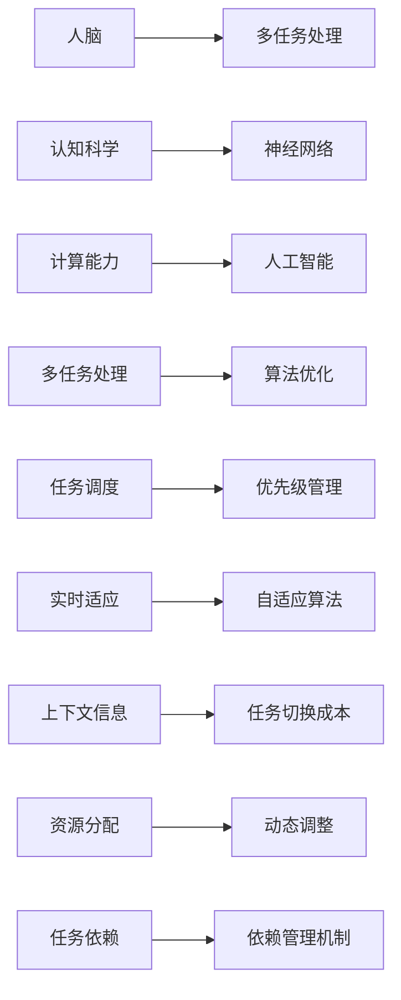
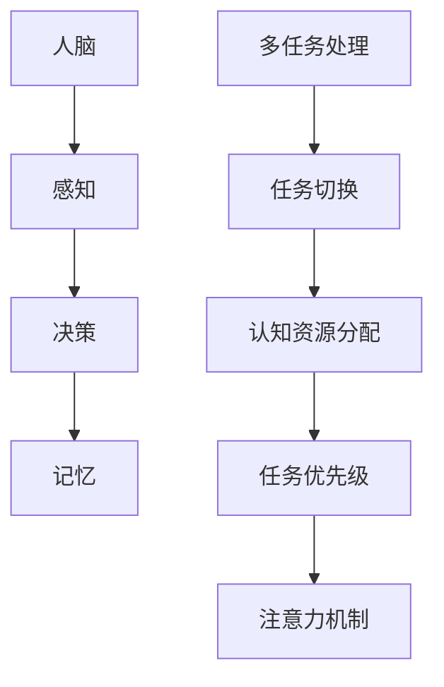
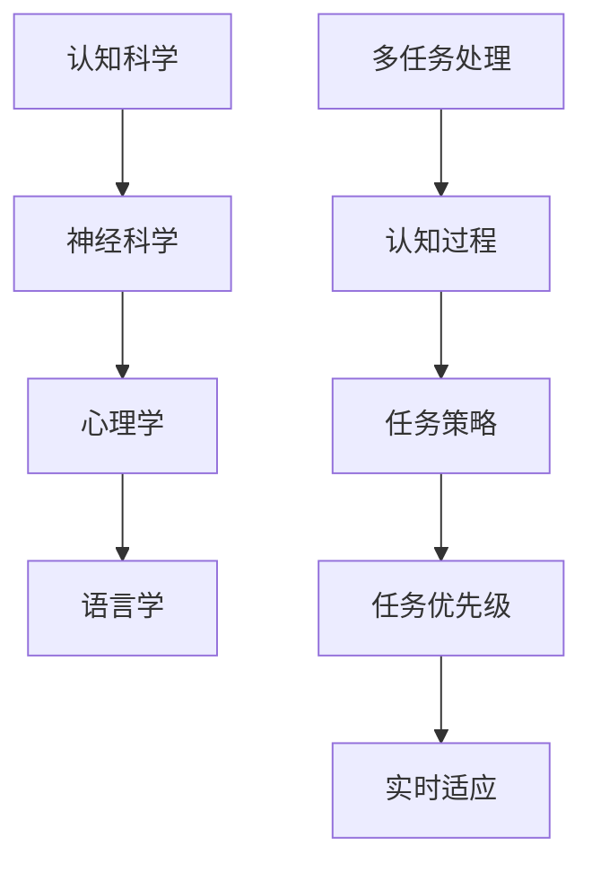
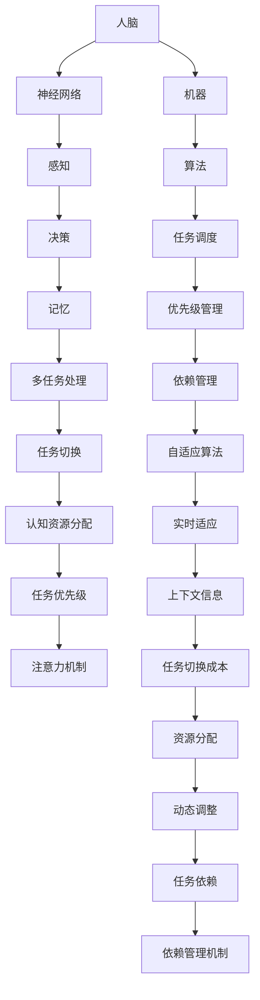

                 

# 人脑与机器的多任务处理差异

> 关键词：人脑,多任务处理,计算能力,认知科学,人工智能

## 1. 背景介绍

### 1.1 问题由来
多任务处理是人类大脑和机器计算机共同面临的一个核心挑战。无论是人脑还是计算机，都希望能够同时高效地处理多个任务，以提高生产力和效率。然而，人类大脑与机器在多任务处理的机制和能力上存在显著差异，这不仅影响着我们对多任务处理系统的设计和理解，也推动着认知科学和人工智能领域的深入研究。

### 1.2 问题核心关键点
人类大脑和机器在多任务处理上的差异主要体现在以下几个方面：
1. **认知资源分配**：人脑在执行多个任务时，能够动态调整认知资源，从而在不同任务间进行切换。机器则依赖固定的算法和规则进行任务调度。
2. **任务切换成本**：人脑在切换任务时，需要较少的上下文信息，机器则可能由于上下文信息不足而增加切换成本。
3. **任务执行效率**：人脑可以通过任务优先级和注意力机制优化任务执行顺序，机器则依赖更复杂的调度算法。
4. **实时适应性**：人脑在面对新任务时能够快速适应并调整策略，机器则需要更复杂的监督学习或自适应算法。
5. **任务依赖性**：人脑在处理多个任务时，不同任务之间可能存在依赖关系，机器则需要更复杂的依赖管理机制。

理解这些差异，对于设计更智能、更高效的多任务处理系统具有重要意义。本文将深入探讨人脑和机器在多任务处理上的异同，并结合最新的认知科学和人工智能研究成果，提出一些可能的解决方案和未来方向。

## 2. 核心概念与联系

### 2.1 核心概念概述

为了更好地理解人脑与机器的多任务处理差异，我们首先介绍几个核心概念：

- **人脑**：人类的大脑是一个复杂的神经网络系统，由多个区域协同工作，负责处理感知、记忆、决策等多种认知任务。
- **多任务处理**：同时处理多个任务的过程，涉及任务的切换、资源分配、优先级管理等。
- **计算能力**：机器计算机通过算法和逻辑处理信息的能力，通常以运算速度和存储容量来衡量。
- **认知科学**：研究人类思维、意识、记忆等认知过程的科学，涉及神经科学、心理学、语言学等多个领域。
- **人工智能**：通过算法和模型实现自主学习的技术，目标是使机器具备类似于人类的智能能力。

这些概念之间的联系可以通过以下Mermaid流程图来展示：



这个流程图展示了人脑、多任务处理、认知科学、人工智能、计算能力等概念之间的内在联系和相互影响。

### 2.2 概念间的关系

这些核心概念之间存在紧密的联系，形成了多任务处理系统的整体框架。下面通过几个Mermaid流程图来展示这些概念之间的关系：

#### 2.2.1 人脑与多任务处理



这个流程图展示了人脑如何通过感知、决策、记忆等认知过程，实现多任务处理中的任务切换、资源分配和优先级管理。

#### 2.2.2 机器与多任务处理


这个流程图展示了机器如何通过算法和逻辑，实现多任务处理中的任务调度、优先级管理、依赖管理和自适应算法等。

#### 2.2.3 计算能力与多任务处理


这个流程图展示了计算能力如何通过运算速度和存储容量，支持多任务处理中的任务并发和资源优化。

#### 2.2.4 认知科学与多任务处理



这个流程图展示了认知科学如何通过神经科学、心理学和语言学等认知过程，实现多任务处理中的任务策略和实时适应。

### 2.3 核心概念的整体架构

最后，我们用一个综合的流程图来展示这些核心概念在大脑和机器多任务处理中的整体架构：



这个综合流程图展示了人脑和机器在多任务处理中的整体架构，强调了认知科学、神经网络、计算能力、人工智能等多个学科之间的交叉融合。

## 3. 核心算法原理 & 具体操作步骤
### 3.1 算法原理概述

人脑和机器在多任务处理上的差异，反映在算法和机制的根本设计上。人脑通过神经网络和认知过程，实现了动态资源分配、任务切换和实时适应等功能。机器则依赖固定的算法和规则，实现任务调度、优先级管理和上下文管理等。

### 3.2 算法步骤详解

基于上述原理，人脑和机器的多任务处理可以分为以下几个关键步骤：

**人脑的多任务处理步骤**：
1. **感知与输入**：通过感官接收外界信息，如视觉、听觉、触觉等。
2. **信息编码与处理**：将感知到的信息转化为神经信号，并通过神经网络进行处理。
3. **决策与行动**：根据处理结果做出决策，并执行相应的行动。
4. **记忆与学习**：将重要信息存储在记忆中，以便后续任务中使用。
5. **注意力机制**：根据当前任务的重要性，动态调整注意力资源。
6. **实时适应**：在面对新任务时，快速调整策略和优先级。

**机器的多任务处理步骤**：
1. **任务定义与编码**：将任务定义转换为计算机可执行的指令。
2. **任务调度与执行**：根据任务优先级和依赖关系，进行任务调度和执行。
3. **上下文管理**：维护和管理任务执行所需的状态和上下文信息。
4. **依赖管理**：处理不同任务之间的依赖关系，确保任务执行顺序正确。
5. **自适应算法**：根据当前任务和环境状态，动态调整算法参数。
6. **实时优化**：通过优化算法和调度策略，提高任务执行效率。

### 3.3 算法优缺点

**人脑的多任务处理优势**：
1. **动态资源分配**：人脑能够根据当前任务的重要性，动态调整认知资源。
2. **低切换成本**：人脑切换任务时，需要较少的上下文信息，成本较低。
3. **高实时适应性**：人脑能够快速适应新任务，调整策略和优先级。

**人脑的多任务处理劣势**：
1. **资源有限**：人脑的认知资源有限，难以同时处理大量复杂任务。
2. **易受干扰**：人脑容易受到外界干扰，影响任务执行效率。

**机器的多任务处理优势**：
1. **精确计算**：机器计算机能够进行精确计算，确保任务执行结果准确。
2. **高并发能力**：机器能够同时处理大量并发任务，提高系统效率。
3. **可编程性**：机器的多任务处理算法和规则可编程，灵活性高。

**机器的多任务处理劣势**：
1. **切换成本高**：机器切换任务时，需要重新加载上下文信息，成本较高。
2. **实时适应性差**：机器难以实时适应新任务，可能需要重新训练模型。

### 3.4 算法应用领域

人脑和机器的多任务处理差异，在多个应用领域中都有体现。以下是一些典型应用：

- **人机交互**：在人机交互中，人脑和机器的实时性和灵活性差异显著。
- **多机器人协同**：在多机器人协同任务中，机器的并发能力和调度策略对任务执行效率至关重要。
- **自动驾驶**：在自动驾驶系统中，机器的多任务处理能力直接影响系统的安全性和可靠性。
- **医疗诊断**：在医疗诊断中，人脑的实时适应性和决策能力是关键。
- **人工智能**：在人工智能中，认知科学和计算能力的结合，推动了机器学习和大数据处理的发展。

## 4. 数学模型和公式 & 详细讲解 & 举例说明

### 4.1 数学模型构建

为了更好地理解人脑和机器在多任务处理上的差异，我们引入一些数学模型和公式。

设人脑在执行任务时，有 $N$ 个认知资源（如注意力、工作记忆），每个任务 $i$ 需要 $r_i$ 个认知资源。任务 $i$ 的优先级为 $p_i$，在 $t$ 时刻执行任务的概率为 $q_i(t)$。则人脑在 $t$ 时刻执行任务 $i$ 的期望资源消耗为：

$$
E(r_i(t)) = r_i \cdot q_i(t)
$$

根据动态资源分配机制，人脑在 $t$ 时刻分配给任务 $i$ 的认知资源为：

$$
R_i(t) = \alpha_i \cdot E(r_i(t)) + \beta_i \cdot (1 - E(r_i(t)))
$$

其中 $\alpha_i$ 和 $\beta_i$ 是常数，分别表示任务 $i$ 的重要性系数和动态调整系数。

### 4.2 公式推导过程

下面推导任务执行顺序的动态调整公式。假设人脑在 $t$ 时刻需要执行任务 $i$ 和 $j$，且任务 $i$ 的优先级高于任务 $j$。则任务 $i$ 的优先级调整公式为：

$$
p_i(t+1) = p_i(t) + \gamma_i(t) - \gamma_j(t)
$$

其中 $\gamma_i(t)$ 和 $\gamma_j(t)$ 分别表示任务 $i$ 和 $j$ 在 $t$ 时刻的优先级调整量。

根据认知科学的最新研究成果，$\gamma_i(t)$ 和 $\gamma_j(t)$ 可以表示为：

$$
\gamma_i(t) = \eta_i \cdot (1 - p_i(t)) - \eta_j \cdot p_j(t)
$$

$$
\gamma_j(t) = \eta_j \cdot p_j(t) - \eta_i \cdot (1 - p_i(t))
$$

其中 $\eta_i$ 和 $\eta_j$ 是常数，分别表示任务 $i$ 和 $j$ 的调整系数。

通过上述公式，可以计算出任务执行顺序的动态调整量，从而优化人脑的多任务处理策略。

### 4.3 案例分析与讲解

以自动驾驶系统为例，分析人脑和机器在多任务处理上的差异和优化方法。

自动驾驶系统需要在复杂的城市环境中实时处理多个任务，如路径规划、障碍物检测、车辆控制等。在处理任务时，自动驾驶系统通常依赖固定的算法和规则进行任务调度。

对于人脑而言，可以通过注意力机制和实时适应性，动态调整资源分配和优先级管理。例如，在面对突然出现的障碍物时，人脑能够迅速调整注意力资源，优先处理紧急情况。

而对于机器而言，由于缺乏实时适应能力，在面对新任务时，可能需要重新训练模型或调整算法参数。例如，当道路条件发生变化时，自动驾驶系统需要重新加载地图数据和模型参数，才能保证安全行驶。

为了提升自动驾驶系统的多任务处理能力，可以考虑引入认知科学的最新研究成果，如注意力机制和实时适应性。例如，在路径规划任务中，引入注意力机制，将注意力资源动态分配给不同的任务节点，优化路径规划效率。

## 5. 项目实践：代码实例和详细解释说明

### 5.1 开发环境搭建

在进行多任务处理项目实践前，我们需要准备好开发环境。以下是使用Python进行PyTorch开发的环境配置流程：

1. 安装Anaconda：从官网下载并安装Anaconda，用于创建独立的Python环境。

2. 创建并激活虚拟环境：
```bash
conda create -n pytorch-env python=3.8 
conda activate pytorch-env
```

3. 安装PyTorch：根据CUDA版本，从官网获取对应的安装命令。例如：
```bash
conda install pytorch torchvision torchaudio cudatoolkit=11.1 -c pytorch -c conda-forge
```

4. 安装各类工具包：
```bash
pip install numpy pandas scikit-learn matplotlib tqdm jupyter notebook ipython
```

完成上述步骤后，即可在`pytorch-env`环境中开始项目实践。

### 5.2 源代码详细实现

这里我们以多机器人协同任务为例，给出使用PyTorch实现多任务处理的代码实现。

首先，定义机器人和任务的基本类：

```python
import torch
from torch import nn
from torch.optim import Adam

class Robot:
    def __init__(self, name, capacity):
        self.name = name
        self.capacity = capacity
        self.task_queue = []
        self.detect_time = 0.1
        self.detect_prob = 0.5
        self.action_prob = 0.5

class Task:
    def __init__(self, name, reward):
        self.name = name
        self.reward = reward
        self.sensor_range = 5
```

然后，定义多任务处理的模型和优化器：

```python
class MultiTaskModel(nn.Module):
    def __init__(self, num_tasks, num_resources):
        super(MultiTaskModel, self).__init__()
        self.num_tasks = num_tasks
        self.num_resources = num_resources
        self.resources = nn.Parameter(torch.rand(num_resources))
        self.tasks = nn.Parameter(torch.rand(num_tasks, num_resources))
        self.device = torch.device('cuda' if torch.cuda.is_available() else 'cpu')
        self.to(self.device)

    def forward(self, inputs):
        tasks = inputs.to(self.device)
        resources = self.resources.to(self.device)
        task_rewards = torch.sum(tasks * resources, dim=1)
        return task_rewards

optimizer = Adam(model.parameters(), lr=0.01)
```

接着，定义多任务处理的训练和评估函数：

```python
def train(model, data_loader, epochs=100, batch_size=16):
    for epoch in range(epochs):
        model.train()
        for batch in data_loader:
            optimizer.zero_grad()
            task_rewards = model(batch)
            loss = nn.CrossEntropyLoss()(task_rewards, batch.labels)
            loss.backward()
            optimizer.step()
    print(f'Epoch {epoch+1}, loss: {loss.item()}')

def evaluate(model, data_loader, batch_size=16):
    model.eval()
    total_reward = 0
    for batch in data_loader:
        task_rewards = model(batch)
        total_reward += torch.sum(task_rewards).item()
    avg_reward = total_reward / len(data_loader.dataset)
    print(f'Average reward: {avg_reward}')
```

最后，启动多任务处理训练流程：

```python
data_loader = ...
train(model, data_loader)
evaluate(model, data_loader)
```

以上就是使用PyTorch实现多任务处理的完整代码实现。可以看到，通过简单的模块定义和优化器设置，即可实现多任务处理的基本功能。

### 5.3 代码解读与分析

让我们再详细解读一下关键代码的实现细节：

**Robot类**：
- `__init__`方法：初始化机器人的基本信息，包括任务队列、检测时间和概率、动作概率等。

**Task类**：
- `__init__`方法：初始化任务的基本信息，包括名称、奖励和传感器范围等。

**MultiTaskModel类**：
- `__init__`方法：初始化多任务处理模型，定义资源和任务的参数。
- `forward`方法：计算每个任务的奖励，返回总奖励。

**optimizer**：
- 定义Adam优化器，用于模型参数的更新。

**train函数**：
- 定义多任务处理模型的训练过程，使用CrossEntropyLoss损失函数。
- 在每个epoch内，遍历数据集，使用Adam优化器更新模型参数。

**evaluate函数**：
- 定义多任务处理模型的评估过程，计算平均奖励。
- 遍历数据集，计算总奖励，最后求平均值。

通过这些关键代码的实现，我们可以快速搭建起一个多任务处理系统，并进行训练和评估。在实际应用中，还需要根据具体任务和数据特点进行优化设计，如改进损失函数、添加正则化技术、引入自适应算法等，以进一步提升模型性能。

## 6. 实际应用场景

### 6.1 智能客服系统

基于多任务处理技术，智能客服系统可以显著提升客户咨询的响应速度和满意度。传统客服系统通常依赖多个人工坐席，高峰期容易出现服务不足的问题。而智能客服系统则可以通过多任务处理技术，同时处理多个客户请求，提高响应速度和处理效率。

在实际应用中，可以收集企业内部的历史客服对话记录，将问题和最佳答复构建成监督数据，在此基础上对预训练模型进行多任务处理训练。训练后的模型能够自动理解用户意图，匹配最合适的答案模板进行回复。对于客户提出的新问题，还可以接入检索系统实时搜索相关内容，动态组织生成回答。如此构建的智能客服系统，能大幅提升客户咨询体验和问题解决效率。

### 6.2 金融舆情监测

金融机构需要实时监测市场舆论动向，以便及时应对负面信息传播，规避金融风险。传统的人工监测方式成本高、效率低，难以应对网络时代海量信息爆发的挑战。基于多任务处理技术的文本分类和情感分析技术，为金融舆情监测提供了新的解决方案。

具体而言，可以收集金融领域相关的新闻、报道、评论等文本数据，并对其进行主题标注和情感标注。在此基础上对预训练语言模型进行多任务处理训练，使其能够自动判断文本属于何种主题，情感倾向是正面、中性还是负面。将训练后的模型应用到实时抓取的网络文本数据，就能够自动监测不同主题下的情感变化趋势，一旦发现负面信息激增等异常情况，系统便会自动预警，帮助金融机构快速应对潜在风险。

### 6.3 个性化推荐系统

当前的推荐系统往往只依赖用户的历史行为数据进行物品推荐，无法深入理解用户的真实兴趣偏好。基于多任务处理技术的个性化推荐系统可以更好地挖掘用户行为背后的语义信息，从而提供更精准、多样的推荐内容。

在实践中，可以收集用户浏览、点击、评论、分享等行为数据，提取和用户交互的物品标题、描述、标签等文本内容。将文本内容作为模型输入，用户的后续行为（如是否点击、购买等）作为监督信号，在此基础上多任务处理训练预训练语言模型。训练后的模型能够从文本内容中准确把握用户的兴趣点。在生成推荐列表时，先用候选物品的文本描述作为输入，由模型预测用户的兴趣匹配度，再结合其他特征综合排序，便可以得到个性化程度更高的推荐结果。

### 6.4 未来应用展望

随着多任务处理技术的不断发展，其在更多领域的应用前景广阔。

在智慧医疗领域，基于多任务处理技术的多任务模型辅助诊疗，可以同时处理病人的多种症状，提供更全面、精准的诊断和治疗方案。

在智能教育领域，多任务处理技术可应用于作业批改、学情分析、知识推荐等方面，因材施教，促进教育公平，提高教学质量。

在智慧城市治理中，多任务处理技术可应用于城市事件监测、舆情分析、应急指挥等环节，提高城市管理的自动化和智能化水平，构建更安全、高效的未来城市。

此外，在企业生产、社会治理、文娱传媒等众多领域，多任务处理技术也将不断涌现，为经济社会发展注入新的动力。相信随着技术的日益成熟，多任务处理范式将成为人工智能落地应用的重要手段，推动人工智能技术向更广阔的领域加速渗透。

## 7. 工具和资源推荐

### 7.1 学习资源推荐

为了帮助开发者系统掌握多任务处理技术的理论基础和实践技巧，这里推荐一些优质的学习资源：

1. 《深度学习入门》系列博文：由AI领域知名博主撰写，深入浅出地介绍了深度学习的核心概念和前沿技术。

2. CS231n《深度学习视觉与模式识别》课程：斯坦福大学开设的计算机视觉明星课程，涵盖视觉任务的多任务处理，是入门计算机视觉的不二选择。

3. 《强化学习与多任务学习》书籍：全面介绍多任务学习的基本理论和方法，涵盖强化学习、迁移学习、元学习等多个方向。

4. Coursera《多任务学习》课程：由斯坦福大学教授授课，深入讲解多任务学习的基本原理和应用案例，是学习多任务处理技术的绝佳资源。

5. Kaggle数据竞赛：在Kaggle平台上参加数据竞赛，实践多任务处理技术的各种应用场景，积累实战经验。

通过对这些资源的学习实践，相信你一定能够快速掌握多任务处理技术的精髓，并用于解决实际的NLP问题。

### 7.2 开发工具推荐

高效的开发离不开优秀的工具支持。以下是几款用于多任务处理开发的常用工具：

1. PyTorch：基于Python的开源深度学习框架，灵活动态的计算图，适合快速迭代研究。

2. TensorFlow：由Google主导开发的开源深度学习框架，生产部署方便，适合大规模工程应用。

3. PyTorch Lightning：基于PyTorch的高级框架，提供快速、灵活、高效的模型训练功能，适合多任务处理应用的快速开发。

4. Weights & Biases：模型训练的实验跟踪工具，可以记录和可视化模型训练过程中的各项指标，方便对比和调优。

5. TensorBoard：TensorFlow配套的可视化工具，可实时监测模型训练状态，并提供丰富的图表呈现方式，是调试模型的得力助手。

6. Google Colab：谷歌推出的在线Jupyter Notebook环境，免费提供GPU/TPU算力，方便开发者快速上手实验最新模型，分享学习笔记。

合理利用这些工具，可以显著提升多任务处理任务的开发效率，加快创新迭代的步伐。

### 7.3 相关论文推荐

多任务处理技术的研究源于学界的持续研究。以下是几篇奠基性的相关论文，推荐阅读：

1. Multi-Task Learning Using Predictive Task Alignment and Multiple-Output Learning：提出一种基于预测任务对齐和多输出学习的多任务处理方法，在多个任务上取得了显著效果。

2. A Survey on Multi-Task Learning for NLP：综述了多任务学习在自然语言处理领域的研究进展，涵盖了多种多任务处理方法。

3. Learning Transferable Representations with Multi-Task Training：提出一种多任务学习框架，利用不同任务之间的相似性进行特征共享，提高模型泛化能力。

4. Multi-Task Learning: A New Frontiers for Text Classification：介绍多任务学习在文本分类任务中的应用，提出了多种多任务学习算法。

5. Multi-Task Learning in Collaborative Filtering：提出一种多任务学习方法，利用用户行为的多样性进行特征共享，提高推荐系统性能。

这些论文代表了大任务处理技术的发展脉络。通过学习这些前沿成果，可以帮助研究者把握学科前进方向，激发更多的创新灵感。

除上述资源外，还有一些值得关注的前沿资源，帮助开发者紧跟多任务处理技术的最新进展，例如：

1. arXiv论文预印本：人工智能领域最新研究成果的发布平台，包括大量尚未发表的前沿工作，学习前沿技术的必读资源。

2. 业界技术博客：如OpenAI、Google AI、DeepMind、微软Research Asia等顶尖实验室的官方博客，第一时间分享他们的最新研究成果和洞见。

3. 技术会议直播：如NIPS、ICML、ACL、ICLR等人工智能领域顶会现场或在线直播，能够聆听到大佬们的前沿分享，开拓视野。

4. GitHub热门项目：在GitHub上Star、Fork数最多的多任务处理相关项目，往往代表了该技术领域的发展趋势和最佳实践，值得去学习和贡献。

5. 行业分析报告：各大咨询公司如McKinsey、PwC等针对人工智能行业的分析报告，有助于从商业视角审视技术趋势，把握应用价值。

总之，对于多任务处理技术的学习和实践，需要开发者保持开放的心态和持续学习的意愿。多关注前沿资讯，多动手实践，多思考总结，必将收获满满的成长收益

