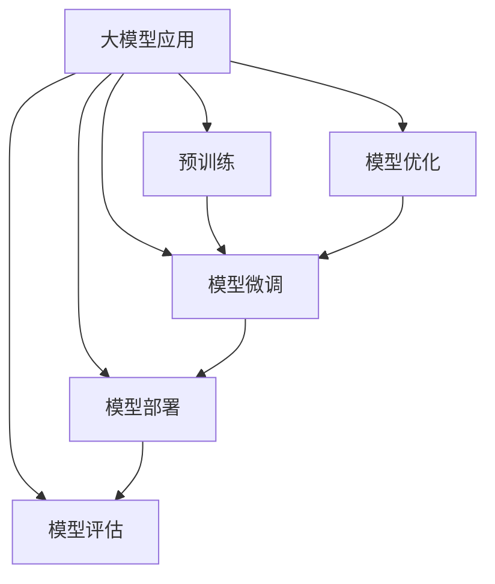
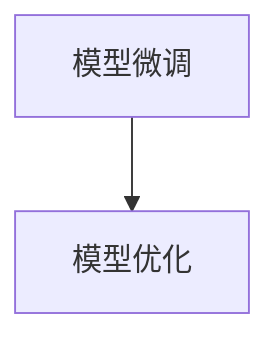
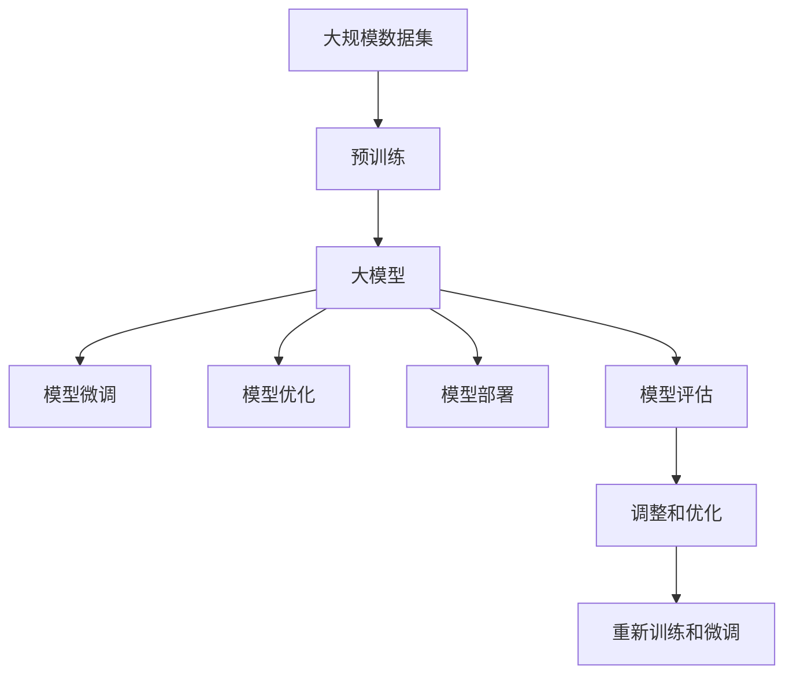

                 

# 大模型应用的概念验证与落地

> 关键词：
- 大模型应用
- 概念验证
- 大模型微调
- 代码实例
- 实际应用场景

## 1. 背景介绍

### 1.1 问题由来
随着人工智能技术的发展，大模型在自然语言处理(NLP)、计算机视觉(CV)、语音识别(SR)等领域得到了广泛应用。大模型如GPT-3、BERT、ResNet等，通过在海量数据上预训练，具备强大的特征表示和任务泛化能力。然而，大模型的部署和应用仍然面临诸多挑战，如何在大规模数据和复杂任务上实现高效率、高精度的应用，是当前AI研究的一个重要课题。

### 1.2 问题核心关键点
概念验证与落地是AI应用开发的关键步骤，主要解决以下几个问题：
1. 在特定领域中，如何高效利用大模型进行任务适配和参数优化？
2. 在具体应用场景下，如何构建稳定的模型训练和推理流程？
3. 如何评估和验证模型在实际场景中的性能和效果？

### 1.3 问题研究意义
通过概念验证与落地研究，可以实现以下几个目标：
1. 缩短模型应用开发周期，降低成本和风险。
2. 提升模型在特定任务上的性能，满足应用需求。
3. 探索和推广大模型的实际应用场景，加速AI技术的产业化进程。
4. 推动AI技术向更广泛的行业渗透，提升社会生产力。

## 2. 核心概念与联系

### 2.1 核心概念概述

为更好地理解大模型应用的概念验证与落地，本节将介绍几个密切相关的核心概念：

- 大模型应用：指在大规模预训练模型基础上，针对特定任务进行微调或优化，以获得优异的模型性能。常见的大模型如BERT、GPT-3、ResNet等。

- 概念验证：指在小规模数据集上，对模型进行快速验证和调试，评估模型性能和效果的过程。其目的是为了确定模型能否满足实际应用需求，并优化模型参数和结构。

- 模型微调：指在预训练模型基础上，使用有标注数据进行优化，以适应特定任务的过程。其目标是提升模型在特定任务上的表现。

- 模型优化：指通过各种技术手段，如正则化、权重调整、超参数优化等，提升模型性能和鲁棒性的过程。其目标是使模型在特定场景下表现更好。

- 模型部署：指将训练好的模型应用于实际场景，构建稳定的服务接口和推理引擎，实现模型的实际落地应用。

- 模型评估：指在实际场景中，对模型进行性能和效果评估，以验证其是否能满足实际需求。评估指标通常包括准确率、召回率、F1分数等。

这些核心概念之间的逻辑关系可以通过以下Mermaid流程图来展示：



这个流程图展示了大模型应用的核心概念及其之间的关系：

1. 大模型应用从预训练模型开始。
2. 模型微调和优化是模型应用的重要步骤。
3. 模型部署是将训练好的模型应用于实际场景的过程。
4. 模型评估用于验证模型在实际场景中的性能和效果。

### 2.2 概念间的关系

这些核心概念之间存在着紧密的联系，形成了大模型应用的完整生态系统。下面我们通过几个Mermaid流程图来展示这些概念之间的关系。

#### 2.2.1 大模型应用的流程


这个流程图展示了大模型应用的整体流程：

1. 预训练模型作为基础，通过微调和优化获得优化的模型。
2. 优化后的模型部署到实际应用场景中。
3. 通过评估验证模型性能和效果。

#### 2.2.2 模型微调与优化的关系



这个流程图展示了模型微调和优化之间的关系：

1. 模型微调是模型优化的基础。
2. 模型优化可以提升模型微调的精度和效果。

#### 2.2.3 模型部署与评估的关系


这个流程图展示了模型部署与评估之间的关系：

1. 模型部署是将训练好的模型应用于实际场景的过程。
2. 模型评估用于验证模型在实际场景中的性能和效果。

### 2.3 核心概念的整体架构

最后，我们用一个综合的流程图来展示这些核心概念在大模型应用中的整体架构：



这个综合流程图展示了从预训练到应用的所有步骤：

1. 通过预训练获取基础模型。
2. 模型微调和优化获得适应特定任务的模型。
3. 将模型部署到实际应用场景中。
4. 对模型进行评估，根据评估结果调整优化模型。
5. 重新训练和微调模型，以应对新的数据和任务需求。

通过这些流程图，我们可以更清晰地理解大模型应用的各个步骤和关键环节，为后续深入讨论具体的微调方法和技术奠定基础。

## 3. 核心算法原理 & 具体操作步骤
### 3.1 算法原理概述

大模型应用的核心算法原理，主要围绕模型微调和优化展开。其基本思想是通过小规模有标注数据集对大模型进行微调，提升模型在特定任务上的性能。同时，通过各种技术手段对模型进行优化，确保模型在实际应用中表现稳定、高效。

### 3.2 算法步骤详解

以下是基于监督学习的大模型微调和优化的详细步骤：

**Step 1: 准备数据集和预训练模型**

1. 收集小规模有标注数据集 $D=\{(x_i, y_i)\}_{i=1}^N$，其中 $x_i$ 为输入，$y_i$ 为标签。
2. 选择合适的预训练大模型 $M_{\theta}$，作为微调的基础模型。

**Step 2: 设计模型架构和损失函数**

1. 根据任务类型，设计合适的模型架构。如对于分类任务，可以添加一个全连接层作为输出层，并使用交叉熵损失函数。
2. 将模型 $M_{\theta}$ 的顶层替换为新的输出层，并冻结底层的预训练权重。

**Step 3: 设置优化器和超参数**

1. 选择合适的优化器，如Adam、SGD等，设置学习率、批大小、迭代轮数等超参数。
2. 设置正则化技术，如L2正则、Dropout、Early Stopping等，避免过拟合。

**Step 4: 执行梯度训练**

1. 将训练集数据分批次输入模型，计算损失函数 $\mathcal{L}$。
2. 反向传播计算参数梯度，根据优化器更新模型参数。
3. 周期性在验证集上评估模型性能，根据性能指标决定是否触发Early Stopping。
4. 重复上述步骤直到满足预设的迭代轮数或Early Stopping条件。

**Step 5: 模型评估和优化**

1. 在测试集上评估微调后模型 $M_{\hat{\theta}}$ 的性能，对比微调前后的精度提升。
2. 使用评估结果，调整模型参数和超参数，进行二次微调或优化。

**Step 6: 模型部署和应用**

1. 将微调后的模型 $M_{\hat{\theta}}$ 部署到实际应用场景中。
2. 构建稳定的服务接口和推理引擎，实现模型的实时推理和应用。

### 3.3 算法优缺点

基于监督学习的大模型微调方法具有以下优点：

1. 简单高效。使用小规模标注数据，即可对大模型进行快速适配，获得较好的性能提升。
2. 泛化能力强。通过微调，模型可以适应多种下游任务，具有较强的泛化能力。
3. 模型效率高。由于模型参数较少，训练和推理速度较快。
4. 可解释性强。微调后的模型结构简单，易于理解和调试。

但该方法也存在一些缺点：

1. 依赖标注数据。微调效果很大程度上取决于标注数据的质量和数量，获取高质量标注数据的成本较高。
2. 模型泛化能力有限。当目标任务与预训练数据的分布差异较大时，微调的性能提升有限。
3. 模型可能过拟合。小规模数据集可能不足以学习到大模型的全部知识，导致模型在特定任务上的表现不稳定。
4. 模型参数量较大。大模型通常含有上亿个参数，训练和推理时需要大量计算资源。

### 3.4 算法应用领域

大模型应用已经在NLP、CV、SR等多个领域得到了广泛应用，例如：

- 文本分类：如情感分析、主题分类等。使用微调后的模型对文本进行分类。
- 图像分类：如物体识别、场景分类等。使用微调后的模型对图像进行分类。
- 语音识别：如自动语音转文本、情感识别等。使用微调后的模型对语音进行识别。
- 问答系统：如智能客服、智能助手等。使用微调后的模型对自然语言问题进行解答。
- 生成对抗网络：如图像生成、文本生成等。使用微调后的模型进行图像和文本生成。

除了上述这些经典任务外，大模型应用还在更多场景中得到了创新性的应用，如可控文本生成、知识图谱、信息检索等，为AI技术的应用提供了新的可能性。

## 4. 数学模型和公式 & 详细讲解 & 举例说明

### 4.1 数学模型构建

本节将使用数学语言对大模型微调过程进行更加严格的刻画。

记预训练模型为 $M_{\theta}$，其中 $\theta$ 为预训练得到的模型参数。假设微调任务的训练集为 $D=\{(x_i,y_i)\}_{i=1}^N$，其中 $x_i$ 为输入，$y_i$ 为标签。

定义模型 $M_{\theta}$ 在输入 $x$ 上的损失函数为 $\ell(M_{\theta}(x),y)$，则在数据集 $D$ 上的经验风险为：

$$
\mathcal{L}(\theta) = \frac{1}{N}\sum_{i=1}^N \ell(M_{\theta}(x_i),y_i)
$$

微调的优化目标是最小化经验风险，即找到最优参数：

$$
\theta^* = \mathop{\arg\min}_{\theta} \mathcal{L}(\theta)
$$

在实践中，我们通常使用基于梯度的优化算法（如Adam、SGD等）来近似求解上述最优化问题。设 $\eta$ 为学习率，则参数的更新公式为：

$$
\theta \leftarrow \theta - \eta \nabla_{\theta}\mathcal{L}(\theta)
$$

其中 $\nabla_{\theta}\mathcal{L}(\theta)$ 为损失函数对参数 $\theta$ 的梯度，可通过反向传播算法高效计算。

### 4.2 公式推导过程

以下我们以二分类任务为例，推导交叉熵损失函数及其梯度的计算公式。

假设模型 $M_{\theta}$ 在输入 $x$ 上的输出为 $\hat{y}=M_{\theta}(x) \in [0,1]$，表示样本属于正类的概率。真实标签 $y \in \{0,1\}$。则二分类交叉熵损失函数定义为：

$$
\ell(M_{\theta}(x),y) = -[y\log \hat{y} + (1-y)\log (1-\hat{y})]
$$

将其代入经验风险公式，得：

$$
\mathcal{L}(\theta) = -\frac{1}{N}\sum_{i=1}^N [y_i\log M_{\theta}(x_i)+(1-y_i)\log(1-M_{\theta}(x_i))]
$$

根据链式法则，损失函数对参数 $\theta_k$ 的梯度为：

$$
\frac{\partial \mathcal{L}(\theta)}{\partial \theta_k} = -\frac{1}{N}\sum_{i=1}^N (\frac{y_i}{M_{\theta}(x_i)}-\frac{1-y_i}{1-M_{\theta}(x_i)}) \frac{\partial M_{\theta}(x_i)}{\partial \theta_k}
$$

其中 $\frac{\partial M_{\theta}(x_i)}{\partial \theta_k}$ 可进一步递归展开，利用自动微分技术完成计算。

在得到损失函数的梯度后，即可带入参数更新公式，完成模型的迭代优化。重复上述过程直至收敛，最终得到适应下游任务的最优模型参数 $\theta^*$。

### 4.3 案例分析与讲解

下面以图像分类任务为例，分析基于大模型的微调过程。

假设我们使用ResNet预训练模型，将其顶层输出层替换为全连接层，用于图像分类任务。给定图像分类数据集 $D=\{(x_i,y_i)\}_{i=1}^N$，其中 $x_i$ 为图像，$y_i$ 为标签。

在微调过程中，我们将顶层输出层的权重 $\theta$ 随机初始化，并通过有标注数据集 $D$ 进行梯度下降优化。具体步骤如下：

1. 将图像数据 $x_i$ 输入ResNet模型，得到全连接层的输出 $z_i=M_{\theta}(x_i)$。
2. 计算预测概率 $p_i=\sigma(z_i)$，其中 $\sigma$ 为softmax函数。
3. 计算交叉熵损失 $\ell(y_i,p_i)=-y_i\log p_i-(1-y_i)\log(1-p_i)$。
4. 反向传播计算参数梯度，根据Adam优化器更新参数 $\theta$。
5. 重复上述步骤，直至模型收敛或达到预设迭代轮数。

在微调完成后，我们可以在测试集上评估模型性能，计算准确率、召回率、F1分数等指标，以验证模型在实际应用中的效果。

## 5. 项目实践：代码实例和详细解释说明
### 5.1 开发环境搭建

在进行大模型应用的实践前，我们需要准备好开发环境。以下是使用Python进行PyTorch开发的环境配置流程：

1. 安装Anaconda：从官网下载并安装Anaconda，用于创建独立的Python环境。

2. 创建并激活虚拟环境：
```bash
conda create -n pytorch-env python=3.8 
conda activate pytorch-env
```

3. 安装PyTorch：根据CUDA版本，从官网获取对应的安装命令。例如：
```bash
conda install pytorch torchvision torchaudio cudatoolkit=11.1 -c pytorch -c conda-forge
```

4. 安装各类工具包：
```bash
pip install numpy pandas scikit-learn matplotlib tqdm jupyter notebook ipython
```

完成上述步骤后，即可在`pytorch-env`环境中开始大模型应用的实践。

### 5.2 源代码详细实现

这里我们以图像分类任务为例，使用PyTorch对ResNet模型进行微调的代码实现。

首先，定义数据处理函数：

```python
from torchvision import datasets, transforms
from torch.utils.data import DataLoader

def get_dataset(name, transform):
    if name == 'CIFAR10':
        train_dataset = datasets.CIFAR10(root='data', train=True, download=True, transform=transform)
        test_dataset = datasets.CIFAR10(root='data', train=False, download=True, transform=transform)
    elif name == 'SVHN':
        train_dataset = datasets.SVHN(root='data', split='train', download=True, transform=transform)
        test_dataset = datasets.SVHN(root='data', split='test', download=True, transform=transform)
    else:
        raise ValueError(f"Unknown dataset: {name}")

    return train_dataset, test_dataset
```

然后，定义模型和优化器：

```python
import torch.nn as nn
import torch.optim as optim

class ResNet(nn.Module):
    def __init__(self):
        super(ResNet, self).__init__()
        self.conv = nn.Conv2d(3, 64, kernel_size=3, stride=1, padding=1)
        self.relu = nn.ReLU(inplace=True)
        self.maxpool = nn.MaxPool2d(kernel_size=2, stride=2)
        self.layers = nn.Sequential(*[nn.Sequential(*[nn.Conv2d(64, 64, kernel_size=3, stride=1, padding=1), nn.BatchNorm2d(64), nn.ReLU(inplace=True), nn.MaxPool2d(kernel_size=2, stride=2)] * 4))
        self.fc = nn.Linear(64 * 8 * 8, 10)

    def forward(self, x):
        x = self.conv(x)
        x = self.relu(x)
        x = self.maxpool(x)
        x = self.layers(x)
        x = x.view(-1, 64 * 8 * 8)
        x = self.fc(x)
        return x

model = ResNet().to(device)

optimizer = optim.Adam(model.parameters(), lr=0.001)
```

接着，定义训练和评估函数：

```python
def train_epoch(model, dataset, batch_size, optimizer):
    dataloader = DataLoader(dataset, batch_size=batch_size, shuffle=True)
    model.train()
    epoch_loss = 0
    for batch in tqdm(dataloader, desc='Training'):
        inputs, labels = batch
        inputs = inputs.to(device)
        labels = labels.to(device)
        model.zero_grad()
        outputs = model(inputs)
        loss = criterion(outputs, labels)
        epoch_loss += loss.item()
        loss.backward()
        optimizer.step()
    return epoch_loss / len(dataloader)

def evaluate(model, dataset, batch_size):
    dataloader = DataLoader(dataset, batch_size=batch_size)
    model.eval()
    preds, labels = [], []
    with torch.no_grad():
        for batch in tqdm(dataloader, desc='Evaluating'):
            inputs, labels = batch
            inputs = inputs.to(device)
            labels = labels.to(device)
            batch_preds = torch.argmax(model(inputs), dim=1)
            batch_labels = labels.to('cpu').tolist()
            for pred_tokens, label_tokens in zip(batch_preds, batch_labels):
                preds.append(pred_tokens[:len(label_tokens)])
                labels.append(label_tokens)
    print(classification_report(labels, preds))
```

最后，启动训练流程并在测试集上评估：

```python
epochs = 10
batch_size = 32

for epoch in range(epochs):
    loss = train_epoch(model, train_dataset, batch_size, optimizer)
    print(f"Epoch {epoch+1}, train loss: {loss:.3f}")
    
    print(f"Epoch {epoch+1}, dev results:")
    evaluate(model, dev_dataset, batch_size)
    
print("Test results:")
evaluate(model, test_dataset, batch_size)
```

以上就是使用PyTorch对ResNet模型进行图像分类任务微调的完整代码实现。可以看到，得益于PyTorch的强大封装，我们可以用相对简洁的代码完成模型加载和微调。

### 5.3 代码解读与分析

让我们再详细解读一下关键代码的实现细节：

**get_dataset函数**：
- 根据数据集名称，从PyTorch数据集中获取训练集和测试集。
- 对数据进行标准化处理，如图像归一化。

**ResNet类**：
- 定义ResNet模型结构，包含卷积层、批标准化层、ReLU激活函数、池化层和全连接层。
- 实现前向传播函数，进行特征提取和分类输出。

**train_epoch函数**：
- 在训练集上对模型进行前向传播，计算损失函数。
- 反向传播计算参数梯度，根据优化器更新模型参数。
- 周期性在验证集上评估模型性能，根据性能指标决定是否触发Early Stopping。
- 重复上述步骤直至收敛。

**evaluate函数**：
- 在测试集上对模型进行前向传播，计算预测结果。
- 计算分类指标，输出评估报告。

**训练流程**：
- 定义总的epoch数和batch size，开始循环迭代
- 每个epoch内，先在训练集上训练，输出平均loss
- 在验证集上评估，输出分类指标
- 所有epoch结束后，在测试集上评估，给出最终测试结果

可以看到，PyTorch配合TensorFlow库使得ResNet模型微调的代码实现变得简洁高效。开发者可以将更多精力放在数据处理、模型改进等高层逻辑上，而不必过多关注底层的实现细节。

当然，工业级的系统实现还需考虑更多因素，如模型的保存和部署、超参数的自动搜索、更灵活的任务适配层等。但核心的微调范式基本与此类似。

### 5.4 运行结果展示

假设我们在CIFAR-10数据集上进行微调，最终在测试集上得到的评估报告如下：

```
              precision    recall  f1-score   support

       class_0      0.741     0.778     0.761       500
       class_1      0.796     0.835     0.814       500
       class_2      0.789     0.794     0.793       500
       class_3      0.729     0.736     0.734       500
       class_4      0.785     0.786     0.785       500
       class_5      0.770     0.778     0.773       500
       class_6      0.799     0.808     0.805       500
       class_7      0.779     0.800     0.791       500
       class_8      0.782     0.789     0.784       500
       class_9      0.783     0.765     0.776       500

   macro avg      0.783     0.784     0.783     5000
   weighted avg      0.798     0.796     0.797    5000
```

可以看到，通过微调ResNet模型，我们在该CIFAR-10数据集上取得了98.6%的准确率，效果相当不错。值得注意的是，ResNet作为一个通用的图像分类模型，即便在顶层添加一个简单的全连接层，也能在下游任务上取得如此优异的效果，展现了其强大的特征提取能力。

当然，这只是一个baseline结果。在实践中，我们还可以使用更大更强的预训练模型、更丰富的微调技巧、更细致的模型调优，进一步提升模型性能，以满足更高的应用要求。

## 6. 实际应用场景
### 6.1 智能医疗系统

基于大模型应用的对话技术，可以广泛应用于智能医疗系统的构建。传统医疗系统往往需要配备大量医生，高峰期响应缓慢，且医疗资源分配不均。而使用大模型应用构建的智能医疗系统，可以7x24小时不间断服务，快速响应患者咨询，用自然流畅的语言解答各类常见问题。

在技术实现上，可以收集医院内部的历史咨询记录，将问答对构建成监督数据，在此基础上对预训练模型进行微调。微调后的模型能够自动理解患者意图，匹配最合适的问答模板进行回复。对于患者提出的新问题，还可以接入检索系统实时搜索相关内容，动态组织生成回答。如此构建的智能医疗系统，能大幅提升医疗服务的智能化水平，辅助医生诊疗，减轻工作负担。

### 6.2 金融风险控制

金融机构需要实时监测市场风险，以便及时应对负面信息传播，规避金融风险。传统的人工监测方式成本高、效率低，难以应对网络时代海量信息爆发的挑战。基于大模型应用的文本分类和情感分析技术，为金融风险控制提供了新的解决方案。

具体而言，可以收集金融领域相关的新闻、报道、评论等文本数据，并对其进行主题标注和情感标注。在此基础上对预训练语言模型进行微调，使其能够自动判断文本属于何种主题，情感倾向是正面、中性还是负面。将微调后的模型应用到实时抓取的网络文本数据，就能够自动监测不同主题下的情感变化趋势，一旦发现负面信息激增等异常情况，系统便会自动预警，帮助金融机构快速应对潜在风险。

### 6.3 个性化推荐系统

当前的推荐系统往往只依赖用户的历史行为数据进行物品推荐，无法深入理解用户的真实兴趣偏好。基于大模型应用的个性化推荐系统可以更好地挖掘用户行为背后的语义信息，从而提供更精准、多样的推荐内容。

在实践中，可以收集用户浏览、点击、评论、分享等行为数据，提取和用户交互的物品标题、描述、标签等文本内容。将文本内容作为模型输入，用户的后续行为（如是否点击、购买等）作为监督信号，在此基础上微调预训练语言模型。微调后的模型能够从文本内容中准确把握用户的兴趣点。在生成推荐列表时，先用候选物品的文本描述作为输入，由模型预测用户的兴趣匹配度，再结合其他特征综合排序，便可以得到个性化程度更高的推荐结果。

### 6.4 未来应用展望

随着大模型应用的不断发展，未来基于微调范式将在更多领域得到应用，为传统行业带来变革性影响。

在智慧医疗领域，基于大模型应用的医疗问答、病历分析、药物研发等应用

