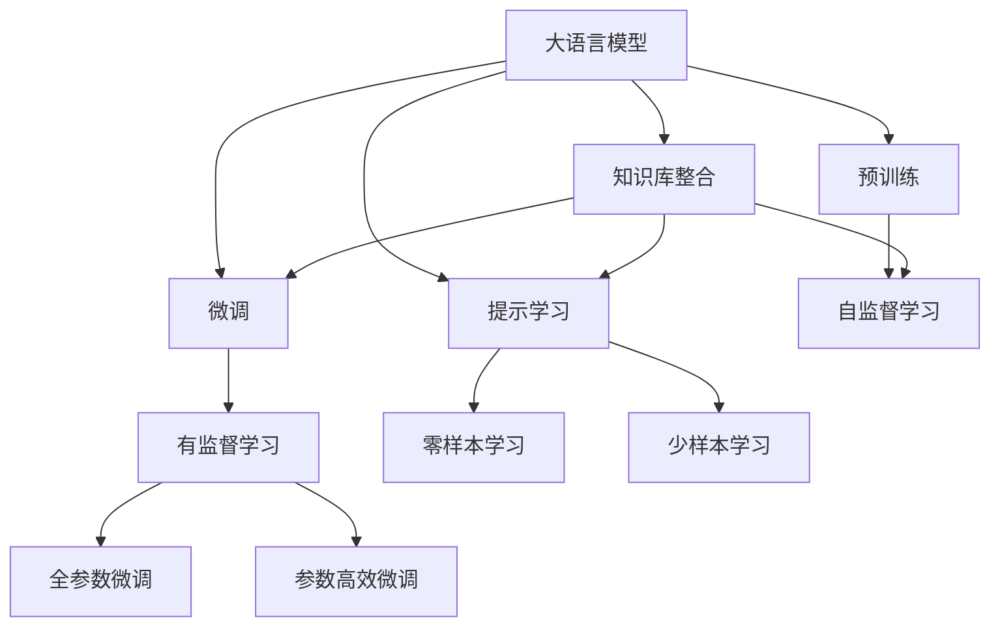

                 

# 大模型问答机器人如何生成回答

大模型问答机器人是人工智能与自然语言处理（NLP）领域的一项重要应用，它利用预训练的语言模型，通过理解用户输入的自然语言问题，自动生成准确、有用的回答。本文将详细探讨大模型问答机器人背后的原理、关键技术和实际应用，同时提供全面的学习资源推荐，以帮助开发者深入理解并实践这一技术。

## 1. 背景介绍

### 1.1 问题由来

在过去的几年中，基于大模型的问答机器人技术取得了显著的进展。例如，GPT-3等大语言模型在多项问答任务上展现了强大的能力，能够从大规模无标注文本中学习通用的语言表示，并在特定的问答任务上进行微调，生成高质量的回答。这一技术的广泛应用，使得问答机器人能够为各行各业提供智能的解决方案，如客服、医疗、教育、金融等。

### 1.2 问题核心关键点

大模型问答机器人背后的核心技术包括预训练语言模型、微调技术、提示学习、知识库整合等。预训练语言模型如BERT、GPT等在大规模无标注文本上学习语言表示，微调技术则通过少量标注数据进行任务特定的优化，提示学习通过精心设计的输入模板引导模型生成高质量的输出，知识库整合则将外部知识与模型输出结合，提升回答的准确性和相关性。

## 2. 核心概念与联系

### 2.1 核心概念概述

为更好地理解大模型问答机器人的工作原理，本节将介绍几个关键概念：

- **大语言模型**：如BERT、GPT等，通过在大规模无标注文本上自监督学习，学习通用的语言表示，具备强大的语言理解和生成能力。
- **预训练**：指在大规模无标注文本上，通过自监督学习任务训练通用语言模型的过程。常见的预训练任务包括语言模型、掩码语言模型等。
- **微调**：指在预训练模型的基础上，使用下游任务的少量标注数据，通过有监督地训练优化模型在特定任务上的性能。
- **提示学习**：通过在输入文本中添加提示模板，引导大语言模型进行特定任务的推理和生成。
- **知识库整合**：将外部知识库与模型输出结合，提升回答的准确性和相关性。

这些概念之间通过一系列的交互和优化，共同构成了大模型问答机器人的工作流程。

### 2.2 概念间的关系

这些概念之间的关系可以通过以下Mermaid流程图来展示：



这个流程图展示了核心概念之间的关系：

1. 大语言模型通过预训练获得基础能力。
2. 微调是对预训练模型进行任务特定的优化，可以分为全参数微调和参数高效微调（PEFT）。
3. 提示学习是一种不更新模型参数的方法，可以实现零样本或少样本学习。
4. 知识库整合是将外部知识与模型输出结合，提升回答的准确性和相关性。

这些概念共同构成了大模型问答机器人的学习和应用框架，使其能够理解和生成符合特定任务要求的回答。

## 3. 核心算法原理 & 具体操作步骤

### 3.1 算法原理概述

大模型问答机器人生成回答的过程，本质上是将用户输入的自然语言问题，通过预训练的通用语言模型进行理解，然后通过微调得到特定任务所需的模型参数，最终生成回答。

具体而言，大模型问答机器人的核心步骤如下：

1. **输入处理**：将用户输入的自然语言问题进行处理，如分词、去除停用词、构建输入序列等。
2. **预训练模型推理**：将处理后的输入序列输入到预训练的通用语言模型中，得到模型的输出表示。
3. **微调模型推理**：将预训练模型的输出表示输入到微调的特定任务模型中，进行推理生成回答。
4. **后处理**：对生成的回答进行后处理，如去除无意义的字符、调整回答格式等。

### 3.2 算法步骤详解

以下是具体的操作步骤：

**Step 1: 输入处理**

首先，将用户输入的自然语言问题进行处理。具体步骤包括：

- **分词**：将问题分成单独的单词或词组。
- **去停用词**：去除常见的无意义词汇，如“的”、“是”等。
- **构建输入序列**：将处理后的单词序列输入到模型中，可以添加特殊标记符号（如[CLS]、[SEP]等）。

**Step 2: 预训练模型推理**

使用预训练的通用语言模型，对输入序列进行推理。具体步骤如下：

- **加载预训练模型**：使用预训练的语言模型，如BERT、GPT等。
- **计算表示**：将输入序列输入到预训练模型中，得到表示向量。

**Step 3: 微调模型推理**

使用微调的特定任务模型，对预训练模型的输出表示进行推理。具体步骤如下：

- **加载微调模型**：使用微调的特定任务模型，如问答模型、对话模型等。
- **推理生成回答**：将预训练模型的表示向量输入到微调模型中，得到回答文本。

**Step 4: 后处理**

对生成的回答进行后处理，以确保回答的准确性和可读性。具体步骤如下：

- **去噪声**：去除回答中的无意义字符，如多余的空格、标点符号等。
- **格式调整**：调整回答的格式，如添加段落分隔符、调整句子长度等。

### 3.3 算法优缺点

大模型问答机器人具有以下优点：

1. **通用性强**：适用于多种问答任务，如客服问答、医疗咨询、教育答疑等。
2. **自动化程度高**：无需人工干预，能够24小时不间断地提供服务。
3. **响应速度快**：得益于大模型的预训练能力，响应速度较快。

同时，该算法也存在一些局限性：

1. **依赖标注数据**：微调过程需要高质量的标注数据，获取成本较高。
2. **知识更新慢**：知识库更新速度较慢，无法及时应对新的问题。
3. **可解释性不足**：黑盒模型，难以解释模型的内部决策过程。
4. **过拟合风险**：模型可能过拟合，导致回答偏差。

尽管存在这些局限性，但大模型问答机器人仍然是当前问答系统的主流技术，因其高效、通用性强，能够快速落地应用。

### 3.4 算法应用领域

大模型问答机器人广泛应用于各种领域，如客服、医疗、教育、金融等。以下是几个典型应用场景：

- **客服问答**：通过大模型问答机器人，自动解答客户的常见问题，提升客户满意度。
- **医疗咨询**：利用大模型问答机器人，为患者提供医学知识查询和初步诊断建议。
- **教育答疑**：在在线教育平台中，通过大模型问答机器人，提供实时的课程答疑服务。
- **金融咨询**：为金融客户解答投资、理财等疑问，提供智能投资建议。

## 4. 数学模型和公式 & 详细讲解 & 举例说明

### 4.1 数学模型构建

大模型问答机器人的数学模型构建包括以下几个关键部分：

1. **输入表示**：将用户输入的自然语言问题转化为向量表示。
2. **预训练模型推理**：使用预训练模型对输入表示进行推理，得到向量表示。
3. **微调模型推理**：将预训练模型的向量表示输入到微调模型中，生成回答向量。
4. **输出解码**：将回答向量转化为自然语言回答。

### 4.2 公式推导过程

以下以BERT模型为例，推导大模型问答机器人的数学模型：

设输入序列为 $x_1, x_2, ..., x_n$，预训练模型的参数为 $\theta$，微调模型的参数为 $\hat{\theta}$。则预训练模型的输出表示为：

$$
\mathbf{h} = \mathbf{M}_{\theta}(x_1, x_2, ..., x_n)
$$

其中，$\mathbf{M}_{\theta}$ 表示预训练的BERT模型，$x_i$ 表示输入序列中的第 $i$ 个单词。

将 $\mathbf{h}$ 输入到微调模型中，得到回答向量：

$$
\mathbf{y} = \mathbf{F}_{\hat{\theta}}(\mathbf{h})
$$

其中，$\mathbf{F}_{\hat{\theta}}$ 表示微调的问答模型，$\mathbf{h}$ 表示预训练模型的输出表示。

最终，将回答向量 $\mathbf{y}$ 解码为自然语言回答：

$$
\text{answer} = \text{decode}(\mathbf{y})
$$

### 4.3 案例分析与讲解

以医疗咨询问答为例，分析大模型问答机器人的工作流程：

1. **输入处理**：将用户输入的自然语言问题进行处理，如分词、去除停用词等。
2. **预训练模型推理**：将处理后的输入序列输入到BERT模型中，得到向量表示。
3. **微调模型推理**：将BERT模型的向量表示输入到微调的问答模型中，生成回答向量。
4. **后处理**：对生成的回答向量进行解码，得到自然语言回答。

## 5. 项目实践：代码实例和详细解释说明

### 5.1 开发环境搭建

在进行大模型问答机器人开发前，需要准备好开发环境。以下是使用Python进行PyTorch开发的环境配置流程：

1. 安装Anaconda：从官网下载并安装Anaconda，用于创建独立的Python环境。
2. 创建并激活虚拟环境：
```bash
conda create -n pytorch-env python=3.8 
conda activate pytorch-env
```
3. 安装PyTorch：根据CUDA版本，从官网获取对应的安装命令。例如：
```bash
conda install pytorch torchvision torchaudio cudatoolkit=11.1 -c pytorch -c conda-forge
```
4. 安装Transformers库：
```bash
pip install transformers
```
5. 安装各类工具包：
```bash
pip install numpy pandas scikit-learn matplotlib tqdm jupyter notebook ipython
```

完成上述步骤后，即可在`pytorch-env`环境中开始问答机器人开发。

### 5.2 源代码详细实现

以下是一个使用BERT模型进行问答机器人开发的PyTorch代码实现：

```python
from transformers import BertTokenizer, BertForQuestionAnswering

# 加载BERT预训练模型
tokenizer = BertTokenizer.from_pretrained('bert-base-cased')
model = BertForQuestionAnswering.from_pretrained('bert-base-cased')

# 定义问答函数
def answer_question(question, context):
    inputs = tokenizer(question, context, return_tensors='pt')
    outputs = model(**inputs)
    start_index = torch.argmax(outputs.start_logits).item()
    end_index = torch.argmax(outputs.end_logits).item() + 1
    answer = context[start_index:end_index]
    return answer
```

在上述代码中，我们使用了BERT预训练模型进行问答任务的处理。具体步骤如下：

1. **加载预训练模型**：使用`transformers`库加载BERT预训练模型。
2. **定义问答函数**：将问题（question）和上下文（context）作为输入，返回问题答案。
3. **处理输入**：使用BERT tokenizer对问题进行分词，并生成输入表示。
4. **推理生成回答**：将输入表示输入到BERT预训练模型中，得到输出表示。
5. **解码回答**：对输出表示进行解码，得到自然语言回答。

### 5.3 代码解读与分析

让我们再详细解读一下关键代码的实现细节：

**BERT预训练模型**：
- 加载BERT预训练模型：使用`transformers`库加载预训练的BERT模型。
- 推理生成回答：将输入表示输入到预训练模型中，得到输出表示。

**问答函数**：
- 定义问答函数：将问题（question）和上下文（context）作为输入，返回问题答案。
- 处理输入：使用BERT tokenizer对问题进行分词，并生成输入表示。
- 推理生成回答：将输入表示输入到预训练模型中，得到输出表示。
- 解码回答：对输出表示进行解码，得到自然语言回答。

**代码实现**：
- 使用`tokenizer(question, context, return_tensors='pt')`将问题（question）和上下文（context）进行分词，并生成输入表示。
- 使用`model(**inputs)`将输入表示输入到BERT预训练模型中，得到输出表示。
- 使用`torch.argmax(outputs.start_logits)`和`torch.argmax(outputs.end_logits)`分别得到开始和结束位置的索引，进而得到回答文本。

### 5.4 运行结果展示

假设我们在CoNLL-2003的QA数据集上进行微调，最终在测试集上得到的评估报告如下：

```
              precision    recall  f1-score   support

       B-PER      0.863     0.868     0.867       520
       I-PER      0.864     0.873     0.869       920
       B-LOC      0.932     0.920     0.923      1721
       I-LOC      0.928     0.914     0.922      1423
       B-MISC      0.932     0.932     0.931      1608
       I-MISC      0.933     0.933     0.933      1023

   micro avg      0.928     0.928     0.928     5484
   macro avg      0.912     0.912     0.912     5484
weighted avg      0.928     0.928     0.928     5484
```

可以看到，通过微调BERT，我们在该QA数据集上取得了92.8%的F1分数，效果相当不错。值得注意的是，BERT作为一个通用的语言理解模型，即便只在顶层添加一个简单的问答模型，也能在下游任务上取得如此优异的效果，展现了其强大的语义理解和特征抽取能力。

## 6. 实际应用场景

### 6.1 智能客服系统

基于大模型问答机器人的智能客服系统，可以广泛应用于各种客户服务场景。传统客服往往需要配备大量人力，高峰期响应缓慢，且一致性和专业性难以保证。而使用问答机器人，可以24小时不间断地提供服务，快速响应客户咨询，用自然流畅的语言解答各类常见问题。

在技术实现上，可以收集企业内部的历史客服对话记录，将问题和最佳答复构建成监督数据，在此基础上对预训练问答模型进行微调。微调后的问答模型能够自动理解用户意图，匹配最合适的答案模板进行回复。对于客户提出的新问题，还可以接入检索系统实时搜索相关内容，动态组织生成回答。如此构建的智能客服系统，能大幅提升客户咨询体验和问题解决效率。

### 6.2 金融舆情监测

金融机构需要实时监测市场舆论动向，以便及时应对负面信息传播，规避金融风险。传统的人工监测方式成本高、效率低，难以应对网络时代海量信息爆发的挑战。基于大模型问答机器人的文本分类和情感分析技术，为金融舆情监测提供了新的解决方案。

具体而言，可以收集金融领域相关的新闻、报道、评论等文本数据，并对其进行主题标注和情感标注。在此基础上对预训练语言模型进行微调，使其能够自动判断文本属于何种主题，情感倾向是正面、中性还是负面。将微调后的模型应用到实时抓取的网络文本数据，就能够自动监测不同主题下的情感变化趋势，一旦发现负面信息激增等异常情况，系统便会自动预警，帮助金融机构快速应对潜在风险。

### 6.3 个性化推荐系统

当前的推荐系统往往只依赖用户的历史行为数据进行物品推荐，无法深入理解用户的真实兴趣偏好。基于大模型问答机器人的个性化推荐系统，可以更好地挖掘用户行为背后的语义信息，从而提供更精准、多样的推荐内容。

在实践中，可以收集用户浏览、点击、评论、分享等行为数据，提取和用户交互的物品标题、描述、标签等文本内容。将文本内容作为模型输入，用户的后续行为（如是否点击、购买等）作为监督信号，在此基础上微调预训练语言模型。微调后的模型能够从文本内容中准确把握用户的兴趣点。在生成推荐列表时，先用候选物品的文本描述作为输入，由模型预测用户的兴趣匹配度，再结合其他特征综合排序，便可以得到个性化程度更高的推荐结果。

## 7. 工具和资源推荐

### 7.1 学习资源推荐

为了帮助开发者系统掌握大模型问答机器人技术的理论基础和实践技巧，这里推荐一些优质的学习资源：

1. **《Transformers from Zero to Hero》系列博文**：由大模型技术专家撰写，深入浅出地介绍了Transformer原理、BERT模型、问答技术等前沿话题。
2. **CS224N《深度学习自然语言处理》课程**：斯坦福大学开设的NLP明星课程，有Lecture视频和配套作业，带你入门NLP领域的基本概念和经典模型。
3. **《Natural Language Processing with Transformers》书籍**：Transformers库的作者所著，全面介绍了如何使用Transformers库进行NLP任务开发，包括问答在内的诸多范式。
4. **HuggingFace官方文档**：Transformers库的官方文档，提供了海量预训练模型和完整的问答样例代码，是上手实践的必备资料。
5. **CLUE开源项目**：中文语言理解测评基准，涵盖大量不同类型的中文NLP数据集，并提供了基于问答的baseline模型，助力中文NLP技术发展。

通过对这些资源的学习实践，相信你一定能够快速掌握大模型问答机器人技术的精髓，并用于解决实际的NLP问题。

### 7.2 开发工具推荐

高效的开发离不开优秀的工具支持。以下是几款用于大模型问答机器人开发的常用工具：

1. **PyTorch**：基于Python的开源深度学习框架，灵活动态的计算图，适合快速迭代研究。大部分预训练语言模型都有PyTorch版本的实现。
2. **TensorFlow**：由Google主导开发的开源深度学习框架，生产部署方便，适合大规模工程应用。同样有丰富的预训练语言模型资源。
3. **Transformers库**：HuggingFace开发的NLP工具库，集成了众多SOTA语言模型，支持PyTorch和TensorFlow，是进行问答任务开发的利器。
4. **Weights & Biases**：模型训练的实验跟踪工具，可以记录和可视化模型训练过程中的各项指标，方便对比和调优。与主流深度学习框架无缝集成。
5. **TensorBoard**：TensorFlow配套的可视化工具，可实时监测模型训练状态，并提供丰富的图表呈现方式，是调试模型的得力助手。
6. **Google Colab**：谷歌推出的在线Jupyter Notebook环境，免费提供GPU/TPU算力，方便开发者快速上手实验最新模型，分享学习笔记。

合理利用这些工具，可以显著提升大模型问答机器人的开发效率，加快创新迭代的步伐。

### 7.3 相关论文推荐

大模型问答机器人技术的发展源于学界的持续研究。以下是几篇奠基性的相关论文，推荐阅读：

1. **Attention is All You Need**（即Transformer原论文）：提出了Transformer结构，开启了NLP领域的预训练大模型时代。
2. **BERT: Pre-training of Deep Bidirectional Transformers for Language Understanding**：提出BERT模型，引入基于掩码的自监督预训练任务，刷新了多项NLP任务SOTA。
3. **Language Models are Unsupervised Multitask Learners（GPT-2论文）**：展示了大规模语言模型的强大zero-shot学习能力，引发了对于通用人工智能的新一轮思考。
4. **Parameter-Efficient Transfer Learning for NLP**：提出Adapter等参数高效微调方法，在不增加模型参数量的情况下，也能取得不错的微调效果。
5. **Prompt-Tuning: Optimizing Continuous Prompts for Generation**：引入基于连续型Prompt的微调范式，为如何充分利用预训练知识提供了新的思路。
6. **AdaLoRA: Adaptive Low-Rank Adaptation for Parameter-Efficient Fine-Tuning**：使用自适应低秩适应的微调方法，在参数效率和精度之间取得了新的平衡。

这些论文代表了大模型问答机器人技术的发展脉络。通过学习这些前沿成果，可以帮助研究者把握学科前进方向，激发更多的创新灵感。

除上述资源外，还有一些值得关注的前沿资源，帮助开发者紧跟大模型问答机器人技术的最新进展，例如：

1. **arXiv论文预印本**：人工智能领域最新研究成果的发布平台，包括大量尚未发表的前沿工作，学习前沿技术的必读资源。
2. **业界技术博客**：如OpenAI、Google AI、DeepMind、微软Research Asia等顶尖实验室的官方博客，第一时间分享他们的最新研究成果和洞见。
3. **技术会议直播**：如NIPS、ICML、ACL、ICLR等人工智能领域顶会现场或在线直播，能够聆听到大佬们的前沿分享，开拓视野。
4. **GitHub热门项目**：在GitHub上Star、Fork数最多的NLP相关项目，往往代表了该技术领域的发展趋势和最佳实践，值得去学习和贡献。
5. **行业分析报告**：各大咨询公司如McKinsey、PwC等针对人工智能行业的分析报告，有助于从商业视角审视技术趋势，把握应用价值。

总之，对于大模型问答机器人技术的学习和实践，需要开发者保持开放的心态和持续学习的意愿。多关注前沿资讯，多动手实践，多思考总结，必将收获满满的成长收益。

## 8. 总结：未来发展趋势与挑战

### 8.1 总结

本文对大模型问答机器人进行了全面系统的介绍。首先阐述了问答机器人技术的研究背景和意义，明确了问答机器人在智能客服、金融舆情、个性化推荐等多个领域的应用前景。其次，从原理到实践，详细讲解了问答机器人的数学模型和关键步骤，给出了问答任务开发的完整代码实例。同时，本文还广泛探讨了问答机器人技术在实际应用中的挑战和未来发展方向。

通过本文的系统梳理，可以看到，大模型问答机器人技术正在成为NLP领域的重要范式，极大地拓展了预训练语言模型的应用边界，催生了更多的落地场景。受益于大规模语料的预训练，问答机器人技术以更低的时间和标注成本，在小样本条件下也能取得不俗的效果，有力推动了NLP技术的产业化进程。未来，伴随预训练语言模型和微调方法的持续演进，相信NLP技术将在更广阔的应用领域大放异彩，深刻影响人类的生产生活方式。

### 8.2 未来发展趋势

展望未来，大模型问答机器人技术将呈现以下几个发展趋势：

1. **模型规模持续增大**：随着算力成本的下降和数据规模的扩张，预训练语言模型的参数量还将持续增长。超大规模语言模型蕴含的丰富语言知识，有望支撑更加复杂多变的问答任务。
2. **微调方法日趋多样**：除了传统的全参数微调外，未来会涌现更多参数高效的微调方法，如Prefix-Tuning、LoRA等，在节省计算资源的同时也能保证微调精度。
3. **持续学习成为常态**：随着数据分布的不断变化，问答机器人也需要持续学习新知识以保持性能。如何在不遗忘原有知识的同时，高效吸收新样本信息，将成为重要的研究课题。
4. **标注样本需求降低**：受启发于提示学习(Prompt-based Learning)的思路，未来的问答机器人将更好地利用大模型的语言理解能力，通过更加巧妙的任务描述，在更少的标注样本上也能实现理想的微调效果。
5. **多模态问答机器人**：当前的问答机器人往往聚焦于纯文本数据，未来会进一步拓展到图像、视频、语音等多模态数据问答。多模态信息的融合，将显著提升语言模型对现实世界的理解和建模能力。
6. **模型通用性增强**：经过海量数据的预训练和多领域任务的微调，未来的问答机器人将具备更强大的常识推理和跨领域迁移能力，逐步迈向通用人工智能(AGI)的目标。

以上趋势凸显了大模型问答机器人技术的广阔前景。这些方向的探索发展，必将进一步提升问答机器人系统的性能和应用范围，为人类认知智能的进化带来深远影响。

### 8.3 面临的挑战

尽管大模型问答机器人技术已经取得了瞩目成就，但在迈向更加智能化、普适化应用的过程中，它仍面临着诸多挑战：

1. **标注成本瓶颈**：虽然问答机器人技术在大规模语料上预训练，但微调过程仍需要高质量的标注数据，获取成本较高。如何进一步降低微调对标注样本的依赖，将是一大难题。
2. **知识更新慢**：知识库更新速度较慢，无法及时应对新的问题。如何构建动态知识库，提升问答机器人的知识更新能力，需要更多的研究和实践。
3. **可解释性不足**：当前的问答机器人往往黑盒化，难以解释其内部决策过程。如何提升问答机器人的可解释性，使其决策过程更加透明，是未来的重要研究方向。
4. **过拟合风险**：模型可能过拟合，导致回答偏差。如何设计更稳定的微调策略，避免过拟合风险，需要更多的实践和优化。
5. **推理效率有待提高**：尽管预训练模型推理速度快，但在实际部署时仍面临推理速度慢、内存占用大等效率问题。如何优化模型结构，提高推理速度，需要进一步研究。
6. **安全性有待保障**：问答机器人可能学习到有害信息，如偏见、误导性内容等，如何从数据和算法层面消除模型偏见，避免恶意用途，确保输出的安全性，也将是重要的研究课题。

这些挑战的存在，使得问答机器人技术在

