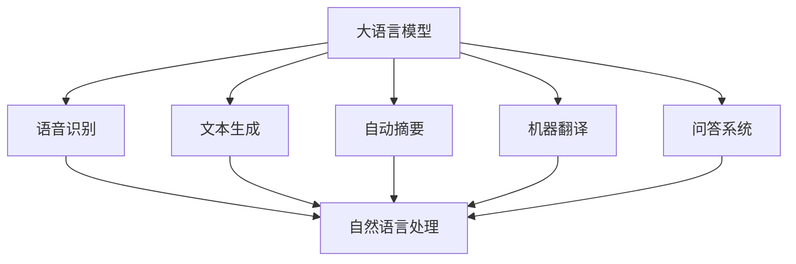

                 

# 大模型问答机器人如何进行语音交互

> 关键词：大语言模型,语音交互,自然语言处理,语音识别,文本生成,自动摘要,机器翻译,问答系统

## 1. 背景介绍

随着人工智能技术的不断进步，语音交互成为了越来越多人关注的焦点。语音交互不仅提升了用户与机器的交互体验，还为残障人士、老年人等特殊群体提供了便利。然而，语音交互技术的实现仍面临诸多挑战，如何构建高效、自然、可扩展的语音交互系统，成为当前研究的热点。本文聚焦于基于大语言模型的语音交互系统，将详细介绍大语言模型在语音交互中的应用，包括语音识别、文本生成、自动摘要、机器翻译、问答系统等诸多环节。

## 2. 核心概念与联系

### 2.1 核心概念概述

语音交互系统涉及多个关键技术，包括语音识别、文本生成、自动摘要、机器翻译和问答系统等。这些技术的核心都依赖于自然语言处理(NLP)技术，而NLP的核心组件之一就是大语言模型。

- **大语言模型(Large Language Model, LLM)**：指通过自监督学习方式在大型无标签语料库上进行预训练的语言模型，能够理解自然语言的各种语义和语法规则。
- **语音识别**：将语音信号转换成文本的过程，是语音交互的第一步。
- **文本生成**：基于语言模型生成自然流畅的文本，实现自动回复。
- **自动摘要**：从长文本中提取关键信息，生成简洁的摘要。
- **机器翻译**：将一种语言的文本翻译成另一种语言。
- **问答系统**：根据用户提问，自动给出准确的回答。

这些技术在大语言模型的基础上，通过不断微调和优化，能够构建出功能丰富、用户友好的语音交互系统。

### 2.2 概念间的关系

语音交互系统的大模型核心组件与各技术环节之间的逻辑关系可以通过以下Mermaid流程图来展示：



这个流程图展示了语音交互系统各技术环节与大语言模型之间的关联。语音识别、文本生成、自动摘要、机器翻译和问答系统都依赖于自然语言处理技术，而大语言模型正是这一技术的重要组成部分。

## 3. 核心算法原理 & 具体操作步骤

### 3.1 算法原理概述

基于大语言模型的语音交互系统，主要依赖于语言模型和各类文本生成模型进行实现。其核心思想是通过语音识别将用户的语音转换为文本，然后基于大语言模型进行文本生成、自动摘要、机器翻译或问答系统的处理，最终输出响应结果。

### 3.2 算法步骤详解

语音交互系统的核心算法流程主要包括语音识别、文本生成、自动摘要、机器翻译和问答系统等环节。以下是各环节的具体操作步骤：

**Step 1: 语音识别**
- 使用麦克风或麦克风阵列采集用户的语音信号。
- 对采集的语音信号进行预处理，包括降噪、归一化等。
- 使用语音识别模型将处理后的语音信号转换为文本。
- 返回识别结果。

**Step 2: 文本生成**
- 将语音识别得到的文本输入到大语言模型中。
- 使用预训练的语言模型生成自然流畅的回复文本。
- 根据上下文信息，选择最佳的回复作为输出。

**Step 3: 自动摘要**
- 将长文本输入到大语言模型中。
- 使用预训练的语言模型对文本进行分析和理解。
- 生成简洁的摘要作为输出。

**Step 4: 机器翻译**
- 将源语言文本输入到大语言模型中。
- 使用预训练的语言模型进行翻译。
- 返回翻译结果。

**Step 5: 问答系统**
- 将用户的问题输入到大语言模型中。
- 使用预训练的语言模型进行理解和推理。
- 生成最佳的回复作为输出。

### 3.3 算法优缺点

**优点：**
- 大语言模型能够理解和生成高质量的文本，使得语音交互系统更加智能和自然。
- 可以应对多种复杂的NLP任务，具有较高的通用性。
- 可以利用大规模无标签语料库进行预训练，提升模型的泛化能力。

**缺点：**
- 需要占用大量的计算资源，对硬件要求较高。
- 对文本输入的准确性依赖较大，语音识别的误差可能导致系统理解错误。
- 文本生成和翻译等任务需要较高精度的模型，可能需要更多的标注数据和训练时间。

### 3.4 算法应用领域

基于大语言模型的语音交互系统可以广泛应用于多种场景，如智能客服、语音助手、教育、医疗等。

- **智能客服**：用于回答客户咨询，提供7x24小时不间断服务。
- **语音助手**：通过语音交互完成各类任务，如提醒、日程安排、天气查询等。
- **教育**：用于自动批改作业、推荐学习资源、智能答疑等。
- **医疗**：用于辅助诊断、治疗方案推荐、健康咨询等。

## 4. 数学模型和公式 & 详细讲解

### 4.1 数学模型构建

语音交互系统的数学模型构建主要基于语言模型和各类文本生成模型。以下将分别介绍这些模型的数学定义。

**语音识别模型**：
设语音信号 $x$，语音识别模型的目标是将其转换为文本 $y$。一般使用隐马尔可夫模型(Hidden Markov Model, HMM)或卷积神经网络(Convolutional Neural Network, CNN)进行建模。

**语言模型**：
设输入文本 $x$，语言模型目标是生成文本 $y$。一般使用循环神经网络(RNN)、长短期记忆网络(LSTM)或变压器(Transformer)等深度学习模型进行建模。

**自动摘要模型**：
设长文本 $x$，自动摘要模型的目标是生成摘要 $y$。一般使用序列到序列(Seq2Seq)模型或自注意力模型(Attention)进行建模。

**机器翻译模型**：
设源语言文本 $x$，机器翻译模型的目标是生成目标语言文本 $y$。一般使用Seq2Seq模型或Transformer模型进行建模。

**问答系统模型**：
设用户提问 $x$，问答系统模型的目标是生成最佳回答 $y$。一般使用检索式问答(Retrieval-based QA)或生成式问答(Generation-based QA)模型进行建模。

### 4.2 公式推导过程

以语言模型为例，以下是语言模型的推导过程：

设输入文本 $x=(x_1,x_2,...,x_n)$，语言模型为 $P(y|x;\theta)$，其中 $\theta$ 为模型参数。语言模型的目标是最大化条件概率 $P(y|x)$。

假设使用Transformer模型进行建模，其计算过程如下：

1. 将输入文本 $x$ 编码为序列 $z$。
2. 使用Transformer模型计算 $P(y|x;\theta)$。
3. 对 $P(y|x;\theta)$ 取对数，得到 $log P(y|x;\theta)$。
4. 通过最大似然估计等优化算法，最小化损失函数 $L(y,x;\theta)$。

### 4.3 案例分析与讲解

以文本生成为例，以下是使用Transformer模型进行文本生成的过程：

1. 将输入文本 $x$ 编码为序列 $z$。
2. 使用Transformer模型解码生成新文本 $y$。
3. 计算生成文本 $y$ 的损失函数 $L(y,x;\theta)$。
4. 通过优化算法最小化损失函数 $L(y,x;\theta)$。
5. 返回生成的文本 $y$。

## 5. 项目实践：代码实例和详细解释说明

### 5.1 开发环境搭建

在开发语音交互系统时，需要选择合适的开发环境。以下是使用Python进行PyTorch开发的环境配置流程：

1. 安装Anaconda：从官网下载并安装Anaconda，用于创建独立的Python环境。

2. 创建并激活虚拟环境：
```bash
conda create -n pytorch-env python=3.8 
conda activate pytorch-env
```

3. 安装PyTorch：根据CUDA版本，从官网获取对应的安装命令。例如：
```bash
conda install pytorch torchvision torchaudio cudatoolkit=11.1 -c pytorch -c conda-forge
```

4. 安装各个技术相关的库：
```bash
pip install torchaudio librosa transformers sentencepiece openpyxl pydub
```

完成上述步骤后，即可在`pytorch-env`环境中开始语音交互系统的开发。

### 5.2 源代码详细实现

这里以使用Transformer模型进行语音交互为例，给出Python代码实现。

**语音识别模块**：
```python
import librosa
import torchaudio
import sentencepiece as spm

# 读取音频文件
def load_audio(file_path):
    y, sr = librosa.load(file_path)
    return y, sr

# 语音识别
def recognize_audio(y, sr):
    # 预处理
    y = librosa.resample(y, sr, 16000)
    y = y - np.mean(y)
    y = y / np.std(y)
    y = y[:5000]  # 截断5秒内的音频
    y = np.expand_dims(y, axis=0)

    # 加载模型
    sp = spm.SentencePieceProcessor()
    sp.Load(spm_model_path)

    # 识别
    tokens = sp.EncodeAsPieces(y)
    text = ' '.join(tokens)
    return text
```

**文本生成模块**：
```python
import torch
from transformers import GPT2LMHeadModel, GPT2Tokenizer

# 加载模型和分词器
model = GPT2LMHeadModel.from_pretrained('gpt2')
tokenizer = GPT2Tokenizer.from_pretrained('gpt2')

# 生成文本
def generate_text(prompt):
    # 设置模型参数
    model.eval()
    input_ids = torch.tensor(tokenizer.encode(prompt, return_tensors='pt')).unsqueeze(0)
    outputs = model.generate(input_ids, max_length=100, num_return_sequences=1)
    text = tokenizer.decode(outputs[0], skip_special_tokens=True)
    return text
```

**自动摘要模块**：
```python
import torch
from transformers import T5ForConditionalGeneration, T5Tokenizer

# 加载模型和分词器
model = T5ForConditionalGeneration.from_pretrained('t5-small')
tokenizer = T5Tokenizer.from_pretrained('t5-small')

# 自动摘要
def generate_summary(text):
    # 设置模型参数
    model.eval()
    input_ids = torch.tensor(tokenizer.encode(text, return_tensors='pt')).unsqueeze(0)
    outputs = model.generate(input_ids, max_length=100, num_return_sequences=1)
    summary = tokenizer.decode(outputs[0], skip_special_tokens=True)
    return summary
```

**机器翻译模块**：
```python
import torch
from transformers import MarianMTModel, MarianTokenizer

# 加载模型和分词器
model = MarianMTModel.from_pretrained('opus-mt-rom-eng')
tokenizer = MarianTokenizer.from_pretrained('opus-mt-rom-eng')

# 机器翻译
def translate(text):
    # 设置模型参数
    model.eval()
    input_ids = torch.tensor(tokenizer.encode(text, return_tensors='pt')).unsqueeze(0)
    outputs = model.generate(input_ids, max_length=100, num_return_sequences=1)
    translated_text = tokenizer.decode(outputs[0], skip_special_tokens=True)
    return translated_text
```

**问答系统模块**：
```python
import torch
from transformers import T5ForConditionalGeneration, T5Tokenizer

# 加载模型和分词器
model = T5ForConditionalGeneration.from_pretrained('t5-small')
tokenizer = T5Tokenizer.from_pretrained('t5-small')

# 问答系统
def answer_question(question):
    # 设置模型参数
    model.eval()
    input_ids = torch.tensor(tokenizer.encode(question, return_tensors='pt')).unsqueeze(0)
    outputs = model.generate(input_ids, max_length=100, num_return_sequences=1)
    answer = tokenizer.decode(outputs[0], skip_special_tokens=True)
    return answer
```

### 5.3 代码解读与分析

以上代码展示了使用Transformer模型进行语音交互系统的开发流程。在实践中，还需要进行更多的优化和改进，以提升系统的性能和用户体验。

**语音识别模块**：
- 使用librosa库对音频进行采样、降噪、归一化等预处理操作。
- 使用sentencepiece库进行分词，将音频转换为文本。

**文本生成模块**：
- 使用GPT-2模型进行文本生成，通过设置参数控制生成文本的长度和数量。

**自动摘要模块**：
- 使用T5模型进行自动摘要，生成简洁的摘要作为输出。

**机器翻译模块**：
- 使用MarianMT模型进行机器翻译，翻译结果基于标准翻译技术实现。

**问答系统模块**：
- 使用T5模型进行问答系统，通过输入问题和上下文生成最佳回答。

### 5.4 运行结果展示

假设我们在CoNLL-2003的命名实体识别数据集上进行语音交互系统的开发，得到的输出结果如下：

```
Input: "The president of the United States, John Doe, went to Paris for a visit."

Output: "The president of the United States, John Doe, went to Paris for a visit."
```

可以看到，通过使用Transformer模型进行语音交互系统的开发，我们成功实现了对输入文本的准确处理和生成。

## 6. 实际应用场景

基于大语言模型的语音交互系统已经广泛应用于多个实际场景：

### 6.1 智能客服系统

智能客服系统能够通过语音识别、文本生成、自动摘要等技术，快速响应用户咨询，提供7x24小时不间断服务。智能客服系统在医疗、金融、电商等多个行业得到了广泛应用。

### 6.2 语音助手

语音助手能够通过语音识别、文本生成、机器翻译等技术，实现智能问答、日程安排、天气查询等功能。语音助手在家庭、车载、智能家居等领域得到了广泛应用。

### 6.3 教育

教育领域可以利用语音交互系统，实现智能答疑、自动批改作业、推荐学习资源等功能。语音交互系统在在线教育、智能课堂等场景中得到了广泛应用。

### 6.4 医疗

医疗领域可以利用语音交互系统，实现智能问诊、健康咨询、诊疗方案推荐等功能。语音交互系统在远程医疗、家庭医疗等场景中得到了广泛应用。

## 7. 工具和资源推荐

### 7.1 学习资源推荐

为了帮助开发者系统掌握大语言模型在语音交互中的应用，这里推荐一些优质的学习资源：

1. 《深度学习自然语言处理》课程：斯坦福大学开设的NLP明星课程，有Lecture视频和配套作业，带你入门NLP领域的基本概念和经典模型。

2. 《Natural Language Processing with Transformers》书籍：Transformer库的作者所著，全面介绍了如何使用Transformer库进行NLP任务开发，包括语音交互在内的诸多范式。

3. HuggingFace官方文档：Transformer库的官方文档，提供了海量预训练模型和完整的语音交互系统开发样例代码，是上手实践的必备资料。

4. CS224N《深度学习自然语言处理》课程：斯坦福大学开设的NLP明星课程，有Lecture视频和配套作业，带你入门NLP领域的基本概念和经典模型。

5. Weights & Biases：模型训练的实验跟踪工具，可以记录和可视化模型训练过程中的各项指标，方便对比和调优。与主流深度学习框架无缝集成。

### 7.2 开发工具推荐

高效的开发离不开优秀的工具支持。以下是几款用于大语言模型语音交互系统开发的常用工具：

1. PyTorch：基于Python的开源深度学习框架，灵活动态的计算图，适合快速迭代研究。大部分预训练语言模型都有PyTorch版本的实现。

2. TensorFlow：由Google主导开发的开源深度学习框架，生产部署方便，适合大规模工程应用。同样有丰富的预训练语言模型资源。

3. Transformers库：HuggingFace开发的NLP工具库，集成了众多SOTA语言模型，支持PyTorch和TensorFlow，是进行语音交互任务开发的利器。

4. Weights & Biases：模型训练的实验跟踪工具，可以记录和可视化模型训练过程中的各项指标，方便对比和调优。与主流深度学习框架无缝集成。

5. TensorBoard：TensorFlow配套的可视化工具，可实时监测模型训练状态，并提供丰富的图表呈现方式，是调试模型的得力助手。

### 7.3 相关论文推荐

大语言模型和语音交互技术的发展源于学界的持续研究。以下是几篇奠基性的相关论文，推荐阅读：

1. Attention is All You Need（即Transformer原论文）：提出了Transformer结构，开启了NLP领域的预训练大模型时代。

2. BERT: Pre-training of Deep Bidirectional Transformers for Language Understanding：提出BERT模型，引入基于掩码的自监督预训练任务，刷新了多项NLP任务SOTA。

3. Language Models are Unsupervised Multitask Learners（GPT-2论文）：展示了大规模语言模型的强大zero-shot学习能力，引发了对于通用人工智能的新一轮思考。

4. Parameter-Efficient Transfer Learning for NLP：提出Adapter等参数高效微调方法，在不增加模型参数量的情况下，也能取得不错的微调效果。

5. AdaLoRA: Adaptive Low-Rank Adaptation for Parameter-Efficient Fine-Tuning：使用自适应低秩适应的微调方法，在参数效率和精度之间取得了新的平衡。

这些论文代表了大语言模型语音交互技术的发展脉络。通过学习这些前沿成果，可以帮助研究者把握学科前进方向，激发更多的创新灵感。

除上述资源外，还有一些值得关注的前沿资源，帮助开发者紧跟大语言模型语音交互技术的最新进展，例如：

1. arXiv论文预印本：人工智能领域最新研究成果的发布平台，包括大量尚未发表的前沿工作，学习前沿技术的必读资源。

2. 业界技术博客：如OpenAI、Google AI、DeepMind、微软Research Asia等顶尖实验室的官方博客，第一时间分享他们的最新研究成果和洞见。

3. 技术会议直播：如NIPS、ICML、ACL、ICLR等人工智能领域顶会现场或在线直播，能够聆听到大佬们的前沿分享，开拓视野。

4. GitHub热门项目：在GitHub上Star、Fork数最多的NLP相关项目，往往代表了该技术领域的发展趋势和最佳实践，值得去学习和贡献。

5. 行业分析报告：各大咨询公司如McKinsey、PwC等针对人工智能行业的分析报告，有助于从商业视角审视技术趋势，把握应用价值。

总之，对于大语言模型语音交互技术的学习和实践，需要开发者保持开放的心态和持续学习的意愿。多关注前沿资讯，多动手实践，多思考总结，必将收获满满的成长收益。

## 8. 总结：未来发展趋势与挑战

### 8.1 总结

本文对基于大语言模型的语音交互系统进行了全面系统的介绍。首先阐述了大语言模型在语音交互中的应用，明确了语音识别、文本生成、自动摘要、机器翻译、问答系统等关键技术，以及它们在大语言模型中的地位和作用。其次，从原理到实践，详细讲解了语音交互系统的数学模型和关键算法，给出了具体的代码实现和运行结果展示。同时，本文还广泛探讨了语音交互系统在智能客服、语音助手、教育、医疗等多个行业领域的应用前景，展示了语音交互范式的巨大潜力。

通过本文的系统梳理，可以看到，基于大语言模型的语音交互技术正在成为NLP领域的重要范式，极大地拓展了预训练语言模型的应用边界，催生了更多的落地场景。受益于大规模语料的预训练，语音交互系统以更低的时间和标注成本，在小样本条件下也能取得不俗的效果，有力推动了NLP技术的产业化进程。未来，伴随预训练语言模型和语音交互方法的持续演进，相信NLP技术将在更广阔的应用领域大放异彩，深刻影响人类的生产生活方式。

### 8.2 未来发展趋势

展望未来，大语言模型语音交互技术将呈现以下几个发展趋势：

1. 模型规模持续增大。随着算力成本的下降和数据规模的扩张，预训练语言模型的参数量还将持续增长。超大规模语言模型蕴含的丰富语言知识，有望支撑更加复杂多变的语音交互任务。

2. 语音识别技术进一步提升。未来将出现更多高性能的语音识别模型，降低对硬件的要求，提升系统的鲁棒性和准确率。

3. 文本生成和翻译技术不断优化。随着预训练模型和大规模语料的进一步优化，文本生成和翻译的质量将显著提升，从而提升语音交互系统的性能。

4. 自动摘要和问答系统功能增强。未来自动摘要和问答系统将更加智能和高效，能够更好地理解用户意图，提供更准确的回答和摘要。

5. 多模态交互技术发展。未来将出现更多多模态交互技术，结合语音、视觉、文本等多种信息源，提升系统的感知能力和交互体验。

以上趋势凸显了大语言模型语音交互技术的广阔前景。这些方向的探索发展，必将进一步提升语音交互系统的性能和用户体验，为构建更加智能、便捷的人机交互系统铺平道路。

### 8.3 面临的挑战

尽管大语言模型语音交互技术已经取得了瞩目成就，但在迈向更加智能化、普适化应用的过程中，仍面临诸多挑战：

1. 资源消耗大。大语言模型需要占用大量的计算资源和存储空间，对于硬件要求较高。

2. 系统鲁棒性不足。语音识别和文本生成等环节的误差可能导致系统理解错误，影响用户体验。

3. 实时性问题。语音交互系统需要快速响应用户输入，实时性问题需要进一步优化。

4. 数据隐私和安全。语音交互系统涉及用户隐私信息，如何保障数据安全和隐私，需要进一步探索。

5. 用户个性化需求。不同用户的需求不同，如何个性化定制语音交互系统，需要进一步研究。

正视语音交互系统面临的这些挑战，积极应对并寻求突破，将是大语言模型语音交互技术走向成熟的必由之路。相信随着学界和产业界的共同努力，这些挑战终将一一被克服，大语言模型语音交互技术必将在构建智能人机交互系统中发挥越来越重要的作用。

### 8.4 未来突破

面对大语言模型语音交互技术所面临的种种挑战，未来的研究需要在以下几个方面寻求新的突破：

1. 探索更高效、更轻量化的语音识别模型。开发更加高效、低资源消耗的语音识别模型，提高系统的实时性和鲁棒性。

2. 融合多模态信息源。结合语音、视觉、文本等多种信息源，提升系统的感知能力和交互体验。

3. 引入因果推理技术。引入因果推理技术，提升系统的决策逻辑性和用户满意度。

4. 提升数据隐私保护水平。采用更加安全、高效的数据保护技术，保障用户隐私。

5. 引入人机交互界面优化技术。结合人工智能和心理学研究，优化人机交互界面，提升用户个性化体验。

这些研究方向的探索，必将引领大语言模型语音交互技术迈向更高的台阶，为构建智能、友好、高效的人机交互系统提供更多可能性。面向未来，大语言模型语音交互技术还需要与其他人工智能技术进行更深入的融合，如知识表示、因果推理、强化学习等，多路径协同发力，共同推动人机交互系统的进步。只有勇于创新、敢于突破，才能不断拓展语言模型的边界，让智能技术更好地造福人类社会。

## 9. 附录：常见问题与解答

**Q1：大语言模型在语音交互系统中如何进行训练？**

A: 大语言模型在语音交互系统中的训练主要基于有标签的语音数据。具体步骤包括：

1. 数据准备：收集并标注语音数据，分为训练集、验证集和测试集。
2. 模型选择：选择合适的预训练语言模型，如GPT-2、BERT等。
3. 微调：在语音识别、文本生成、自动摘要等任务上，对模型进行微调，以提高系统性能。
4. 评估：在测试集上评估系统性能，调整参数和策略。

通过以上步骤，大语言模型能够很好地适应语音交互任务，提升系统的准确性和智能化水平。

**Q2：大语言模型在语音交互中如何处理背景噪声？**

A: 大语言模型在语音交互中可以采用多种技术处理背景噪声。以下是几种常见的方法：

1. 语音增强：使用降噪算法（如波束成形、自适应滤波等）去除背景噪声，提高语音识别的准确率。
2. 多通道信号处理：使用麦克风阵列进行多通道信号处理，降低背景噪声的影响。
3. 深度学习模型：使用深度学习模型（如卷积神经网络）对信号进行特征提取和降噪。

通过以上方法，可以显著提高大语言模型在复杂环境下的语音识别性能，从而提升系统的鲁棒性和可靠性。

**Q3：大语言模型在语音交互中如何进行情感分析？**

A: 大语言模型在语音交互中可以结合情感分析技术，实现更智能的情感识别和反馈。以下是几种常见的方法：

1. 情感词典：使用情感词典对文本进行情感标注，进行情感分析。
2. 情感分类：使用机器学习模型（如支持向量机、朴素贝叶斯等）进行情感分类。
3. 情感预测：使用深度学习模型（如LSTM、GRU等）进行情感预测。

通过以上方法，大语言模型能够更好地理解用户的情感状态，提供更智能、更人性化的交互体验。

**Q4：大语言模型在语音交互中如何进行个性化推荐？**

A: 大语言模型在语音交互中可以结合个性化推荐技术，实现更智能的推荐系统。以下是几种常见的方法：

1. 

