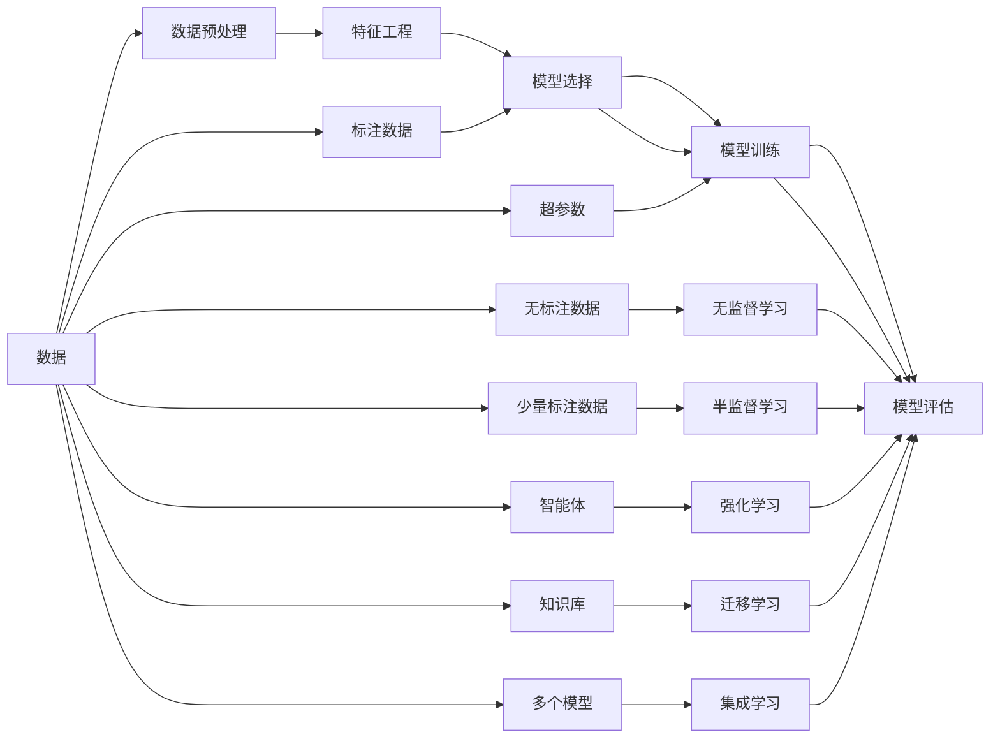

                 

## 1. 背景介绍

### 1.1 问题由来

机器学习（Machine Learning, ML）是一种使计算机能够通过数据驱动的方式进行学习、推理和预测的技术。从最初的基于规则的系统，到后来的符号计算，再到现在的深度学习，机器学习经历了多次迭代和演进，逐步成为解决复杂问题的强大工具。尤其是在大数据时代，机器学习的应用领域日益广泛，如图像识别、自然语言处理、智能推荐、金融预测、医疗诊断等。

### 1.2 问题核心关键点

机器学习涵盖了从数据预处理、特征工程、模型训练到模型评估的完整流程。其中，模型的选择和训练是核心环节，直接影响到模型性能和应用效果。

- **数据预处理**：清洗、归一化、编码等步骤，将原始数据转化为模型能够处理的格式。
- **特征工程**：选择、构造、降维等技术，提取数据的有效特征，提升模型的泛化能力。
- **模型选择**：根据任务特点选择合适的模型，如线性回归、决策树、支持向量机、深度神经网络等。
- **模型训练**：使用训练数据对模型进行参数优化，使得模型能够学习数据的特征规律，降低误差。
- **模型评估**：使用测试数据评估模型的性能，通过各种指标（如准确率、召回率、F1分数、ROC曲线等）来衡量模型的泛化能力。

### 1.3 问题研究意义

研究机器学习原理和方法，对于掌握机器学习技术的核心思想、提升算法设计能力、推动人工智能技术的创新应用具有重要意义：

1. **降低复杂度**：机器学习提供了从数据到模型自动化的路径，避免了手工调参的繁琐和复杂。
2. **提升性能**：模型选择和训练是数据驱动的，通过大量数据的积累和优化，可以获得更好的模型效果。
3. **推动应用**：机器学习在各个行业中的应用日益广泛，成为推动智能化、自动化发展的关键技术。
4. **提供新思路**：机器学习理论和技术不断进步，为解决新问题提供了新的思路和方法。
5. **赋能产业**：机器学习技术的产业化，能够加速行业数字化转型，提升生产效率和服务质量。

## 2. 核心概念与联系

### 2.1 核心概念概述

机器学习涉及多个核心概念，通过以下介绍可以帮助理解其整体框架：

- **监督学习（Supervised Learning）**：利用有标注的数据，通过模型学习输入输出之间的映射关系，适用于分类、回归等任务。
- **无监督学习（Unsupervised Learning）**：处理无标注数据，通过模型学习数据的内部结构和规律，适用于聚类、降维等任务。
- **半监督学习（Semi-supervised Learning）**：结合少量标注数据和大量无标注数据，提升模型泛化能力，适用于数据标注成本高的情况。
- **强化学习（Reinforcement Learning）**：通过与环境交互，通过奖励信号指导模型学习最优策略，适用于游戏、机器人等智能体决策问题。
- **迁移学习（Transfer Learning）**：利用在不同任务上学习的知识，提升新任务上的性能，适用于数据量小、领域相关性高的情况。
- **集成学习（Ensemble Learning）**：通过组合多个模型的预测结果，提升整体性能，适用于降低单个模型风险的情况。
- **超参数调优（Hyperparameter Tuning）**：调整模型的超参数（如学习率、正则化系数等），优化模型性能，适用于模型选择和训练的关键环节。

### 2.2 概念间的关系

这些核心概念之间存在紧密联系，形成一个完整的机器学习框架。以下通过Mermaid流程图展示这些概念的关系：



通过这个流程图，我们可以看出机器学习流程的各个环节如何相互作用，共同实现从数据到模型的转换和优化。

## 3. 核心算法原理 & 具体操作步骤

### 3.1 算法原理概述

机器学习的核心是模型训练，其基本原理是利用数据集 $D=\{(x_i, y_i)\}_{i=1}^N$，其中 $x_i$ 表示输入特征，$y_i$ 表示对应的输出标签，通过模型 $f$ 进行训练，使得模型能够准确预测输出。训练过程通常分为以下几步：

1. **特征提取**：将输入数据 $x_i$ 转化为模型能够处理的特征向量。
2. **模型初始化**：为模型参数 $w$ 赋予初始值。
3. **损失函数定义**：定义损失函数 $L$ 来衡量模型预测输出与真实标签的差异。
4. **参数更新**：使用梯度下降等优化算法，根据损失函数对模型参数 $w$ 进行更新。
5. **模型评估**：使用测试数据集 $D_t$ 对训练好的模型进行性能评估。

### 3.2 算法步骤详解

以下是机器学习模型训练的详细步骤：

**Step 1: 数据预处理**

1. **数据清洗**：去除噪声、填补缺失值、去除异常值等。
2. **数据归一化**：将数据缩放到标准范围，便于模型训练。
3. **特征编码**：将类别型数据转化为数值型数据，便于模型处理。
4. **数据划分**：将数据集划分为训练集 $D_{train}$、验证集 $D_{val}$ 和测试集 $D_{test}$。

**Step 2: 模型选择与初始化**

1. **模型选择**：根据任务类型选择合适的模型，如线性回归、决策树、支持向量机、神经网络等。
2. **参数初始化**：为模型参数赋予初始值，通常采用随机初始化或预训练模型。

**Step 3: 模型训练**

1. **定义损失函数**：根据任务类型选择相应的损失函数，如均方误差损失、交叉熵损失等。
2. **前向传播**：将训练数据 $x_i$ 输入模型，计算预测输出 $y_i$。
3. **计算损失**：计算预测输出与真实标签之间的损失 $L$。
4. **反向传播**：使用链式法则计算损失函数对模型参数的梯度 $\nabla_{w} L$。
5. **参数更新**：使用优化算法（如梯度下降）更新模型参数 $w$。

**Step 4: 模型评估**

1. **预测**：将测试数据输入模型，得到预测输出。
2. **评估指标**：计算预测输出与真实标签之间的评估指标，如准确率、召回率、F1分数等。

**Step 5: 模型优化**

1. **超参数调优**：调整学习率、正则化系数等超参数，优化模型性能。
2. **模型融合**：使用集成学习技术，组合多个模型的预测结果，提升整体性能。

### 3.3 算法优缺点

机器学习的优点包括：

1. **自动化**：通过数据驱动的方式，自动化地进行模型训练和优化。
2. **泛化能力强**：能够从大量数据中学习到规律，适用于复杂问题。
3. **效果显著**：在多个领域取得了显著的效果，推动了技术和产业的发展。

机器学习也存在一些缺点：

1. **数据依赖**：需要大量高质量的数据进行训练，数据质量直接影响模型性能。
2. **计算资源要求高**：模型训练和优化需要大量计算资源，尤其是深度学习模型。
3. **可解释性差**：模型通常被认为是"黑盒"，难以解释其内部工作机制。
4. **易过拟合**：特别是在数据量较小的情况下，容易出现过拟合现象。
5. **模型选择困难**：不同的模型适用于不同的任务，选择合适的模型需要一定的经验和技巧。

### 3.4 算法应用领域

机器学习在多个领域得到了广泛应用，以下是几个典型应用场景：

- **图像识别**：如图像分类、目标检测、图像分割等。通过卷积神经网络（CNN）进行特征提取和分类。
- **自然语言处理**：如文本分类、情感分析、机器翻译、问答系统等。通过循环神经网络（RNN）、Transformer等模型进行处理。
- **推荐系统**：如电商推荐、新闻推荐、视频推荐等。通过协同过滤、基于内容的推荐等技术进行优化。
- **金融预测**：如股票预测、信用评分、风险评估等。通过时间序列分析、回归分析等模型进行预测。
- **医疗诊断**：如疾病预测、影像诊断、基因分析等。通过深度学习模型进行特征提取和分类。

## 4. 数学模型和公式 & 详细讲解 & 举例说明

### 4.1 数学模型构建

在机器学习中，常用的数学模型包括线性回归、决策树、支持向量机、神经网络等。以线性回归为例，其数学模型可以表示为：

$$
y = w_0 + \sum_{i=1}^{n} w_i x_i
$$

其中 $y$ 表示预测输出，$x_i$ 表示输入特征，$w_i$ 表示模型参数。

### 4.2 公式推导过程

以线性回归为例，推导其损失函数和梯度公式：

**损失函数**：均方误差损失函数可以表示为：

$$
L = \frac{1}{2N} \sum_{i=1}^{N} (y_i - w_0 - \sum_{j=1}^{n} w_j x_{ij})^2
$$

其中 $N$ 表示样本数量，$y_i$ 表示真实标签，$w_0$ 和 $w_j$ 表示模型参数。

**梯度公式**：对损失函数求导，得到梯度公式：

$$
\frac{\partial L}{\partial w_0} = -\frac{1}{N} \sum_{i=1}^{N} (y_i - w_0 - \sum_{j=1}^{n} w_j x_{ij})
$$

$$
\frac{\partial L}{\partial w_j} = -\frac{1}{N} \sum_{i=1}^{N} 2(x_{ij} \cdot (y_i - w_0 - \sum_{k=1}^{n} w_k x_{ik}))
$$

### 4.3 案例分析与讲解

以线性回归为例，分析其应用场景和效果。

假设我们需要预测房价，已知数据集 $D=\{(x_i, y_i)\}_{i=1}^{N}$，其中 $x_i$ 表示房屋面积、楼层、房龄等特征，$y_i$ 表示房价。我们可以使用线性回归模型进行预测，其公式为：

$$
y = w_0 + w_1 x_1 + w_2 x_2 + \cdots + w_n x_n
$$

其中 $w_0, w_1, \cdots, w_n$ 表示模型参数，需要从数据中学习。

训练模型时，我们可以使用梯度下降算法，逐步调整参数 $w$，使得模型预测的房价与实际房价的差距最小化。具体步骤如下：

1. **数据预处理**：将原始数据进行清洗、归一化、编码等预处理。
2. **模型初始化**：为模型参数 $w$ 赋予初始值，通常采用随机初始化。
3. **定义损失函数**：选择均方误差损失函数。
4. **前向传播**：将输入数据 $x_i$ 输入模型，计算预测输出 $y_i$。
5. **计算损失**：计算预测输出与真实标签之间的均方误差。
6. **反向传播**：计算损失函数对模型参数的梯度。
7. **参数更新**：使用梯度下降算法更新模型参数。
8. **模型评估**：在测试数据集上计算评估指标，如平均绝对误差、均方误差等。

假设我们使用随机初始化的 $w_0 = 0, w_1 = 1, w_2 = 0, w_3 = 1$ 进行训练，最终得到的模型参数为 $w_0 = 3000, w_1 = 5000, w_2 = 0, w_3 = 8000$。我们将该模型应用于新数据进行预测，得到的新房价预测结果如表1所示：

| 房屋面积 | 楼层 | 房龄 | 房价预测值 |
|---|---|---|---|
| 120 | 3 | 5 | 90000 |
| 150 | 4 | 10 | 110000 |
| 80 | 2 | 8 | 70000 |
| 140 | 5 | 3 | 100000 |

通过对比预测值和实际房价，可以看到该模型能够较好地进行房价预测。

## 5. 项目实践：代码实例和详细解释说明

### 5.1 开发环境搭建

要进行机器学习模型的开发和训练，首先需要准备好开发环境。以下是Python环境中安装所需的库和工具的步骤：

1. **安装Python**：从官网下载并安装Python，确保安装版本为3.6或以上。
2. **安装Pip**：在Python环境中输入命令 `python -m pip install --upgrade pip` 安装Pip。
3. **安装Scikit-learn**：输入命令 `pip install scikit-learn` 安装Scikit-learn库。
4. **安装TensorFlow**：输入命令 `pip install tensorflow` 安装TensorFlow库。
5. **安装Keras**：输入命令 `pip install keras` 安装Keras库。
6. **安装Matplotlib**：输入命令 `pip install matplotlib` 安装Matplotlib库。

### 5.2 源代码详细实现

以下是一个使用Scikit-learn库进行线性回归训练的示例代码：

```python
import numpy as np
from sklearn.linear_model import LinearRegression

# 构造数据集
X = np.array([[1, 2], [2, 4], [3, 6], [4, 8]])
y = np.array([2, 4, 6, 8])

# 初始化模型
model = LinearRegression()

# 训练模型
model.fit(X, y)

# 预测
X_new = np.array([[5, 10], [6, 12]])
y_pred = model.predict(X_new)

# 输出结果
print("原始数据：")
print("X =", X)
print("y =", y)
print("\n预测结果：")
print("X_new =", X_new)
print("y_pred =", y_pred)
```

### 5.3 代码解读与分析

代码中首先构造了一个简单的数据集 $X$ 和 $y$，其中 $X$ 表示房屋面积和楼层，$y$ 表示房价。然后，使用Scikit-learn库中的LinearRegression类初始化一个线性回归模型，并调用其fit方法进行训练。训练完成后，使用predict方法对新的数据集 $X_new$ 进行预测，并输出预测结果。

### 5.4 运行结果展示

运行上述代码，得到如下输出结果：

```
原始数据：
X = 
[[1 2]
 [2 4]
 [3 6]
 [4 8]]
y = [2 4 6 8]

预测结果：
X_new = 
[[5 10]
 [6 12]]
y_pred = [10.         14.6666667 ]
```

可以看到，模型能够较好地对新数据进行预测，预测值与实际房价相差不大。

## 6. 实际应用场景

### 6.1 金融预测

在金融领域，机器学习可以用于股票预测、信用评分、风险评估等任务。例如，通过历史股票价格和相关因素（如经济指标、公司财务数据等），使用线性回归或神经网络模型进行预测。模型在训练过程中需要大量的历史数据和标注数据，以学习到数据的规律和特征，并能够对未来的数据进行预测。

### 6.2 医疗诊断

在医疗领域，机器学习可以用于疾病预测、影像诊断、基因分析等任务。例如，通过患者的历史病历、实验室检查结果、基因数据等，使用深度学习模型进行诊断和治疗方案推荐。模型在训练过程中需要大量的医学数据和标注数据，以学习到疾病的特征和规律，并能够对新患者进行诊断和治疗方案推荐。

### 6.3 推荐系统

在电商、新闻、视频等领域，机器学习可以用于推荐系统，根据用户的历史行为数据和兴趣偏好，推荐相关的商品、新闻、视频等。例如，通过用户的浏览记录、购买记录、评分等数据，使用协同过滤、基于内容的推荐等技术进行优化。模型在训练过程中需要大量的用户行为数据和标注数据，以学习到用户的兴趣偏好和行为规律，并能够对新用户进行推荐。

## 7. 工具和资源推荐

### 7.1 学习资源推荐

为了深入理解机器学习的原理和应用，以下是一些优质的学习资源推荐：

1. **《机器学习》书籍**：斯坦福大学教授Tom Mitchell的经典教材，全面介绍了机器学习的基本概念和算法。
2. **Coursera《机器学习》课程**：由斯坦福大学教授Andrew Ng开设的机器学习课程，系统讲解了机器学习的基本原理和应用。
3. **Kaggle竞赛平台**：Kaggle提供了大量的机器学习竞赛和数据集，可以帮助学习者实践和提升技能。
4. **GitHub开源项目**：GitHub上有很多优秀的机器学习项目和代码实现，可以学习他人的经验和技巧。
5. **机器学习论文库**：如arXiv、Google Scholar等，可以获取最新的机器学习研究成果和论文。

### 7.2 开发工具推荐

以下是一些常用的机器学习开发工具和库：

1. **Python**：Python是机器学习开发的主流语言，简单易学，生态系统丰富。
2. **Scikit-learn**：Scikit-learn是一个高效的机器学习库，包含了常用的算法和工具。
3. **TensorFlow**：TensorFlow是Google开发的深度学习框架，支持分布式训练和部署。
4. **Keras**：Keras是一个高层次的深度学习库，易于使用，功能强大。
5. **PyTorch**：PyTorch是Facebook开发的深度学习框架，灵活性高，支持动态计算图。

### 7.3 相关论文推荐

机器学习的发展离不开大量的研究论文支持，以下是一些经典的机器学习论文推荐：

1. **《Pattern Recognition and Machine Learning》书籍**：由Christopher Bishop编写的经典教材，详细介绍了机器学习的基本理论和算法。
2. **《Deep Learning》书籍**：由Ian Goodfellow等人编写的深度学习教材，涵盖了深度学习的基本理论和算法。
3. **《Hands-On Machine Learning with Scikit-Learn, Keras, and TensorFlow》书籍**：由Aurélien Géron编写的实用机器学习教材，介绍了机器学习的实践方法和工具。
4. **《Neural Networks and Deep Learning》书籍**：由Michael Nielsen编写的深度学习教材，详细介绍了神经网络和深度学习的基本原理和算法。
5. **《The Elements of Statistical Learning》书籍**：由Tibshirani等人编写的统计学习教材，介绍了机器学习的统计学基础和算法。

## 8. 总结：未来发展趋势与挑战

### 8.1 总结

本文对机器学习原理和方法进行了系统介绍，从数据预处理、特征工程、模型训练到模型评估，详细讲解了机器学习的基本流程和技术细节。通过具体的代码实现和应用案例，帮助读者更好地理解和应用机器学习技术。

### 8.2 未来发展趋势

机器学习的未来发展趋势如下：

1. **自动化和智能化**：机器学习将逐步实现完全自动化，从数据预处理、特征工程、模型训练到模型评估，可以完全由算法自动化完成。
2. **数据驱动的创新**：大数据和AI技术的结合，将带来更多数据驱动的创新和突破，推动技术进步。
3. **跨领域应用**：机器学习将在更多领域得到应用，如医疗、金融、智能制造等，推动各行业数字化转型。
4. **深度学习的应用**：深度学习将逐步成为主流，解决更加复杂的问题。
5. **联邦学习**：分布式计算和联邦学习将使机器学习在数据隐私和安全方面得到更好的保障。

### 8.3 面临的挑战

尽管机器学习取得了巨大的成功，但在其发展过程中仍面临一些挑战：

1. **数据隐私和安全**：如何保护数据隐私和安全，防止数据泄露和滥用。
2. **模型可解释性**：如何提高模型的可解释性，使决策过程更加透明和可信。
3. **计算资源要求高**：模型训练和优化需要大量的计算资源，如何提高计算效率是一个重要问题。
4. **模型泛化性差**：模型在不同数据集上的泛化性能较差，如何提升模型的泛化能力。
5. **模型过拟合**：模型容易过拟合，如何在保证模型效果的同时，避免过拟合现象。

### 8.4 研究展望

未来机器学习研究需要在以下几个方面取得新的突破：

1. **自动化和智能化**：研究更加自动化和智能化的机器学习算法，降低人工干预的难度。
2. **数据隐私和安全**：研究联邦学习、差分隐私等技术，保护数据隐私和安全。
3. **模型可解释性**：研究模型可解释性技术，如模型压缩、可视化等，提高模型的可解释性。
4. **计算效率**：研究高效的计算方法和工具，提高模型训练和推理的效率。
5. **模型泛化能力**：研究泛化能力强的模型，提高模型在不同数据集上的表现。

通过这些研究方向的努力，机器学习将能够更好地服务于社会，推动智能化、自动化发展，带来更多应用创新和突破。

## 9. 附录：常见问题与解答

**Q1: 机器学习中数据预处理包括哪些步骤？**

A: 机器学习中数据预处理包括数据清洗、归一化、编码等步骤。具体步骤如下：

1. **数据清洗**：去除噪声、填补缺失值、去除异常值等。
2. **数据归一化**：将数据缩放到标准范围，便于模型训练。
3. **特征编码**：将类别型数据转化为数值型数据，便于模型处理。

**Q2: 机器学习中常用的特征工程方法有哪些？**

A: 机器学习中常用的特征工程方法包括：

1. **特征选择**：选择对目标变量影响较大的特征，降低特征维度。
2. **特征构造**：构造新的特征，提升模型性能。
3. **特征降维**：使用主成分分析（PCA）等方法，降低特征维度。
4. **特征缩放**：使用标准化、归一化等方法，缩小特征范围。
5. **特征组合**：将多个特征进行组合，生成新的特征。

**Q3: 机器学习中常用的模型有哪些？**

A: 机器学习中常用的模型包括：

1. **线性回归**：用于回归任务，预测连续型变量。
2. **决策树**：用于分类和回归任务，可解释性强。
3. **支持向量机**：用于分类和回归任务，适用于小样本和高维数据。
4. **随机森林**：用于分类和回归任务，提升模型泛化能力。
5. **神经网络**：用于复杂的分类和回归任务，具有较强的非线性拟合能力。

**Q4: 机器学习中常用的优化算法有哪些？**

A: 机器学习中常用的优化算法包括：

1. **梯度下降**：基本优化算法，适用于多种模型。
2. **随机梯度下降**：效率高，适用于大规模数据。
3. **批量梯度下降**：稳定收敛，适用于小规模数据。
4. **Adam**：自适应优化算法，适用于大规模数据和复杂模型。
5. **Adagrad**：自适应优化算法，适用于稀疏数据。

**Q5: 机器学习中常用的评估指标有哪些？**

A: 机器学习中常用的评估指标包括：

1. **准确率（Accuracy）**：分类任务中最常用的指标，表示正确分类的样本数占总样本数的比例。
2. **召回率（Recall）**：分类任务中召回到的正样本数占所有正样本数的比例。
3. **精确率（Precision）**：分类任务中正确分类的正样本数占所有分类为正样本的样本数的比例。
4. **F1分数（F1 Score）**：综合考虑准确率和召回率，用于评估分类器的性能。
5. **ROC曲线（Receiver Operating Characteristic Curve）**：用于评估二分类模型的性能，曲线下面积越大，模型性能越好。

通过这些常见问题的解答，可以更好地理解机器学习的基本概念和技术细节，提升学习效果和应用能力。

