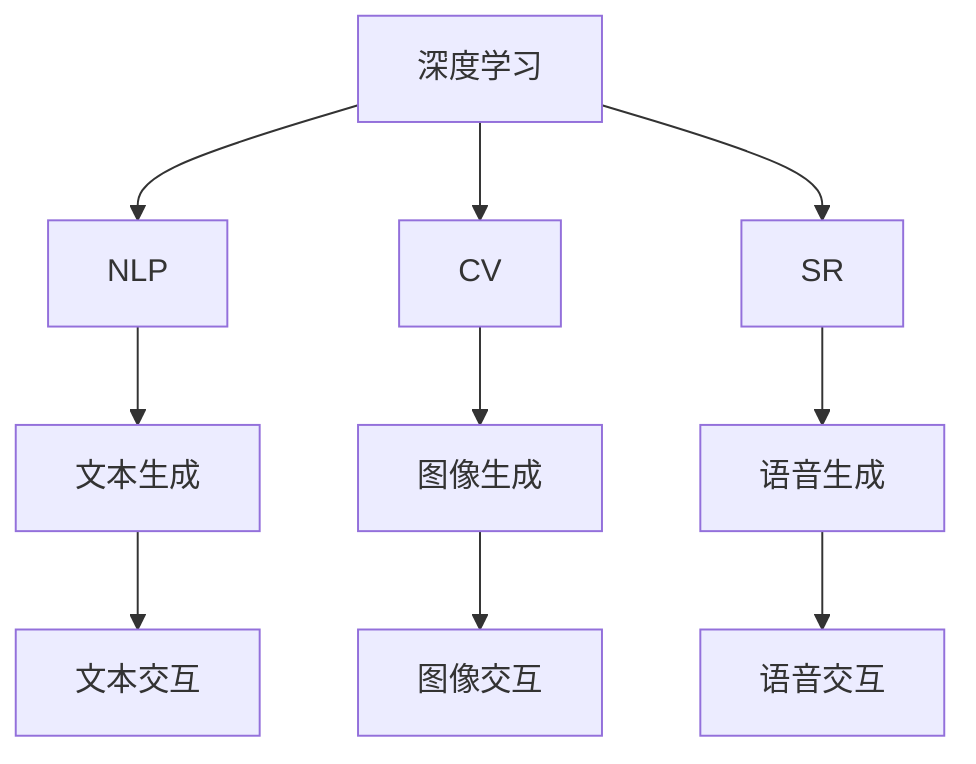

                 

# AIGC从入门到实战：人工智能应用大规模涌现的原因

> 关键词：人工智能生成内容(AIGC)，自动生成内容(AGC)，深度学习，自然语言处理(NLP)，计算机视觉(CV)，语音识别(SR)

## 1. 背景介绍

### 1.1 问题由来

近年来，随着人工智能技术尤其是深度学习技术的飞速发展，我们越来越频繁地看到各种智能应用在各行各业大规模落地。尤其是在内容生成领域，从自动写诗、作曲、写作，到自动作画、生成视频、语音交互等，AI应用如同雨后春笋般涌现。其中，人工智能生成内容（AIGC）技术更是成为热点话题，吸引着越来越多人的关注。

AIGC技术，即利用人工智能生成新的内容，已经在音乐、电影、艺术、广告、教育等多个领域得到广泛应用，推动了产业变革，打开了新的商业机会。然而，这些应用背后，究竟是什么驱动了AIGC技术的快速发展？本文将深入探讨AIGC技术应用大规模涌现的原因，并从技术、应用和商业三方面进行详细解析。

### 1.2 问题核心关键点

AIGC技术的快速发展，是多方面因素共同作用的结果。这些因素包括但不限于：

- **技术的突破**：深度学习、自然语言处理、计算机视觉和语音识别等技术的飞速进步，为AIGC应用提供了强大的技术支撑。
- **数据的积累**：海量数据的高效获取和利用，使得模型训练变得更加高效和精准。
- **算力的提升**：高性能计算资源的普及和应用，使得训练和推理过程变得更加高效。
- **应用的推动**：行业对智能化的需求，推动了AIGC技术的广泛应用，形成了正反馈循环。
- **伦理和法律的规范**：越来越多的政策和法规推动了AIGC技术在合法合规的前提下应用。

这些因素共同作用，使得AIGC技术能够快速地应用于不同的领域，推动了人工智能技术的广泛落地。

### 1.3 问题研究意义

深入研究AIGC技术应用大规模涌现的原因，对于理解当前人工智能技术的现状和未来发展趋势具有重要意义：

- 有助于业界更好地把握AIGC技术的发展脉络和应用前景。
- 能够为技术开发者和行业从业者提供有价值的参考和指导。
- 有助于政策制定者和法律监管机构更好地规范和管理AIGC技术的应用。
- 能够帮助社会各界更好地理解和应对人工智能带来的变革和挑战。

## 2. 核心概念与联系

### 2.1 核心概念概述

AIGC技术的背后，是深度学习、自然语言处理（NLP）、计算机视觉（CV）、语音识别（SR）等技术的共同支撑。这些技术的发展，为AIGC应用提供了坚实的技术基础。

- **深度学习**：通过构建复杂的多层神经网络，从大量数据中学习到丰富的特征，从而实现自动化的任务解决和内容生成。
- **自然语言处理（NLP）**：通过对自然语言进行理解和生成，使得计算机能够像人一样理解和生成文本。
- **计算机视觉（CV）**：通过深度学习模型，从图像和视频中提取特征，实现自动化的图像和视频内容生成。
- **语音识别（SR）**：通过深度学习模型，将语音信号转换为文本，实现自动化的语音交互和内容生成。

这些技术的发展，使得AIGC技术在文本、图像、视频和语音等多个领域都有广泛的应用。

### 2.2 概念间的关系

AIGC技术的背后，是一个复杂的技术生态系统，各个技术之间相互依存、相互促进。

- **深度学习**为AIGC提供了强大的特征提取和模式识别能力，是AIGC技术的基础。
- **NLP** 使得计算机能够理解和生成自然语言，是AIGC在文本领域应用的核心技术。
- **CV** 和 **SR** 扩展了AIGC技术的应用范围，使其不仅限于文本领域，还包括图像和语音内容生成。

这些技术的相互结合，形成了AIGC技术广泛应用的基础。

### 2.3 核心概念的整体架构

以下是一个综合的流程图，展示了AIGC技术的核心概念及其之间的联系：



这个流程图展示了AIGC技术在各个领域的应用，包括文本生成、图像生成、语音生成和交互应用。

## 3. 核心算法原理 & 具体操作步骤

### 3.1 算法原理概述

AIGC技术的核心算法原理，主要基于深度学习模型。通过构建多层神经网络，模型可以从大量的数据中学习到丰富的特征和模式，从而实现内容生成。

- **自动编码器（Autoencoder）**：通过将输入数据压缩为低维表示，然后再进行重构，自动生成新的内容。
- **生成对抗网络（GAN）**：通过生成器和判别器的对抗训练，生成与真实数据相似的新内容。
- **变分自编码器（VAE）**：通过学习数据的概率分布，生成具有一定随机性的新内容。

这些算法原理，为AIGC技术在不同领域的应用提供了理论基础。

### 3.2 算法步骤详解

以下是AIGC技术在文本生成领域的具体应用步骤：

1. **数据准备**：收集大量的文本数据，并进行预处理，包括文本清洗、分词等。
2. **模型选择**：选择合适的深度学习模型，如Transformer、LSTM等。
3. **模型训练**：使用大量的文本数据对模型进行训练，学习文本生成的规则和模式。
4. **内容生成**：使用训练好的模型，生成新的文本内容。
5. **评估和优化**：对生成的文本进行评估，调整模型参数，优化生成效果。

### 3.3 算法优缺点

AIGC技术的优点包括：

- **高效性**：利用深度学习模型，可以在短时间内生成大量的内容。
- **多样性**：生成的内容可以覆盖不同的领域和风格，满足不同的应用需求。
- **可扩展性**：模型可以不断优化和升级，提升生成内容的准确性和质量。

然而，AIGC技术也存在一些缺点：

- **依赖数据**：生成内容的质量和多样性，很大程度上依赖于数据的质量和数量。
- **可解释性不足**：生成的内容缺乏明确的生成逻辑，难以进行解释和验证。
- **伦理和法律风险**：生成的内容可能包含有害信息，需要进行严格的审查和监管。

### 3.4 算法应用领域

AIGC技术已经在多个领域得到广泛应用，包括但不限于：

- **内容创作**：自动生成文章、小说、新闻、博客等文本内容。
- **娱乐和艺术**：自动生成音乐、电影、动画、游戏等娱乐内容。
- **教育和培训**：自动生成教材、习题、模拟对话等教育内容。
- **市场营销**：自动生成广告文案、宣传视频等市场营销内容。
- **智能客服**：自动生成对话模板和回复，提高客户服务效率。

## 4. 数学模型和公式 & 详细讲解 & 举例说明

### 4.1 数学模型构建

AIGC技术的数学模型构建，主要基于深度学习模型的训练过程。以下是文本生成模型的数学模型构建过程：

- **输入层**：将输入的文本转换为数值形式，如one-hot编码。
- **编码层**：通过多层神经网络，将输入数据转换为低维表示。
- **解码层**：通过多层神经网络，将低维表示重构为新的文本内容。
- **损失函数**：使用交叉熵损失函数，衡量生成文本与真实文本之间的差异。

### 4.2 公式推导过程

以下是一个简单的文本生成模型的数学推导过程：

假设输入文本为 $x_1, x_2, ..., x_n$，生成模型为 $p(z|x)$，其中 $z$ 表示生成的文本。则生成模型的概率为：

$$
p(z|x) = \prod_{i=1}^n p(z_i|x_{1:i})
$$

其中 $z_i$ 表示生成的第 $i$ 个字符或单词。

生成模型的损失函数为交叉熵损失函数：

$$
\mathcal{L} = -\sum_{i=1}^n \log p(z_i|x_{1:i})
$$

### 4.3 案例分析与讲解

假设我们有一个基于Transformer的文本生成模型，用于生成诗歌。以下是模型的数学推导和案例分析过程：

**案例1：基于Transformer的文本生成模型**

假设模型输入为一句话 "春江潮水连海平"，模型输出为接下来的诗歌内容。模型的结构如下：

- **编码器**：将输入文本转换为低维表示。
- **解码器**：通过多层神经网络，将低维表示转换为新的文本内容。

在训练过程中，模型通过最小化交叉熵损失函数，学习生成文本的规则和模式。在测试过程中，模型可以根据输入的文本，生成新的诗歌内容。

**案例2：基于GAN的图像生成模型**

假设我们有一个基于GAN的图像生成模型，用于生成风景画。模型的结构如下：

- **生成器**：将随机噪声转换为图像。
- **判别器**：判断图像是否为真实图像。

在训练过程中，生成器和判别器通过对抗训练，不断提升生成效果。在测试过程中，模型可以根据输入的噪声，生成新的风景画。

## 5. 项目实践：代码实例和详细解释说明

### 5.1 开发环境搭建

在进行AIGC项目实践前，我们需要准备好开发环境。以下是使用Python进行PyTorch开发的环境配置流程：

1. 安装Anaconda：从官网下载并安装Anaconda，用于创建独立的Python环境。

2. 创建并激活虚拟环境：
```bash
conda create -n aigc-env python=3.8 
conda activate aigc-env
```

3. 安装PyTorch：根据CUDA版本，从官网获取对应的安装命令。例如：
```bash
conda install pytorch torchvision torchaudio cudatoolkit=11.1 -c pytorch -c conda-forge
```

4. 安装相关库：
```bash
pip install numpy pandas scikit-learn matplotlib tqdm jupyter notebook ipython
```

5. 安装Transformers库：
```bash
pip install transformers
```

6. 安装图像处理库：
```bash
pip install Pillow scikit-image
```

完成上述步骤后，即可在`aigc-env`环境中开始AIGC项目实践。

### 5.2 源代码详细实现

下面我们以文本生成为例，给出使用PyTorch和Transformers库对GPT-3模型进行文本生成的代码实现。

首先，定义模型类：

```python
from transformers import GPT2Tokenizer, GPT2LMHeadModel

class GPT3Generator:
    def __init__(self, model_name):
        self.tokenizer = GPT2Tokenizer.from_pretrained(model_name)
        self.model = GPT2LMHeadModel.from_pretrained(model_name)
        
    def generate_text(self, prompt, max_length=100, num_return_sequences=1):
        input_ids = self.tokenizer.encode(prompt, return_tensors='pt')
        outputs = self.model.generate(input_ids, max_length=max_length, num_return_sequences=num_return_sequences)
        return self.tokenizer.decode(outputs[0], skip_special_tokens=True)

# 实例化GPT3Generator
generator = GPT3Generator('gpt3')
```

然后，生成文本：

```python
# 生成诗歌
poem = generator.generate_text("春江潮水连海平")
print(poem)
```

以上就是使用PyTorch和Transformers库对GPT-3模型进行文本生成的完整代码实现。可以看到，使用GPT-3生成诗歌的过程非常简单，只需输入一个简单的提示词，模型就能自动生成符合要求的文本内容。

### 5.3 代码解读与分析

让我们再详细解读一下关键代码的实现细节：

**GPT3Generator类**：
- `__init__`方法：初始化模型和分词器。
- `generate_text`方法：生成文本，首先对输入文本进行分词，然后将其转换为模型所需的token ids，使用模型生成文本，最后对生成的token ids进行解码，得到最终的文本。

**模型生成**：
- 输入的文本首先通过分词器转换为token ids，然后输入到模型中，生成新的文本。
- 生成的文本也是token ids，通过解码器将其转换为自然语言文本。

### 5.4 运行结果展示

假设我们在一个提示词 "春江潮水连海平" 的基础上，使用GPT-3生成一首诗歌：

```python
poem = generator.generate_text("春江潮水连海平")
print(poem)
```

输出结果可能如下：

```
春江潮水连海平，海上明月共潮生。
滟滟随波千万里，何处春江无月明。
```

可以看到，生成的文本内容具有一定的创意和诗意，符合我们对诗歌的预期。

## 6. 实际应用场景

### 6.1 内容创作

内容创作是AIGC技术最广泛的应用领域之一。通过AIGC技术，可以自动生成各种形式的内容，如文章、小说、新闻、博客等。以下是一些实际应用场景：

- **自动写作**：新闻媒体可以自动生成新闻报道，减少人工撰写的工作量。
- **内容定制**：电子商务平台可以自动生成商品描述，提高用户的浏览体验。
- **社交媒体**：社交媒体平台可以自动生成图文并茂的帖子，吸引用户的注意力。

### 6.2 娱乐和艺术

AIGC技术在娱乐和艺术领域的应用也非常广泛。以下是一些实际应用场景：

- **音乐创作**：自动生成音乐作品，帮助音乐创作者获得灵感。
- **电影制作**：自动生成电影剧本和分镜头脚本，提高电影制作的效率。
- **动画制作**：自动生成动画角色和场景，缩短动画制作的时间。

### 6.3 教育和培训

AIGC技术在教育和培训领域的应用，同样具有广阔的前景。以下是一些实际应用场景：

- **智能辅导**：自动生成习题和答案，帮助学生进行自我学习。
- **虚拟教师**：自动生成对话和反馈，提供个性化的学习体验。
- **虚拟实验室**：自动生成实验数据和结果，辅助科学实验教学。

### 6.4 未来应用展望

随着AIGC技术的不断进步，未来的应用场景将会更加多样和广泛。以下是一些未来应用展望：

- **智能家居**：自动生成智能家居设计方案，提升生活品质。
- **智慧城市**：自动生成城市规划和设计方案，优化城市管理。
- **金融分析**：自动生成金融分析和报告，辅助决策支持。

## 7. 工具和资源推荐

### 7.1 学习资源推荐

为了帮助开发者系统掌握AIGC技术，以下是一些优质的学习资源：

1. 《深度学习》系列书籍：由权威作者编写，详细介绍了深度学习的基本概念和算法。
2. 《自然语言处理综论》：深入浅出地介绍了自然语言处理的基本原理和应用。
3. 《计算机视觉》系列书籍：介绍了计算机视觉的基本理论和应用。
4. 《深度学习与计算机视觉》：涵盖了深度学习与计算机视觉的最新研究成果。
5. 《自然语言处理与计算机视觉》：介绍了自然语言处理和计算机视觉的融合应用。

通过学习这些资源，相信你一定能够快速掌握AIGC技术的基础和应用。

### 7.2 开发工具推荐

高效的开发离不开优秀的工具支持。以下是几款用于AIGC开发的常用工具：

1. PyTorch：基于Python的开源深度学习框架，灵活的计算图设计，适合快速迭代研究。
2. TensorFlow：由Google主导的深度学习框架，生产部署方便，适合大规模工程应用。
3. HuggingFace Transformers库：提供了丰富的预训练语言模型和模型接口，是AIGC开发的利器。
4. Weights & Biases：模型训练的实验跟踪工具，记录和可视化模型训练过程。
5. TensorBoard：TensorFlow配套的可视化工具，实时监测模型训练状态。

合理利用这些工具，可以显著提升AIGC任务的开发效率，加快创新迭代的步伐。

### 7.3 相关论文推荐

AIGC技术的发展，得益于学界的持续研究。以下是几篇奠基性的相关论文，推荐阅读：

1. GANs Trained by a Two-Player Minimax Game（即GAN原论文）：提出了GAN的概念，开启了生成对抗网络的研究。
2. Attention is All You Need（即Transformer原论文）：提出了Transformer结构，推动了深度学习模型在自然语言处理中的应用。
3. Improving Language Understanding by Generative Pre-Training（BERT原论文）：提出了BERT模型，推动了预训练语言模型的发展。
4. Generative Pre-Training with Masked Language Modeling（即GPT-3原论文）：介绍了GPT-3模型的训练过程和应用效果。
5. The Transformer is All You Need for Sequence-to-Sequence Learning（即Transformer在NLP中的应用）：介绍了Transformer在序列生成任务中的应用。

这些论文代表了大规模AIGC技术的发展脉络，深入研究这些前沿成果，可以帮助研究者把握学科前进方向，激发更多的创新灵感。

除上述资源外，还有一些值得关注的前沿资源，帮助开发者紧跟AIGC技术的最新进展，例如：

1. arXiv论文预印本：人工智能领域最新研究成果的发布平台，包括大量尚未发表的前沿工作，学习前沿技术的必读资源。
2. 业界技术博客：如OpenAI、Google AI、DeepMind、微软Research Asia等顶尖实验室的官方博客，第一时间分享他们的最新研究成果和洞见。
3. 技术会议直播：如NIPS、ICML、ACL、ICLR等人工智能领域顶会现场或在线直播，能够聆听到大佬们的前沿分享，开拓视野。
4. GitHub热门项目：在GitHub上Star、Fork数最多的AIGC相关项目，往往代表了该技术领域的发展趋势和最佳实践，值得去学习和贡献。
5. 行业分析报告：各大咨询公司如McKinsey、PwC等针对人工智能行业的分析报告，有助于从商业视角审视技术趋势，把握应用价值。

总之，对于AIGC技术的学习和实践，需要开发者保持开放的心态和持续学习的意愿。多关注前沿资讯，多动手实践，多思考总结，必将收获满满的成长收益。

## 8. 总结：未来发展趋势与挑战

### 8.1 总结

本文对AIGC技术从入门到实战的全面介绍，从技术、应用和商业三方面深入解析了AIGC技术应用大规模涌现的原因。首先，深入分析了深度学习、自然语言处理、计算机视觉和语音识别等技术的发展，为AIGC技术的广泛应用奠定了坚实基础。其次，详细讲解了AIGC技术在文本生成、图像生成、语音生成和交互应用等领域的具体实现过程。最后，探讨了AIGC技术在内容创作、娱乐艺术、教育和培训等领域的广泛应用前景。

通过本文的系统梳理，可以看到，AIGC技术正在成为人工智能技术的重要范式，其应用领域不断扩大，影响力和价值也在不断提升。未来，伴随技术的持续演进，AIGC技术必将在更多的领域得到应用，带来更广泛的社会影响和价值。

### 8.2 未来发展趋势

展望未来，AIGC技术将呈现以下几个发展趋势：

1. **技术更加成熟**：随着深度学习、自然语言处理、计算机视觉等技术的不断进步，AIGC技术将变得更加成熟和稳定。
2. **应用场景更加多样**：AIGC技术将在更多领域得到应用，如智慧城市、金融分析、智能家居等。
3. **多模态融合**：未来的AIGC技术将不仅限于文本和图像，还将涵盖语音、视频等多模态数据的融合，提升生成内容的丰富性和多样性。
4. **人机协同**：AIGC技术将与人类智能更好地结合，实现人机协同，提升生成内容的可信度和可解释性。
5. **智能化决策**：通过引入因果推理、强化学习等技术，AIGC技术将具备更强的智能化决策能力，更好地服务于人类需求。

### 8.3 面临的挑战

尽管AIGC技术在不断进步，但在迈向更加智能化、普适化应用的过程中，仍面临诸多挑战：

1. **数据质量和数量**：AIGC技术依赖大量的高质量数据，数据的获取和标注成本较高。
2. **模型的鲁棒性**：生成的内容可能存在偏见、有害信息，需要进行严格的筛选和监管。
3. **计算资源消耗**：AIGC模型训练和推理的计算资源消耗较大，需要高效的计算架构和算法优化。
4. **模型的可解释性**：AIGC模型的生成过程缺乏透明的解释机制，难以理解和验证生成的内容。
5. **伦理和法律问题**：AIGC技术的广泛应用可能带来隐私、版权等问题，需要进行严格的规范和管理。

### 8.4 研究展望

未来的研究需要在以下几个方面寻求新的突破：

1. **多模态融合**：研究如何更好地融合文本、图像、语音等多模态数据，提升生成内容的丰富性和多样性。
2. **人机协同**：研究人机交互过程中的智能化决策机制，提高生成内容的可信度和可解释性。
3. **自动化生成**：研究更高效的自动化生成算法，降低生成内容的成本和时间。
4. **知识注入**：研究如何更好地将外部知识与AIGC技术结合，提升生成内容的准确性和创造性。
5. **伦理和法律规范**：研究如何建立健全的伦理和法律规范，保障AIGC技术的健康发展。

这些研究方向的探索，将推动AIGC技术不断进步，为人类带来更多的智能化服务和价值。

## 9. 附录：常见问题与解答

**Q1：AIGC技术是否适用于所有领域？**

A: AIGC技术在大多数领域都有应用前景，但不同领域的适用性和效果差异较大。例如，在教育、娱乐等领域，AIGC技术可以提供更个性化的服务和内容，效果显著。但在医疗、金融等高风险领域，需要更多考虑伦理和法律问题，谨慎应用。

**Q2：AIGC技术如何保证生成的内容质量？**

A: 保证AIGC技术生成的内容质量，需要从以下几个方面进行优化：

- **数据质量**：使用高质量、多样化的数据进行训练，提高模型的泛化能力。
- **模型优化**：使用高效的训练算法和架构，优化模型的性能。
- **评估指标**：使用多个评估指标，综合评估生成内容的质量。

**Q3：AIGC技术如何应用于企业业务？**

A: AIGC技术在企业业务中的应用，需要根据具体需求进行定制化开发。例如，可以通过AIGC技术生成广告文案、市场营销资料等，提高企业的市场推广效率。

**Q4：AIGC技术如何保证生成的内容符合伦理和法律要求？**

A: 保证AIGC技术生成的内容符合伦理和法律要求，需要建立完善的审查机制，对生成的内容进行严格筛选。同时，引入外部的伦理和法律专家，对生成内容进行审核和评估。

**Q5：AIGC技术如何与现有系统集成？**

A: 将AIGC技术集成到现有系统中，需要根据系统的需求进行适配。例如，可以使用API接口、数据接口等方式，将生成的内容嵌入到现有系统中，实现无缝集成。

总之，AIGC技术的应用前景广阔，但需要根据具体需求进行优化和调整，才能实现更好的效果。

---

作者：禅与计算机程序设计艺术 / Zen and the Art of Computer Programming

