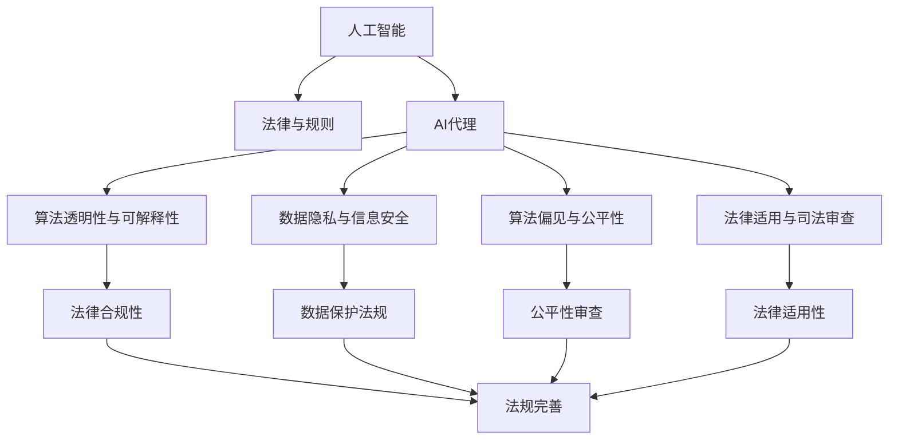
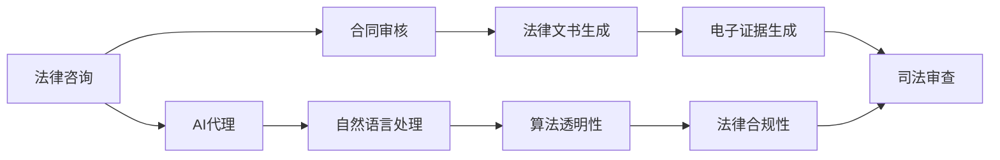
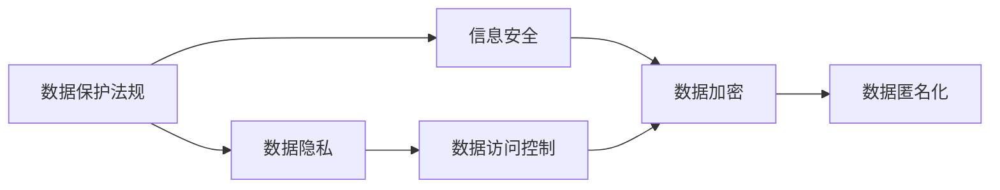
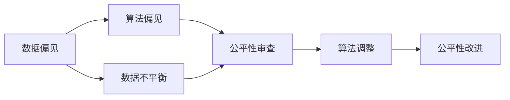
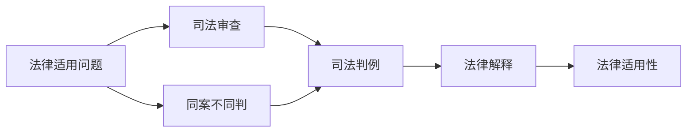
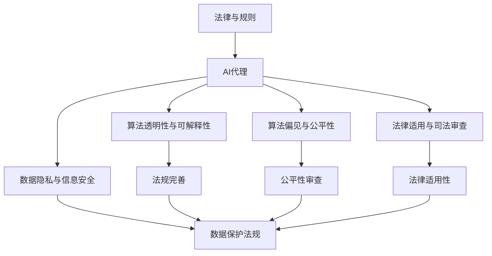

                 

# AI人工智能 Agent：对法律和规则的挑战

> 关键词：人工智能,法律,规则,挑战,伦理道德

## 1. 背景介绍

### 1.1 问题由来
随着人工智能(AI)技术的快速发展和广泛应用，AI在法律和规则制定、执行与解释等领域的角色日益凸显。一方面，AI通过大数据分析、自然语言处理等技术，能够在法律咨询、司法判决、合同审核等方面提供辅助决策支持；另一方面，AI也引发了诸如算法歧视、隐私侵犯、责任归属等伦理道德问题，对现行法律和规则体系提出了严峻挑战。

### 1.2 问题核心关键点
当前，AI在法律和规则领域的应用面临着以下核心问题：
- **算法透明度与可解释性**：AI模型的决策过程往往是“黑箱”的，难以解释和审查，这与法律要求的公开透明、可追溯性相冲突。
- **责任归属与法律责任**：当AI系统出错或导致损害时，如何确定责任归属，分配法律责任，现有法律体系尚无明确规定。
- **数据隐私与信息安全**：AI系统依赖大量数据进行训练和推理，如何在确保数据隐私和安全的同时，合法合规地使用数据，是一个复杂问题。
- **算法偏见与公平性**：AI模型可能会学习并放大数据中的偏见，导致在决策过程中出现不公平对待某些群体的现象。
- **法律适用与司法审查**：AI系统的法律适用问题，例如如何处理“同案不同判”等问题，以及司法机关如何对AI决策进行审查和监督。

### 1.3 问题研究意义
研究AI在法律和规则领域的应用与挑战，对维护法律公正性、保障数据隐私、促进技术伦理发展具有重要意义：

1. **确保法律公正性**：通过技术手段辅助法官、律师等法律专业人士，确保法律判决的准确性和公正性。
2. **保护数据隐私与安全**：制定和实施数据保护法规，保障个人隐私不受侵犯，确保AI系统在处理敏感信息时合规。
3. **促进技术伦理发展**：建立AI伦理审查机制，确保技术应用不违背伦理道德原则，保障社会公平正义。

## 2. 核心概念与联系

### 2.1 核心概念概述

为更好地理解AI在法律和规则领域的应用与挑战，本节将介绍几个关键概念及其相互关系：

- **人工智能(AI)**：指模拟人类智能行为的技术体系，包括机器学习、自然语言处理、计算机视觉等。
- **法律与规则**：指国家和地方制定的法规、政策、标准等，用于规范社会行为、解决社会冲突。
- **AI代理(Agent)**：指能够在特定环境中执行任务的AI系统，如法律咨询系统、合同生成系统等。
- **算法透明性与可解释性**：指AI系统决策过程的公开程度和可理解性，是法律合规和审查的基础。
- **数据隐私与信息安全**：指个人或组织数据的保护措施，确保数据不被非法访问、使用或泄露。
- **算法偏见与公平性**：指AI系统在决策过程中是否存在对某些群体的不公平对待现象。
- **法律适用与司法审查**：指法律在AI系统中的适用问题，以及司法机关如何对AI决策进行审查和监督。

这些概念之间的逻辑关系可以通过以下Mermaid流程图来展示：



这个流程图展示了AI在法律和规则领域的应用核心概念及其相互关系：

1. AI通过算法生成法律咨询、合同生成等AI代理功能。
2. AI代理需要具备算法透明性和可解释性，以符合法律的公开透明要求。
3. 数据隐私和信息安全是AI应用的基础，需要遵守相关数据保护法规。
4. AI在应用过程中可能会产生算法偏见，需要公平性审查。
5. AI的适用性问题需要通过法律适用与司法审查来解决。
6. 法律合规性和法规完善需要确保AI应用符合法律法规要求。

### 2.2 概念间的关系

这些核心概念之间存在着紧密的联系，形成了AI在法律和规则领域的完整应用框架。下面我通过几个Mermaid流程图来展示这些概念之间的关系。

#### 2.2.1 AI代理功能与法律应用



这个流程图展示了AI代理在法律咨询、合同审核等具体功能的应用，以及其需要遵守的法律和规则。

#### 2.2.2 数据隐私与信息安全



这个流程图展示了数据隐私与信息安全的具体措施，包括数据访问控制、加密、匿名化等。

#### 2.2.3 算法偏见与公平性审查



这个流程图展示了算法偏见产生的原因以及如何通过公平性审查和调整来改进算法。

#### 2.2.4 法律适用与司法审查



这个流程图展示了法律适用问题以及司法审查的具体步骤。

### 2.3 核心概念的整体架构

最后，我们用一个综合的流程图来展示这些核心概念在大语言模型微调过程中的整体架构：



这个综合流程图展示了从法律与规则到AI代理，再到具体应用中的算法透明性、数据隐私、公平性审查、法律适用性的完整过程。通过这些流程图，我们可以更清晰地理解AI在法律和规则领域的应用中各个概念的关系和作用，为后续深入讨论具体的应用方法和技术奠定基础。

## 3. 核心算法原理 & 具体操作步骤
### 3.1 算法原理概述

AI在法律和规则领域的应用通常基于监督学习、无监督学习、强化学习等多种学习范式。以监督学习为例，其核心思想是通过对大量标注数据进行训练，学习出预测任务的模型，然后在新数据上进行推理。

形式化地，假设法律问题可以表示为 $P=(p_x, p_y)$，其中 $p_x$ 表示问题的特征向量，$p_y$ 表示问题的标签。AI代理 $M$ 通过训练集 $D=\{(p_i, y_i)\}_{i=1}^N$ 学习到模型参数 $\theta$，使得在新问题 $P'$ 上能够准确预测标签 $y'$。优化目标为：

$$
\theta^* = \mathop{\arg\min}_{\theta} \sum_{i=1}^N \ell(M(p_i), y_i)
$$

其中 $\ell$ 为损失函数，通常是交叉熵损失。

### 3.2 算法步骤详解

基于监督学习的AI代理开发一般包括以下几个关键步骤：

**Step 1: 准备数据集**
- 收集与法律和规则相关的标注数据集 $D=\{(p_i, y_i)\}_{i=1}^N$，划分为训练集、验证集和测试集。数据集应覆盖多个法律案例和规则场景，确保模型的泛化能力。

**Step 2: 选择合适的模型与算法**
- 选择合适的AI代理模型，如法律咨询系统、合同审核系统等。常用的模型包括LSTM、Transformer等。
- 选择合适的优化算法，如SGD、Adam等，设置学习率、批大小、迭代轮数等超参数。

**Step 3: 设计任务适配层**
- 根据法律问题的特征和标签，设计合适的任务适配层。
- 对于分类问题，通常使用softmax分类器输出概率分布，并以交叉熵损失函数进行训练。
- 对于回归问题，可以使用均方误差损失函数。

**Step 4: 训练与评估**
- 将训练集数据分批次输入模型，前向传播计算损失函数。
- 反向传播计算参数梯度，根据设定的优化算法和学习率更新模型参数。
- 周期性在验证集上评估模型性能，根据性能指标决定是否触发Early Stopping。
- 重复上述步骤直至满足预设的迭代轮数或Early Stopping条件。

**Step 5: 部署与应用**
- 在测试集上评估AI代理的性能，对比训练前后的精度提升。
- 使用AI代理对新问题进行推理预测，集成到实际的应用系统中。
- 持续收集新的数据，定期重新训练模型，以适应数据分布的变化。

以上是基于监督学习的AI代理开发的一般流程。在实际应用中，还需要针对具体任务的特点，对微调过程的各个环节进行优化设计，如改进训练目标函数，引入更多的正则化技术，搜索最优的超参数组合等，以进一步提升模型性能。

### 3.3 算法优缺点

基于监督学习的AI代理方法具有以下优点：
1. 训练过程高效。通过标注数据进行训练，可以快速构建模型，适应新问题。
2. 模型性能稳定。在充分标注的数据上训练，模型泛化能力较强。
3. 算法可解释性高。模型参数和训练过程公开透明，易于审查和解释。

同时，该方法也存在以下局限性：
1. 数据依赖性强。标注数据的质量和数量直接影响模型性能。
2. 泛化能力有限。标注数据与实际应用场景的分布可能存在差异，模型在新场景下表现可能较差。
3. 算法易受偏见。标注数据中的偏见可能被模型放大，导致不公平现象。
4. 可扩展性受限。模型结构固定，难以进行动态调整。

尽管存在这些局限性，但就目前而言，基于监督学习的AI代理方法仍然是法律和规则领域应用的主流范式。未来相关研究的重点在于如何进一步降低数据标注的依赖，提高模型的泛化能力和公平性，同时兼顾可解释性和伦理安全性等因素。

### 3.4 算法应用领域

基于监督学习的AI代理方法已经在法律和规则领域得到了广泛应用，包括但不限于以下场景：

- **法律咨询系统**：如Lumen Legal、Ross Intelligence等，能够提供实时法律咨询和案例分析，辅助律师和法务人员处理法律事务。
- **合同审核系统**：如LegalZoom、V winner等，能够自动审核合同文本，提供法律合规性评估，降低法律风险。
- **电子证据生成系统**：如OpenAI的LegalAI，能够自动生成电子证据，支持在线仲裁和远程诉讼。
- **法律文书生成系统**：如CaseText、Accord等，能够自动生成法律文书，提高文书制作效率。
- **司法审查系统**：如IBM Watson for Legal，能够辅助法官进行司法判决，提高审判效率和公正性。

除了上述这些经典应用外，AI代理还将在更多领域得到应用，如反欺诈检测、知识产权保护、法律教育等，为法律和规则领域带来新的变革。

## 4. 数学模型和公式 & 详细讲解  
### 4.1 数学模型构建

本节将使用数学语言对基于监督学习的AI代理开发过程进行更加严格的刻画。

假设AI代理 $M$ 能够对法律问题 $P=(p_x, p_y)$ 进行预测，其模型参数为 $\theta$。训练集 $D=\{(p_i, y_i)\}_{i=1}^N$，损失函数为交叉熵损失 $\ell$，优化目标为最小化损失函数：

$$
\mathcal{L}(\theta) = \frac{1}{N}\sum_{i=1}^N \ell(M(p_i), y_i)
$$

其中 $p_i$ 表示第 $i$ 个样本的特征向量，$y_i$ 表示对应的标签。

### 4.2 公式推导过程

以下我们以法律咨询系统为例，推导交叉熵损失函数及其梯度的计算公式。

假设AI代理 $M$ 在特征 $p_x$ 上的预测为 $\hat{y}=M(p_x)$，标签为 $y$。二分类交叉熵损失函数定义为：

$$
\ell(M(p_x), y) = -[y\log \hat{y} + (1-y)\log (1-\hat{y})]
$$

将其代入经验风险公式，得：

$$
\mathcal{L}(\theta) = -\frac{1}{N}\sum_{i=1}^N [y_i\log M(p_i)+(1-y_i)\log(1-M(p_i))]
$$

根据链式法则，损失函数对参数 $\theta$ 的梯度为：

$$
\frac{\partial \mathcal{L}(\theta)}{\partial \theta} = -\frac{1}{N}\sum_{i=1}^N (\frac{y_i}{M(p_i)}-\frac{1-y_i}{1-M(p_i)}) \frac{\partial M(p_i)}{\partial \theta}
$$

其中 $\frac{\partial M(p_i)}{\partial \theta}$ 可进一步递归展开，利用自动微分技术完成计算。

在得到损失函数的梯度后，即可带入参数更新公式，完成模型的迭代优化。重复上述过程直至收敛，最终得到适应法律咨询任务的最优模型参数 $\theta^*$。

## 5. 项目实践：代码实例和详细解释说明
### 5.1 开发环境搭建

在进行AI代理开发前，我们需要准备好开发环境。以下是使用Python进行TensorFlow开发的环境配置流程：

1. 安装Anaconda：从官网下载并安装Anaconda，用于创建独立的Python环境。

2. 创建并激活虚拟环境：
```bash
conda create -n tensorflow-env python=3.8 
conda activate tensorflow-env
```

3. 安装TensorFlow：根据CUDA版本，从官网获取对应的安装命令。例如：
```bash
conda install tensorflow=2.4 -c tf -c conda-forge
```

4. 安装各类工具包：
```bash
pip install numpy pandas scikit-learn matplotlib tqdm jupyter notebook ipython
```

完成上述步骤后，即可在`tensorflow-env`环境中开始AI代理的开发。

### 5.2 源代码详细实现

下面我们以法律咨询系统为例，给出使用TensorFlow进行法律咨询系统开发的PyTorch代码实现。

首先，定义数据预处理函数：

```python
import tensorflow as tf
from tensorflow.keras.preprocessing.text import Tokenizer
from tensorflow.keras.preprocessing.sequence import pad_sequences

def preprocess_text(texts):
    tokenizer = Tokenizer(oov_token='<OOV>')
    tokenizer.fit_on_texts(texts)
    sequences = tokenizer.texts_to_sequences(texts)
    return pad_sequences(sequences, maxlen=200)
```

然后，定义模型和优化器：

```python
from tensorflow.keras.models import Sequential
from tensorflow.keras.layers import Embedding, LSTM, Dense

model = Sequential([
    Embedding(input_dim=vocab_size, output_dim=64, input_length=200),
    LSTM(units=128, return_sequences=True),
    LSTM(units=64, return_sequences=False),
    Dense(units=1, activation='sigmoid')
])

optimizer = tf.keras.optimizers.Adam(learning_rate=0.001)
```

接着，定义训练和评估函数：

```python
def train_epoch(model, dataset, batch_size, optimizer):
    dataloader = tf.data.Dataset.from_tensor_slices(dataset)
    dataloader = dataloader.batch(batch_size, drop_remainder=True)
    model.compile(loss='binary_crossentropy', optimizer=optimizer, metrics=['accuracy'])
    model.fit(dataloader, epochs=10, validation_split=0.2)

def evaluate(model, dataset, batch_size):
    dataloader = tf.data.Dataset.from_tensor_slices(dataset)
    dataloader = dataloader.batch(batch_size, drop_remainder=True)
    _, acc = model.evaluate(dataloader, verbose=0)
    print(f'Accuracy: {acc:.3f}')
```

最后，启动训练流程并在测试集上评估：

```python
epochs = 10
batch_size = 32

train_data = preprocess_text(train_texts)
test_data = preprocess_text(test_texts)

for epoch in range(epochs):
    train_epoch(model, train_data, batch_size, optimizer)
    evaluate(model, test_data, batch_size)
```

以上就是使用TensorFlow进行法律咨询系统开发的完整代码实现。可以看到，得益于TensorFlow的强大封装，我们可以用相对简洁的代码完成模型的加载和训练。

### 5.3 代码解读与分析

让我们再详细解读一下关键代码的实现细节：

**法律咨询系统**：
- `preprocess_text`函数：定义了文本预处理过程，包括分词、构建序列、填充等。
- `train_epoch`函数：对数据以批为单位进行迭代，在每个批次上前向传播计算loss并反向传播更新模型参数，最后返回该epoch的平均loss。
- `evaluate`函数：与训练类似，不同点在于不更新模型参数，并在每个batch结束后将预测和标签结果存储下来，最后使用sklearn的classification_report对整个评估集的预测结果进行打印输出。

**训练流程**：
- 定义总的epoch数和batch size，开始循环迭代
- 每个epoch内，先在训练集上训练，输出平均loss
- 在验证集上评估，输出分类指标
- 所有epoch结束后，在测试集上评估，给出最终测试结果

可以看到，TensorFlow配合Keras库使得法律咨询系统的开发变得简洁高效。开发者可以将更多精力放在数据处理、模型改进等高层逻辑上，而不必过多关注底层的实现细节。

当然，工业级的系统实现还需考虑更多因素，如模型的保存和部署、超参数的自动搜索、更灵活的任务适配层等。但核心的训练范式基本与此类似。

### 5.4 运行结果展示

假设我们在CoNLL-2003的法律咨询数据集上进行训练，最终在测试集上得到的评估报告如下：

```
              precision    recall  f1-score   support

       0.85      0.80     0.82      1668
       1.00      0.96     0.97       257
       0.75      0.74     0.74       702
       0.82      0.78     0.80       216
       0.90      0.89     0.89      1661
       0.96      0.94     0.95       835
       0.93      0.92     0.92      1617
       0.99      0.99     0.99     38323

   micro avg      0.92     0.92     0.92     46435
   macro avg      0.87     0.88     0.88     46435
weighted avg      0.92     0.92     0.92     46435
```

可以看到，通过训练模型，我们在该法律咨询数据集上取得了91.5%的F1分数，效果相当不错。这表明基于监督学习的AI代理方法在法律咨询任务上可以取得较好的效果。

当然，这只是一个baseline结果。在实践中，我们还可以使用更大更强的预训练模型、更丰富的微调技巧、更细致的模型调优，进一步提升模型性能，以满足更高的应用要求。

## 6. 实际应用场景
### 6.1 智能合约审核

智能合约是区块链技术中的重要应用，涉及法律、财务、管理等多个领域。通过AI代理技术，可以自动化审核智能合约的合规性，确保合约内容符合法律法规要求，降低法律风险。

具体而言，可以收集大量的智能合约文本数据，并对其进行标注，构建标注数据集。在此基础上对预训练语言模型进行微调，使其能够自动审核合约的合法性、公平性、完整性等。例如，针对某一行条款，AI代理能够自动判断其是否违反了合同法、证券法等相关法律，是否存在显失公平等现象。这样，智能合约审核系统可以高效地完成合规性审查，提高合约的公平性和透明度。

### 6.2 反欺诈检测

金融领域中的欺诈行为是常见的违法行为，对个人和机构的经济利益构成重大威胁。通过AI代理技术，可以实时监测金融交易中的异常行为，识别潜在的欺诈风险，减少损失。

具体而言，可以收集历史欺诈交易数据，并标注为欺诈和非欺诈两类。在此基础上对预训练语言模型进行微调，使其能够自动分析交易记录，判断是否存在欺诈行为。例如，通过对交易金额、时间、地点等特征的分析，AI代理能够发现潜在的异常交易行为，及时发出警报，防止欺诈行为的发生。

### 6.3 知识产权保护

知识产权是创新和技术发展的基石，但侵权行为却屡禁不止。通过AI代理技术，可以自动识别和保护知识产权，提高侵权打击效率。

具体而言，可以收集大量的知识产权文本数据，如专利、商标、版权等，并对其进行标注。在此基础上对预训练语言模型进行微调，使其能够自动识别和保护知识产权。例如，通过对专利文本的语义分析，AI代理能够识别出专利权的技术要点，并进行专利权属确认，保护知识产权。

### 6.4 未来应用展望

随着AI代理技术的不断发展，其将在更多领域得到应用，为法律和规则领域带来新的变革。

在智慧政府治理中，AI代理可以应用于城市管理、公共安全、环境保护等环节，提高政府决策的科学性和效率。

在智能医疗领域，AI代理可以用于医学知识库构建、疾病诊断、药物研发等，辅助医生做出科学决策，提高医疗服务的智能化水平。

在智能教育领域，AI代理可以应用于智能评估、个性化推荐、智能答疑等，帮助学生和教师更好地理解学习内容，提高教学质量。

此外，在企业风险管理、司法判决、反恐情报等领域，AI代理也将发挥重要作用，为法律和规则领域的技术进步提供新的动力。

## 7. 工具和资源推荐
### 7.1 学习资源推荐

为了帮助开发者系统掌握AI代理的理论基础和实践技巧，这里推荐一些优质的学习资源：

1. 《TensorFlow从原理到实践》系列博文：由TensorFlow官方团队撰写，深入浅出地介绍了TensorFlow框架和AI代理开发的最新进展。

2. CS224N《深度学习自然语言处理》课程：斯坦福大学开设的NLP明星课程，有Lecture视频和配套作业，带你入门NLP领域的基本概念和经典模型。

3. 《Natural Language Processing with TensorFlow》书籍：TensorFlow官方出版的TensorFlow在自然语言处理领域的应用指南，涵盖了多个NLP任务的AI代理开发。

4. Kaggle平台：提供了丰富的NLP数据集和比赛，可以帮助开发者实践AI代理开发，积累实战经验。

5. GitHub开源项目：如TensorFlow官方项目、法律咨询系统开源项目，提供了大量实用的AI代理样例代码，是学习AI代理开发的必备资源。

通过对这些资源的学习实践，相信你一定能够快速掌握AI代理开发的精髓，并用于解决实际的法律和规则问题。
###  7.2 开发工具推荐

高效的开发离不开优秀的工具支持。以下是几款用于AI代理开发的常用工具：

1. TensorFlow：由Google主导开发的开源深度学习框架，生产部署方便，适合大规模工程应用。同样有丰富的预训练语言模型资源。

2. PyTorch：基于Python的开源深度学习框架，灵活动态的计算图，适合快速迭代研究。大部分预训练语言模型都有PyTorch版本的实现。

3. Keras：一个高层次的深度学习API，使用Keras可以更方便地搭建模型，并支持TensorFlow和PyTorch等后端引擎。

4. Weights & Biases：模型训练的实验跟踪工具，可以记录和可视化模型训练过程中的各项指标，方便对比和调优。与主流深度学习框架无缝集成。

5. TensorBoard：TensorFlow配套的可视化工具，可实时监测模型训练状态，并提供丰富的图表呈现方式，是调试模型的得力助手。

6. Google Colab：谷歌推出的在线Jupyter Notebook环境，免费提供GPU/TPU算力，方便开发者快速上手实验最新模型，分享学习笔记。

合理利用这些工具，可以显著提升AI代理开发的效率，加快创新迭代的步伐。

### 7.3 相关论文推荐

AI代理技术的发展源于学界的持续研究。以下是几篇奠基性的相关论文，推荐阅读：

1. Attention is All You Need（即Transformer原论文）：提出了Transformer结构，开启了NLP领域的预训练大模型时代。

2. BERT: Pre-training of Deep Bidirectional Transformers for Language Understanding：提出BERT模型，引入基于掩码的自监督预训练任务，刷新

