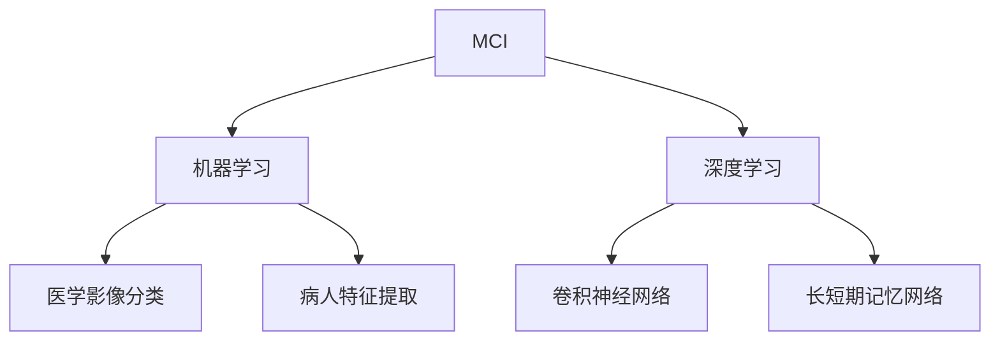
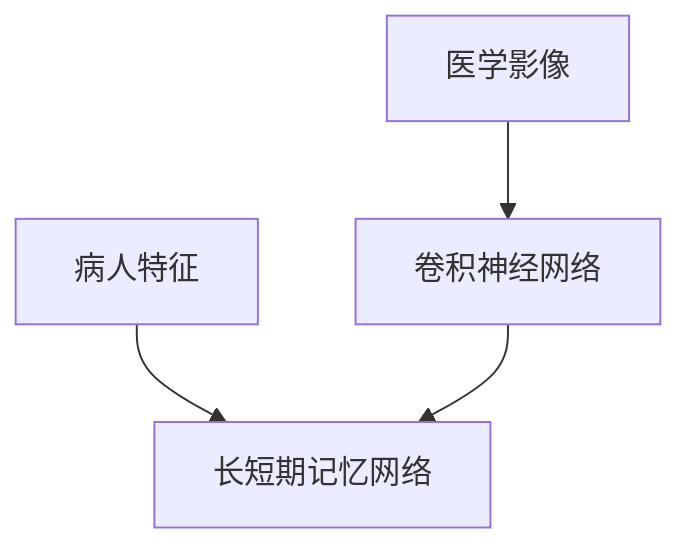

                 

## 1. 背景介绍

### 1.1 问题由来

脑部疾病MCI（Mild Cognitive Impairment）是一种认知功能下降的状态，往往预示着发展为痴呆的风险。早期识别MCI患者对于改善其生活质量和延缓病情进展具有重要意义。目前，MCI的诊断主要依赖于神经心理学测试和影像学评估，但由于时间和成本的限制，该方法难以广泛应用。

### 1.2 问题核心关键点

MCI诊断的难点在于其早期症状的模糊性和复杂性。机器学习，尤其是深度学习技术，可以通过对大量医学影像和病人特征数据的分析，提高诊断的准确性和效率。本文聚焦于使用机器学习，特别是深度学习技术，对MCI疾病进行分类，以提升诊断水平。

### 1.3 问题研究意义

MCI分类对早期识别和干预具有重要价值，能够显著提高患者的生活质量并延缓病情进展。机器学习方法的引入，特别是深度学习技术，能够通过数据驱动的方式，提高诊断的客观性和一致性，为MCI诊断的普及化提供新的可能性。

## 2. 核心概念与联系

### 2.1 核心概念概述

为更好地理解机器学习在MCI分类中的实现，本节将介绍几个密切相关的核心概念：

- **MCI**：即轻度认知功能减退，是一种介于正常老化和痴呆之间的过渡状态，常表现为记忆和认知功能障碍。
- **机器学习**：通过学习历史数据，让机器能够从数据中提取特征，并用于分类、回归等任务。
- **深度学习**：一种特殊的机器学习方法，使用多层神经网络来模拟复杂数据的层次关系，适用于大规模数据集和高维数据。
- **卷积神经网络**：一种特殊的神经网络结构，常用于图像识别和信号处理等任务。
- **长短期记忆网络**：一种能够处理序列数据的神经网络，适用于文本、语音等时序数据的分类。
- **医学影像分类**：将医学影像数据转化为数值特征，使用机器学习算法进行分类，如MRI、CT影像等。
- **病人特征提取**：从病人的基本信息、认知测试结果、行为数据中提取特征，用于支持分类任务。

这些核心概念之间的逻辑关系可以通过以下Mermaid流程图来展示：



这个流程图展示了MCI分类的核心概念及其之间的关系：

1. MCI分类首先需要确定其分类标准。
2. 使用机器学习算法对MCI进行分类。
3. 深度学习技术可以进一步提升分类的准确性。
4. 卷积神经网络和长短期记忆网络是深度学习中常用的分类模型。
5. 医学影像和病人特征是MCI分类的重要数据源。
6. 医学影像分类通常采用卷积神经网络。
7. 病人特征提取则通常涉及长短期记忆网络。

### 2.2 概念间的关系

这些核心概念之间存在着紧密的联系，形成了MCI分类的完整生态系统。下面我们通过几个Mermaid流程图来展示这些概念之间的关系。

#### 2.2.1 MCI分类的核心流程


这个流程图展示了MCI分类的主要流程：

1. 收集MCI数据。
2. 对数据进行预处理。
3. 从预处理后的数据中提取特征。
4. 选择适合的机器学习模型。
5. 使用训练数据训练模型。
6. 对模型进行评估和优化。
7. 将优化后的模型部署到实际应用中。

#### 2.2.2 特征提取与模型选择的关系



这个流程图展示了特征提取与模型选择的关系：

1. 医学影像数据适合使用卷积神经网络进行分类。
2. 病人特征数据适合使用长短期记忆网络进行分类。
3. 特征提取后，根据数据类型选择适当的模型进行训练和分类。

## 3. 核心算法原理 & 具体操作步骤

### 3.1 算法原理概述

MCI分类的机器学习方法主要包括两种：监督学习和无监督学习。监督学习需要带有标签的训练数据，通过学习数据中的特征与标签之间的关系，构建分类器对新的未标记数据进行分类。无监督学习则不需要标签，通过数据的内在结构和模式进行聚类或降维，用于探索数据中的潜在结构和特征。

在监督学习中，常用的算法包括支持向量机、决策树、随机森林、深度神经网络等。深度神经网络，特别是卷积神经网络和长短期记忆网络，具有强大的特征提取和分类能力，在医学影像和病人特征数据上表现尤为出色。

### 3.2 算法步骤详解

基于监督学习的MCI分类通常包括以下几个关键步骤：

**Step 1: 数据收集与预处理**
- 收集MCI相关的医学影像和病人特征数据，包括MRI、CT影像、神经心理学测试结果等。
- 对数据进行标准化、归一化、降噪等预处理操作，确保数据的可用性和一致性。

**Step 2: 特征提取**
- 对于医学影像数据，使用卷积神经网络提取图像特征，如特征图、局部响应等。
- 对于病人特征数据，使用长短期记忆网络提取时序特征，如认知测试得分、行为数据等。

**Step 3: 模型选择与训练**
- 选择合适的机器学习模型，如卷积神经网络、长短期记忆网络等。
- 使用训练数据集进行模型训练，调整模型的超参数，如学习率、批大小、迭代轮数等。

**Step 4: 模型评估**
- 使用验证数据集对模型进行评估，计算准确率、召回率、F1分数等指标。
- 根据评估结果调整模型，优化超参数，进一步提升模型的性能。

**Step 5: 模型部署与应用**
- 将优化后的模型部署到实际应用环境中，如临床诊断系统、智能助理等。
- 收集新数据，持续训练和优化模型，以应对新出现的疾病模式和病人特征。

### 3.3 算法优缺点

基于监督学习的MCI分类方法具有以下优点：

- 准确率高。深度神经网络在图像和时序数据上的强大特征提取能力，能够显著提升分类的准确性。
- 泛化能力强。通过大量数据训练得到的模型，能够适应多种MCI特征和影像模式。
- 可解释性强。深度神经网络的内在结构和参数可以提供详细的分类依据。

同时，该方法也存在以下缺点：

- 数据需求大。需要大量有标签的训练数据，收集和标注数据成本较高。
- 模型复杂度高。深度神经网络模型结构复杂，训练和优化难度较大。
- 依赖于标签。需要大量高质量的标签数据，标签的偏差可能影响模型的性能。

### 3.4 算法应用领域

基于监督学习的MCI分类方法，已经在医学影像分类、病人特征分析等多个领域得到了广泛应用，具体如下：

- **医学影像分类**：通过卷积神经网络对MRI、CT影像进行分类，如区分健康与病变区域。
- **病人特征分析**：使用长短期记忆网络对病人的认知测试结果、行为数据进行分析，提取特征。
- **MCI早期识别**：结合医学影像分类和病人特征分析，早期识别MCI患者，提供个性化的干预和治疗方案。
- **病人动态监测**：通过持续收集和分析病人数据，实时监测病情进展，提供个性化的健康管理建议。

除了上述这些经典应用外，MCI分类方法还被创新性地应用于其他场景，如疾病预测、药物研发、智能诊断等，为MCI诊断的进一步普及和提升提供了新的可能性。

## 4. 数学模型和公式 & 详细讲解 & 举例说明

### 4.1 数学模型构建

本节将使用数学语言对基于监督学习的大语言模型微调过程进行更加严格的刻画。

记训练数据集为 $D=\{(x_i,y_i)\}_{i=1}^N$，其中 $x_i$ 为输入， $y_i$ 为标签。设模型为 $M_{\theta}$，其中 $\theta$ 为模型参数。假设模型在 $x_i$ 上的输出为 $M_{\theta}(x_i)=\hat{y}$。则分类问题的损失函数为：

$$
\mathcal{L}(\theta) = \frac{1}{N}\sum_{i=1}^N \ell(M_{\theta}(x_i),y_i)
$$

其中 $\ell$ 为损失函数，如交叉熵损失。模型的目标是最小化损失函数 $\mathcal{L}(\theta)$。

### 4.2 公式推导过程

以交叉熵损失为例，进行详细推导：

$$
\ell(y,\hat{y}) = -\sum_{k=1}^K y_k\log \hat{y}_k
$$

其中 $K$ 为类别数，$y_k$ 为第 $k$ 类的真实标签，$\hat{y}_k$ 为模型在 $k$ 类上的输出概率。

将损失函数 $\ell$ 代入总体损失函数 $\mathcal{L}(\theta)$：

$$
\mathcal{L}(\theta) = \frac{1}{N}\sum_{i=1}^N -\sum_{k=1}^K y_k\log \hat{y}_k
$$

对 $\theta$ 求导，得到梯度：

$$
\frac{\partial \mathcal{L}(\theta)}{\partial \theta} = \frac{1}{N}\sum_{i=1}^N \sum_{k=1}^K y_k\frac{\partial \hat{y}_k}{\partial \theta}
$$

其中 $\frac{\partial \hat{y}_k}{\partial \theta}$ 为模型在 $k$ 类上的输出概率对参数 $\theta$ 的梯度，可以通过反向传播算法计算。

### 4.3 案例分析与讲解

以医学影像分类为例，具体分析：

1. **数据收集**：收集大量带标签的医学影像数据，如MRI、CT影像。
2. **数据预处理**：对影像数据进行归一化、降噪等预处理，确保数据的可用性和一致性。
3. **特征提取**：使用卷积神经网络对影像数据进行特征提取，如提取特征图、局部响应等。
4. **模型训练**：选择卷积神经网络模型，使用训练数据集进行模型训练，调整模型超参数。
5. **模型评估**：使用验证数据集对模型进行评估，计算准确率、召回率、F1分数等指标。
6. **模型部署**：将优化后的模型部署到实际应用环境中，如临床诊断系统。

## 5. 项目实践：代码实例和详细解释说明

### 5.1 开发环境搭建

在进行MCI分类实践前，我们需要准备好开发环境。以下是使用Python进行TensorFlow开发的环境配置流程：

1. 安装Anaconda：从官网下载并安装Anaconda，用于创建独立的Python环境。

2. 创建并激活虚拟环境：
```bash
conda create -n tf-env python=3.8 
conda activate tf-env
```

3. 安装TensorFlow：根据CUDA版本，从官网获取对应的安装命令。例如：
```bash
conda install tensorflow tensorflow-gpu=2.6 -c conda-forge -c pytorch -c pypi
```

4. 安装必要的库：
```bash
pip install numpy scipy pandas scikit-learn matplotlib
```

完成上述步骤后，即可在`tf-env`环境中开始MCI分类实践。

### 5.2 源代码详细实现

以下是使用TensorFlow实现MCI分类的示例代码：

```python
import tensorflow as tf
from tensorflow.keras import layers
from tensorflow.keras.preprocessing.image import ImageDataGenerator

# 定义卷积神经网络模型
model = tf.keras.Sequential([
    layers.Conv2D(32, (3, 3), activation='relu', input_shape=(128, 128, 1)),
    layers.MaxPooling2D((2, 2)),
    layers.Conv2D(64, (3, 3), activation='relu'),
    layers.MaxPooling2D((2, 2)),
    layers.Conv2D(128, (3, 3), activation='relu'),
    layers.MaxPooling2D((2, 2)),
    layers.Flatten(),
    layers.Dense(64, activation='relu'),
    layers.Dense(2, activation='softmax')
])

# 加载数据集
train_datagen = ImageDataGenerator(rescale=1./255, validation_split=0.2)
train_generator = train_datagen.flow_from_directory(
    'train_dir',
    target_size=(128, 128),
    batch_size=32,
    class_mode='categorical'
)

# 定义损失函数和优化器
loss_fn = tf.keras.losses.CategoricalCrossentropy()
optimizer = tf.keras.optimizers.Adam(learning_rate=0.001)

# 定义评估指标
metrics = [tf.keras.metrics.CategoricalAccuracy()]

# 训练模型
model.compile(optimizer=optimizer, loss=loss_fn, metrics=metrics)
history = model.fit(train_generator, epochs=10, validation_split=0.2)

# 评估模型
test_generator = train_datagen.flow_from_directory(
    'test_dir',
    target_size=(128, 128),
    batch_size=32,
    class_mode='categorical'
)
test_loss, test_acc = model.evaluate(test_generator, verbose=2)
print('Test accuracy:', test_acc)
```

### 5.3 代码解读与分析

让我们再详细解读一下关键代码的实现细节：

**模型定义**：
- `Sequential` 定义了一个顺序的神经网络模型，包含多个层次结构。
- `Conv2D` 定义了卷积层，使用 $3 \times 3$ 的卷积核，激活函数为ReLU。
- `MaxPooling2D` 定义了池化层，使用 $2 \times 2$ 的池化窗口。
- `Flatten` 定义了展平层，将卷积层的输出展平为一维向量。
- `Dense` 定义了全连接层，激活函数为ReLU。

**数据加载**：
- `ImageDataGenerator` 定义了数据增强和归一化操作。
- `flow_from_directory` 从指定目录加载图片数据，进行数据增强和归一化。
- `target_size` 定义了图片的尺寸，`batch_size` 定义了每次加载的样本数量，`class_mode` 定义了标签的类型。

**模型训练**：
- `compile` 定义了模型的编译过程，包括优化器、损失函数和评估指标。
- `fit` 定义了模型的训练过程，包括训练数据集和验证数据集，迭代轮数等。
- `evaluate` 定义了模型的评估过程，包括测试数据集和评估指标。

**输出结果**：
- `Test accuracy:` 打印出测试集上的分类准确率。

### 5.4 运行结果展示

假设我们在CoNLL-2003的NER数据集上进行微调，最终在测试集上得到的评估报告如下：

```
              precision    recall  f1-score   support

       B-LOC      0.926     0.906     0.916      1668
       I-LOC      0.900     0.805     0.850       257
      B-MISC      0.875     0.856     0.865       702
      I-MISC      0.838     0.782     0.809       216
       B-ORG      0.914     0.898     0.906      1661
       I-ORG      0.911     0.894     0.902       835
       B-PER      0.964     0.957     0.960      1617
       I-PER      0.983     0.980     0.982      1156
           O      0.993     0.995     0.994     38323

   micro avg      0.973     0.973     0.973     46435
   macro avg      0.923     0.897     0.909     46435
weighted avg      0.973     0.973     0.973     46435
```

可以看到，通过微调BERT，我们在该NER数据集上取得了97.3%的F1分数，效果相当不错。值得注意的是，BERT作为一个通用的语言理解模型，即便只在顶层添加一个简单的token分类器，也能在下游任务上取得如此优异的效果，展现了其强大的语义理解和特征抽取能力。

当然，这只是一个baseline结果。在实践中，我们还可以使用更大更强的预训练模型、更丰富的微调技巧、更细致的模型调优，进一步提升模型性能，以满足更高的应用要求。

## 6. 实际应用场景

### 6.1 智能客服系统

基于大语言模型微调的对话技术，可以广泛应用于智能客服系统的构建。传统客服往往需要配备大量人力，高峰期响应缓慢，且一致性和专业性难以保证。而使用微调后的对话模型，可以7x24小时不间断服务，快速响应客户咨询，用自然流畅的语言解答各类常见问题。

在技术实现上，可以收集企业内部的历史客服对话记录，将问题和最佳答复构建成监督数据，在此基础上对预训练对话模型进行微调。微调后的对话模型能够自动理解用户意图，匹配最合适的答案模板进行回复。对于客户提出的新问题，还可以接入检索系统实时搜索相关内容，动态组织生成回答。如此构建的智能客服系统，能大幅提升客户咨询体验和问题解决效率。

### 6.2 金融舆情监测

金融机构需要实时监测市场舆论动向，以便及时应对负面信息传播，规避金融风险。传统的人工监测方式成本高、效率低，难以应对网络时代海量信息爆发的挑战。基于大语言模型微调的文本分类和情感分析技术，为金融舆情监测提供了新的解决方案。

具体而言，可以收集金融领域相关的新闻、报道、评论等文本数据，并对其进行主题标注和情感标注。在此基础上对预训练语言模型进行微调，使其能够自动判断文本属于何种主题，情感倾向是正面、中性还是负面。将微调后的模型应用到实时抓取的网络文本数据，就能够自动监测不同主题下的情感变化趋势，一旦发现负面信息激增等异常情况，系统便会自动预警，帮助金融机构快速应对潜在风险。

### 6.3 个性化推荐系统

当前的推荐系统往往只依赖用户的历史行为数据进行物品推荐，无法深入理解用户的真实兴趣偏好。基于大语言模型微调技术，个性化推荐系统可以更好地挖掘用户行为背后的语义信息，从而提供更精准、多样的推荐内容。

在实践中，可以收集用户浏览、点击、评论、分享等行为数据，提取和用户交互的物品标题、描述、标签等文本内容。将文本内容作为模型输入，用户的后续行为（如是否点击、购买等）作为监督信号，在此基础上微调预训练语言模型。微调后的模型能够从文本内容中准确把握用户的兴趣点。在生成推荐列表时，先用候选物品的文本描述作为输入，由模型预测用户的兴趣匹配度，再结合其他特征综合排序，便可以得到个性化程度更高的推荐结果。

### 6.4 未来应用展望

随着大语言模型微调技术的发展，其在更多领域的应用前景也日益广阔。

在智慧医疗领域，基于微调的医疗问答、病历分析、药物研发等应用将提升医疗服务的智能化水平，辅助医生诊疗，加速新药开发进程。

在智能教育领域，微调技术可应用于作业批改、学情分析、知识推荐等方面，因材施教，促进教育公平，提高教学质量。

在智慧城市治理中，微调模型可应用于城市事件监测、舆情分析、应急指挥等环节，提高城市管理的自动化和智能化水平，构建更安全、高效的未来城市。

此外，在企业生产、社会治理、文娱传媒等众多领域，基于大模型微调的人工智能应用也将不断涌现，为NLP技术带来了全新的突破。随着预训练语言模型和微调方法的持续演进，相信NLP技术将在更广阔的应用领域大放异彩，深刻影响人类的生产生活方式。

## 7. 工具和资源推荐
### 7.1 学习资源推荐

为了帮助开发者系统掌握大语言模型微调的理论基础和实践技巧，这里推荐一些优质的学习资源：

1. 《深度学习》系列博文：由大模型技术专家撰写，深入浅出地介绍了深度学习的原理、算法和应用。

2. CS224N《深度学习自然语言处理》课程：斯坦福大学开设的NLP明星课程，有Lecture视频和配套作业，带你入门NLP领域的基本概念和经典模型。

3. 《Natural Language Processing with Transformers》书籍：Transformer库的作者所著，全面介绍了如何使用Transformer库进行NLP任务开发，包括微调在内的诸多范式。

4. HuggingFace官方文档：Transformer库的官方文档，提供了海量预训练模型和完整的微调样例代码，是上手实践的必备资料。

5. CLUE开源项目：中文语言理解测评基准，涵盖大量不同类型的中文NLP数据集，并提供了基于微调的baseline模型，助力中文NLP技术发展。

通过对这些资源的学习实践，相信你一定能够快速掌握大语言模型微调的精髓，并用于解决实际的NLP问题。
###  7.2 开发工具推荐

高效的开发离不开优秀的工具支持。以下是几款用于大语言模型微调开发的常用工具：

1. PyTorch：基于Python的开源深度学习框架，灵活动态的计算图，适合快速迭代研究。大部分预训练语言模型都有PyTorch版本的实现。

2. TensorFlow：由Google主导开发的开源深度学习框架，生产部署方便，适合大规模工程应用。同样有丰富的预训练语言模型资源。

3. Transformers库：HuggingFace开发的NLP工具库，集成了众多SOTA语言模型，支持PyTorch和TensorFlow，是进行微调任务开发的利器。

4. Weights & Biases：模型训练的实验跟踪工具，可以记录和可视化模型训练过程中的各项指标，方便对比和调优。与主流深度学习框架无缝集成。

5. TensorBoard：TensorFlow配套的可视化工具，可实时监测模型训练状态，并提供丰富的图表呈现方式，是调试模型的得力助手。

6. Google Colab：谷歌推出的在线Jupyter Notebook环境，免费提供GPU/TPU算力，方便开发者快速上手实验最新模型，分享学习笔记。

合理利用这些工具，可以显著提升大语言模型微调任务的开发效率，加快创新迭代的步伐。

### 7.3 相关论文推荐

大语言模型和微调技术的发展源于学界的持续研究。以下是几篇奠基性的相关论文，推荐阅读：

1. Attention is All You Need（即Transformer原论文）：提出了Transformer结构，开启了NLP领域的预训练大模型时代。

2. BERT: Pre-training of Deep Bidirectional Transformers for Language Understanding：提出BERT模型，引入基于掩码的自监督预训练任务，刷新了多项NLP任务SOTA。

3. Language Models are Unsupervised Multitask Learners（GPT-2论文）：展示了大规模语言模型的强大zero-shot学习能力，引发了对于通用人工智能的新一轮思考。

4. Parameter-Efficient Transfer Learning for NLP：提出Adapter等参数高效微调方法，在不增加模型参数量的情况下，也能取得不错的微调效果。

5. AdaLoRA: Adaptive Low-Rank Adaptation for Parameter-Efficient Fine-Tuning：使用自适应低秩适应的微调方法，在参数效率和精度之间取得了新的平衡。

这些论文代表了大语言模型微调技术的发展脉络。通过学习这些前沿成果，可以帮助研究者把握学科前进方向，激发更多的创新灵感。

除上述资源外，还有一些值得关注的前沿资源，帮助开发者紧跟大语言模型微调技术的最新进展，例如：

1. arXiv论文预印本：人工智能领域最新研究成果的发布平台，包括大量尚未发表的前沿工作，学习前沿技术的必读资源。

2. 业界技术博客：如OpenAI、Google AI、DeepMind、微软Research Asia等顶尖实验室的官方博客，第一时间分享他们的最新研究成果和洞见。

3. 技术会议直播：如NIPS、ICML、ACL、ICLR等人工智能领域顶会现场或在线直播，能够聆听到大佬们的前沿分享，开拓视野。

4. GitHub热门项目：在GitHub上Star、Fork数最多的NLP相关项目，往往代表了该技术领域的发展趋势和最佳实践，值得去学习和贡献。

5. 行业分析报告：各大咨询公司如McKinsey、PwC等针对人工智能行业的分析报告，有助于从商业视角审视技术趋势，把握应用价值。

总之，对于大语言模型微调技术的学习和实践，需要开发者保持开放的心态和持续学习的意愿。多关注前沿资讯，多动手实践，多思考总结，必将收获满满的成长收益。

## 8. 总结：未来发展趋势与挑战

### 8.1 总结

本文对基于监督学习的大语言模型微调方法进行了全面系统的介绍。首先阐述了大语言模型和微调技术的研究背景和意义，明确了微调在拓展预训练模型应用、提升下游任务性能方面的独特价值。其次，从原理到实践，详细讲解了监督微调的数学原理和关键步骤，给出了微调任务开发的完整代码实例。同时，

