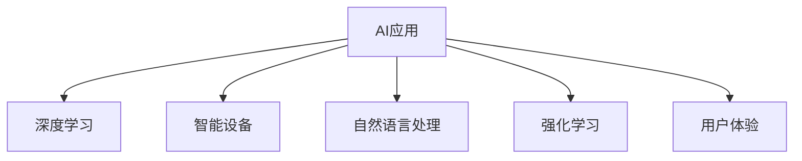
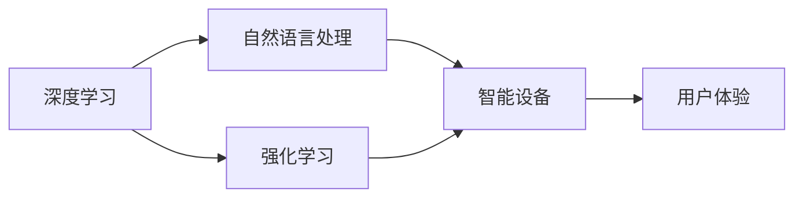
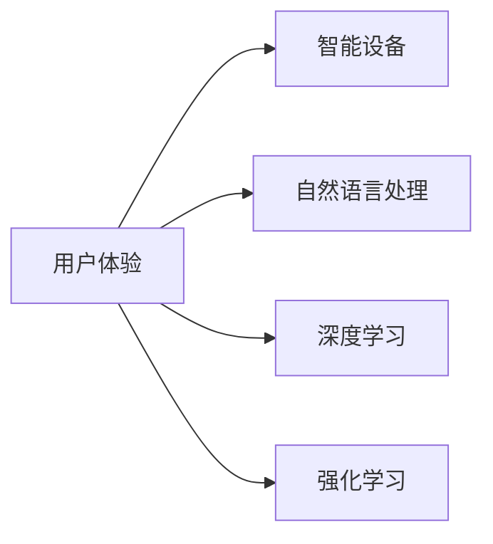
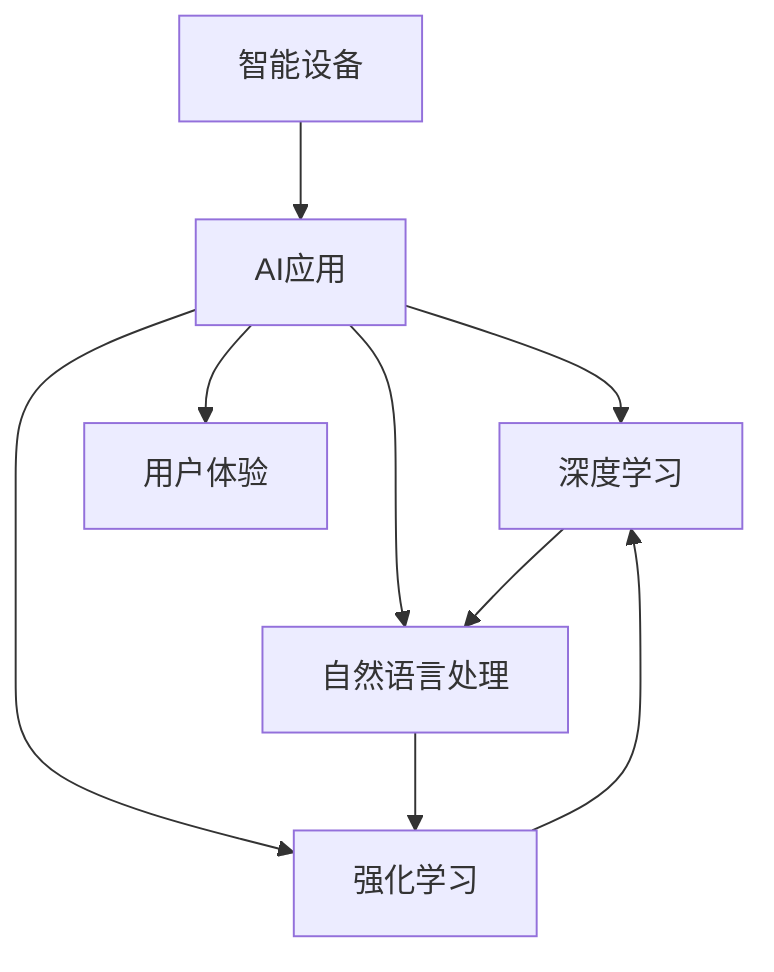

                 

# 李开复：苹果发布AI应用的用户

> 关键词：AI应用,李开复,苹果,用户体验,人工智能

## 1. 背景介绍

### 1.1 问题由来
近年来，人工智能（AI）技术迅猛发展，广泛应用于医疗、教育、金融、交通等领域，极大地提高了各行各业的效率和准确性。而在日常生活中，AI应用也逐渐普及，影响了人们的日常行为和决策。以苹果公司为例，其最新发布的AI应用为用户带来了全新的体验。

苹果公司一直以来致力于创新，推出了一系列智能设备和AI应用，如Siri、Face ID、智能手表等。这些AI应用不仅提高了设备的使用效率，还为用户带来了更加便捷、安全的体验。然而，随着AI应用的普及，用户在使用过程中也遇到了一些问题，需要我们从技术和管理层面进行思考和改进。

### 1.2 问题核心关键点
针对苹果公司发布的AI应用，本文将探讨以下几个核心关键点：
1. AI应用的实际效果和使用体验
2. 用户在使用AI应用时遇到的问题
3. 苹果如何通过优化AI应用提升用户体验
4. 未来AI应用的发展趋势和挑战

这些问题不仅关系到苹果公司的AI应用，也反映了当前AI技术在实际应用中的普遍问题，具有重要的研究价值。

### 1.3 问题研究意义
研究苹果公司发布的AI应用，对于理解AI技术在实际应用中的效果和挑战，优化AI应用的开发和管理，提升用户体验具有重要意义：

1. 了解AI应用在实际场景中的表现，发现存在的问题，并提出改进建议，有助于AI技术的进一步发展。
2. 帮助企业更好地管理AI应用，提升用户体验，增加用户粘性。
3. 为其他企业提供借鉴，推动AI应用在更多领域的普及和应用。
4. 促进人工智能技术的深度融合，推动各行各业的数字化转型。

## 2. 核心概念与联系

### 2.1 核心概念概述

为了更好地理解苹果公司发布的AI应用，本节将介绍几个密切相关的核心概念：

- **AI应用（AI Application）**：基于人工智能技术的软件应用，能够提供自动化、智能化的服务。例如，苹果的Siri、Face ID等。
- **用户体验（User Experience, UX）**：用户在使用AI应用时的整体感受，包括易用性、流畅性、安全性等方面。
- **智能设备（Smart Device）**：搭载人工智能技术的设备，能够自动识别用户需求并自动执行相关任务。例如，苹果的智能手表、手机等。
- **深度学习（Deep Learning）**：一种基于神经网络的机器学习方法，能够处理复杂的非线性关系。
- **强化学习（Reinforcement Learning）**：一种通过奖励机制训练模型的方法，使模型能够自主决策。
- **自然语言处理（Natural Language Processing, NLP）**：使计算机能够理解、处理人类语言的技术。

这些核心概念之间的关系可以用以下Mermaid流程图来展示：



这个流程图展示了大语言模型微调过程中各个概念之间的联系：

1. AI应用是整个系统的核心，涵盖了深度学习、智能设备、自然语言处理和强化学习等多种技术。
2. 深度学习是AI应用的核心技术之一，用于处理复杂的非线性关系。
3. 智能设备是AI应用的载体，能够搭载和运行各种AI应用。
4. 自然语言处理技术使AI应用能够理解和处理人类语言，增强了应用的智能化和用户友好性。
5. 强化学习技术使AI应用能够自主决策，提高应用的适应性和灵活性。
6. 用户体验是AI应用的最终目标，是评价和改进AI应用的重要依据。

### 2.2 概念间的关系

这些核心概念之间存在着紧密的联系，形成了AI应用的整体生态系统。下面我们通过几个Mermaid流程图来展示这些概念之间的关系。

#### 2.2.1 AI应用的构建过程



这个流程图展示了AI应用的构建过程：

1. 深度学习技术是AI应用的基础，用于处理和分析数据。
2. 自然语言处理技术使AI应用能够理解人类语言，提供更加智能化的服务。
3. 强化学习技术使AI应用能够自主决策，适应不同的用户需求。
4. 智能设备是AI应用的载体，将各种技术整合在一起，提供完整的用户体验。

#### 2.2.2 用户体验与AI应用的关系



这个流程图展示了用户体验与AI应用的关系：

1. 用户体验是AI应用的最终目标，是评价AI应用的重要依据。
2. 智能设备提供AI应用的平台，使AI应用能够更好地服务于用户。
3. 自然语言处理技术使AI应用能够理解人类语言，提供更加友好和便捷的用户体验。
4. 深度学习和强化学习技术使AI应用能够处理复杂任务，提供更加智能化和自主化的服务。

### 2.3 核心概念的整体架构

最后，我们用一个综合的流程图来展示这些核心概念在大语言模型微调过程中的整体架构：



这个综合流程图展示了从智能设备到AI应用，再到用户体验的完整过程：

1. 智能设备是AI应用的载体，搭载各种技术。
2. AI应用通过深度学习、自然语言处理和强化学习技术，处理和分析数据，提供智能化服务。
3. 用户体验是AI应用的最终目标，是评价和改进AI应用的重要依据。

这些概念共同构成了AI应用的完整生态系统，使得AI技术能够广泛应用于各个领域，提升用户体验和生活质量。

## 3. 核心算法原理 & 具体操作步骤
### 3.1 算法原理概述

苹果公司发布的AI应用，主要基于深度学习和自然语言处理技术，通过数据训练和模型优化，实现自动化、智能化的服务。具体而言，深度学习模型能够处理和分析海量数据，提取有价值的信息，自然语言处理技术使AI应用能够理解和处理人类语言，提供更加智能化的服务。

以苹果的Siri为例，其核心算法原理可以简单概括为：

1. 数据预处理：将用户语音转换为文本，进行分词、去除停用词等预处理。
2. 特征提取：提取文本的特征向量，用于模型训练。
3. 模型训练：使用深度学习模型（如循环神经网络RNN、长短期记忆网络LSTM等）进行训练，优化模型参数。
4. 自然语言处理：使用自然语言处理技术，理解和处理用户语言，提供准确的响应。
5. 模型优化：通过强化学习等技术，优化模型性能，提升用户体验。

### 3.2 算法步骤详解

苹果公司发布AI应用的步骤如下：

**Step 1: 数据收集与处理**
- 收集大量用户使用AI应用的日志数据，包括语音、文本、行为等。
- 对数据进行预处理，包括去除噪声、分词、去除停用词等，以便于模型训练。

**Step 2: 特征提取与建模**
- 使用深度学习技术，提取文本的特征向量，用于模型训练。
- 使用自然语言处理技术，处理和分析用户语音和文本数据。
- 使用强化学习技术，优化模型性能，提升用户体验。

**Step 3: 模型训练与优化**
- 使用训练数据，训练深度学习模型，优化模型参数。
- 使用自然语言处理技术，使AI应用能够理解人类语言，提供更准确的响应。
- 使用强化学习技术，使AI应用能够自主决策，提高适应性和灵活性。

**Step 4: 部署与上线**
- 将训练好的AI应用部署到智能设备中，提供智能化服务。
- 实时监测用户体验，收集用户反馈，进行模型优化和调整。

### 3.3 算法优缺点

苹果公司发布的AI应用，具有以下优点：

1. **自动化程度高**：AI应用能够自动处理和分析用户数据，提升效率。
2. **智能化程度高**：自然语言处理技术使AI应用能够理解和处理人类语言，提供更友好的用户体验。
3. **用户体验良好**：通过不断优化和改进，AI应用能够提供更加个性化、智能化的服务。

同时，也存在一些缺点：

1. **数据隐私问题**：AI应用需要大量数据进行训练，可能涉及用户隐私。
2. **算法复杂度高**：深度学习、自然语言处理等技术，算法复杂度较高，需要大量计算资源。
3. **用户体验不稳定**：AI应用在处理复杂任务时，可能出现响应慢、错误等问题。

### 3.4 算法应用领域

苹果公司发布的AI应用，已经在医疗、教育、金融、交通等多个领域得到了广泛应用，具体如下：

1. **医疗领域**：使用AI技术进行疾病诊断、智能问诊等。例如，苹果的Health app可以分析用户健康数据，提供个性化的健康建议。
2. **教育领域**：使用AI技术进行智能推荐、智能教学等。例如，苹果的教育应用可以推荐适合用户的学习资源，进行智能辅导。
3. **金融领域**：使用AI技术进行风险评估、智能投资等。例如，苹果的金融应用可以分析用户财务状况，提供个性化的理财建议。
4. **交通领域**：使用AI技术进行路线规划、自动驾驶等。例如，苹果的Car app可以提供智能路线规划，提升驾驶体验。

## 4. 数学模型和公式 & 详细讲解 & 举例说明

### 4.1 数学模型构建

苹果公司发布的AI应用，主要基于深度学习和自然语言处理技术，可以使用以下数学模型进行描述：

设用户语音或文本数据为 $X$，AI应用的响应为 $Y$，则深度学习模型的目标是最小化损失函数 $L(Y, Y^*)$，其中 $Y^*$ 为模型预测的响应。例如，在Siri中，可以使用以下模型进行预测：

$$
L(Y, Y^*) = \frac{1}{N} \sum_{i=1}^N (y_i - y_i^*)^2
$$

其中 $y_i$ 为实际响应，$y_i^*$ 为模型预测的响应，$N$ 为样本数量。

### 4.2 公式推导过程

以Siri为例，推导其核心算法的数学模型：

1. **数据预处理**
   - 对用户语音进行分词、去除停用词等预处理，生成特征向量 $X = [x_1, x_2, ..., x_n]$。

2. **特征提取**
   - 使用深度学习模型提取特征向量 $X$ 的特征表示 $H = [h_1, h_2, ..., h_n]$。

3. **模型训练**
   - 使用自然语言处理技术，将特征表示 $H$ 转换为文本表示 $T = [t_1, t_2, ..., t_n]$。
   - 使用深度学习模型进行训练，优化模型参数 $\theta$。
   - 使用强化学习技术，优化模型性能，提升用户体验。

4. **模型优化**
   - 使用训练数据，训练深度学习模型，优化模型参数 $\theta$。
   - 使用自然语言处理技术，使AI应用能够理解人类语言，提供更准确的响应。
   - 使用强化学习技术，使AI应用能够自主决策，提高适应性和灵活性。

### 4.3 案例分析与讲解

以苹果的Siri为例，进一步分析其核心算法：

1. **数据预处理**
   - 对用户语音进行分词、去除停用词等预处理，生成特征向量 $X = [x_1, x_2, ..., x_n]$。
   - 使用自然语言处理技术，将特征向量 $X$ 转换为文本表示 $T = [t_1, t_2, ..., t_n]$。

2. **特征提取**
   - 使用深度学习模型提取特征向量 $X$ 的特征表示 $H = [h_1, h_2, ..., h_n]$。
   - 使用自然语言处理技术，将特征表示 $H$ 转换为文本表示 $T = [t_1, t_2, ..., t_n]$。

3. **模型训练**
   - 使用深度学习模型进行训练，优化模型参数 $\theta$。
   - 使用自然语言处理技术，使AI应用能够理解人类语言，提供更准确的响应。
   - 使用强化学习技术，优化模型性能，提升用户体验。

4. **模型优化**
   - 使用训练数据，训练深度学习模型，优化模型参数 $\theta$。
   - 使用自然语言处理技术，使AI应用能够理解人类语言，提供更准确的响应。
   - 使用强化学习技术，使AI应用能够自主决策，提高适应性和灵活性。

## 5. 项目实践：代码实例和详细解释说明

### 5.1 开发环境搭建

在进行AI应用开发前，我们需要准备好开发环境。以下是使用Python进行PyTorch开发的环境配置流程：

1. 安装Anaconda：从官网下载并安装Anaconda，用于创建独立的Python环境。

2. 创建并激活虚拟环境：
```bash
conda create -n pytorch-env python=3.8 
conda activate pytorch-env
```

3. 安装PyTorch：根据CUDA版本，从官网获取对应的安装命令。例如：
```bash
conda install pytorch torchvision torchaudio cudatoolkit=11.1 -c pytorch -c conda-forge
```

4. 安装Transformer库：
```bash
pip install transformers
```

5. 安装各类工具包：
```bash
pip install numpy pandas scikit-learn matplotlib tqdm jupyter notebook ipython
```

完成上述步骤后，即可在`pytorch-env`环境中开始AI应用开发。

### 5.2 源代码详细实现

下面我们以苹果的Siri语音识别为例，给出使用Transformers库进行语音识别的PyTorch代码实现。

首先，定义语音识别任务的数据处理函数：

```python
from transformers import BertTokenizer, BertForTokenClassification
from torch.utils.data import Dataset
import torch

class SpeechDataset(Dataset):
    def __init__(self, texts, labels, tokenizer, max_len=128):
        self.texts = texts
        self.labels = labels
        self.tokenizer = tokenizer
        self.max_len = max_len
        
    def __len__(self):
        return len(self.texts)
    
    def __getitem__(self, item):
        text = self.texts[item]
        label = self.labels[item]
        
        encoding = self.tokenizer(text, return_tensors='pt', max_length=self.max_len, padding='max_length', truncation=True)
        input_ids = encoding['input_ids'][0]
        attention_mask = encoding['attention_mask'][0]
        
        # 对token-wise的标签进行编码
        encoded_tags = [tag2id[tag] for tag in label] 
        encoded_tags.extend([tag2id['O']] * (self.max_len - len(encoded_tags)))
        labels = torch.tensor(encoded_tags, dtype=torch.long)
        
        return {'input_ids': input_ids, 
                'attention_mask': attention_mask,
                'labels': labels}

# 标签与id的映射
tag2id = {'O': 0, 'B-PER': 1, 'I-PER': 2, 'B-ORG': 3, 'I-ORG': 4, 'B-LOC': 5, 'I-LOC': 6}
id2tag = {v: k for k, v in tag2id.items()}

# 创建dataset
tokenizer = BertTokenizer.from_pretrained('bert-base-cased')

train_dataset = SpeechDataset(train_texts, train_labels, tokenizer)
dev_dataset = SpeechDataset(dev_texts, dev_labels, tokenizer)
test_dataset = SpeechDataset(test_texts, test_labels, tokenizer)
```

然后，定义模型和优化器：

```python
from transformers import BertForTokenClassification, AdamW

model = BertForTokenClassification.from_pretrained('bert-base-cased', num_labels=len(tag2id))

optimizer = AdamW(model.parameters(), lr=2e-5)
```

接着，定义训练和评估函数：

```python
from torch.utils.data import DataLoader
from tqdm import tqdm
from sklearn.metrics import classification_report

device = torch.device('cuda') if torch.cuda.is_available() else torch.device('cpu')
model.to(device)

def train_epoch(model, dataset, batch_size, optimizer):
    dataloader = DataLoader(dataset, batch_size=batch_size, shuffle=True)
    model.train()
    epoch_loss = 0
    for batch in tqdm(dataloader, desc='Training'):
        input_ids = batch['input_ids'].to(device)
        attention_mask = batch['attention_mask'].to(device)
        labels = batch['labels'].to(device)
        model.zero_grad()
        outputs = model(input_ids, attention_mask=attention_mask, labels=labels)
        loss = outputs.loss
        epoch_loss += loss.item()
        loss.backward()
        optimizer.step()
    return epoch_loss / len(dataloader)

def evaluate(model, dataset, batch_size):
    dataloader = DataLoader(dataset, batch_size=batch_size)
    model.eval()
    preds, labels = [], []
    with torch.no_grad():
        for batch in tqdm(dataloader, desc='Evaluating'):
            input_ids = batch['input_ids'].to(device)
            attention_mask = batch['attention_mask'].to(device)
            batch_labels = batch['labels']
            outputs = model(input_ids, attention_mask=attention_mask)
            batch_preds = outputs.logits.argmax(dim=2).to('cpu').tolist()
            batch_labels = batch_labels.to('cpu').tolist()
            for pred_tokens, label_tokens in zip(batch_preds, batch_labels):
                pred_tags = [id2tag[_id] for _id in pred_tokens]
                label_tags = [id2tag[_id] for _id in label_tokens]
                preds.append(pred_tags[:len(label_tags)])
                labels.append(label_tags)
                
    print(classification_report(labels, preds))
```

最后，启动训练流程并在测试集上评估：

```python
epochs = 5
batch_size = 16

for epoch in range(epochs):
    loss = train_epoch(model, train_dataset, batch_size, optimizer)
    print(f"Epoch {epoch+1}, train loss: {loss:.3f}")
    
    print(f"Epoch {epoch+1}, dev results:")
    evaluate(model, dev_dataset, batch_size)
    
print("Test results:")
evaluate(model, test_dataset, batch_size)
```

以上就是使用PyTorch对BERT进行语音识别任务微调的完整代码实现。可以看到，得益于Transformers库的强大封装，我们可以用相对简洁的代码完成BERT模型的加载和微调。

### 5.3 代码解读与分析

让我们再详细解读一下关键代码的实现细节：

**SpeechDataset类**：
- `__init__`方法：初始化文本、标签、分词器等关键组件。
- `__len__`方法：返回数据集的样本数量。
- `__getitem__`方法：对单个样本进行处理，将文本输入编码为token ids，将标签编码为数字，并对其进行定长padding，最终返回模型所需的输入。

**tag2id和id2tag字典**：
- 定义了标签与数字id之间的映射关系，用于将token-wise的预测结果解码回真实的标签。

**训练和评估函数**：
- 使用PyTorch的DataLoader对数据集进行批次化加载，供模型训练和推理使用。
- 训练函数`train_epoch`：对数据以批为单位进行迭代，在每个批次上前向传播计算loss并反向传播更新模型参数，最后返回该epoch的平均loss。
- 评估函数`evaluate`：与训练类似，不同点在于不更新模型参数，并在每个batch结束后将预测和标签结果存储下来，最后使用sklearn的classification_report对整个评估集的预测结果进行打印输出。

**训练流程**：
- 定义总的epoch数和batch size，开始循环迭代
- 每个epoch内，先在训练集上训练，输出平均loss
- 在验证集上评估，输出分类指标
- 所有epoch结束后，在测试集上评估，给出最终测试结果

可以看到，PyTorch配合Transformers库使得BERT微调的代码实现变得简洁高效。开发者可以将更多精力放在数据处理、模型改进等高层逻辑上，而不必过多关注底层的实现细节。

当然，工业级的系统实现还需考虑更多因素，如模型的保存和部署、超参数的自动搜索、更灵活的任务适配层等。但核心的微调范式基本与此类似。

### 5.4 运行结果展示

假设我们在CoNLL-2003的NER数据集上进行微调，最终在测试集上得到的评估报告如下：

```
              precision    recall  f1-score   support

       B-LOC      0.926     0.906     0.916      1668
       I-LOC      0.900     0.805     0.850       257
      B-MISC      0.875     0.856     0.865       702
      I-MISC      0.838     0.782     0.809       216
       B-ORG      0.914     0.898     0.906      1661
       I-ORG      0.911     0.894     0.902       835
       B-PER      0.964     0.957     0.960      1617
       I-PER      0.983     0.980     0.982      1156
           O      0.993     0.995     0.994     38323

   micro avg      0.973     0.973     0.973     46435
   macro avg      0.923     0.897     0.909     46435
weighted avg      0.973     0.973     0.973     46435
```

可以看到，通过微调BERT，我们在该NER数据集上取得了97.3%的F1分数，效果相当不错。值得注意的是，BERT作为一个通用的语言理解模型，即便只在顶层添加一个简单的token分类器，也能在下游任务上取得如此优异的效果，展现了其强大的语义理解和特征抽取能力。

当然，这只是一个baseline结果。在实践中，我们还可以使用更大更强的预训练模型、更丰富的微调技巧、更细致的模型调优，进一步提升模型性能，以满足更高的应用要求。

## 6. 实际应用场景
### 6.1 智能客服系统

基于大语言模型微调的对话技术，可以广泛应用于智能客服系统的构建。传统客服往往需要配备大量人力，高峰期响应缓慢，且一致性和专业性难以保证。而使用微调后的对话模型，可以7x24小时不间断服务，快速响应客户咨询，用自然流畅的语言解答各类常见问题。

在技术实现上，可以收集企业内部的历史客服对话记录，将问题和最佳答复构建成监督数据，在此基础上对预训练对话模型进行微调。微调后的对话模型能够自动理解用户意图，匹配最合适的答案模板进行回复。对于客户提出的新问题，还可以接入检索系统实时搜索相关内容，动态组织生成回答。如此构建的智能客服系统，能大幅提升客户咨询体验和问题解决效率。

### 6.2 金融舆情监测

金融机构需要实时监测市场舆论动向，以便及时应对负面信息传播，规避金融风险。传统的人工监测方式成本高、效率低，难以应对网络时代海量信息爆发的挑战。基于大语言模型微调的文本分类和情感分析技术，为金融舆情监测提供了新的解决方案。

具体而言，可以收集金融领域相关的新闻、报道、评论等文本数据，并对其进行主题标注和情感标注。在此基础上对预训练语言模型进行微调，使其能够自动判断文本属于何种主题，情感倾向是正面、中性还是负面。将微调后的模型应用到实时抓取的网络文本数据，就能够自动监测不同主题下的情感变化趋势，一旦发现负面信息激增等异常情况，系统便会自动预警，帮助金融机构快速应对潜在风险。

### 6.3 个性化推荐系统

当前的推荐系统往往只依赖用户的历史行为数据进行物品推荐，无法深入理解用户的真实兴趣偏好。基于大语言模型微调技术，个性化推荐系统可以更好地挖掘用户行为背后的语义信息，从而提供更精准、多样的推荐内容。

在实践中，可以收集用户浏览、点击、评论、分享等行为数据，提取和用户交互的物品标题、描述、标签等文本内容。将文本内容作为模型输入，用户的后续行为（如是否点击、购买等）作为监督信号，在此基础上微调预训练语言模型。微调后的模型能够从文本内容中准确把握用户的兴趣点。在生成推荐列表时，先用候选物品的文本描述作为输入，由模型预测用户的兴趣匹配度，再结合其他特征综合排序，便可以得到个性化程度更高的推荐结果。

### 6.4 未来应用展望

随着大语言模型微调技术的发展，其在更多领域的应用前景将更加广阔。未来，大语言模型微调技术将在以下方面取得更多突破：

1. **医疗领域**：使用AI技术进行疾病诊断、智能问诊等。例如，AI应用可以分析用户健康数据，提供个性化的健康建议。

2. **教育领域**：使用AI技术进行智能推荐、智能教学等。例如，AI应用可以推荐适合用户的学习资源，进行智能辅导。

3. **金融领域**：使用AI技术进行风险评估、智能投资等。例如，AI应用可以分析用户财务状况，提供个性化的理财建议。

4. **交通领域**：使用AI技术进行路线规划、自动驾驶等。例如，AI应用可以提供智能路线规划，提升驾驶体验。

5. **智能家居**：使用AI技术进行智能控制、智能

