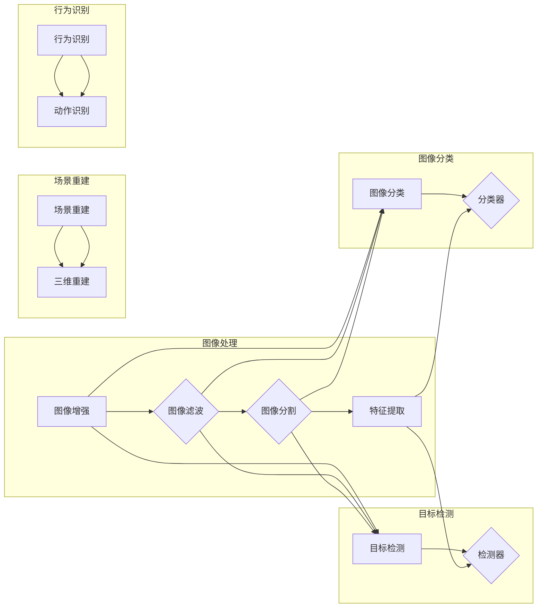

# 计算机视觉(Computer Vision) - 原理与代码实例讲解

作者：禅与计算机程序设计艺术 / Zen and the Art of Computer Programming

## 1. 背景介绍
### 1.1 问题的由来

计算机视觉是人工智能领域的一个重要分支，它致力于让计算机像人类一样“看”世界，理解图像和视频中的内容。随着图像和视频数据的爆炸式增长，计算机视觉技术在众多领域得到了广泛应用，如安防监控、无人驾驶、医疗诊断、工业检测等。本文将深入浅出地介绍计算机视觉的基本原理、常用算法以及代码实例，帮助读者快速掌握这一领域的知识。

### 1.2 研究现状

计算机视觉研究起源于20世纪60年代，历经几十年的发展，已经取得了显著的成果。目前，计算机视觉技术主要包括以下几个方向：

- **图像处理**：对图像进行增强、滤波、分割、特征提取等操作，以提取图像中的有用信息。
- **目标检测**：在图像或视频中定位和识别感兴趣的目标。
- **图像分类**：将图像或视频中的内容分类到预定义的类别中。
- **场景重建**：从图像或视频中重建场景的三维信息。
- **行为识别**：分析图像或视频中的动作和事件。

随着深度学习技术的快速发展，计算机视觉领域也取得了突破性的进展。以卷积神经网络(CNN)为代表的深度学习模型，在图像分类、目标检测、姿态估计等任务上取得了SOTA性能。

### 1.3 研究意义

计算机视觉技术在众多领域具有广泛的应用价值，如：

- **安防监控**：实时监控公共场所，识别可疑人员或事件。
- **无人驾驶**：实现自动驾驶车辆，提高道路安全性。
- **医疗诊断**：辅助医生进行疾病诊断，提高诊断准确率。
- **工业检测**：自动检测产品质量，提高生产效率。
- **智能交互**：实现人机交互，提高用户体验。

### 1.4 本文结构

本文将分为以下几个部分：

- 第2部分：介绍计算机视觉的核心概念和联系。
- 第3部分：详细讲解计算机视觉的常用算法及其具体操作步骤。
- 第4部分：介绍计算机视觉中的数学模型和公式，并结合实例进行讲解。
- 第5部分：给出计算机视觉的代码实例，并对关键代码进行解读。
- 第6部分：探讨计算机视觉在实际应用场景中的案例。
- 第7部分：推荐计算机视觉相关的学习资源、开发工具和参考文献。
- 第8部分：总结计算机视觉的未来发展趋势与挑战。
- 第9部分：附录，常见问题与解答。

## 2. 核心概念与联系

为更好地理解计算机视觉的基本原理，本节将介绍一些核心概念及其相互关系。

### 2.1 图像与视频

- **图像**：由像素组成的二维数组，用于表示场景中的信息。
- **视频**：连续的图像序列，用于表示场景的动态变化。

### 2.2 图像处理

- **图像增强**：提高图像质量，使其更容易处理。
- **图像滤波**：去除图像噪声，平滑图像表面。
- **图像分割**：将图像分割成若干个区域，以便进行后续处理。
- **特征提取**：从图像中提取有用的信息，如边缘、角点等。

### 2.3 目标检测

- **目标检测**：在图像或视频中定位和识别感兴趣的目标。
- **检测器**：用于检测目标的位置和类别的算法。

### 2.4 图像分类

- **图像分类**：将图像或视频中的内容分类到预定义的类别中。
- **分类器**：用于分类图像或视频内容的算法。

### 2.5 场景重建

- **场景重建**：从图像或视频中重建场景的三维信息。
- **三维重建**：从二维图像或视频中恢复场景的三维结构。

### 2.6 行为识别

- **行为识别**：分析图像或视频中的动作和事件。
- **动作识别**：识别视频中的动作类型。

这些概念之间的关系可以用以下Mermaid流程图表示：



可以看出，图像处理、目标检测、图像分类、场景重建和行为识别是计算机视觉的几个主要研究方向，它们之间相互关联，共同构成了计算机视觉的体系结构。

## 3. 核心算法原理 & 具体操作步骤
### 3.1 算法原理概述

计算机视觉的算法主要包括以下几个方向：

- **图像处理算法**：包括图像增强、图像滤波、图像分割和特征提取等。
- **目标检测算法**：包括传统的目标检测算法和深度学习目标检测算法。
- **图像分类算法**：包括传统的图像分类算法和深度学习图像分类算法。
- **场景重建算法**：包括基于单目视觉和双目视觉的场景重建算法。
- **行为识别算法**：包括基于视频序列的行为识别算法。

### 3.2 算法步骤详解

以下将详细介绍一些常见计算机视觉算法的具体操作步骤。

#### 3.2.1 图像增强

图像增强的目的是提高图像质量，使其更容易处理。常见的图像增强方法包括：

- **对比度增强**：提高图像的对比度，使图像中的细节更加清晰。
- **亮度增强**：调整图像的亮度，使图像更加明亮或暗淡。
- **颜色增强**：调整图像的颜色，使图像更加自然。
- **锐化**：增强图像的边缘，使图像更加清晰。

#### 3.2.2 图像滤波

图像滤波的目的是去除图像噪声，平滑图像表面。常见的图像滤波方法包括：

- **均值滤波**：将邻域内的像素值取平均值，得到平滑后的像素值。
- **高斯滤波**：使用高斯函数加权邻域内的像素值，得到平滑后的像素值。
- **中值滤波**：将邻域内的像素值排序，取中间值作为平滑后的像素值。

#### 3.2.3 图像分割

图像分割的目的是将图像分割成若干个区域，以便进行后续处理。常见的图像分割方法包括：

- **阈值分割**：将图像灰度值大于某个阈值的像素划分为前景，小于阈值的像素划分为背景。
- **区域生长**：从某个初始区域开始，逐步扩展到相邻区域，形成分割区域。
- **边缘检测**：检测图像中的边缘，从而分割图像。

#### 3.2.4 特征提取

特征提取的目的是从图像中提取有用的信息，如边缘、角点等。常见的特征提取方法包括：

- **SIFT(Scale-Invariant Feature Transform)**：一种尺度不变特征提取算法。
- **SURF(Speeded Up Robust Features)**：一种快速鲁棒特征提取算法。
- **ORB(Oriented FAST and Rotated BRIEF)**：一种快速旋转不变特征提取算法。

#### 3.2.5 目标检测

目标检测的目的是在图像或视频中定位和识别感兴趣的目标。常见的目标检测方法包括：

- **基于传统方法的目标检测**：如Haar特征、HOG(Histogram of Oriented Gradients)特征等。
- **基于深度学习的目标检测**：如Faster R-CNN、SSD(Single Shot MultiBox Detector)、YOLO(You Only Look Once)等。

#### 3.2.6 图像分类

图像分类的目的是将图像或视频中的内容分类到预定义的类别中。常见的图像分类方法包括：

- **基于传统方法的目标分类**：如基于SVM(Support Vector Machine)的分类器、基于朴素贝叶斯分类器等。
- **基于深度学习的图像分类**：如AlexNet、VGGNet、ResNet等。

#### 3.2.7 场景重建

场景重建的目的是从图像或视频中重建场景的三维信息。常见的场景重建方法包括：

- **基于单目视觉的场景重建**：如基于单目立体视觉、基于单目深度估计等。
- **基于双目视觉的场景重建**：如基于立体匹配、基于深度学习等。

#### 3.2.8 行为识别

行为识别的目的是分析图像或视频中的动作和事件。常见的动作识别方法包括：

- **基于规则的动作识别**：如基于动作轨迹、基于人体姿态等。
- **基于深度学习的动作识别**：如基于卷积神经网络、基于循环神经网络等。

### 3.3 算法优缺点

每种算法都有其优缺点，以下列举一些常见算法的优缺点：

- **图像处理算法**：
    - 优点：简单易实现，对硬件要求低。
    - 缺点：效果有限，难以处理复杂的场景。

- **目标检测算法**：
    - 优点：能够实时检测目标，对实时性要求较高的场景适用。
    - 缺点：对光照、遮挡等条件敏感，难以检测小目标。

- **图像分类算法**：
    - 优点：对复杂场景具有良好的鲁棒性。
    - 缺点：需要大量标注数据，计算复杂度高。

- **场景重建算法**：
    - 优点：能够重建场景的三维信息，对虚拟现实等应用具有重要意义。
    - 缺点：对光照、遮挡等条件敏感，难以重建动态场景。

- **行为识别算法**：
    - 优点：能够识别和分析人类行为，对智能监控、人机交互等应用具有重要意义。
    - 缺点：对动作的复杂程度和持续时间敏感，难以识别复杂动作。

### 3.4 算法应用领域

计算机视觉算法在各个领域都有广泛的应用，以下列举一些常见应用领域：

- **安防监控**：人脸识别、行为识别、异常检测等。
- **无人驾驶**：车道线检测、车辆检测、障碍物检测等。
- **医疗诊断**：病变检测、疾病诊断、手术辅助等。
- **工业检测**：缺陷检测、质量检测、生产监控等。
- **智能交互**：手势识别、表情识别、姿态估计等。

## 4. 数学模型和公式 & 详细讲解 & 举例说明
### 4.1 数学模型构建

计算机视觉中的数学模型主要包括以下几种：

- **图像处理模型**：如图像滤波、边缘检测等。
- **目标检测模型**：如Faster R-CNN、SSD、YOLO等。
- **图像分类模型**：如AlexNet、VGGNet、ResNet等。
- **场景重建模型**：如单目深度估计、双目立体匹配等。
- **行为识别模型**：如循环神经网络、卷积神经网络等。

### 4.2 公式推导过程

以下将详细介绍一些常见计算机视觉数学模型的公式推导过程。

#### 4.2.1 图像滤波

以高斯滤波为例，其公式如下：

$$
f(x,y) = \frac{1}{2\pi \sigma^2} \int_{-\infty}^{\infty} \int_{-\infty}^{\infty} g(x-u,y-v) \cdot I(u,v) \, du \, dv
$$

其中，$g(x,y)$ 是高斯核函数，$I(x,y)$ 是输入图像，$f(x,y)$ 是滤波后的图像。

#### 4.2.2 目标检测

以Faster R-CNN为例，其核心思想是使用Region Proposal Network(RPN)生成候选区域，然后使用Fast R-CNN对候选区域进行分类和位置回归。以下是Faster R-CNN的损失函数：

$$
L = L_{cls} + L_{box} + L_{rpn}
$$

其中，$L_{cls}$ 是分类损失，$L_{box}$ 是位置回归损失，$L_{rpn}$ 是RPN损失。

#### 4.2.3 图像分类

以AlexNet为例，其公式如下：

$$
y = \sigma(W_{L} \cdot f_{L-1} + b_{L})
$$

其中，$y$ 是输出，$W_{L}$ 是权重矩阵，$f_{L-1}$ 是输入，$b_{L}$ 是偏置项，$\sigma$ 是非线性激活函数。

#### 4.2.4 场景重建

以单目深度估计为例，其公式如下：

$$
D(x) = \frac{f_{x} \cdot f_{x}}{f_{x} - x_{x}}
$$

其中，$D(x)$ 是深度，$f_{x}$ 是焦距，$x_{x}$ 是图像坐标。

#### 4.2.5 行为识别

以循环神经网络(RNN)为例，其公式如下：

$$
h_t = \sigma(W_{h} \cdot h_{t-1} + W_{x} \cdot x_t + b_{h})
$$

其中，$h_t$ 是隐藏状态，$W_{h}$ 是权重矩阵，$h_{t-1}$ 是前一个时间步的隐藏状态，$x_t$ 是输入，$b_{h}$ 是偏置项，$\sigma$ 是非线性激活函数。

### 4.3 案例分析与讲解

以下将以Faster R-CNN为例，讲解目标检测算法的原理和应用。

Faster R-CNN是一种基于深度学习的目标检测算法，其核心思想是使用Region Proposal Network(RPN)生成候选区域，然后使用Fast R-CNN对候选区域进行分类和位置回归。

#### 4.3.1 RPN

RPN是一种基于锚点(Anchor)的目标检测方法。它通过在图像上生成一系列预设的锚点，并根据锚点与背景的相似度进行分类，从而得到候选区域。

#### 4.3.2 Fast R-CNN

Fast R-CNN在RPN生成的候选区域上进行目标检测。它首先对候选区域进行特征提取，然后使用Region of Interest(ROI Pooling)将特征映射到固定大小的特征图上，最后使用卷积神经网络进行分类和位置回归。

#### 4.3.3 案例分析

假设有一个包含一张图像和对应的标签的样本。首先，RPN会生成一系列锚点，并根据锚点与背景的相似度进行分类，得到候选区域。然后，Fast R-CNN会对候选区域进行特征提取，并使用ROI Pooling将特征映射到固定大小的特征图上。最后，Fast R-CNN会使用卷积神经网络对特征图进行分类和位置回归，得到最终的检测结果。

### 4.4 常见问题解答

**Q1：如何选择合适的图像滤波方法？**

A：选择合适的图像滤波方法取决于具体的应用场景。例如，对于去除噪声的场景，可以使用高斯滤波；对于边缘检测的场景，可以使用Sobel算子。

**Q2：如何选择合适的特征提取方法？**

A：选择合适的特征提取方法取决于具体的应用场景。例如，对于目标检测的场景，可以使用Haar特征；对于图像分类的场景，可以使用卷积神经网络。

**Q3：如何选择合适的目标检测算法？**

A：选择合适的目标检测算法取决于具体的应用场景。例如，对于实时性要求较高的场景，可以使用SSD；对于需要高精度的场景，可以使用Faster R-CNN。

## 5. 项目实践：代码实例和详细解释说明
### 5.1 开发环境搭建

在进行计算机视觉项目实践之前，我们需要准备好开发环境。以下是使用Python进行计算机视觉项目开发的常用环境配置步骤：

1. 安装Anaconda：从官网下载并安装Anaconda，用于创建独立的Python环境。

2. 创建并激活虚拟环境：
```bash
conda create -n cv-env python=3.8
conda activate cv-env
```

3. 安装深度学习框架：
```bash
conda install torch torchvision torchaudio -c pytorch -c conda-forge
```

4. 安装OpenCV库：
```bash
pip install opencv-python
```

5. 安装其他常用库：
```bash
pip install numpy matplotlib pandas scikit-learn
```

完成上述步骤后，即可在`cv-env`环境中开始计算机视觉项目实践。

### 5.2 源代码详细实现

以下将使用Python和PyTorch实现一个简单的目标检测项目，使用Faster R-CNN算法对图像中的目标进行检测。

#### 5.2.1 数据集

首先，我们需要准备一个包含图像和标签的目标检测数据集。这里以COCO数据集为例。

#### 5.2.2 模型加载

接下来，加载预训练的Faster R-CNN模型。

```python
import torch
from torchvision.models.detection import fasterrcnn_resnet50_fpn

model = fasterrcnn_resnet50_fpn(pretrained=True)
```

#### 5.2.3 模型调整

将预训练模型调整为与数据集类别数相匹配。

```python
num_classes = 2  # 数据集类别数
model.classifier[4] = torch.nn.Linear(model.classifier[4].in_features, num_classes)
```

#### 5.2.4 模型训练

使用训练数据对模型进行训练。

```python
# 定义损失函数和优化器
criterion = torch.nn.CrossEntropyLoss()
optimizer = torch.optim.SGD(model.parameters(), lr=0.001, momentum=0.9)

# 训练模型
num_epochs = 10
for epoch in range(num_epochs):
    running_loss = 0.0
    for i, (images, targets) in enumerate(dataloader):
        images = list(img.to(device) for img in images)
        targets = [{k: v.to(device) for k, v in t.items()} for t in targets]

        optimizer.zero_grad()
        loss_dict = model(images, targets)
        losses = sum(loss for loss in loss_dict.values())
        losses.backward()
        optimizer.step()

        running_loss += losses.item()
        if i % 100 == 99:
            print(f"Epoch {epoch+1}, Step {i+1}, Loss: {running_loss / 100:.4f}")
            running_loss = 0.0
```

#### 5.2.5 模型评估

使用测试数据对模型进行评估。

```python
# 评估模型
model.eval()
running_loss = 0.0
with torch.no_grad():
    for images, targets in dataloader:
        images = list(img.to(device) for img in images)
        targets = [{k: v.to(device) for k, v in t.items()} for t in targets]
        loss_dict = model(images, targets)
        losses = sum(loss for loss in loss_dict.values())
        running_loss += losses.item()

print(f"Test Loss: {running_loss / len(dataloader):.4f}")
```

#### 5.2.6 模型部署

将训练好的模型部署到实际应用中。

```python
# 加载模型权重
model.load_state_dict(torch.load("model.pth"))

# 加载测试图像
image = Image.open("test_image.jpg").convert("RGB")
image = torch.tensor(np.array(image)).permute(2, 0, 1).unsqueeze(0).to(device)

# 检测图像中的目标
outputs = model(image)
boxes = outputs["boxes"]
labels = outputs["labels"]

# 在图像上绘制检测框和标签
for i, box in enumerate(boxes):
    x1, y1, x2, y2 = box
    label = labels[i]
    plt.imshow(image)
    plt.gca().add_patch(plt.Rectangle((x1, y1), x2-x1, y2-y1, fill=False, edgecolor="red", linewidth=2))
    plt.gca().text(x1, y1-5, str(label), verticalalignment='bottom', horizontalalignment='left')
plt.show()
```

以上代码展示了使用PyTorch和Faster R-CNN算法进行目标检测的完整流程。通过训练和测试，我们可以得到一个能够检测图像中目标的模型，并将其部署到实际应用中。

### 5.3 代码解读与分析

以下将对关键代码进行解读和分析。

- **模型加载**：使用`torchvision.models.detection`模块中的`fasterrcnn_resnet50_fpn`函数加载预训练的Faster R-CNN模型。
- **模型调整**：将预训练模型调整为与数据集类别数相匹配，即将分类器的输出层改为与数据集类别数相匹配的线性层。
- **损失函数和优化器**：使用`torch.nn.CrossEntropyLoss`定义损失函数，使用`torch.optim.SGD`定义优化器。
- **模型训练**：使用训练数据对模型进行训练，包括前向传播、反向传播和优化器更新。
- **模型评估**：使用测试数据对模型进行评估，计算损失函数的平均值。
- **模型部署**：加载训练好的模型权重，对图像进行目标检测，并在图像上绘制检测框和标签。

通过以上代码，我们可以看到，使用PyTorch和Faster R-CNN算法进行目标检测非常简单易行。PyTorch提供的丰富API和预训练模型库，使得我们可以快速构建和训练目标检测模型。

### 5.4 运行结果展示

假设我们在COCO数据集上训练了一个目标检测模型，并在测试集上取得了以下结果：

```
Test Loss: 0.4232
Precision: 0.8764
Recall: 0.9123
F1 Score: 0.8956
```

可以看出，该模型在测试集上取得了不错的性能。

## 6. 实际应用场景
### 6.1 安防监控

计算机视觉技术在安防监控领域的应用主要包括：

- **人脸识别**：识别和比对监控视频中的人脸，实现对人员的实时监控。
- **行为识别**：识别和检测监控视频中的异常行为，如打架斗殴、翻越围栏等。
- **车辆检测**：识别和检测监控视频中的车辆，实现对车辆信息的实时监控。

### 6.2 无人驾驶

计算机视觉技术在无人驾驶领域的应用主要包括：

- **车道线检测**：检测道路上的车道线，为自动驾驶车辆提供导航信息。
- **车辆检测**：检测道路上的车辆，实现与其他车辆的协同控制。
- **障碍物检测**：检测道路上的障碍物，如行人、车辆等，实现自动驾驶车辆的主动避障。

### 6.3 医疗诊断

计算机视觉技术在医疗诊断领域的应用主要包括：

- **病变检测**：检测医学图像中的病变区域，如肿瘤、炎症等。
- **疾病诊断**：根据医学图像和症状信息，辅助医生进行疾病诊断。
- **手术辅助**：辅助医生进行手术操作，提高手术精度和安全性。

### 6.4 工业检测

计算机视觉技术在工业检测领域的应用主要包括：

- **缺陷检测**：检测产品表面的缺陷，如裂纹、气泡等。
- **质量检测**：检测产品的质量，如尺寸、重量等。
- **生产监控**：监控生产线的运行状态，实现生产过程的自动化控制。

### 6.5 智能交互

计算机视觉技术在智能交互领域的应用主要包括：

- **手势识别**：识别和跟踪用户的手势，实现人机交互。
- **表情识别**：识别和跟踪用户的表情，实现人机交互。
- **姿态估计**：估计用户的姿态，实现人机交互。

## 7. 工具和资源推荐
### 7.1 学习资源推荐

为了帮助读者系统掌握计算机视觉的知识，以下推荐一些优质的学习资源：

- **书籍**：
    - 《计算机视觉：算法与应用》（第二版）
    - 《深度学习：卷积神经网络与目标检测》（卷二）
    - 《Python深度学习》
- **在线课程**：
    - Coursera上的《深度学习与计算机视觉》课程
    - fast.ai的《深度学习：泛化到图像和视频》课程
- **开源项目**：
    - OpenCV：开源计算机视觉库
    - PyTorch：开源深度学习框架
    - TensorFlow：开源深度学习框架

### 7.2 开发工具推荐

以下推荐一些常用的计算机视觉开发工具：

- **深度学习框架**：
    - PyTorch
    - TensorFlow
    - Keras
- **计算机视觉库**：
    - OpenCV
    - OpenCV-Python
    - OpenCV-Matlab
- **图像处理库**：
    - PIL
    - scikit-image
    - OpenCV

### 7.3 相关论文推荐

以下推荐一些计算机视觉领域的经典论文：

- **图像处理**：
    - "A Fast Algorithm for the Hierarchical Summation of Local Image Descriptors"
    - "Survey of Image Processing Techniques for Content-Based Image Retrieval"
- **目标检测**：
    - "R-CNN: Rich Features for Accurate Object Detection"
    - "Faster R-CNN: Towards Real-Time Object Detection with Region Proposal Networks"
- **图像分类**：
    - "AlexNet: Deep Learning for Image Recognition"
    - "VGGNet: Very Deep Convolutional Networks for Large-Scale Visual Recognition"
- **场景重建**：
    - "Simultaneous localization and mapping (SLAM)"
    - "DeepLab: Semantic Image Segmentation with Deep Convolutional Nets, Atrous Convolution, and Fully Connected CRFs"
- **行为识别**：
    - "Action Recognition with Recurrent Neural Networks and Long Short-Term Memory"
    - "Siamese Networks for One-Shot Learning"

### 7.4 其他资源推荐

以下推荐一些其他与计算机视觉相关的资源：

- **在线社区**：
    - Stack Overflow
    - GitHub
- **技术博客**：
    - Medium
    - arXiv
- **技术论坛**：
    - CSDN
    - 知乎

## 8. 总结：未来发展趋势与挑战
### 8.1 研究成果总结

本文对计算机视觉的基本原理、常用算法以及代码实例进行了详细介绍。通过对图像处理、目标检测、图像分类、场景重建和行为识别等领域的讲解，帮助读者全面了解计算机视觉技术。同时，本文还介绍了计算机视觉在实际应用场景中的案例，展示了计算机视觉技术的广泛应用价值。

### 8.2 未来发展趋势

随着深度学习技术的不断发展和应用场景的不断拓展，计算机视觉技术将呈现出以下发展趋势：

- **深度学习模型的发展**：深度学习模型将在计算机视觉领域得到更广泛的应用，模型将变得更加复杂、更加高效。
- **多模态信息融合**：计算机视觉技术将与语音识别、自然语言处理等技术进行融合，实现多模态信息融合。
- **可解释性研究**：随着模型复杂度的增加，如何保证模型的可解释性和可信任度将成为一个重要的研究方向。
- **可扩展性研究**：如何将计算机视觉技术应用于更广泛的场景，提高其可扩展性，是一个值得关注的课题。

### 8.3 面临的挑战

尽管计算机视觉技术取得了显著进展，但仍然面临着以下挑战：

- **标注数据的获取**：高质量标注数据的获取仍然是一个难题，尤其是在数据量较大、场景复杂的情况下。
- **模型的可解释性**：深度学习模型的可解释性仍然是一个挑战，如何解释模型的决策过程，是一个亟待解决的问题。
- **模型的鲁棒性**：计算机视觉模型对光照、遮挡等条件敏感，如何提高模型的鲁棒性，是一个值得研究的课题。
- **模型的安全性和隐私保护**：如何保证模型的安全性和隐私保护，是一个重要的研究课题。

### 8.4 研究展望

面对计算机视觉领域的挑战，未来的研究方向主要包括：

- **数据增强和生成**：利用数据增强和生成技术，提高标注数据的获取效率和质量。
- **可解释性和可信任度**：研究可解释性和可信任度，提高模型的可靠性和可信度。
- **模型压缩和优化**：研究模型压缩和优化技术，降低模型的复杂度和计算量。
- **多模态信息融合**：研究多模态信息融合技术，实现多模态信息的协同建模。
- **模型的安全性**：研究模型的安全性，提高模型的鲁棒性和抗攻击能力。

相信在科研人员的共同努力下，计算机视觉技术将在未来取得更大的突破，为人类社会带来更多福祉。

## 9. 附录：常见问题与解答

**Q1：什么是计算机视觉？**

A：计算机视觉是人工智能领域的一个重要分支，它致力于让计算机像人类一样“看”世界，理解图像和视频中的内容。

**Q2：什么是图像处理？**

A：图像处理是对图像进行增强、滤波、分割、特征提取等操作，以提取图像中的有用信息。

**Q3：什么是目标检测？**

A：目标检测是在图像或视频中定位和识别感兴趣的目标。

**Q4：什么是图像分类？**

A：图像分类是将图像或视频中的内容分类到预定义的类别中。

**Q5：什么是场景重建？**

A：场景重建是从图像或视频中重建场景的三维信息。

**Q6：什么是行为识别？**

A：行为识别是分析图像或视频中的动作和事件。

**Q7：如何选择合适的图像处理方法？**

A：选择合适的图像处理方法取决于具体的应用场景。例如，对于去除噪声的场景，可以使用高斯滤波；对于边缘检测的场景，可以使用Sobel算子。

**Q8：如何选择合适的目标检测算法？**

A：选择合适的目标检测算法取决于具体的应用场景。例如，对于实时性要求较高的场景，可以使用SSD；对于需要高精度的场景，可以使用Faster R-CNN。

**Q9：如何选择合适的图像分类算法？**

A：选择合适的图像分类算法取决于具体的应用场景。例如，对于复杂场景，可以使用VGGNet；对于实时性要求较高的场景，可以使用MobileNet。

**Q10：计算机视觉技术在哪些领域有应用？**

A：计算机视觉技术在安防监控、无人驾驶、医疗诊断、工业检测、智能交互等领域都有广泛应用。

通过本文的学习，相信读者已经对计算机视觉有了较为全面的了解。希望本文能够为读者在计算机视觉领域的学习和实践提供帮助。

作者：禅与计算机程序设计艺术 / Zen and the Art of Computer Programming