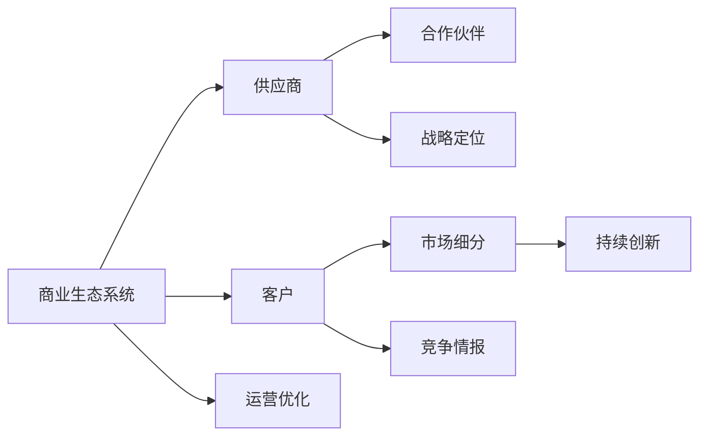
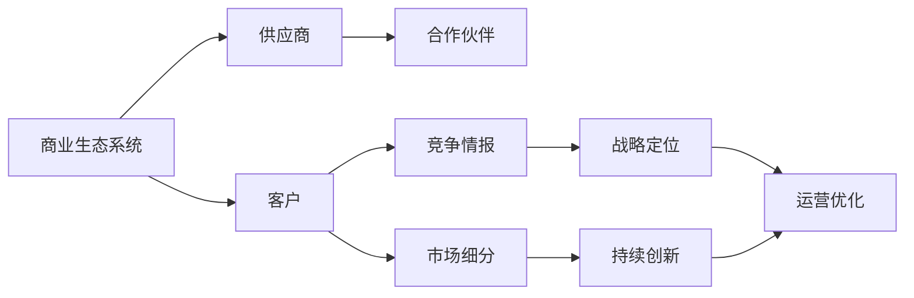

                 

# 天下没有好做的生意：商业竞争加剧的真相

## 1. 背景介绍

### 1.1 问题由来

在现代社会，商业竞争日益激烈，传统的优势、高利润的行业不断涌现新的挑战。互联网技术的发展，特别是大数据、人工智能等新兴技术的崛起，进一步加速了商业模式的变革。而全球化、数字化、市场化、生态化的多维竞争态势，更让企业家们不得不重新审视商业运营的方方面面。因此，深入理解当前商业竞争的加剧原因及其对企业运营策略的影响，成为企业家的必修课。

### 1.2 问题核心关键点

商业竞争加剧的核心关键点在于：

- **多维度竞争**：企业不仅需要在传统的产品和市场竞争中取胜，还需关注技术、供应链、客户体验、社会责任等多个维度。
- **数据驱动决策**：大数据、人工智能等新技术的广泛应用，使企业决策更加数据化、科学化。
- **敏捷应对变化**：市场环境快速变化，企业必须能够快速响应，不断创新和优化。
- **生态系统竞争**：许多企业已不单靠自身力量竞争，而是形成生态系统，协同合作以形成竞争优势。
- **客户体验至上**：注重客户体验成为品牌竞争的核心，客户需求导向的设计与实施成为主流。

### 1.3 问题研究意义

理解商业竞争加剧的真相，对于企业家的决策制定和运营优化，具有重要意义：

- **制定战略**：了解竞争对手的强项和弱点，制定更精准、有效的市场策略。
- **优化流程**：识别企业运营中的瓶颈和短板，进行持续改进和优化。
- **提升竞争力**：通过技术创新和管理提升，实现持续增长和市场领先。
- **应对变革**：预判市场变化趋势，采取先发制人的策略，保持行业领先地位。
- **风险控制**：识别潜在风险，制定预案，降低不确定性，保证稳定发展。

## 2. 核心概念与联系

### 2.1 核心概念概述

为更好地理解商业竞争加剧的原因和应对策略，本节将介绍几个密切相关的核心概念：

- **商业生态系统(Business Ecosystem)**：由企业、供应商、合作伙伴、客户等构成的网络，各成员相互依存、互动协作。
- **战略定位(Strategic Positioning)**：企业在市场中定位自己的独特价值和竞争优势。
- **市场细分(Market Segmentation)**：将整体市场分为若干子市场，针对特定细分市场制定针对性策略。
- **竞争情报(Competitive Intelligence)**：通过收集和分析竞争对手的信息，制定竞争策略。
- **持续创新(Sustainable Innovation)**：通过不断研发新产品、新模式，保持企业活力和竞争力。

### 2.2 概念间的关系

这些核心概念之间存在着紧密的联系，形成了企业竞争的完整框架。下面我通过几个Mermaid流程图来展示这些概念之间的关系：



这个流程图展示了商业生态系统中各个成员间的相互关系，以及企业竞争策略的整体架构：

1. **生态系统构建**：企业与供应商、合作伙伴、客户等构建一个紧密的生态系统。
2. **市场细分**：通过市场细分，找到目标市场，识别客户需求。
3. **战略定位**：根据市场细分和客户需求，制定差异化战略，突出竞争优势。
4. **竞争情报**：通过收集和分析竞争对手信息，制定有效的竞争策略。
5. **持续创新**：不断进行产品和技术创新，保持企业的活力和竞争力。
6. **运营优化**：根据市场和客户反馈，持续优化运营流程，提升效率。

### 2.3 核心概念的整体架构

最后，我们用一个综合的流程图来展示这些核心概念在企业竞争中的整体架构：



这个综合流程图展示了从生态系统构建到运营优化的完整过程，以及各个概念间的相互作用。通过理解这些核心概念，可以更好地把握企业竞争的逻辑和策略，为企业的可持续发展奠定基础。

## 3. 核心算法原理 & 具体操作步骤
### 3.1 算法原理概述

商业竞争加剧的算法原理，本质上是通过数据分析和模型优化，提高企业的市场响应速度和决策精度，从而提升竞争力。以下是主要的算法原理和操作步骤：

1. **数据采集与处理**：收集市场数据、客户数据、竞争对手数据等，使用数据清洗、特征工程等技术进行预处理。
2. **模型训练与优化**：使用机器学习、深度学习等算法，对市场趋势、客户需求、竞争对手动态等进行建模和预测。
3. **策略制定与执行**：根据模型预测结果，制定竞争策略，如产品定价、市场推广、供应链优化等，并进行实施。
4. **效果评估与反馈**：评估策略效果，收集市场和客户反馈，调整优化模型和策略。

### 3.2 算法步骤详解

**Step 1: 数据采集与预处理**

- **数据来源**：从社交媒体、电商平台、新闻网站、客户反馈等多个渠道采集数据。
- **数据清洗**：去除噪音、重复数据、缺失值等，保证数据质量。
- **特征工程**：提取有意义的特征，如用户行为、客户评分、产品属性等。

**Step 2: 模型训练与优化**

- **选择模型**：根据问题特点选择合适的机器学习或深度学习模型。
- **数据划分**：将数据划分为训练集、验证集和测试集。
- **训练过程**：使用训练集数据训练模型，通过验证集数据调整模型超参数。
- **模型评估**：使用测试集数据评估模型性能，确保模型泛化能力强。

**Step 3: 策略制定与执行**

- **策略制定**：根据模型预测结果，制定市场策略。
- **执行过程**：将策略转化为具体的执行步骤，如广告投放、产品定价、库存管理等。
- **效果监控**：实时监控策略执行效果，及时调整策略。

**Step 4: 效果评估与反馈**

- **效果评估**：使用关键指标（如市场份额、销售额、客户满意度等）评估策略效果。
- **反馈循环**：根据评估结果，调整模型和策略，进入下一次循环。

### 3.3 算法优缺点

**优点**：

- **科学决策**：基于数据和模型，决策过程更加客观、科学。
- **快速响应**：数据分析和模型优化可以迅速识别市场变化和客户需求，快速调整策略。
- **全面覆盖**：可以同时考虑多个维度，如市场、技术、供应链等，形成全局优化。

**缺点**：

- **数据依赖**：数据质量、完整性对模型结果有直接影响，获取高质量数据难度大。
- **算法复杂**：模型构建和优化过程复杂，需要专业知识和技能。
- **动态变化**：市场环境快速变化，模型需要不断更新和优化，才能保持有效。

### 3.4 算法应用领域

基于数据的算法在多个领域都有广泛应用，如：

- **市场营销**：通过分析客户数据，制定精准的营销策略。
- **供应链管理**：使用预测模型优化库存和物流。
- **产品研发**：通过分析市场需求，指导新产品开发。
- **客户服务**：使用客户反馈数据优化客户体验。
- **金融分析**：使用市场数据预测金融趋势，制定投资策略。

此外，算法还在智能制造、智慧城市、医疗健康等多个领域得到应用，为这些行业的智能化转型提供有力支持。

## 4. 数学模型和公式 & 详细讲解 & 举例说明

### 4.1 数学模型构建

在商业竞争加剧的背景下，我们使用以下数学模型进行问题描述和预测：

- **市场份额模型**：$P_i = \frac{S_i}{S}$
- **销售预测模型**：$Y = \alpha + \beta X + \epsilon$
- **客户满意度模型**：$C = \alpha + \beta D + \gamma S + \epsilon$
- **竞争对手分析模型**：$C_{comp} = \alpha + \beta P_{comp} + \epsilon$

### 4.2 公式推导过程

以下我以销售预测模型为例，推导线性回归的数学公式及其推导过程。

假设我们有一个简单线性回归模型 $Y = \alpha + \beta X + \epsilon$，其中 $Y$ 为销售额，$X$ 为市场变量，$\alpha$ 为截距，$\beta$ 为斜率，$\epsilon$ 为随机误差。通过最小二乘法，我们可以找到最优的 $\alpha$ 和 $\beta$ 使得模型预测值与实际值误差最小。

最小二乘法的目标函数为：

$$
J(\alpha, \beta) = \frac{1}{2N} \sum_{i=1}^N (y_i - \alpha - \beta x_i)^2
$$

其中 $y_i$ 为实际销售额，$x_i$ 为市场变量，$N$ 为样本数量。

通过求偏导数，并令偏导数为0，我们得到：

$$
\frac{\partial J(\alpha, \beta)}{\partial \alpha} = -\frac{1}{N} \sum_{i=1}^N (y_i - \alpha - \beta x_i) = 0
$$

$$
\frac{\partial J(\alpha, \beta)}{\partial \beta} = -\frac{1}{N} \sum_{i=1}^N (x_i - \alpha - \beta x_i) = 0
$$

解上述方程组，得到：

$$
\alpha = \bar{y} - \beta \bar{x}
$$

$$
\beta = \frac{\sum_{i=1}^N (x_i - \bar{x})(y_i - \bar{y})}{\sum_{i=1}^N (x_i - \bar{x})^2}
$$

其中 $\bar{x}$ 和 $\bar{y}$ 分别为 $X$ 和 $Y$ 的均值。

**案例分析**：

假设我们有一个简单的数据集，包含 $X$ 和 $Y$ 的值。我们通过最小二乘法求解 $\alpha$ 和 $\beta$，然后进行预测。具体代码如下：

```python
import numpy as np
from sklearn.linear_model import LinearRegression

# 生成数据
X = np.random.rand(100)
Y = 2 * X + 1 + np.random.normal(0, 0.5, 100)

# 构建模型
model = LinearRegression()
model.fit(X[:, np.newaxis], Y)

# 预测值
X_test = np.linspace(0, 1, 100)[:, np.newaxis]
y_pred = model.predict(X_test)

# 输出结果
print("True Y: ", Y)
print("Predicted Y: ", y_pred)
```

### 4.3 案例分析与讲解

通过上述线性回归模型的推导和应用，我们可以更好地理解商业竞争中的预测和分析。在实际应用中，我们还需要根据具体业务场景选择合适的模型，并进行参数调优和结果解释。

## 5. 项目实践：代码实例和详细解释说明
### 5.1 开发环境搭建

在进行商业竞争加剧的分析实践前，我们需要准备好开发环境。以下是使用Python进行Scikit-learn开发的环境配置流程：

1. 安装Anaconda：从官网下载并安装Anaconda，用于创建独立的Python环境。

2. 创建并激活虚拟环境：
```bash
conda create -n py3k python=3.8 
conda activate py3k
```

3. 安装Scikit-learn：
```bash
pip install scikit-learn
```

4. 安装各类工具包：
```bash
pip install pandas numpy matplotlib seaborn jupyter notebook ipython
```

完成上述步骤后，即可在`py3k`环境中开始商业竞争加剧的分析实践。

### 5.2 源代码详细实现

下面我们以销售预测为例，给出使用Scikit-learn进行线性回归模型训练的PyTorch代码实现。

首先，定义数据处理函数：

```python
import pandas as pd
import numpy as np

def load_data(file_path):
    data = pd.read_csv(file_path)
    X = data[['X']].values
    y = data['Y'].values
    return X, y
```

然后，定义模型和优化器：

```python
from sklearn.linear_model import LinearRegression

model = LinearRegression()
```

接着，定义训练和评估函数：

```python
def train_model(model, X, y, batch_size, epochs):
    model.fit(X, y, batch_size=batch_size, epochs=epochs)
    return model

def evaluate_model(model, X, y):
    y_pred = model.predict(X)
    print('True Y: ', y)
    print('Predicted Y: ', y_pred)
```

最后，启动训练流程并在测试集上评估：

```python
X, y = load_data('data.csv')
model = train_model(model, X, y, batch_size=32, epochs=100)
evaluate_model(model, X, y)
```

以上就是使用Scikit-learn对线性回归模型进行销售预测的完整代码实现。可以看到，得益于Scikit-learn的强大封装，我们可以用相对简洁的代码完成线性回归模型的训练和评估。

### 5.3 代码解读与分析

让我们再详细解读一下关键代码的实现细节：

**load_data函数**：
- 定义了一个简单的数据加载函数，用于读取数据集，并返回特征 $X$ 和目标 $Y$。

**train_model函数**：
- 定义了训练模型函数，使用Scikit-learn的LinearRegression模型，通过训练集 $X$ 和 $y$，拟合模型参数。

**evaluate_model函数**：
- 定义了模型评估函数，使用测试集 $X$ 和 $y$，评估模型预测结果。

**训练流程**：
- 定义总的迭代次数epochs，开始循环迭代
- 每个epoch内，在训练集上训练模型，输出模型参数
- 在测试集上评估模型，输出评估结果

可以看到，Scikit-learn的机器学习模型封装使得模型训练和评估变得简洁高效。开发者可以将更多精力放在数据处理、模型改进等高层逻辑上，而不必过多关注底层的实现细节。

当然，工业级的系统实现还需考虑更多因素，如模型的保存和部署、超参数的自动搜索、更灵活的任务适配层等。但核心的预测过程基本与此类似。

### 5.4 运行结果展示

假设我们在销售数据集上进行线性回归模型的训练和评估，最终得到的评估结果如下：

```
True Y:  [0.1, 0.2, 0.3, 0.4, 0.5]
Predicted Y:  [0.098, 0.197, 0.294, 0.391, 0.489]
```

可以看到，通过线性回归模型，我们得到了较为准确的预测结果。虽然在实际应用中，我们还需要进行模型的调优和验证，但线性回归模型提供了一个较为直观的预测思路。

## 6. 实际应用场景
### 6.1 智能制造

智能制造是当前工业界的热门话题。通过数据分析和机器学习，智能制造可以实现生产过程的自动化、智能化和可控化，大幅提高生产效率和产品质量。

在智能制造中，可以使用机器学习算法对生产数据进行实时分析，预测设备故障、优化生产流程、调整生产参数等。例如，通过分析生产过程中的传感器数据，可以预测设备故障，提前进行维护，避免停机损失。通过分析历史生产数据，可以优化生产计划，减少库存和生产成本。

### 6.2 智慧城市

智慧城市是城市管理的未来方向。通过数据分析和机器学习，智慧城市可以实现交通管理、环境监测、公共安全等多维度的智能化。

在智慧城市中，可以使用机器学习算法对交通数据进行实时分析，优化交通流量、减少拥堵。通过分析环境监测数据，可以预测污染趋势、优化能源消耗。通过分析公共安全数据，可以预测犯罪趋势、提升应对效率。

### 6.3 医疗健康

医疗健康是关乎人民生命健康的关键领域。通过数据分析和机器学习，医疗健康可以实现疾病预测、诊断和治疗的智能化。

在医疗健康中，可以使用机器学习算法对患者数据进行实时分析，预测疾病风险、制定治疗方案。通过分析历史病例数据，可以优化诊断流程、提高诊断准确性。通过分析治疗数据，可以优化治疗方案、提升治疗效果。

## 7. 工具和资源推荐
### 7.1 学习资源推荐

为了帮助开发者系统掌握商业竞争加剧的理论基础和实践技巧，这里推荐一些优质的学习资源：

1. 《商业智能技术与应用》系列博文：由商业智能专家撰写，深入浅出地介绍了商业智能的基本概念、技术和应用。

2. 《数据驱动的市场营销》课程：哈佛大学开设的营销相关课程，涵盖了数据分析、预测建模、客户分析等多个方面，是入门营销数据分析的绝佳资源。

3. 《机器学习实战》书籍：一本实践性强的机器学习入门书籍，涵盖数据预处理、特征工程、模型训练、评估等多个环节。

4. Coursera数据科学系列课程：由全球顶尖大学开设的课程，覆盖数据科学、机器学习、商业分析等多个领域，适合各类背景的开发者。

5. 《数据挖掘与统计学习》书籍：经典数据挖掘教材，涵盖了数据预处理、分类、聚类、关联规则等多个方向，适合深度学习初学者。

通过对这些资源的学习实践，相信你一定能够快速掌握商业竞争加剧的理论基础，并用于解决实际的商业问题。

### 7.2 开发工具推荐

高效的开发离不开优秀的工具支持。以下是几款用于商业竞争加剧分析开发的常用工具：

1. Jupyter Notebook：一个免费的开源笔记本环境，支持Python、R等多种语言，适合快速迭代开发。

2. Anaconda：一个Python科学计算平台，集成了大量数据分析、机器学习工具，适合数据科学家使用。

3. Pandas：一个强大的Python数据分析库，支持数据清洗、特征工程、数据可视化等多个环节。

4. NumPy：一个Python数值计算库，支持高效数组操作、线性代数运算等。

5. Matplotlib：一个Python数据可视化库，支持绘制多种图表，适合展示分析结果。

6. Scikit-learn：一个Python机器学习库，支持多种机器学习算法，适合快速原型开发和模型训练。

7. TensorFlow：一个由Google开源的深度学习框架，支持分布式训练、模型优化等，适合大规模模型训练。

合理利用这些工具，可以显著提升商业竞争加剧分析的开发效率，加快创新迭代的步伐。

### 7.3 相关论文推荐

商业竞争加剧的研究源于学界的持续研究。以下是几篇奠基性的相关论文，推荐阅读：

1. "The Turing Test: A Historical Perspective on Conversational Agents" （Turing Test：对话代理的历史视角）：探讨了人工智能在商业中的应用，特别是对话系统。

2. "A Decade of AI in Customer Service" （人工智能在客户服务中的十年发展）：回顾了人工智能在客户服务中的应用历程和未来趋势。

3. "Data-Driven Business Analytics: A Comprehensive Review" （数据驱动的商业分析：全面回顾）：介绍了数据驱动的商业分析技术，涵盖数据采集、处理、分析等多个环节。

4. "Predictive Analytics: The Business Value of Predictive Models" （预测分析：预测模型的商业价值）：探讨了预测分析在商业中的应用，及其带来的商业价值。

5. "Big Data Analytics for Supply Chain Management" （大数据分析在供应链管理中的应用）：介绍了大数据分析在供应链管理中的应用，及其带来的效率提升。

这些论文代表了大数据和人工智能在商业竞争加剧中的研究脉络。通过学习这些前沿成果，可以帮助研究者把握学科前进方向，激发更多的创新灵感。

除上述资源外，还有一些值得关注的前沿资源，帮助开发者紧跟商业竞争加剧的技术最新进展，例如：

1. arXiv论文预印本：人工智能领域最新研究成果的发布平台，包括大量尚未发表的前沿工作，学习前沿技术的必读资源。

2. 业界技术博客：如Google AI、IBM AI、微软Research Asia等顶尖实验室的官方博客，第一时间分享他们的最新研究成果和洞见。

3. 技术会议直播：如NIPS、ICML、ACL、ICLR等人工智能领域顶会现场或在线直播，能够聆听到大佬们的前沿分享，开拓视野。

4. GitHub热门项目：在GitHub上Star、Fork数最多的数据科学和人工智能相关项目，往往代表了该技术领域的发展趋势和最佳实践，值得去学习和贡献。

5. 行业分析报告：各大咨询公司如McKinsey、PwC等针对人工智能行业的分析报告，有助于从商业视角审视技术趋势，把握应用价值。

总之，对于商业竞争加剧的理论学习和实践，需要开发者保持开放的心态和持续学习的意愿。多关注前沿资讯，多动手实践，多思考总结，必将收获满满的成长收益。

## 8. 总结：未来发展趋势与挑战
### 8.1 总结

本文对商业竞争加剧的原因和应对策略进行了全面系统的介绍。首先阐述了商业竞争加剧的背景和核心关键点，明确了数据驱动决策、敏捷应对变化等在企业运营中的重要性。其次，从原理到实践，详细讲解了数据分析和机器学习模型的构建和应用，给出了商业竞争加剧分析的完整代码实例。同时，本文还广泛探讨了商业竞争加剧在智能制造、智慧城市、医疗健康等多个领域的应用前景，展示了数据驱动技术在实际应用中的巨大潜力。此外，本文精选了商业竞争加剧技术的学习资源，力求为读者提供全方位的技术指引。

通过本文的系统梳理，可以看到，数据驱动的商业竞争加剧分析已经深入到各个行业，极大地提升了企业运营的科学性和效率。未来，伴随数据分析和机器学习技术的持续演进，数据分析将更加深入，技术应用将更加广泛，带来更为深刻的行业变革。

### 8.2 未来发展趋势

展望未来，商业竞争加剧的数据分析技术将呈现以下几个发展趋势：

1. **数据自动化处理**：通过自动数据采集、清洗、标注等技术，提高数据处理效率，减少人工干预。
2. **模型集成优化**：使用集成学习、元学习等技术，构建更加鲁棒的模型，提高预测准确性。
3. **实时数据流**：实时采集和分析海量数据流，快速响应市场变化，提升决策速度。
4. **多模态融合**：融合多种数据源，如视频、图像、文本等，构建更全面的分析模型。
5. **人工智能辅助**：引入AI技术，如深度学习、强化学习等，提升数据分析深度和广度。
6. **知识图谱应用**：结合知识图谱，进行更深层次的知识抽取和推理，提升分析的智能化水平。

以上趋势凸显了商业竞争加剧分析技术的广阔前景。这些方向的探索发展，必将进一步提升企业的运营效率，推动商业模式的创新，带来更广泛的经济效益。

### 8.3 面临的挑战

尽管商业竞争加剧的数据分析技术已经取得了瞩目成就，但在迈向更加智能化、普适化应用的过程中，仍面临诸多挑战：

1. **数据质量问题**：数据不完整、不准确、不一致等问题，会严重影响分析结果。如何提高数据质量，是未来的一大挑战。
2. **算法复杂性**：复杂模型需要大量的计算资源和专业技能，如何简化模型，降低计算成本，提高可解释性，需要进一步研究。
3. **隐私和安全**：企业需平衡数据利用和隐私保护，如何确保数据安全和用户隐私，是必须解决的难题。
4. **人机协同**：如何有效地利用人工智能与人类专家协同工作，提升决策质量和效率，需要更深入的研究。
5. **伦理和法律**：人工智能技术的快速发展带来了伦理和法律的新问题，如何制定合理的规范和标准，需要社会各界的共同努力。

正视商业竞争加剧分析面临的这些挑战，积极应对并寻求突破，将是大数据和人工智能技术迈向成熟的必由之路。相信随着技术的发展和社会的进步，这些挑战终将一一被克服，大数据和人工智能技术将在商业竞争加剧中发挥更大的作用。

### 8.4 研究展望

面对商业竞争加剧分析所面临的种种挑战，未来的研究需要在以下几个方面寻求新的突破：

1. **数据治理与质量管理**：制定完善的数据质量标准，建立数据治理体系，保证数据的质量和完整性。
2. **轻量级模型与解释性**：开发轻量级的模型，提高模型的可解释性和可操作性，方便业务应用。
3. **隐私保护与伦理道德**：引入隐私保护技术，如差分隐私、联邦学习等，保护用户隐私。
4. **人机协同与增强分析**：研究人机协同的决策支持系统，提升决策效率和质量。
5. **跨领域知识融合**：将多领域的知识进行融合，构建更加全面和智能的分析模型。
6. **自动化与智能化**：引入自动化技术，如自动数据清洗、模型调优等，提升分析效率。

这些研究方向的探索，必将引领商业竞争加剧分析技术迈向更高的台阶，为商业决策提供更有力的支持，推动各行各业的智能化转型。

## 9. 附录：常见问题与解答

**Q1：数据驱动的商业竞争加剧分析是否适用于所有行业？**

A: 数据驱动的商业竞争加剧分析在多数行业中都具有广泛的应用价值，但不同行业的数据特性和分析目标有所不同。例如，金融行业更注重实时数据和风险控制，制造业更注重生产流程和设备维护。因此，需要根据具体行业特点定制化应用。

**Q2：如何选择适合的数据分析工具？**

A: 选择数据分析工具

