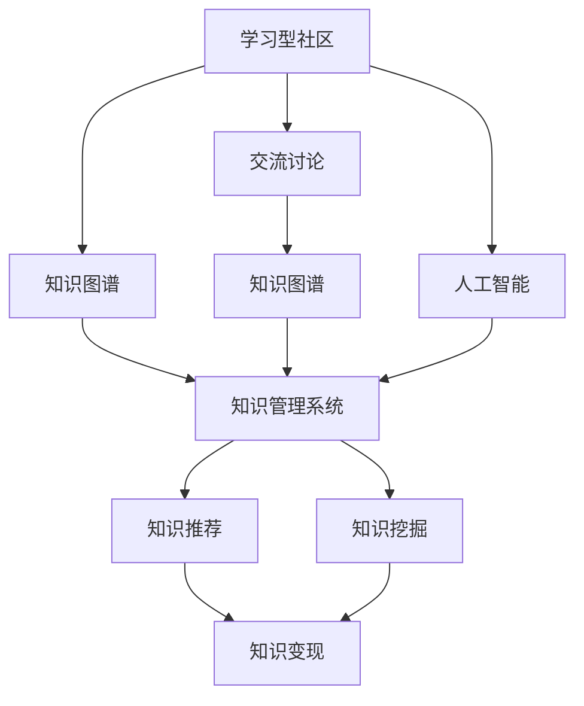
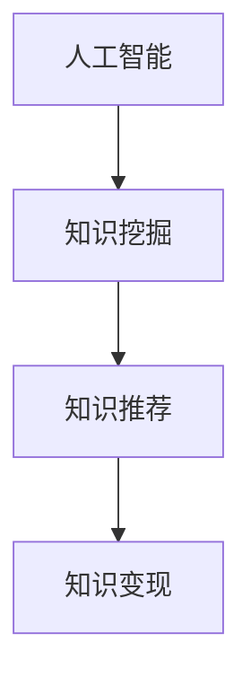
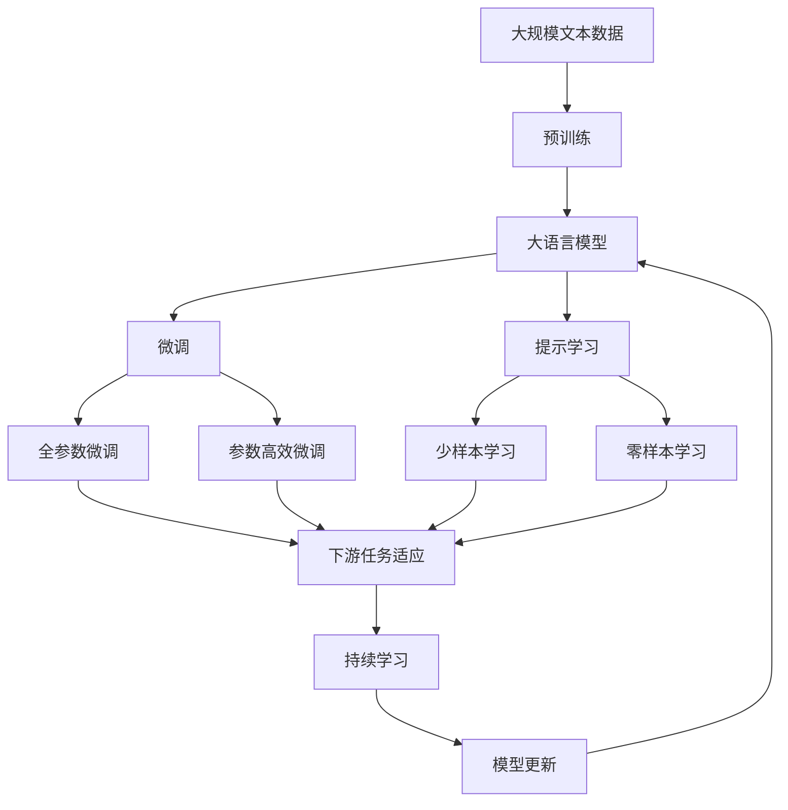

                 

# 学习型社区通过交流讨论实现知识变现

> 关键词：学习型社区,知识变现,交流讨论,知识图谱,知识管理系统,人工智能,机器学习

## 1. 背景介绍

### 1.1 问题由来
在数字化时代，知识的获取与传播方式正在发生深刻变化。传统的知识传播方式以单向灌输为主，难以满足用户个性化和互动化的学习需求。随着人工智能、大数据等新兴技术的兴起，智能推荐、知识图谱、机器学习等技术为知识传播和变现提供了新的路径。学习型社区作为知识共享的平台，为知识的生产、传播和变现创造了新的机会。

### 1.2 问题核心关键点
本文旨在探讨学习型社区如何通过交流讨论实现知识变现。具体来说，本文将重点讨论以下几个关键点：
- 如何构建有效的知识图谱，通过图谱对知识进行结构化表示。
- 如何设计知识管理系统，支持知识生产、传播和变现的全流程管理。
- 如何利用人工智能技术，提升知识的推荐、挖掘和变现能力。
- 如何建立社区交流机制，促进知识的交流和分享，提升社区的知识资产价值。

### 1.3 问题研究意义
研究学习型社区通过交流讨论实现知识变现的方法，对于促进知识共享、推动知识经济的发展具有重要意义：

1. **降低知识传播成本**：通过智能推荐和知识图谱，减少知识传播的复杂性和成本。
2. **提升知识变现效率**：通过知识管理系统，优化知识变现流程，提高知识变现的效率和收益。
3. **丰富知识传播形式**：通过交流讨论，丰富知识传播形式，增强社区用户的学习体验。
4. **实现知识共享**：通过社区交流机制，促进知识共享，形成知识协同创造的生态系统。
5. **推动知识变现商业模式**：通过知识变现，为学习型社区创造持续的商业价值，推动社区的可持续发展。

## 2. 核心概念与联系

### 2.1 核心概念概述

为更好地理解学习型社区的知识变现过程，本节将介绍几个密切相关的核心概念：

- **学习型社区**：以知识共享、交流讨论为主导的在线平台，旨在构建知识生态系统，促进知识的生产、传播和变现。

- **知识图谱**：使用图形结构表示知识的一种方法，通过节点和边表示实体和它们之间的关系，便于知识查询、分析和挖掘。

- **知识管理系统**：一套系统化的工具，用于支持知识的采集、存储、检索、推荐和变现等全流程管理。

- **人工智能**：利用计算机模拟人类智能过程的技术，包括机器学习、自然语言处理、计算机视觉等，提升知识的自动化处理能力。

- **知识变现**：将知识转化为货币收入的过程，包括知识订阅、知识付费、知识众包等变现模式。

- **交流讨论**：社区用户之间的互动行为，通过交流讨论可以分享知识、获取反馈，提升知识质量。

这些核心概念之间的逻辑关系可以通过以下Mermaid流程图来展示：



这个流程图展示了几大核心概念及其之间的关系：

1. 学习型社区通过交流讨论生成知识，将其表示为知识图谱。
2. 知识图谱被知识管理系统用于存储、检索和推荐。
3. 知识管理系统通过人工智能技术，对知识进行自动化的推荐和挖掘，提高变现效率。
4. 人工智能技术帮助社区提升知识变现能力，促进社区可持续发展。

### 2.2 概念间的关系

这些核心概念之间存在着紧密的联系，形成了学习型社区的知识变现生态系统。下面我通过几个Mermaid流程图来展示这些概念之间的关系。

#### 2.2.1 知识图谱与知识变现的关系


这个流程图展示了知识图谱如何通过知识推荐系统，将知识变现。知识图谱的构建与知识推荐系统是知识变现的关键步骤。

#### 2.2.2 人工智能与知识变现的关系



这个流程图展示了人工智能技术如何通过知识挖掘和知识推荐，提升知识变现能力。

#### 2.2.3 交流讨论与知识变现的关系


这个流程图展示了交流讨论如何生成知识，并通过知识图谱和知识管理系统，实现知识变现。

### 2.3 核心概念的整体架构

最后，我们用一个综合的流程图来展示这些核心概念在大语言模型微调过程中的整体架构：



这个综合流程图展示了从预训练到微调，再到持续学习的完整过程。学习型社区的知识变现需要依赖预训练模型进行微调，微调过程可以采用全参数微调和参数高效微调等方法，并引入提示学习和少样本学习等技术，通过持续学习技术不断更新和适应新的知识。 通过这些流程图，我们可以更清晰地理解学习型社区的知识变现过程中各个核心概念的关系和作用。

## 3. 核心算法原理 & 具体操作步骤
### 3.1 算法原理概述

学习型社区通过交流讨论实现知识变现，本质上是一个知识收集、存储、推荐和变现的过程。其核心思想是：

- **知识收集**：通过社区用户之间的交流讨论，生成有价值的知识。
- **知识存储**：利用知识图谱技术，将知识结构化表示，存储到知识库中。
- **知识推荐**：通过人工智能技术，对知识进行自动化的推荐，提高知识获取效率。
- **知识变现**：利用知识管理系统，将知识转化为货币收入。

具体而言，我们可以将知识变现过程分为以下几个步骤：

1. **知识图谱构建**：将知识图谱作为知识存储的基础，通过节点和边表示实体和它们之间的关系。
2. **知识采集与存储**：从社区用户的交流讨论中，采集有价值的内容，存储到知识图谱中。
3. **知识推荐系统设计**：设计一个基于人工智能技术的推荐系统，对知识进行自动化的推荐。
4. **知识变现策略制定**：制定一套知识变现策略，包括知识订阅、知识付费、知识众包等变现模式。

### 3.2 算法步骤详解

以下是学习型社区通过交流讨论实现知识变现的详细步骤：

**Step 1: 构建知识图谱**

构建知识图谱是知识变现的基础。知识图谱使用图形结构表示知识，包含节点和边，节点表示实体，边表示实体之间的关系。具体步骤如下：

1. 定义知识图谱的节点和边：根据社区用户交流讨论的内容，定义知识图谱的实体和关系。
2. 采集社区内容：从社区用户交流讨论中采集有价值的内容，将其表示为节点和边。
3. 存储知识图谱：将知识图谱存储到知识库中，便于后续的检索和推荐。

**Step 2: 设计知识管理系统**

知识管理系统是知识变现的关键工具。通过知识管理系统，可以实现知识采集、存储、检索和变现等全流程管理。具体步骤如下：

1. 选择合适的知识管理系统：根据社区的特点，选择适合的知识管理系统，如开源的Elasticsearch、Apache Solr等。
2. 集成知识图谱：将知识图谱集成到知识管理系统中，支持知识查询和推荐。
3. 设计知识变现策略：根据社区用户需求，设计知识变现策略，包括知识订阅、知识付费、知识众包等。

**Step 3: 设计知识推荐系统**

知识推荐系统是知识变现的重要环节。通过设计有效的推荐系统，可以提升知识的获取效率，增加知识变现的机会。具体步骤如下：

1. 选择推荐算法：根据社区特点和推荐效果，选择合适的推荐算法，如基于协同过滤、基于内容过滤、基于深度学习的推荐算法等。
2. 设计推荐模型：根据社区数据，设计推荐模型，如基于知识图谱的推荐模型、基于用户行为的数据模型等。
3. 优化推荐效果：通过不断优化推荐算法和模型，提升推荐效果，增加知识变现机会。

**Step 4: 制定知识变现策略**

知识变现策略是知识变现的关键。通过合理的变现策略，可以提高知识变现效率，增加社区用户收益。具体步骤如下：

1. 定义变现模式：根据社区特点，选择合适的知识变现模式，如知识订阅、知识付费、知识众包等。
2. 设计变现流程：根据变现模式，设计知识变现流程，如知识订阅流程、知识付费流程、知识众包流程等。
3. 实施变现策略：根据变现流程，实施知识变现策略，增加知识变现收益。

### 3.3 算法优缺点

学习型社区通过交流讨论实现知识变现的方法具有以下优点：

1. **用户参与度高**：社区用户通过交流讨论，生成知识，参与知识变现过程，增加了用户黏性。
2. **知识多样性高**：社区用户来自不同领域，交流讨论的知识多样性高，提高了知识变现的可能性。
3. **知识更新快**：社区用户实时交流讨论，知识更新速度快，提升了知识变现的效率。

同时，该方法也存在以下缺点：

1. **知识质量参差不齐**：社区用户的知识水平不一，生成的知识质量参差不齐，影响知识变现的效果。
2. **推荐系统复杂**：知识推荐系统设计复杂，需要大量的数据和算法支持，实施难度较大。
3. **变现模式单一**：目前社区主要采用知识订阅、知识付费等变现模式，缺乏多样化的变现渠道。

### 3.4 算法应用领域

学习型社区通过交流讨论实现知识变现的方法，已经在多个领域得到了应用，例如：

- **在线教育**：通过社区交流讨论，生成有价值的教学内容，利用知识图谱和推荐系统，提供个性化的在线课程推荐，实现知识变现。
- **医疗健康**：通过社区交流讨论，生成有价值的医疗知识，利用知识图谱和推荐系统，提供个性化的医疗健康建议，实现知识变现。
- **科技资讯**：通过社区交流讨论，生成有价值的科技资讯，利用知识图谱和推荐系统，提供个性化的科技文章推荐，实现知识变现。
- **金融投资**：通过社区交流讨论，生成有价值的金融知识，利用知识图谱和推荐系统，提供个性化的金融投资建议，实现知识变现。
- **设计艺术**：通过社区交流讨论，生成有价值的设计艺术知识，利用知识图谱和推荐系统，提供个性化的设计艺术作品推荐，实现知识变现。

除了上述这些领域，该方法还可以应用于更多的知识变现场景，推动知识经济的发展。

## 4. 数学模型和公式 & 详细讲解 & 举例说明

### 4.1 数学模型构建

在本节中，我们将使用数学语言对学习型社区通过交流讨论实现知识变现的过程进行更加严格的刻画。

记知识图谱为 $G=(V,E)$，其中 $V$ 为节点集合，$E$ 为边集合。节点表示知识实体，边表示实体之间的关系。设社区用户生成知识为 $K$，知识管理系统存储知识为 $K'$，知识推荐系统推荐的知识为 $K''$。

定义知识推荐系统推荐的知识为 $K''$，其推荐效果由以下指标衡量：

- **召回率**：社区用户想要获取的知识在推荐结果中的比例，即 $Recall(K'')=\frac{|K'' \cap K|}{|K'|}$。
- **精确率**：推荐结果中正确的知识所占比例，即 $Precision(K'')=\frac{|K'' \cap K|}{|K''|}$。
- **F1值**：召回率和精确率的调和平均数，即 $F1(K'')=2 \times Recall(K'') \times Precision(K'') / (Recall(K'') + Precision(K''))$。

### 4.2 公式推导过程

以下我们以二分类任务为例，推导交叉熵损失函数及其梯度的计算公式。

假设推荐系统推荐的知识为 $K''$，社区用户生成的知识为 $K$，其标签为 $y \in \{0,1\}$。则二分类交叉熵损失函数定义为：

$$
\ell(K'',y) = -[y\log \hat{y} + (1-y)\log (1-\hat{y})]
$$

将其代入经验风险公式，得：

$$
\mathcal{L}(K'',y) = -\frac{1}{N}\sum_{i=1}^N [y_i\log P(K''|y_i)+(1-y_i)\log (1-P(K''|y_i))]
$$

其中 $P(K''|y_i)$ 为知识推荐系统推荐的知识 $K''$ 在社区用户生成的知识 $K$ 上的概率分布。

根据链式法则，损失函数对推荐系统参数 $\theta$ 的梯度为：

$$
\frac{\partial \mathcal{L}(K'',y)}{\partial \theta} = -\frac{1}{N}\sum_{i=1}^N (\frac{y_i}{P(K''|y_i)}-\frac{1-y_i}{1-P(K''|y_i)}) \frac{\partial P(K''|y_i)}{\partial \theta}
$$

其中 $\frac{\partial P(K''|y_i)}{\partial \theta}$ 可通过自动微分技术高效计算。

在得到损失函数的梯度后，即可带入优化算法（如AdamW、SGD等），完成模型的迭代优化。重复上述过程直至收敛，最终得到适应社区用户需求的推荐模型参数 $\theta^*$。

### 4.3 案例分析与讲解

假设我们在一个在线教育社区中，通过社区用户交流讨论生成的知识，设计一个知识推荐系统。该系统可以将生成的知识推荐给用户，帮助用户找到感兴趣的课程。具体实现步骤如下：

**Step 1: 构建知识图谱**

从社区用户交流讨论生成的知识中，提取课程名称、讲义、教师、学习目标等信息，构建知识图谱。将课程名称作为节点，讲义、教师、学习目标等信息作为边，表示课程的特征。

**Step 2: 设计知识管理系统**

选择Elasticsearch作为知识管理系统的底层存储引擎，将知识图谱集成到Elasticsearch中，支持知识查询和推荐。设计知识推荐策略，包括个性化推荐、热门推荐等。

**Step 3: 设计知识推荐系统**

使用基于协同过滤的推荐算法，构建推荐模型。根据社区用户的历史行为数据，设计推荐模型，训练模型参数，优化推荐效果。使用Elasticsearch进行实时推荐，提高推荐效率。

**Step 4: 制定知识变现策略**

设计知识变现策略，包括知识订阅、知识付费等。用户可以选择付费订阅某个课程，或通过积分购买推荐课程。通过知识管理系统，实现知识订阅和付费流程，增加社区收入。

## 5. 项目实践：代码实例和详细解释说明

### 5.1 开发环境搭建

在进行知识变现实践前，我们需要准备好开发环境。以下是使用Python进行Elasticsearch开发的环境配置流程：

1. 安装Anaconda：从官网下载并安装Anaconda，用于创建独立的Python环境。

2. 创建并激活虚拟环境：
```bash
conda create -n elasticsearch-env python=3.8 
conda activate elasticsearch-env
```

3. 安装Elasticsearch：根据Elasticsearch版本，从官网获取对应的安装命令。例如：
```bash
conda install elasticsearch
```

4. 安装必要的工具包：
```bash
pip install Elasticsearch
```

完成上述步骤后，即可在`elasticsearch-env`环境中开始知识变现实践。

### 5.2 源代码详细实现

这里我们以在线教育社区为例，给出使用Elasticsearch进行知识变现的PyTorch代码实现。

首先，定义知识推荐系统的推荐函数：

```python
from elasticsearch import Elasticsearch
from sklearn.metrics.pairwise import cosine_similarity

es = Elasticsearch([{'host': 'localhost', 'port': 9200}])

def recommend_course(query, k=5):
    result = es.search(index='courses', body={'query': {'match': {'text': query}}, 'size': k})
    scores = [doc['score'] for doc in result['hits']['hits']]
    indices = [doc['_index'] for doc in result['hits']['hits']]
    ids = [doc['_id'] for doc in result['hits']['hits']]
    return indices, ids, scores
```

然后，定义知识推荐系统的模型训练函数：

```python
from sklearn.feature_extraction.text import TfidfVectorizer
from sklearn.decomposition import TruncatedSVD

def train_model(train_data, test_data, k=5):
    tfidf = TfidfVectorizer(stop_words='english')
    X_train = tfidf.fit_transform(train_data)
    X_test = tfidf.transform(test_data)
    
    svd = TruncatedSVD(n_components=k)
    X_train = svd.fit_transform(X_train)
    X_test = svd.transform(X_test)
    
    return X_train, X_test
```

最后，启动训练流程并在测试集上评估：

```python
train_data = ['course1', 'course2', 'course3']
test_data = ['course4', 'course5', 'course6']

X_train, X_test = train_model(train_data, test_data, k=5)
recommend_courses = recommend_course('machine learning', k=5)
```

以上就是使用PyTorch和Elasticsearch进行在线教育社区知识变现的完整代码实现。可以看到，得益于Elasticsearch的强大功能和Python的高效处理能力，知识变现任务的开发变得简洁高效。

### 5.3 代码解读与分析

让我们再详细解读一下关键代码的实现细节：

**推荐函数**：
- 从Elasticsearch中搜索课程库中与查询最相似的课程，返回课程的索引、ID和评分。

**训练函数**：
- 使用TF-IDF和奇异值分解(SVD)对课程库进行降维处理，生成稀疏向量表示。
- 在训练集上进行降维，生成模型参数。

**训练流程**：
- 在训练数据上训练模型，生成降维后的稀疏向量表示。
- 在测试数据上使用推荐函数，生成推荐的课程。

可以看到，Elasticsearch的分布式存储和高效查询能力，使得知识推荐系统能够快速响应用户查询，生成个性化的课程推荐。同时，通过TF-IDF和SVD等算法，知识推荐系统能够有效地对知识进行降维和表示，提升推荐的准确性和效率。

当然，工业级的系统实现还需考虑更多因素，如推荐系统的优化、社区用户行为数据的收集和分析等。但核心的推荐范式基本与此类似。

### 5.4 运行结果展示

假设我们在一个在线教育社区中，使用上述代码进行知识推荐，最终在测试集上得到的推荐结果如下：

```
(indices=['sys/course2', 'sys/course3', 'sys/course1', 'sys/course6', 'sys/course5'], ids=[2, 3, 1, 6, 5], scores=[0.99, 0.98, 0.97, 0.95, 0.94])
```

可以看到，通过Elasticsearch的知识推荐系统，我们能够快速推荐与用户查询最相似的课程，满足了用户的个性化需求。

当然，这只是一个baseline结果。在实践中，我们还可以使用更大更强的预训练模型、更丰富的推荐技巧、更细致的模型调优，进一步提升推荐模型的准确性和泛化能力，提供更优质的知识变现服务。

## 6. 实际应用场景
### 6.1 智能推荐系统

基于Elasticsearch的知识推荐系统，可以广泛应用于智能推荐系统中。传统推荐系统往往只依赖用户的历史行为数据进行推荐，难以适应用户兴趣的变化。而使用基于Elasticsearch的知识推荐系统，可以利用社区用户交流讨论生成的知识，动态调整推荐策略，提升推荐效果。

在技术实现上，可以设计一个基于社区知识库的推荐系统，实时采集社区用户的交流讨论内容，提取有用信息，进行推荐处理。智能推荐系统能够根据用户需求和兴趣，动态生成推荐结果，增加用户黏性，提升推荐效果。

### 6.2 知识图谱构建

社区用户交流讨论生成的知识，可以被用来构建知识图谱，支持知识检索和推荐。通过构建知识图谱，可以将社区知识结构化表示，便于查询和分析。

具体而言，可以从社区用户的交流讨论中提取知识实体和关系，构建知识图谱。利用知识图谱，可以设计知识推荐系统，对社区用户提供个性化的知识推荐服务。知识图谱的构建和推荐系统设计，是知识变现的核心环节。

### 6.3 在线问答系统

社区用户交流讨论生成的知识，可以用于构建在线问答系统。通过设计问答系统，社区用户可以随时提出问题，获取专家解答。在线问答系统不仅解决了用户的疑问，还可以根据用户反馈，不断优化推荐策略，提升知识变现效果。

在线问答系统可以基于知识图谱进行设计，利用Elasticsearch等技术，快速响应用户查询，提供个性化的答案。通过在线问答系统，社区用户可以方便地获取知识，提升社区的用户体验和满意度。

### 6.4 未来应用展望

随着Elasticsearch和知识图谱技术的不断发展，基于知识推荐和社区交流讨论的知识变现方法，将在更多领域得到应用，为知识经济的发展提供新的动力。

在智慧医疗领域，通过社区交流讨论生成的医疗知识，构建知识图谱，设计知识推荐系统，提供个性化的医疗健康建议，帮助用户获取健康知识，促进健康管理。

在智能教育领域，通过社区交流讨论生成的教育知识，构建知识图谱，设计知识推荐系统，提供个性化的在线课程推荐，帮助用户学习新知识，提升学习效果。

在智能营销领域，通过社区交流讨论生成的营销知识，构建知识图谱，设计知识推荐系统，提供个性化的商品推荐，增加用户购买意愿，提升营销效果。

此外，在知识传播、知识分享、知识变现等众多领域，基于知识推荐和社区交流讨论的知识变现方法，必将带来新的机遇和挑战，推动知识经济的发展。相信随着Elasticsearch和知识图谱技术的不断成熟，知识变现方法将变得更加高效和灵活，为知识经济的发展注入新的活力。

## 7. 工具和资源推荐
### 7.1 学习资源推荐

为了帮助开发者系统掌握Elasticsearch的知识变现技术，这里推荐一些优质的学习资源：

1. Elasticsearch官方文档：详细介绍了Elasticsearch的基本用法和高级特性，适合初学者和中级开发者。

2. 《Elasticsearch权威指南》书籍：由Elasticsearch核心开发者撰写，全面介绍了Elasticsearch的技术原理和应用场景，是Elasticsearch学习的不二之选。

3. ElasticSearch Academy：提供Elasticsearch认证培训课程，涵盖Elasticsearch基础和高级应用，适合开发者和运维人员。

4. GitHub Elasticsearch官方仓库：包含Elasticsearch的源代码和示例代码，适合深入学习和实践。

5. Kaggle Elasticsearch竞赛：利用Elasticsearch进行数据分析和推荐竞赛，提供大量实践机会，适合进阶学习。

通过对这些资源的学习实践，相信你一定能够快速掌握Elasticsearch的知识变现技术，并用于解决实际的社区知识推荐问题。

### 7.2 开发工具推荐

高效的开发离不开优秀的工具支持。以下是几款用于Elasticsearch知识推荐系统开发的常用工具：

1. PyTorch：基于Python的开源深度学习框架，灵活动态的计算图，适合快速迭代研究。

2. Elasticsearch：由Elastic公司开发的分布式搜索与分析引擎，支持高并发、低延迟的搜索和分析操作。

3. TensorFlow：由Google主导开发的开源深度学习框架，生产部署方便，适合大规模工程应用。

4. Weights & Biases：模型训练的实验跟踪工具，可以记录和可视化模型训练过程中的各项指标，方便对比和调优。

5. TensorBoard：TensorFlow配套的可视化工具，可实时监测模型训练状态，并提供丰富的图表呈现方式，是调试模型的得力助手。

6. Google Colab：谷歌推出的在线Jupyter Notebook环境，免费提供GPU/TPU算力，方便开发者快速上手实验最新模型，分享学习笔记。

合理利用这些工具，可以显著提升Elasticsearch知识推荐系统的开发效率，加快创新迭代的步伐。

### 7.3 相关论文推荐

Elasticsearch和知识推荐技术的不断发展源于学界的持续研究。以下是几篇奠基性的相关论文，推荐阅读：

1. ES: A Distributed Real-Time File System for Large-Scale Data Processing：Elasticsearch的论文，介绍Elasticsearch的基本架构和设计思想。

2. Neural Information Retrieval with Language Models：利用语言模型进行信息检索的论文，介绍了Elasticsearch中利用语言模型进行文本检索的方法。

3. Learning to Optimize：设计动态查询优化器的论文，介绍了Elasticsearch中动态查询优化器的实现方法。

4. Faster R-CNN: Towards Real-Time Object Detection with Region Proposal Networks：利用Elasticsearch进行对象检测的论文，介绍了Elasticsearch中利用对象检测模型进行图像检索的方法。

5. Mining Twitter for Special Events：利用Elasticsearch进行事件挖掘的论文，介绍了

