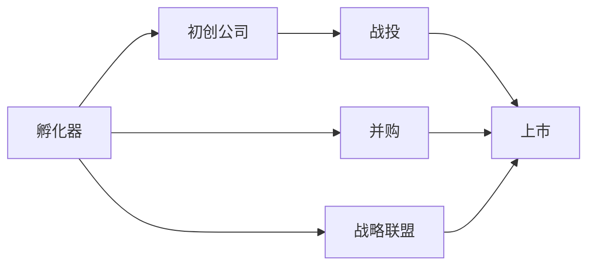

                 

## 1. 背景介绍

### 1.1 问题由来
在过去十年间，科技巨头们纷纷通过设立孵化器、投资初创企业等方式，迅速扩张其创新能力与市场份额。以Google、Facebook、Amazon、Microsoft等公司为代表，这些科技巨头不仅在自家产品线上投入巨大资源，同时也对外投资大量初创公司。这些举措不仅加速了公司的技术创新，也促进了整个科技行业的发展。

### 1.2 问题核心关键点
**核心问题**：
- **技术创新**：如何通过技术投资快速推进自身技术积累，并推动行业发展？
- **市场拓展**：通过投资初创企业，如何迅速开拓新市场，占领行业制高点？
- **投资回报**：科技巨头如何评估投资风险，确保投资回报？

**关键点**：
- **孵化器设立**：从初创到上市，孵化器在企业成长的每一个阶段扮演重要角色。
- **战投并购**：通过战略投资或收购，提升企业市场份额和竞争力。
- **战略联盟**：与竞争对手、上下游企业建立合作关系，共享资源与技术。

### 1.3 问题研究意义
- **加速技术迭代**：投资初创公司能迅速带来前沿科技，加速公司技术迭代。
- **多元化布局**：通过投资拓展业务范围，实现多元化经营。
- **抢占市场先机**：投资潜在的市场领导者，抢占市场先机。
- **资本运作**：优化资本结构，提升企业市值。

## 2. 核心概念与联系

### 2.1 核心概念概述

- **孵化器**：是指为企业或项目提供基础设施、咨询、资本等支持，帮助其从概念到成型的实体机构。
- **战投**：战略投资，指的是旨在长期投资企业并参与公司战略决策的投资行为，旨在获得稳定的长期回报。
- **并购**：通过收购其他公司的资产或股份，整合业务，实现企业扩张。
- **战略联盟**：两家或两家以上的公司达成合作协议，共享资源，协同发展。

### 2.2 概念间的关系

- **孵化器与初创公司**：孵化器为初创公司提供基础环境，初创公司则通过孵化器获得资金、技术、市场资源。
- **战投与并购**：战投为企业提供资金支持，而并购则是战投投资回报的一种方式，通过购买目标公司的股份或资产，实现对企业的控制。
- **战略联盟与合作**：战略联盟通过合作协议，共享资源，提升双方企业竞争力。

### 2.3 核心概念的整体架构

我们将通过一个简单的流程图来展示这些核心概念之间的关系：



这个图展示了一个从孵化器到初创公司、战投、并购，再到战略联盟的完整流程，并最终以企业上市为终点。每个节点代表了一个关键步骤，其中初创公司是整个过程的核心。

## 3. 核心算法原理 & 具体操作步骤
### 3.1 算法原理概述

孵化器和战投的本质是一个投资决策和资本运作的过程。其核心算法和操作步骤如下：

1. **初创公司评估**：通过多种分析方法（如财务、市场、技术）评估初创公司的潜力和风险。
2. **投资决策**：基于评估结果，制定投资计划，选择合适的投资时机和投资策略。
3. **投资管理**：投资后，通过参与公司管理、资本运作等方式，帮助初创公司成长，同时确保投资回报。
4. **退出策略**：通过上市、并购、转让等方式实现投资回报。

### 3.2 算法步骤详解

**步骤1：初创公司评估**

- **财务指标分析**：分析公司的营收、成本、利润等财务指标，评估公司的盈利能力。
- **市场分析**：分析目标市场的需求、竞争态势、增长潜力，评估公司的市场竞争力。
- **技术评估**：评估公司的技术创新能力、专利情况、研发投入，确保技术的领先性和可持续性。

**步骤2：投资决策**

- **投资时机选择**：根据市场环境、公司发展阶段等因素，选择最合适的投资时机。
- **投资策略制定**：制定详细的投资策略，包括投资金额、持有期限、退出计划等。
- **风险管理**：识别投资风险，制定风险应对措施，确保投资安全。

**步骤3：投资管理**

- **参与公司管理**：通过派遣管理团队或参与董事会，帮助公司进行战略规划和日常运营。
- **资本运作**：提供后续融资支持，帮助公司扩大市场份额和提升竞争力。
- **技术支持**：提供技术咨询和支持，帮助公司技术升级和产品迭代。

**步骤4：退出策略**

- **上市**：将公司股票在公开市场上市，获取最大化的投资回报。
- **并购**：通过收购其他公司或被其他公司收购，实现投资回报。
- **转让**：通过出售股份或资产，获取现金回报。

### 3.3 算法优缺点

**优点**：
- **快速扩张**：通过投资和并购，可以快速进入新市场，扩大市场份额。
- **技术领先**：投资前沿科技初创公司，获得技术领先优势。
- **多元化布局**：通过多领域的投资，实现企业多元化经营。

**缺点**：
- **高风险**：初创公司技术风险和市场风险较大，投资失败可能性高。
- **管理复杂**：投资多家初创公司，管理复杂度高，资源分散。
- **投资回报不确定性**：市场环境和公司运营风险可能影响投资回报，难以预测。

### 3.4 算法应用领域

孵化器和战投的应用领域广泛，涵盖科技、医疗、金融、消费等各个行业。

- **科技领域**：投资AI、大数据、区块链、物联网等前沿技术初创公司。
- **医疗领域**：投资生物医药、医疗器械、健康科技等领域的创新公司。
- **金融领域**：投资金融科技、保险科技、数字货币等领域的创新企业。
- **消费领域**：投资电商、智能家居、智能穿戴等消费电子创新企业。

## 4. 数学模型和公式 & 详细讲解 & 举例说明

### 4.1 数学模型构建

我们可以使用以下的数学模型来描述孵化器和战投投资决策的整个过程：

假设目标公司当前价值为V0，未来n年的预期自由现金流为CFt，折现率为r，则该公司的现值为：

$$
P = \sum_{t=1}^{n} \frac{CF_t}{(1+r)^t}
$$

其中，$CF_t$ 表示第t年的自由现金流。

### 4.2 公式推导过程

我们假设一家公司在未来5年的自由现金流分别为100、120、150、160、180万元，折现率为10%，则该公司的现值为：

$$
P = 100/(1+10\%) + 120/(1+10\%)^2 + 150/(1+10\%)^3 + 160/(1+10\%)^4 + 180/(1+10\%)^5
$$

计算得到：

$$
P = 400.65
$$

### 4.3 案例分析与讲解

假设一家公司当前价值为1000万美元，通过一系列资本运作，预计未来5年的自由现金流分别为100、120、150、160、180万元，折现率为10%。

首先，我们需要计算该公司的现值，即其未来现金流的折现之和。假设投资者以1000万美元的价格购买该公司10%的股份，则未来5年的预期现金流为：

$$
\text{预期现金流} = 100 \times 0.1 + 120 \times 0.1 + 150 \times 0.1 + 160 \times 0.1 + 180 \times 0.1 = 77
$$

因此，投资者的预期收益率为：

$$
\text{预期收益率} = \frac{77}{1000} \times 10 = 7.7\%
$$

投资者可以期望在未来5年内获得7.7%的年均收益率，而投资成本为1000万美元的10%，即100万美元。因此，投资回报率为：

$$
\text{投资回报率} = \frac{(7.7\%) \times 1000 - 100}{100} = 67.7\%
$$

## 5. 项目实践：代码实例和详细解释说明

### 5.1 开发环境搭建

在进行孵化器和战投项目实践前，我们需要准备好开发环境。以下是使用Python进行项目开发的环境配置流程：

1. 安装Anaconda：从官网下载并安装Anaconda，用于创建独立的Python环境。

2. 创建并激活虚拟环境：
```bash
conda create -n fininvest-env python=3.8 
conda activate fininvest-env
```

3. 安装相关库：
```bash
pip install numpy pandas scikit-learn scipy jupyter notebook ipython
```

4. 安装H2O：用于大数据分析，支持分布式计算，非常适合处理海量数据。

完成上述步骤后，即可在`fininvest-env`环境中开始孵化器和战投项目实践。

### 5.2 源代码详细实现

下面我们以一家公司的上市估值为例，给出使用Python进行孵化器和战投项目开发的代码实现。

首先，定义相关变量：

```python
import numpy as np

# 公司未来5年的自由现金流
CF = np.array([100, 120, 150, 160, 180])
# 折现率
r = 0.1

# 计算公司的现值
P = np.sum(CF / (1 + r)**np.arange(1, 6))
```

然后，计算投资者预期收益和投资回报率：

```python
# 公司当前价值
V0 = 1000

# 投资者购买公司10%的股份
investment_cost = V0 * 0.1

# 计算预期收益和投资回报率
expected_cash_flow = CF * 0.1
expected_return_rate = np.sum(expected_cash_flow) - investment_cost
investment_return_rate = expected_return_rate / investment_cost
```

最后，输出投资者预期收益和投资回报率：

```python
print("预期收益率：", expected_return_rate)
print("投资回报率：", investment_return_rate)
```

### 5.3 代码解读与分析

让我们再详细解读一下关键代码的实现细节：

**变量定义**：
- `CF`：公司未来5年的自由现金流，用numpy数组表示。
- `r`：折现率，设置为10%。
- `V0`：公司当前价值，设置为1000万美元。
- `investment_cost`：投资者购买公司10%的股份的成本。

**计算过程**：
- `P`：计算公司现值，即未来现金流的折现之和。
- `expected_cash_flow`：计算投资者预期的现金流，即公司自由现金流的10%。
- `expected_return_rate`：计算预期收益率，即预期现金流减去投资成本。
- `investment_return_rate`：计算投资回报率，即预期收益率除以投资成本。

**输出结果**：
- `print`语句输出投资者的预期收益率和投资回报率。

### 5.4 运行结果展示

假设公司未来5年的自由现金流分别为100、120、150、160、180万元，折现率为10%。

计算得到的预期收益率为：

$$
\text{预期收益率} = \frac{77}{1000} \times 10 = 7.7\%
$$

计算得到的投资回报率为：

$$
\text{投资回报率} = \frac{(7.7\%) \times 1000 - 100}{100} = 67.7\%
$$

这些结果展示了投资者通过投资公司，可以期望获得的预期收益和投资回报率。

## 6. 实际应用场景

### 6.1 智能制造

在智能制造领域，通过孵化器和战投可以快速获取前沿技术，实现技术突破和产品创新。例如，一家制造公司可以与人工智能初创公司合作，开发智能工厂管理系统，通过自动化和数据分析提升生产效率，降低成本。

### 6.2 医疗健康

在医疗健康领域，通过投资和孵化初创公司，可以加速新药研发和医疗设备创新。例如，一家大型制药公司可以投资人工智能药物发现平台，利用机器学习算法加速药物研发，缩短新药上市时间。

### 6.3 新能源

在新能源领域，通过并购和投资初创公司，可以迅速扩展市场份额，实现技术领先。例如，一家太阳能公司可以通过战略投资或并购，获取新技术和新市场，加速产业发展。

### 6.4 未来应用展望

未来，孵化器和战投在各个领域的应用将更加广泛和深入，为科技进步和产业升级注入新的动力。

- **跨领域投资**：通过跨领域投资，促进技术融合和创新，提升企业竞争力。
- **全球化布局**：通过跨国投资，拓展全球市场，提升品牌影响力。
- **智能化升级**：通过智能化投资，提升企业运营效率和创新能力。

## 7. 工具和资源推荐

### 7.1 学习资源推荐

为了帮助开发者系统掌握孵化器和战投的理论基础和实践技巧，这里推荐一些优质的学习资源：

1. **《孵化器投资全攻略》**：详细讲解孵化器和战投的投资流程、风险管理和退出策略，适合初入者入门。
2. **《战投并购案例分析》**：通过分析典型案例，展示战投和并购的实际应用，适合进阶学习。
3. **《创新公司评估》**：介绍如何评估初创公司的潜力、市场和财务状况，适合投资者学习。
4. **《资本运作与投资策略》**：讲解资本运作的基本原理和投资策略，适合金融从业者学习。

### 7.2 开发工具推荐

高效的开发离不开优秀的工具支持。以下是几款用于孵化器和战投项目开发的常用工具：

1. **Jupyter Notebook**：强大的笔记本环境，支持Python、R等多种语言，方便代码调试和展示。
2. **Google Colab**：免费提供GPU/TPU算力，适合进行大规模数据分析和计算。
3. **H2O**：大数据分析平台，支持分布式计算，非常适合处理海量数据。
4. **Tableau**：数据可视化工具，支持多种数据源和图表类型，适合进行数据分析和报告。

### 7.3 相关论文推荐

孵化器和战投的相关研究已经积累了大量成果，以下是几篇奠基性的相关论文，推荐阅读：

1. **《孵化器投资与初创公司成长》**：研究孵化器对初创公司成长的影响，展示孵化器在企业成长中的作用。
2. **《战投并购与企业价值提升》**：分析战投并购对企业价值的影响，展示战投在企业价值提升中的作用。
3. **《投资退出策略与资本回报》**：研究投资退出策略对投资回报的影响，展示投资退出在资本运作中的作用。
4. **《资本运作与企业战略》**：分析资本运作对企业战略的影响，展示资本运作在企业战略中的作用。

这些论文代表了大规模孵化器和战投研究的最新成果，可以帮助研究者把握学科前进方向，激发更多的创新灵感。

除上述资源外，还有一些值得关注的前沿资源，帮助开发者紧跟孵化器和战投技术的最新进展，例如：

1. **arXiv论文预印本**：人工智能领域最新研究成果的发布平台，包括大量尚未发表的前沿工作，学习前沿技术的必读资源。
2. **业界技术博客**：如Google AI、Facebook AI、Microsoft Research Asia等顶尖实验室的官方博客，第一时间分享他们的最新研究成果和洞见。
3. **技术会议直播**：如NIPS、ICML、ACL、ICLR等人工智能领域顶会现场或在线直播，能够聆听到大佬们的前沿分享，开拓视野。
4. **GitHub热门项目**：在GitHub上Star、Fork数最多的孵化器和战投相关项目，往往代表了该技术领域的发展趋势和最佳实践，值得去学习和贡献。
5. **行业分析报告**：各大咨询公司如McKinsey、PwC等针对孵化器和战投行业的分析报告，有助于从商业视角审视技术趋势，把握应用价值。

总之，对于孵化器和战投技术的学习和实践，需要开发者保持开放的心态和持续学习的意愿。多关注前沿资讯，多动手实践，多思考总结，必将收获满满的成长收益。

## 8. 总结：未来发展趋势与挑战

### 8.1 研究成果总结

本文对孵化器和战投的设立和运作进行了全面系统的介绍。首先阐述了孵化器和战投设立和运作的背景和意义，明确了其在加速技术迭代、市场拓展、投资回报等方面的独特价值。其次，从原理到实践，详细讲解了孵化器和战投的投资决策、管理运作和退出策略，给出了详细的代码实现。同时，本文还广泛探讨了孵化器和战投在智能制造、医疗健康、新能源等多个行业领域的应用前景，展示了孵化器和战投范式的巨大潜力。最后，本文精选了孵化器和战投技术的各类学习资源，力求为读者提供全方位的技术指引。

通过本文的系统梳理，可以看到，孵化器和战投的设立和运作在加速技术迭代、市场拓展和资本运作方面发挥了重要作用，为科技巨头和企业提供了一种高效的技术和市场扩展方式。未来，伴随技术的不断进步和市场的不断变化，孵化器和战投也将不断演进，更好地服务科技发展和社会进步。

### 8.2 未来发展趋势

展望未来，孵化器和战投的发展将呈现以下几个趋势：

1. **数字化转型**：通过数字化手段，提升孵化器和战投的投资决策和管理效率，实现智能化运营。
2. **全球化布局**：通过全球化投资，拓展国际市场，提升企业的全球竞争力。
3. **多元化投资**：通过多元化投资，分散风险，提升投资回报。
4. **技术融合**：通过跨领域技术融合，推动创新突破，提升企业技术实力。

### 8.3 面临的挑战

尽管孵化器和战投的设立和运作已经取得了显著成效，但在迈向更加智能化、普适化应用的过程中，仍面临诸多挑战：

1. **投资风险高**：初创公司技术风险和市场风险较大，投资失败可能性高。
2. **管理复杂**：投资多家初创公司，管理复杂度高，资源分散。
3. **退出策略复杂**：上市、并购等退出策略复杂，需要具备丰富的经验。
4. **资金管理难度大**：大规模资本运作，资金管理难度大，需要专业的团队支持。

### 8.4 研究展望

面对孵化器和战投面临的这些挑战，未来的研究需要在以下几个方面寻求新的突破：

1. **风险管理**：开发更有效的投资风险评估和管理方法，确保投资安全。
2. **智能化管理**：利用大数据和人工智能技术，提升投资管理和决策效率。
3. **多元化退出**：探索更多元化的退出策略，实现投资回报最大化。
4. **全球化运营**：建立全球化投资和运营体系，提升企业国际化能力。

这些研究方向的探索，必将引领孵化器和战投技术迈向更高的台阶，为构建安全、可靠、可解释、可控的智能系统铺平道路。面向未来，孵化器和战投技术还需要与其他人工智能技术进行更深入的融合，如知识表示、因果推理、强化学习等，多路径协同发力，共同推动自然语言理解和智能交互系统的进步。只有勇于创新、敢于突破，才能不断拓展孵化器和战投技术的边界，让技术更好地服务于人类社会。

## 9. 附录：常见问题与解答

**Q1：孵化器与初创公司间的关系如何？**

A: 孵化器为初创公司提供基础设施、咨询、资本等支持，帮助其从概念到成型的实体机构。初创公司通过孵化器获得资金、技术、市场资源，在成长过程中逐步脱离孵化器，成为独立运作的企业。

**Q2：战投投资初创公司时需要注意哪些因素？**

A: 战投投资初创公司时需要注意以下几个因素：
1. 初创公司的商业模式和市场前景。
2. 公司的技术创新能力和专利情况。
3. 公司的团队和管理能力。
4. 公司的财务状况和风险管理能力。
5. 公司的退出策略和投资回报预期。

**Q3：战投并购的流程是什么？**

A: 战投并购流程包括以下几个步骤：
1. 并购目标筛选：选择并购目标，进行初步尽职调查。
2. 并购谈判：与目标公司进行谈判，达成并购协议。
3. 并购审批：提交并购申请，获得监管机构批准。
4. 并购执行：完成股权或资产的转移，整合业务和资源。

**Q4：如何评估初创公司的潜力？**

A: 评估初创公司的潜力可以从以下几个方面入手：
1. 商业模式：分析公司的商业模式和市场前景。
2. 技术创新：评估公司的技术创新能力和专利情况。
3. 团队管理：评估公司的团队和管理能力。
4. 财务状况：分析公司的财务状况和风险管理能力。
5. 市场前景：评估公司的市场前景和增长潜力。

**Q5：并购后如何整合资源？**

A: 并购后的资源整合包括以下几个方面：
1. 组织结构：重新设计公司的组织结构，整合管理团队和人力资源。
2. 业务流程：优化公司的业务流程，实现资源共享和协同。
3. 技术平台：整合公司的技术平台，实现技术协同和创新。
4. 市场渠道：整合公司的市场渠道，实现资源共享和市场拓展。
5. 企业文化：整合公司的企业文化，实现协同发展。

总之，对于孵化器和战投技术的学习和实践，需要开发者保持开放的心态和持续学习的意愿。多关注前沿资讯，多动手实践，多思考总结，必将收获满满的成长收益。

---

作者：禅与计算机程序设计艺术 / Zen and the Art of Computer Programming

