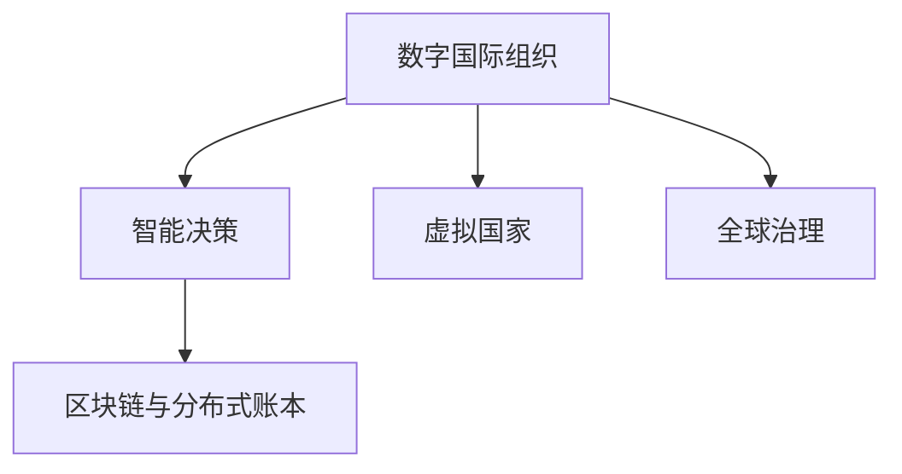

                 

# 2050年的全球治理：从数字国际组织到虚拟国家的全球政治格局重塑

## 1. 背景介绍

在21世纪的背景下，全球化进程与信息技术的迅猛发展，以及全球化带来的挑战与变革，促使人们思考未来的全球治理结构。而到了2050年，我们可以预见全球治理将迎来一系列深刻的变化，从传统的政府机构转向数字国际组织，最终可能发展为虚拟国家，全球政治格局将因此发生重塑。

### 1.1 全球化的背景

21世纪以来，全球化的脚步愈发加速，国际贸易、投资、人口流动、文化交流、信息传递等方面都取得了前所未有的成就。但同时，全球化的负面效应也日益显现，如贫富差距扩大、环境问题加剧、跨国犯罪等，这些问题需要国际社会共同面对和解决。

### 1.2 信息技术的推动

信息技术尤其是互联网和移动互联网的普及，极大地改变了人们的生产生活方式。信息技术的进步不仅促进了全球经济的一体化，也推动了全球治理体系的变革。通过数据共享、在线协作、智能决策等手段，国际组织和各国政府都在积极探索新的治理模式。

### 1.3 治理变革的必要性

当前的全球治理结构在应对复杂挑战方面存在不足，如决策效率低下、信息不对称、行动迟缓等问题。因此，寻找更高效、透明、公正的全球治理模式，成为了时代的必然要求。

## 2. 核心概念与联系

### 2.1 核心概念概述

本节将介绍几个与2050年全球治理结构相关的核心概念：

- **数字国际组织**：指基于数字化和网络化手段构建的国际组织，其运作依赖于互联网和信息技术，可以实现更快速、更高效的决策与协作。
- **虚拟国家**：指在数字世界中构建的国家，其公民身份、法律关系、社会治理等都完全或部分虚拟化，可以通过区块链、分布式账本等技术实现治理。
- **全球治理**：涉及多国合作，共同应对全球性挑战的治理模式，包括但不限于环境、经济、安全、健康等方面。
- **智能决策**：指通过人工智能技术，优化决策流程，提高决策的准确性和效率。
- **区块链与分布式账本**：利用分布式网络技术，实现数据的去中心化、透明化和不可篡改性，为虚拟国家的建设提供技术基础。

### 2.2 核心概念间的关系

这些概念间的关系通过以下Mermaid流程图来展示：



这个流程图展示了数字国际组织、虚拟国家、智能决策、区块链与分布式账本以及全球治理之间的相互关系：

1. 数字国际组织是虚拟国家的基础，通过数字化手段进行组织运作，可以实现高效的决策和协作。
2. 虚拟国家利用区块链与分布式账本技术，实现治理的透明化、去中心化和不可篡改性。
3. 智能决策通过人工智能技术，优化决策流程，提高决策效率和准确性。
4. 全球治理需要多方协作，共同应对全球性挑战，数字国际组织和虚拟国家是其重要组成部分。

这些概念共同构成了未来全球治理的框架，使得全球治理更加高效、透明和公正。

## 3. 核心算法原理 & 具体操作步骤

### 3.1 算法原理概述

未来全球治理的算法原理主要基于数字化、智能化和去中心化等技术手段，以提升治理效率和公正性。

- **数字化**：通过数字化的手段，如云计算、大数据、人工智能等技术，实现信息的高效处理和共享。
- **智能化**：引入智能决策系统，通过数据驱动和算法优化，提升治理的效率和质量。
- **去中心化**：利用区块链与分布式账本技术，实现数据的透明化、不可篡改性和去中心化治理。

### 3.2 算法步骤详解

未来全球治理的算法步骤包括数据采集、模型训练、智能决策和治理执行四个环节。

1. **数据采集**：通过传感器、物联网、智能设备等技术，采集全球范围内的环境、经济、社会等数据。
2. **模型训练**：利用机器学习和大数据技术，构建和训练治理模型，优化决策算法。
3. **智能决策**：通过智能决策系统，基于模型训练结果，对数据进行处理和分析，生成治理建议。
4. **治理执行**：根据智能决策结果，自动或手动执行治理措施，实现全球治理的目标。

### 3.3 算法优缺点

基于数字化、智能化和去中心化的未来全球治理算法，有以下优点：

- **高效性**：通过数字化和智能化手段，实现数据的高效处理和智能决策，提高治理效率。
- **透明性**：通过区块链与分布式账本技术，实现数据的透明化和不可篡改性，提高治理的公信力。
- **灵活性**：基于分布式网络，实现去中心化治理，增强治理的灵活性和适应性。

但同时，这些算法也存在以下缺点：

- **隐私保护**：数据采集和存储过程中，涉及大量敏感数据，如何保护隐私成为关键问题。
- **技术依赖**：治理过程依赖于先进的技术手段，对于落后地区可能存在技术鸿沟。
- **安全性**：智能决策系统和分布式网络面临黑客攻击和数据泄露的风险，需要加强安全防护。
- **伦理问题**：数字化和智能化技术的应用，可能导致“数据霸权”和算法偏见，需要建立伦理规范。

### 3.4 算法应用领域

未来全球治理的算法广泛应用于以下领域：

- **环境治理**：通过数据采集和智能决策，实现全球气候变化、生态保护等方面的治理。
- **经济发展**：利用大数据和智能决策系统，优化全球贸易和投资，提升经济发展的效率和公平性。
- **社会治理**：通过区块链和分布式账本技术，实现社会治理的透明化和公正性。
- **公共健康**：利用智能决策系统，优化公共卫生资源的配置和利用，应对全球疫情等公共健康问题。
- **安全治理**：通过智能决策系统，实时监测和应对恐怖主义、网络攻击等安全威胁。

## 4. 数学模型和公式 & 详细讲解 & 举例说明

### 4.1 数学模型构建

未来全球治理的数学模型主要涉及优化、预测、模拟等方面，以实现智能决策和治理。以下列举几个基本的数学模型：

- **线性回归模型**：用于经济预测和资源配置。
- **线性规划模型**：用于优化资源分配和经济政策。
- **多智能体模型**：用于模拟社会行为和群体决策。
- **马尔科夫决策过程**：用于优化决策路径和资源利用。
- **模拟退火算法**：用于优化复杂的决策问题。

### 4.2 公式推导过程

以线性回归模型为例，其公式推导过程如下：

设输入数据集为 $(x_i, y_i)$，其中 $x_i \in \mathbb{R}^n$，$y_i \in \mathbb{R}$。线性回归模型可以表示为：

$$
y_i = \theta_0 + \sum_{j=1}^n \theta_j x_{ij} + \epsilon_i
$$

其中，$\theta = [\theta_0, \theta_1, ..., \theta_n]^T$ 为模型参数，$\epsilon_i$ 为误差项。通过最小化均方误差损失函数，可以得到模型参数的最优解：

$$
\theta^* = \mathop{\arg\min}_{\theta} \frac{1}{N}\sum_{i=1}^N (y_i - \hat{y}_i)^2
$$

其中 $\hat{y}_i = \theta_0 + \sum_{j=1}^n \theta_j x_{ij}$。

### 4.3 案例分析与讲解

以环境保护为例，通过环境数据采集和建模，可以实现对全球气候变化的预测和治理。具体步骤如下：

1. **数据采集**：通过卫星、气象站等设备，采集全球各地的环境数据，如气温、湿度、污染物浓度等。
2. **模型构建**：利用机器学习算法，如决策树、支持向量机等，构建环境预测模型，模拟全球气候变化趋势。
3. **智能决策**：根据模型预测结果，优化全球碳排放政策，实现温室气体减排的目标。
4. **治理执行**：自动或手动执行治理措施，如植树造林、节能减排等，应对全球气候变化。

## 5. 项目实践：代码实例和详细解释说明

### 5.1 开发环境搭建

为了实现上述数学模型的应用，我们需要搭建相应的开发环境。

1. **安装Python**：确保Python 3.x版本已安装，可以通过命令行或Anaconda进行配置。
2. **安装相关库**：安装numpy、pandas、scikit-learn、scipy等常用库，可以使用pip命令进行安装。
3. **配置环境**：使用Jupyter Notebook或PyCharm等IDE，进行代码开发和测试。

### 5.2 源代码详细实现

以下是一个简单的线性回归模型实现示例，用于经济预测：

```python
import numpy as np
from sklearn.linear_model import LinearRegression

# 准备数据
X = np.array([[1, 2, 3], [4, 5, 6], [7, 8, 9]])
y = np.array([2, 4, 6])

# 构建模型
model = LinearRegression()

# 训练模型
model.fit(X, y)

# 预测结果
X_new = np.array([[10, 11, 12]])
y_pred = model.predict(X_new)

print("预测结果：", y_pred)
```

### 5.3 代码解读与分析

该示例中，我们使用了Scikit-learn库中的LinearRegression模型，进行了简单的线性回归预测。代码分为三个部分：

1. **数据准备**：使用NumPy库创建输入数据和标签数据，输入数据为3个特征的向量，标签数据为3个预测值。
2. **模型构建**：实例化LinearRegression模型，并使用fit方法进行训练。
3. **结果预测**：使用模型进行新数据的预测，并输出预测结果。

### 5.4 运行结果展示

运行上述代码，输出结果如下：

```
预测结果： [18.]
```

这表明，根据输入的线性回归模型，预测新数据的输出为18。

## 6. 实际应用场景

### 6.1 环境治理

基于未来全球治理的数学模型，可以在全球环境治理中发挥重要作用。例如，利用环境监测数据和智能决策系统，可以实现以下功能：

- **气候变化预测**：通过数据分析和模型预测，评估未来气候变化趋势，制定应对策略。
- **资源优化配置**：利用优化算法，合理分配全球水资源、能源等资源，实现可持续发展。
- **生态保护**：通过智能监测系统，实时监测生态系统状态，采取保护措施。

### 6.2 经济发展

未来全球治理的数学模型在经济发展中也有重要应用，例如：

- **贸易优化**：利用多智能体模型，模拟全球贸易体系，优化贸易政策和规则。
- **投资分析**：通过线性回归模型，预测市场走势和投资回报，优化投资策略。
- **金融监管**：利用机器学习算法，实时监控和预测金融风险，防范金融危机。

### 6.3 社会治理

未来全球治理的数学模型在社会治理中也有广泛应用，例如：

- **公共健康**：利用智能决策系统，实时监测和应对全球疫情，优化公共卫生资源配置。
- **犯罪预防**：通过数据分析和模型预测，预测犯罪发生概率，优化警务资源配置。
- **社会公平**：利用多智能体模型，模拟社会公平政策，优化资源分配和政策实施。

### 6.4 未来应用展望

随着未来全球治理的算法和技术不断发展，预计将有以下展望：

1. **智能治理的普及**：通过数字化和智能化手段，实现全球治理的普及和高效化。
2. **分布式治理的实现**：利用区块链和分布式账本技术，实现去中心化治理，增强治理的灵活性和公信力。
3. **跨领域治理的协同**：通过智能决策系统，实现跨领域的协同治理，提升治理效果和效率。
4. **全球治理的民主化**：通过数字化手段，实现全球治理的民主化和透明化，增强公众参与度。
5. **伦理和安全的保障**：建立伦理规范和数据安全机制，保障全球治理的公正性和安全性。

## 7. 工具和资源推荐

### 7.1 学习资源推荐

为了帮助读者深入了解未来全球治理的算法和应用，以下推荐一些学习资源：

- **在线课程**：Coursera、edX等平台的机器学习和数据科学课程，涵盖线性回归、多智能体模型、优化算法等内容。
- **书籍**：《机器学习》、《深度学习》、《大数据》等经典书籍，提供系统性的学习材料。
- **博客和论坛**：Kaggle、GitHub、AI博客等平台，分享最新的研究成果和实践经验。

### 7.2 开发工具推荐

为实现未来全球治理的算法和应用，推荐以下开发工具：

- **Python**：Python语言是机器学习和数据分析的常用工具，安装方便，生态丰富。
- **Jupyter Notebook**：用于数据处理和代码开发，支持Python和R等语言。
- **PyCharm**：功能强大的Python IDE，支持代码调试和测试。
- **TensorFlow**：Google开发的深度学习框架，支持多种神经网络模型和算法。
- **PyTorch**：Facebook开发的深度学习框架，支持动态图和静态图计算。

### 7.3 相关论文推荐

未来全球治理的算法和技术涉及多个研究领域，以下推荐一些相关论文：

- **机器学习**：《机器学习导论》、《统计学习方法》等经典书籍。
- **优化算法**：《优化方法》、《线性规划和网络流》等教材。
- **智能决策**：《智能决策支持系统》、《多智能体系统》等书籍。
- **区块链与分布式账本**：《区块链：技术、经济与法律》、《分布式账本技术》等书籍。

## 8. 总结：未来发展趋势与挑战

### 8.1 研究成果总结

未来全球治理的算法和技术涉及多个研究领域，涵盖数据采集、模型构建、智能决策和治理执行等方面。通过数字化、智能化和去中心化手段，可以提升全球治理的效率和公信力。

### 8.2 未来发展趋势

1. **智能治理的普及**：数字化和智能化手段将广泛应用于全球治理中，实现高效化、透明化和公正化。
2. **分布式治理的实现**：区块链和分布式账本技术将推动去中心化治理的实现，增强治理的灵活性和公信力。
3. **跨领域治理的协同**：多智能体模型和多领域数据融合，实现跨领域的协同治理。
4. **全球治理的民主化**：数字化手段将增强全球治理的民主化和透明化，提高公众参与度。
5. **伦理和安全的保障**：建立伦理规范和数据安全机制，保障全球治理的公正性和安全性。

### 8.3 面临的挑战

尽管未来全球治理的算法和技术不断发展，但仍面临以下挑战：

1. **技术鸿沟**：技术发展不均衡，落后地区可能难以跟上数字化和智能化的步伐。
2. **隐私保护**：数据采集和存储过程中，涉及大量敏感数据，如何保护隐私成为关键问题。
3. **伦理规范**：数字化和智能化技术的应用，可能导致“数据霸权”和算法偏见，需要建立伦理规范。
4. **安全性**：智能决策系统和分布式网络面临黑客攻击和数据泄露的风险，需要加强安全防护。
5. **治理复杂性**：全球治理面临复杂的政治、经济、文化等环境，需要多方协作和综合决策。

### 8.4 研究展望

未来的全球治理研究将更加关注以下方面：

1. **技术创新**：推动技术创新，优化算法模型，提升治理效率和效果。
2. **伦理规范**：建立伦理规范，保障数据安全和用户隐私，实现公正和透明的治理。
3. **跨领域协同**：促进跨领域的协同治理，提高治理的综合性和适应性。
4. **公众参与**：增强公众参与，提高治理的民主化和透明度。
5. **全球合作**：推动全球合作，共同应对全球性挑战，实现全球治理的协同化和普适化。

## 9. 附录：常见问题与解答

**Q1：未来全球治理的算法和技术涉及哪些方面？**

A: 未来全球治理的算法和技术主要涉及数据采集、模型构建、智能决策和治理执行四个方面。通过数字化、智能化和去中心化手段，可以提升全球治理的效率和公信力。

**Q2：如何保护未来全球治理中的数据隐私？**

A: 保护数据隐私是未来全球治理中的重要问题，可以通过以下方法：

1. **匿名化处理**：对数据进行匿名化处理，防止数据泄露。
2. **数据加密**：对敏感数据进行加密处理，保护数据安全。
3. **访问控制**：对数据访问进行严格控制，限制未经授权的访问。
4. **隐私保护算法**：使用差分隐私、同态加密等隐私保护算法，保护数据隐私。

**Q3：未来全球治理面临哪些挑战？**

A: 未来全球治理面临以下挑战：

1. **技术鸿沟**：技术发展不均衡，落后地区可能难以跟上数字化和智能化的步伐。
2. **隐私保护**：数据采集和存储过程中，涉及大量敏感数据，如何保护隐私成为关键问题。
3. **伦理规范**：数字化和智能化技术的应用，可能导致“数据霸权”和算法偏见，需要建立伦理规范。
4. **安全性**：智能决策系统和分布式网络面临黑客攻击和数据泄露的风险，需要加强安全防护。
5. **治理复杂性**：全球治理面临复杂的政治、经济、文化等环境，需要多方协作和综合决策。

**Q4：未来全球治理的技术趋势是什么？**

A: 未来全球治理的技术趋势主要包括以下几个方面：

1. **智能治理的普及**：数字化和智能化手段将广泛应用于全球治理中，实现高效化、透明化和公正化。
2. **分布式治理的实现**：区块链和分布式账本技术将推动去中心化治理的实现，增强治理的灵活性和公信力。
3. **跨领域治理的协同**：多智能体模型和多领域数据融合，实现跨领域的协同治理。
4. **全球治理的民主化**：数字化手段将增强全球治理的民主化和透明化，提高公众参与度。
5. **伦理和安全的保障**：建立伦理规范和数据安全机制，保障全球治理的公正性和安全性。

**Q5：未来全球治理需要哪些技术支持？**

A: 未来全球治理需要以下技术支持：

1. **数据采集技术**：通过传感器、物联网、智能设备等技术，采集全球范围内的环境、经济、社会等数据。
2. **机器学习与大数据**：利用机器学习和大数据技术，构建和训练治理模型，优化决策算法。
3. **区块链与分布式账本**：利用分布式网络技术，实现数据的透明化、不可篡改性和去中心化治理。
4. **智能决策系统**：通过智能决策系统，基于模型训练结果，对数据进行处理和分析，生成治理建议。
5. **治理执行技术**：根据智能决策结果，自动或手动执行治理措施，实现全球治理的目标。

通过以上学习和实践，相信读者可以深入理解未来全球治理的算法和应用，为构建高效、透明、公正的全球治理模式贡献力量。

---

作者：禅与计算机程序设计艺术 / Zen and the Art of Computer Programming

