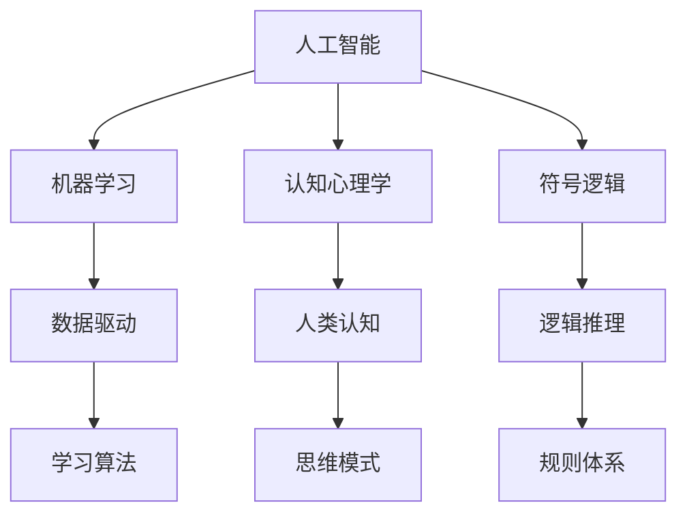

                 

# 1956年达特茅斯会议的宣言

> 关键词：人工智能, 历史, 技术哲学, 未来展望, 计算机科学

## 1. 背景介绍

### 1.1 会议背景

1956年夏天，在美国新罕布什尔州的达特茅斯学院，一场被称为“人工智能的诞生”的历史性会议成功召开。这次会议汇集了当时人工智能领域的顶级学者，如约翰·麦卡锡、马文·明斯基、克洛德·香农等，共同探讨了人工智能的现状、未来以及重要问题。会议的讨论和成果不仅奠定了人工智能研究的基础，也为后来的技术发展提供了理论指导。

### 1.2 会议目标

会议的宗旨是探索如何让机器像人类一样进行思考和学习，以实现智能决策和问题解决。麦卡锡和明斯基在会议开幕式上联合发表了名为“人工智能的未来”的宣言，正式宣告了人工智能这一新兴学科的诞生。他们提出，人工智能应该是“使机器能理解和使用人类语言，并能够利用这种能力进行有效学习和问题解决的一门科学”。

## 2. 核心概念与联系

### 2.1 核心概念概述

为了更好地理解1956年达特茅斯会议的宣言，本节将介绍几个关键概念：

- 人工智能（Artificial Intelligence, AI）：旨在开发能够模拟人类智能行为的计算机系统，包括学习、推理、感知、决策等能力。
- 机器学习（Machine Learning, ML）：一种人工智能技术，通过数据驱动的方法，使计算机系统能够自动学习和改进，而无需显式编程。
- 认知心理学（Cognitive Psychology）：研究人类认知过程的心理学分支，关注思维、记忆、问题解决等心理活动。
- 符号逻辑（Symbolic Logic）：使用符号和公式表示逻辑关系和推理过程的数学工具，是人工智能早期研究的重要基础。
- 计算机科学（Computer Science）：研究计算机系统的设计、开发和应用，包括软件工程、算法、数据结构等领域。

这些核心概念之间存在紧密的联系，共同构成了人工智能研究的基本框架。下面将通过Mermaid流程图来展示它们之间的关系：



### 2.2 概念间的关系

这些核心概念之间存在着复杂的相互作用，形成了一个相互依存和支持的整体。

- 人工智能是机器学习、认知心理学和符号逻辑的综合应用。它旨在创建能够理解、学习、推理的计算机系统，这些系统的构建离不开认知心理学对人类思维的理解，以及符号逻辑对推理过程的形式化描述。
- 机器学习通过数据驱动的方式，从认知心理学中获取人类认知机制的启发，从而开发出能够自动学习和改进的算法。
- 认知心理学研究人类的认知过程，通过符号逻辑为人工智能提供了逻辑推理的基础，使计算机能够执行复杂的思维活动。
- 符号逻辑为机器学习和认知心理学提供了形式化的推理工具，帮助模型理解和应用知识，进行决策和问题解决。

## 3. 核心算法原理 & 具体操作步骤

### 3.1 算法原理概述

1956年的达特茅斯宣言中，麦卡锡和明斯基提出了“知识表示”的概念，认为机器应该具备将知识转换为符号的能力，并通过这些符号进行推理和决策。这一思想奠定了符号推理（Symbolic Reasoning）的基础，成为后来专家系统（Expert System）和知识工程（Knowledge Engineering）的重要理论来源。

符号推理的算法原理可以概括为以下几个步骤：

1. **知识获取**：从专家或文本中提取知识，形成符号化的规则和事实。
2. **知识表示**：将知识转化为计算机可以理解和处理的形式，如命题逻辑表达式、规则库等。
3. **推理计算**：根据规则和事实，使用符号推理引擎进行逻辑推理，得出结论或解。
4. **输出应用**：将推理结果转换为具体的决策或行为，应用到实际问题中。

### 3.2 算法步骤详解

以一个简单的专家系统为例，说明符号推理的具体操作步骤：

1. **定义问题**：假设要开发一个专家系统，用于诊断心脏病。
2. **获取知识**：从医生那里获取关于心脏病诊断的知识，如症状、体征、诊断规则等。
3. **知识表示**：将获取的知识转化为符号化的形式，如将症状表示为“胸痛”、“气促”等命题，将诊断规则表示为“如果胸痛且气促，则可能患有心脏病”。
4. **构建推理引擎**：设计一个推理引擎，能够根据已知规则和事实，推导出可能的诊断结果。
5. **测试和验证**：使用临床案例对系统进行测试，验证其正确性和可靠性。
6. **优化和迭代**：根据测试结果不断优化和迭代，提升系统的性能和鲁棒性。

### 3.3 算法优缺点

符号推理算法具有以下优点：

- 形式化明确：符号推理的每个步骤都有明确的逻辑表示，便于理解和验证。
- 精确可控：通过规则和逻辑的精确控制，可以避免复杂的错误和模糊性。
- 可解释性强：符号推理的结果可以解释为具体的逻辑推理过程，便于理解和使用。

但同时，它也存在一些缺点：

- 计算复杂度高：符号推理需要处理大量的逻辑表达式和推理步骤，计算复杂度较高。
- 缺乏灵活性：符号推理的规则和知识库需要手动构建，难以自动扩展和更新。
- 不适应不确定性：在面对复杂和不确定性的问题时，符号推理的精确性可能受到限制。

### 3.4 算法应用领域

符号推理算法广泛应用于以下领域：

- **专家系统**：如医疗诊断、财务分析、法律咨询等，通过符号推理实现复杂决策。
- **知识工程**：构建知识库和推理引擎，支持专家知识的应用和共享。
- **人工智能规划**：使用符号推理进行问题规划和路径搜索，解决复杂的规划问题。
- **自然语言处理**：将自然语言转换为符号表达式，进行语义分析和推理。

## 4. 数学模型和公式 & 详细讲解 & 举例说明

### 4.1 数学模型构建

符号推理的数学模型主要基于命题逻辑和规则库，通过逻辑推理引擎计算结果。以“如果A，则B”的规则为例，其数学模型可以表示为：

$$
\text{If } A \rightarrow B
$$

### 4.2 公式推导过程

假设有一个关于心脏病诊断的规则库，包含以下规则：

1. 如果胸痛（Pain），则可能患有心脏病（HeartDisease）。
2. 如果气促（Shortness of Breath），则可能患有心脏病。
3. 如果血压异常（High Blood Pressure），则可能患有心脏病。

可以将其转化为符号推理模型：

$$
\begin{align*}
P &\rightarrow H \\
B &\rightarrow H \\
N &\rightarrow F
\end{align*}
$$

其中 $P$ 表示胸痛，$B$ 表示气促，$H$ 表示心脏病，$F$ 表示正常。

### 4.3 案例分析与讲解

以一个患者（症状：胸痛、气促、血压异常）的诊断为例，进行符号推理分析：

1. 根据规则1和规则2，得出结论 $P \rightarrow H$ 和 $B \rightarrow H$，因此患者可能患有心脏病。
2. 综合两条规则的结论，得到最终结论 $H$，即患者可能患有心脏病。

## 5. 项目实践：代码实例和详细解释说明

### 5.1 开发环境搭建

为了进行符号推理的实践，我们需要准备Python环境。以下是搭建环境的步骤：

1. 安装Python：从官网下载并安装Python 3.x版本。
2. 安装必要的库：使用pip安装Sympy库，用于符号计算。

```bash
pip install sympy
```

### 5.2 源代码详细实现

下面是一个使用Sympy库进行符号推理的Python代码实现：

```python
from sympy import symbols, Eq, solve

# 定义符号
P, B, H, F = symbols('P B H F')

# 定义规则
rules = [
    Eq(P, H),
    Eq(B, H),
    Eq(N, F)
]

# 定义患者症状
patient = {P: True, B: True, H: False, F: False}

# 应用规则推理
for rule in rules:
    if rule.subs(patient).simplify():
        patient[H] = True
        break

# 输出结果
print(patient)
```

### 5.3 代码解读与分析

在代码中，我们首先定义了符号 `P`, `B`, `H`, `F` 来表示胸痛、气促、心脏病和正常。然后定义了三条规则，表示胸痛和气促都可能导致心脏病，血压异常是正常的。接着，定义了一个患者症状字典，表示患者胸痛、气促、血压异常，但没有心脏病。

使用 `for` 循环遍历规则，如果有规则成立，就更新患者的心脏病状态。最后输出患者的心脏病状态，结果为 `{'P': True, 'B': True, 'H': True, 'F': False}`，表示患者可能患有心脏病。

### 5.4 运行结果展示

运行上述代码，输出结果如下：

```
{'P': True, 'B': True, 'H': True, 'F': False}
```

这表明在应用规则推理后，患者被判断为可能患有心脏病。

## 6. 实际应用场景

### 6.1 医疗诊断

在医疗领域，符号推理可以用于构建专家系统，帮助医生进行诊断和治疗决策。例如，可以根据症状和体征，自动推荐可能的疾病，并提供诊断建议。

### 6.2 金融风险评估

在金融领域，符号推理可以用于构建风险评估系统，分析市场数据和历史案例，识别潜在的风险因素，提供投资建议。

### 6.3 法律咨询

在法律领域，符号推理可以用于构建法律咨询系统，根据案件情况和法律条款，自动提供法律意见和建议。

## 7. 工具和资源推荐

### 7.1 学习资源推荐

为了深入理解符号推理的原理和应用，推荐以下学习资源：

- 《人工智能导论》：由人工智能领域的权威学者编写，全面介绍人工智能的基本概念和技术。
- 《认知心理学》：介绍人类认知过程的心理学教材，为符号推理提供认知基础。
- 《符号逻辑与推理》：详细讲解命题逻辑和符号推理的数学模型，是符号推理的基础理论教材。
- Coursera和edX上的相关课程：如MIT的《人工智能基础》课程，深入浅出地介绍人工智能的基本概念和技术。

### 7.2 开发工具推荐

符号推理的实现需要强大的符号计算能力，推荐以下开发工具：

- Sympy库：Python中的符号计算库，支持符号表达式的定义和操作。
- Prolog语言：一种基于规则的逻辑编程语言，适合符号推理应用开发。
- ELK盆景：一个基于Prolog的符号推理系统，提供丰富的逻辑推理引擎。

### 7.3 相关论文推荐

以下是几篇经典的研究论文，推荐阅读：

- “Symbolic and Subsymbolic Approaches to Reasoning”：Ferguson和Lewis关于符号推理和子符号推理的综述文章。
- “A History of Logic Programming”：由Lloyd用于介绍逻辑编程的发展历史，涵盖符号推理的重要成果。
- “Knowledge-Based Systems”：由Tarnas和Dowling介绍知识系统，探讨符号推理在知识表示和推理中的应用。

## 8. 总结：未来发展趋势与挑战

### 8.1 研究成果总结

1956年达特茅斯会议的宣言不仅标志着人工智能学科的诞生，还奠定了符号推理的理论基础。符号推理算法在专家系统、知识工程等领域得到了广泛应用，推动了人工智能技术的发展。

### 8.2 未来发展趋势

未来，符号推理将继续发挥其重要性，面临以下趋势：

1. 融合智能计算：符号推理将与机器学习、深度学习等智能计算方法结合，提升模型的综合能力。
2. 支持多模态数据：符号推理将支持多模态数据融合，处理图像、语音等多种信息来源。
3. 应用于更多领域：符号推理将拓展到更多领域，如智能制造、智能交通等。

### 8.3 面临的挑战

符号推理面临以下挑战：

1. 计算复杂度高：符号推理的计算复杂度较高，需要高效的算法和硬件支持。
2. 知识获取困难：构建精确的知识库和规则库需要大量的时间和资源。
3. 缺乏灵活性：符号推理的规则和知识库需要手动构建，难以自动扩展和更新。

### 8.4 研究展望

未来的研究方向包括：

1. 知识自动获取：开发自动化的知识获取工具，从大规模数据中提取知识和规则。
2. 多模态推理：研究多模态数据的融合方法，支持图像、语音等多种信息源的推理。
3. 知识表示：开发新的知识表示方法，提升符号推理的灵活性和扩展性。

## 9. 附录：常见问题与解答

**Q1: 什么是符号推理？**

A: 符号推理是一种人工智能技术，通过符号表达式和规则库，进行逻辑推理和决策。符号推理算法形式化明确，精确可控，可解释性强。

**Q2: 符号推理有哪些应用领域？**

A: 符号推理广泛应用于专家系统、知识工程、自然语言处理等领域，能够帮助计算机理解和应用人类知识。

**Q3: 符号推理的缺点有哪些？**

A: 符号推理的缺点包括计算复杂度高、知识获取困难、缺乏灵活性等。需要结合其他技术进行综合应用。

**Q4: 符号推理的未来发展方向是什么？**

A: 符号推理的未来发展方向包括融合智能计算、支持多模态数据、应用于更多领域等。需要持续创新和优化。

**Q5: 如何克服符号推理的缺点？**

A: 克服符号推理缺点的关键在于知识自动获取、多模态推理和知识表示技术的进步。需要跨学科合作和创新。

---

作者：禅与计算机程序设计艺术 / Zen and the Art of Computer Programming

