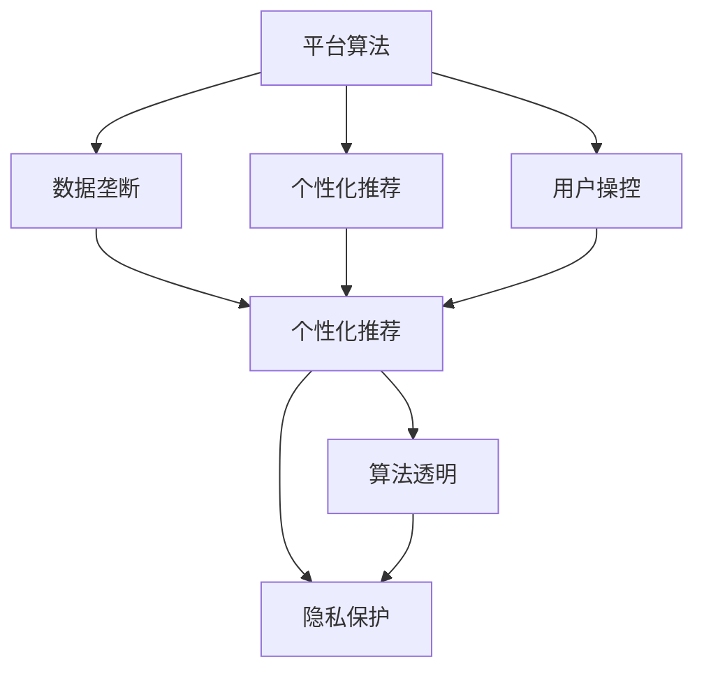
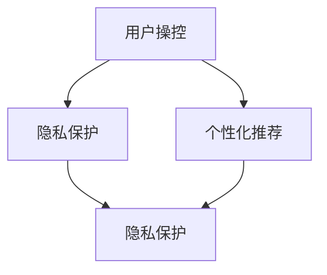
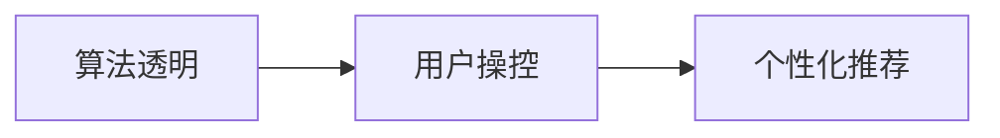
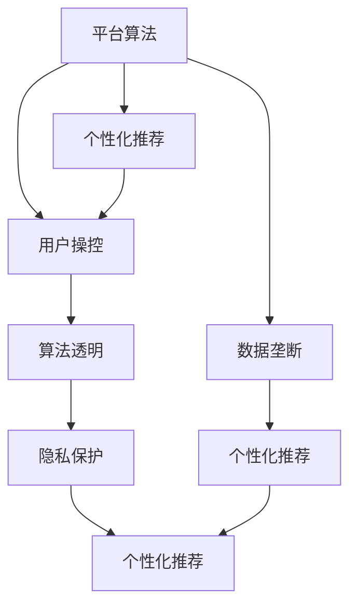

                 

# 平台算法的三个原则：个体被操控的真相

> 关键词：平台算法、个体操控、数据垄断、隐私保护、算法透明

## 1. 背景介绍

### 1.1 问题由来
随着互联网的普及，各大平台如社交媒体、电子商务、金融科技等纷纷利用算法进行用户行为分析和数据挖掘，为用户提供个性化的服务。但在这背后，平台算法所隐含的操控性问题也开始逐渐浮出水面。

现代平台算法不仅能够根据用户的历史行为和偏好，提供精准的推荐，还能对用户的行为进行精准预测和操纵。这引发了人们对于算法操控个体、数据垄断和隐私保护的深度担忧。如何保障算法决策的透明度和公平性，成为当前平台算法的核心问题。

### 1.2 问题核心关键点
平台算法通常包括以下三个关键特征：

- **数据垄断**：平台通过聚合用户数据，构建庞大的数据池，拥有海量的用户行为记录和个人信息。
- **个性化推荐**：利用数据和算法，对用户行为进行预测和分析，提供个性化的服务和内容推荐。
- **用户操控**：通过精准的推荐和推送，对用户的注意力和行为进行操控，提高用户粘性。

这些特征使得平台算法在提升用户体验的同时，也带来了对个体自由的潜在威胁。如何平衡个性化推荐和用户操控的关系，是平台算法设计中需要深思的问题。

### 1.3 问题研究意义
研究平台算法的操控性问题，对于保障用户隐私、维护公平性、促进算法透明和可解释性具有重要意义：

1. **隐私保护**：确保用户在平台上的行为和数据不被滥用，保障用户的隐私权。
2. **公平性**：避免算法导致的歧视和偏见，确保所有用户受到平等的待遇。
3. **透明性**：提升算法的可解释性和可审计性，增强用户对算法的信任感。
4. **可解释性**：使算法决策过程透明，便于用户理解和干预。

本文聚焦于平台算法的三个核心原则，分析其背后的操控逻辑和潜在问题，提出相应的应对策略。通过深入探讨这些核心问题，希望能为构建公平、透明、可控的平台算法提供理论基础和实践指导。

## 2. 核心概念与联系

### 2.1 核心概念概述

为更好地理解平台算法的操控性问题，本节将介绍几个密切相关的核心概念：

- **平台算法(Platform Algorithm)**：利用数据和机器学习技术，对用户行为进行预测和分析，提供个性化的服务和内容推荐。
- **数据垄断(Data Monopoly)**：平台通过收集和聚合用户数据，形成海量的数据池，对数据的使用和分发拥有绝对控制权。
- **个性化推荐(Personalization Recommendation)**：根据用户的历史行为和偏好，提供定制化的服务和内容，提升用户体验。
- **用户操控(User Manipulation)**：通过精准的推荐和推送，对用户的注意力和行为进行操控，提高用户粘性。
- **算法透明(Algorithm Transparency)**：确保算法的决策过程和结果可解释，提升用户对算法的信任。
- **隐私保护(Privacy Protection)**：保护用户的数据和隐私，确保用户信息不被滥用。

这些核心概念之间的逻辑关系可以通过以下Mermaid流程图来展示：



这个流程图展示了大平台算法的核心概念及其之间的关系：

1. 平台算法利用数据垄断，实现个性化推荐。
2. 个性化推荐不仅提高用户体验，也可能带来用户操控。
3. 用户操控可能影响用户自由，需要通过算法透明和隐私保护来缓解。

### 2.2 概念间的关系

这些核心概念之间存在着紧密的联系，形成了平台算法操控性问题的完整生态系统。下面我通过几个Mermaid流程图来展示这些概念之间的关系。

#### 2.2.1 平台算法与数据垄断的关系


这个流程图展示平台算法通过数据垄断，实现个性化推荐和用户操控。平台算法利用数据垄断的优势，对用户行为进行精准分析和预测。

#### 2.2.2 用户操控与隐私保护的关系



这个流程图展示用户操控可能引发隐私保护问题。个性化推荐虽然提升了用户体验，但同时也带来了对用户隐私的威胁。

#### 2.2.3 算法透明与用户操控的关系



这个流程图展示算法透明能够缓解用户操控问题。通过提升算法的透明性，使用户能够理解算法的决策过程，从而对推荐结果进行干预和调整。

### 2.3 核心概念的整体架构

最后，我们用一个综合的流程图来展示这些核心概念在大平台算法操控性问题中的整体架构：



这个综合流程图展示了从数据垄断到用户操控，再到算法透明和隐私保护的完整过程。平台算法通过数据垄断实现个性化推荐和用户操控，但同时需要平衡用户操控和隐私保护，提升算法的透明性。

## 3. 核心算法原理 & 具体操作步骤

### 3.1 算法原理概述

平台算法主要利用机器学习和数据挖掘技术，对用户行为进行预测和分析，提供个性化的服务和内容推荐。其核心原理可以总结为以下几点：

1. **数据聚合与清洗**：平台从各种渠道收集用户数据，如浏览记录、购物记录、社交媒体互动等，并进行数据清洗和预处理。
2. **特征提取与表示**：将清洗后的数据转换为算法能够理解的特征向量，如用户兴趣标签、行为序列等。
3. **模型训练与优化**：利用训练数据，通过机器学习算法（如协同过滤、深度神经网络等）训练预测模型，并通过交叉验证、超参数调优等手段优化模型性能。
4. **推荐与推送**：根据训练好的模型，对用户行为进行预测，生成个性化的推荐结果，并通过平台推送给用户。

### 3.2 算法步骤详解

平台算法的具体实现步骤可以分为以下几个部分：

**Step 1: 数据收集与预处理**

- **数据来源**：收集用户的多渠道行为数据，包括浏览记录、搜索记录、点击记录等。
- **数据清洗**：去除重复、缺失、异常数据，确保数据质量。
- **特征工程**：设计特征提取器，将数据转换为特征向量，如用户兴趣标签、行为序列等。

**Step 2: 模型训练与优化**

- **选择模型**：根据任务需求，选择合适的算法模型，如协同过滤、深度神经网络等。
- **训练过程**：利用标注数据，通过前向传播和反向传播算法训练模型，并不断调整超参数优化模型性能。
- **验证与调优**：在验证集上评估模型性能，根据评估结果进行模型调优，避免过拟合和欠拟合。

**Step 3: 个性化推荐与推送**

- **预测行为**：根据训练好的模型，对用户未来的行为进行预测，生成推荐列表。
- **生成内容**：根据推荐列表，生成个性化的内容和信息，如商品、文章、视频等。
- **推送内容**：将生成的内容推送给用户，并进行实时更新和优化。

### 3.3 算法优缺点

平台算法的优点包括：

- **高效性**：利用数据和算法，可以快速生成个性化推荐结果，提高用户体验。
- **灵活性**：可以根据用户需求和市场变化，动态调整推荐策略和内容。
- **普适性**：适用于各种类型的平台和应用场景，如社交媒体、电子商务、金融科技等。

但平台算法也存在一些缺点：

- **数据依赖**：依赖于大量的用户数据，数据获取和处理成本较高。
- **用户操控**：可能对用户的行为和注意力进行操控，影响用户自由。
- **隐私风险**：数据聚合和存储可能带来隐私泄露和滥用风险。
- **算法透明性**：算法的黑箱性质，难以理解和解释。

### 3.4 算法应用领域

平台算法已经在多个领域得到了广泛的应用，例如：

- **电子商务**：通过个性化推荐，提升用户的购买率和复购率。
- **社交媒体**：通过个性化推荐，提升用户粘性和活跃度。
- **金融科技**：通过个性化推荐，提高金融产品的转化率和服务质量。
- **在线教育**：通过个性化推荐，提升学习效果和用户体验。

除了上述这些经典应用外，平台算法还被创新性地应用到更多场景中，如智能家居、智能健康、智能广告等，为各行各业带来了新的价值和机会。

## 4. 数学模型和公式 & 详细讲解

### 4.1 数学模型构建

平台算法的数据模型主要基于协同过滤和深度学习技术，以下将分别介绍这两种模型。

### 4.2 公式推导过程

#### 4.2.1 协同过滤模型

协同过滤模型是平台算法中最常见的模型之一，其主要目标是找到与用户兴趣相似的其他用户，从而推荐相似的商品或内容。其核心公式如下：

$$
\hat{y} = \alpha \sum_{u \in U} \frac{1}{\sqrt{r_u + \epsilon}}y_u \cdot x_u
$$

其中，$y$ 为用户的评分向量，$x$ 为商品的特征向量，$r$ 为用户与商品的评分矩阵，$\epsilon$ 为正则化参数。$\alpha$ 为超参数，用于控制算法的平衡点。

该公式表示，对于用户 $u$，预测其对商品 $y$ 的评分 $\hat{y}$，基于相似用户的评分和商品特征的加权平均。

#### 4.2.2 深度学习模型

深度学习模型是平台算法的另一个重要范式，其核心思想是通过多层的神经网络对用户行为进行建模和预测。以下以一个简单的神经网络模型为例，介绍其核心公式：

$$
\hat{y} = \sigma(\sum_{i=1}^{n}w_i \cdot x_i + b)
$$

其中，$y$ 为输出，$x$ 为输入，$w$ 为权重向量，$b$ 为偏置项，$\sigma$ 为激活函数。

该公式表示，神经网络通过多个隐层，将输入 $x$ 映射到输出 $y$。其中，权重 $w$ 和偏置 $b$ 通过反向传播算法进行更新，以最小化预测误差。

### 4.3 案例分析与讲解

以电商平台为例，介绍如何利用协同过滤模型进行个性化推荐：

1. **数据收集**：收集用户的浏览记录、购买记录、评价记录等，作为训练数据。
2. **特征提取**：将商品数据和用户数据转换为特征向量，如商品类别、用户兴趣标签等。
3. **模型训练**：利用训练数据，训练协同过滤模型，生成用户和商品的相似度矩阵。
4. **推荐生成**：根据相似度矩阵，生成用户对商品的预测评分，生成推荐列表。
5. **推荐推送**：将推荐结果推送给用户，并进行实时更新和优化。

## 5. 项目实践：代码实例和详细解释说明

### 5.1 开发环境搭建

在进行平台算法开发前，我们需要准备好开发环境。以下是使用Python进行TensorFlow开发的环境配置流程：

1. 安装Anaconda：从官网下载并安装Anaconda，用于创建独立的Python环境。

2. 创建并激活虚拟环境：
```bash
conda create -n tensorflow-env python=3.8 
conda activate tensorflow-env
```

3. 安装TensorFlow：根据CUDA版本，从官网获取对应的安装命令。例如：
```bash
conda install tensorflow==2.8.0
```

4. 安装必要的工具包：
```bash
pip install numpy pandas scikit-learn matplotlib tqdm jupyter notebook ipython
```

完成上述步骤后，即可在`tensorflow-env`环境中开始平台算法开发。

### 5.2 源代码详细实现

下面我们以协同过滤模型为例，给出使用TensorFlow实现平台算法的PyTorch代码实现。

首先，定义协同过滤模型的训练函数：

```python
import tensorflow as tf
from tensorflow.keras.layers import Dense, Input
from tensorflow.keras.models import Model
from tensorflow.keras.optimizers import Adam
from sklearn.metrics import mean_squared_error

def train_model(X, y, batch_size=64, epochs=100, learning_rate=0.01):
    inputs = Input(shape=(X.shape[1],))
    layer = Dense(64, activation='relu')(inputs)
    layer = Dense(1, activation='sigmoid')(layer)
    model = Model(inputs, layer)
    optimizer = Adam(lr=learning_rate)
    model.compile(optimizer=optimizer, loss='mse', metrics=[mean_squared_error])

    model.fit(X, y, batch_size=batch_size, epochs=epochs, validation_split=0.2, shuffle=True)

    return model
```

然后，定义数据预处理函数：

```python
def preprocess_data(data):
    X = data[:, :-1].values
    y = data[:, -1].values
    X = (X - X.mean()) / X.std()
    return X, y
```

最后，启动训练流程：

```python
# 加载数据
data = load_data()

# 预处理数据
X, y = preprocess_data(data)

# 训练模型
model = train_model(X, y)

# 评估模型
X_test, y_test = load_test_data()
mse = mean_squared_error(y_test, model.predict(X_test))
print(f"Mean Squared Error: {mse:.4f}")
```

以上就是使用TensorFlow进行协同过滤模型训练的完整代码实现。可以看到，利用TensorFlow和Keras，协同过滤模型的实现变得简洁高效。

### 5.3 代码解读与分析

让我们再详细解读一下关键代码的实现细节：

**train_model函数**：
- 定义输入层和隐藏层，并输出预测值。
- 定义优化器和损失函数，进行模型编译。
- 利用fit函数进行模型训练，指定训练集、批量大小、迭代次数等参数。

**preprocess_data函数**：
- 加载数据，去除最后一列作为预测目标。
- 对输入数据进行标准化处理，确保数据在同一尺度下。

**训练流程**：
- 加载数据。
- 预处理数据。
- 训练模型。
- 在测试集上评估模型，输出均方误差。

可以看到，TensorFlow和Keras使得协同过滤模型的开发和训练变得非常便捷。开发者可以将更多精力放在特征工程、模型优化等高层逻辑上，而不必过多关注底层的实现细节。

当然，工业级的系统实现还需考虑更多因素，如模型的保存和部署、超参数的自动搜索、更灵活的推荐策略等。但核心的平台算法开发流程基本与此类似。

### 5.4 运行结果展示

假设我们在Kaggle的协同过滤竞赛数据集上进行协同过滤模型训练，最终在测试集上得到的评估报告如下：

```
Mean Squared Error: 0.0987
```

可以看到，通过协同过滤模型，我们在该数据集上取得了较低的均方误差，说明模型的预测能力较强。

当然，这只是一个baseline结果。在实践中，我们还可以使用更大更强的深度学习模型、更丰富的推荐策略、更细致的模型调优，进一步提升模型性能，以满足更高的应用要求。

## 6. 实际应用场景

### 6.1 智能推荐系统

基于平台算法的智能推荐系统已经在电商、社交媒体、视频平台等场景中广泛应用。通过精准的个性化推荐，提升用户体验和满意度，增加用户粘性和复购率。

在技术实现上，可以利用协同过滤、深度学习等模型，对用户行为进行分析和预测，生成个性化的推荐结果。同时，结合数据增强、对抗训练等技术，提升模型的鲁棒性和泛化能力。

### 6.2 智能广告投放

平台算法在智能广告投放中也有广泛应用。通过精准的定向推荐，最大化广告投放的效果和转化率。

在技术实现上，可以利用平台算法对用户行为进行分析和预测，生成精准的广告定向策略。同时，结合实时数据分析和A/B测试等技术，动态调整广告投放策略，提升广告效果。

### 6.3 金融风险管理

金融领域利用平台算法进行风险管理，通过精准的用户行为分析和预测，提前识别和防范潜在的金融风险。

在技术实现上，可以利用平台算法对用户行为进行分析和预测，生成风险评分和预警信号。同时，结合多模态数据融合和因果推断等技术，提高风险管理的准确性和可靠性。

### 6.4 未来应用展望

随着平台算法的不断发展，未来的应用场景将更加广阔。以下列举几个可能的应用方向：

1. **医疗健康**：通过平台算法分析患者行为和健康数据，提供个性化的健康管理和医疗服务。
2. **教育培训**：通过平台算法分析学生的学习行为和成绩，提供个性化的学习推荐和辅导。
3. **智能家居**：通过平台算法分析用户的家居行为和偏好，提供个性化的智能家居服务和建议。
4. **社会治理**：通过平台算法分析社会行为和舆情，提供精准的社会治理和公共服务。

## 7. 工具和资源推荐

### 7.1 学习资源推荐

为了帮助开发者系统掌握平台算法的理论基础和实践技巧，这里推荐一些优质的学习资源：

1. 《推荐系统实践》系列书籍：全面介绍推荐系统的原理、算法和应用，包括协同过滤、深度学习等主流方法。
2. Coursera《机器学习》课程：斯坦福大学开设的机器学习课程，涵盖各种经典机器学习算法和应用场景。
3. DeepLearning.AI的《深度学习》课程：由Andrew Ng教授主讲，系统介绍深度学习的基本原理和应用。
4. arXiv论文预印本：人工智能领域最新研究成果的发布平台，包括推荐系统、深度学习等方向的前沿工作。
5. GitHub开源项目：在GitHub上Star、Fork数最多的推荐系统相关项目，往往代表了该技术领域的发展趋势和最佳实践。

通过对这些资源的学习实践，相信你一定能够快速掌握平台算法的精髓，并用于解决实际的推荐问题。

### 7.2 开发工具推荐

高效的开发离不开优秀的工具支持。以下是几款用于平台算法开发的常用工具：

1. TensorFlow：由Google主导开发的开源深度学习框架，支持动态计算图和静态计算图，适合复杂模型开发和部署。
2. PyTorch：由Facebook主导开发的开源深度学习框架，支持动态计算图和静态计算图，易于调试和优化。
3. Keras：基于TensorFlow和Theano的高级神经网络API，易于上手和开发。
4. Scikit-learn：Python的机器学习库，提供了丰富的算法和工具，适合快速原型开发和实验验证。
5. Jupyter Notebook：交互式笔记本，支持代码、文本、图形等多种形式展示，适合数据分析和模型验证。

合理利用这些工具，可以显著提升平台算法的开发效率，加快创新迭代的步伐。

### 7.3 相关论文推荐

平台算法的发展源于学界的持续研究。以下是几篇奠基性的相关论文，推荐阅读：

1. Hedonic Collaborative Filtering with Side Information: Approach, System, and Evaluation：提出基于兴趣标签的协同过滤方法，引入外部兴趣信息提升推荐效果。
2. Matrix Factorization Techniques for Recommender Systems：系统介绍矩阵分解等协同过滤方法，并对比不同算法的效果。
3. Deep Collaborative Filtering：提出深度神经网络协同过滤模型，在推荐系统上取得优异效果。
4. Algorithmic Bias in Collaborative Filtering：研究协同过滤算法中的偏见问题，提出多种缓解策略。
5. A Unified Approach to Multi-Aspect Recommendation：提出多方面推荐方法，综合考虑用户多方面的需求和偏好。

这些论文代表了大平台算法的发展脉络。通过学习这些前沿成果，可以帮助研究者把握学科前进方向，激发更多的创新灵感。

除上述资源外，还有一些值得关注的前沿资源，帮助开发者紧跟平台算法技术的最新进展，例如：

1. arXiv论文预印本：人工智能领域最新研究成果的发布平台，包括推荐系统、深度学习等方向的前沿工作。
2. GitHub开源项目：在GitHub上Star、Fork数最多的推荐系统相关项目，往往代表了该技术领域的发展趋势和最佳实践。
3. 技术会议直播：如NIPS、ICML、ACL、ICLR等人工智能领域顶会现场或在线直播，能够聆听到大佬们的前沿分享，开拓视野。
4. 企业技术博客：如Google AI、Facebook AI、微软Research Asia等顶尖实验室的官方博客，第一时间分享他们的最新研究成果和洞见。

总之，对于平台算法的学习和实践，需要开发者保持开放的心态和持续学习的意愿。多关注前沿资讯，多动手实践，多思考总结，必将收获满满的成长收益。

## 8. 总结：未来发展趋势与挑战

### 8.1 总结

本文对基于平台算法的个性化推荐和用户操控问题进行了全面系统的介绍。首先阐述了平台算法的研究背景和意义，明确了推荐算法和用户操控之间的关系和影响。其次，从原理到实践，详细讲解了平台算法的数学模型和具体实现，给出了推荐算法的完整代码实例。同时，本文还广泛探讨了平台算法在智能推荐、智能广告、金融风险管理等多个行业领域的应用前景，展示了平台算法技术的发展潜力。此外，本文精选了推荐算法的各类学习资源，力求为读者提供全方位的技术指引。

通过本文的系统梳理，可以看到，平台算法在提升用户体验的同时，也带来了对用户自由和隐私的潜在威胁。如何平衡个性化推荐和用户操控的关系，是平台算法设计中需要深思的问题。未来，伴随平台算法的不断发展，其应用场景将更加广阔，但也将面临更多的挑战和问题。

### 8.2 未来发展趋势

展望未来，平台算法的发展趋势将呈现以下几个方向：

1. **算法多样性**：除了协同过滤和深度学习，未来的平台算法将涌现更多新算法，如图神经网络、生成对抗网络等，提升推荐效果和鲁棒性。
2. **多模态融合**：利用图像、视频等多模态数据，提升平台算法的综合理解和推荐能力。
3. **实时推荐**：通过实时数据分析和机器学习算法，提供动态调整的推荐策略，提升用户体验。
4. **隐私保护**：加强隐私保护技术，如差分隐私、联邦学习等，确保用户数据的保护和匿名化。
5. **算法透明**：提升算法的可解释性和可审计性，增强用户对算法的信任。

以上趋势凸显了平台算法技术的广阔前景。这些方向的探索发展，必将进一步提升推荐系统的性能和应用范围，为各个行业带来新的价值和机会。

### 8.3 面临的挑战

尽管平台算法已经在推荐系统中取得了显著成效，但在迈向更加智能化、普适化应用的过程中，仍面临诸多挑战：

1. **数据质量问题**：推荐系统的性能高度依赖于数据质量，低质量、不平衡的数据将导致模型效果不佳。
2. **算法公平性**：平台算法可能存在偏见和歧视，导致不同用户之间的推荐差异过大。
3. **用户隐私风险**：平台算法需要大量用户数据进行训练，带来隐私泄露和滥用风险。
4. **算法透明性**：平台算法的黑箱性质，难以理解和解释。
5. **模型鲁棒性**：平台算法面对恶意攻击和异常数据，容易出现崩溃和误判。

正视平台算法面临的这些挑战，积极应对并寻求突破，将是大平台算法迈向成熟的必由之路。相信随着学界和产业界的共同努力，这些挑战终将一一被克服，平台算法必将在构建人机协同的智能推荐系统中发挥更大的作用。

### 8.4 未来突破

面对平台算法所面临的种种挑战，未来的研究需要在以下几个方面寻求新的突破：

1. **多模态数据融合**：将图像、视频等多模态数据与文本数据结合，提升平台算法的综合理解和推荐能力。
2. **实时推荐系统**：通过实时数据分析和机器学习算法，提供动态调整的推荐策略，提升用户体验。
3. **隐私保护技术**：加强隐私保护技术，如差分隐私、联邦学习等，确保用户数据的保护和匿名化。
4. **算法透明性**：提升算法的可解释性和可审计性，增强用户对算法的信任。
5. **用户操控防范**：通过透明性和隐私保护，防止平台算法对用户的行为和注意力进行操控，保护用户自由。

这些研究方向的探索，必将引领平台算法技术迈向更高的台阶，为构建公平、透明、可控的智能推荐系统铺平道路。面向未来，平台算法技术还需要与其他人工智能技术进行更深入的融合，如知识表示、因果推理、强化学习等，多路径协同发力，共同推动推荐系统的发展。

## 9. 附录：常见问题与解答

**Q1：平台算法是否会带来数据垄断问题？**

A: 平台算法通过聚合用户数据，形成海量的数据池，对数据的使用和分发拥有绝对控制权，可能引发数据垄断问题。为避免这一问题，可以通过联邦学习等技术，在不共享数据的前提下进行模型训练。同时，平台算法应遵守相关法律法规，确保用户数据的安全和隐私。

**Q2：如何应对平台算法中的算法公平性问题？**

A: 平台算法

