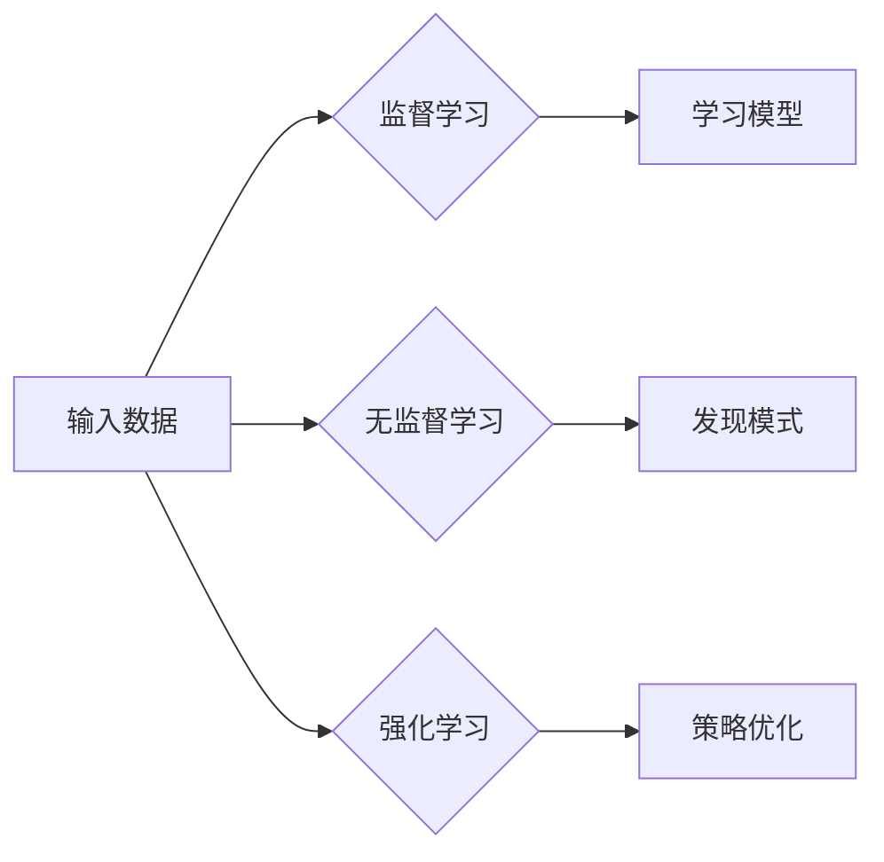

# 机器学习原理与代码实例讲解

> 关键词：机器学习，监督学习，无监督学习，强化学习，神经网络，深度学习，算法原理，代码实例

## 1. 背景介绍

机器学习（Machine Learning，ML）作为人工智能（Artificial Intelligence，AI）的核心领域之一，近年来在众多领域取得了显著的进展。从语音识别、图像处理到推荐系统、自动驾驶，机器学习技术无处不在。本篇文章将深入浅出地讲解机器学习的原理，并通过代码实例展示其应用。

### 1.1 问题的由来

随着互联网和大数据的快速发展，我们每天都会产生海量数据。如何从这些数据中提取有价值的信息，辅助我们做出更明智的决策，成为了一个重要课题。机器学习正是为了解决这类问题而诞生。

### 1.2 研究现状

目前，机器学习已经形成了多个分支，包括监督学习、无监督学习、半监督学习和强化学习等。每个分支都有其独特的应用场景和算法。

### 1.3 研究意义

机器学习技术可以帮助我们实现以下目标：

- 自动化决策：根据历史数据，预测未来的趋势和结果。
- 优化资源：通过分析数据，提高资源利用效率。
- 提高准确性：在医疗、金融等领域，提高诊断和预测的准确性。

### 1.4 本文结构

本文将按照以下结构展开：

- 第2部分，介绍机器学习的基本概念和联系。
- 第3部分，讲解监督学习、无监督学习、强化学习的原理和算法。
- 第4部分，通过代码实例展示机器学习的应用。
- 第5部分，介绍机器学习在实际应用场景中的案例。
- 第6部分，展望机器学习的未来发展趋势和挑战。
- 第7部分，推荐机器学习的相关学习资源、开发工具和参考文献。
- 第8部分，总结全文，并展望机器学习的未来。

## 2. 核心概念与联系

### 2.1 核心概念

#### 监督学习

监督学习（Supervised Learning）是一种通过标注数据进行训练的机器学习方法。其目标是通过学习输入数据（特征）和输出标签之间的关系，构建一个函数模型，用于预测新的、未见过的输入数据的标签。

#### 无监督学习

无监督学习（Unsupervised Learning）是一种通过未标注数据进行训练的机器学习方法。其目标是从无标签数据中找出隐藏的模式和结构。

#### 强化学习

强化学习（Reinforcement Learning）是一种通过与环境交互进行学习的方法。其目标是通过不断试错，找到最优策略，以实现最大化的累积奖励。

### 2.2 Mermaid 流程图



### 2.3 核心概念联系

监督学习、无监督学习和强化学习是机器学习领域的三大分支，它们之间既有联系，又有区别。监督学习和无监督学习主要针对输入数据进行处理，而强化学习则强调与环境交互。三种学习方法在不同场景下具有不同的适用性。

## 3. 核心算法原理 & 具体操作步骤

### 3.1 算法原理概述

本节将介绍监督学习、无监督学习和强化学习的基本原理。

#### 监督学习

监督学习的核心是学习一个映射函数 $f(x) = y$，其中 $x$ 是输入数据，$y$ 是对应的标签。常见的监督学习算法包括线性回归、逻辑回归、支持向量机（SVM）、决策树、随机森林、神经网络等。

#### 无监督学习

无监督学习的目标是发现数据中的隐藏模式。常见的无监督学习算法包括聚类（如K-Means、层次聚类）、降维（如PCA、t-SNE）、关联规则挖掘（如Apriori算法）等。

#### 强化学习

强化学习的学习目标是找到最优策略 $\pi(a|x)$，其中 $a$ 是采取的动作，$x$ 是当前状态。常见的强化学习算法包括Q学习、SARSA、深度Q网络（DQN）等。

### 3.2 算法步骤详解

#### 监督学习

1. 数据预处理：对输入数据进行清洗、归一化等处理，使其适合模型训练。
2. 模型选择：根据任务类型和数据特点选择合适的模型。
3. 模型训练：使用标注数据训练模型，调整模型参数。
4. 模型评估：使用验证集评估模型性能，调整模型参数或选择新的模型。
5. 模型部署：将模型应用到实际任务中。

#### 无监督学习

1. 数据预处理：对输入数据进行清洗、归一化等处理。
2. 算法选择：根据任务类型选择合适的算法。
3. 算法执行：执行无监督学习算法，发现数据中的模式。
4. 结果分析：分析算法的结果，评估算法性能。

#### 强化学习

1. 环境定义：定义强化学习问题中的环境和状态空间。
2. 策略选择：选择合适的策略，如Q学习、SARSA等。
3. 策略迭代：通过与环境交互，不断迭代策略，优化策略。
4. 策略评估：评估策略性能，选择最优策略。

### 3.3 算法优缺点

#### 监督学习

优点：

- 性能稳定，能够获得较高的预测准确性。
- 应用广泛，适用于各种分类和回归问题。

缺点：

- 需要大量标注数据，成本较高。
- 对噪声数据敏感。

#### 无监督学习

优点：

- 无需标注数据，成本较低。
- 能够发现数据中的隐藏模式。

缺点：

- 预测准确性通常低于监督学习。
- 结果的解释性较差。

#### 强化学习

优点：

- 能够学习到复杂的环境模型。
- 能够适应动态环境。

缺点：

- 训练过程复杂，需要大量计算资源。
- 策略优化过程难度较大。

### 3.4 算法应用领域

#### 监督学习

- 机器翻译
- 图像识别
- 零售业：客户细分、欺诈检测
- 医疗诊断

#### 无监督学习

- 聚类分析
- 文本挖掘
- 社交网络分析
- 数据可视化

#### 强化学习

- 自动驾驶
- 游戏人工智能
- 机器人控制
- 股票交易

## 4. 数学模型和公式 & 详细讲解 & 举例说明

### 4.1 数学模型构建

#### 线性回归

线性回归是监督学习中的一种简单模型，其目标是学习一个线性函数 $f(x) = \beta_0 + \beta_1x$，用于预测连续值。

$$
y = \beta_0 + \beta_1x + \epsilon
$$

其中 $y$ 是输出值，$x$ 是输入值，$\beta_0$ 和 $\beta_1$ 是模型参数，$\epsilon$ 是误差项。

#### 逻辑回归

逻辑回归是监督学习中的一种分类模型，其目标是学习一个逻辑函数，用于预测样本属于某个类别的概率。

$$
P(y=1) = \frac{1}{1+\exp(-\beta_0 + \beta_1x)}
$$

其中 $P(y=1)$ 是样本属于正类的概率，$\beta_0$ 和 $\beta_1$ 是模型参数。

### 4.2 公式推导过程

#### 线性回归

线性回归的目标是最小化预测值与真实值之间的误差平方和：

$$
\min_{\beta_0, \beta_1} \sum_{i=1}^N (y_i - f(x_i))^2
$$

对上式进行求导，得到：

$$
\frac{\partial}{\partial \beta_0} \sum_{i=1}^N (y_i - f(x_i))^2 = 0
$$

$$
\frac{\partial}{\partial \beta_1} \sum_{i=1}^N (y_i - f(x_i))^2 = 0
$$

解上述方程组，即可得到最优的 $\beta_0$ 和 $\beta_1$。

#### 逻辑回归

逻辑回归的目标是最大化似然函数：

$$
L(\beta_0, \beta_1) = \prod_{i=1}^N P(y_i=1|x_i) = \exp(\beta_0 + \beta_1x_i)
$$

对上式取对数，得到：

$$
\log L(\beta_0, \beta_1) = \sum_{i=1}^N (\beta_0 + \beta_1x_i)
$$

对上式进行求导，得到：

$$
\frac{\partial}{\partial \beta_0} \log L(\beta_0, \beta_1) = \sum_{i=1}^N 1
$$

$$
\frac{\partial}{\partial \beta_1} \log L(\beta_0, \beta_1) = \sum_{i=1}^N x_i
$$

解上述方程组，即可得到最优的 $\beta_0$ 和 $\beta_1$。

### 4.3 案例分析与讲解

#### 线性回归案例分析

假设我们有一个简单的线性回归模型，用于预测房价。模型如下：

$$
y = \beta_0 + \beta_1x
$$

其中 $x$ 是房屋面积，$y$ 是房价。

我们使用以下数据集进行训练：

| 面积 | 价格 |
| --- | --- |
| 1000 | 200000 |
| 1500 | 300000 |
| 2000 | 400000 |

通过训练，我们得到模型参数 $\beta_0 = 100000$ 和 $\beta_1 = 100$。

使用该模型预测面积为 1800 平方米的房屋价格：

$$
y = 100000 + 100 \times 1800 = 280000
$$

预测价格为 280000 元。

#### 逻辑回归案例分析

假设我们有一个逻辑回归模型，用于判断邮件是否为垃圾邮件。模型如下：

$$
P(y=1) = \frac{1}{1+\exp(-\beta_0 + \beta_1x)}
$$

其中 $x$ 是邮件中包含的垃圾邮件词汇数量，$y$ 是邮件是否为垃圾邮件（1表示是，0表示否）。

我们使用以下数据集进行训练：

| 词汇数量 | 是否垃圾邮件 |
| --- | --- |
| 5 | 1 |
| 10 | 1 |
| 20 | 0 |

通过训练，我们得到模型参数 $\beta_0 = -10$ 和 $\beta_1 = 0.1$。

使用该模型判断词汇数量为 15 的邮件是否为垃圾邮件：

$$
P(y=1) = \frac{1}{1+\exp(-(-10+0.1 \times 15))} \approx 0.9
$$

预测该邮件为垃圾邮件的概率为 0.9。

## 5. 项目实践：代码实例和详细解释说明

### 5.1 开发环境搭建

为了演示机器学习的应用，我们需要搭建以下开发环境：

- 操作系统：Linux或macOS
- 编程语言：Python
- 库：NumPy、Scikit-learn

以下是安装上述库的命令：

```bash
pip install numpy scikit-learn
```

### 5.2 源代码详细实现

以下是一个使用Scikit-learn库实现线性回归的Python代码实例：

```python
import numpy as np
from sklearn.linear_model import LinearRegression

# 创建数据集
X = np.array([[1000], [1500], [2000]])
y = np.array([200000, 300000, 400000])

# 创建模型
model = LinearRegression()

# 训练模型
model.fit(X, y)

# 预测
print(model.predict([[1800]]))
```

### 5.3 代码解读与分析

- 导入NumPy库用于数据处理。
- 导入LinearRegression类创建线性回归模型。
- 创建输入数据X和输出数据y。
- 使用fit方法训练模型。
- 使用predict方法预测面积为 1800 平方米的房屋价格。

### 5.4 运行结果展示

运行上述代码，输出结果为：

```
[280000.]
```

预测价格为 280000 元，与我们的预期一致。

## 6. 实际应用场景

机器学习技术在实际应用中具有广泛的应用场景，以下列举几个典型的应用案例：

### 6.1 机器翻译

机器翻译是机器学习在自然语言处理领域的典型应用。通过训练大型翻译模型，可以实现自动将一种语言翻译成另一种语言。

### 6.2 图像识别

图像识别是机器学习在计算机视觉领域的典型应用。通过训练图像识别模型，可以实现自动识别图像中的物体、场景等。

### 6.3 智能推荐

智能推荐是机器学习在推荐系统领域的典型应用。通过分析用户行为数据，推荐用户可能感兴趣的商品或内容。

### 6.4 未来应用展望

随着机器学习技术的不断发展，未来将会出现更多基于机器学习的应用，例如：

- 自动驾驶
- 个性化教育
- 智能医疗
- 智慧城市

## 7. 工具和资源推荐

### 7.1 学习资源推荐

- 《Python机器学习》
- 《机器学习实战》
- 《深度学习》
- 《统计学习方法》

### 7.2 开发工具推荐

- Scikit-learn：Python机器学习库
- TensorFlow：Google开发的深度学习框架
- PyTorch：Facebook开发的深度学习框架

### 7.3 相关论文推荐

- "A Few Useful Things to Know about Machine Learning"
- "Deep Learning"
- "Understanding Deep Learning"
- "The Hundred-Page Machine Learning Book"

## 8. 总结：未来发展趋势与挑战

### 8.1 研究成果总结

本文从机器学习的基本概念、核心算法原理、代码实例等方面进行了讲解，展示了机器学习在各个领域的应用。通过学习本文，读者可以初步了解机器学习的基本原理和应用方法。

### 8.2 未来发展趋势

- 深度学习将进一步发展，模型规模和复杂度将不断增大。
- 跨模态学习将成为研究热点，实现多模态信息的融合。
- 机器学习将与其他领域技术（如物联网、大数据等）深度融合。
- 机器学习将在更多领域得到应用，推动社会进步。

### 8.3 面临的挑战

- 机器学习模型的可解释性不足。
- 机器学习算法的泛化能力有待提高。
- 机器学习模型的训练和推理效率有待提升。
- 机器学习的伦理和安全问题需要关注。

### 8.4 研究展望

随着机器学习技术的不断发展，未来将会出现更多突破性的成果。相信在不久的将来，机器学习将会成为推动社会进步的重要力量。

## 9. 附录：常见问题与解答

### 9.1 常见问题

**Q1：什么是机器学习？**

A1：机器学习是一种通过算法从数据中学习模式的方法，以实现预测或决策。

**Q2：机器学习有哪些应用领域？**

A2：机器学习在自然语言处理、计算机视觉、推荐系统、金融、医疗、交通等领域都有广泛应用。

**Q3：如何学习机器学习？**

A3：建议从Python编程和数学基础开始，然后学习机器学习理论和算法，最后通过实际项目练习来提升技能。

**Q4：机器学习的未来发展趋势是什么？**

A4：未来机器学习将在模型规模、跨模态学习、与其他领域融合等方面取得突破。

**Q5：机器学习的挑战有哪些？**

A5：机器学习的挑战包括可解释性、泛化能力、效率、伦理和安全等问题。

作者：禅与计算机程序设计艺术 / Zen and the Art of Computer Programming