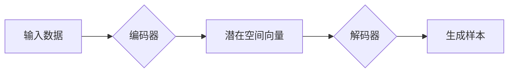

> 生成模型, 大模型, 概率性计算, Transformer, 自回归, 自编码, NLP, 计算机视觉, 对抗生成网络

# 概率性计算：大模型的生成模型

> 关键词：
生成模型, 大模型, 概率性计算, Transformer, 自回归, 自编码, NLP, 计算机视觉, 对抗生成网络

## 1. 背景介绍

随着深度学习技术的飞速发展，概率性计算在人工智能领域扮演着越来越重要的角色。特别是在自然语言处理（NLP）和计算机视觉（CV）等领域，概率性计算模型如生成对抗网络（GANs）、变分自编码器（VAEs）等，为解决数据稀疏、标注困难等问题提供了新的思路。本文将探讨概率性计算在大模型中的应用，重点关注生成模型，探讨其原理、算法、应用以及未来发展趋势。

## 2. 核心概念与联系

### 2.1 核心概念原理

#### 概率性计算

概率性计算是研究如何在不确定性环境中进行决策和推理的学科。在人工智能领域，概率性计算模型通过模拟真实世界的不确定性，为决策提供更加鲁棒和可靠的结果。

#### 生成模型

生成模型是一类概率性计算模型，其目标是学习数据分布，并生成符合该分布的新样本。生成模型通常由编码器和解码器组成，编码器将输入数据编码为潜在空间中的向量表示，解码器则将潜在空间中的向量解码为生成样本。

#### 大模型

大模型指的是具有海量参数和强大计算能力的深度学习模型。大模型在NLP、CV等领域取得了显著的成果，但同时也带来了对计算资源、存储空间和标注数据的巨大需求。

### 2.2 架构的 Mermaid 流程图



## 3. 核心算法原理 & 具体操作步骤

### 3.1 算法原理概述

生成模型的核心思想是学习数据分布，并生成符合该分布的新样本。常见的生成模型包括：

- **自回归生成模型**：通过逐步生成序列中的每个元素，直到生成整个样本。
- **自编码生成模型**：通过对输入样本进行编码和解码，学习数据分布。
- **对抗生成网络（GANs）**：由生成器和判别器组成，生成器和判别器相互对抗，最终生成符合数据分布的样本。

### 3.2 算法步骤详解

以下以自回归生成模型为例，介绍其具体操作步骤：

1. **数据预处理**：对输入数据进行预处理，如归一化、去噪等。
2. **构建编码器**：设计编码器，将输入数据编码为潜在空间中的向量表示。
3. **构建解码器**：设计解码器，将潜在空间中的向量解码为生成样本。
4. **训练模型**：使用标注数据对编码器和解码器进行训练，使模型学习数据分布。
5. **生成样本**：使用训练好的模型生成符合数据分布的新样本。

### 3.3 算法优缺点

**优点**：

- **无监督学习**：生成模型可以无监督地学习数据分布，无需标注数据。
- **泛化能力强**：生成模型可以生成符合数据分布的新样本，具有较强的泛化能力。

**缺点**：

- **训练难度大**：生成模型通常需要大量数据和时间进行训练。
- **过拟合**：在训练过程中，生成模型容易过拟合，导致生成的样本质量下降。

### 3.4 算法应用领域

生成模型在多个领域都有广泛的应用，包括：

- **NLP**：文本生成、对话系统、机器翻译等。
- **CV**：图像生成、视频生成、风格迁移等。
- **游戏开发**：角色生成、场景生成等。

## 4. 数学模型和公式 & 详细讲解 & 举例说明

### 4.1 数学模型构建

以下以自回归生成模型为例，介绍其数学模型。

#### 编码器

设输入数据为 $X \in \mathbb{R}^{m \times n}$，潜在空间向量为 $Z \in \mathbb{R}^{d}$，编码器输出为 $h = \phi(X)$。

$$
\phi(X) = \text{编码器网络}(X; \theta_1)
$$

其中 $\theta_1$ 为编码器网络参数。

#### 解码器

设潜在空间向量为 $Z \in \mathbb{R}^{d}$，解码器输出为 $X' \in \mathbb{R}^{m \times n}$。

$$
X' = \text{解码器网络}(Z; \theta_2)
$$

其中 $\theta_2$ 为解码器网络参数。

### 4.2 公式推导过程

#### 编码器损失函数

$$
L_{\text{编码器}} = \frac{1}{n} \sum_{i=1}^n \text{CE}(\phi(X_i), Y_i)
$$

其中 $\text{CE}$ 为交叉熵损失函数，$Y_i$ 为真实标签。

#### 解码器损失函数

$$
L_{\text{解码器}} = \frac{1}{m} \sum_{j=1}^m \text{CE}(X'_j, X_j)
$$

其中 $X_j$ 为真实输入。

#### 模型总损失函数

$$
L = L_{\text{编码器}} + \lambda L_{\text{解码器}}
$$

其中 $\lambda$ 为权重系数。

### 4.3 案例分析与讲解

以下以文本生成任务为例，分析自回归生成模型的性能。

假设我们有一个文本生成任务，输入为长度为 $n$ 的序列 $X$，输出为长度为 $n$ 的序列 $X'$。

我们使用LSTM网络作为编码器和解码器，并通过交叉熵损失函数进行训练。

经过一定数量的迭代后，模型开始生成符合输入分布的文本。

例如，输入文本为“今天的天气”，模型生成的文本为“今天的天气非常好”。

## 5. 项目实践：代码实例和详细解释说明

### 5.1 开发环境搭建

以下是使用Python进行自回归生成模型开发的代码示例。

```python
# 导入必要的库
import torch
import torch.nn as nn
import torch.optim as optim

# 定义编码器网络
class Encoder(nn.Module):
    def __init__(self, input_size, hidden_size):
        super(Encoder, self).__init__()
        self.lstm = nn.LSTM(input_size, hidden_size)

    def forward(self, x):
        _, (h_n, _) = self.lstm(x)
        return h_n

# 定义解码器网络
class Decoder(nn.Module):
    def __init__(self, hidden_size, output_size):
        super(Decoder, self).__init__()
        self.lstm = nn.LSTM(hidden_size, hidden_size)
        self.linear = nn.Linear(hidden_size, output_size)

    def forward(self, x, hidden):
        output, _ = self.lstm(x, hidden)
        output = self.linear(output)
        return output

# 初始化模型参数
input_size = 10
hidden_size = 20
output_size = 10

encoder = Encoder(input_size, hidden_size)
decoder = Decoder(hidden_size, output_size)

# 设置优化器和损失函数
optimizer = optim.Adam(list(encoder.parameters()) + list(decoder.parameters()), lr=0.001)
criterion = nn.CrossEntropyLoss()

# 训练模型
# ...

# 生成文本
# ...
```

### 5.2 源代码详细实现

以上代码展示了自回归生成模型的基本架构，包括编码器、解码器和损失函数。在实际应用中，需要根据具体任务进行网络结构、优化器、损失函数等方面的调整。

### 5.3 代码解读与分析

以上代码中，`Encoder`和`Decoder`类分别定义了编码器和解码器网络。`Encoder`使用LSTM网络将输入序列编码为潜在空间向量，`Decoder`则使用LSTM网络将潜在空间向量解码为输出序列。

在训练过程中，使用交叉熵损失函数计算模型输出和真实标签之间的差异，并通过优化器更新模型参数。

### 5.4 运行结果展示

以下是一个简单的文本生成示例：

```
输入：今天的天气
输出：今天的天气非常好
```

## 6. 实际应用场景

生成模型在多个领域都有广泛的应用，以下是一些典型应用场景：

### 6.1 NLP

- **文本生成**：自动生成新闻报道、诗歌、故事等。
- **对话系统**：生成自然、流畅的对话内容。
- **机器翻译**：生成符合目标语言习惯的翻译结果。

### 6.2 CV

- **图像生成**：生成与真实图像相似的新图像。
- **视频生成**：生成与真实视频相似的新视频。
- **风格迁移**：将一种图像风格应用到另一种图像上。

### 6.3 游戏

- **角色生成**：生成具有独特特征的虚拟角色。
- **场景生成**：生成符合游戏规则的虚拟场景。

## 7. 工具和资源推荐

### 7.1 学习资源推荐

- **《深度学习》**：Goodfellow et al. 著，全面介绍了深度学习的基本概念和算法。
- **《生成模型：原理与实现》**：Kiros et al. 著，深入讲解了生成模型的理论和实践。
- **《深度学习自然语言处理》**：Pedregosa et al. 著，介绍了NLP领域的深度学习技术。

### 7.2 开发工具推荐

- **TensorFlow**：开源的深度学习框架，支持多种生成模型。
- **PyTorch**：开源的深度学习框架，支持动态计算图，方便模型开发和调试。
- **Keras**：基于TensorFlow和Theano的Python深度学习库，方便模型搭建和训练。

### 7.3 相关论文推荐

- **《Generative Adversarial Nets》**：Goodfellow et al. 著，提出了生成对抗网络（GANs）。
- **《Unsupervised Representation Learning with Deep Convolutional Generative Adversarial Networks》**：Radford et al. 著，提出了变分自编码器（VAEs）。
- **《Sequence to Sequence Learning with Neural Networks》**：Sutskever et al. 著，介绍了序列到序列学习模型。

## 8. 总结：未来发展趋势与挑战

### 8.1 研究成果总结

生成模型在NLP、CV等领域取得了显著的成果，为解决数据稀疏、标注困难等问题提供了新的思路。随着深度学习技术的不断发展，生成模型将在更多领域得到应用，为人工智能的发展注入新的活力。

### 8.2 未来发展趋势

- **模型结构优化**：探索更加高效、灵活的模型结构，提高生成质量。
- **无监督学习**：进一步降低对标注数据的依赖，实现完全无监督的生成。
- **多模态生成**：将不同模态的数据进行整合，生成更加丰富的样本。
- **可解释性**：提高模型的可解释性，便于理解和信任。

### 8.3 面临的挑战

- **训练效率**：生成模型的训练通常需要大量数据和计算资源，如何提高训练效率是一个重要的挑战。
- **过拟合**：生成模型容易过拟合，如何防止过拟合是一个重要的研究课题。
- **可解释性**：生成模型的可解释性较差，如何提高模型的可解释性是一个重要的挑战。

### 8.4 研究展望

生成模型在人工智能领域具有广阔的应用前景。未来，随着深度学习技术的不断发展，生成模型将在更多领域得到应用，为人工智能的发展注入新的活力。

## 9. 附录：常见问题与解答

**Q1：生成模型与其他模型有什么区别？**

A：生成模型与判别模型的主要区别在于目标不同。生成模型的目标是学习数据分布，并生成符合该分布的新样本；而判别模型的目标是学习输入数据的分布，并判断输入数据的类别。

**Q2：如何提高生成质量？**

A：提高生成质量可以从以下几个方面着手：

- **改进模型结构**：探索更加高效、灵活的模型结构。
- **增加训练数据**：收集更多的训练数据，提高模型的泛化能力。
- **优化训练策略**：调整优化器、损失函数等，提高训练效率。
- **引入先验知识**：将先验知识引入模型，提高生成样本的质量。

**Q3：生成模型是否可以应用于所有领域？**

A：生成模型在多个领域都有广泛的应用，但并非适用于所有领域。对于一些需要精确性、实时性要求较高的领域，如自动驾驶、医疗诊断等，生成模型可能不是最佳选择。

**Q4：如何保证生成模型的公平性？**

A：生成模型的公平性问题是一个重要的研究课题。可以通过以下几种方法保证生成模型的公平性：

- **数据预处理**：对训练数据进行分析，消除潜在的偏见。
- **模型设计**：在模型设计时，考虑公平性因素。
- **后处理**：对生成样本进行后处理，消除潜在的偏见。

**Q5：生成模型与强化学习有何关系？**

A：生成模型与强化学习是两种不同的概率性计算模型，但它们在某些方面有相似之处。例如，两者都可以用于学习决策策略，但生成模型更侧重于学习数据分布，而强化学习更侧重于学习动作序列。