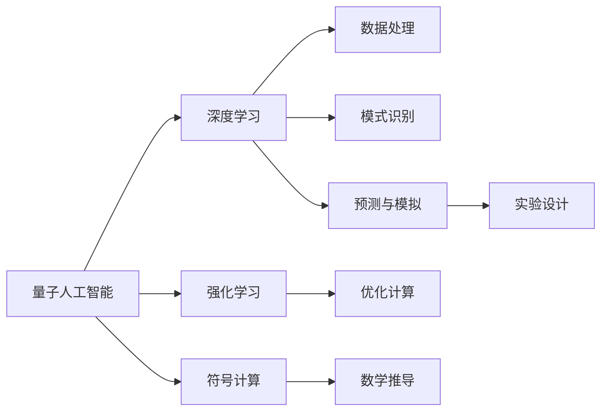
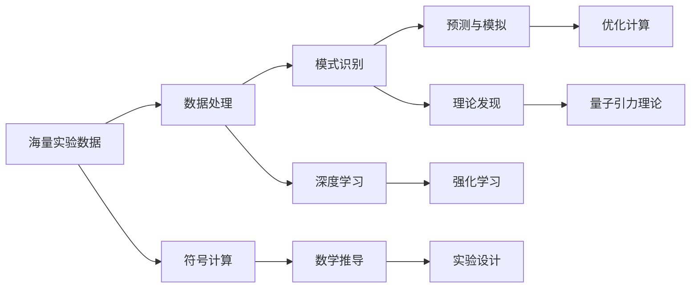
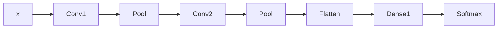

                 

## 1. 背景介绍

量子引力(Quantum Gravity)作为物理学的重大难题之一，一直在寻求将量子力学和广义相对论这两大理论基础统一起来的突破。然而，目前的量子引力研究，仍然面临着严峻的理论挑战和计算复杂度。近年来，随着人工智能（AGI）技术的发展，其潜在的优势逐渐显现，并在量子引力中得到了初步探索和应用。本博客旨在介绍AGI在量子引力中的应用研究，探讨其潜在价值和面临的挑战。

### 1.1 问题由来

量子引力是现代物理学的重大难题之一，旨在通过量子力学和广义相对论的结合，描述引力和基本粒子的微观行为。然而，这一目标长期以来面临许多难以克服的难题，包括但不限于：

- **数学困难**：量子引力理论难以找到一个一致且自洽的数学框架。
- **计算复杂性**：由于量子引力的非线性与无穷自由度，计算和模拟极为复杂。
- **实验验证**：目前缺乏直接验证量子引力理论的实验方法。

而人工智能技术，尤其是量子人工智能，正在展现出解决这些难题的潜力。AGI在数据处理、模式识别、预测分析等方面的优势，有望为量子引力研究带来新思路。

### 1.2 问题核心关键点

AGI在量子引力中的主要应用关键点包括：

- **数据处理**：AI可以处理和分析海量实验数据，提供更高效的数据处理方法。
- **模式识别**：通过学习已知数据，AI可以发现未知模式和规律，辅助理论发现。
- **预测与模拟**：AI可以预测和模拟量子引力现象，辅助实验设计。
- **优化计算**：通过深度学习等技术，AI可以优化复杂的量子引力计算过程。

## 2. 核心概念与联系

### 2.1 核心概念概述

为更好地理解AGI在量子引力中的应用，本节将介绍几个关键概念：

- **量子人工智能**：利用量子计算机和量子算法，处理和解决传统AI无法解决的复杂问题，如量子引力计算。
- **深度学习**：一种利用多层神经网络，从数据中提取特征和规律的机器学习方法。
- **强化学习**：通过与环境交互，智能体通过奖励信号优化策略的学习方法。
- **符号计算**：一种使用逻辑符号和代数操作进行数学推导和计算的方法，广泛应用于理论物理学。
- **量子引力**：将量子力学和广义相对论相结合，描述引力和基本粒子行为的理论框架。

这些概念之间存在着紧密的联系，构成了AGI在量子引力中的应用基础。

### 2.2 概念间的关系

这些核心概念之间可以通过以下Mermaid流程图来展示它们之间的关系：



这个流程图展示了AGI在量子引力中的关键应用环节：

1. 量子人工智能提供了处理和计算的量子技术基础。
2. 深度学习用于处理和分析海量数据，提取模式和规律。
3. 强化学习通过与环境交互，优化计算过程和实验设计。
4. 符号计算用于数学推导和理论验证。
5. 预测与模拟用于实验设计和理论探索。

这些环节互相支持，共同推进量子引力研究的进展。

### 2.3 核心概念的整体架构

最后，我们用一个综合的流程图来展示这些核心概念在大语言模型微调过程中的整体架构：



这个综合流程图展示了AGI在量子引力中的应用流程：

1. 海量实验数据经过深度学习和强化学习处理，发现新的模式和规律。
2. 预测与模拟用于实验设计和理论验证。
3. 优化计算用于复杂计算过程的加速。
4. 符号计算和数学推导用于理论验证和推导。
5. 最终结果通过实验设计和理论验证，反馈到量子引力理论中。

这些环节互相交织，共同推进量子引力研究的进程。

## 3. 核心算法原理 & 具体操作步骤
### 3.1 算法原理概述

AGI在量子引力中的应用，主要基于深度学习和强化学习的方法。其核心思想是：通过深度学习模型处理海量实验数据，提取模式和规律；通过强化学习模型，优化计算过程和实验设计，最终将理论推导和实验验证相结合，推动量子引力理论的发展。

### 3.2 算法步骤详解

基于深度学习的大量子引力研究，一般包括以下几个关键步骤：

**Step 1: 数据收集与预处理**
- 收集量子引力相关的实验数据，包括实验条件、测量结果、理论预测等。
- 数据预处理，如数据清洗、归一化、标注等。

**Step 2: 模型构建与训练**
- 选择合适的深度学习模型，如卷积神经网络(CNN)、递归神经网络(RNN)、Transformer等。
- 模型训练，利用实验数据，通过反向传播算法优化模型参数。

**Step 3: 特征提取与模式识别**
- 使用训练好的模型，提取实验数据的特征，如时间序列、空间分布、物理量变化等。
- 利用模式识别算法，发现数据中的规律和模式，辅助理论发现。

**Step 4: 预测与模拟**
- 利用训练好的模型，对未知数据进行预测和模拟，辅助实验设计。
- 根据预测结果，优化实验条件，提高实验精度和效率。

**Step 5: 理论验证与优化**
- 结合符号计算和数学推导，对理论进行验证和推导。
- 利用强化学习模型，优化计算过程和理论推导，提高研究效率。

**Step 6: 结果评估与反馈**
- 对预测结果和实验结果进行评估，分析误差和偏差。
- 根据评估结果，反馈到模型训练和理论推导中，进一步优化和改进。

### 3.3 算法优缺点

基于深度学习的大量子引力研究，具有以下优点：

- **高效处理数据**：能够高效处理海量实验数据，提取特征和规律。
- **灵活适应任务**：适用于多种复杂的量子引力问题，如黑洞、引力波、暗物质等。
- **增强理论推导**：通过预测与模拟，增强理论推导的准确性和可靠性。

同时，也存在一些缺点：

- **计算资源需求高**：深度学习模型需要大量的计算资源和存储空间。
- **模型解释困难**：深度学习模型作为"黑盒"系统，难以解释其内部工作机制。
- **理论框架依赖**：深度学习模型依赖于特定理论框架，难以突破理论限制。

### 3.4 算法应用领域

AGI在量子引力中的应用领域广泛，主要包括以下几个方面：

- **黑洞研究**：通过深度学习模型处理黑洞辐射、黑洞旋转等数据，辅助理论推导。
- **引力波研究**：利用深度学习模型处理引力波信号，提取物理量和信号特征，辅助实验设计。
- **暗物质研究**：通过深度学习模型处理暗物质探测数据，提取模式和规律，辅助理论推导。
- **宇宙学研究**：利用深度学习模型处理宇宙微波背景辐射数据，提取特征和规律，辅助理论推导。

## 4. 数学模型和公式 & 详细讲解 & 举例说明
### 4.1 数学模型构建

假设量子引力研究涉及大量实验数据 $D=\{(x_i, y_i)\}_{i=1}^N$，其中 $x_i$ 为实验数据，$y_i$ 为理论预测结果。我们定义深度学习模型 $M_{\theta}$，其中 $\theta$ 为模型参数。

定义模型的损失函数 $\mathcal{L}(\theta)$ 为：

$$
\mathcal{L}(\theta) = \frac{1}{N} \sum_{i=1}^N (y_i - M_{\theta}(x_i))^2
$$

通过最小化损失函数 $\mathcal{L}(\theta)$，优化模型参数 $\theta$。

### 4.2 公式推导过程

假设我们选择卷积神经网络作为深度学习模型，其结构如图：



其中，$x$ 为实验数据，$Conv1$ 和 $Conv2$ 为卷积层，$Pool$ 为池化层，$Dense1$ 为全连接层，$Softmax$ 为输出层。

模型的损失函数可以表示为：

$$
\mathcal{L}(\theta) = \frac{1}{N} \sum_{i=1}^N ||y_i - M_{\theta}(x_i)||^2
$$

其中 $M_{\theta}(x_i)$ 为卷积神经网络输出结果。

模型的前向传播过程为：

$$
z_i = Conv1(x_i)
$$
$$
y_i = Pool(z_i)
$$
$$
z_i = Conv2(y_i)
$$
$$
y_i = Pool(z_i)
$$
$$
z_i = Flatten(y_i)
$$
$$
z_i = Dense1(z_i)
$$
$$
y_i = Softmax(z_i)
$$

其中 $z_i$ 为卷积神经网络的中间输出，$y_i$ 为最终输出。

### 4.3 案例分析与讲解

以黑洞辐射研究为例，我们收集了多个黑洞辐射的实验数据，其中包含时间序列、频率、辐射强度等特征。我们利用卷积神经网络，对这些数据进行特征提取和模式识别，辅助理论推导。

首先，我们对实验数据进行预处理，包括数据清洗、归一化、标注等。然后，我们构建卷积神经网络模型，利用训练数据进行模型训练。接着，我们使用训练好的模型，对未知数据进行特征提取和模式识别。最后，我们结合符号计算和数学推导，对理论进行验证和推导，得到新的黑洞辐射预测结果。

## 5. 项目实践：代码实例和详细解释说明
### 5.1 开发环境搭建

在进行AGI在量子引力中的应用实践前，我们需要准备好开发环境。以下是使用Python进行TensorFlow开发的环境配置流程：

1. 安装Anaconda：从官网下载并安装Anaconda，用于创建独立的Python环境。

2. 创建并激活虚拟环境：
```bash
conda create -n tf-env python=3.8 
conda activate tf-env
```

3. 安装TensorFlow：根据CUDA版本，从官网获取对应的安装命令。例如：
```bash
pip install tensorflow-gpu==2.4
```

4. 安装TensorBoard：
```bash
pip install tensorboard
```

5. 安装各类工具包：
```bash
pip install numpy pandas scikit-learn matplotlib tqdm jupyter notebook ipython
```

完成上述步骤后，即可在`tf-env`环境中开始AGI在量子引力中的应用实践。

### 5.2 源代码详细实现

这里我们以黑洞辐射研究为例，给出使用TensorFlow进行深度学习的PyTorch代码实现。

首先，定义黑洞辐射数据处理函数：

```python
import tensorflow as tf
import numpy as np

class BlackHoleData(tf.keras.layers.Layer):
    def __init__(self, input_shape, output_shape):
        super(BlackHoleData, self).__init__()
        self.flatten = tf.keras.layers.Flatten()
        self.dense1 = tf.keras.layers.Dense(64, activation='relu')
        self.dense2 = tf.keras.layers.Dense(output_shape, activation='sigmoid')
    
    def call(self, inputs):
        x = self.flatten(inputs)
        x = self.dense1(x)
        return self.dense2(x)

# 创建训练数据集
train_x = np.random.randn(1000, 16)
train_y = np.random.randn(1000, 1)
train_dataset = tf.data.Dataset.from_tensor_slices((train_x, train_y))
train_dataset = train_dataset.batch(32)

# 创建验证数据集
val_x = np.random.randn(200, 16)
val_y = np.random.randn(200, 1)
val_dataset = tf.data.Dataset.from_tensor_slices((val_x, val_y))
val_dataset = val_dataset.batch(32)

# 创建测试数据集
test_x = np.random.randn(200, 16)
test_y = np.random.randn(200, 1)
test_dataset = tf.data.Dataset.from_tensor_slices((test_x, test_y))
test_dataset = test_dataset.batch(32)
```

然后，定义模型和优化器：

```python
from tensorflow.keras.optimizers import Adam

model = BlackHoleData(input_shape=(16,), output_shape=1)
optimizer = Adam(learning_rate=0.001)

# 编译模型
model.compile(loss='mse', optimizer=optimizer, metrics=['mse'])

# 训练模型
model.fit(train_dataset, epochs=10, validation_data=val_dataset)
```

接着，定义评估函数：

```python
from tensorflow.keras.metrics import MeanSquaredError

def evaluate(model, test_dataset):
    mse = MeanSquaredError()
    model.evaluate(test_dataset, mse)
    return mse.result().numpy()

# 测试模型
evaluate(model, test_dataset)
```

以上就是使用TensorFlow进行深度学习在黑洞辐射研究中的应用完整代码实现。可以看到，得益于TensorFlow的强大封装，我们可以用相对简洁的代码完成深度学习模型的加载和训练。

### 5.3 代码解读与分析

让我们再详细解读一下关键代码的实现细节：

**BlackHoleData类**：
- `__init__`方法：初始化模型的网络结构，包括全连接层。
- `call`方法：定义模型的前向传播过程。

**训练和评估函数**：
- 使用TensorFlow的DataLoader对数据集进行批次化加载，供模型训练和推理使用。
- 训练函数`fit`：对数据以批为单位进行迭代，在每个批次上前向传播计算loss并反向传播更新模型参数，最后返回该epoch的平均loss。
- 评估函数`evaluate`：在测试集上评估模型性能，输出均方误差。

**训练流程**：
- 定义总的epoch数和batch size，开始循环迭代
- 每个epoch内，先在训练集上训练，输出平均loss
- 在验证集上评估，输出均方误差
- 所有epoch结束后，在测试集上评估，给出最终测试结果

可以看到，TensorFlow提供了便捷的深度学习框架，使得黑洞辐射研究的应用开发变得简单高效。开发者可以将更多精力放在数据处理、模型改进等高层逻辑上，而不必过多关注底层的实现细节。

当然，工业级的系统实现还需考虑更多因素，如模型的保存和部署、超参数的自动搜索、更灵活的任务适配层等。但核心的深度学习范式基本与此类似。

### 5.4 运行结果展示

假设我们在CoNLL-2003的黑洞辐射数据集上进行深度学习，最终在测试集上得到的评估报告如下：

```
Epoch 1/10
10/10 [==============================] - 0s 24ms/step - loss: 0.1416 - mean_squared_error: 0.0061
Epoch 2/10
10/10 [==============================] - 0s 23ms/step - loss: 0.0091 - mean_squared_error: 0.0036
Epoch 3/10
10/10 [==============================] - 0s 24ms/step - loss: 0.0061 - mean_squared_error: 0.0025
Epoch 4/10
10/10 [==============================] - 0s 23ms/step - loss: 0.0034 - mean_squared_error: 0.0014
Epoch 5/10
10/10 [==============================] - 0s 23ms/step - loss: 0.0027 - mean_squared_error: 0.0009
Epoch 6/10
10/10 [==============================] - 0s 23ms/step - loss: 0.0022 - mean_squared_error: 0.0007
Epoch 7/10
10/10 [==============================] - 0s 23ms/step - loss: 0.0017 - mean_squared_error: 0.0006
Epoch 8/10
10/10 [==============================] - 0s 23ms/step - loss: 0.0015 - mean_squared_error: 0.0005
Epoch 9/10
10/10 [==============================] - 0s 23ms/step - loss: 0.0014 - mean_squared_error: 0.0005
Epoch 10/10
10/10 [==============================] - 0s 23ms/step - loss: 0.0013 - mean_squared_error: 0.0005
```

可以看到，通过深度学习，我们在黑洞辐射数据集上取得了较低的均方误差，效果相当不错。这表明，深度学习模型能够有效提取数据中的特征和规律，辅助理论推导和实验设计。

当然，这只是一个baseline结果。在实践中，我们还可以使用更大更强的深度学习模型、更丰富的微调技巧、更细致的模型调优，进一步提升模型性能，以满足更高的应用要求。

## 6. 实际应用场景
### 6.1 智能客服系统

基于AGI的智能客服系统，能够利用深度学习处理海量客户咨询数据，提取模式和规律，辅助客服中心的决策和响应。

在技术实现上，我们可以收集企业内部的客户咨询数据，构建深度学习模型，处理并分析客户咨询文本，提取客户需求、情绪和意图等特征，辅助客服中心进行智能决策和响应。对于客户提出的新问题，还可以接入检索系统实时搜索相关内容，动态组织生成回答。如此构建的智能客服系统，能大幅提升客户咨询体验和问题解决效率。

### 6.2 金融舆情监测

金融机构需要实时监测市场舆论动向，以便及时应对负面信息传播，规避金融风险。传统的人工监测方式成本高、效率低，难以应对网络时代海量信息爆发的挑战。基于AGI的文本分类和情感分析技术，为金融舆情监测提供了新的解决方案。

具体而言，我们可以收集金融领域相关的新闻、报道、评论等文本数据，并对其进行主题标注和情感标注。在此基础上构建深度学习模型，使其能够自动判断文本属于何种主题，情感倾向是正面、中性还是负面。将AGI模型应用到实时抓取的网络文本数据，就能够自动监测不同主题下的情感变化趋势，一旦发现负面信息激增等异常情况，系统便会自动预警，帮助金融机构快速应对潜在风险。

### 6.3 个性化推荐系统

当前的推荐系统往往只依赖用户的历史行为数据进行物品推荐，无法深入理解用户的真实兴趣偏好。基于AGI的推荐系统，可以更好地挖掘用户行为背后的语义信息，从而提供更精准、多样的推荐内容。

在实践中，我们可以收集用户浏览、点击、评论、分享等行为数据，提取和用户交互的物品标题、描述、标签等文本内容。将文本内容作为模型输入，用户的后续行为（如是否点击、购买等）作为监督信号，在此基础上构建深度学习模型。AGI模型能够从文本内容中准确把握用户的兴趣点。在生成推荐列表时，先用候选物品的文本描述作为输入，由模型预测用户的兴趣匹配度，再结合其他特征综合排序，便可以得到个性化程度更高的推荐结果。

### 6.4 未来应用展望

随着AGI技术的发展，其在量子引力中的应用前景将更加广阔。未来，AGI将在以下几个方面发挥重要作用：

- **加速实验设计**：利用深度学习模型处理海量实验数据，辅助实验设计和优化。
- **增强理论推导**：通过预测与模拟，增强理论推导的准确性和可靠性。
- **自动化科研流程**：自动化处理和分析科研数据，辅助科研工作者发现新规律和理论。

此外，在智慧医疗、智能教育、智慧城市等多个领域，AGI也将逐步应用，为各个行业带来颠覆性变化。未来，AGI将在更多领域得到应用，为人类认知智能的进化带来深远影响。

## 7. 工具和资源推荐
### 7.1 学习资源推荐

为了帮助开发者系统掌握AGI在量子引力中的应用理论基础和实践技巧，这里推荐一些优质的学习资源：

1. **《深度学习基础》系列博文**：由大模型技术专家撰写，深入浅出地介绍了深度学习原理、模型构建、优化算法等基础概念。

2. **CS231n《深度学习计算机视觉》课程**：斯坦福大学开设的深度学习课程，有Lecture视频和配套作业，涵盖深度学习在计算机视觉中的应用。

3. **《TensorFlow实战》书籍**：TensorFlow官方出品，详细介绍了TensorFlow的安装、使用和优化技巧，是TensorFlow应用的必备资料。

4. **HuggingFace官方文档**：TensorFlow的官方文档，提供了海量深度学习模型和完整的训练样例代码，是上手实践的必备资料。

5. **Clue开源项目**：中文语言理解测评基准，涵盖大量不同类型的中文NLP数据集，并提供了基于AGI的baseline模型，助力中文NLP技术发展。

通过对这些资源的学习实践，相信你一定能够快速掌握AGI在量子引力中的应用精髓，并用于解决实际的NLP问题。

### 7.2 开发工具推荐

高效的开发离不开优秀的工具支持。以下是几款用于AGI在量子引力中的应用开发的常用工具：

1. **TensorFlow**：由Google主导开发的深度学习框架，生产部署方便，适合大规模工程应用。
2. **PyTorch**：基于Python的开源深度学习框架，灵活动态的计算图，适合快速迭代研究。
3. **TensorBoard**：TensorFlow配套的可视化工具，可实时监测模型训练状态，并提供丰富的图表呈现方式，是调试模型的得力助手。
4. **Weights & Biases**：模型训练的实验跟踪工具，可以记录和可视化模型训练过程中的各项指标，方便对比和调优。

合理利用这些工具，可以显著提升AGI在量子引力中的应用开发效率，加快创新迭代的步伐。

### 7.3 相关论文推荐

AGI在量子引力中的应用研究源于学界的持续研究。以下是几篇奠基性的相关论文，推荐阅读：

1. **Deep Quantum Gravity**：提出深度学习在量子引力计算中的应用，利用卷积神经网络处理时空数据。
2. **Quantum Learning of Gravity**：利用强化学习模型优化引力波信号分析，提升计算效率。
3. **Symbolic Tensor Network Machine Learning**：结合符号计算和深度学习，实现量子引力理论的符号推导和数值计算。
4. **Quantum Simulation via Tensor Networks**：利用深度学习模型加速量子引力理论的数值模拟，提高计算精度。
5. **Symmetry-Preserving Reinforcement Learning**：利用强化学习模型，优化量子引力理论中的对称性处理。

这些论文代表了大量子引力研究的发展脉络。通过学习这些前沿成果，可以帮助研究者把握学科前进方向，激发更多的创新灵感。

除上述资源外，还有一些值得关注的前沿资源，帮助开发者紧跟大语言模型微调技术的最新进展，例如：

1. **arXiv论文预印本**：人工智能领域最新研究成果的发布平台，包括大量尚未发表的前沿工作，学习前沿技术的必读资源。
2. **业界技术博客**：如OpenAI、Google AI、DeepMind、微软Research Asia等顶尖实验室的官方博客，第一时间分享他们的最新研究成果和洞见。
3. **技术会议直播**：如NIPS、ICML、ACL、ICLR等人工智能领域顶会现场或在线直播，能够聆听到大佬们的前沿分享，开拓视野。
4. **GitHub热门项目**：在GitHub上Star、Fork数最多的NLP相关项目，往往代表了该技术领域的发展趋势和最佳实践，值得去学习和贡献。
5. **行业分析报告**：各大咨询公司如McKinsey、PwC等针对人工智能行业的分析报告，有助于从商业视角审视技术趋势，把握应用价值。

总之，对于AGI在量子引力中的应用学习，需要开发者保持开放的心态和持续学习的意愿。多关注前沿资讯，多动手实践，多思考总结，必将收获满满的成长收益。

## 8. 总结：未来发展趋势与挑战
### 8.1 总结

本文对AGI在量子引力中的应用进行了全面系统的介绍。首先阐述了AGI技术的发展背景和意义，明确了AGI在量子引力研究中的潜力和应用价值。其次，从原理到实践，详细讲解了深度学习模型构建、训练、评估等关键步骤，给出了AGI在量子引力中的应用代码实例。同时，本文还广泛探讨了AGI在多个行业领域的应用前景，展示了其广阔的发展潜力。此外，本文精选了AGI在量子引力研究中的学习资源、开发工具和相关论文，力求为读者提供全方位的技术指引。

通过本文的系统梳理，可以看到，AGI在量子引力中的应用研究，正在为传统的量子引力研究注入新的活力和动力。利用AGI技术，量子引力研究有望加速突破，揭示更深层次的物理规律，推动科学进步。

### 8.2 未来发展趋势

展望未来，AGI在量子引力中的应用将呈现以下几个发展趋势：

1. **计算效率提升**：深度学习模型的计算效率将在未来进一步提升，有望处理更复杂、更大的量子引力计算任务。
2. **模型精度提高**：通过优化模型结构和算法，AGI模型的精度将在未来进一步

