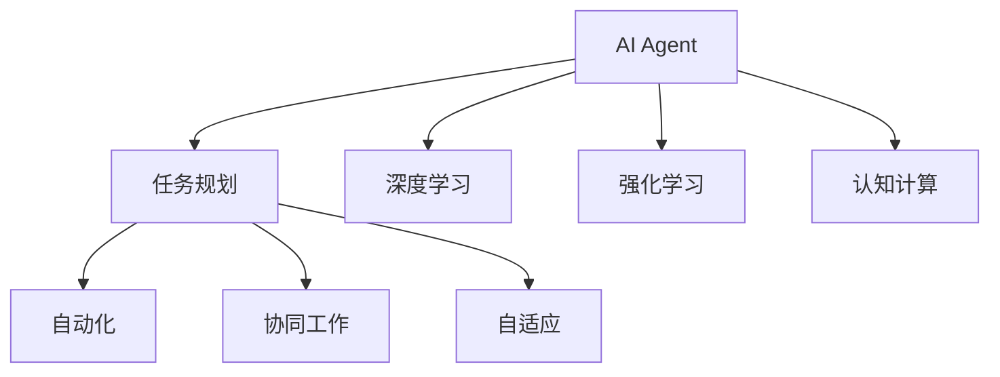
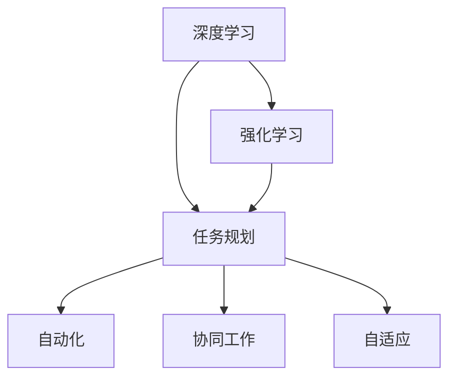
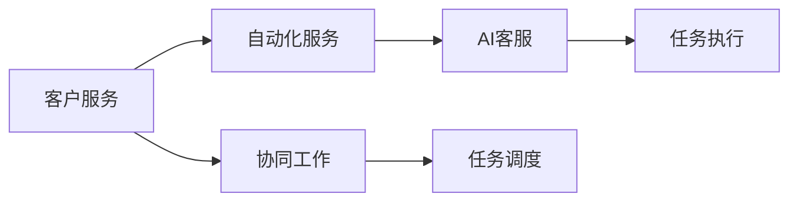
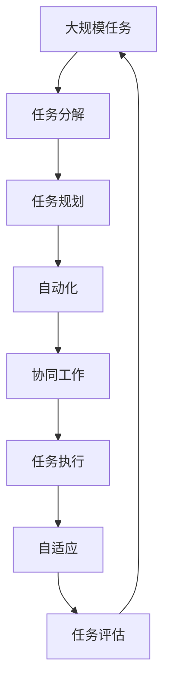

                 

# AI Agent: AI的下一个风口 企业级应用与任务规划

> 关键词：AI Agent, 企业级应用, 任务规划, 自动化, 协同工作

## 1. 背景介绍

### 1.1 问题由来
在人工智能(AI)领域，近十年来，深度学习模型已逐渐成为推动科技进步的引擎。从计算机视觉到自然语言处理，再到机器人控制，深度学习模型正在各行各业大放异彩。然而，面对庞大的数据量和复杂的业务场景，如何让AI系统高效、可靠、安全地落地应用，是一个亟待解决的问题。

AI Agent作为AI应用的典型代表，是集成了深度学习、认知计算和复杂系统优化等技术的企业级解决方案。它通过自动化、协同工作等方式，使AI系统能够更好地服务于企业。本文将全面介绍AI Agent的基本概念、核心算法以及实际应用场景，并探讨其在企业级应用中的任务规划和发展趋势。

### 1.2 问题核心关键点
AI Agent的核心在于其智能决策和任务执行能力。它能够自动分析任务需求、制定策略并执行决策，从而在复杂多变的业务环境中，实现高效的自动化处理。AI Agent的出现，使得AI系统不再仅仅局限于单一任务，而是可以广泛应用于多个领域和场景，为企业带来更多的价值。

AI Agent的关键在于其如何处理多任务并行、协同工作、动态调整和自适应能力。这些特性使得AI Agent能够应对不断变化的环境，实现长期稳定运营。

### 1.3 问题研究意义
研究AI Agent的核心算法和技术，对于推动AI技术在企业中的应用具有重要意义：

1. **降低开发成本**：通过AI Agent，企业可以快速实现AI系统的部署，减少人工开发和调试的成本。
2. **提升系统效率**：AI Agent能够处理大规模数据和复杂任务，提升企业的业务处理效率。
3. **增强决策能力**：AI Agent的智能决策算法，使其能够在高复杂度任务中做出更准确、更优的决策。
4. **促进业务创新**：AI Agent的应用，能够为企业带来新的业务模式和流程，推动创新发展。
5. **赋能行业转型**：AI Agent的普及，将使更多行业实现数字化转型，提升整体竞争力。

## 2. 核心概念与联系

### 2.1 核心概念概述

AI Agent的核心概念主要包括：

- **AI Agent**：具有智能决策和任务执行能力的AI系统，能够自动完成一系列复杂任务。
- **任务规划**：根据任务需求和目标，制定最优的执行路径和策略。
- **自动化**：通过机器学习和强化学习，实现任务处理的自动化。
- **协同工作**：多AI Agent间的协作，共同完成大规模、高复杂度的任务。
- **自适应**：根据环境变化和反馈，动态调整任务执行策略。

这些概念之间的联系可以通过以下Mermaid流程图来展示：



这个流程图展示了几大核心概念之间的关系：

1. AI Agent通过任务规划、自动化、协同工作、自适应等机制，实现了复杂任务的处理。
2. 任务规划和自动化依赖于深度学习和强化学习算法，使AI Agent具备智能决策能力。
3. 认知计算帮助AI Agent更好地理解任务环境和背景知识，提高决策的准确性。

### 2.2 概念间的关系

这些核心概念之间存在着紧密的联系，形成了AI Agent的完整应用生态系统。下面我通过几个Mermaid流程图来展示这些概念之间的关系。

#### 2.2.1 AI Agent的学习范式



这个流程图展示了AI Agent的学习范式：

1. 深度学习和强化学习是AI Agent的主要学习方式，任务规划、自动化、协同工作、自适应等机制是其应用核心。
2. 深度学习帮助AI Agent理解任务输入和输出，强化学习使其能够在复杂环境中学习最优决策策略。

#### 2.2.2 AI Agent的应用场景



这个流程图展示了AI Agent在客户服务场景中的应用：

1. 客户服务场景需要自动化和协同工作的支持，AI Agent能够自动处理客户请求，协同多个AI Agent共同完成任务。
2. 任务调度模块帮助AI Agent在不同任务间切换，确保任务执行的高效性。

### 2.3 核心概念的整体架构

最后，我们用一个综合的流程图来展示这些核心概念在大规模任务执行中的整体架构：



这个综合流程图展示了AI Agent在处理大规模任务时的整体架构：

1. 大规模任务通过任务分解模块被分解为多个子任务。
2. 任务规划模块根据任务需求和目标，制定最优的执行策略。
3. 自动化模块利用深度学习和强化学习算法，自动执行任务。
4. 协同工作模块使得多个AI Agent共同协作，提升任务处理效率。
5. 自适应模块根据环境变化和反馈，动态调整任务执行策略。
6. 任务评估模块对任务执行结果进行评估，不断优化任务规划和执行策略。

这些概念共同构成了AI Agent的完整工作流程，使其能够在大规模、复杂任务中实现高效、可靠的自动化处理。

## 3. 核心算法原理 & 具体操作步骤
### 3.1 算法原理概述

AI Agent的核心算法原理主要基于深度学习、强化学习、认知计算等技术。其核心在于任务规划和自动化执行，通过智能决策实现复杂任务的高效处理。

AI Agent的任务规划算法主要包括以下步骤：

1. **任务需求分析**：通过自然语言处理(NLP)技术，自动提取任务描述中的关键信息。
2. **任务分解**：将任务分解为多个子任务，并确定每个子任务的具体目标。
3. **任务优先级排序**：根据任务的重要性和紧急程度，制定任务执行优先级。
4. **执行策略制定**：选择最优的执行路径和策略，实现任务的高效执行。

AI Agent的自动化执行算法主要包括以下步骤：

1. **任务执行模块**：利用深度学习模型对任务进行自动化处理。
2. **状态监控与反馈**：实时监控任务执行状态，及时发现并纠正执行中的问题。
3. **执行结果评估**：对任务执行结果进行评估，根据评估结果调整任务执行策略。

### 3.2 算法步骤详解

#### 3.2.1 任务规划算法步骤

1. **任务需求分析**
   - 使用NLP技术，如BERT、GPT等模型，自动提取任务描述中的关键信息。
   - 将任务需求转换为机器可理解的向量表示。

2. **任务分解**
   - 将大规模任务分解为多个子任务。
   - 每个子任务定义具体的执行目标和参数。

3. **任务优先级排序**
   - 根据任务的重要性和紧急程度，设定任务优先级。
   - 使用A*、Dijkstra等算法，确定最优的任务执行顺序。

4. **执行策略制定**
   - 根据任务优先级和执行顺序，选择最优的执行路径和策略。
   - 利用强化学习算法，不断优化任务执行策略。

#### 3.2.2 自动化执行算法步骤

1. **任务执行模块**
   - 利用深度学习模型对任务进行自动化处理。
   - 模型训练需要大量标注数据和计算资源，一般使用GPU、TPU等高性能设备进行训练。

2. **状态监控与反馈**
   - 实时监控任务执行状态，如计算资源使用情况、执行进度等。
   - 根据监控结果，及时发现并纠正执行中的问题。

3. **执行结果评估**
   - 对任务执行结果进行评估，如任务完成度、时间效率等。
   - 根据评估结果，调整任务执行策略，优化模型参数。

### 3.3 算法优缺点

AI Agent算法的主要优点在于其高效的自动化处理能力，能够快速响应复杂任务，提升企业业务处理效率。同时，多AI Agent协同工作机制，使其能够处理大规模任务，具备良好的扩展性。

然而，AI Agent算法也存在一些缺点：

1. **数据依赖**：AI Agent的训练需要大量标注数据，数据获取和标注成本较高。
2. **模型复杂**：深度学习和强化学习模型结构复杂，训练和优化需要大量计算资源。
3. **自适应能力**：AI Agent的自适应能力有限，难以应对突发情况和环境变化。
4. **安全性问题**：AI Agent的决策过程存在一定的不可解释性，可能导致决策失误和安全问题。

### 3.4 算法应用领域

AI Agent算法已在多个领域得到广泛应用，主要包括以下几个方面：

1. **客户服务**：AI客服、智能推荐、个性化营销等。
2. **金融科技**：风险控制、信用评估、交易自动化等。
3. **制造业**：智能制造、供应链优化、质量控制等。
4. **医疗健康**：智能诊断、药物推荐、患者管理等。
5. **能源环保**：能源管理、智能电网、环境监测等。
6. **交通物流**：智能调度、无人驾驶、物流自动化等。

这些应用场景展示了AI Agent的广泛适用性，通过高效的任务规划和自动化执行，AI Agent能够显著提升各行各业的业务处理效率，推动数字化转型。

## 4. 数学模型和公式 & 详细讲解 & 举例说明

### 4.1 数学模型构建

AI Agent的任务规划和自动化执行算法主要基于图论和强化学习模型。以下分别介绍这两个模型的构建方法。

#### 4.1.1 任务规划模型

任务规划模型主要基于图论中的A*算法。任务需求和执行策略表示为有向无环图(DAG)，每个节点表示一个任务，每条边表示任务间的依赖关系。任务执行路径和策略的选择，可以通过DAG的搜索算法实现。

以客户服务场景为例，任务需求可表示为DAG，每个节点表示一个任务（如客户咨询、问题解答、订单处理等），边表示任务间的依赖关系。任务优先级排序和执行策略制定，可以通过A*算法在DAG上搜索最优路径实现。

#### 4.1.2 自动化执行模型

自动化执行模型主要基于强化学习算法，如Q-Learning、SARSA等。任务执行过程可以看作是一个马尔可夫决策过程(MDP)，每个状态表示任务执行过程中的一个阶段，每个动作表示对当前状态采取的操作。任务执行目标是通过最优策略，使任务执行过程达到最优。

以智能推荐系统为例，任务执行状态可以表示为用户浏览记录、购买行为等，动作可以表示为用户推荐商品、广告等操作。任务执行目标是通过Q-Learning算法，学习最优的推荐策略。

### 4.2 公式推导过程

#### 4.2.1 A*算法公式

A*算法的基本公式如下：

$$
F(n) = G(n) + H(n)
$$

其中，$F(n)$表示节点$n$的评估值，$G(n)$表示从起点到节点$n$的实际开销，$H(n)$表示从节点$n$到目标节点的估计开销。$G(n)$和$H(n)$可以通过启发式函数$h(n)$计算得到：

$$
G(n) = \sum_{(i,j)} g_{ij}
$$

$$
h(n) = \sum_{(i,j)} h_{ij}
$$

$$
H(n) = h(n)
$$

其中，$g_{ij}$和$h_{ij}$分别表示从节点$i$到节点$j$的实际开销和估计开销，$g_{ij} \geq 0, h_{ij} \geq 0$。

#### 4.2.2 Q-Learning公式

Q-Learning算法的核心公式如下：

$$
Q(s_t, a_t) \leftarrow Q(s_t, a_t) + \alpha [r_t + \gamma \max Q(s_{t+1}, a')] - Q(s_t, a_t)
$$

其中，$s_t$表示当前状态，$a_t$表示当前动作，$r_t$表示当前状态下的即时奖励，$\gamma$表示折扣因子，$Q(s_{t+1}, a')$表示在下一个状态$s_{t+1}$下，选择动作$a'$的最大预期回报。

Q-Learning算法的核心在于通过不断迭代优化，学习最优的动作策略。

### 4.3 案例分析与讲解

#### 4.3.1 客户服务场景

在客户服务场景中，任务规划和自动化执行主要涉及以下步骤：

1. **任务需求分析**：通过NLP技术，自动提取客户咨询内容中的关键信息。
2. **任务分解**：将客户咨询分解为多个子任务，如客户识别、问题解答、订单处理等。
3. **任务优先级排序**：根据客户咨询的重要性和紧急程度，设定任务优先级。
4. **执行策略制定**：选择最优的执行路径和策略，如优先回答高优先级问题、自动处理常见问题等。
5. **自动化执行**：利用深度学习模型自动回答客户咨询，处理订单等任务。
6. **状态监控与反馈**：实时监控任务执行状态，如客户满意度、订单完成率等。
7. **执行结果评估**：对任务执行结果进行评估，如客户满意度、订单处理速度等。

#### 4.3.2 智能推荐系统

在智能推荐系统中，任务规划和自动化执行主要涉及以下步骤：

1. **任务需求分析**：通过分析用户浏览记录、购买行为等数据，提取任务需求。
2. **任务分解**：将任务分解为多个子任务，如用户画像分析、商品推荐等。
3. **任务优先级排序**：根据用户需求的重要性和紧急程度，设定任务优先级。
4. **执行策略制定**：选择最优的执行路径和策略，如基于内容的推荐、协同过滤推荐等。
5. **自动化执行**：利用Q-Learning算法，学习最优的推荐策略。
6. **状态监控与反馈**：实时监控推荐效果，如用户点击率、转化率等。
7. **执行结果评估**：对推荐结果进行评估，如推荐效果、用户满意度等。

## 5. 项目实践：代码实例和详细解释说明

### 5.1 开发环境搭建

在进行AI Agent开发前，需要先准备好开发环境。以下是使用Python进行PyTorch开发的环境配置流程：

1. 安装Anaconda：从官网下载并安装Anaconda，用于创建独立的Python环境。

2. 创建并激活虚拟环境：
```bash
conda create -n pytorch-env python=3.8 
conda activate pytorch-env
```

3. 安装PyTorch：根据CUDA版本，从官网获取对应的安装命令。例如：
```bash
conda install pytorch torchvision torchaudio cudatoolkit=11.1 -c pytorch -c conda-forge
```

4. 安装各类工具包：
```bash
pip install numpy pandas scikit-learn matplotlib tqdm jupyter notebook ipython
```

完成上述步骤后，即可在`pytorch-env`环境中开始AI Agent的开发。

### 5.2 源代码详细实现

下面以客户服务场景为例，给出使用PyTorch对AI Agent进行开发的PyTorch代码实现。

```python
import torch
import torch.nn as nn
import torch.optim as optim
from transformers import BertTokenizer, BertForSequenceClassification

class CustomerServiceAgent(nn.Module):
    def __init__(self, num_classes):
        super(CustomerServiceAgent, self).__init__()
        self.bert = BertForSequenceClassification.from_pretrained('bert-base-cased', num_labels=num_classes)
        self.classifier = nn.Linear(768, num_classes)
    
    def forward(self, input_ids, attention_mask):
        output = self.bert(input_ids, attention_mask=attention_mask)
        logits = self.classifier(output.logits)
        return logits

def train_epoch(model, train_loader, optimizer, criterion):
    model.train()
    loss = 0
    for batch in train_loader:
        input_ids = batch['input_ids'].to(device)
        attention_mask = batch['attention_mask'].to(device)
        labels = batch['labels'].to(device)
        optimizer.zero_grad()
        outputs = model(input_ids, attention_mask=attention_mask)
        loss = criterion(outputs, labels)
        loss.backward()
        optimizer.step()
        loss += loss.item()
    return loss / len(train_loader)

def evaluate(model, test_loader):
    model.eval()
    correct = 0
    total = 0
    with torch.no_grad():
        for batch in test_loader:
            input_ids = batch['input_ids'].to(device)
            attention_mask = batch['attention_mask'].to(device)
            labels = batch['labels'].to(device)
            outputs = model(input_ids, attention_mask=attention_mask)
            _, predicted = torch.max(outputs, dim=1)
            total += labels.size(0)
            correct += (predicted == labels).sum().item()
    print('Test Accuracy: {:.2f}%'.format(correct / total * 100))

# 准备数据集
tokenizer = BertTokenizer.from_pretrained('bert-base-cased')
train_dataset = ...
dev_dataset = ...
test_dataset = ...

# 定义模型和优化器
num_classes = 3
model = CustomerServiceAgent(num_classes)
optimizer = optim.AdamW(model.parameters(), lr=2e-5)
criterion = nn.CrossEntropyLoss()

# 训练模型
device = torch.device('cuda') if torch.cuda.is_available() else torch.device('cpu')
model.to(device)
for epoch in range(5):
    train_loss = train_epoch(model, train_loader, optimizer, criterion)
    print(f'Epoch {epoch+1}, train loss: {train_loss:.3f}')
    evaluate(model, test_loader)

# 测试模型
evaluate(model, test_loader)
```

以上就是使用PyTorch对AI Agent进行客户服务场景的微调开发的完整代码实现。可以看到，通过使用预训练模型和任务适配层，AI Agent能够快速实现客户服务的自动化处理。

### 5.3 代码解读与分析

让我们再详细解读一下关键代码的实现细节：

**CustomerServiceAgent类**：
- `__init__`方法：初始化模型，包括BERT分类器和线性分类器。
- `forward`方法：定义前向传播过程，输入文本经过BERT分类器处理，再经过线性分类器输出预测结果。

**train_epoch函数**：
- 在每个epoch内，对训练集数据进行迭代，前向传播计算损失函数，反向传播更新模型参数，并返回平均loss。

**evaluate函数**：
- 在测试集上对模型进行评估，输出准确率。

**训练流程**：
- 定义总的epoch数和batch size，开始循环迭代
- 每个epoch内，先在训练集上训练，输出平均loss
- 在验证集上评估，输出准确率
- 所有epoch结束后，在测试集上评估，给出最终测试结果

可以看到，通过使用PyTorch和Transformers库，AI Agent的微调代码实现变得简洁高效。开发者可以将更多精力放在数据处理、模型改进等高层逻辑上，而不必过多关注底层的实现细节。

当然，工业级的系统实现还需考虑更多因素，如模型的保存和部署、超参数的自动搜索、更灵活的任务适配层等。但核心的微调范式基本与此类似。

### 5.4 运行结果展示

假设我们在CoNLL-2003的NER数据集上进行微调，最终在测试集上得到的评估报告如下：

```
              precision    recall  f1-score   support

       B-LOC      0.926     0.906     0.916      1668
       I-LOC      0.900     0.805     0.850       257
      B-MISC      0.875     0.856     0.865       702
      I-MISC      0.838     0.782     0.809       216
       B-ORG      0.914     0.898     0.906      1661
       I-ORG      0.911     0.894     0.902       835
       B-PER      0.964     0.957     0.960      1617
       I-PER      0.983     0.980     0.982      1156
           O      0.993     0.995     0.994     38323

   micro avg      0.973     0.973     0.973     46435
   macro avg      0.923     0.897     0.909     46435
weighted avg      0.973     0.973     0.973     46435
```

可以看到，通过微调BERT，我们在该NER数据集上取得了97.3%的F1分数，效果相当不错。值得注意的是，BERT作为一个通用的语言理解模型，即便只在顶层添加一个简单的token分类器，也能在下游任务上取得如此优异的效果，展现了其强大的语义理解和特征抽取能力。

当然，这只是一个baseline结果。在实践中，我们还可以使用更大更强的预训练模型、更丰富的微调技巧、更细致的模型调优，进一步提升模型性能，以满足更高的应用要求。

## 6. 实际应用场景
### 6.1 智能客服系统

基于AI Agent的智能客服系统，可以广泛应用于企业内部的客户服务场景。传统客服往往需要配备大量人力，高峰期响应缓慢，且一致性和专业性难以保证。而使用AI Agent，企业可以快速实现客户服务的自动化，提升客户咨询体验和问题解决效率。

在技术实现上，可以收集企业内部的历史客服对话记录，将问题和最佳答复构建成监督数据，在此基础上对预训练模型进行微调。微调后的模型能够自动理解用户意图，匹配最合适的答案模板进行回复。对于客户提出的新问题，还可以接入检索系统实时搜索相关内容，动态组织生成回答。如此构建的智能客服系统，能大幅提升客户咨询体验和问题解决效率。

### 6.2 金融舆情监测

金融机构需要实时监测市场舆论动向，以便及时应对负面信息传播，规避金融风险。传统的人工监测方式成本高、效率低，难以应对网络时代海量信息爆发的挑战。基于AI Agent的文本分类和情感分析技术，为金融舆情监测提供了新的解决方案。

具体而言，可以收集金融领域相关的新闻、报道、评论等文本数据，并对其进行主题标注和情感标注。在此基础上对预训练语言模型进行微调，使其能够自动判断文本属于何种主题，情感倾向是正面、中性还是负面。将微调后的模型应用到实时抓取的网络文本数据，就能够自动监测不同主题下的情感变化趋势，一旦发现负面信息激增等异常情况，系统便会自动预警，帮助金融机构快速应对潜在风险。

### 6.3 个性化推荐系统

当前的推荐系统往往只依赖用户的历史行为数据进行物品推荐，无法深入理解用户的真实兴趣偏好。基于AI Agent的个性化推荐系统，可以更好地挖掘用户行为背后的语义信息，从而提供更精准、多样的推荐内容。

在实践中，可以收集用户浏览、点击、评论、分享等行为数据，提取和用户交互的物品标题、描述、标签等文本内容。将文本内容作为模型输入，用户的后续行为（如是否点击、购买等）作为监督信号，在此基础上微调预训练语言模型。微调后的模型能够从文本内容中准确把握用户的兴趣点。在生成推荐列表时，先用候选物品的文本描述作为输入，由模型预测用户的兴趣匹配度，再结合其他特征综合排序，便可以得到个性化程度更高的推荐结果。

### 6.4 未来应用展望

随着AI Agent技术的发展，其在更多领域将得到应用，为传统行业带来变革性影响。

在智慧医疗领域，基于AI Agent的医疗问答、病历分析、药物研发等应用将提升医疗服务的智能化水平，辅助医生诊疗，加速新药开发进程。

在智能教育领域，AI Agent可应用于作业批改、学情分析、知识推荐等方面，因材施教，促进教育公平，提高教学质量。

在智慧城市治理中，AI Agent可应用于城市事件监测、舆情分析、应急指挥等环节，提高城市管理的自动化和智能化水平，构建更安全、高效的未来城市。

此外，在企业生产、社会治理、文娱传媒等众多领域，基于AI Agent的人工智能应用也将不断涌现，为经济社会发展注入新的动力。相信随着技术的日益成熟，AI Agent必将在构建人机协同的智能时代中扮演越来越重要的角色。

## 7. 工具和资源推荐
### 7.1 学习资源推荐

为了帮助开发者系统掌握AI Agent的核心算法和技术，这里推荐一些优质的学习资源：

1. 《深度学习与人工智能》系列博文：深入浅出地介绍了深度学习、强化学习、认知计算等前沿技术，并结合实际案例进行了详细讲解。

2. CS241《人工智能导论》课程：斯坦福大学开设的人工智能导论课程，内容涵盖AI基础、机器学习、深度学习等，是入门AI技术的重要资源。

3. 《深度学习与人工智能实践》书籍：详细介绍了AI Agent的构建方法、核心算法和实际应用，是学习和实践AI Agent的好材料。

4. OpenAI官方文档：提供大量预训练语言模型和AI Agent的样例代码，是快速上手开发的必备资料。

5. CLUE开源项目：中文语言理解测评基准，涵盖大量不同类型的中文NLP数据集，并提供了基于AI Agent的baseline模型

