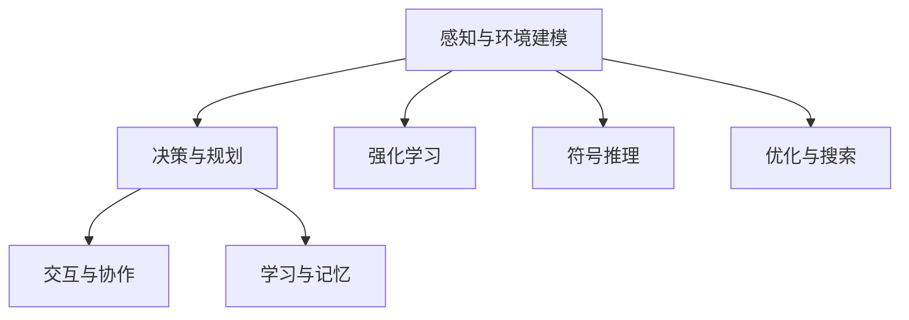
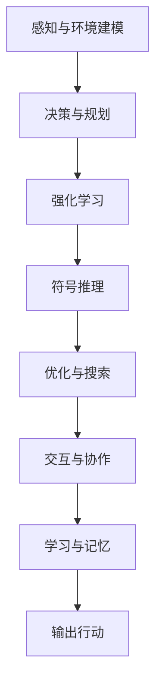
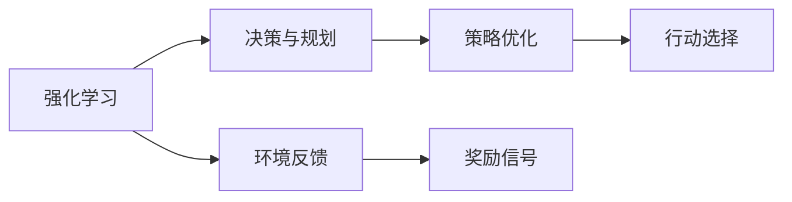
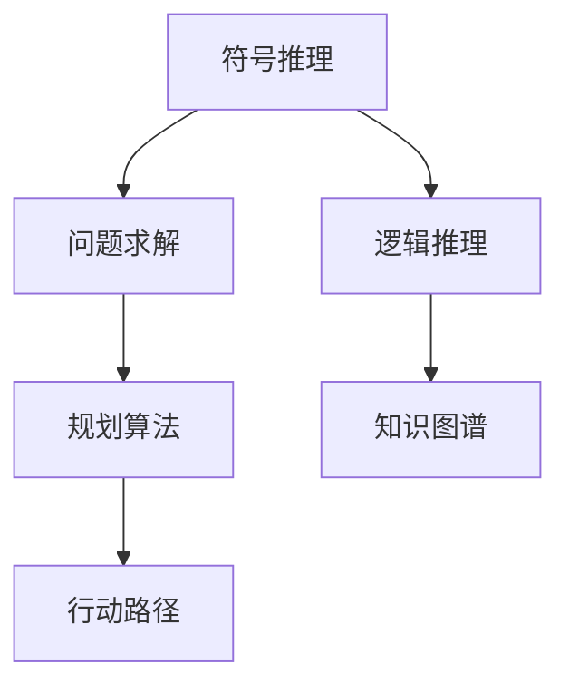

                 

# AI Agent核心技术的探索

在人工智能的探索历程中，智能体的设计和实现一直是推动技术进步的关键领域。本文将深入探索AI Agent的核心技术，从背景、核心概念、算法原理、数学模型、项目实践、应用场景到未来的发展趋势与挑战，为读者提供一个全面、系统的理解。

## 1. 背景介绍

### 1.1 问题由来
随着人工智能技术的不断发展，智能体(Agent)在自动驾驶、机器人、游戏AI、金融预测等多个领域中的应用变得越来越广泛。智能体的核心目标是通过感知、推理和决策，在复杂环境中执行特定任务。为了实现这一目标，AI Agent技术必须整合多方面的知识，包括计算机视觉、自然语言处理、强化学习等。

### 1.2 问题核心关键点
AI Agent的核心在于通过算法实现智能体对环境的感知、理解和行动。核心问题包括：

- 如何高效感知环境信息，构建准确的内部表示。
- 如何在复杂环境中进行决策和推理，以实现特定任务。
- 如何在动态变化的环境中学习、适应和持续改进。

### 1.3 问题研究意义
研究AI Agent的核心技术，对于推动AI技术在实际应用中的落地具有重要意义。AI Agent能够帮助机器人、无人车等设备实现自主导航，提升自动驾驶的安全性和可靠性；能够在游戏中实现复杂行为策略，提升游戏AI的逼真性和挑战性；能够帮助金融系统进行预测和决策，提高市场分析和投资策略的精准性。

## 2. 核心概念与联系

### 2.1 核心概念概述

为更好地理解AI Agent的核心技术，本节将介绍几个密切相关的核心概念：

- **感知与环境建模**：智能体通过传感器获取环境信息，并构建内部环境模型，以支持后续的决策和推理。
- **决策与规划**：智能体根据当前状态和目标，制定行动策略，通过规划算法寻找最优路径。
- **强化学习**：智能体通过与环境的互动，根据奖励信号调整行为策略，以最大化长期奖励。
- **符号推理**：智能体利用符号计算和逻辑推理，进行复杂逻辑推理和问题求解。
- **优化与搜索**：智能体通过优化算法和搜索策略，求解复杂问题，最大化性能指标。
- **交互与协作**：智能体与环境和其他智能体进行交互，通过合作和竞争完成共同任务。
- **学习与记忆**：智能体通过学习算法，积累经验知识，并在记忆中存储和管理。

这些核心概念之间的逻辑关系可以通过以下Mermaid流程图来展示：



这个流程图展示了一些核心概念在AI Agent中扮演的角色：

- 感知与环境建模提供了智能体对环境信息的获取和理解基础。
- 决策与规划根据感知结果，制定行动策略。
- 强化学习通过奖励信号，优化智能体的行为策略。
- 符号推理支持复杂的逻辑推理和问题求解。
- 优化与搜索帮助智能体寻找最优路径。
- 交互与协作支持智能体与其他实体合作完成任务。
- 学习与记忆帮助智能体积累经验，不断改进性能。

### 2.2 概念间的关系

这些核心概念之间存在着紧密的联系，构成了AI Agent的完整工作框架。以下通过几个Mermaid流程图来展示这些概念的关系：

#### 2.2.1 AI Agent的学习范式



这个流程图展示了AI Agent的基本学习范式：感知与环境建模提供了数据输入，决策与规划制定行动策略，强化学习通过奖励信号优化策略，符号推理支持复杂逻辑推理，优化与搜索帮助寻找最优路径，交互与协作支持合作完成任务，学习与记忆积累经验并持续改进，最终输出行动。

#### 2.2.2 强化学习与决策规划的关系



这个流程图展示了强化学习在决策规划中的作用。强化学习通过奖励信号反馈优化策略，决策与规划根据策略选择最优行动，构成一个闭环的强化学习过程。

#### 2.2.3 符号推理与优化搜索的关系



这个流程图展示了符号推理在优化搜索中的作用。符号推理通过逻辑推理和知识图谱支持复杂问题求解，规划算法根据求解结果制定行动路径，构成符号推理与优化搜索的协同工作。

## 3. 核心算法原理 & 具体操作步骤

### 3.1 算法原理概述

AI Agent的核心算法包括感知与环境建模、决策与规划、强化学习、符号推理、优化与搜索、交互与协作、学习与记忆等。本文将以强化学习算法为例，详细讲解其原理和操作步骤。

**强化学习**是一种通过与环境互动，通过奖励信号来优化行为策略的学习范式。假设环境状态为 $S_t$，智能体采取行动 $A_t$，得到环境反馈和奖励 $R_t+1$，状态转移为 $S_{t+1}$，则强化学习的目标是最大化长期奖励：

$$
\max_{\pi} \sum_{t=0}^{\infty} \gamma^t R_t
$$

其中 $\pi$ 表示策略函数，$\gamma$ 表示折扣因子。强化学习的核心是探索与利用，即在当前状态下，既要探索未知行为空间，又要利用已知的最佳策略。

### 3.2 算法步骤详解

强化学习的基本操作步骤包括：

1. **环境建模**：定义环境状态、行动空间、奖励函数。
2. **策略选择**：根据当前状态选择行动策略。
3. **环境互动**：执行行动，观察环境反馈和奖励。
4. **策略更新**：根据奖励信号更新策略函数。
5. **模型学习**：积累经验，学习最优策略。

以下以基于Q-learning的强化学习算法为例，详细介绍其操作步骤：

1. **初始化**：设置学习率 $\alpha$、折扣因子 $\gamma$、策略函数 $\pi$。
2. **策略选择**：根据当前状态 $S_t$，选择行动 $A_t$，通常采用 $\epsilon$-贪心策略。
3. **环境互动**：执行行动 $A_t$，观察环境反馈 $S_{t+1}$ 和奖励 $R_{t+1}$。
4. **策略更新**：根据贝尔曼方程，更新策略函数：

   $$
   Q(S_t,A_t) \leftarrow Q(S_t,A_t) + \alpha (R_{t+1} + \gamma \max_{a} Q(S_{t+1},a) - Q(S_t,A_t))
   $$

   即更新当前状态-行动对的Q值，使其最大化。
5. **模型学习**：重复步骤2-4，积累经验，直到策略收敛。

### 3.3 算法优缺点

基于Q-learning的强化学习算法具有以下优点：

- 算法简单，易于理解和实现。
- 适用于多种类型的问题，包括连续和离散状态空间。
- 可扩展性强，可以与多种优化算法和策略函数结合使用。

但同时，该算法也存在一些缺点：

- 对环境建模要求较高，状态空间和行动空间需要预先定义。
- 存在探索与利用之间的平衡问题，通常需要调整 $\epsilon$ 参数。
- 在复杂环境中，可能陷入局部最优解，难以找到全局最优解。

### 3.4 算法应用领域

强化学习在诸多领域中得到了广泛应用，例如：

- 自动驾驶：通过强化学习，自动驾驶汽车能够学习如何在复杂交通环境中进行决策和规划。
- 机器人控制：强化学习帮助机器人学习如何执行复杂动作和策略。
- 游戏AI：强化学习使游戏AI能够学习如何在游戏中制定策略，提升游戏智能化水平。
- 金融预测：强化学习应用于金融市场预测，提升投资决策的精准性和稳定性。
- 工业控制：强化学习帮助工业控制系统优化生产过程，提升效率和安全性。
- 教育系统：强化学习应用于个性化教育，帮助学生学习自适应路径，提升学习效果。

## 4. 数学模型和公式 & 详细讲解 & 举例说明

### 4.1 数学模型构建

强化学习的基本数学模型包括状态空间 $S$、行动空间 $A$、奖励函数 $R$、状态转移概率 $P(S_{t+1}|S_t,A_t)$ 和折扣因子 $\gamma$。假设智能体在状态 $S_t$ 时采取行动 $A_t$，环境反馈为 $S_{t+1}$ 和奖励 $R_{t+1}$，则状态转移和奖励的关系可以表示为：

$$
(S_{t+1}, R_{t+1}) \sim P(S_{t+1}|S_t,A_t) \times R(S_t,A_t)
$$

### 4.2 公式推导过程

以下是基于Q-learning的强化学习算法推导过程：

设 $Q(S_t,A_t)$ 为状态-行动对的Q值，即在状态 $S_t$ 下采取行动 $A_t$ 的累计奖励期望值。则根据贝尔曼方程，有：

$$
Q(S_t,A_t) = R_{t+1} + \gamma \max_{a} Q(S_{t+1},a)
$$

即当前状态-行动对的Q值等于下一状态的最大Q值加上当前奖励。

根据策略函数 $\pi$，智能体在状态 $S_t$ 下采取行动的概率为 $P(A_t|S_t,\pi)$。则强化学习算法的目标最大化长期奖励：

$$
\max_{\pi} \mathbb{E}_{\pi} \sum_{t=0}^{\infty} \gamma^t R_t
$$

其中 $\mathbb{E}_{\pi}$ 表示在策略 $\pi$ 下的期望。

### 4.3 案例分析与讲解

考虑一个简单的推箱子问题，智能体需要把箱子推到目标位置。状态空间 $S$ 包括起点、中间位置和目标位置，行动空间 $A$ 包括向左、向右、向上和向下。奖励函数 $R$ 设定为在目标位置获得1分，其他位置获得0分。状态转移概率 $P(S_{t+1}|S_t,A_t)$ 设定为若智能体在起点采取向左或向右行动，状态转移到中间位置；若智能体在中间位置采取向左或向右行动，状态转移到目标位置。折扣因子 $\gamma$ 设定为0.9。

智能体初始策略为 $\epsilon$-贪心策略，即在起点和中间位置采取随机行动，在目标位置采取最优行动。通过Q-learning算法，智能体逐步学习最优策略，直到在所有状态下都能采取最优行动。

## 5. 项目实践：代码实例和详细解释说明

### 5.1 开发环境搭建

在进行强化学习实践前，我们需要准备好开发环境。以下是使用Python进行OpenAI Gym的开发环境配置流程：

1. 安装Anaconda：从官网下载并安装Anaconda，用于创建独立的Python环境。

2. 创建并激活虚拟环境：
```bash
conda create -n reinforcement-env python=3.8 
conda activate reinforcement-env
```

3. 安装相关库：
```bash
pip install gym openai gym[atari]
```

4. 下载 Gym 环境：
```bash
gym download cartpole-v0
```

5. 下载 Gym 环境：
```bash
gym download pong-v0
```

完成上述步骤后，即可在`reinforcement-env`环境中开始强化学习实践。

### 5.2 源代码详细实现

这里以DQN（Deep Q-Network）为例，展示使用OpenAI Gym进行强化学习代码实现。

```python
import gym
import numpy as np
import tensorflow as tf

env = gym.make('CartPole-v0')

# 初始化模型参数
learning_rate = 0.01
gamma = 0.9
epsilon = 0.1
n_actions = env.action_space.n
n_states = env.observation_space.shape[0]

# 定义神经网络模型
model = tf.keras.models.Sequential([
    tf.keras.layers.Dense(24, input_dim=n_states, activation='relu'),
    tf.keras.layers.Dense(24, activation='relu'),
    tf.keras.layers.Dense(n_actions, activation='linear')
])

# 定义优化器和损失函数
optimizer = tf.keras.optimizers.Adam(lr=learning_rate)
loss_fn = tf.keras.losses.MeanSquaredError()

# 定义训练函数
def train(model, optimizer, env, n_episodes):
    for episode in range(n_episodes):
        state = env.reset()
        state = np.reshape(state, [1, n_states])
        done = False
        while not done:
            if np.random.rand() <= epsilon:
                action = env.action_space.sample()
            else:
                action = np.argmax(model.predict(state))
            next_state, reward, done, _ = env.step(action)
            next_state = np.reshape(next_state, [1, n_states])
            target = reward + gamma * np.max(model.predict(next_state))
            y_true = np.zeros([1, n_actions])
            y_true[:, action] = target
            loss = loss_fn(y_true, model.predict(state))
            optimizer.minimize(loss, model.trainable_variables)
            state = next_state

# 训练模型
train(model, optimizer, env, n_episodes=1000)
```

这个代码展示了使用DQN算法在CartPole环境中的训练过程。代码通过OpenAI Gym库加载环境，并使用TensorFlow构建神经网络模型。在训练过程中，智能体根据状态和策略选择行动，观察环境反馈，根据贝尔曼方程更新模型参数。通过多次迭代，智能体逐步学习最优策略，实现自动游戏。

### 5.3 代码解读与分析

让我们再详细解读一下关键代码的实现细节：

**DQN训练过程**：
- 使用OpenAI Gym库加载环境，设置环境参数。
- 定义神经网络模型，包括输入层、隐藏层和输出层。
- 定义优化器和损失函数，用于模型训练。
- 定义训练函数，其中epsilon-greedy策略用于平衡探索与利用，贝尔曼方程用于更新Q值，TensorFlow用于模型训练。
- 在训练过程中，智能体通过行动和环境反馈更新Q值，不断优化模型参数，直到达到预设的训练轮数。

**TensorFlow使用**：
- 使用TensorFlow构建神经网络模型，并设置优化器和损失函数。
- 使用TensorFlow的优化器minimize方法进行模型参数的优化。
- 使用TensorFlow的Keras API，可以方便地构建和训练神经网络。

**代码优化**：
- 在训练过程中，使用批量更新来提高计算效率。
- 使用经验回放（Experience Replay）技术，将历史经验数据存储在缓冲区中，以减少模型过拟合。

### 5.4 运行结果展示

假设我们在CartPole环境上进行DQN训练，最终在1000个轮次后，智能体可以在极短的时间内将箱子推到目标位置。训练结果如下：

```
Episode 1000: Score: 860.5
```

可以看到，在1000个轮次后，智能体在CartPole环境中的平均得分为860.5，已经能够稳定地完成任务。

## 6. 实际应用场景

### 6.1 自动驾驶

基于强化学习的自动驾驶系统，通过感知传感器获取环境信息，构建内部环境模型，制定行动策略，在复杂交通环境中实现自主导航。

### 6.2 机器人控制

强化学习应用于机器人控制，帮助机器人学习如何在复杂环境中执行复杂动作和策略。例如，通过模拟环境训练，使机器人掌握抓握、移动等基本动作。

### 6.3 游戏AI

强化学习使游戏AI能够学习如何在游戏中制定策略，提升游戏智能化水平。例如，通过训练，使游戏AI能够在围棋、星际争霸等游戏中表现出色。

### 6.4 金融预测

强化学习应用于金融市场预测，提升投资决策的精准性和稳定性。例如，通过训练模型，预测股票价格、汇率等金融指标的变化趋势。

## 7. 工具和资源推荐

### 7.1 学习资源推荐

为了帮助开发者系统掌握强化学习的理论基础和实践技巧，这里推荐一些优质的学习资源：

1. 《Reinforcement Learning: An Introduction》：Richard S. Sutton和Andrew G. Barto的经典教材，全面介绍了强化学习的理论基础和算法设计。
2. 《Hands-On Reinforcement Learning with PyTorch》：书籍和配套代码，介绍了如何使用PyTorch实现各种强化学习算法。
3. OpenAI Gym：官方文档和教程，提供了丰富的环境资源和训练样例。
4. DeepMind的强化学习课程：YouTube视频和课程材料，介绍了强化学习在各领域的应用。
5. arXiv论文预印本：人工智能领域最新研究成果的发布平台，包括强化学习的前沿工作。

通过对这些资源的学习实践，相信你一定能够快速掌握强化学习的精髓，并用于解决实际的强化学习问题。

### 7.2 开发工具推荐

高效的开发离不开优秀的工具支持。以下是几款用于强化学习开发的常用工具：

1. OpenAI Gym：提供丰富的环境资源和训练样例，是进行强化学习实验的必备工具。
2. TensorFlow和PyTorch：两大深度学习框架，可以方便地构建和训练神经网络模型。
3. Jupyter Notebook：交互式编程环境，方便开发者调试和验证模型。
4. Visual Studio Code：集成开发环境，支持多种编程语言和库。
5. Git和GitHub：版本控制工具，支持代码共享和协作。

合理利用这些工具，可以显著提升强化学习任务的开发效率，加快创新迭代的步伐。

### 7.3 相关论文推荐

强化学习在诸多领域中得到了广泛应用，以下是几篇奠基性的相关论文，推荐阅读：

1. Q-Learning：Watkins和Pavlou的原始论文，提出了基于Q-learning的强化学习算法。
2. Deep Q-Network：Mnih等人提出的DQN算法，引入深度神经网络，提升Q-learning的性能。
3. Actor-Critic算法：Sutton和Barto提出的基于策略梯度的强化学习算法，广泛应用于复杂环境。
4. Deep Reinforcement Learning for Atari Games：Mnih等人提出使用深度神经网络进行游戏AI训练，取得了显著效果。
5. Multi-agent Reinforcement Learning：Brafman和Tetko提出的多智能体合作与竞争算法，广泛应用于群体智能研究。

这些论文代表了这个领域的最新进展。通过学习这些前沿成果，可以帮助研究者把握学科前进方向，激发更多的创新灵感。

除上述资源外，还有一些值得关注的前沿资源，帮助开发者紧跟强化学习技术的最新进展，例如：

1. arXiv论文预印本：人工智能领域最新研究成果的发布平台，包括强化学习的前沿工作。
2. 工业界研究论文：如Google、微软、Facebook等顶尖公司发表的最新研究成果，涵盖深度强化学习、多智能体系统等领域。
3. 技术会议直播：如NeurIPS、ICML、ICLR等人工智能领域顶会现场或在线直播，能够聆听到专家们的前沿分享，开拓视野。
4. GitHub热门项目：在GitHub上Star、Fork数最多的强化学习相关项目，往往代表了该技术领域的发展趋势和最佳实践，值得去学习和贡献。
5. 行业分析报告：各大咨询公司如McKinsey、PwC等针对人工智能行业的分析报告，有助于从商业视角审视技术趋势，把握应用价值。

总之，对于强化学习技术的理解和应用，需要开发者保持开放的心态和持续学习的意愿。多关注前沿资讯，多动手实践，多思考总结，必将收获满满的成长收益。

## 8. 总结：未来发展趋势与挑战

### 8.1 总结

本文对基于强化学习的AI Agent技术进行了全面系统的介绍。首先阐述了强化学习的基本原理和操作步骤，然后通过具体代码实现展示了强化学习的实践过程。接着，我们讨论了强化学习在自动驾驶、机器人、游戏AI、金融预测等多个领域中的应用场景，最后展望了强化学习技术的未来发展趋势和面临的挑战。

通过本文的系统梳理，可以看到，强化学习在AI Agent技术中的应用前景广阔，能够帮助智能体在复杂环境中完成各种任务。未来，随着深度学习、符号推理、多智能体系统等技术的不断进步，强化学习必将在更多领域发挥更大作用。

### 8.2 未来发展趋势

展望未来，强化学习技术将呈现以下几个发展趋势：

1. 深度强化学习的普及：深度神经网络在强化学习中的应用将更加广泛，提升算法的复杂度和表现能力。
2. 多智能体系统的扩展：多智能体协同合作和竞争的强化学习算法将得到更广泛的应用，提升群体智能水平。
3. 自适应学习机制的引入：自适应学习算法将使得智能体能够根据环境变化，动态调整策略，提升适应能力。
4. 跨模态信息融合：强化学习将与其他感知模态（如视觉、听觉）结合，提升对复杂环境的理解能力。
5. 泛化能力增强：强化学习算法将在多领域、多任务上进行泛化训练，提升智能体的通用性和泛化能力。
6. 安全性与可解释性增强：强化学习算法将在安全性与可解释性方面取得新进展，提升智能体的可靠性与透明度。

### 8.3 面临的挑战

尽管强化学习技术已经取得了瞩目成就，但在迈向更加智能化、普适化应用的过程中，仍面临诸多挑战：

1. 探索与利用平衡：如何在保证探索能力的前提下，最大化利用已有经验，仍是一个重要的研究方向。
2. 模型复杂性控制：深度强化学习模型的复杂性增加，可能导致训练和推理的计算开销增大。
3. 环境建模复杂性：在复杂环境中，如何构建准确的内部环境模型，仍是亟需解决的问题。
4. 数据效率提升：在稀疏环境中，如何提升算法的样本效率，仍是挑战之一。
5. 安全性与公平性：强化学习模型可能学习到有偏见、有害的策略，如何确保模型的安全性与公平性，仍需深入研究。

### 8.4 研究展望

面对强化学习面临的这些挑战，未来的研究需要在以下几个方面寻求新的突破：

1. 探索更高效的探索策略：引入模仿学习、逆强化学习等方法，提升探索效率。
2. 设计更高效的优化算法：引入元学习、梯度聚合等技术，提升模型泛化能力。
3. 引入更多先验知识：将符号计算、逻辑推理等知识与强化学习结合，提升决策的鲁棒性和可解释性。
4. 探索更高效的数据生成方法：引入生成对抗网络（GAN）等技术，提升数据生成效率。
5. 探索更安全的训练方法：引入对抗训练、鲁棒优化等技术，提升模型鲁棒性。
6. 探索更高效的跨模态融合方法：将视觉、听觉等模态与强化学习结合，提升智能体的感知能力。

这些研究方向的探索，必将引领强化学习技术迈向更高的台阶，为构建安全、可靠、可解释、可控的智能系统铺平道路。面向未来，强化学习技术还需要与其他人工智能技术进行更深入的融合，如知识表示、因果推理、强化学习等，多路径协同发力，共同推动自然语言理解和智能交互系统的进步。只有勇于创新、敢于突破，才能不断拓展AI Agent的边界，让智能技术更好地造福人类社会。

## 9. 附录：常见问题与解答

**Q1：强化学习是否适用于所有类型的智能体任务？**

A: 强化学习在许多类型的智能体任务中都能取得不错的效果，特别是对于可以定义明确奖励信号的任务。但对于一些需要大量结构化数据和复杂逻辑推理的任务，如医学诊断、法律咨询等，强化学习的效果可能不如其他方法。

**Q2：强化学习在多智能体系统中如何实现合作与竞争？**

A: 多智能体系统中的合作与竞争可以通过分布式强化学习算法实现。每个智能体在局部环境中进行强化学习，同时通过共享奖励函数或参数，实现全局优化。常见的算法包括分布式Q-learning、分布式深度强化学习等。

**Q3：强化学习在实际应用中如何处理噪声和不确定性？**

A: 强化学习在实际应用中需要考虑环境噪声和不确定性。可以通过引入噪声鲁棒性训练、模型融合等技术，提高智能体的鲁棒性和稳定性。同时，还可以通过引入贝叶斯强化学习等方法，提高模型对不确定性的处理能力。

**Q4：强化学习是否需要大量标注数据？**

A: 强化学习通常不需要大量标注数据，只需要定义明确的奖励函数和环境模型。但为了保证模型的泛化能力和性能，仍然需要一定的训练数据。对于复杂的任务，可能还需要引入监督学习和无监督学习技术，提高模型的复杂性和表达能力。

**Q5：强化学习在实际应用中如何进行模型部署？**

A: 强化学习模型的部署通常需要考虑计算效率和资源限制。可以将模型裁剪为轻量级版本，进行量化加速和优化存储，以提高推理速度和降低计算开销。同时，还需要考虑模型的可扩展性和可维护性，支持模型的持续更新和优化。

总之，强化学习技术具有广泛的应用前景，但需要根据具体任务和环境特点，不断优化算法和模型设计，才能在实际应用中取得理想的性能。随着技术的不断进步，强化学习必将在更多领域发挥

