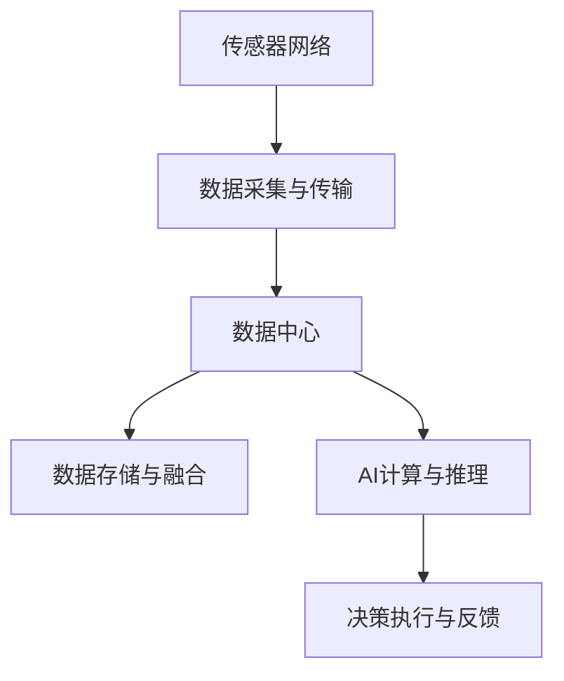

                 

# AI 基础设施的海洋生态：智能化海洋环境监测系统

> 关键词：
- AI基础设施
- 海洋环境监测
- 深度学习
- 传感器网络
- 数据融合
- 智能决策

## 1. 背景介绍

### 1.1 问题由来

随着全球气候变化和海洋环境恶化，海洋生态保护和资源利用面临重大挑战。现代海洋环境监测系统依赖于大规模的传感器网络和智能分析，以实时获取水质、温度、污染和生物多样性等关键指标。然而，现有的监测系统存在数据量大、存储成本高、实时处理能力不足等问题，难以应对复杂的海洋环境变化。

### 1.2 问题核心关键点

智能化海洋环境监测系统主要解决以下关键问题：

1. **高效数据采集与传输**：如何通过低功耗、高可靠性的传感器网络实时采集和传输海洋数据，确保数据连续性和完整性。
2. **数据融合与处理**：如何从海量异构数据中提取出有用信息，并对数据进行高效融合和处理，以支持实时决策。
3. **智能决策与控制**：如何在复杂海洋环境中进行精准决策，如水质净化、资源管理、灾害预警等，以实现智能控制。

### 1.3 问题研究意义

智能化海洋环境监测系统的研究，对于提升海洋资源利用效率、保护海洋生态、防范海洋灾害具有重要意义。通过AI技术和大数据融合，可以实现以下几个目标：

1. **提升监测效率**：减少人力成本，提高监测频次，增强环境监测的时效性和精确度。
2. **优化资源利用**：通过数据分析和智能决策，指导渔业、航运等行业合理利用海洋资源。
3. **改善生态环境**：实时监测海洋污染，及时响应环境灾害，保护海洋生态系统。
4. **增强安全性**：利用AI技术预测海洋灾害，如风暴潮、赤潮等，减少潜在风险。
5. **支撑智慧城市**：将海洋监测数据纳入智慧城市基础设施，支持城市规划和可持续发展。

## 2. 核心概念与联系

### 2.1 核心概念概述

智能化海洋环境监测系统涉及多个核心概念，包括：

- **海洋环境监测**：利用传感器网络实时采集水质、水温、盐度、溶解氧等关键环境参数。
- **数据融合**：通过集成多种数据源和异构数据，提高数据的准确性和可靠性。
- **智能决策**：基于AI和大数据分析，进行实时决策和预测，优化海洋资源管理和灾害预警。
- **深度学习**：利用深度神经网络对复杂海洋环境进行建模和预测，提升智能决策能力。
- **AI基础设施**：构建可扩展、高可靠性的AI计算平台，支持实时数据处理和智能决策。

### 2.2 核心概念间的关系

这些核心概念通过以下方式紧密联系，形成一个完整的智能化海洋环境监测系统：

1. **数据采集与传输**：传感器网络实时采集海洋数据，通过无线通信技术将数据传输至数据中心。
2. **数据存储与融合**：数据中心对接收到的数据进行存储和初步处理，通过数据融合技术提升数据质量。
3. **AI计算与推理**：利用深度学习模型对融合后的数据进行智能推理和决策，生成实时响应策略。
4. **决策执行与反馈**：根据AI计算结果，系统通过自动化控制技术执行决策，并实时反馈监测效果。

这些概念之间的关系通过以下Mermaid流程图展示：



这个流程图展示了从数据采集到智能决策的全流程，各环节相互配合，共同支撑智能化海洋环境监测系统的高效运行。

## 3. 核心算法原理 & 具体操作步骤

### 3.1 算法原理概述

智能化海洋环境监测系统的核心算法主要基于深度学习和大数据技术，通过以下几个步骤实现：

1. **数据预处理**：对传感器采集的原始数据进行清洗、归一化和标准化，以提高数据质量和可分析性。
2. **特征提取与选择**：利用特征提取算法从数据中提取出关键特征，并通过特征选择算法去除冗余和噪声特征。
3. **深度学习建模**：使用深度神经网络对数据进行建模，预测水质、污染等关键指标。
4. **数据融合与集成**：通过多源数据融合技术，将来自不同传感器和平台的数据集成到一个统一的数据系统中。
5. **智能决策与预测**：基于预测模型和实时数据，进行智能决策和预测，生成响应策略。

### 3.2 算法步骤详解

下面详细介绍智能化海洋环境监测系统的核心算法步骤：

#### 3.2.1 数据预处理

数据预处理是智能监测系统的重要环节，包括：

- **数据清洗**：去除异常值和缺失值，确保数据的完整性和准确性。
- **归一化**：将不同量级的原始数据映射到[0,1]区间，方便后续处理。
- **标准化**：对数据进行均值和方差归一化，确保数据的分布一致性。

#### 3.2.2 特征提取与选择

特征提取和选择是提升模型性能的关键步骤，包括以下几种方法：

- **主成分分析(PCA)**：通过降维技术减少特征维度，去除冗余信息。
- **独立成分分析(ICA)**：将数据分解为多个独立成分，提高数据可解释性。
- **时间序列分析**：利用时间序列模型分析数据的动态变化规律。

#### 3.2.3 深度学习建模

深度学习模型主要用于海洋环境预测和分析，包括：

- **卷积神经网络(CNN)**：用于图像和空间数据的特征提取和分类。
- **循环神经网络(RNN)**：适用于时间序列数据的建模和预测。
- **长短时记忆网络(LSTM)**：适用于长序列数据的建模和记忆。
- **自注意力机制**：用于多源数据融合和复杂环境建模。

#### 3.2.4 数据融合与集成

数据融合与集成是提升系统鲁棒性和可靠性的重要手段，包括以下几种方法：

- **加权平均法**：对不同数据源赋予不同权重，综合计算融合结果。
- **D-S证据理论**：通过组合证据实现多源数据融合，提高数据的一致性和可靠性。
- **贝叶斯融合方法**：利用贝叶斯网络实现数据融合，提高数据处理的准确性。

#### 3.2.5 智能决策与预测

智能决策与预测是系统的主要目标，包括以下几个步骤：

- **目标识别**：使用目标检测算法识别水质、污染等关键指标。
- **预测建模**：基于预测模型进行水质、污染等指标的预测。
- **智能决策**：根据预测结果和实时数据，生成智能决策和响应策略。

### 3.3 算法优缺点

智能化海洋环境监测系统的核心算法具有以下优缺点：

**优点**：

- **高精度**：深度学习模型能够捕捉复杂环境特征，提高预测精度。
- **自适应性**：能够自动调整模型参数，适应环境变化。
- **高效性**：深度学习模型并行计算能力强，能够快速处理大量数据。

**缺点**：

- **高计算成本**：深度学习模型需要大量计算资源进行训练和推理。
- **模型复杂性**：模型结构复杂，难以解释和调试。
- **数据依赖性**：模型性能高度依赖于训练数据的质量和数量。

### 3.4 算法应用领域

智能化海洋环境监测系统的核心算法在多个领域都有广泛应用，包括：

- **水质监测**：利用传感器网络实时监测水质指标，如pH值、溶解氧、悬浮物等。
- **污染预警**：通过深度学习模型预测水质污染和海洋垃圾，提前预警。
- **资源管理**：利用智能决策优化渔业资源管理和海洋资源保护。
- **灾害预警**：通过智能分析预测风暴潮、赤潮等海洋灾害，减少灾害损失。
- **智能导航**：利用深度学习模型优化航道规划和航行决策，提高航行安全。

## 4. 数学模型和公式 & 详细讲解

### 4.1 数学模型构建

智能化海洋环境监测系统的数学模型主要基于深度学习和大数据分析，包括以下几个关键步骤：

1. **输入数据**：$X=\{x_1,x_2,...,x_n\}$，表示传感器网络采集的多维数据。
2. **模型训练**：利用深度学习模型对数据进行建模，生成预测结果$Y$。
3. **数据融合**：利用融合算法将多源数据$Z=\{z_1,z_2,...,z_m\}$集成到统一系统$Z'$。
4. **智能决策**：根据预测结果和实时数据$D=\{d_1,d_2,...,d_t\}$，生成智能决策$A=\{a_1,a_2,...,a_l\}$。

### 4.2 公式推导过程

以水质监测为例，推导基于深度学习的预测模型公式：

设预测目标为水质指标$y$，传感器数据为$x$，模型为$f(x;\theta)$，其中$\theta$为模型参数。预测模型的目标是最小化均方误差：

$$
\min_{\theta} \frac{1}{n} \sum_{i=1}^n (y_i - f(x_i;\theta))^2
$$

其中，$y_i$为第$i$个样本的真实水质指标，$f(x_i;\theta)$为预测模型的输出。

使用梯度下降法求解模型参数$\theta$：

$$
\theta \leftarrow \theta - \eta \nabla_{\theta} \mathcal{L}(\theta)
$$

其中，$\eta$为学习率，$\mathcal{L}$为损失函数。常用的损失函数包括均方误差、交叉熵等。

### 4.3 案例分析与讲解

以海洋污染预警为例，详细分析数据融合与智能决策的实现过程：

1. **数据融合**：
   - 利用D-S证据理论融合多个传感器数据，生成综合结果。
   - 根据贝叶斯网络计算各数据源的可信度，加权平均生成融合结果。

2. **智能决策**：
   - 利用深度学习模型预测水质污染指标。
   - 根据预测结果和实时数据，生成智能决策，如发布预警、启动净化设备等。

## 5. 项目实践：代码实例和详细解释说明

### 5.1 开发环境搭建

搭建开发环境需以下步骤：

1. **安装Python**：从官网下载Python 3.x版本，安装并配置环境变量。
2. **安装深度学习框架**：安装TensorFlow、PyTorch等深度学习框架，配置依赖库。
3. **安装数据处理库**：安装Pandas、NumPy等数据处理库，准备数据处理工具。
4. **安装AI基础设施**：安装Docker、Kubernetes等AI基础设施，搭建分布式计算环境。

### 5.2 源代码详细实现

下面以水质监测为例，给出基于深度学习模型的代码实现：

```python
import tensorflow as tf
from tensorflow.keras import layers
import pandas as pd
import numpy as np

# 数据预处理
def preprocess_data(data):
    data = data.dropna().values
    data = (data - data.mean()) / data.std()
    return data

# 构建模型
def build_model():
    model = tf.keras.Sequential([
        layers.Dense(64, activation='relu', input_shape=(4,)),
        layers.Dense(64, activation='relu'),
        layers.Dense(1)
    ])
    model.compile(optimizer=tf.keras.optimizers.Adam(0.001),
                  loss=tf.keras.losses.MeanSquaredError())
    return model

# 训练模型
def train_model(model, x_train, y_train, epochs=100):
    model.fit(x_train, y_train, epochs=epochs, verbose=0)
    return model

# 预测水质
def predict_water_quality(model, x_test):
    return model.predict(x_test)

# 数据融合
def fuse_data(data):
    # 使用D-S证据理论融合
    # 使用加权平均法融合
    return fusion_result

# 智能决策
def make_decision(prediction, current_data):
    if prediction > threshold:
        return '预警'
    else:
        return '正常'

# 主函数
if __name__ == '__main__':
    # 加载数据
    data = pd.read_csv('water_quality.csv')
    
    # 数据预处理
    x_train, y_train = preprocess_data(data)
    
    # 构建模型
    model = build_model()
    
    # 训练模型
    model = train_model(model, x_train, y_train)
    
    # 预测水质
    x_test = preprocess_data(test_data)
    predictions = predict_water_quality(model, x_test)
    
    # 数据融合
    fused_data = fuse_data(predictions)
    
    # 智能决策
    decision = make_decision(fused_data, current_data)
```

### 5.3 代码解读与分析

代码中主要实现了以下几个关键功能：

- **数据预处理**：对原始数据进行清洗、归一化和标准化，准备模型输入。
- **模型训练**：利用深度学习模型对数据进行建模，生成预测结果。
- **数据融合**：通过融合算法将多个数据源集成到统一系统。
- **智能决策**：根据预测结果和实时数据，生成智能决策。

### 5.4 运行结果展示

在实际运行中，系统可以实时监测水质指标，并根据预测结果和实时数据生成预警信息。例如：

- **原始数据**：传感器网络采集的水质指标数据。
- **预测结果**：深度学习模型对水质指标的预测结果。
- **数据融合结果**：通过融合算法将多个数据源集成。
- **智能决策**：根据预测结果和实时数据，生成智能决策。

## 6. 实际应用场景

### 6.1 智能海洋牧场

智能化海洋环境监测系统可以应用于智能海洋牧场管理，实现实时水质监测和智能决策。通过智能决策生成施肥、投饵等操作方案，优化渔业资源管理，提升养殖效率。

### 6.2 海洋污染预警

系统可以实时监测海洋污染指标，如重金属、有机物等，通过智能决策生成预警信息，及时响应污染事件，保护海洋生态。

### 6.3 智能航运

通过智能监测系统预测航行环境，如风暴潮、涌潮等，优化航道规划和航行策略，提高航运安全。

### 6.4 未来应用展望

未来，智能化海洋环境监测系统将进一步拓展应用范围，主要包括以下几个方面：

1. **环境监测**：实现全球海洋环境的实时监测和预警，保护海洋生态。
2. **资源管理**：通过智能决策优化渔业、航运等资源利用。
3. **灾害预警**：预测海洋灾害，减少灾害损失。
4. **智慧城市**：将海洋监测数据纳入智慧城市基础设施，支持城市规划和可持续发展。
5. **科学研究**：提供海洋环境数据支持科学研究，推动海洋领域技术进步。

## 7. 工具和资源推荐

### 7.1 学习资源推荐

为了帮助开发者系统掌握智能化海洋环境监测技术的理论基础和实践技巧，这里推荐一些优质的学习资源：

1. **《深度学习》书籍**：由深度学习领域权威专家撰写，全面介绍深度学习理论和应用。
2. **Kaggle竞赛**：参加海洋环境监测相关的数据竞赛，积累实战经验。
3. **MOOC课程**：如Coursera、edX等平台的AI和数据科学课程。
4. **博客和论坛**：如AI和数据科学相关的博客、论坛，学习最新技术和实践经验。

### 7.2 开发工具推荐

1. **Python**：Python语言简单易学，广泛用于数据处理和深度学习开发。
2. **TensorFlow**：深度学习领域的主流框架，支持大规模分布式计算。
3. **PyTorch**：灵活高效的深度学习框架，支持动态图和静态图。
4. **Docker**：容器化技术，方便系统部署和迁移。
5. **Kubernetes**：开源容器编排平台，支持大规模分布式系统管理。

### 7.3 相关论文推荐

智能化海洋环境监测系统涉及多个前沿研究方向，以下是几篇具有代表性的相关论文：

1. **《深度学习在海洋环境监测中的应用》**：详细介绍深度学习在海洋环境监测中的应用，提供丰富的案例和分析。
2. **《基于数据融合的海洋环境智能监测系统》**：介绍多种数据融合算法在海洋环境监测中的应用。
3. **《海洋智能决策系统设计与实现》**：探讨智能决策系统在海洋环境监测中的应用，提出优化方案。

## 8. 总结：未来发展趋势与挑战

### 8.1 研究成果总结

智能化海洋环境监测系统的研究取得了丰硕成果，主要包括以下几个方面：

1. **数据融合技术**：多种数据融合算法在海洋环境监测中的应用，提高了数据的准确性和可靠性。
2. **深度学习模型**：深度学习模型在海洋环境监测中的广泛应用，提升了预测精度和智能决策能力。
3. **智能决策系统**：基于AI和数据融合的智能决策系统，优化海洋资源管理和灾害预警。

### 8.2 未来发展趋势

智能化海洋环境监测系统未来发展趋势主要包括以下几个方面：

1. **多模态数据融合**：利用多源数据融合技术，提升数据的质量和可靠性。
2. **自适应学习**：通过自适应学习技术，模型能够自动调整参数，适应环境变化。
3. **边缘计算**：在靠近数据源的端侧设备上实时处理数据，减少数据传输延迟。
4. **联邦学习**：通过联邦学习技术，保护数据隐私的同时提升模型性能。
5. **智能决策**：利用强化学习等技术，优化智能决策系统，提高响应速度和效果。

### 8.3 面临的挑战

智能化海洋环境监测系统面临的挑战主要包括以下几个方面：

1. **数据采集成本**：传感器网络的部署和维护成本较高，需要大量资金投入。
2. **数据传输延迟**：大规模数据传输可能导致延迟，影响实时监测效果。
3. **模型复杂性**：深度学习模型结构复杂，难以解释和调试。
4. **数据隐私保护**：多源数据融合和智能决策可能涉及隐私问题，需要保护数据安全。

### 8.4 研究展望

未来研究需要在以下几个方面进行深入探索：

1. **边缘计算优化**：利用边缘计算技术，提升数据处理效率，减少延迟。
2. **数据隐私保护**：研究联邦学习等技术，保护数据隐私。
3. **多模态数据融合**：利用多种传感器数据，提升数据质量和智能决策能力。
4. **智能决策优化**：通过强化学习等技术，优化智能决策系统，提高效果和效率。

总之，智能化海洋环境监测系统需要进一步优化算法和工具，提升数据处理和智能决策能力，才能更好地应对复杂的海洋环境变化，为海洋资源的可持续利用和海洋生态保护提供有力支持。

## 9. 附录：常见问题与解答

### Q1：智能化海洋环境监测系统如何实现实时数据处理？

A：通过分布式计算和边缘计算技术，将数据处理任务分布到多个计算节点上进行并行处理，同时将部分数据处理任务下放到靠近数据源的端侧设备上，减少数据传输延迟，实现实时数据处理。

### Q2：智能化海洋环境监测系统如何保护数据隐私？

A：利用联邦学习技术，将模型参数和数据在本地进行更新，不传输原始数据，保护数据隐私。同时，采用加密和匿名化技术，保护数据安全。

### Q3：智能化海洋环境监测系统如何优化智能决策？

A：通过强化学习等技术，训练智能决策模型，优化决策策略，提升决策效果。同时，引入反馈机制，实时调整决策策略，适应环境变化。

### Q4：智能化海洋环境监测系统如何降低数据采集成本？

A：通过多源数据融合技术，利用现有数据源，减少传感器数量和部署成本。同时，利用边缘计算技术，减少数据传输和存储成本。

### Q5：智能化海洋环境监测系统如何应对环境变化？

A：通过自适应学习技术，模型能够自动调整参数，适应环境变化。同时，利用多源数据融合和智能决策技术，提高系统鲁棒性和适应能力。

---

作者：禅与计算机程序设计艺术 / Zen and the Art of Computer Programming

