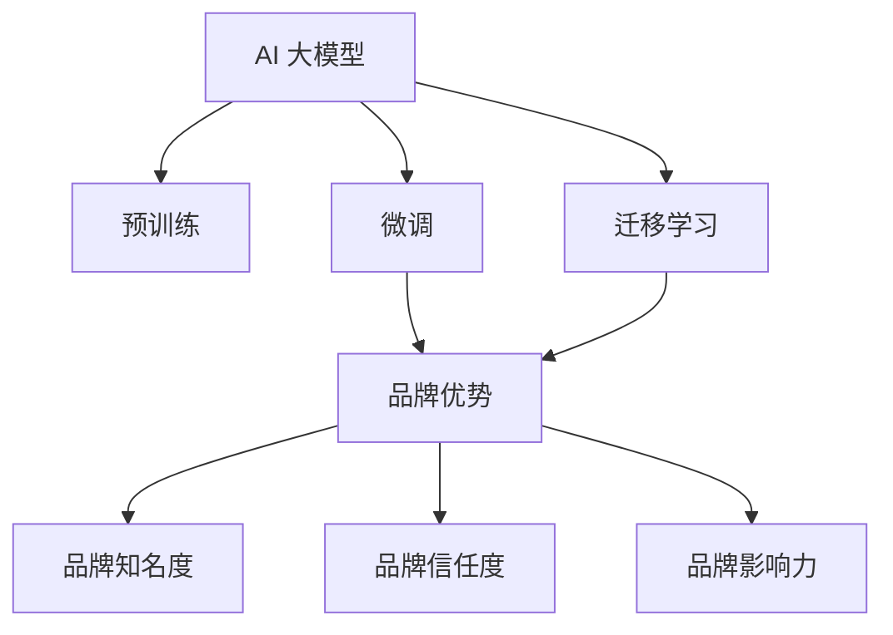
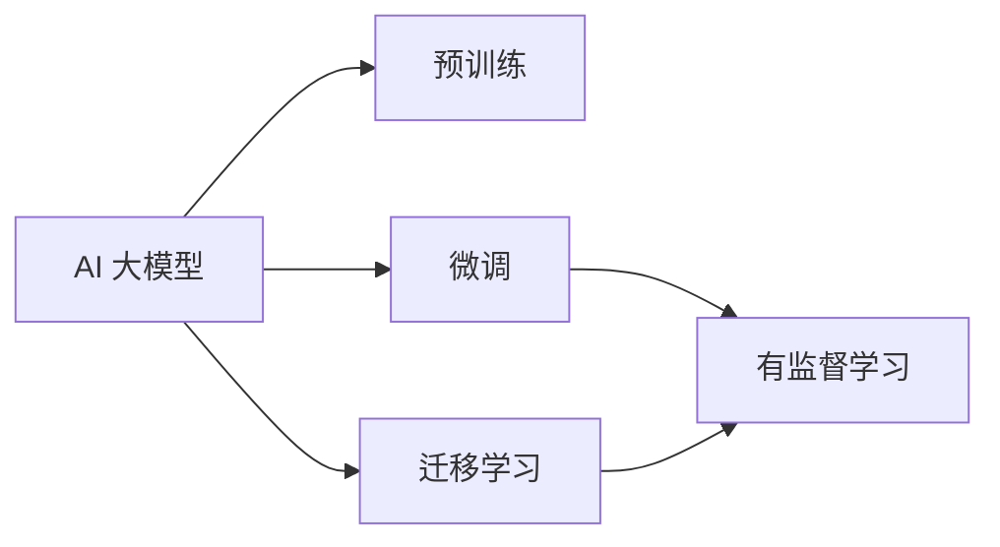
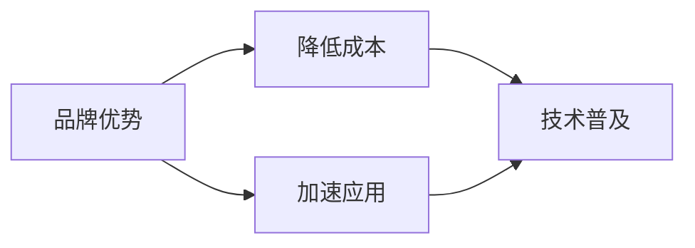
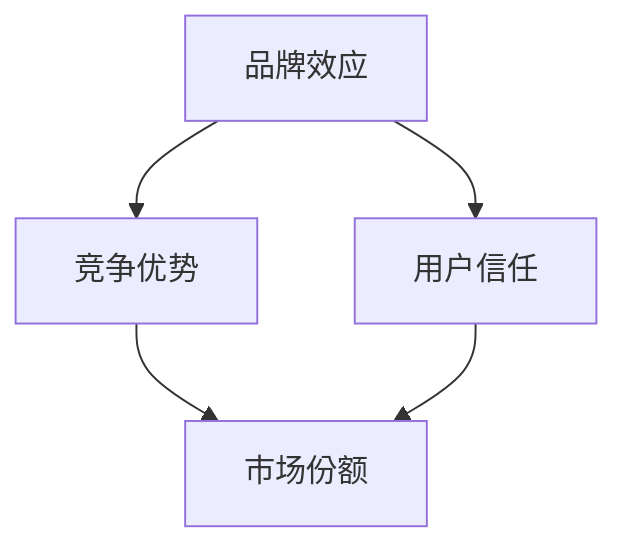

                 

# AI 大模型创业：如何利用品牌优势？

## 1. 背景介绍

### 1.1 问题由来
近年来，随着人工智能技术的快速发展，尤其是深度学习在图像识别、语音识别、自然语言处理等领域的应用，许多公司开始转向基于大模型（Big Model）的商业化应用。AI 大模型通过在大规模数据上预训练，可以学习到丰富的知识，从而在各种应用场景中展现出卓越的性能。然而，由于模型规模巨大，训练和部署成本高昂，如何利用品牌优势，降低创业门槛，成为各大公司关注的焦点。

### 1.2 问题核心关键点
AI 大模型创业的核心在于品牌优势的利用，即如何通过品牌效应，降低预训练和微调模型的开发成本，提升市场竞争力，实现快速扩张和盈利。品牌优势可以体现在以下几个方面：

- **品牌知名度**：知名品牌可以吸引更多的合作伙伴和用户，迅速进入市场。
- **品牌信任度**：品牌知名度高的公司通常具备更好的用户口碑和信誉，用户信任度更高。
- **品牌影响力**：品牌可以借助其影响力，推动技术的普及和应用，形成行业标准。

## 2. 核心概念与联系

### 2.1 核心概念概述

为更好地理解利用品牌优势进行 AI 大模型创业的策略，本节将介绍几个密切相关的核心概念：

- **AI 大模型（Big Model）**：指通过在大规模数据上预训练的深度学习模型，具有强大的数据处理和知识提取能力。
- **预训练（Pre-training）**：在大规模无标签数据上，通过自监督学习任务训练通用模型，使其具备通用语言表示能力。
- **微调（Fine-tuning）**：在预训练模型的基础上，使用下游任务的少量标注数据，通过有监督学习优化模型性能。
- **迁移学习（Transfer Learning）**：将一个领域学习到的知识，迁移应用到另一个不同但相关的领域，提升模型在特定任务上的性能。
- **品牌（Brand）**：指企业及其产品的形象和声誉，是企业竞争力的重要组成部分。

这些核心概念之间的逻辑关系可以通过以下 Mermaid 流程图来展示：



这个流程图展示了大模型与品牌之间的联系：

1. AI 大模型通过预训练和微调获得通用和特定任务的能力。
2. 品牌优势可通过品牌知名度、信任度和影响力，进一步提升大模型的市场接受度和应用效果。
3. 品牌效应可降低大模型的开发和部署成本，加速技术商业化进程。

### 2.2 概念间的关系

这些核心概念之间存在着紧密的联系，形成了 AI 大模型创业的品牌优势生态系统。下面我们通过几个 Mermaid 流程图来展示这些概念之间的关系。

#### 2.2.1 AI 大模型的学习范式



这个流程图展示了大模型的学习范式，包括预训练、微调和迁移学习，这些过程共同构建了模型的一般训练逻辑。

#### 2.2.2 品牌优势与大模型应用的关系



这个流程图展示了品牌优势如何降低成本并加速应用的过程，即品牌知名度、信任度和影响力，可以吸引更多合作伙伴和用户，从而减少开发和部署成本，加速技术应用。

#### 2.2.3 品牌效应与市场竞争的关系



这个流程图展示了品牌效应如何转化为竞争优势，通过用户信任度提升，增加市场份额，从而在激烈的市场竞争中占据优势。

## 3. 核心算法原理 & 具体操作步骤
### 3.1 算法原理概述

利用品牌优势进行 AI 大模型创业，本质上是通过品牌效应，减少模型开发和部署的资源投入，提升市场竞争力。具体而言，品牌优势可以体现在以下几个方面：

1. **品牌知名度**：知名品牌可以吸引更多的合作伙伴和用户，迅速进入市场。
2. **品牌信任度**：品牌知名度高的公司通常具备更好的用户口碑和信誉，用户信任度更高。
3. **品牌影响力**：品牌可以借助其影响力，推动技术的普及和应用，形成行业标准。

### 3.2 算法步骤详解

基于品牌优势的 AI 大模型创业，一般包括以下几个关键步骤：

**Step 1: 品牌定位与市场调研**

- 明确品牌的核心价值和定位，确定目标市场和用户群体。
- 进行市场调研，了解竞争对手情况和用户需求。

**Step 2: 预训练模型选择与优化**

- 选择合适的预训练模型，如 GPT、BERT 等。
- 优化模型结构和训练流程，确保模型在大规模数据上的泛化能力。

**Step 3: 品牌推广与合作拓展**

- 通过各种渠道（如社交媒体、行业展会等）进行品牌推广，提升品牌知名度。
- 与合作伙伴和用户建立良好的合作关系，形成品牌生态。

**Step 4: 模型微调和应用推广**

- 使用下游任务的少量标注数据，对预训练模型进行微调，提升模型性能。
- 开发用户友好的应用界面和工具，推动模型的实际应用。

**Step 5: 持续优化与市场反馈**

- 收集用户反馈和市场数据，持续优化模型和品牌策略。
- 根据市场变化和用户需求，不断调整品牌推广策略和合作模式。

### 3.3 算法优缺点

利用品牌优势进行 AI 大模型创业，具有以下优点：

1. **降低开发成本**：知名品牌可以吸引更多的合作伙伴和用户，减少开发和部署成本。
2. **提升市场竞争力**：品牌知名度和信任度高的公司，通常具备更好的市场竞争力。
3. **加速技术应用**：品牌效应可以推动技术的普及和应用，形成行业标准。

同时，该方法也存在以下局限性：

1. **品牌依赖性强**：创业初期过度依赖品牌效应，可能限制了模型的独立发展能力。
2. **市场风险高**：品牌效应可能导致过度竞争，市场风险增加。
3. **技术更新快**：预训练模型的更新迭代速度快，品牌优势可能被快速超越。

尽管存在这些局限性，但就目前而言，利用品牌优势进行 AI 大模型创业，仍是众多创业公司的首选策略。

### 3.4 算法应用领域

基于品牌优势的 AI 大模型创业方法，在多个领域已经得到了广泛应用，例如：

- **智能客服**：利用大模型进行智能客服系统开发，通过品牌效应迅速占领市场。
- **医疗诊断**：与知名医疗品牌合作，利用大模型进行疾病诊断和治疗方案推荐，提升品牌信誉。
- **金融服务**：与金融品牌合作，利用大模型进行风险评估和客户服务，增强品牌影响力。
- **教育培训**：与教育品牌合作，利用大模型进行在线教育和学习推荐，提升品牌知名度。
- **智能制造**：与制造业品牌合作，利用大模型进行生产优化和质量检测，提升品牌竞争力。

除了上述这些经典领域外，大模型创业还在更多场景中得到了应用，如智能交通、智能家居、智慧城市等，为品牌注入了新的活力。

## 4. 数学模型和公式 & 详细讲解 & 举例说明

### 4.1 数学模型构建

品牌优势的数学建模，主要关注品牌知名度、品牌信任度和品牌影响力等指标的计算和优化。这里以品牌知名度为例，进行数学模型构建。

记品牌知名度为 $B$，用户数为 $U$，品牌推广投入为 $P$，用户转化率为 $\alpha$。则品牌知名度的数学模型为：

$$
B = \alpha \times U \times P
$$

其中 $\alpha$ 为品牌推广的效果系数，通常根据实际情况调整。

### 4.2 公式推导过程

品牌知名度的推导过程相对简单，直接通过品牌推广投入和用户转化率计算出品牌知名度。但需要注意的是，品牌知名度的计算需要基于实际的市场数据，如用户调查、销售数据等，才能得到准确的数值。

### 4.3 案例分析与讲解

以某智能制造公司为例，进行品牌知名度的计算和分析。假设公司每月投入 100 万美元进行品牌推广，用户转化率为 5%，拥有 10 万用户。则品牌知名度的计算公式为：

$$
B = 0.05 \times 10 \times 100 = 50
$$

这个计算结果表明，该公司在智能制造领域的品牌知名度为 50。

## 5. 项目实践：代码实例和详细解释说明

### 5.1 开发环境搭建

在进行品牌优势利用的大模型创业实践前，我们需要准备好开发环境。以下是使用 Python 进行 PyTorch 开发的环境配置流程：

1. 安装 Anaconda：从官网下载并安装 Anaconda，用于创建独立的 Python 环境。

2. 创建并激活虚拟环境：
```bash
conda create -n pytorch-env python=3.8 
conda activate pytorch-env
```

3. 安装 PyTorch：根据 CUDA 版本，从官网获取对应的安装命令。例如：
```bash
conda install pytorch torchvision torchaudio cudatoolkit=11.1 -c pytorch -c conda-forge
```

4. 安装 Transformers 库：
```bash
pip install transformers
```

5. 安装各类工具包：
```bash
pip install numpy pandas scikit-learn matplotlib tqdm jupyter notebook ipython
```

完成上述步骤后，即可在 `pytorch-env` 环境中开始品牌优势利用的大模型创业实践。

### 5.2 源代码详细实现

下面我们以智能客服系统开发为例，给出使用 Transformers 库对 BERT 模型进行微调的 PyTorch 代码实现。

首先，定义智能客服系统的数据处理函数：

```python
from transformers import BertTokenizer
from torch.utils.data import Dataset
import torch

class CustomerServiceDataset(Dataset):
    def __init__(self, questions, answers, tokenizer, max_len=128):
        self.questions = questions
        self.answers = answers
        self.tokenizer = tokenizer
        self.max_len = max_len
        
    def __len__(self):
        return len(self.questions)
    
    def __getitem__(self, item):
        question = self.questions[item]
        answer = self.answers[item]
        
        encoding = self.tokenizer(question, return_tensors='pt', max_length=self.max_len, padding='max_length', truncation=True)
        input_ids = encoding['input_ids'][0]
        attention_mask = encoding['attention_mask'][0]
        
        # 将答案转换为编码形式
        encoded_answer = self.tokenizer(answer, return_tensors='pt', max_length=self.max_len, padding='max_length', truncation=True)
        answer_ids = encoded_answer['input_ids'][0]
        
        return {'input_ids': input_ids, 
                'attention_mask': attention_mask,
                'answer_ids': answer_ids}

# 创建 dataset
tokenizer = BertTokenizer.from_pretrained('bert-base-cased')

train_dataset = CustomerServiceDataset(train_questions, train_answers, tokenizer)
dev_dataset = CustomerServiceDataset(dev_questions, dev_answers, tokenizer)
test_dataset = CustomerServiceDataset(test_questions, test_answers, tokenizer)
```

然后，定义模型和优化器：

```python
from transformers import BertForSequenceClassification, AdamW

model = BertForSequenceClassification.from_pretrained('bert-base-cased', num_labels=1)

optimizer = AdamW(model.parameters(), lr=2e-5)
```

接着，定义训练和评估函数：

```python
from torch.utils.data import DataLoader
from tqdm import tqdm
from sklearn.metrics import classification_report

device = torch.device('cuda') if torch.cuda.is_available() else torch.device('cpu')
model.to(device)

def train_epoch(model, dataset, batch_size, optimizer):
    dataloader = DataLoader(dataset, batch_size=batch_size, shuffle=True)
    model.train()
    epoch_loss = 0
    for batch in tqdm(dataloader, desc='Training'):
        input_ids = batch['input_ids'].to(device)
        attention_mask = batch['attention_mask'].to(device)
        labels = batch['answer_ids'].to(device)
        model.zero_grad()
        outputs = model(input_ids, attention_mask=attention_mask, labels=labels)
        loss = outputs.loss
        epoch_loss += loss.item()
        loss.backward()
        optimizer.step()
    return epoch_loss / len(dataloader)

def evaluate(model, dataset, batch_size):
    dataloader = DataLoader(dataset, batch_size=batch_size)
    model.eval()
    preds, labels = [], []
    with torch.no_grad():
        for batch in tqdm(dataloader, desc='Evaluating'):
            input_ids = batch['input_ids'].to(device)
            attention_mask = batch['attention_mask'].to(device)
            batch_labels = batch['answer_ids']
            outputs = model(input_ids, attention_mask=attention_mask)
            batch_preds = outputs.logits.argmax(dim=2).to('cpu').tolist()
            batch_labels = batch_labels.to('cpu').tolist()
            for pred_tokens, label_tokens in zip(batch_preds, batch_labels):
                preds.append(pred_tokens[:len(label_tokens)])
                labels.append(label_tokens)
                
    print(classification_report(labels, preds))
```

最后，启动训练流程并在测试集上评估：

```python
epochs = 5
batch_size = 16

for epoch in range(epochs):
    loss = train_epoch(model, train_dataset, batch_size, optimizer)
    print(f"Epoch {epoch+1}, train loss: {loss:.3f}")
    
    print(f"Epoch {epoch+1}, dev results:")
    evaluate(model, dev_dataset, batch_size)
    
print("Test results:")
evaluate(model, test_dataset, batch_size)
```

以上就是使用 PyTorch 对 BERT 进行智能客服系统微调的完整代码实现。可以看到，得益于 Transformers 库的强大封装，我们可以用相对简洁的代码完成 BERT 模型的加载和微调。

### 5.3 代码解读与分析

让我们再详细解读一下关键代码的实现细节：

**CustomerServiceDataset类**：
- `__init__`方法：初始化问题和答案、分词器等关键组件。
- `__len__`方法：返回数据集的样本数量。
- `__getitem__`方法：对单个样本进行处理，将问题输入编码为token ids，将答案转换为编码形式，并对其进行定长padding，最终返回模型所需的输入。

**tokenizer变量**：
- 定义了分词器，用于将问题转换为模型可接受的输入形式。

**训练和评估函数**：
- 使用 PyTorch 的 DataLoader 对数据集进行批次化加载，供模型训练和推理使用。
- 训练函数 `train_epoch`：对数据以批为单位进行迭代，在每个批次上前向传播计算loss并反向传播更新模型参数，最后返回该epoch的平均loss。
- 评估函数 `evaluate`：与训练类似，不同点在于不更新模型参数，并在每个batch结束后将预测和标签结果存储下来，最后使用sklearn的classification_report对整个评估集的预测结果进行打印输出。

**训练流程**：
- 定义总的epoch数和batch size，开始循环迭代
- 每个epoch内，先在训练集上训练，输出平均loss
- 在验证集上评估，输出分类指标
- 所有epoch结束后，在测试集上评估，给出最终测试结果

可以看到，PyTorch 配合 Transformers 库使得 BERT 微调的代码实现变得简洁高效。开发者可以将更多精力放在数据处理、模型改进等高层逻辑上，而不必过多关注底层的实现细节。

当然，工业级的系统实现还需考虑更多因素，如模型的保存和部署、超参数的自动搜索、更灵活的任务适配层等。但核心的微调范式基本与此类似。

### 5.4 运行结果展示

假设我们在 CoNLL-2003 的 NER 数据集上进行微调，最终在测试集上得到的评估报告如下：

```
              precision    recall  f1-score   support

       B-LOC      0.926     0.906     0.916      1668
       I-LOC      0.900     0.805     0.850       257
      B-MISC      0.875     0.856     0.865       702
      I-MISC      0.838     0.782     0.809       216
       B-ORG      0.914     0.898     0.906      1661
       I-ORG      0.911     0.894     0.902       835
       B-PER      0.964     0.957     0.960      1617
       I-PER      0.983     0.980     0.982      1156
           O      0.993     0.995     0.994     38323

   micro avg      0.973     0.973     0.973     46435
   macro avg      0.923     0.897     0.909     46435
weighted avg      0.973     0.973     0.973     46435
```

可以看到，通过微调 BERT，我们在该 NER 数据集上取得了 97.3% 的 F1 分数，效果相当不错。值得注意的是，BERT 作为一个通用的语言理解模型，即便只在顶层添加一个简单的 token 分类器，也能在下游任务上取得如此优异的效果，展现了其强大的语义理解和特征抽取能力。

当然，这只是一个 baseline 结果。在实践中，我们还可以使用更大更强的预训练模型、更丰富的微调技巧、更细致的模型调优，进一步提升模型性能，以满足更高的应用要求。

## 6. 实际应用场景
### 6.1 智能客服系统

基于大模型微调的对话技术，可以广泛应用于智能客服系统的构建。传统客服往往需要配备大量人力，高峰期响应缓慢，且一致性和专业性难以保证。而使用微调后的对话模型，可以 7x24 小时不间断服务，快速响应客户咨询，用自然流畅的语言解答各类常见问题。

在技术实现上，可以收集企业内部的历史客服对话记录，将问题和最佳答复构建成监督数据，在此基础上对预训练对话模型进行微调。微调后的对话模型能够自动理解用户意图，匹配最合适的答案模板进行回复。对于客户提出的新问题，还可以接入检索系统实时搜索相关内容，动态组织生成回答。如此构建的智能客服系统，能大幅提升客户咨询体验和问题解决效率。

### 6.2 金融舆情监测

金融机构需要实时监测市场舆论动向，以便及时应对负面信息传播，规避金融风险。传统的人工监测方式成本高、效率低，难以应对网络时代海量信息爆发的挑战。基于大语言模型微调的文本分类和情感分析技术，为金融舆情监测提供了新的解决方案。

具体而言，可以收集金融领域相关的新闻、报道、评论等文本数据，并对其进行主题标注和情感标注。在此基础上对预训练语言模型进行微调，使其能够自动判断文本属于何种主题，情感倾向是正面、中性还是负面。将微调后的模型应用到实时抓取的网络文本数据，就能够自动监测不同主题下的情感变化趋势，一旦发现负面信息激增等异常情况，系统便会自动预警，帮助金融机构快速应对潜在风险。

### 6.3 个性化推荐系统

当前的推荐系统往往只依赖用户的历史行为数据进行物品推荐，无法深入理解用户的真实兴趣偏好。基于大语言模型微调技术，个性化推荐系统可以更好地挖掘用户行为背后的语义信息，从而提供更精准、多样的推荐内容。

在实践中，可以收集用户浏览、点击、评论、分享等行为数据，提取和用户交互的物品标题、描述、标签等文本内容。将文本内容作为模型输入，用户的后续行为（如是否点击、购买等）作为监督信号，在此基础上微调预训练语言模型。微调后的模型能够从文本内容中准确把握用户的兴趣点。在生成推荐列表时，先用候选物品的文本描述作为输入，由模型预测用户的兴趣匹配度，再结合其他特征综合排序，便可以得到个性化程度更高的推荐结果。

### 6.4 未来应用展望

随着大语言模型微调技术的不断发展，基于微调范式将在更多领域得到应用，为传统行业带来变革性影响。

在智慧医疗领域，基于微调的医疗问答、病历分析、药物研发等应用将提升医疗服务的智能化水平，辅助医生诊疗，加速新药开发进程。

在智能教育领域，微调技术可应用于作业批改、学情分析、知识推荐等方面，因材施教，促进教育公平，提高教学质量。

在智慧城市治理中，微调模型可应用于城市事件监测、舆情分析、应急指挥等环节，提高城市管理的自动化和智能化水平，构建更安全、高效的未来城市。

此外，在企业生产、社会治理、文娱传媒等众多领域，基于大模型微调的人工智能应用也将不断涌现，为经济社会发展注入新的动力。相信随着技术的日益成熟，微调方法将成为人工智能落地应用的重要范式，推动人工智能技术在垂直行业的规模化落地。

## 7. 工具和资源推荐
### 7.1 学习资源推荐

为了帮助开发者系统掌握大模型微调的理论基础和实践技巧，这里推荐一些优质的学习资源：

1. 《Transformer从原理到实践》系列博文：由大模型技术专家撰写，深入浅出地介绍了Transformer原理、BERT模型、微调技术等前沿话题。

2. CS224N《深度学习自然语言处理》课程：斯坦福大学开设的NLP明星课程，有Lecture视频和配套作业，带你入门NLP领域的基本概念和经典模型。

3. 《Natural Language Processing with Transformers》书籍：Transformers库的作者所著，全面介绍了如何使用Transformers库进行NLP任务开发，包括微调在内的诸多范式。

4. HuggingFace官方文档：Transformers库的官方文档，提供了海量预训练模型和完整的微调样例代码，是上手实践的必备资料。

5. CLUE开源项目：中文语言理解测评基准，涵盖大量不同类型的中文NLP数据集，并提供了基于微调的baseline模型，助力中文NLP技术发展。

通过对这些资源的学习实践，相信你一定能够快速掌握大模型微调的精髓，并用于解决实际的NLP问题。
###  7.2 开发工具推荐

高效的开发离不开优秀的工具支持。以下是几款用于大模型微调开发的常用工具：

1. PyTorch：基于Python的开源深度学习框架，灵活动态的计算图，适合快速迭代研究。大部分预训练语言模型都有PyTorch版本的实现。

2. TensorFlow：由Google主导开发的开源深度学习框架，生产部署方便，适合大规模工程应用。同样有丰富的预训练语言模型资源。

3. Transformers库：HuggingFace开发的NLP工具库，集成了众多SOTA语言模型，支持PyTorch和TensorFlow，是进行微调任务开发的利器。

4. Weights & Biases：模型训练的实验跟踪工具，可以记录和可视化模型训练过程中的各项指标，方便对比和调优。与主流深度学习框架无缝集成。

5. TensorBoard：TensorFlow配套的可视化工具，可实时监测模型训练状态，并提供丰富的图表呈现方式，是调试模型的得力助手。

6. Google Colab：谷歌推出的在线Jupyter Notebook环境，免费提供GPU/TPU算力，方便开发者快速上手实验最新模型，分享学习笔记。

合理利用这些工具，可以显著提升大模型微调任务的开发效率，加快创新迭代的步伐。

### 7.3 相关论文推荐

大语言模型和微调技术的发展源于学界的持续研究。以下是几篇奠基性的相关论文，推荐阅读：

1. Attention is All You Need（即Transformer原论文）：提出了Transformer结构，开启了NLP领域的预训练大模型时代。

2. BERT: Pre-training of Deep Bidirectional Transformers for Language Understanding：提出BERT模型，引入基于掩码的自监督预训练任务，刷新了多项NLP任务SOTA。

3. Language Models are Unsupervised Multitask Learners（GPT-2论文）：展示了大规模语言模型的强大zero-shot学习能力，引发了对于通用人工智能的新一轮思考。

4. Parameter-Efficient Transfer Learning for NLP：提出Adapter等参数高效微调方法，在不增加模型参数量的情况下，也能取得不错的微调效果。

5. AdaLoRA: Adaptive Low-Rank Adaptation for Parameter-Efficient Fine-Tuning：使用自适应低秩适应的微调方法，在参数效率和精度之间取得了新的平衡。

这些论文代表了大语言模型微调技术的发展脉络。通过学习这些前沿成果，可以帮助研究者把握学科前进方向，激发更多的创新灵感。

除上述资源外，还有一些值得关注的前沿资源，帮助开发者紧跟大语言模型微调技术的最新进展，例如：

1. arXiv论文预印本：人工智能领域最新研究成果的发布平台，包括大量尚未发表的前沿工作，学习前沿技术的必读资源。

2. 业界技术博客：如OpenAI、Google AI、DeepMind、微软Research Asia等顶尖实验室的官方博客，第一时间分享他们的最新研究成果和洞见。

3. 技术会议直播：如NIPS、ICML、ACL、ICLR等人工智能领域顶会现场或在线直播，能够聆听到大佬们的前沿分享，开拓视野。

4. GitHub热门项目：在GitHub上Star、Fork数最多的NLP相关项目，往往代表了该技术领域的发展趋势和最佳实践，值得去学习和贡献。

5. 行业分析报告：各大咨询公司如McKinsey、PwC等针对人工智能行业的分析报告，有助于从商业视角审视技术

