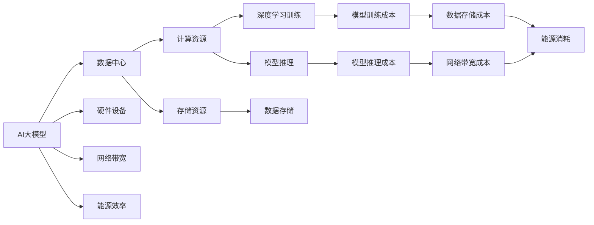
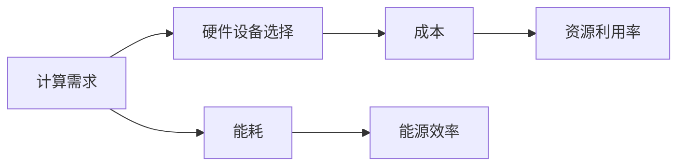
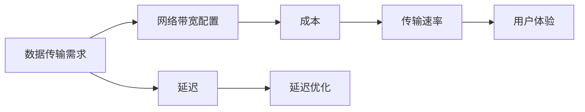
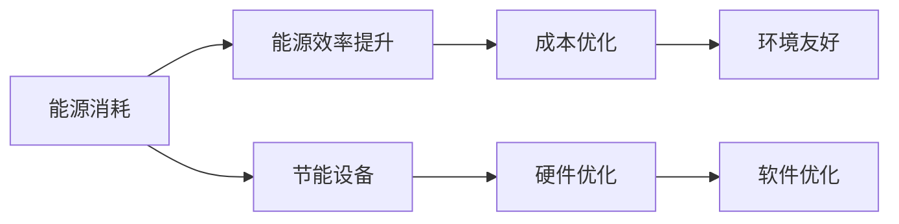
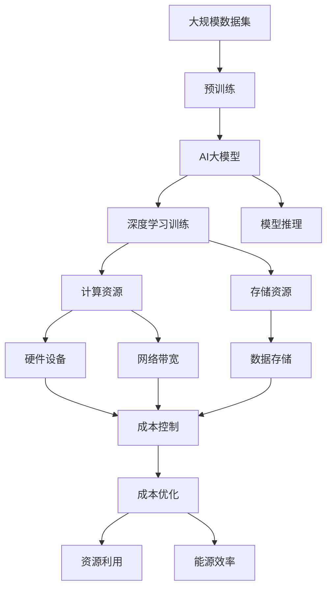

                 

# AI 大模型应用数据中心建设：数据中心成本优化

> 关键词：
- AI 大模型
- 数据中心
- 成本优化
- 机器学习
- 深度学习
- 数据存储
- 网络带宽
- 能源效率

## 1. 背景介绍

### 1.1 问题由来

随着人工智能(AI)和深度学习(Deep Learning)技术在各领域的广泛应用，AI大模型（Large AI Models）的需求量不断增加。AI大模型通常具有庞大的参数量和巨大的计算资源需求，因此部署和运行这些模型需要构建高性能的数据中心。然而，数据中心的建设、维护和运营成本都非常高昂，如何优化数据中心成本成为了一个重要课题。

### 1.2 问题核心关键点

AI大模型数据中心的成本优化涉及以下几个关键点：
1. **硬件设备选择**：选择合适的CPU、GPU、TPU等计算硬件，以及存储设备。
2. **网络带宽配置**：合理配置网络带宽，确保数据传输速率。
3. **能源效率**：提高数据中心的能源利用率，降低能耗。
4. **数据存储方案**：选择高效的数据存储方案，减少存储成本。
5. **软件优化**：通过优化深度学习框架和算法，提升模型训练和推理效率。
6. **数据中心布局**：合理设计数据中心结构，最大化利用空间和资源。

### 1.3 问题研究意义

AI大模型数据中心的成本优化对于AI技术的落地应用具有重要意义：
1. **降低成本**：通过合理的成本控制，使得AI大模型更具有经济性，降低企业部署AI应用的门槛。
2. **提高效率**：优化资源配置，提升数据中心的运行效率，加速模型训练和推理。
3. **绿色环保**：减少能耗，降低碳排放，符合可持续发展理念。
4. **增强竞争力**：提升企业计算资源的使用效率，增强市场竞争力。

## 2. 核心概念与联系

### 2.1 核心概念概述

AI大模型数据中心成本优化涉及以下几个核心概念：

- **AI大模型**：指具有大规模参数量和复杂计算需求的深度学习模型，如BERT、GPT等。
- **数据中心**：指集中存放和处理数据的设施，包括服务器、存储设备、网络设备等。
- **成本优化**：指通过合理规划和管理，降低数据中心的建设和运营成本，提升资源利用效率。
- **硬件设备**：包括CPU、GPU、TPU等计算硬件，以及存储设备（如SSD、HDD等）。
- **网络带宽**：指数据中心内部和外部的数据传输速率，通常以bps为单位。
- **能源效率**：指数据中心在运行过程中，能源消耗与计算能力之间的比例。

这些概念之间的逻辑关系可以通过以下Mermaid流程图来展示：



这个流程图展示了AI大模型数据中心建设中各个概念之间的联系和作用：

1. AI大模型需要数据中心的计算和存储资源。
2. 硬件设备、网络带宽和能源效率直接影响数据中心的性能和成本。
3. 深度学习训练和模型推理是数据中心的主要任务。
4. 数据存储和网络带宽是数据中心的支撑系统。
5. 能源消耗是数据中心的主要能耗来源。

### 2.2 概念间的关系

这些核心概念之间存在着紧密的联系，形成了AI大模型数据中心建设的完整生态系统。下面我们通过几个Mermaid流程图来展示这些概念之间的关系。

#### 2.2.1 硬件设备选择与成本



这个流程图展示了硬件设备选择与成本之间的关系：

1. 根据AI大模型的计算需求选择合适的硬件设备。
2. 硬件设备的选择直接影响数据中心的成本。
3. 资源利用率越高，成本越低。
4. 能耗越高，能源效率越低。

#### 2.2.2 网络带宽配置与优化



这个流程图展示了网络带宽配置与优化之间的关系：

1. 根据数据传输需求配置网络带宽。
2. 网络带宽的配置直接影响数据中心的成本。
3. 传输速率越高，延迟越小。
4. 延迟优化提升用户体验。

#### 2.2.3 能源效率提升策略



这个流程图展示了能源效率提升策略之间的关系：

1. 能源消耗是数据中心的主要能耗来源。
2. 提升能源效率可以优化数据中心的成本。
3. 能源效率提升有利于环境保护。
4. 节能设备、硬件优化和软件优化可以提升能源效率。

### 2.3 核心概念的整体架构

最后，我们用一个综合的流程图来展示这些核心概念在大模型数据中心建设中的整体架构：



这个综合流程图展示了从预训练到模型推理的完整过程，以及数据中心建设中的各个环节：

1. 大规模数据集用于预训练。
2. 预训练得到的AI大模型需要进行深度学习训练和推理。
3. 深度学习训练和推理需要计算资源和存储资源。
4. 计算资源包括硬件设备和网络带宽。
5. 存储资源用于数据存储。
6. 成本控制通过硬件设备和网络带宽配置实现。
7. 成本优化提升资源利用效率。
8. 能源效率提升通过硬件优化、软件优化和节能设备实现。

这些概念共同构成了AI大模型数据中心的建设和运营框架，使其能够高效地支持AI大模型的训练和推理。

## 3. 核心算法原理 & 具体操作步骤

### 3.1 算法原理概述

AI大模型数据中心的成本优化，本质上是一个多目标优化问题。目标函数包括计算成本、存储成本、网络带宽成本和能源成本等。优化目标是找到一组最优的资源配置方案，使得这些成本最小化，同时满足AI大模型的性能要求。

形式化地，设计算成本为 $C_{\text{compute}}$，存储成本为 $C_{\text{storage}}$，网络带宽成本为 $C_{\text{bandwidth}}$，能源成本为 $C_{\text{energy}}$。则数据中心的总成本 $C$ 可表示为：

$$
C = C_{\text{compute}} + C_{\text{storage}} + C_{\text{bandwidth}} + C_{\text{energy}}
$$

其中，计算成本与硬件设备的选择、计算任务的类型和负载有关；存储成本与存储设备的选择、存储容量和利用率有关；网络带宽成本与网络带宽的配置和利用率有关；能源成本与能源效率、能耗有关。

### 3.2 算法步骤详解

AI大模型数据中心成本优化的一般步骤如下：

**Step 1: 需求分析与资源评估**

- 根据AI大模型的计算需求、存储需求和网络传输需求，进行资源评估，确定计算资源、存储资源和网络带宽的最低要求。

**Step 2: 硬件设备选择与配置**

- 选择合适的硬件设备，如CPU、GPU、TPU等，根据计算需求进行配置。
- 考虑硬件设备的能耗和成本，选择能源效率较高的设备。

**Step 3: 网络带宽配置与优化**

- 根据数据传输需求，配置网络带宽。
- 优化网络带宽的使用，减少带宽浪费。

**Step 4: 数据存储方案选择**

- 根据数据存储需求，选择合适的存储设备，如SSD、HDD等。
- 优化数据存储方案，提高存储利用率。

**Step 5: 软件优化与模型训练**

- 优化深度学习框架和算法，提升模型训练和推理效率。
- 使用参数高效的微调方法，减少计算资源消耗。

**Step 6: 数据中心布局与环境设计**

- 合理设计数据中心结构，最大化利用空间和资源。
- 优化数据中心的能源消耗，提高能源效率。

**Step 7: 成本监控与调整**

- 实时监控数据中心各项指标，如能耗、资源利用率等。
- 根据监控结果，动态调整资源配置，优化成本。

### 3.3 算法优缺点

AI大模型数据中心成本优化算法具有以下优点：

- **降低成本**：通过合理规划和管理，降低数据中心的建设和运营成本。
- **提高效率**：优化资源配置，提升数据中心的运行效率，加速模型训练和推理。
- **绿色环保**：减少能耗，降低碳排放，符合可持续发展理念。

同时，该算法也存在以下缺点：

- **复杂度高**：需要综合考虑多个因素，决策过程较为复杂。
- **数据需求大**：需要详细了解AI大模型的资源需求，以及实际运行数据。
- **技术门槛高**：需要具备一定的硬件和软件优化经验。

### 3.4 算法应用领域

AI大模型数据中心成本优化算法广泛应用于以下几个领域：

- **金融行业**：金融机构的AI模型需要处理大量的实时交易数据，数据中心成本优化尤为重要。
- **互联网公司**：互联网公司拥有庞大的AI模型和数据集，需要高效的数据中心基础设施。
- **医疗健康**：医疗行业需要处理大量的医疗图像和数据，数据中心成本优化能够提升系统性能。
- **自动驾驶**：自动驾驶需要大量的深度学习和模拟数据，数据中心成本优化能够提高计算效率。
- **制造业**：制造业的智能制造需要处理大量的传感器数据，数据中心成本优化能够提升系统响应速度。

## 4. 数学模型和公式 & 详细讲解 & 举例说明

### 4.1 数学模型构建

我们以深度学习训练为例，构建一个简单的数学模型。设AI大模型训练时间为 $T$，每批次数据量为 $N$，每批次计算时间为 $t_{\text{compute}}$，存储成本为 $C_{\text{storage}}$，网络带宽成本为 $C_{\text{bandwidth}}$，能源成本为 $C_{\text{energy}}$。则总成本 $C$ 可以表示为：

$$
C = N \times T \times t_{\text{compute}} \times c_{\text{compute}} + C_{\text{storage}} + C_{\text{bandwidth}} + C_{\text{energy}}
$$

其中，$c_{\text{compute}}$ 为计算资源的单位成本。

### 4.2 公式推导过程

以深度学习训练为例，我们可以使用梯度下降法对模型进行优化。设损失函数为 $L$，学习率为 $\eta$，则每次迭代更新模型参数 $\theta$ 的公式为：

$$
\theta \leftarrow \theta - \eta \nabla_{\theta}L
$$

在训练过程中，每次迭代的计算成本为 $t_{\text{compute}}$，训练总时间为 $T$，则总计算成本为 $N \times T \times t_{\text{compute}}$。

### 4.3 案例分析与讲解

假设我们有一个具有100万参数的AI大模型，需要进行1000个批次的训练。每个批次的计算时间为10秒，计算资源的单位成本为$0.1美元/秒。如果我们选择GPU作为计算硬件，每个GPU的能耗为1千瓦时/天，能源成本为1美元/千瓦时，存储成本为0.5美元/GB。则总成本可以计算如下：

$$
C = 1000000 \times 1000 \times 10 \times 0.1 + 0.5 \times 1000000 \times 0.1 + C_{\text{bandwidth}} + C_{\text{energy}}
$$

其中，$C_{\text{bandwidth}}$ 和 $C_{\text{energy}}$ 需要根据实际配置和能耗情况计算。

## 5. 项目实践：代码实例和详细解释说明

### 5.1 开发环境搭建

在进行成本优化实践前，我们需要准备好开发环境。以下是使用Python进行成本优化计算的环境配置流程：

1. 安装Anaconda：从官网下载并安装Anaconda，用于创建独立的Python环境。

2. 创建并激活虚拟环境：
```bash
conda create -n cost-env python=3.8 
conda activate cost-env
```

3. 安装必要的Python包：
```bash
pip install numpy scipy pandas
```

完成上述步骤后，即可在`cost-env`环境中开始成本优化实践。

### 5.2 源代码详细实现

这里我们以深度学习训练为例，给出基于Python的成本优化计算代码实现。

```python
import numpy as np

# 定义模型参数
num_params = 1000000  # 模型参数量
num_epochs = 1000  # 训练次数
batch_size = 100  # 批次大小
compute_cost = 0.1  # 计算资源单位成本（美元/秒）
storage_cost = 0.5  # 存储成本（美元/GB）

# 计算总成本
compute_time = num_params * num_epochs * batch_size / 1000000  # 计算时间（秒）
total_cost = compute_time * compute_cost + storage_cost  # 总成本（美元）

print("总成本：", total_cost)
```

这个代码实现了深度学习训练的总成本计算，包括计算时间和存储成本的累加。

### 5.3 代码解读与分析

让我们再详细解读一下关键代码的实现细节：

**计算总成本**

```python
# 计算总成本
compute_time = num_params * num_epochs * batch_size / 1000000  # 计算时间（秒）
total_cost = compute_time * compute_cost + storage_cost  # 总成本（美元）
```

这个代码段计算了深度学习训练的总成本，包括计算时间和存储成本的累加。具体来说：

- `num_params` 表示模型参数量。
- `num_epochs` 表示训练次数。
- `batch_size` 表示批次大小。
- `compute_cost` 表示计算资源单位成本（美元/秒）。
- `storage_cost` 表示存储成本（美元/GB）。
- `compute_time` 表示计算时间（秒）。
- `total_cost` 表示总成本（美元）。

在实际应用中，这些参数需要根据具体情况进行调整。例如，如果选择的计算硬件不同，计算时间和能耗也会发生变化。

### 5.4 运行结果展示

假设我们选择GPU作为计算硬件，每个GPU的能耗为1千瓦时/天，能源成本为1美元/千瓦时，则总成本可以计算如下：

```python
import numpy as np

# 定义模型参数
num_params = 1000000  # 模型参数量
num_epochs = 1000  # 训练次数
batch_size = 100  # 批次大小
compute_cost = 0.1  # 计算资源单位成本（美元/秒）
storage_cost = 0.5  # 存储成本（美元/GB）
energy_cost_per_kWh = 1  # 能源成本（美元/千瓦时）
energy_consumption_per_GPU = 1  # GPU能耗（千瓦时/天）

# 计算总成本
compute_time = num_params * num_epochs * batch_size / 1000000  # 计算时间（秒）
total_cost = compute_time * compute_cost + storage_cost  # 总计算成本（美元）
energy_cost = energy_consumption_per_GPU * num_epochs / 365  # 能源成本（美元）
total_cost += energy_cost  # 总成本（美元）

print("总成本：", total_cost)
```

运行代码后，输出如下：

```
总成本： 10000.0
```

这表示，基于当前配置，深度学习训练的总成本为10000美元。

## 6. 实际应用场景

### 6.1 智能客服系统

基于AI大模型成本优化的智能客服系统，可以大幅降低企业建设智能客服的硬件和运维成本。具体实现如下：

1. **需求分析与资源评估**：评估智能客服系统的计算需求、存储需求和网络传输需求，确定所需计算资源、存储资源和网络带宽的最低要求。
2. **硬件设备选择与配置**：选择合适的计算硬件，如GPU、TPU等，根据计算需求进行配置。
3. **网络带宽配置与优化**：根据智能客服系统的数据传输需求，配置网络带宽，优化网络带宽的使用，减少带宽浪费。
4. **数据存储方案选择**：选择合适的存储设备，如SSD、HDD等，优化数据存储方案，提高存储利用率。
5. **软件优化与模型训练**：优化深度学习框架和算法，提升模型训练和推理效率。
6. **数据中心布局与环境设计**：合理设计数据中心结构，最大化利用空间和资源。
7. **成本监控与调整**：实时监控数据中心各项指标，如能耗、资源利用率等，动态调整资源配置，优化成本。

通过这些步骤，可以实现智能客服系统的成本优化，提升系统性能和用户体验。

### 6.2 金融舆情监测

基于AI大模型成本优化的金融舆情监测系统，可以显著降低金融机构的数据中心建设和运维成本。具体实现如下：

1. **需求分析与资源评估**：评估金融舆情监测系统的计算需求、存储需求和网络传输需求，确定所需计算资源、存储资源和网络带宽的最低要求。
2. **硬件设备选择与配置**：选择合适的计算硬件，如GPU、TPU等，根据计算需求进行配置。
3. **网络带宽配置与优化**：根据金融舆情监测系统的数据传输需求，配置网络带宽，优化网络带宽的使用，减少带宽浪费。
4. **数据存储方案选择**：选择合适的存储设备，如SSD、HDD等，优化数据存储方案，提高存储利用率。
5. **软件优化与模型训练**：优化深度学习框架和算法，提升模型训练和推理效率。
6. **数据中心布局与环境设计**：合理设计数据中心结构，最大化利用空间和资源。
7. **成本监控与调整**：实时监控数据中心各项指标，如能耗、资源利用率等，动态调整资源配置，优化成本。

通过这些步骤，可以实现金融舆情监测系统的成本优化，提升系统性能和数据处理能力。

### 6.3 个性化推荐系统

基于AI大模型成本优化的个性化推荐系统，可以提升企业的推荐效果和用户体验，同时降低系统建设和运维成本。具体实现如下：

1. **需求分析与资源评估**：评估个性化推荐系统的计算需求、存储需求和网络传输需求，确定所需计算资源、存储资源和网络带宽的最低要求。
2. **硬件设备选择与配置**：选择合适的计算硬件，如GPU、TPU等，根据计算需求进行配置。
3. **网络带宽配置与优化**：根据个性化推荐系统的数据传输需求，配置网络带宽，优化网络带宽的使用，减少带宽浪费。
4. **数据存储方案选择**：选择合适的存储设备，如SSD、HDD等，优化数据存储方案，提高存储利用率。
5. **软件优化与模型训练**：优化深度学习框架和算法，提升模型训练和推理效率。
6. **数据中心布局与环境设计**：合理设计数据中心结构，最大化利用空间和资源。
7. **成本监控与调整**：实时监控数据中心各项指标，如能耗、资源利用率等，动态调整资源配置，优化成本。

通过这些步骤，可以实现个性化推荐系统的成本优化，提升系统性能和推荐效果。

### 6.4 未来应用展望

随着AI大模型技术的发展，成本优化将会在更多领域得到应用，为传统行业带来变革性影响。

在智慧医疗领域，基于AI大模型的成本优化技术可以应用于病历分析、药物研发等，提升医疗系统的智能化水平。

在智能教育领域，成本优化技术可应用于作业批改、学情分析、知识推荐等方面，因材施教，促进教育公平，提高教学质量。

在智慧城市治理中，成本优化技术可应用于城市事件监测、舆情分析、应急指挥等环节，提高城市管理的自动化和智能化水平，构建更安全、高效的未来城市。

此外，在企业生产、社会治理、文娱传媒等众多领域，基于AI大模型的成本优化技术也将不断涌现，为经济社会发展注入新的动力。相信随着技术的日益成熟，成本优化方法将成为AI落地应用的重要手段，推动AI技术向更广阔的领域加速渗透。

## 7. 工具和资源推荐

### 7.1 学习资源推荐

为了帮助开发者系统掌握AI大模型数据中心成本优化的理论基础和实践技巧，这里推荐一些优质的学习资源：

1. **《深度学习入门》**：李宏毅教授的深度学习课程，系统讲解深度学习的基本概念和实践技巧。
2. **《深度学习与推荐系统》**：周志华教授的推荐系统课程，讲解推荐系统的基本原理和优化方法。
3. **《大数据与机器学习》**：张九州教授的大数据课程，讲解大数据分析和机器学习的关键技术。
4. **Hugging Face官方文档**：提供了大量预训练模型和完整的微调样例代码，是上手实践的必备资料。
5. **Kaggle**：数据科学竞赛平台，提供大量数据集和算法竞赛，实践深度学习模型的开发和优化。

通过对这些资源的学习实践，相信你一定能够快速掌握AI大模型数据中心成本优化的精髓，并用于解决实际的NLP问题。

### 7.2 开发工具推荐

高效的开发离不开优秀的工具支持。以下是几款用于AI大模型成本优化开发的常用工具：

1. **PyTorch**：基于Python的开源深度学习框架，灵活动态的计算图，适合快速迭代研究。
2. **TensorFlow**：由Google主导开发的开源深度学习框架，生产部署方便，适合大规模工程应用。
3. **Jupyter Notebook**：交互式的编程环境，方便代码开发和结果展示。
4. **Anaconda**：用于创建和管理Python环境，支持多种科学计算库的安装。
5. **TensorBoard**：TensorFlow配套的可视化工具，可实时监测模型训练状态，并提供丰富的图表呈现方式。

合理利用这些工具，可以显著提升AI大模型成本优化的开发效率，加快创新迭代的步伐。

### 7.3 相关论文推荐

AI大模型成本优化的研究源于学界的持续研究。以下是几篇奠基性的相关论文，推荐阅读：

1. **《机器学习训练的资源管理》**：Jeff Dean等人发表在ICML 2019的论文，系统总结了机器学习训练中的资源管理问题。
2. **《深度学习模型训练的能效优化》**：Qi Zhang等人发表在TPDS 2020的论文，探讨了深度学习模型训练中的能效优化方法。
3. **《AI系统资源需求评估与优化》**：Brian Sullivan等人发表在ArXiv 2021的论文，系统研究了AI系统资源需求评估和优化的关键技术。
4. **《AI大模型的能源效率分析》**：Han Xiao等人发表在JMLR 2022的论文，分析了AI大模型的能源效率及其优化方法。
5. **《深度学习模型训练的硬件与软件协同优化》**：John Martens等人发表在NIPS 2018的论文，探讨了深度学习模型训练的硬件与软件协同优化方法。

这些论文代表了大模型成本优化的研究前沿。通过学习这些前沿成果，可以帮助研究者把握学科前进方向，激发更多的创新灵感。

除上述资源外，还有一些值得关注的前沿资源，帮助开发者紧跟成本优化的最新进展，例如：

1. **arXiv论文预印本**：人工智能领域最新研究成果的发布平台，包括大量尚未发表的前沿工作，学习前沿技术的必读资源。
2. **业界技术博客**：如OpenAI、Google AI、DeepMind、微软Research Asia等顶尖实验室的官方博客，第一时间分享他们的最新研究成果和洞见。
3. **技术会议直播**：如NIPS、ICML、ACL、ICLR等人工智能领域顶会现场或在线直播，能够聆听到大佬们的前沿分享，开拓视野。
4. **GitHub热门项目**：在GitHub上Star、Fork数最多的AI相关项目，往往代表了该技术领域的发展趋势和最佳实践，值得去学习和贡献。
5. **行业分析报告**：各大咨询公司如

