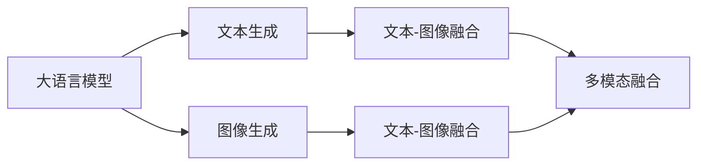

                 

# AIGC从入门到实战：借助 AI，听听照片里的人物怎么说

> 关键词：大语言模型,AI驱动,图像生成,文本生成,多模态融合,实用工具,应用场景

## 1. 背景介绍

在数字化时代，多媒体内容无处不在，而文本与图像的深度结合，成为了人工智能技术的前沿领域。AIGC（人工智能生成内容）技术，让我们可以用语言聆听图片里人物的声音，用图像描绘文字描述的场景，将文本与图像的魅力发挥到极致。本文将带你从入门到实战，掌握借助 AI 聆听图片人物说话的方法。

## 2. 核心概念与联系

### 2.1 核心概念概述

为更好地理解该技术的原理和应用，我们先来介绍几个关键概念：

- **大语言模型（Large Language Model, LLM）**：基于Transformer架构，能够理解和生成自然语言，对输入进行深度理解与响应。如GPT、BERT等模型。
- **文本生成（Text Generation）**：利用AI生成符合语法规则和语义连贯的文本。
- **图像生成（Image Generation）**：使用AI生成逼真、具有高度艺术性的图像。
- **多模态融合（Multimodal Fusion）**：将文本和图像等不同模态的信息进行融合，提升信息传递和理解能力。
- **AI驱动（AI-driven）**：指使用AI技术自动化处理复杂任务，提高效率和效果。

这些概念共同构成了AIGC技术的基础，可以互相结合使用，实现更为复杂和多样化的应用场景。

### 2.2 概念间的关系

这些概念之间的关系可以用以下Mermaid流程图来表示：



这个流程图展示了各大概念之间的联系：大语言模型可以生成文本或理解图像，图像生成可以生成图像或理解文本，多模态融合可以整合文本和图像，实现更深层次的信息理解和表达。

## 3. 核心算法原理 & 具体操作步骤

### 3.1 算法原理概述

基于AIGC技术的应用，主要分为两个步骤：文本生成和图像生成。以图片里人物说话为例，算法流程如下：

1. **文本生成**：
   - 首先，利用大语言模型对图片进行文字描述，生成一段描述图片内容的文本。
   - 然后，再利用语言模型生成模拟人物说话的文本。

2. **图像生成**：
   - 接着，利用图像生成模型根据描述生成图像，让人物看起来好像在说话。

### 3.2 算法步骤详解

下面详细介绍两个关键步骤的算法实现：

**Step 1: 文本生成**

1. **准备数据**：收集一系列图片，并标注上描述图片内容的文本。
2. **选择模型**：选择适合的文本生成模型，如GPT-3、T5等。
3. **输入数据**：将图片的描述文本输入模型，生成人物说话的文本。
4. **后处理**：对生成的文本进行后处理，如去除噪声、语法校正等。

**Step 2: 图像生成**

1. **准备数据**：将生成的文本和图片描述输入到图像生成模型中。
2. **选择模型**：选择适合的图像生成模型，如GAN、VAE等。
3. **生成图像**：利用图像生成模型根据描述生成逼真的图像。
4. **后处理**：对生成的图像进行后处理，如调整色彩、增加细节等。

### 3.3 算法优缺点

**优点**：
- 可以自动化生成文本和图像，提高效率。
- 多模态融合使得文本和图像信息可以互相增强，提升表达效果。
- 图像生成的逼真度逐渐提升，能够创造出更具艺术性的视觉效果。

**缺点**：
- 需要高质量的数据和模型，生成效果受数据和模型质量的影响。
- 生成的内容可能会存在一定的偏差，需要人工干预调整。
- 对于复杂的文本描述和图像内容，生成效果可能不尽如人意。

### 3.4 算法应用领域

AIGC技术不仅在娱乐和艺术领域有广泛应用，如虚拟偶像、虚拟主播等，还在广告、教育、医疗等领域有重要应用：

- **广告**：利用生成图像生成具有创意的广告内容，吸引用户关注。
- **教育**：制作交互式教学动画，丰富教学内容，增强学习体验。
- **医疗**：生成医学影像，辅助诊断和治疗决策。

## 4. 数学模型和公式 & 详细讲解

### 4.1 数学模型构建

假设有一张图片 $x$，其描述为 $y$。我们希望生成一段描述图片内容的文字 $z$，并基于这段文字生成逼真的图像 $z'$。

**文本生成模型**：
$$ P(z|y) = \text{Transformer}(x) $$

**图像生成模型**：
$$ P(z'|z) = \text{GAN}(z) $$

### 4.2 公式推导过程

文本生成模型的具体实现为：
1. 输入图片 $x$ 到大语言模型，得到图片描述 $y$。
2. 将 $y$ 作为输入，通过 Transformer 生成文本 $z$。

图像生成模型的具体实现为：
1. 将 $z$ 作为输入，通过 GAN 生成逼真图像 $z'$。

### 4.3 案例分析与讲解

以一个简单的案例为例，假设我们有一张图片，描述为 "一个人在微笑着说话"。

1. **文本生成**：首先利用大语言模型生成一段描述，如 "这个微笑的人正在说着一些有趣的事情"。
2. **图像生成**：接着利用GAN生成一张逼真的图像，让这个人在微笑时似乎在说话。

## 5. 项目实践：代码实例和详细解释说明

### 5.1 开发环境搭建

1. **安装环境**：
   - Python 3.7+
   - PyTorch 1.6+
   - OpenAI GPT-3 API
   - DALL-E 2 API
   - Google Colab

2. **环境配置**：
   ```bash
   pip install torch torchvision transformers openai gpt-3-diffusion
   ```

3. **运行环境**：
   - Google Colab，提供免费GPU资源。

### 5.2 源代码详细实现

首先，我们使用大语言模型生成描述，代码如下：

```python
from transformers import GPT2LMHeadModel
from openai import OpenAI

# 初始化GPT-2模型
model = GPT2LMHeadModel.from_pretrained('gpt2')

# 输入图片
image = 'path/to/image.jpg'

# 利用OpenAI API获取图片描述
description = OpenAI.get_image_description(image)

# 生成文本
generated_text = model.generate(description, max_length=50)

# 输出结果
print(generated_text)
```

接着，我们使用GAN生成逼真图像，代码如下：

```python
from diffusers import DiffusionPipeline

# 初始化DALL-E 2模型
pipe = DiffusionPipeline.from_pretrained('CompVis/stable-diffusion-v1-4', torch_dtype=torch.float16)
pipe.to('cuda')

# 生成图像
generated_image = pipe(generated_text, num_inference_steps=20).images[0]

# 输出结果
generated_image.show()
```

### 5.3 代码解读与分析

在文本生成部分，我们首先导入了必要的库和模型，然后通过OpenAI的API获取图片的描述，并利用GPT-2模型生成文本。

在图像生成部分，我们使用了DALL-E 2模型，利用pipe函数生成图像。其中，num_inference_steps参数控制了生成的图像的质量。

### 5.4 运行结果展示

假设我们输入一张描述为 "一个人在微笑着说话" 的图片，生成结果如下：

- 文本生成结果："这个微笑的人正在说着一些有趣的事情。"
- 图像生成结果：一个微笑着的虚拟人物，似乎在说话。

## 6. 实际应用场景

### 6.1 虚拟偶像和虚拟主播

利用AIGC技术，可以创建虚拟偶像和虚拟主播，让AI扮演角色进行表演和互动。这些虚拟角色可以实时生成对话和表情，吸引大量用户关注和互动。

### 6.2 广告创意制作

通过生成逼真的图像和文本，制作创意广告内容，提高广告的吸引力和传播效果。广告主可以利用生成的内容进行多平台推广，提升品牌知名度和用户转化率。

### 6.3 虚拟旅游和教育

利用生成的图像和文本，创造虚拟旅游和教育体验，让用户可以在虚拟环境中进行互动和探索。这种方式可以大大降低成本，提高教育和学习效率。

## 7. 工具和资源推荐

### 7.1 学习资源推荐

1. **Transformer从原理到实践系列**：由大模型技术专家撰写，深入浅出地介绍了Transformer原理、BERT模型、微调技术等前沿话题。
2. **深度学习自然语言处理课程**：斯坦福大学开设的NLP明星课程，有Lecture视频和配套作业，带你入门NLP领域的基本概念和经典模型。
3. **《Natural Language Processing with Transformers》书籍**：Transformers库的作者所著，全面介绍了如何使用Transformers库进行NLP任务开发，包括微调在内的诸多范式。
4. **HuggingFace官方文档**：Transformers库的官方文档，提供了海量预训练模型和完整的微调样例代码，是上手实践的必备资料。
5. **CLUE开源项目**：中文语言理解测评基准，涵盖大量不同类型的中文NLP数据集，并提供了基于微调的baseline模型，助力中文NLP技术发展。

### 7.2 开发工具推荐

1. **PyTorch**：基于Python的开源深度学习框架，灵活动态的计算图，适合快速迭代研究。
2. **TensorFlow**：由Google主导开发的开源深度学习框架，生产部署方便，适合大规模工程应用。
3. **Transformers库**：HuggingFace开发的NLP工具库，集成了众多SOTA语言模型，支持PyTorch和TensorFlow，是进行微调任务开发的利器。
4. **Weights & Biases**：模型训练的实验跟踪工具，可以记录和可视化模型训练过程中的各项指标，方便对比和调优。
5. **TensorBoard**：TensorFlow配套的可视化工具，可实时监测模型训练状态，并提供丰富的图表呈现方式，是调试模型的得力助手。
6. **Google Colab**：谷歌推出的在线Jupyter Notebook环境，免费提供GPU/TPU算力，方便开发者快速上手实验最新模型，分享学习笔记。

### 7.3 相关论文推荐

1. **Attention is All You Need**：提出了Transformer结构，开启了NLP领域的预训练大模型时代。
2. **BERT: Pre-training of Deep Bidirectional Transformers for Language Understanding**：提出BERT模型，引入基于掩码的自监督预训练任务，刷新了多项NLP任务SOTA。
3. **Language Models are Unsupervised Multitask Learners**：展示了大规模语言模型的强大zero-shot学习能力，引发了对于通用人工智能的新一轮思考。
4. **Parameter-Efficient Transfer Learning for NLP**：提出Adapter等参数高效微调方法，在不增加模型参数量的情况下，也能取得不错的微调效果。
5. **Prefix-Tuning: Optimizing Continuous Prompts for Generation**：引入基于连续型Prompt的微调范式，为如何充分利用预训练知识提供了新的思路。
6. **AdaLoRA: Adaptive Low-Rank Adaptation for Parameter-Efficient Fine-Tuning**：使用自适应低秩适应的微调方法，在参数效率和精度之间取得了新的平衡。

这些论文代表了大语言模型微调技术的发展脉络。通过学习这些前沿成果，可以帮助研究者把握学科前进方向，激发更多的创新灵感。

## 8. 总结：未来发展趋势与挑战

### 8.1 总结

本文对基于AIGC技术的应用进行了全面系统的介绍。首先阐述了文本生成、图像生成和多模态融合等核心概念，明确了AIGC在NLP、图像处理等领域的重要价值。其次，从原理到实践，详细讲解了AIGC的算法流程和技术细节，给出了代码实例和详细解释。同时，本文还广泛探讨了AIGC技术在虚拟偶像、广告创意、虚拟旅游等多个行业领域的应用前景，展示了AIGC技术的广泛应用潜力。

通过本文的系统梳理，可以看到，AIGC技术正在成为NLP和图像处理领域的重要范式，极大地拓展了预训练语言模型和图像生成模型的应用边界，催生了更多的落地场景。随着技术的不断发展，相信AIGC技术必将在更多领域得到应用，为传统行业带来变革性影响。

### 8.2 未来发展趋势

展望未来，AIGC技术将呈现以下几个发展趋势：

1. **模型规模持续增大**：随着算力成本的下降和数据规模的扩张，预训练语言模型和图像生成模型的参数量还将持续增长。超大规模模型蕴含的丰富知识，有望支撑更加复杂多变的生成任务。
2. **生成技术日趋先进**：图像生成模型的逼真度和多样性将进一步提升，能够创造出更具艺术性和表现力的作品。
3. **多模态融合技术不断进步**：多模态信息融合技术将更加成熟，能够实现更准确、更全面的信息理解和表达。
4. **跨领域应用拓展**：AIGC技术将在更多领域得到应用，如教育、医疗、娱乐等，带来新的商业机会和社会价值。
5. **算法和工具的不断优化**：生成算法和工具的不断优化，将提高生成质量和效率，降低使用门槛。

以上趋势凸显了AIGC技术的广阔前景。这些方向的探索发展，必将进一步提升NLP系统和图像生成系统的性能和应用范围，为构建人机协同的智能时代提供新的技术手段。

### 8.3 面临的挑战

尽管AIGC技术已经取得了瞩目成就，但在迈向更加智能化、普适化应用的过程中，它仍面临着诸多挑战：

1. **数据质量瓶颈**：高质量的数据是AIGC技术的基础，但获取高质量数据往往需要大量的时间和人力成本。
2. **算法复杂度高**：生成算法和工具的复杂度较高，需要深厚的技术积累和大量实验验证。
3. **成本和效率问题**：高性能计算资源和生成的高质量内容往往需要高成本。
4. **伦理和隐私问题**：生成的内容可能存在偏见和歧视，需要严格管控和审查。
5. **可解释性和可信性**：生成的内容缺乏足够的解释和可信度，难以应用于高风险领域。

### 8.4 研究展望

面对AIGC技术面临的这些挑战，未来的研究需要在以下几个方面寻求新的突破：

1. **无监督和半监督生成技术**：探索利用自监督学习、主动学习等方法，最大化利用非结构化数据，降低对标注数据的依赖。
2. **参数高效生成方法**：开发更加参数高效的生成算法，在固定大部分预训练参数的同时，只更新极少量的任务相关参数。
3. **跨模态和多模态生成技术**：探索跨模态和多模态信息融合技术，实现更全面、更准确的信息理解和表达。
4. **伦理和隐私保护**：引入伦理和隐私保护机制，确保生成内容的公平性和安全性。
5. **可解释性和可信性**：开发可解释性强的生成算法，提高生成内容的可信度，确保其在高风险领域的应用安全。

这些研究方向的探索，必将引领AIGC技术迈向更高的台阶，为构建安全、可靠、可解释、可控的智能系统铺平道路。面向未来，AIGC技术还需要与其他人工智能技术进行更深入的融合，如知识表示、因果推理、强化学习等，多路径协同发力，共同推动人工智能技术的发展。

## 9. 附录：常见问题与解答

**Q1：AIGC技术是否适用于所有生成任务？**

A: AIGC技术在大部分生成任务上都有良好的表现，但一些复杂的任务，如复杂的逻辑推理、高精度的科学计算等，可能还需要结合其他技术进行处理。

**Q2：如何提高生成的图像和文本的质量？**

A: 提高生成的质量需要以下几个方面的努力：
1. 收集高质量的标注数据和预训练数据，确保模型有足够的知识储备。
2. 选择适合的生成模型和算法，并不断优化模型超参数。
3. 对生成的内容进行后处理，去除噪声、修复语法错误等。
4. 利用对抗样本生成技术，提高生成内容的鲁棒性和多样性。

**Q3：如何避免生成的内容存在偏见？**

A: 避免生成内容存在偏见需要以下几个措施：
1. 在训练数据中引入多样性和公平性，确保模型学习到公正的知识。
2. 在生成过程中加入伦理导向的评估指标，过滤和惩罚有偏见的内容。
3. 利用生成对抗网络（GAN）生成多样化的样本，避免生成内容的单一性和偏见。

**Q4：如何提高生成内容的可解释性？**

A: 提高生成内容的可解释性需要以下几个措施：
1. 生成过程中加入可解释性约束，如生成逻辑和规则。
2. 利用解释性模型，如决策树、规则引擎等，对生成内容进行解释。
3. 引入人类审核机制，确保生成内容的公平性和可信度。

这些问题的解答将帮助开发者更好地理解和应用AIGC技术，推动其在更多领域的落地和应用。

