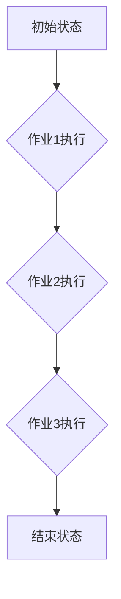

## 1. 背景介绍
### 1.1  问题的由来
在现代大数据时代，海量数据的处理和分析成为企业发展的重要驱动力。为了高效地管理和执行复杂的批处理任务，Apache Oozie 应运而生。Oozie 是一种开源的批处理调度系统，它可以管理和执行 Hadoop 集群上的各种批处理作业，例如 MapReduce、Pig、Hive 等。

然而，在实际应用中，许多批处理任务并非独立完成，而是需要多个作业协同工作，形成一个完整的业务流程。例如，数据清洗、数据转换、数据加载等多个步骤需要串行或并行执行才能完成最终目标。传统的 Oozie 作业调度方式难以满足这种复杂业务流程的需求。

### 1.2  研究现状
针对上述问题，Oozie 引入了 Bundle 机制，它可以将多个独立的 Oozie 作业组合成一个逻辑单元，并定义它们的执行顺序和依赖关系。Bundle 能够有效地管理和执行复杂的批处理流程，提高作业执行效率和可靠性。

目前，Oozie Bundle 的研究主要集中在以下几个方面：

* Bundle 的设计和实现：研究如何设计和实现高效、灵活的 Bundle 机制，支持各种类型的作业组合和执行模式。
* Bundle 的调度和执行：研究如何优化 Bundle 的调度和执行策略，提高作业执行效率和资源利用率。
* Bundle 的监控和管理：研究如何监控和管理 Bundle 的执行状态，并提供相应的故障处理机制。

### 1.3  研究意义
Oozie Bundle 的研究具有重要的理论和实践意义：

* **理论意义:**  Bundle 机制为复杂批处理流程的管理和执行提供了一种新的解决方案，丰富了 Oozie 调度系统的功能和应用场景。
* **实践意义:**  Bundle 可以有效地提高批处理作业的执行效率和可靠性，降低运维成本，帮助企业更好地利用 Hadoop 集群资源。

### 1.4  本文结构
本文将详细介绍 Oozie Bundle 的原理、实现方式和应用场景。具体结构如下：

1. 背景介绍
2. 核心概念与联系
3. 核心算法原理 & 具体操作步骤
4. 数学模型和公式 & 详细讲解 & 举例说明
5. 项目实践：代码实例和详细解释说明
6. 实际应用场景
7. 工具和资源推荐
8. 总结：未来发展趋势与挑战
9. 附录：常见问题与解答

## 2. 核心概念与联系
### 2.1  Oozie 作业
Oozie 作业是 Oozie 调度系统的基本单元，它代表一个独立的批处理任务。Oozie 作业可以是 MapReduce 作业、Pig 作业、Hive 作业等，也可以是自定义的脚本作业。

### 2.2  Oozie Bundle
Oozie Bundle 是多个 Oozie 作业的组合，它定义了这些作业之间的执行顺序和依赖关系。Bundle 可以将多个独立的作业组合成一个逻辑单元，并将其作为一个整体进行调度和执行。

### 2.3  Bundle 的类型
Oozie Bundle 主要分为两种类型：

* **Sequential Bundle:**  作业按照预定义的顺序执行，每个作业的执行结果作为下一个作业的输入。
* **Parallel Bundle:**  多个作业可以同时执行，它们之间没有依赖关系。

### 2.4  Bundle 的依赖关系
Bundle 中的作业之间可以定义依赖关系，例如：

* **Data Dependency:**  一个作业的输出作为另一个作业的输入。
* **Control Dependency:**  一个作业的执行结果决定另一个作业是否执行。

## 3. 核心算法原理 & 具体操作步骤
### 3.1  算法原理概述
Oozie Bundle 的核心算法原理是基于作业调度和执行的流程控制。

1. **Bundle 定义:**  用户定义 Bundle 的结构，包括作业列表、执行顺序和依赖关系。
2. **作业调度:**  Oozie 协调引擎根据 Bundle 的定义和集群资源情况，调度作业执行。
3. **作业执行:**  调度引擎将作业分配给集群节点执行。
4. **状态监控:**  Oozie 监控作业执行状态，并根据依赖关系和执行结果，控制后续作业的执行。
5. **结果汇总:**  所有作业执行完成后，Oozie 将结果汇总并返回给用户。

### 3.2  算法步骤详解
1. **Bundle 创建:**  用户使用 Oozie Web UI 或命令行工具创建 Bundle，并定义作业列表、执行顺序和依赖关系。
2. **Bundle 提交:**  用户提交 Bundle 到 Oozie 协调引擎。
3. **Bundle 解析:**  Oozie 协调引擎解析 Bundle 的定义，并将其转换为执行计划。
4. **作业调度:**  Oozie 协调引擎根据执行计划和集群资源情况，调度作业执行。
5. **作业执行:**  调度引擎将作业分配给集群节点执行。
6. **状态监控:**  Oozie 监控作业执行状态，并根据依赖关系和执行结果，控制后续作业的执行。
7. **结果汇总:**  所有作业执行完成后，Oozie 将结果汇总并返回给用户。

### 3.3  算法优缺点
**优点:**

* **提高作业执行效率:**  Bundle 可以将多个作业组合成一个逻辑单元，并优化执行顺序，提高整体执行效率。
* **增强作业可靠性:**  Bundle 可以定义作业之间的依赖关系，确保作业执行的正确性和可靠性。
* **简化作业管理:**  Bundle 可以将多个独立的作业管理成一个整体，简化作业管理和维护。

**缺点:**

* **复杂度增加:**  Bundle 的设计和实现比单个作业更加复杂。
* **调试难度:**  Bundle 的调试难度比单个作业更高，需要考虑多个作业之间的依赖关系和执行流程。

### 3.4  算法应用领域
Oozie Bundle 广泛应用于各种大数据处理场景，例如：

* **数据清洗:**  将多个数据清洗作业组合成一个 Bundle，实现数据的统一清洗和处理。
* **数据转换:**  将多个数据转换作业组合成一个 Bundle，实现数据的格式转换和结构调整。
* **数据加载:**  将多个数据加载作业组合成一个 Bundle，实现数据的批量加载和存储。
* **机器学习:**  将多个机器学习模型训练和评估作业组合成一个 Bundle，实现机器学习流程的自动化。

## 4. 数学模型和公式 & 详细讲解 & 举例说明
### 4.1  数学模型构建
Oozie Bundle 的执行流程可以抽象为一个状态机模型，其中每个状态代表一个作业执行阶段，状态之间的转换依赖于作业执行结果和依赖关系。

**状态机模型:**



**状态机状态定义:**

* **初始状态:**  Bundle 启动时进入初始状态。
* **作业执行状态:**  作业正在执行中。
* **结束状态:**  所有作业执行完成，Bundle 执行结束。

**状态转换条件:**

* 从初始状态到作业执行状态的转换条件是 Bundle 启动成功。
* 从作业执行状态到下一个作业执行状态的转换条件是前一个作业执行成功。
* 从作业执行状态到结束状态的转换条件是所有作业执行成功。

### 4.2  公式推导过程
Oozie Bundle 的执行时间可以根据作业执行时间和依赖关系进行计算。

**公式:**

```
Bundle 执行时间 = max(作业1执行时间, 作业2执行时间, ..., 作业n执行时间)
```

其中，作业1执行时间、作业2执行时间、...、作业n执行时间分别代表每个作业的执行时间。

**举例说明:**

假设一个 Bundle 包含三个作业，作业1执行时间为 10 分钟，作业2执行时间为 5 分钟，作业3执行时间为 15 分钟，并且作业2依赖于作业1的执行结果。

则 Bundle 的执行时间为 15 分钟，因为作业3的执行时间最长。

### 4.3  案例分析与讲解
**案例:**

一个数据清洗 Bundle 包含三个作业：

* **作业1:**  从数据库中读取原始数据。
* **作业2:**  对原始数据进行清洗和转换。
* **作业3:**  将清洗后的数据写入目标数据库。

**分析:**

作业2依赖于作业1的执行结果，因此作业2只能在作业1执行完成后才能开始执行。

**讲解:**

Oozie Bundle 可以将这三个作业组合成一个逻辑单元，并定义它们的执行顺序和依赖关系。当 Bundle 启动时，Oozie 协调引擎会首先调度作业1执行，完成后再调度作业2执行，最后调度作业3执行。

### 4.4  常见问题解答
**问题:**

如何处理 Bundle 中作业执行失败的情况？

**解答:**

Oozie 提供了多种机制来处理作业执行失败的情况，例如：

* **重试机制:**  Oozie 可以自动重试失败的作业，直到作业成功执行。
* **故障转移机制:**  Oozie 可以将失败的作业转移到其他节点执行。
* **报警机制:**  Oozie 可以发送邮件或短信等通知，提醒管理员处理作业执行失败的情况。

## 5. 项目实践：代码实例和详细解释说明
### 5.1  开发环境搭建
Oozie Bundle 的开发环境搭建需要以下软件：

* Hadoop 集群
* Oozie 协调引擎
* 开发工具 (例如 Eclipse, IntelliJ IDEA)

### 5.2  源代码详细实现
Oozie Bundle 的代码实现主要包含以下几个部分：

* **Bundle 定义文件:**  使用 XML 格式定义 Bundle 的结构，包括作业列表、执行顺序和依赖关系。
* **作业脚本:**  每个作业都需要一个脚本文件，例如 MapReduce 脚本、Pig 脚本、Hive 脚本等。
* **依赖关系配置:**  定义作业之间的依赖关系，例如数据依赖、控制依赖等。

**示例代码:**

```xml
<?xml version="1.0" encoding="UTF-8"?>
<bundle xmlns="uri:oozie:bundle-def:0.4">
  <name>my-bundle</name>
  <description>My Oozie Bundle</description>
  <concurrency>1</concurrency>
  <action>
    <map-reduce>
      <job-tracker>http://master:50030</job-tracker>
      <name-node>http://master:50070</name-node>
      <input>${input_dir}</input>
      <output>${output_dir}</output>
      <script>my-map-reduce-script.py</script>
    </map-reduce>
  </action>
</bundle>
```

### 5.3  代码解读与分析
**代码解读:**

* `<bundle>` 元素定义了 Bundle 的根节点。
* `<name>` 元素指定了 Bundle 的名称。
* `<description>` 元素指定了 Bundle 的描述信息。
* `<concurrency>` 元素指定了 Bundle 的并发度。
* `<action>` 元素定义了 Bundle 中的作业。
* `<map-reduce>` 元素定义了一个 MapReduce 作业。
* `<job-tracker>` 元素指定了 MapReduce 作业的 JobTracker 地址。
* `<name-node>` 元素指定了 MapReduce 作业的 NameNode 地址。
* `<input>` 元素指定了 MapReduce 作业的输入目录。
* `<output>` 元素指定了 MapReduce 作业的输出目录。
* `<script>` 元素指定了 MapReduce 作业的脚本文件。

**代码分析:**

该代码示例定义了一个名为 "my-bundle" 的 MapReduce Bundle，它包含一个 MapReduce 作业。该作业的输入目录为 "${input_dir}"，输出目录为 "${output_dir}"，脚本文件为 "my-map-reduce-script.py"。

### 5.4  运行结果展示
Oozie Bundle 的运行结果可以通过 Oozie Web UI 或命令行工具查看。

## 6. 实际应用场景
### 6.1  数据清洗
Oozie Bundle 可以将多个数据清洗作业组合成一个逻辑单元，实现数据的统一清洗和处理。例如，可以将数据格式转换、数据去重、数据校验等多个清洗步骤组合成一个 Bundle，并定义它们的执行顺序和依赖关系。

### 6.2  数据转换
Oozie Bundle 可以将多个数据转换作业组合成一个逻辑单元，实现数据的格式转换和结构调整。例如，可以将数据从 CSV 格式转换为 JSON 格式，或者将数据从关系型数据库转换为 NoSQL 数据库等。

### 6.3  数据加载
Oozie Bundle 可以将多个数据加载作业组合成一个逻辑单元，实现数据的批量加载和存储。例如，可以将数据从 HDFS 加载到 Hive 表，或者将数据从 Kafka 主题加载到数据库等。

### 6.4  未来应用展望
随着大数据技术的不断发展，Oozie Bundle 的应用场景将会更加广泛。例如，可以将机器学习模型训练和评估作业组合成一个 Bundle，实现机器学习流程的自动化；也可以将数据分析和报表生成作业组合成一个 Bundle，实现数据分析的自动化。

## 7. 工具和资源推荐
### 7.1  学习资源推荐
* **Oozie 官方文档:** https://oozie.apache.org/docs/
* **Oozie 用户指南:** https://oozie.apache.org/docs/4.2.0/user-guide/
* **Oozie 开发指南:** https://oozie.apache.org/docs/4.2.0/developer-guide/

### 7.2  开发工具推荐
* **Eclipse:** https://www.eclipse.org/
* **IntelliJ IDEA:** https://www.jetbrains.com/idea/

### 7.3  相关论文推荐
* **Oozie: A Work-Flow Scheduler for Hadoop:** https://www.usenix.org/system/files/conference/osdi09/osdi09-paper-jain.pdf
* **Apache Oozie: A Workflow Scheduler for Hadoop:** https://www.cloudera.com/content/dam/cloudera/documentation/en-us/oozie/latest/oozie-user-guide.pdf

### 7.4  其他资源推荐
* **Apache Oozie 社区论坛:** https://issues.apache.org/jira/browse/OOZIE
* **Oozie GitHub 仓库:** https://github.com/apache/oozie


## 8. 总结：未来发展趋势与挑战
### 8.1  研究成果总结
Oozie Bundle 的研究成果为大数据处理提供了更加灵活和高效的解决方案，能够有效地管理和执行复杂的批处理流程，提高作业执行效率和可靠性。

### 8.2  未来发展趋势
Oozie Bundle 的未来发展趋势主要集中在以下几个方面：

* **支持更丰富的作业类型:**  支持更多类型的作业，例如 Spark 作业、Flink 作业等。
* **增强调度策略:**  开发更智能的调度策略，能够根据集群资源情况和作业优先级，优化作业执行顺序和资源分配。
* **提高监控和管理能力:**  提供更完善的监控和管理功能，能够实时监控 Bundle 的执行状态，并提供更直观的报表和分析工具。

### 8.3  面临的挑战
Oozie Bundle 的发展也面临着一些挑战：

* **复杂度增加:**  随着作业类型的增加和调度策略的复杂化，Bundle 的设计和实现难度会不断增加。
* **资源管理:**  如何高效地管理集群资源，并确保 Bundle 的执行效率和可靠性，是一个重要的挑战。
* **安全性和可靠性:**  如何保证 Bundle 的安全性，并提高其可靠性，也是一个重要的研究方向。

### 8.4  研究展望
未来，Oozie Bundle 将继续朝着更灵活、更智能、更安全的方向发展，为大数据处理提供更加强大的支持。


## 9. 附录：常见问题与解答
### 9.1  问题1: 如何创建 Oozie Bundle？
### 9.2  解答1:
### 9.3  问题2: 如何提交 Oozie Bundle？
### 9.4  解答2:
### 9.5  问题3: 如何监控 Oozie Bundle 的执行状态？
### 9.6  解答3:


作者：禅与计算机程序设计艺术 / Zen and the Art of Computer Programming
<end_of_turn>