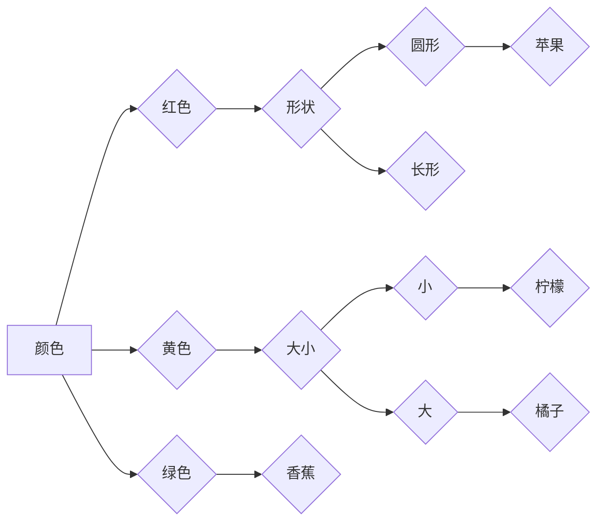
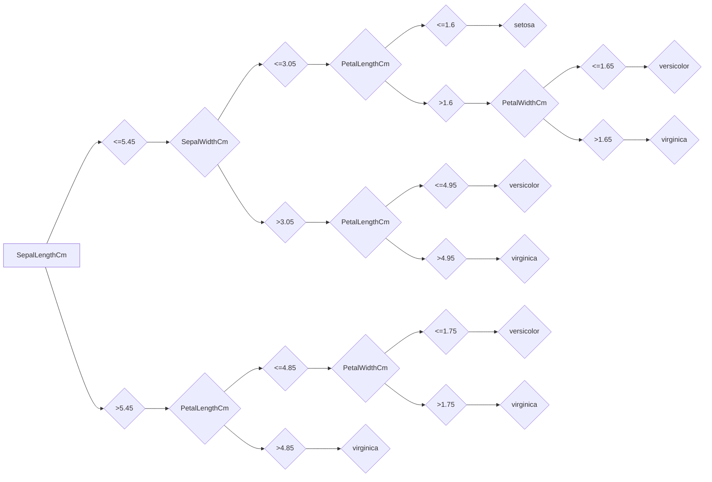

## 1. 背景介绍

### 1.1 问题的由来

在机器学习领域，决策树算法是一种经典且常用的监督学习算法，它能够根据数据特征进行分类或回归预测。决策树模型以树状结构表示，每个节点代表一个特征，每个分支代表一个特征值，叶子节点代表最终的分类或回归结果。决策树算法以其易于理解、可解释性强、实现简单等优点，在各个领域得到了广泛应用，例如：

* **分类问题:** 识别垃圾邮件、预测客户流失、疾病诊断等。
* **回归问题:** 预测房价、股票价格、销售额等。

### 1.2 研究现状

决策树算法的研究已有几十年的历史，从早期的ID3算法到后来的C4.5算法，再到近年来出现的随机森林、梯度提升树等集成学习方法，决策树算法不断发展和完善。目前，决策树算法在机器学习领域仍然占据着重要地位，并不断涌现出新的研究成果。

### 1.3 研究意义

决策树算法在机器学习领域具有重要的研究意义，它不仅可以用于解决实际问题，还可以作为其他机器学习算法的基础。例如，随机森林、梯度提升树等集成学习方法都是基于决策树算法构建的。此外，决策树算法的可解释性强，能够帮助人们理解模型的决策过程，这对于一些需要对模型进行解释的应用场景非常重要。

### 1.4 本文结构

本文将深入探讨决策树算法的原理和实现，并结合Python代码示例进行讲解。文章结构如下：

* **背景介绍:** 概述决策树算法的由来、研究现状和研究意义。
* **核心概念与联系:** 介绍决策树算法的核心概念，包括信息增益、基尼系数等。
* **核心算法原理 & 具体操作步骤:** 详细阐述决策树算法的原理和具体操作步骤，包括ID3算法、C4.5算法等。
* **数学模型和公式 & 详细讲解 & 举例说明:** 使用数学模型和公式对决策树算法进行详细讲解，并结合案例进行说明。
* **项目实践：代码实例和详细解释说明:** 使用Python代码实现决策树算法，并进行详细解释说明。
* **实际应用场景:** 介绍决策树算法在不同领域的实际应用场景。
* **工具和资源推荐:** 推荐一些学习决策树算法的工具和资源。
* **总结：未来发展趋势与挑战:** 总结决策树算法的研究成果，展望未来发展趋势和面临的挑战。
* **附录：常见问题与解答:** 收集一些常见问题并进行解答。

## 2. 核心概念与联系

决策树算法的核心概念包括：

* **信息增益 (Information Gain):**  衡量使用某个特征来划分数据集后，信息熵的减少量。信息增益越大，说明使用该特征划分数据集的效果越好。
* **基尼系数 (Gini Impurity):** 衡量数据集的纯度。基尼系数越小，说明数据集的纯度越高。
* **节点 (Node):** 决策树中的每个节点代表一个特征。
* **分支 (Branch):** 从一个节点到另一个节点的路径。
* **叶子节点 (Leaf Node):** 决策树的末端节点，代表最终的分类或回归结果。

## 3. 核心算法原理 & 具体操作步骤

### 3.1 算法原理概述

决策树算法是一种贪婪算法，它从根节点开始，逐步选择最佳特征进行划分，直到所有叶子节点都属于同一个类别或达到预设的停止条件。决策树算法的构建过程可以概括为以下步骤：

1. **选择最佳特征:** 选择信息增益或基尼系数最大的特征作为当前节点的划分特征。
2. **划分数据集:** 根据所选特征的值将数据集划分为多个子集。
3. **递归构建子树:** 对每个子集递归地重复步骤1和步骤2，直到满足停止条件。
4. **生成决策树:** 将所有节点和分支连接起来，形成最终的决策树模型。

### 3.2 算法步骤详解

常见的决策树算法包括ID3算法、C4.5算法、CART算法等。以下以ID3算法为例，详细介绍决策树算法的具体操作步骤：

**ID3算法步骤:**

1. **计算所有特征的信息增益:**  计算每个特征对数据集的信息增益。
2. **选择信息增益最大的特征:** 选择信息增益最大的特征作为当前节点的划分特征。
3. **根据所选特征的值划分数据集:**  将数据集划分为多个子集，每个子集对应一个特征值。
4. **递归构建子树:**  对每个子集递归地重复步骤1到步骤3，直到满足停止条件。
5. **生成决策树:**  将所有节点和分支连接起来，形成最终的决策树模型。

**停止条件:**

* 所有样本都属于同一个类别。
* 所有特征都被使用。
* 达到预设的树深度。
* 数据集样本数量小于预设阈值。

### 3.3 算法优缺点

**决策树算法的优点:**

* **易于理解和解释:** 决策树模型的结构简单直观，易于理解和解释。
* **可处理高维数据:** 决策树算法可以处理包含大量特征的数据集。
* **对缺失值和噪声数据不敏感:** 决策树算法对缺失值和噪声数据具有一定的容忍度。
* **不需要对数据进行归一化:** 决策树算法不需要对数据进行归一化处理。

**决策树算法的缺点:**

* **容易过拟合:** 决策树算法容易过拟合，尤其是在数据集规模较小或特征数量较多时。
* **不稳定性:** 决策树算法对数据的微小变化比较敏感，可能会导致模型结构发生较大变化。
* **对数据分布敏感:** 决策树算法对数据的分布比较敏感，如果数据分布不均匀，可能会导致模型性能下降。

### 3.4 算法应用领域

决策树算法在各个领域都有广泛的应用，例如：

* **医疗领域:** 疾病诊断、药物推荐等。
* **金融领域:** 欺诈检测、信用风险评估等。
* **电商领域:** 商品推荐、用户画像等。
* **教育领域:** 学生成绩预测、学习资源推荐等。

## 4. 数学模型和公式 & 详细讲解 & 举例说明

### 4.1 数学模型构建

决策树算法的核心是信息增益或基尼系数的计算。以下分别介绍信息增益和基尼系数的数学模型：

**信息增益:**

信息增益的计算公式如下：

$$
Gain(S, A) = Entropy(S) - \sum_{v \in Values(A)} \frac{|S_v|}{|S|} Entropy(S_v)
$$

其中：

* $S$ 表示数据集。
* $A$ 表示特征。
* $Values(A)$ 表示特征 $A$ 的所有取值。
* $S_v$ 表示特征 $A$ 取值为 $v$ 的样本子集。
* $Entropy(S)$ 表示数据集 $S$ 的信息熵。

**基尼系数:**

基尼系数的计算公式如下：

$$
Gini(S) = 1 - \sum_{i=1}^{C} p_i^2
$$

其中：

* $S$ 表示数据集。
* $C$ 表示类别数量。
* $p_i$ 表示类别 $i$ 在数据集 $S$ 中的比例。

### 4.2 公式推导过程

**信息增益推导:**

信息增益的推导过程如下：

1. **信息熵:** 信息熵用来衡量数据集的混乱程度，公式如下：

   $$
   Entropy(S) = -\sum_{i=1}^{C} p_i log_2(p_i)
   $$

   其中，$p_i$ 表示类别 $i$ 在数据集 $S$ 中的比例。

2. **条件熵:** 条件熵用来衡量在已知特征 $A$ 的取值的情况下，数据集的混乱程度，公式如下：

   $$
   Entropy(S|A) = \sum_{v \in Values(A)} \frac{|S_v|}{|S|} Entropy(S_v)
   $$

   其中，$S_v$ 表示特征 $A$ 取值为 $v$ 的样本子集。

3. **信息增益:** 信息增益等于信息熵减去条件熵，公式如下：

   $$
   Gain(S, A) = Entropy(S) - Entropy(S|A)
   $$

**基尼系数推导:**

基尼系数的推导过程如下：

1. **基尼系数:** 基尼系数用来衡量数据集的纯度，公式如下：

   $$
   Gini(S) = 1 - \sum_{i=1}^{C} p_i^2
   $$

   其中，$p_i$ 表示类别 $i$ 在数据集 $S$ 中的比例。

2. **基尼系数的意义:** 基尼系数越小，说明数据集的纯度越高。

### 4.3 案例分析与讲解

**案例:**  假设我们有一个关于水果的数据集，包含三个特征：颜色、形状、大小，以及一个类别标签：水果类型。数据集如下：

| 颜色 | 形状 | 大小 | 水果类型 |
|---|---|---|---|
| 红色 | 圆形 | 大 | 苹果 |
| 黄色 | 圆形 | 小 | 柠檬 |
| 绿色 | 长形 | 中等 | 香蕉 |
| 红色 | 圆形 | 中等 | 苹果 |
| 黄色 | 圆形 | 大 | 橘子 |

**使用ID3算法构建决策树:**

1. **计算所有特征的信息增益:**

   * 颜色特征的信息增益：$Gain(S, 颜色) = 0.693$
   * 形状特征的信息增益：$Gain(S, 形状) = 0.415$
   * 大小特征的信息增益：$Gain(S, 大小) = 0.251$

2. **选择信息增益最大的特征:** 颜色特征的信息增益最大，因此选择颜色特征作为根节点的划分特征。

3. **根据颜色特征的值划分数据集:**

   * 颜色为红色的样本子集：
     | 颜色 | 形状 | 大小 | 水果类型 |
     |---|---|---|---|
     | 红色 | 圆形 | 大 | 苹果 |
     | 红色 | 圆形 | 中等 | 苹果 |

   * 颜色为黄色的样本子集：
     | 颜色 | 形状 | 大小 | 水果类型 |
     |---|---|---|---|
     | 黄色 | 圆形 | 小 | 柠檬 |
     | 黄色 | 圆形 | 大 | 橘子 |

   * 颜色为绿色的样本子集：
     | 颜色 | 形状 | 大小 | 水果类型 |
     |---|---|---|---|
     | 绿色 | 长形 | 中等 | 香蕉 |

4. **递归构建子树:**  对每个子集递归地重复步骤1到步骤3，直到满足停止条件。

   * 对颜色为红色的样本子集，选择形状特征作为划分特征，因为形状特征的信息增益最大。
   * 对颜色为黄色的样本子集，选择大小特征作为划分特征，因为大小特征的信息增益最大。
   * 对颜色为绿色的样本子集，只有一个样本，因此直接作为叶子节点。

5. **生成决策树:**  将所有节点和分支连接起来，形成最终的决策树模型。

**决策树模型:**



### 4.4 常见问题解答

**问题1: 如何选择最佳特征？**

**解答:**  可以选择信息增益或基尼系数最大的特征作为最佳特征。

**问题2: 如何处理缺失值？**

**解答:**  可以使用以下方法处理缺失值：

* **忽略缺失值:**  直接忽略包含缺失值的样本。
* **使用默认值:**  使用特征的默认值填充缺失值。
* **使用代理值:**  使用其他特征的值来推断缺失值。

**问题3: 如何防止过拟合？**

**解答:**  可以使用以下方法防止过拟合：

* **剪枝:**  对决策树进行剪枝，删除一些不必要的节点和分支。
* **限制树的深度:**  限制决策树的最大深度。
* **限制叶子节点的样本数量:**  限制叶子节点的最小样本数量。

## 5. 项目实践：代码实例和详细解释说明

### 5.1 开发环境搭建

本项目使用Python语言进行实现，需要安装以下库：

* **scikit-learn:**  机器学习库，包含决策树算法的实现。
* **pandas:**  数据处理库，用于读取和处理数据集。
* **matplotlib:**  绘图库，用于绘制决策树模型。

可以使用以下命令安装这些库：

```bash
pip install scikit-learn pandas matplotlib
```

### 5.2 源代码详细实现

以下代码使用scikit-learn库实现决策树算法，并使用鸢尾花数据集进行训练和预测：

```python
import pandas as pd
from sklearn.model_selection import train_test_split
from sklearn.tree import DecisionTreeClassifier
from sklearn.metrics import accuracy_score
from sklearn.tree import plot_tree
import matplotlib.pyplot as plt

# 1. 读取数据集
data = pd.read_csv('iris.csv')

# 2. 划分数据集
X = data.drop('Species', axis=1)
y = data['Species']
X_train, X_test, y_train, y_test = train_test_split(X, y, test_size=0.2, random_state=42)

# 3. 创建决策树模型
model = DecisionTreeClassifier()

# 4. 训练模型
model.fit(X_train, y_train)

# 5. 预测结果
y_pred = model.predict(X_test)

# 6. 计算准确率
accuracy = accuracy_score(y_test, y_pred)
print('准确率：', accuracy)

# 7. 绘制决策树模型
plt.figure(figsize=(12, 8))
plot_tree(model, feature_names=X.columns, class_names=y.unique(), filled=True)
plt.show()
```

### 5.3 代码解读与分析

代码中，首先使用pandas库读取鸢尾花数据集，并将其划分为训练集和测试集。然后，使用scikit-learn库创建决策树模型，并使用训练集进行训练。最后，使用测试集进行预测，并计算模型的准确率。代码还使用matplotlib库绘制决策树模型。

### 5.4 运行结果展示

运行代码后，会输出模型的准确率，并绘制决策树模型。

**决策树模型图:**



## 6. 实际应用场景

### 6.1 医疗领域

决策树算法在医疗领域有广泛的应用，例如：

* **疾病诊断:**  根据患者的症状和体征，诊断出患者可能患有的疾病。
* **药物推荐:**  根据患者的病史、症状和体征，推荐合适的药物。
* **风险评估:**  评估患者患某种疾病的风险。

### 6.2 金融领域

决策树算法在金融领域也有广泛的应用，例如：

* **欺诈检测:**  识别信用卡欺诈交易。
* **信用风险评估:**  评估借款人的信用风险。
* **投资决策:**  预测股票价格走势。

### 6.3 电商领域

决策树算法在电商领域也有广泛的应用，例如：

* **商品推荐:**  根据用户的历史购买记录和浏览记录，推荐合适的商品。
* **用户画像:**  分析用户的行为特征，建立用户画像。
* **价格预测:**  预测商品的价格走势。

### 6.4 未来应用展望

随着人工智能技术的不断发展，决策树算法将在更多领域得到应用，例如：

* **自动驾驶:**  帮助自动驾驶汽车做出决策。
* **自然语言处理:**  理解和生成自然语言。
* **计算机视觉:**  识别图像和视频中的物体。

## 7. 工具和资源推荐

### 7.1 学习资源推荐

* **机器学习实战 (第二版):**  一本经典的机器学习入门书籍，包含决策树算法的详细讲解。
* **Scikit-learn官方文档:**  scikit-learn库的官方文档，包含决策树算法的API介绍和示例代码。
* **机器学习课程:**  许多大学和机构提供机器学习课程，可以学习决策树算法的相关知识。

### 7.2 开发工具推荐

* **Python:**  一种流行的编程语言，拥有丰富的机器学习库，例如scikit-learn。
* **R:**  一种统计编程语言，也拥有丰富的机器学习库。
* **Jupyter Notebook:**  一种交互式编程环境，可以方便地进行机器学习实验。

### 7.3 相关论文推荐

* **Quinlan, J. R. (1986). Induction of decision trees. Machine learning, 1(1), 81-106.**
* **Breiman, L., Friedman, J. H., Olshen, R. A., & Stone, C. J. (1984). Classification and regression trees. Wadsworth & Brooks/Cole.**
* **Friedman, J. H. (2001). Greedy function approximation: A gradient boosting machine. Annals of statistics, 29(5), 1189-1232.**

### 7.4 其他资源推荐

* **Kaggle:**  一个数据科学竞赛平台，可以找到许多关于决策树算法的竞赛和项目。
* **GitHub:**  一个代码托管平台，可以找到许多关于决策树算法的开源项目。

## 8. 总结：未来发展趋势与挑战

### 8.1 研究成果总结

决策树算法是一种经典且常用的监督学习算法，它具有易于理解、可解释性强、实现简单等优点，在各个领域都有广泛的应用。近年来，决策树算法不断发展和完善，涌现出许多新的研究成果，例如随机森林、梯度提升树等集成学习方法。

### 8.2 未来发展趋势

决策树算法的未来发展趋势包括：

* **更快的算法:**  开发更快的决策树算法，以提高模型训练效率。
* **更强的泛化能力:**  提高决策树算法的泛化能力，使其能够更好地处理未知数据。
* **更强的鲁棒性:**  提高决策树算法的鲁棒性，使其能够更好地处理噪声数据和缺失值。
* **更深层的理解:**  更深入地理解决策树算法的原理和机制，并开发新的算法和模型。

### 8.3 面临的挑战

决策树算法也面临着一些挑战，例如：

* **过拟合:**  决策树算法容易过拟合，需要使用剪枝等方法进行防止。
* **不稳定性:**  决策树算法对数据的微小变化比较敏感，可能会导致模型结构发生较大变化。
* **对数据分布敏感:**  决策树算法对数据的分布比较敏感，如果数据分布不均匀，可能会导致模型性能下降。

### 8.4 研究展望

未来，决策树算法的研究将继续朝着以下方向发展：

* **开发更有效的剪枝方法:**  开发更有效的剪枝方法，以防止过拟合。
* **探索新的特征选择方法:**  探索新的特征选择方法，以提高模型的泛化能力。
* **研究决策树算法的理论基础:**  更深入地研究决策树算法的理论基础，并开发新的算法和模型。

## 9. 附录：常见问题与解答

**问题1: 决策树算法如何处理连续型特征？**

**解答:**  决策树算法可以使用以下方法处理连续型特征：

* **二元化:**  将连续型特征划分为两个区间，例如大于某个阈值的样本属于一个区间，小于某个阈值的样本属于另一个区间。
* **离散化:**  将连续型特征离散化为多个区间，例如将年龄特征离散化为儿童、青少年、成年人等区间。

**问题2: 如何选择合适的决策树算法？**

**解答:**  选择合适的决策树算法需要根据具体的问题和数据集进行选择，例如：

* **ID3算法:**  适用于处理离散型特征的数据集。
* **C4.5算法:**  适用于处理离散型和连续型特征的数据集。
* **CART算法:**  适用于处理分类和回归问题的数据集。

**问题3: 如何评估决策树模型的性能？**

**解答:**  可以使用以下指标评估决策树模型的性能：

* **准确率 (Accuracy):**  正确预测的样本数量占总样本数量的比例。
* **精确率 (Precision):**  正确预测为正样本的样本数量占所有预测为正样本的样本数量的比例。
* **召回率 (Recall):**  正确预测为正样本的样本数量占所有实际为正样本的样本数量的比例。
* **F1值 (F1-score):**  精确率和召回率的调和平均值。

**问题4: 如何解释决策树模型？**

**解答:**  决策树模型的解释比较简单，可以根据树的结构和节点的特征值来解释模型的决策过程。例如，我们可以根据树的结构和节点的特征值来解释模型是如何根据用户的特征信息来预测用户的行为的。

作者：禅与计算机程序设计艺术 / Zen and the Art of Computer Programming
