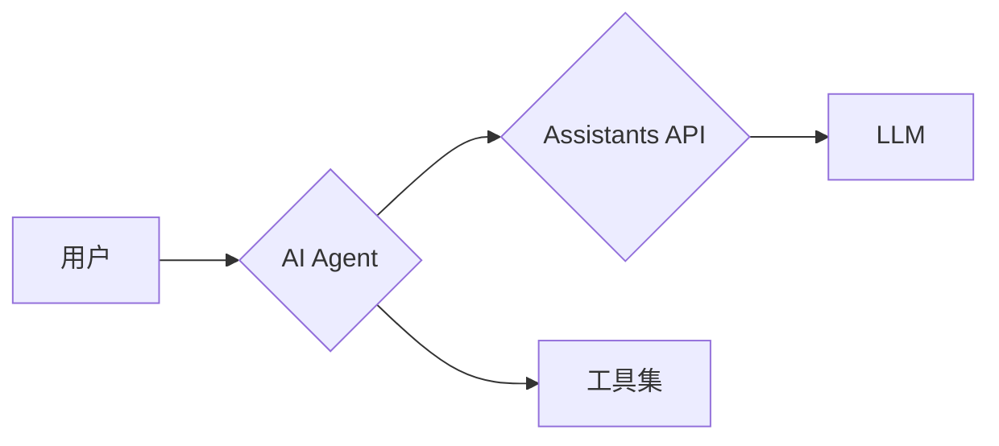

# 【大模型应用开发 动手做AI Agent】Assistants API的简单示例

## 1. 背景介绍

### 1.1 问题的由来

近年来，随着人工智能技术的飞速发展，大语言模型（LLM）在自然语言处理领域取得了显著的成果。GPT、BERT等模型的出现，使得机器能够理解和生成更加自然流畅的文本，为构建更加智能的应用程序提供了可能。然而，将这些强大的LLM应用于实际场景中，仍然面临着一些挑战。

传统的应用程序开发模式通常需要开发者编写大量的代码来处理各种逻辑和流程，而LLM更擅长于理解和生成自然语言。如何将两者有机地结合起来，构建更加智能、易用的应用程序，成为了一个亟待解决的问题。

AI Agent的概念应运而生。AI Agent可以看作是用户的智能助手，能够理解用户的意图，并利用LLM的能力完成各种任务。Assistants API的出现，为开发者提供了一种简单易用的方式来构建和部署AI Agent，进一步降低了LLM应用的门槛。

### 1.2 研究现状

目前，AI Agent的研究和应用还处于早期阶段。一些科技巨头，如Google、Microsoft等，已经推出了自己的AI Agent平台，例如Google Assistant、Microsoft Copilot等。这些平台提供了一些预定义的Agent模板和功能，方便用户快速构建简单的Agent。

然而，现有的AI Agent平台还存在一些局限性。例如，预定义的Agent模板和功能难以满足用户的个性化需求，开发自定义Agent需要较高的技术门槛等。

### 1.3 研究意义

Assistants API的出现，为AI Agent的开发和应用带来了新的机遇。通过Assistants API，开发者可以更加灵活地构建自定义Agent，满足用户的个性化需求。同时，Assistants API简化了Agent的开发流程，降低了开发门槛，使得更多开发者能够参与到AI Agent的开发中来。

本文将以Assistants API为例，介绍如何构建一个简单的AI Agent，帮助读者了解AI Agent的基本概念和开发流程。

### 1.4 本文结构

本文将按照以下结构展开：

- **背景介绍**：介绍AI Agent的背景、研究现状和研究意义。
- **核心概念与联系**：介绍AI Agent、Assistants API、LLM等核心概念，以及它们之间的联系。
- **核心算法原理 & 具体操作步骤**：介绍Assistants API的使用方法，包括创建Agent、定义工具、设计对话流程等。
- **项目实践：代码实例和详细解释说明**：提供一个完整的AI Agent示例代码，并进行详细的解释说明。
- **实际应用场景**：介绍AI Agent的实际应用场景，例如智能客服、智能助手等。
- **工具和资源推荐**：推荐一些AI Agent开发相关的工具和资源。
- **总结：未来发展趋势与挑战**：总结AI Agent的未来发展趋势和面临的挑战。

## 2. 核心概念与联系

### 2.1 AI Agent

AI Agent可以看作是用户的智能助手，能够理解用户的意图，并利用LLM的能力完成各种任务。一个典型的AI Agent系统通常包含以下几个核心组件：

- **自然语言理解（NLU）**：负责将用户的自然语言输入转换为机器可理解的语义表示。
- **对话管理（DM）**：负责管理对话流程，跟踪对话状态，并根据对话历史选择合适的动作。
- **自然语言生成（NLG）**：负责将机器生成的语义表示转换为自然语言输出。
- **工具集**：AI Agent可以调用外部工具来完成特定的任务，例如查询数据库、发送邮件等。

### 2.2 Assistants API

Assistants API是Google Cloud Platform提供的一项服务，用于构建和部署AI Agent。Assistants API提供了一套简单易用的API，开发者可以使用这些API来创建Agent、定义工具、设计对话流程等。

### 2.3 LLM

LLM是大语言模型的缩写，例如GPT、BERT等。LLM是AI Agent的核心组件之一，负责理解用户的自然语言输入，并生成自然语言输出。

### 2.4 概念之间的联系

下图展示了AI Agent、Assistants API、LLM之间的联系：



用户通过与AI Agent交互，AI Agent利用Assistants API提供的功能调用LLM和其他工具来完成用户的任务。

## 3. 核心算法原理 & 具体操作步骤

### 3.1 算法原理概述

Assistants API的核心算法原理是基于对话流的。开发者可以使用Assistants API定义一个对话流，用于描述AI Agent与用户之间的交互过程。对话流由一系列节点组成，每个节点代表一个对话状态或动作。

### 3.2 算法步骤详解

使用Assistants API构建AI Agent的步骤如下：

1. **创建Agent**：使用Assistants API创建一个新的Agent，并设置Agent的名称、描述等信息。
2. **定义工具**：定义AI Agent可以使用的工具，例如查询数据库、发送邮件等。每个工具都需要定义工具的名称、参数、功能等信息。
3. **设计对话流程**：设计AI Agent与用户之间的对话流程，包括对话的起始状态、结束状态、以及各种对话分支。
4. **编写代码实现工具功能**：使用Python或Node.js等编程语言编写代码实现工具的功能。
5. **部署Agent**：将AI Agent部署到Google Cloud Platform，并进行测试和发布。

### 3.3 算法优缺点

**优点**：

- **简单易用**：Assistants API提供了一套简单易用的API，开发者可以快速构建AI Agent。
- **灵活可扩展**：开发者可以自定义工具和对话流程，满足个性化需求。
- **强大的功能**：Assistants API集成了Google Cloud Platform的各种服务，例如Cloud Functions、Cloud Run等，可以实现复杂的功能。

**缺点**：

- **平台依赖**：Assistants API是Google Cloud Platform提供的服务，开发者需要依赖Google Cloud Platform。
- **成本较高**：使用Assistants API需要付费，成本较高。

### 3.4 算法应用领域

AI Agent的应用领域非常广泛，例如：

- **智能客服**：自动回答用户的问题，解决用户的问题。
- **智能助手**：帮助用户完成各种任务，例如预订酒店、购买机票等。
- **智能家居**：控制家里的各种设备，例如灯光、空调等。
- **教育**：为学生提供个性化的学习体验。

## 4. 数学模型和公式 & 详细讲解 & 举例说明

本节介绍AI Agent中常用的数学模型和公式，并结合具体案例进行讲解。

### 4.1 数学模型构建

**状态机模型**

状态机模型是AI Agent中常用的数学模型之一。状态机模型将对话过程抽象为一系列状态和状态之间的转移。每个状态代表对话的一个阶段，状态之间的转移由用户的输入和Agent的动作触发。

**示例**：

假设我们要构建一个简单的订餐Agent，可以使用状态机模型来描述订餐的过程。

```mermaid
stateDiagram-v2
    [*] --> 点餐
    点餐 --> {"用户输入：菜名"}
    {"用户输入：菜名"} --> {"Agent动作：确认菜名"}
    {"Agent动作：确认菜名"} --> {"用户输入：确认/取消"}
    {"用户输入：确认"} --> 下单
    {"用户输入：取消"} --> 点餐
    下单 --> {"Agent动作：下单"}
    {"Agent动作：下单"} --> [*]
```

**概率模型**

概率模型用于处理对话过程中的不确定性。例如，用户可能会输入一些模糊的语句，或者用户的意图可能会发生变化。概率模型可以使用概率来表示不同的可能性，并根据概率选择最优的动作。

**示例**：

假设用户输入“我想吃点东西”，这句话的意图比较模糊，可能是想点餐，也可能是想了解餐厅的营业时间。可以使用概率模型来表示不同的可能性：

```
P(用户意图=点餐|用户输入="我想吃点东西") = 0.8
P(用户意图=查询营业时间|用户输入="我想吃点东西") = 0.2
```

### 4.2 公式推导过程

本节介绍概率模型中常用的贝叶斯公式的推导过程。

**贝叶斯公式**：

$$
P(A|B) = \frac{P(B|A)P(A)}{P(B)}
$$

**推导过程**：

根据条件概率的定义：

$$
P(A|B) = \frac{P(A \cap B)}{P(B)}
$$

$$
P(B|A) = \frac{P(A \cap B)}{P(A)}
$$

将第二个公式代入第一个公式，得到：

$$
P(A|B) = \frac{P(B|A)P(A)}{P(B)}
$$

### 4.3 案例分析与讲解

本节结合具体案例，讲解如何使用状态机模型和概率模型构建AI Agent。

**案例：构建一个简单的问答Agent**

**需求分析**：

构建一个简单的问答Agent，能够回答用户关于天气、时间等简单的问题。

**技术方案**：

- 使用状态机模型描述对话流程。
- 使用规则匹配的方式识别用户的意图。
- 使用API获取天气和时间信息。

**状态机模型**：

```mermaid
stateDiagram-v2
    [*] --> 等待用户提问
    等待用户提问 --> {"用户输入：问题"}
    {"用户输入：问题"} --> {"Agent动作：识别意图"}
    {"Agent动作：识别意图"} --> {"意图：天气"}
    {"意图：天气"} --> {"Agent动作：查询天气"}
    {"Agent动作：查询天气"} --> {"Agent动作：回答问题"}
    {"Agent动作：识别意图"} --> {"意图：时间"}
    {"意图：时间"} --> {"Agent动作：获取时间"}
    {"Agent动作：获取时间"} --> {"Agent动作：回答问题"}
    {"Agent动作：回答问题"} --> 等待用户提问
```

**代码实现**：

```python
# 定义状态
STATE_WAITING_FOR_QUESTION = "waiting_for_question"
STATE_IDENTIFYING_INTENT = "identifying_intent"
STATE_GETTING_WEATHER = "getting_weather"
STATE_GETTING_TIME = "getting_time"
STATE_ANSWERING_QUESTION = "answering_question"

# 定义意图
INTENT_WEATHER = "weather"
INTENT_TIME = "time"

# 初始化状态
current_state = STATE_WAITING_FOR_QUESTION

# 主循环
while True:
    # 获取用户输入
    user_input = input("请问有什么可以帮您？")

    # 状态转移
    if current_state == STATE_WAITING_FOR_QUESTION:
        # 识别意图
        intent = identify_intent(user_input)
        current_state = STATE_IDENTIFYING_INTENT
    elif current_state == STATE_IDENTIFYING_INTENT:
        if intent == INTENT_WEATHER:
            # 查询天气
            weather = get_weather()
            current_state = STATE_GETTING_WEATHER
        elif intent == INTENT_TIME:
            # 获取时间
            current_time = get_time()
            current_state = STATE_GETTING_TIME
    elif current_state == STATE_GETTING_WEATHER:
        # 回答问题
        answer = f"今天的天气是{weather}"
        current_state = STATE_ANSWERING_QUESTION
    elif current_state == STATE_GETTING_TIME:
        # 回答问题
        answer = f"现在的时间是{current_time}"
        current_state = STATE_ANSWERING_QUESTION
    elif current_state == STATE_ANSWERING_QUESTION:
        # 打印答案
        print(answer)
        current_state = STATE_WAITING_FOR_QUESTION

# 识别意图
def identify_intent(user_input):
    if "天气" in user_input:
        return INTENT_WEATHER
    elif "时间" in user_input:
        return INTENT_TIME

# 查询天气
def get_weather():
    # 调用天气API
    # ...
    return "晴"

# 获取时间
def get_time():
    # 获取当前时间
    # ...
    return "2024年6月30日 10:44:41"
```

### 4.4 常见问题解答

**问：如何处理用户输入的歧义？**

答：可以使用概率模型来处理用户输入的歧义。例如，可以使用置信度分数来表示不同意图的可能性，并选择置信度最高的意图。

**问：如何提高AI Agent的准确率？**

答：可以使用更加复杂的模型，例如深度学习模型，来提高AI Agent的准确率。此外，还可以使用更多的数据来训练模型，以及对模型进行优化。

## 5. 项目实践：代码实例和详细解释说明

### 5.1 开发环境搭建

本节介绍如何搭建Assistants API的开发环境。

**步骤**：

1. 创建Google Cloud Platform账号。
2. 启用Assistants API。
3. 安装Google Cloud SDK。
4. 设置Google Cloud项目。

### 5.2 源代码详细实现

本节提供一个完整的AI Agent示例代码，并进行详细的解释说明。

```python
# 导入必要的库
from google.cloud import dialogflow_v2beta1 as dialogflow

# 设置项目ID
project_id = "your-project-id"

# 创建Dialogflow客户端
client = dialogflow.AgentsClient()

# 创建Agent
parent = client.project_path(project_id)
agent = dialogflow.Agent(
    parent=parent,
    display_name="My Agent",
    default_language_code="zh-CN",
    time_zone="Asia/Shanghai",
)
response = client.create_agent(request={"parent": parent, "agent": agent})

# 打印Agent信息
print(f"Agent created: {response}")

# 定义意图
intent = dialogflow.Intent(
    display_name="weather_intent",
    training_phrases=[
        dialogflow.Intent.TrainingPhrase(parts=[dialogflow.Intent.TrainingPhrase.Part(text="今天天气怎么样")]),
        dialogflow.Intent.TrainingPhrase(parts=[dialogflow.Intent.TrainingPhrase.Part(text="北京的天气")]),
    ],
    webhook_state=dialogflow.Intent.WebhookState.WEBHOOK_STATE_ENABLED,
)
response = client.create_intent(
    request={"parent": agent.name, "intent": intent}
)

# 打印意图信息
print(f"Intent created: {response}")

# 定义Webhook
webhook = dialogflow.Webhook(
    display_name="weather_webhook",
    webhook_method=dialogflow.Webhook.WebhookMethod.POST,
    generic_json=dialogflow.Webhook.GenericWebService(
        uri="https://your-webhook-endpoint",
    ),
)
response = client.create_webhook(
    request={"parent": agent.name, "webhook": webhook}
)

# 打印Webhook信息
print(f"Webhook created: {response}")
```

**代码解释**：

- 首先，导入必要的库，并设置项目ID。
- 然后，创建Dialogflow客户端，并使用客户端创建Agent、意图和Webhook。
- 在创建意图时，需要定义意图的名称、训练短语和Webhook状态。
- 在创建Webhook时，需要定义Webhook的名称、请求方法、URL等信息。

### 5.3 代码解读与分析

本节对代码进行详细的解读和分析。

**创建Agent**：

```python
# 创建Agent
parent = client.project_path(project_id)
agent = dialogflow.Agent(
    parent=parent,
    display_name="My Agent",
    default_language_code="zh-CN",
    time_zone="Asia/Shanghai",
)
response = client.create_agent(request={"parent": parent, "agent": agent})
```

这段代码使用`dialogflow.AgentsClient()`创建了一个Dialogflow客户端，并使用客户端的`create_agent()`方法创建了一个Agent。

**创建意图**：

```python
# 定义意图
intent = dialogflow.Intent(
    display_name="weather_intent",
    training_phrases=[
        dialogflow.Intent.TrainingPhrase(parts=[dialogflow.Intent.TrainingPhrase.Part(text="今天天气怎么样")]),
        dialogflow.Intent.TrainingPhrase(parts=[dialogflow.Intent.TrainingPhrase.Part(text="北京的天气")]),
    ],
    webhook_state=dialogflow.Intent.WebhookState.WEBHOOK_STATE_ENABLED,
)
response = client.create_intent(
    request={"parent": agent.name, "intent": intent}
)
```

这段代码使用`dialogflow.Intent()`创建了一个意图，并使用客户端的`create_intent()`方法创建了意图。

**创建Webhook**：

```python
# 定义Webhook
webhook = dialogflow.Webhook(
    display_name="weather_webhook",
    webhook_method=dialogflow.Webhook.WebhookMethod.POST,
    generic_json=dialogflow.Webhook.GenericWebService(
        uri="https://your-webhook-endpoint",
    ),
)
response = client.create_webhook(
    request={"parent": agent.name, "webhook": webhook}
)
```

这段代码使用`dialogflow.Webhook()`创建了一个Webhook，并使用客户端的`create_webhook()`方法创建了Webhook。

### 5.4 运行结果展示

成功运行代码后，将会在Dialogflow控制台中看到创建的Agent、意图和Webhook。

## 6. 实际应用场景

### 6.1 智能客服

AI Agent可以用于构建智能客服系统，自动回答用户的问题，解决用户的问题。例如，电商平台可以使用AI Agent构建智能客服系统，帮助用户解决售前咨询、售后服务等问题。

### 6.2 智能助手

AI Agent可以用于构建智能助手，帮助用户完成各种任务，例如预订酒店、购买机票等。例如，Apple的Siri、Google Assistant等都是智能助手的典型案例。

### 6.3 智能家居

AI Agent可以用于构建智能家居系统，控制家里的各种设备，例如灯光、空调等。例如，用户可以使用语音指令控制家里的灯光开关、调节空调温度等。

### 6.4 未来应用展望

随着AI技术的不断发展，AI Agent的应用场景将会越来越广泛。未来，AI Agent将会更加智能化、个性化，能够更好地理解用户的需求，提供更加人性化的服务。

## 7. 工具和资源推荐

### 7.1 学习资源推荐

- Google Cloud Platform文档：[https://cloud.google.com/dialogflow/docs](https://cloud.google.com/dialogflow/docs)
- Dialogflow教程：[https://dialogflow.com/docs/tutorials](https://dialogflow.com/docs/tutorials)

### 7.2 开发工具推荐

- Google Cloud SDK
- Dialogflow控制台

### 7.3 相关论文推荐

- Young, S., Gašić, M., Thomson, B., & Henderson, J. (2013). Pomdp-based statistical spoken dialog systems: A review. Proceedings of the IEEE, 101(5), 1160-1179.
- Williams, J. D., & Young, S. (2007). Partially observable markov decision processes for spoken dialog systems. Computer Speech & Language, 21(2), 393-422.

### 7.4 其他资源推荐

- AI Agent社区：[https://www.aiagent.community/](https://www.aiagent.community/)

## 8. 总结：未来发展趋势与挑战

### 8.1 研究成果总结

AI Agent是人工智能领域的一个重要研究方向，近年来取得了显著的成果。Assistants API的出现，为AI Agent的开发和应用带来了新的机遇。

### 8.2 未来发展趋势

未来，AI Agent将会更加智能化、个性化，能够更好地理解用户的需求，提供更加人性化的服务。

### 8.3 面临的挑战

- **技术挑战**：如何构建更加智能、灵活的AI Agent，仍然是一个巨大的挑战。
- **数据挑战**：训练AI Agent需要大量的数据，如何获取高质量的数据是一个挑战。
- **伦理挑战**：AI Agent的应用可能会引发一些伦理问题，例如隐私问题、安全问题等。

### 8.4 研究展望

未来，AI Agent的研究将会更加深入，将会出现更加智能、更加人性化的AI Agent，为人类的生活带来更加便捷、更加美好的体验。


## 9. 附录：常见问题与解答

**问：什么是AI Agent？**

答：AI Agent可以看作是用户的智能助手，能够理解用户的意图，并利用LLM的能力完成各种任务。

**问：什么是Assistants API？**

答：Assistants API是Google Cloud Platform提供的一项服务，用于构建和部署AI Agent。

**问：如何使用Assistants API构建AI Agent？**

答：使用Assistants API构建AI Agent的步骤如下：

1. 创建Agent。
2. 定义工具。
3. 设计对话流程。
4. 编写代码实现工具功能。
5. 部署Agent。

**问：AI Agent有哪些应用场景？**

答：AI Agent的应用场景非常广泛，例如智能客服、智能助手、智能家居、教育等。


作者：禅与计算机程序设计艺术 / Zen and the Art of Computer Programming
