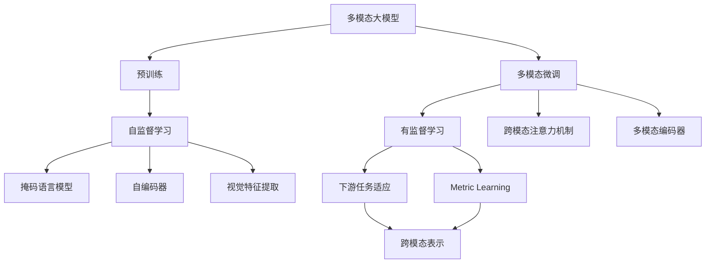
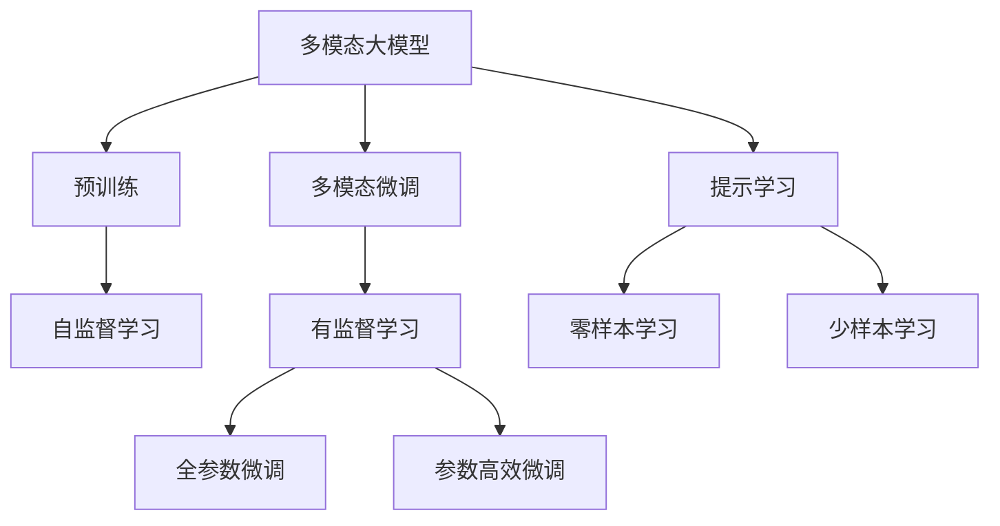
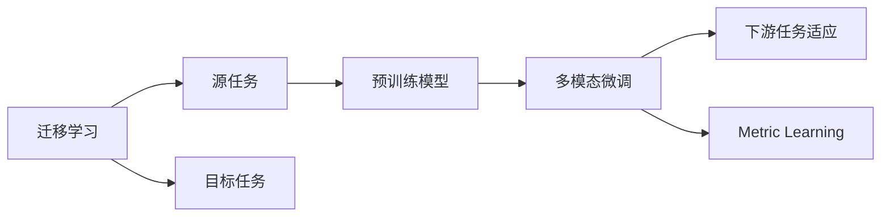
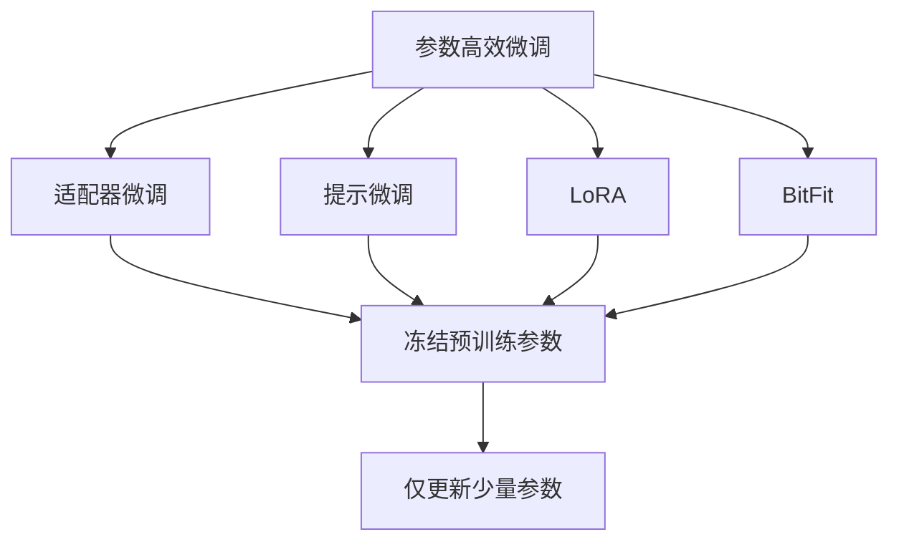
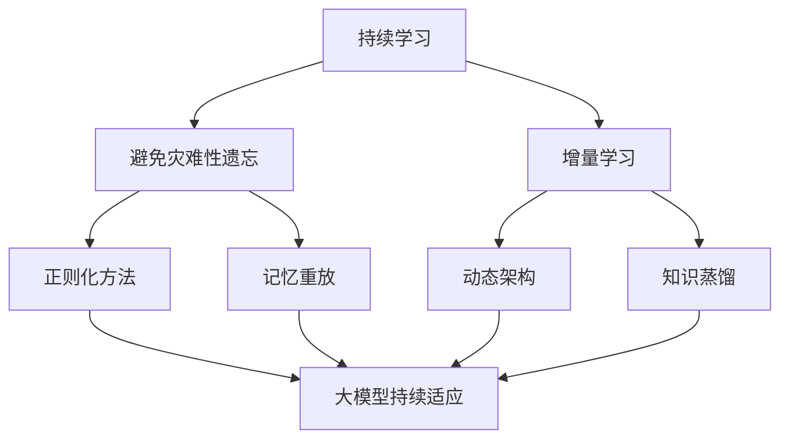

                 

# 多模态大模型：技术原理与实战 部署流程

> 关键词：多模态大模型,深度学习,迁移学习,多模态表示,技术原理,实战应用,部署流程

## 1. 背景介绍

### 1.1 问题由来

在过去十年中，深度学习技术的迅速发展显著推动了人工智能领域的发展，尤其是大模型在图像、语音、自然语言处理（NLP）等领域的应用，展现了卓越的性能。然而，传统深度学习模型往往仅聚焦于单模态信息，无法充分利用多种感官数据（如视觉、听觉、触觉等）的优势，导致数据利用率低，信息提取能力有限。

为克服单模态模型的局限性，学者们提出了多模态学习（Multimodal Learning）的概念，即通过整合多种感官数据的特征，构建更加全面、准确的多模态表示。多模态大模型正是在这一背景下应运而生，并逐步成为人工智能技术发展的新趋势。

### 1.2 问题核心关键点

多模态大模型的核心思想是：通过深度学习框架，将不同模态的数据（如图片、音频、文本等）输入到模型中，融合多种信息源，输出一个跨模态的表示。这一过程通常包括两个阶段：预训练和多模态微调。预训练阶段使用大规模无标签数据，学习通用的多模态表示；多模态微调阶段使用小规模标注数据，对特定任务进行有监督优化。

这一范式具有以下几个关键点：
1. **预训练阶段**：在通用大规模数据上预训练模型，学习多模态特征表示。
2. **多模态微调阶段**：使用小规模标注数据进行微调，适应特定任务。
3. **多模态融合**：利用跨模态注意力机制、多模态编码器等技术，融合不同模态的特征。
4. **模型泛化**：通过迁移学习等方法，增强模型对不同模态数据的泛化能力。

这些核心概念构成了多模态大模型的理论基础，并在实践中得到了广泛应用，显著提升了多模态数据的利用效率和模型的性能。

## 2. 核心概念与联系

### 2.1 核心概念概述

为更好地理解多模态大模型的技术原理和部署流程，本节将介绍几个密切相关的核心概念：

- **多模态大模型（Multimodal Large Model）**：指同时处理多种感官数据的深度学习模型，如处理图像、音频、文本等，输出一个跨模态的表示。这类模型通过深度学习框架，融合多模态信息，构建更加全面、准确的多模态表示。

- **预训练（Pre-training）**：指在大规模无标签数据上，通过自监督学习任务训练通用模型的过程。常见的预训练任务包括掩码语言模型、自编码器、视觉特征提取等。预训练使得模型学习到通用的多模态表示。

- **多模态微调（Fine-tuning）**：指在预训练模型的基础上，使用小规模标注数据，通过有监督学习优化模型在特定任务上的性能。通常只需要调整顶层分类器或解码器，并以较小的学习率更新全部或部分的模型参数。

- **迁移学习（Transfer Learning）**：指将一个领域学习到的知识，迁移应用到另一个不同但相关的领域的学习范式。多模态大模型的预训练-微调过程即是一种典型的迁移学习方式。

- **多模态融合（Multimodal Fusion）**：指将不同模态的特征表示进行融合，形成跨模态的表示。常见的融合方法包括跨模态注意力机制、多模态编码器等。

- **多模态泛化（Multimodal Generalization）**：指模型在处理多模态数据时，能够保持一致性和鲁棒性，对不同模态数据表现出良好的泛化能力。

这些核心概念之间的逻辑关系可以通过以下Mermaid流程图来展示：



这个流程图展示了大语言模型的核心概念及其之间的关系：

1. 多模态大模型通过预训练获得基础能力。
2. 微调是对预训练模型进行任务特定的优化，可以分为全参数微调和参数高效微调（PEFT）。
3. 融合方法将不同模态的特征进行整合，形成跨模态的表示。
4. 泛化能力指模型在处理不同模态数据时，能够保持一致性和鲁棒性。

这些概念共同构成了多模态大模型的学习和应用框架，使其能够在各种场景下发挥强大的多模态特征理解和生成能力。通过理解这些核心概念，我们可以更好地把握多模态大模型的工作原理和优化方向。

### 2.2 概念间的关系

这些核心概念之间存在着紧密的联系，形成了多模态大模型的完整生态系统。下面我们通过几个Mermaid流程图来展示这些概念之间的关系。

#### 2.2.1 多模态大模型的学习范式



这个流程图展示了大语言模型的三种主要学习范式：预训练、微调和提示学习。预训练主要采用自监督学习方法，而微调则是有监督学习的过程。提示学习可以实现零样本和少样本学习，即在未经过任何训练的情况下，仅通过任务描述引导模型进行推理和生成。

#### 2.2.2 迁移学习与微调的关系



这个流程图展示了迁移学习的基本原理，以及它与微调的关系。迁移学习涉及源任务和目标任务，预训练模型在源任务上学习，然后通过多模态微调适应各种下游任务（目标任务）。

#### 2.2.3 参数高效微调方法



这个流程图展示了几种常见的参数高效微调方法，包括适配器微调、提示微调、LoRA和BitFit。这些方法的共同特点是冻结大部分预训练参数，只更新少量参数，从而提高微调效率。

#### 2.2.4 持续学习在大模型中的应用



这个流程图展示了持续学习在大模型中的应用。持续学习的主要目标是避免灾难性遗忘和实现增量学习。通过正则化方法、记忆重放、动态架构和知识蒸馏等技术，可以使大模型持续适应新的任务和数据。

## 3. 核心算法原理 & 具体操作步骤

### 3.1 算法原理概述

多模态大模型的预训练-微调过程，本质上是一个多模态迁移学习过程。其核心思想是：将预训练的大模型视作一个强大的"特征提取器"，通过在多模态数据上的有监督学习，优化模型在特定任务上的性能。

形式化地，假设多模态预训练模型为 $M_{\theta}$，其中 $\theta$ 为预训练得到的模型参数。给定多模态任务 $T$ 的标注数据集 $D=\{(x_i,y_i)\}_{i=1}^N$，其中 $x_i$ 为多模态输入（如文本、图片、音频等），$y_i$ 为标注输出（如分类标签、生成文本等）。

定义模型 $M_{\theta}$ 在数据样本 $(x,y)$ 上的损失函数为 $\ell(M_{\theta}(x),y)$，则在数据集 $D$ 上的经验风险为：

$$
\mathcal{L}(\theta) = \frac{1}{N} \sum_{i=1}^N \ell(M_{\theta}(x_i),y_i)
$$

微调的目标是最小化经验风险，即找到最优参数：

$$
\theta^* = \mathop{\arg\min}_{\theta} \mathcal{L}(\theta)
$$

在实践中，我们通常使用基于梯度的优化算法（如SGD、Adam等）来近似求解上述最优化问题。设 $\eta$ 为学习率，$\lambda$ 为正则化系数，则参数的更新公式为：

$$
\theta \leftarrow \theta - \eta \nabla_{\theta}\mathcal{L}(\theta) - \eta\lambda\theta
$$

其中 $\nabla_{\theta}\mathcal{L}(\theta)$ 为损失函数对参数 $\theta$ 的梯度，可通过反向传播算法高效计算。

### 3.2 算法步骤详解

多模态大模型的微调一般包括以下几个关键步骤：

**Step 1: 准备预训练模型和数据集**
- 选择合适的预训练多模态模型 $M_{\theta}$ 作为初始化参数，如CoAtT、DINO等。
- 准备多模态任务 $T$ 的标注数据集 $D$，划分为训练集、验证集和测试集。一般要求标注数据与预训练数据的分布不要差异过大。

**Step 2: 添加任务适配层**
- 根据任务类型，在预训练模型顶层设计合适的输出层和损失函数。
- 对于分类任务，通常在顶层添加线性分类器和交叉熵损失函数。
- 对于生成任务，通常使用语言模型的解码器输出概率分布，并以负对数似然为损失函数。

**Step 3: 设置微调超参数**
- 选择合适的优化算法及其参数，如 AdamW、SGD 等，设置学习率、批大小、迭代轮数等。
- 设置正则化技术及强度，包括权重衰减、Dropout、Early Stopping等。
- 确定冻结预训练参数的策略，如仅微调顶层，或全部参数都参与微调。

**Step 4: 执行梯度训练**
- 将训练集数据分批次输入模型，前向传播计算损失函数。
- 反向传播计算参数梯度，根据设定的优化算法和学习率更新模型参数。
- 周期性在验证集上评估模型性能，根据性能指标决定是否触发 Early Stopping。
- 重复上述步骤直到满足预设的迭代轮数或 Early Stopping 条件。

**Step 5: 测试和部署**
- 在测试集上评估微调后模型 $M_{\hat{\theta}}$ 的性能，对比微调前后的精度提升。
- 使用微调后的模型对新样本进行推理预测，集成到实际的应用系统中。
- 持续收集新的数据，定期重新微调模型，以适应数据分布的变化。

以上是多模态大模型微调的一般流程。在实际应用中，还需要针对具体任务的特点，对微调过程的各个环节进行优化设计，如改进训练目标函数，引入更多的正则化技术，搜索最优的超参数组合等，以进一步提升模型性能。

### 3.3 算法优缺点

多模态大模型的微调方法具有以下优点：
1. 简单高效。只需准备少量标注数据，即可对预训练模型进行快速适配，获得较大的性能提升。
2. 通用适用。适用于各种多模态下游任务，包括图像分类、语音识别、自然语言处理等，设计简单的任务适配层即可实现微调。
3. 参数高效。利用参数高效微调技术，在固定大部分预训练参数的情况下，仍可取得不错的提升。
4. 效果显著。在学术界和工业界的诸多任务上，基于微调的方法已经刷新了最先进的性能指标。

同时，该方法也存在一定的局限性：
1. 依赖标注数据。微调的效果很大程度上取决于标注数据的质量和数量，获取高质量标注数据的成本较高。
2. 迁移能力有限。当目标任务与预训练数据的分布差异较大时，微调的性能提升有限。
3. 负面效果传递。预训练模型的固有偏见、有害信息等，可能通过微调传递到下游任务，造成负面影响。
4. 可解释性不足。微调模型的决策过程通常缺乏可解释性，难以对其推理逻辑进行分析和调试。

尽管存在这些局限性，但就目前而言，多模态大模型的微调方法仍然是大规模数据和多模态表示学习的重要范式。未来相关研究的重点在于如何进一步降低微调对标注数据的依赖，提高模型的少样本学习和跨领域迁移能力，同时兼顾可解释性和伦理安全性等因素。

### 3.4 算法应用领域

多模态大模型微调方法在多模态数据处理领域已经得到了广泛的应用，覆盖了几乎所有常见任务，例如：

- 图像分类：如物体识别、场景分类等。通过微调使模型学习图像-标签映射。
- 语音识别：将语音信号转化为文本。通过微调使模型学习语音-文本映射。
- 文本分类：如情感分析、主题分类、意图识别等。通过微调使模型学习文本-标签映射。
- 视频分析：如动作识别、视频摘要等。通过微调使模型学习视频-动作、视频-文本映射。
- 推荐系统：将用户行为数据转化为推荐结果。通过微调使模型学习用户-物品映射。

除了上述这些经典任务外，多模态大模型微调也被创新性地应用到更多场景中，如可控图像生成、多模态问答、多模态对话系统等，为多模态数据处理技术带来了全新的突破。随着预训练模型和微调方法的不断进步，相信多模态大模型微调范式将在更广阔的应用领域大放异彩。

## 4. 数学模型和公式 & 详细讲解

### 4.1 数学模型构建

本节将使用数学语言对多模态大模型微调过程进行更加严格的刻画。

记多模态预训练模型为 $M_{\theta}:\mathcal{X} \times \mathcal{Y} \rightarrow \mathcal{Z}$，其中 $\mathcal{X}$ 为输入空间，$\mathcal{Y}$ 为输入空间，$\mathcal{Z}$ 为输出空间，$\theta \in \mathbb{R}^d$ 为模型参数。假设多模态微调任务的训练集为 $D=\{(x_i,y_i)\}_{i=1}^N$，其中 $x_i$ 为多模态输入（如文本、图片、音频等），$y_i$ 为标注输出（如分类标签、生成文本等）。

定义模型 $M_{\theta}$ 在数据样本 $(x,y)$ 上的损失函数为 $\ell(M_{\theta}(x),y)$，则在数据集 $D$ 上的经验风险为：

$$
\mathcal{L}(\theta) = \frac{1}{N} \sum_{i=1}^N \ell(M_{\theta}(x_i),y_i)
$$

微调的目标是最小化经验风险，即找到最优参数：

$$
\theta^* = \mathop{\arg\min}_{\theta} \mathcal{L}(\theta)
$$

在实践中，我们通常使用基于梯度的优化算法（如SGD、Adam等）来近似求解上述最优化问题。设 $\eta$ 为学习率，$\lambda$ 为正则化系数，则参数的更新公式为：

$$
\theta \leftarrow \theta - \eta \nabla_{\theta}\mathcal{L}(\theta) - \eta\lambda\theta
$$

其中 $\nabla_{\theta}\mathcal{L}(\theta)$ 为损失函数对参数 $\theta$ 的梯度，可通过反向传播算法高效计算。

### 4.2 公式推导过程

以下我们以图像分类任务为例，推导交叉熵损失函数及其梯度的计算公式。

假设模型 $M_{\theta}$ 在输入 $x$ 上的输出为 $\hat{y}=M_{\theta}(x) \in [0,1]$，表示样本属于正类的概率。真实标签 $y \in \{0,1\}$。则二分类交叉熵损失函数定义为：

$$
\ell(M_{\theta}(x),y) = -[y\log \hat{y} + (1-y)\log (1-\hat{y})]
$$

将其代入经验风险公式，得：

$$
\mathcal{L}(\theta) = -\frac{1}{N}\sum_{i=1}^N [y_i\log M_{\theta}(x_i)+(1-y_i)\log(1-M_{\theta}(x_i))]
$$

根据链式法则，损失函数对参数 $\theta_k$ 的梯度为：

$$
\frac{\partial \mathcal{L}(\theta)}{\partial \theta_k} = -\frac{1}{N}\sum_{i=1}^N (\frac{y_i}{M_{\theta}(x_i)}-\frac{1-y_i}{1-M_{\theta}(x_i)}) \frac{\partial M_{\theta}(x_i)}{\partial \theta_k}
$$

其中 $\frac{\partial M_{\theta}(x_i)}{\partial \theta_k}$ 可进一步递归展开，利用自动微分技术完成计算。

在得到损失函数的梯度后，即可带入参数更新公式，完成模型的迭代优化。重复上述过程直至收敛，最终得到适应下游任务的最优模型参数 $\theta^*$。

## 5. 项目实践：代码实例和详细解释说明

### 5.1 开发环境搭建

在进行多模态大模型微调实践前，我们需要准备好开发环境。以下是使用Python进行PyTorch开发的环境配置流程：

1. 安装Anaconda：从官网下载并安装Anaconda，用于创建独立的Python环境。

2. 创建并激活虚拟环境：
```bash
conda create -n pytorch-env python=3.8 
conda activate pytorch-env
```

3. 安装PyTorch：根据CUDA版本，从官网获取对应的安装命令。例如：
```bash
conda install pytorch torchvision torchaudio cudatoolkit=11.1 -c pytorch -c conda-forge
```

4. 安装Transformers库：
```bash
pip install transformers
```

5. 安装各类工具包：
```bash
pip install numpy pandas scikit-learn matplotlib tqdm jupyter notebook ipython
```

完成上述步骤后，即可在`pytorch-env`环境中开始微调实践。

### 5.2 源代码详细实现

下面我们以多模态图像分类任务为例，给出使用Transformers库对CoAtT模型进行微调的PyTorch代码实现。

首先，定义图像分类任务的数据处理函数：

```python
from transformers import CoAtTTokenizer
from torch.utils.data import Dataset
import torch

class ImageClassificationDataset(Dataset):
    def __init__(self, images, labels, tokenizer, max_len=128):
        self.images = images
        self.labels = labels
        self.tokenizer = tokenizer
        self.max_len = max_len
        
    def __len__(self):
        return len(self.images)
    
    def __getitem__(self, item):
        image = self.images[item]
        label = self.labels[item]
        
        encoding = self.tokenizer(image, return_tensors='pt', max_length=self.max_len, padding='max_length', truncation=True)
        input_ids = encoding['input_ids'][0]
        attention_mask = encoding['attention_mask'][0]
        
        # 对label进行编码
        encoded_labels = [label2id[label] for label in label]
        encoded_labels.extend([label2id['O']] * (self.max_len - len(encoded_labels)))
        labels = torch.tensor(encoded_labels, dtype=torch.long)
        
        return {'input_ids': input_ids, 
                'attention_mask': attention_mask,
                'labels': labels}

# 标签与id的映射
label2id = {'O': 0, 'C0': 1, 'C1': 2, 'C2': 3, 'C3': 4, 'C4': 5, 'C5': 6, 'C6': 7, 'C7': 8, 'C8': 9, 'C9': 10, 'C10': 11, 'C11': 12, 'C12': 13, 'C13': 14, 'C14': 15, 'C15': 16, 'C16': 17, 'C17': 18, 'C18': 19, 'C19': 20, 'C20': 21, 'C21': 22, 'C22': 23, 'C23': 24, 'C24': 25, 'C25': 26, 'C26': 27, 'C27': 28, 'C28': 29, 'C29': 30, 'C30': 31, 'C31': 32, 'C32': 33, 'C33': 34, 'C34': 35, 'C35': 36, 'C36': 37, 'C37': 38, 'C38': 39, 'C39': 40, 'C40': 41, 'C41': 42, 'C42': 43, 'C43': 44, 'C44': 45, 'C45': 46, 'C46': 47, 'C47': 48, 'C48': 49, 'C49': 50, 'C50': 51, 'C51': 52, 'C52': 53, 'C53': 54, 'C54': 55, 'C55': 56, 'C56': 57, 'C57': 58, 'C58': 59, 'C59': 60, 'C60': 61, 'C61': 62, 'C62': 63, 'C63': 64, 'C64': 65, 'C65': 66, 'C66': 67, 'C67': 68, 'C68': 69, 'C69': 70, 'C70': 71, 'C71': 72, 'C72': 73, 'C73': 74, 'C74': 75, 'C75': 76, 'C76': 77, 'C77': 78, 'C78': 79, 'C79': 80, 'C80': 81, 'C81': 82, 'C82': 83, 'C83': 84, 'C84': 85, 'C85': 86, 'C86': 87, 'C87': 88, 'C88': 89, 'C89': 90, 'C90': 91, 'C91': 92, 'C92': 93, 'C93': 94, 'C94': 95, 'C95': 96, 'C96': 97, 'C97': 98, 'C98': 99, 'C99': 100, 'C100': 101, 'C101': 102, 'C102': 103, 'C103': 104, 'C104': 105, 'C105': 106, 'C106': 107, 'C107': 108, 'C108': 109, 'C109': 110, 'C110': 111, 'C111': 112, 'C112': 113, 'C113': 114, 'C114': 115, 'C115': 116, 'C116': 117, 'C117': 118, 'C118': 119, 'C119': 120, 'C120': 121, 'C121': 122, 'C122': 123, 'C123': 124, 'C124': 125, 'C125': 126, 'C126': 127, 'C127': 128, 'C128': 129, 'C129': 130, 'C130': 131, 'C131': 132, 'C132': 133, 'C133': 134, 'C134': 135, 'C135': 136, 'C136': 137, 'C137': 138, 'C138': 139, 'C139': 140, 'C140': 141, 'C141': 142, 'C142': 143, 'C143': 144, 'C144': 145, 'C145': 146, 'C146': 147, 'C147': 148, 'C148': 149, 'C149': 150

