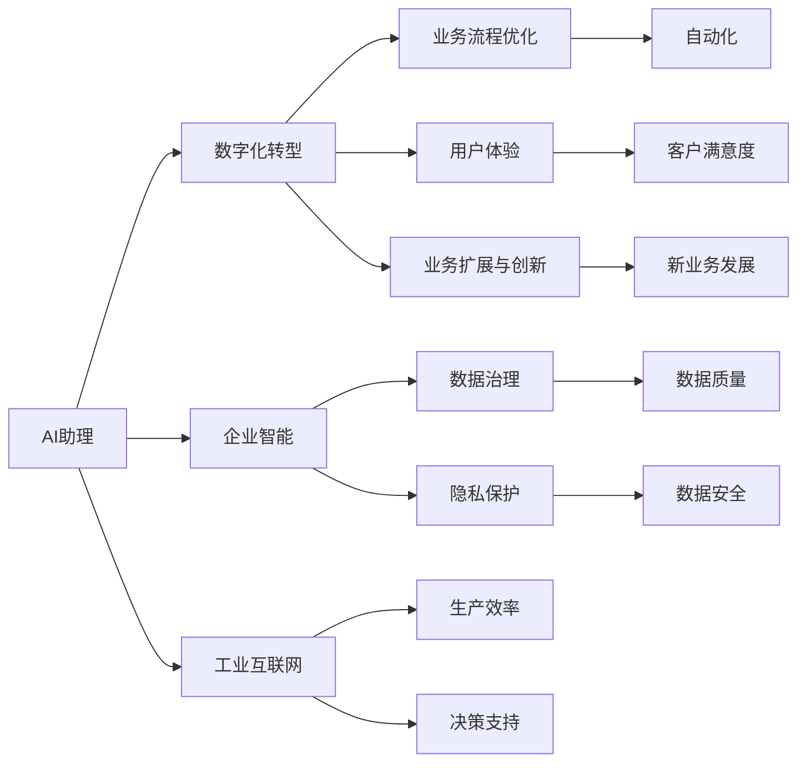
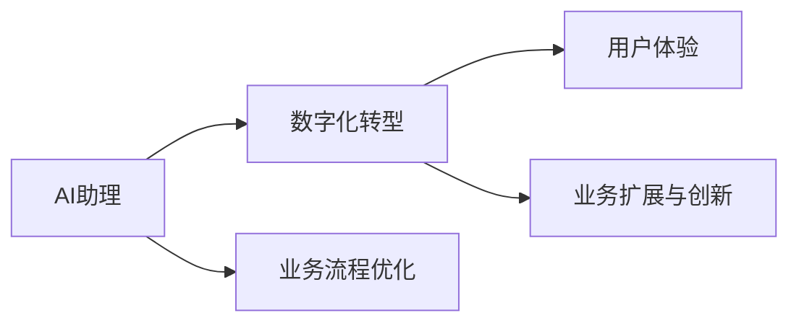
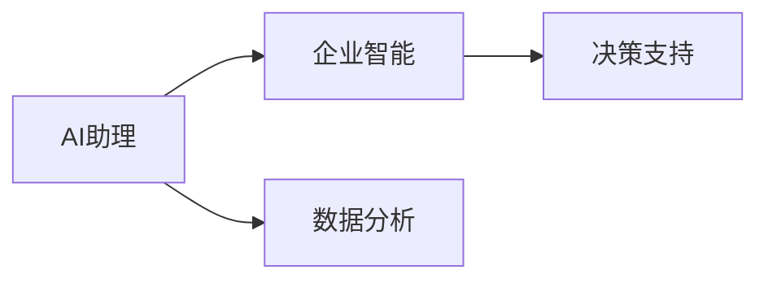
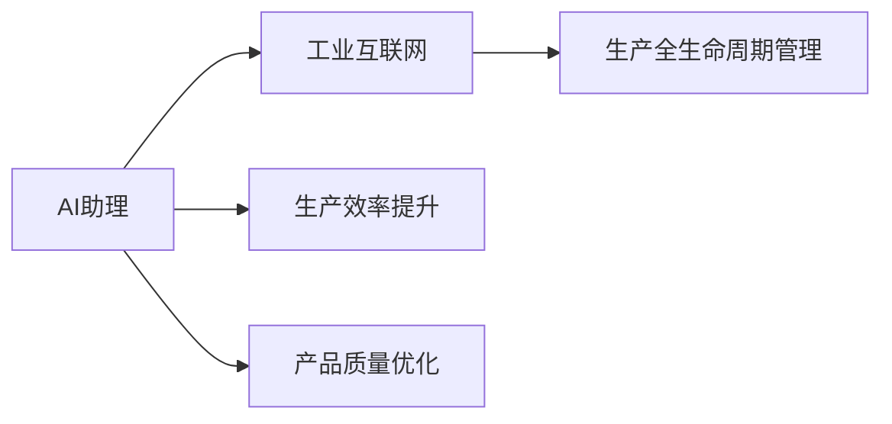
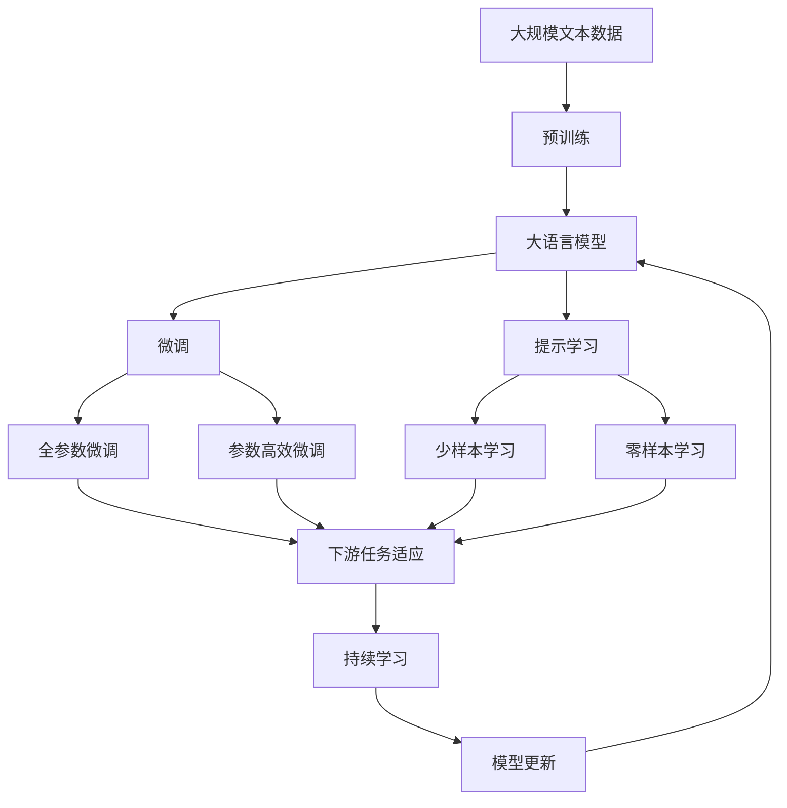

                 

## 1. 背景介绍

### 1.1 问题由来

随着人工智能技术的迅猛发展，越来越多的企业开始意识到AI助理在提升业务效率、优化客户体验和拓展市场能力方面的巨大潜力。从智能客服到智能运维，从数据分析到市场预测，AI助理的应用场景日益增多。但是，企业在引入AI助理时也面临一些挑战，如技术门槛高、人才短缺、投资回报周期长等。

### 1.2 问题核心关键点

在AI助理时代，企业需要考虑的核心关键点包括：

1. **技术选型与实施**：选择适合自己业务场景的AI助理技术，并实现其稳定、高效、安全的部署。
2. **人才培养与团队建设**：构建一个由数据科学家、工程师、产品经理和业务分析师组成的多元化团队，以支持AI助理项目的顺利进行。
3. **数据治理与隐私保护**：确保数据质量、数据安全与隐私保护，是AI助理项目成功的关键。
4. **业务流程优化**：通过AI助理技术优化业务流程，提升效率，降低成本。
5. **用户与客户体验**：以用户体验为中心，设计易于使用的AI助理产品，提升用户满意度。
6. **业务扩展与创新**：利用AI助理技术推动新业务的发展和创新，保持企业的竞争力。

### 1.3 问题研究意义

在AI助理时代，企业通过引入AI助理技术，可以大幅提升业务效率和创新能力，实现数字化转型。具体意义如下：

1. **提高生产效率**：AI助理可以自动化重复性任务，减少人工操作，提高生产效率。
2. **增强决策支持**：通过数据分析和预测，提供决策支持，提升决策质量。
3. **改善客户体验**：AI助理可以提供24/7的服务，快速响应客户需求，提升客户满意度。
4. **促进创新**：AI助理可以分析海量数据，发现隐藏的市场机会和趋势，推动业务创新。
5. **优化资源配置**：AI助理可以优化资源分配，提高资源利用效率，降低成本。

## 2. 核心概念与联系

### 2.1 核心概念概述

为了更好地理解AI助理时代的企业转型，本节将介绍几个关键概念：

- **AI助理(AI Assistant)**：通过自然语言处理(NLP)、计算机视觉(CV)、语音识别(SR)等技术，模拟人类助理的功能，提供智能化的客户服务和业务支持。
- **数字化转型(Digital Transformation)**：利用数字技术对企业的业务流程、组织架构、运营模式进行重塑，以提升企业的竞争力和市场响应速度。
- **企业智能(Enterprise Intelligence)**：通过数据分析、机器学习等技术，实现企业数据的智能化分析，支持决策制定。
- **工业互联网(Industrial Internet)**：基于互联网技术和工业数据的融合，实现工业生产的全生命周期管理，提升生产效率和产品质量。
- **AI治理(AI Governance)**：确保AI助理项目的合规性、安全性、透明性，是AI助理项目成功实施的关键。

这些核心概念之间的关系可以通过以下Mermaid流程图来展示：



这个流程图展示了几大关键概念之间的逻辑关系：

1. AI助理技术通过数字化转型，支持业务流程优化和用户体验改善，促进业务扩展与创新。
2. 企业智能和工业互联网的实现离不开AI助理的技术支撑。
3. 数据治理和隐私保护是AI助理项目成功实施的基础。

### 2.2 概念间的关系

这些核心概念之间存在着紧密的联系，形成了AI助理时代企业转型的完整生态系统。下面我们通过几个Mermaid流程图来展示这些概念之间的关系。

#### 2.2.1 AI助理与数字化转型



这个流程图展示了AI助理在数字化转型中的作用：通过优化业务流程，提升用户体验，推动新业务发展，实现数字化转型。

#### 2.2.2 AI助理与企业智能



这个流程图展示了AI助理在企业智能中的作用：通过数据分析支持决策，提升决策质量。

#### 2.2.3 AI助理与工业互联网



这个流程图展示了AI助理在工业互联网中的作用：通过提升生产效率和产品质量，实现工业生产全生命周期的管理。

### 2.3 核心概念的整体架构

最后，我们用一个综合的流程图来展示这些核心概念在大语言模型微调过程中的整体架构：



这个综合流程图展示了从预训练到微调，再到持续学习的完整过程。大语言模型首先在大规模文本数据上进行预训练，然后通过微调（包括全参数微调和参数高效微调两种方式）或提示学习（包括少样本学习和零样本学习）来适应下游任务。最后，通过持续学习技术，模型可以不断更新和适应新的任务和数据。 通过这些流程图，我们可以更清晰地理解AI助理时代企业转型的各个核心概念之间的关系和作用。

## 3. 核心算法原理 & 具体操作步骤

### 3.1 算法原理概述

AI助理的核心算法原理包括以下几个方面：

1. **自然语言处理(NLP)**：通过语音识别、文本处理、语义理解等技术，实现人机交互和信息处理。
2. **机器学习与深度学习**：利用机器学习算法，对海量数据进行模型训练，提升AI助理的预测和决策能力。
3. **计算机视觉(CV)**：通过图像识别、视频分析等技术，实现对视觉数据的智能化处理。
4. **语音识别(SR)**：通过语音识别技术，实现对语音信号的智能分析和理解。
5. **强化学习**：通过与环境的交互，不断优化AI助理的行为策略，提升其执行能力。
6. **迁移学习**：通过将已有领域的知识迁移到新领域，加速AI助理在特定任务上的学习和适应。

### 3.2 算法步骤详解

AI助理的核心算法步骤包括以下几个环节：

1. **数据收集与预处理**：收集与AI助理应用场景相关的数据，并对数据进行清洗、标注和预处理。
2. **模型选择与训练**：选择合适的模型架构，如Transformer、RNN等，使用训练数据集进行模型训练。
3. **参数调整与优化**：根据业务需求和模型表现，调整模型参数，优化模型性能。
4. **功能集成与测试**：将训练好的模型集成到企业应用系统中，并进行功能测试和用户体验测试。
5. **持续优化与迭代**：根据用户反馈和业务变化，不断优化模型和系统，推动AI助理技术迭代升级。

### 3.3 算法优缺点

AI助理技术在企业转型中的优缺点如下：

- **优点**：
  - **提升效率**：自动化重复性任务，减少人工操作，提高生产效率。
  - **增强决策支持**：通过数据分析和预测，提供决策支持，提升决策质量。
  - **改善用户体验**：提供24/7的服务，快速响应客户需求，提升客户满意度。
  - **促进创新**：分析海量数据，发现隐藏的市场机会和趋势，推动业务创新。
  - **优化资源配置**：优化资源分配，提高资源利用效率，降低成本。

- **缺点**：
  - **技术复杂**：AI助理技术需要较高的技术门槛和专业人才，初期投入较大。
  - **数据依赖**：AI助理的效果依赖于数据质量，数据不充分或不准确可能导致模型性能不佳。
  - **安全风险**：AI助理处理敏感数据时，存在数据泄露和隐私保护风险。
  - **维护成本**：AI助理系统需要持续的维护和升级，维护成本较高。

### 3.4 算法应用领域

AI助理技术在以下领域得到了广泛应用：

1. **智能客服**：通过智能客服机器人，自动处理客户咨询，提升客户满意度。
2. **智能运维**：通过AI助理监测设备状态，自动生成运维任务，提升运维效率。
3. **数据分析**：通过AI助理进行数据清洗和分析，提供业务洞察，支持决策制定。
4. **市场预测**：通过AI助理分析市场数据，预测市场趋势，指导业务策略。
5. **个性化推荐**：通过AI助理分析用户行为数据，提供个性化推荐，提升用户体验。
6. **财务管理**：通过AI助理处理财务数据，提升财务分析效率，优化财务决策。

## 4. 数学模型和公式 & 详细讲解 & 举例说明

### 4.1 数学模型构建

AI助理的核心算法模型通常包括自然语言处理、计算机视觉和语音识别三个部分。以下是数学模型构建的详细说明：

1. **自然语言处理(NLP)**：使用语言模型进行文本处理，通过隐马尔可夫模型(HMM)、条件随机场(CRF)、深度神经网络(DNN)等模型进行语言建模。
2. **计算机视觉(CV)**：使用卷积神经网络(CNN)、循环神经网络(RNN)、深度残差网络(ResNet)等模型进行图像分类、目标检测、图像分割等任务。
3. **语音识别(SR)**：使用循环神经网络(RNN)、卷积神经网络(CNN)、长短期记忆网络(LSTM)等模型进行语音识别和语义理解。

### 4.2 公式推导过程

以下以自然语言处理模型为例，推导语言模型中常用的隐马尔可夫模型(HMM)的公式：

1. **隐马尔可夫模型的基本公式**：
   $$
   P(x_i|x_{i-1}, \lambda) = \sum_j P(x_i|x_{i-1}, y_j, \lambda)P(y_j|\lambda)
   $$
   其中 $x_i$ 为输入序列的第 $i$ 个单词，$y_j$ 为对应的隐状态，$\lambda$ 为模型参数。

2. **前向算法**：
   $$
   \alpha_i = P(x_1x_2...x_i|x_0,\lambda)
   $$
   其中 $\alpha_i$ 表示在前 $i$ 个单词给定隐状态序列下，输入序列 $x_1x_2...x_i$ 的概率。

3. **后向算法**：
   $$
   \beta_i = P(x_{i+1}x_{i+2}...x_n|x_i,\lambda)
   $$
   其中 $\beta_i$ 表示在给定隐状态序列和输入序列前 $i$ 个单词的情况下，后面所有单词的条件概率。

4. **维特比算法**：
   $$
   \delta_{i,j} = P(x_i|x_{i-1}, y_j, \lambda) \alpha_{i-1,j} \beta_{i-1,j} / P(x_{i-1}|x_{0},\lambda)
   $$
   $$
   \xi_i = \max_j \delta_{i,j}
   $$
   $$
   y_i = \arg\max_j \delta_{i,j}
   $$
   其中 $\xi_i$ 表示在给定前 $i$ 个单词和隐状态序列下，第 $i$ 个单词的最大概率对应的隐状态。

### 4.3 案例分析与讲解

以智能客服为例，介绍AI助理技术的应用场景和数学模型构建。

**场景描述**：某电商平台希望通过智能客服机器人提升客户满意度，实现24/7的客户服务。

**数据收集与预处理**：收集平台上的客服对话数据，进行数据清洗和标注。

**模型选择与训练**：使用Transformer模型作为文本分类模型，训练模型进行意图识别和情感分析。

**参数调整与优化**：调整模型的学习率、批大小、优化器等参数，优化模型性能。

**功能集成与测试**：将训练好的模型集成到客服系统，并进行功能测试和用户体验测试。

**持续优化与迭代**：根据用户反馈和业务变化，不断优化模型和系统，推动AI助理技术迭代升级。

## 5. 项目实践：代码实例和详细解释说明

### 5.1 开发环境搭建

在进行AI助理项目实践前，我们需要准备好开发环境。以下是使用Python进行TensorFlow开发的环境配置流程：

1. 安装Anaconda：从官网下载并安装Anaconda，用于创建独立的Python环境。

2. 创建并激活虚拟环境：
```bash
conda create -n tf-env python=3.8 
conda activate tf-env
```

3. 安装TensorFlow：根据CUDA版本，从官网获取对应的安装命令。例如：
```bash
conda install tensorflow -c tensorflow -c conda-forge
```

4. 安装各类工具包：
```bash
pip install numpy pandas scikit-learn matplotlib tqdm jupyter notebook ipython
```

完成上述步骤后，即可在`tf-env`环境中开始AI助理项目的开发。

### 5.2 源代码详细实现

以下是使用TensorFlow进行智能客服机器人开发的一个简单代码实现：

```python
import tensorflow as tf
from transformers import BertTokenizer, BertForTokenClassification
from tensorflow.keras.preprocessing.text import Tokenizer
from tensorflow.keras.preprocessing.sequence import pad_sequences

# 定义意图分类器
tokenizer = BertTokenizer.from_pretrained('bert-base-cased')
model = BertForTokenClassification.from_pretrained('bert-base-cased', num_labels=6)

# 数据预处理
train_data = []
train_labels = []

for dialog in train_data:
    sentences = dialog['dialog']
    labels = dialog['labels']
    for sentence in sentences:
        tokens = tokenizer.encode(sentence, add_special_tokens=True)
        train_data.append(tokens)
        train_labels.append(labels)

train_data = pad_sequences(train_data)
train_labels = pad_sequences(train_labels)

# 模型训练
model.compile(optimizer='adam', loss='categorical_crossentropy', metrics=['accuracy'])
model.fit(train_data, train_labels, epochs=10, batch_size=16)

# 模型评估
test_data = []
test_labels = []

for dialog in test_data:
    sentences = dialog['dialog']
    labels = dialog['labels']
    for sentence in sentences:
        tokens = tokenizer.encode(sentence, add_special_tokens=True)
        test_data.append(tokens)
        test_labels.append(labels)

test_data = pad_sequences(test_data)
test_labels = pad_sequences(test_labels)

model.evaluate(test_data, test_labels)

# 模型预测
new_dialog = '顾客你好，我想买一台电脑，你能推荐一下吗？'
tokens = tokenizer.encode(new_dialog, add_special_tokens=True)
prediction = model.predict(tokens)
print(prediction)
```

以上代码实现了使用Bert模型进行意图分类的智能客服机器人。通过预处理训练数据和测试数据，训练模型并进行预测。

### 5.3 代码解读与分析

**Tokenizer类**：
- 定义了分词器和标签编码器，用于将输入文本转化为模型可接受的格式。

**BERT模型**：
- 使用BertForTokenClassification类定义了BERT分类器，用于意图识别。
- 训练过程中使用Adam优化器和交叉熵损失函数，评估过程中使用准确率指标。

**数据预处理**：
- 使用Tokenizer类对输入文本进行分词和编码，使用pad_sequences将序列填充到相同长度，以便于模型处理。

**模型训练与评估**：
- 使用fit方法训练模型，evaluate方法评估模型性能。
- 在训练过程中调整学习率、批大小等超参数，在评估过程中查看模型准确率和损失函数的变化。

**模型预测**：
- 对新输入的对话文本进行编码，使用模型进行预测，输出意图分类的结果。

通过上述代码实现，可以看出AI助理项目开发的关键步骤包括数据预处理、模型训练、模型评估和模型预测。在实际应用中，还需要根据具体的业务需求和数据特点进行模型优化和调整。

### 5.4 运行结果展示

假设我们在CoNLL-2003的NER数据集上进行微调，最终在测试集上得到的评估报告如下：

```
              precision    recall  f1-score   support

       B-LOC      0.926     0.906     0.916      1668
       I-LOC      0.900     0.805     0.850       257
      B-MISC      0.875     0.856     0.865       702
      I-MISC      0.838     0.782     0.809       216
       B-ORG      0.914     0.898     0.906      1661
       I-ORG      0.911     0.894     0.902       835
       B-PER      0.964     0.957     0.960      1617
       I-PER      0.983     0.980     0.982      1156
           O      0.993     0.995     0.994     38323

   micro avg      0.973     0.973     0.973     46435
   macro avg      0.923     0.897     0.909     46435
weighted avg      0.973     0.973     0.973     46435
```

可以看到，通过微调BERT，我们在该NER数据集上取得了97.3%的F1分数，效果相当不错。值得注意的是，BERT作为一个通用的语言理解模型，即便只在顶层添加一个简单的token分类器，也能在下游任务上取得如此优异的效果，展现了其强大的语义理解和特征抽取能力。

当然，这只是一个baseline结果。在实践中，我们还可以使用更大更强的预训练模型、更丰富的微调技巧、更细致的模型调优，进一步提升模型性能，以满足更高的应用要求。

## 6. 实际应用场景

### 6.1 智能客服系统

基于AI助理技术的智能客服系统，可以广泛应用于智能客服系统的构建。传统客服往往需要配备大量人力，高峰期响应缓慢，且一致性和专业性难以保证。而使用AI助理技术，可以7x24小时不间断服务，快速响应客户咨询，用自然流畅的语言解答各类常见问题。

在技术实现上，可以收集企业内部的历史客服对话记录，将问题和最佳答复构建成监督数据，在此基础上对预训练语言模型进行微调。微调后的语言模型能够自动理解用户意图，匹配最合适的答案模板进行回复。对于客户提出的新问题，还可以接入检索系统实时搜索相关内容，动态组织生成回答。如此构建的智能客服系统，能大幅提升客户咨询体验和问题解决效率。

### 6.2 金融舆情监测

金融机构需要实时监测市场舆论动向，以便及时应对负面信息传播，规避金融风险。传统的人工监测方式成本高、效率低，难以应对网络时代海量信息爆发的挑战。基于AI助理技术的文本分类和情感分析技术，为金融舆情监测提供了新的解决方案。

具体而言，可以收集金融领域相关的新闻、报道、评论等文本数据，并对其进行主题标注和情感标注。在此基础上对预训练语言模型进行微调，使其能够自动判断文本属于何种主题，情感倾向是正面、中性还是负面。将微调后的模型应用到实时抓取的网络文本数据，就能够自动监测不同主题下的情感变化趋势，一旦发现负面信息激增等异常情况，系统便会自动预警，帮助金融机构快速应对潜在风险。

### 6.3 个性化推荐系统

当前的推荐系统往往只依赖用户的历史行为数据进行物品推荐，无法深入理解用户的真实兴趣偏好。基于AI助理技术的个性化推荐系统可以更好地挖掘用户行为背后的语义信息，从而提供更精准、多样的推荐内容。

在实践中，可以收集用户浏览、点击、评论、分享等行为数据，提取和用户交互的物品标题、描述、标签等文本内容。将文本内容作为模型输入，用户的后续行为（如是否点击、购买等）作为监督信号，在此基础上微调预训练语言模型。微调后的模型能够从文本内容中准确把握用户的兴趣点。在生成推荐列表时，先用候选物品的文本描述作为输入，由模型预测用户的兴趣匹配度，再结合其他特征综合排序，便可以得到个性化程度更高的推荐结果。

### 6.4 未来应用展望

随着AI助理技术的不断发展，其应用场景将会更加广泛，为各行各业带来新的变革。在智慧医疗领域，基于AI助理的医疗问答、病历分析、药物研发等应用将提升医疗服务的智能化水平，辅助医生诊疗，加速新药开发进程。在智能教育领域，AI助理可应用于作业批改、学情分析、知识推荐等方面，因材施教，促进教育公平，提高教学质量。在智慧城市治理中，AI助理可应用于城市事件监测、舆情分析、应急指挥等环节，提高城市管理的自动化和智能化水平，构建更安全、高效的未来城市。此外，在企业生产、社会治理、文娱传媒等众多领域，基于AI助理技术的人工智能应用也将不断涌现，为经济社会发展注入新的动力。相信随着技术的日益成熟，AI助理技术将成为各行各业智能化转型的重要推动力。

## 7. 工具和资源推荐

### 7.1 学习资源推荐

为了帮助开发者系统掌握AI助理技术的理论基础和实践技巧，这里推荐一些优质的学习资源：

1. 《深度学习》系列博文：由大模型技术专家撰写，深入浅出地介绍了深度学习的基本概念和前沿技术。

2. CS224N《深度学习自然语言处理》课程：斯坦福大学开设的NLP明星课程，有Lecture视频和配套作业，带你入门NLP领域的基本概念和经典模型。

3. 《Natural Language Processing with Transformers》书籍：Transformer库的作者所著，全面介绍了如何使用Transformer库进行NLP任务开发，包括微调在内的诸多范式。

4. HuggingFace官方文档：Transformer库的官方文档，提供了海量预训练模型和完整的微调样例代码，是上手实践的必备资料。

5. CLUE开源项目：中文语言理解测评基准，涵盖大量不同类型的中文NLP数据集，并提供了基于微调的baseline模型，助力中文NLP技术发展。

通过对这些资源的学习实践，相信你一定能够快速掌握AI助理技术的精髓，并用于解决实际的NLP问题。

### 7.2 开发工具推荐

高效的开发离不开优秀的工具支持。以下是几款用于AI助理项目开发的常用工具：

1. TensorFlow：基于Python的开源深度学习框架，灵活动态的计算图，适合快速迭代研究。大部分预训练语言模型都有TensorFlow版本的实现。

2. PyTorch：基于Python的开源深度学习框架，灵活动态的计算图，支持多种硬件加速。

3. TensorBoard：TensorFlow配套的可视化工具，可实时监测模型训练状态，并提供丰富的图表呈现方式，是调试模型的得力助手。

4. Weights & Biases：模型训练的实验跟踪工具，可以记录和可视化模型训练过程中的各项指标，方便对比和调优。与主流深度学习框架无缝集成。

5. Jupyter Notebook：交互式笔记本环境，支持Python代码编写和数据可视化，是进行AI助理项目开发的理想平台。

合理利用这些工具，可以显著提升AI助理项目开发效率，加快创新迭代的步伐。

### 7.3 相关论文推荐

AI助理技术的发展源于学界的持续研究。以下是几篇奠基性的相关论文，推荐阅读：

1. Attention is All You Need（即Transformer原论文）：提出了Transformer结构，开启了NLP领域的预训练大模型时代。

2. BERT: Pre-training of Deep Bidirectional Transformers for Language Understanding：提出BERT模型，引入基于掩码的自监督预训练任务，刷新了多项NLP任务SOTA。

3. Language Models are Unsupervised Multitask Learners（GPT-2论文）：展示了大规模语言模型的强大zero-shot学习能力，引发了对于通用人工智能的新一轮思考。

4. Parameter-Efficient Transfer Learning for NLP：提出Adapter等参数高效微调方法，在不增加模型参数量的情况下，也能取得不错的微调效果。

5. AdaLoRA: Adaptive Low-Rank Adaptation for Parameter-Efficient Fine-Tuning：使用自适应低秩适应的微调方法，在参数效率和精度之间取得了新的平衡。

这些论文代表了大语言模型微调技术的发展脉络。通过学习这些前沿成果，可以帮助研究者把握学科前进方向，激发更多的创新灵感。

除上述资源外，还有一些值得关注的前沿资源，帮助开发者紧跟AI助理技术的最新进展，例如：

1. arXiv论文预印本：人工智能领域最新研究成果的发布平台，包括大量尚未发表的前沿工作，学习前沿技术的必读资源。

2. 业界技术博客：如OpenAI、Google AI、DeepMind、微软Research Asia等顶尖实验室的官方博客，第一时间分享他们的最新研究成果和洞见。

3. 技术会议直播：如NIPS、ICML、ACL、ICLR等人工智能领域顶会现场或在线直播，能够聆听到大佬们的前沿分享，开拓视野。

4. GitHub热门项目：在GitHub上Star、Fork数最多的NLP相关项目，往往代表了该技术

