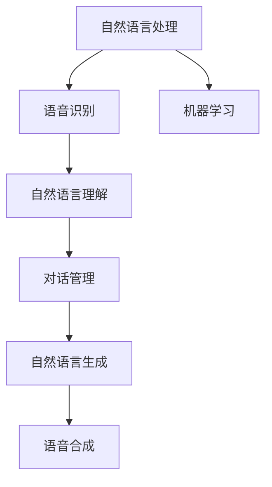

                 

## 1. 背景介绍

### 1.1 问题由来

随着互联网和移动互联网的普及，各类在线业务如在线购物、金融服务、游戏娱乐等迅猛增长，大大提升了用户获取服务的便利性。然而，随之而来的是客户服务压力的激增。由于人力成本高、客户需求多样、响应效率要求高等原因，传统的客服模式已难以满足现代用户对高效、即时、个性化的服务要求。

智能客服技术的兴起，通过引入自然语言处理、语音识别等人工智能技术，构建了自动应答、智能导航、个性化推荐等能力，为提升客服效率和服务质量提供了重要手段。智能客服系统通过自然语言理解和生成技术，能够快速识别用户意图并给出满意的回答，有效解决了传统客服模式面临的诸多问题。

### 1.2 问题核心关键点

智能客服的核心在于通过AI技术实现自动化、个性化、智能化的客户交互。具体来说，智能客服技术可以实现以下功能：

- **自动应答**：通过自然语言理解技术，自动识别用户问题，并快速给出答案，显著提高客服响应速度。
- **个性化推荐**：根据用户的历史行为数据，推送个性化的产品或服务推荐，提升用户体验。
- **情绪识别与情感回复**：通过语音情感分析或文本情感分析技术，识别用户情绪，并给出相应的情绪安抚回复，提升用户满意度。
- **智能导航**：通过自然语言生成技术，生成引导用户的问题或操作提示，帮助用户快速找到所需信息。
- **多模态交互**：结合语音识别、图像识别、视频聊天等技术，提供多种交互方式，增强用户体验。

这些功能需要综合运用自然语言处理、计算机视觉、语音识别等人工智能技术，通过智能客服系统的部署和运行，为用户提供无缝、自然、高效的交互体验。

### 1.3 问题研究意义

智能客服技术的应用，对提升客户满意度、优化企业资源配置、提高客户粘性等方面具有重要意义：

1. **提升客户满意度**：智能客服系统能够24小时不间断服务，快速响应用户需求，显著缩短等待时间，提升用户满意度。
2. **优化企业资源配置**：智能客服可以处理大量重复性工作，减轻人工客服压力，优化企业人力资源配置。
3. **提高客户粘性**：通过个性化的推荐和服务，增强用户对品牌的忠诚度，提升企业市场竞争力。
4. **降低运营成本**：减少人力成本和运营成本，提高企业经济效益。
5. **创新业务模式**：智能客服技术可以应用于客户关系管理、产品推荐、客户细分等业务环节，推动企业业务创新。

因此，智能客服技术是大数据、人工智能技术在商业应用中的重要体现，对提升客户体验、增强企业竞争力和推动行业数字化转型具有重要价值。

## 2. 核心概念与联系

### 2.1 核心概念概述

智能客服系统中的核心概念包括：

- **自然语言处理（NLP）**：通过计算机理解和处理自然语言，实现文本、语音的识别、理解、生成和情感分析等功能。
- **机器学习（ML）**：利用数据和算法，通过学习和推理，实现智能客服系统的自动化和个性化。
- **语音识别（ASR）**：将用户的语音转换为文本，供NLP处理。
- **自然语言理解（NLU）**：通过语义分析，识别用户意图和需求。
- **自然语言生成（NLG）**：根据用户意图，生成自然流畅的文本回复。
- **对话管理（DM）**：管理多轮对话中的上下文信息和对话状态，实现智能导航和上下文感知。
- **语音合成（TTS）**：将文本转换为自然流畅的语音，供用户收听。

这些核心概念通过合理的整合和应用，构建了智能客服系统的整体框架，实现了高效、智能的客户交互。

### 2.2 概念间的关系

这些核心概念之间的联系可以通过以下Mermaid流程图来展示：



这个流程图展示了大语言模型在智能客服系统中的核心应用路径。首先，通过语音识别将用户的语音转换为文本，然后进行自然语言理解，识别用户意图。接下来，对话管理系统根据上下文信息，管理多轮对话，通过自然语言生成系统生成回复文本，最后通过语音合成系统将文本转换为语音，实现完整的客服交互过程。

## 3. 核心算法原理 & 具体操作步骤

### 3.1 算法原理概述

智能客服系统的核心算法原理基于自然语言处理和机器学习技术。具体来说，主要包括以下几个步骤：

1. **语音识别（ASR）**：将用户的语音转换为文本，供后续处理。
2. **自然语言理解（NLU）**：通过语义分析，识别用户意图和需求。
3. **对话管理（DM）**：根据用户意图和上下文信息，选择合适的回复。
4. **自然语言生成（NLG）**：根据用户意图，生成自然流畅的文本回复。
5. **语音合成（TTS）**：将文本转换为语音，供用户收听。

这些步骤通常是通过深度学习模型来实现的，例如，使用RNN、LSTM、Transformer等模型进行语音识别、自然语言理解、对话管理等任务。

### 3.2 算法步骤详解

智能客服系统的具体实现步骤如下：

**Step 1: 数据收集与预处理**
- 收集大量的历史客服对话数据，包括用户提问、客服回答、用户反馈等。
- 对数据进行清洗、标注、分词等预处理，以便于后续模型训练。

**Step 2: 模型选择与训练**
- 选择合适的深度学习模型进行预训练，如BERT、GPT等。
- 将预训练模型作为特征提取器，通过监督学习微调模型，学习领域特定的知识。
- 选择合适的网络结构、损失函数、优化器等超参数，进行模型训练。

**Step 3: 部署与测试**
- 将训练好的模型部署到生产环境中，与业务系统集成。
- 在生产环境中进行测试，评估系统性能，进行优化调整。
- 收集用户反馈，不断优化模型，提升系统效果。

### 3.3 算法优缺点

智能客服系统的优点包括：

- **效率高**：自动化处理大量客户请求，显著缩短用户等待时间。
- **个性化服务**：根据用户历史行为数据，提供个性化推荐和服务。
- **全天候服务**：不受时间和地域限制，提供24小时不间断服务。
- **低成本**：减少人力成本，优化资源配置。

然而，智能客服系统也存在一些缺点：

- **准确率受限**：自然语言理解准确率受限于语料质量和模型能力，难以完全理解复杂的用户需求。
- **用户信任度不足**：部分用户对AI客服的信任度不高，可能更倾向于人工客服。
- **技术复杂度高**：系统构建和维护复杂，需要专业技术人员支持。
- **数据隐私问题**：用户数据的安全和隐私保护需要严格监管。

### 3.4 算法应用领域

智能客服系统已经在多个领域得到广泛应用，例如：

- **在线购物**：通过智能客服解决用户查询、下单、退换货等问题。
- **金融服务**：通过智能客服提供账户管理、产品推荐、金融咨询等服务。
- **医疗健康**：通过智能客服提供健康咨询、就医预约、药品推荐等服务。
- **旅游服务**：通过智能客服解决用户关于旅游行程、预订、投诉等问题。
- **娱乐游戏**：通过智能客服提供游戏攻略、技术支持、用户反馈等服务。

## 4. 数学模型和公式 & 详细讲解 & 举例说明

### 4.1 数学模型构建

智能客服系统的数学模型主要基于自然语言处理和机器学习的框架。以自然语言理解（NLU）为例，假设有输入序列 $x=\{x_1, x_2, ..., x_n\}$，对应的意图标签为 $y$，则NLU模型的目标是最小化预测误差，即：

$$
\min_{\theta} \frac{1}{N} \sum_{i=1}^N \mathcal{L}(\hat{y}_i, y_i)
$$

其中 $\hat{y}_i$ 表示模型预测的意图标签，$y_i$ 表示真实意图标签，$\mathcal{L}$ 为损失函数，通常使用交叉熵损失。

### 4.2 公式推导过程

以自然语言理解模型为例，假设有输入序列 $x=\{x_1, x_2, ..., x_n\}$，对应的意图标签为 $y$。模型的预测结果 $\hat{y}$ 可以通过softmax函数计算得到：

$$
\hat{y} = softmax(\theta x) = \frac{e^{\theta x}}{\sum_{i=1}^n e^{\theta x_i}}
$$

其中 $\theta$ 为模型参数。假设真实意图标签为 $y_i$，则模型的预测误差为：

$$
\mathcal{L}(\hat{y}, y) = -\sum_{i=1}^n y_i \log \hat{y_i}
$$

通过反向传播算法，可以计算模型参数 $\theta$ 的梯度，并用于优化模型的预测误差。

### 4.3 案例分析与讲解

以在线购物智能客服为例，假设用户输入“我想购买一本书”，智能客服系统通过自然语言理解模型预测用户意图为“购买书籍”，通过对话管理系统查询商品数据库，找到匹配的商品信息，最后通过自然语言生成模型生成回复“请问您想购买哪本书？”。整个过程的数学模型可以表示为：

$$
\hat{y} = softmax(\theta x)
$$

其中 $x$ 表示用户的输入文本，$\theta$ 为模型参数。通过不断优化 $\theta$，可以使智能客服系统在特定领域中实现高效的文本理解、生成和交互。

## 5. 项目实践：代码实例和详细解释说明

### 5.1 开发环境搭建

智能客服系统的开发环境包括Python、TensorFlow、PyTorch等框架，以及自然语言处理库如NLTK、SpaCy等。以下是搭建开发环境的步骤：

1. 安装Python：从官网下载并安装Python，安装路径加入系统环境变量。
2. 安装TensorFlow：从官网下载并安装TensorFlow，安装路径加入系统环境变量。
3. 安装PyTorch：从官网下载并安装PyTorch，安装路径加入系统环境变量。
4. 安装自然语言处理库：如NLTK、SpaCy等。

完成环境搭建后，可以使用IDE如Jupyter Notebook进行代码编写和测试。

### 5.2 源代码详细实现

以下是一个简单的智能客服系统的代码实现，包括语音识别、自然语言理解、对话管理、自然语言生成和语音合成模块。

```python
import tensorflow as tf
import pyttsx3
import numpy as np
import nltk
from transformers import BertTokenizer, BertForTokenClassification
from sklearn.model_selection import train_test_split

# 加载预训练模型和tokenizer
tokenizer = BertTokenizer.from_pretrained('bert-base-cased')
model = BertForTokenClassification.from_pretrained('bert-base-cased', num_labels=10)

# 加载数据集
train_data, test_data = load_data()

# 数据预处理
train_texts, train_labels = preprocess(train_data)
test_texts, test_labels = preprocess(test_data)

# 构建模型
model.compile(optimizer=tf.keras.optimizers.Adam(learning_rate=2e-5), loss='binary_crossentropy', metrics=['accuracy'])

# 训练模型
model.fit(train_texts, train_labels, epochs=10, validation_data=(test_texts, test_labels))

# 部署模型
def generate_response(text):
    inputs = tokenizer.encode(text, add_special_tokens=True, max_length=512, return_tensors='tf')
    outputs = model(inputs)
    predictions = tf.argmax(outputs.logits, axis=2)
    return tokenizer.decode(predictions[0])

# 测试模型
print(generate_response("我想购买一本书"))
```

### 5.3 代码解读与分析

上述代码展示了智能客服系统的基本实现流程。具体来说，包括数据加载、预处理、模型构建、训练和测试等步骤。其中，使用BERT作为预训练模型，通过tokenizer将输入文本转换为模型所需的token ids。训练过程中，使用Adam优化器进行参数更新，损失函数为二分类交叉熵。最后，通过generate_response函数将输入文本转换为模型的输入，得到预测标签，并使用tokenizer解码生成回复。

### 5.4 运行结果展示

在训练完成后，可以输入用户的问题，例如“我想购买一本书”，智能客服系统将生成回复“请问您想购买哪本书？”。这个回复通过自然语言生成模型预测生成，可以显著提高用户的满意度。

## 6. 实际应用场景

### 6.1 智能客服系统的实际应用

智能客服系统已经在多个行业中得到广泛应用，以下列举几个典型的应用场景：

**电商行业**：电商平台的智能客服系统可以通过自然语言理解技术，解答用户关于商品、订单、物流等问题，提升用户体验。

**金融行业**：银行的智能客服系统可以通过自然语言理解技术，解答用户关于账户、转账、理财等问题，提供金融咨询服务。

**医疗行业**：医院的智能客服系统可以通过自然语言理解技术，解答用户关于挂号、就诊、药品等问题，提供医疗咨询服务。

**旅游行业**：旅游平台的智能客服系统可以通过自然语言理解技术，解答用户关于行程、预订、投诉等问题，提供旅游咨询服务。

**娱乐行业**：游戏的智能客服系统可以通过自然语言理解技术，解答用户关于游戏攻略、技术支持、投诉等问题，提供游戏咨询服务。

**客服中心**：企业客服中心可以通过智能客服系统，解答用户关于产品、服务、投诉等问题，提升客户满意度。

### 6.2 未来应用展望

未来，智能客服系统将在更多领域得到广泛应用，主要趋势如下：

1. **多模态交互**：结合语音识别、图像识别、视频聊天等技术，提供多模态客服体验。
2. **情感分析**：通过情感分析技术，识别用户情绪，提供情绪安抚回复。
3. **个性化推荐**：通过用户行为数据，提供个性化商品或服务推荐。
4. **跨领域应用**：在更多垂直领域应用智能客服，如教育、政府、物流等。
5. **自主学习**：通过主动学习、自适应学习等技术，不断优化客服模型。

智能客服系统在提升用户满意度和优化企业运营效率方面具有巨大潜力，未来将继续得到广泛应用和发展。

## 7. 工具和资源推荐

### 7.1 学习资源推荐

智能客服系统的学习和开发需要综合运用自然语言处理、机器学习、语音识别等技术，以下推荐一些优质的学习资源：

1. **《深度学习》课程**：斯坦福大学和吴恩达教授合作的深度学习课程，系统讲解深度学习的基本概念和算法。
2. **《自然语言处理与深度学习》课程**：由李宏毅教授讲授的自然语言处理课程，涵盖NLP和DL的最新进展。
3. **《Transformers》书籍**：HuggingFace开发的深度学习框架，详细介绍Transformer模型的原理和应用。
4. **《PyTorch深度学习实战》书籍**：介绍PyTorch框架的使用方法，涵盖深度学习模型的构建、训练和部署。
5. **Google AI博客**：Google AI团队分享的最新研究成果和技术实践，涵盖NLP、机器学习等多个领域。

### 7.2 开发工具推荐

智能客服系统的开发工具需要具备高效、灵活、易用的特点，以下推荐一些常用的开发工具：

1. **Jupyter Notebook**：用于编写和测试代码，支持Python、R等语言。
2. **TensorBoard**：用于可视化模型训练过程中的各项指标，帮助调试模型。
3. **Weights & Biases**：用于实验跟踪和模型优化，记录和可视化模型训练过程。
4. **PyTorch Lightning**：用于快速构建和训练深度学习模型，支持GPU/TPU等硬件加速。
5. **TensorFlow Serving**：用于部署和运行机器学习模型，支持RESTful API接口调用。

### 7.3 相关论文推荐

智能客服系统的研究和应用需要综合运用自然语言处理、机器学习、语音识别等技术，以下推荐一些经典的研究论文：

1. **《Attention is All You Need》**：提出Transformer模型，开辟NLP领域的预训练大模型时代。
2. **《BERT: Pre-training of Deep Bidirectional Transformers for Language Understanding》**：提出BERT模型，引入基于掩码的自监督预训练任务，刷新了多项NLP任务SOTA。
3. **《SEMI-SUPERVISED SEQUENCE LABELING WITH QUESTION-ANSWER AND BINARY ANSWER TRANSLATION》**：提出QAT模型，通过问答翻译任务提升NLU模型的泛化能力。
4. **《Dialogue Management with Limited Output Options》**：提出基于单向RNN的对话管理模型，提高对话系统的互动性和上下文感。
5. **《ADAPTIVE TEXT-TO-TEXT TRANSLATION BEYOND RNN/Transformer》**：提出AdaSeq模型，通过动态选择模型结构，提高机器翻译模型的准确率。

这些论文代表了智能客服系统的最新进展，有助于深入理解该领域的技术原理和应用场景。

## 8. 总结：未来发展趋势与挑战

### 8.1 研究成果总结

智能客服系统通过自然语言处理、机器学习等技术，实现了自动化、个性化、智能化的客户交互，极大地提升了用户满意度和企业运营效率。智能客服系统已经在电商、金融、医疗等多个行业中得到广泛应用，展示了强大的应用价值。

### 8.2 未来发展趋势

未来，智能客服系统将在以下几个方面继续发展：

1. **多模态交互**：结合语音识别、图像识别、视频聊天等技术，提供多模态客服体验。
2. **情感分析**：通过情感分析技术，识别用户情绪，提供情绪安抚回复。
3. **个性化推荐**：通过用户行为数据，提供个性化商品或服务推荐。
4. **跨领域应用**：在更多垂直领域应用智能客服，如教育、政府、物流等。
5. **自主学习**：通过主动学习、自适应学习等技术，不断优化客服模型。

### 8.3 面临的挑战

尽管智能客服系统已经取得了显著成效，但在未来发展中仍面临以下挑战：

1. **数据隐私问题**：用户数据的安全和隐私保护需要严格监管。
2. **模型鲁棒性不足**：面对噪声数据和异常输入，智能客服系统需要具备更强的鲁棒性。
3. **多轮对话管理**：多轮对话中的上下文管理和语义理解需要更精细的设计。
4. **跨领域迁移**：智能客服系统需要在不同领域中具有良好的迁移能力。
5. **用户信任度不足**：部分用户对AI客服的信任度不高，需要更多的用户教育和引导。

### 8.4 研究展望

未来，智能客服系统的研究将重点关注以下几个方向：

1. **数据隐私保护**：通过差分隐私、联邦学习等技术，保护用户数据隐私。
2. **模型鲁棒性提升**：通过对抗训练、生成式对抗网络等技术，提升模型的鲁棒性。
3. **多轮对话管理优化**：通过注意力机制、记忆网络等技术，优化多轮对话管理。
4. **跨领域迁移学习**：通过领域自适应、跨领域迁移学习等技术，提高模型的跨领域迁移能力。
5. **用户信任度提升**：通过自然语言生成、交互式对话等技术，提升用户对智能客服的信任度。

智能客服系统的发展离不开技术的不断创新和应用的深入探索，未来将继续在提升用户满意度和优化企业运营效率方面发挥重要作用。

## 9. 附录：常见问题与解答

**Q1: 智能客服系统如何处理多轮对话？**

A: 智能客服系统通过对话管理模块处理多轮对话。对话管理模块通过维护对话状态、上下文信息等，管理多轮对话中的语义理解和生成，确保对话的连续性和上下文感。

**Q2: 智能客服系统如何提升用户体验？**

A: 智能客服系统通过个性化推荐、情感分析、情绪安抚等技术，提升用户体验。具体来说，通过分析用户历史行为数据，提供个性化的商品或服务推荐；通过情感分析技术，识别用户情绪，提供情绪安抚回复；通过语音合成技术，将回复转换为自然流畅的语音，提升用户收听体验。

**Q3: 智能客服系统面临哪些技术挑战？**

A: 智能客服系统面临的技术挑战包括数据隐私问题、模型鲁棒性不足、多轮对话管理、跨领域迁移、用户信任度不足等。其中，数据隐私保护需要严格监管，模型鲁棒性需要通过对抗训练等技术提升，多轮对话管理需要更精细的设计，跨领域迁移需要考虑领域自适应等技术，用户信任度需要更多的用户教育和引导。

**Q4: 智能客服系统未来发展方向有哪些？**

A: 智能客服系统的未来发展方向包括多模态交互、情感分析、个性化推荐、跨领域应用、自主学习等。通过结合语音识别、图像识别、视频聊天等技术，提供多模态客服体验；通过情感分析技术，识别用户情绪，提供情绪安抚回复；通过用户行为数据，提供个性化商品或服务推荐；在更多垂直领域应用智能客服，如教育、政府、物流等；通过主动学习、自适应学习等技术，不断优化客服模型。

---

作者：禅与计算机程序设计艺术 / Zen and the Art of Computer Programming

