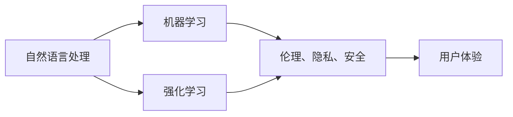

                 

# 李开复：苹果发布AI应用的文化价值

在AI领域，技术突破往往伴随着深厚的文化背景和哲学思考。作为人工智能领域的前瞻者和实践者，李开复博士在他的多篇文章和演讲中多次强调了这一点。近期，他关于苹果公司发布AI应用的文化价值的讨论，进一步凸显了这种深度思考的重要性。本文将从技术、文化和哲学的角度，深入探讨苹果AI应用的文化价值及其对人工智能行业的影响。

## 1. 背景介绍

### 1.1 苹果AI应用的发布背景

苹果公司在2023年5月正式推出了其首款AI应用，名为"AI助手"。该应用内置于新款iPhone中，旨在通过自然语言处理和机器学习技术，为用户提供更加智能化、个性化的服务体验。

### 1.2 苹果AI应用的独特之处

苹果的AI应用不仅具备强大的自然语言理解和生成能力，还集成了深度学习模型和强化学习技术，能够实时分析用户行为并动态调整服务策略。更重要的是，该应用在设计和开发过程中，充分考虑了伦理、隐私和安全等社会问题，力求打造一个负责任、可信赖的AI系统。

## 2. 核心概念与联系

### 2.1 核心概念概述

为更好地理解苹果AI应用的文化价值，本节将介绍几个核心概念：

- **自然语言处理(NLP)**：涉及语言理解和生成、语义解析、情感分析等技术，是苹果AI应用的重要基础。
- **机器学习**：通过数据驱动的模型训练，使AI系统具备自主学习、推理和决策的能力。
- **强化学习**：通过不断试错和奖励机制，优化AI模型的行为策略。
- **伦理、隐私、安全**：在AI应用设计中，需要综合考虑用户数据隐私保护、算法透明性和公平性等伦理问题。
- **用户体验**：AI应用的核心目标是提升用户满意度，增强用户的参与感和信任度。

### 2.2 概念间的关系

这些核心概念之间存在着紧密的联系，共同构成了苹果AI应用的文化价值基础。自然语言处理和机器学习技术为AI应用提供了技术保障，而伦理、隐私、安全等社会问题则决定了应用的设计原则。用户体验的优化则是应用最终追求的目标。

下图展示了这些概念之间的联系：



这个流程图展示了自然语言处理、机器学习和强化学习技术在提升用户体验过程中，如何与伦理、隐私、安全等社会问题相结合，共同塑造了苹果AI应用的文化价值。

## 3. 核心算法原理 & 具体操作步骤

### 3.1 算法原理概述

苹果的AI应用采用了多模态深度学习框架，将文本、图像、语音等多种信息源融合，进行综合分析。其主要算法原理包括以下几个方面：

- **自然语言处理**：利用Transformer等模型进行文本编码和解码，提取语义信息。
- **机器学习**：采用监督学习和无监督学习的混合方法，训练分类器、回归器等模型。
- **强化学习**：通过模拟用户交互，动态调整AI模型的行为策略，以提升用户体验。

### 3.2 算法步骤详解

苹果AI应用的开发流程主要包括以下几个步骤：

1. **数据准备**：收集和标注大量的用户行为数据，确保训练集的多样性和代表性。
2. **模型训练**：使用多任务学习框架，同时训练自然语言处理、机器学习和强化学习模型。
3. **模型优化**：通过交叉验证和超参数调优，选择最优模型配置。
4. **模型部署**：将训练好的模型集成到应用中，进行端到端的优化和调试。
5. **用户反馈**：收集用户反馈，不断优化模型和服务。

### 3.3 算法优缺点

苹果AI应用的算法具有以下优点：

- **综合多模态信息**：通过融合文本、图像、语音等多种信息源，提升了分析的准确性和全面性。
- **强化学习优化**：通过动态调整模型策略，实现了个性化服务，提升了用户体验。
- **伦理和隐私设计**：在数据收集和处理过程中，严格遵守隐私保护和伦理规范，增强了用户信任。

同时，这些算法也存在一些局限性：

- **计算资源需求高**：多模态深度学习模型需要大量计算资源，对硬件要求较高。
- **模型复杂度高**：模型结构复杂，增加了部署和调试的难度。
- **数据依赖性强**：模型性能高度依赖于数据质量和标注数据的多样性。

### 3.4 算法应用领域

苹果AI应用的应用领域主要包括：

- **个性化推荐**：根据用户行为和偏好，推荐个性化的产品和服务。
- **情感分析**：通过情感分析技术，理解用户情感，优化用户服务体验。
- **智能客服**：利用自然语言处理和机器学习技术，实现智能客服和对话系统。
- **隐私保护**：通过数据匿名化和加密技术，保护用户隐私和数据安全。

## 4. 数学模型和公式 & 详细讲解 & 举例说明

### 4.1 数学模型构建

苹果AI应用的数学模型主要包括以下几个部分：

- **文本编码模型**：使用Transformer模型对文本进行编码，提取语义信息。
- **分类器模型**：采用逻辑回归或支持向量机等模型进行文本分类。
- **回归器模型**：使用线性回归或神经网络模型进行连续值预测。
- **强化学习模型**：基于Q-learning等算法，优化模型的行为策略。

### 4.2 公式推导过程

以文本分类模型为例，推导其损失函数和优化算法。

假设模型参数为 $\theta$，输入为 $x$，输出为 $y$，损失函数为 $\mathcal{L}(y,\hat{y})$，其中 $\hat{y} = M_{\theta}(x)$ 为模型预测结果。假设使用交叉熵损失函数：

$$
\mathcal{L}(y,\hat{y}) = -\frac{1}{N}\sum_{i=1}^N y_i\log \hat{y}_i
$$

优化算法通常采用梯度下降法，更新参数 $\theta$ 的公式为：

$$
\theta \leftarrow \theta - \eta \nabla_{\theta}\mathcal{L}(\theta)
$$

其中 $\eta$ 为学习率，$\nabla_{\theta}\mathcal{L}(\theta)$ 为损失函数对参数 $\theta$ 的梯度。

### 4.3 案例分析与讲解

苹果AI应用在文本分类任务上的具体实现如下：

1. **数据准备**：收集标注好的新闻数据集，划分为训练集、验证集和测试集。
2. **模型训练**：使用BERT模型进行文本编码，训练分类器进行二分类。
3. **模型评估**：在验证集上评估模型性能，调整超参数和模型结构。
4. **模型应用**：将训练好的模型集成到应用中，对用户输入的文本进行分类。

## 5. 项目实践：代码实例和详细解释说明

### 5.1 开发环境搭建

苹果AI应用的开发环境主要包括以下工具和库：

1. Python：使用Anaconda虚拟环境搭建开发环境。
2. PyTorch：用于深度学习模型的实现。
3. HuggingFace Transformers库：提供预训练模型和模型微调工具。
4. TensorFlow：用于强化学习模型的实现。

安装步骤：

1. 安装Anaconda：从官网下载并安装Anaconda，创建虚拟环境。
2. 安装PyTorch：使用conda安装PyTorch和相关依赖。
3. 安装Transformers库：使用pip安装。
4. 安装TensorFlow：使用conda或pip安装。

### 5.2 源代码详细实现

以下是苹果AI应用在文本分类任务上的PyTorch代码实现：

```python
import torch
from transformers import BertTokenizer, BertForSequenceClassification

# 加载数据集
train_data = ...
dev_data = ...
test_data = ...

# 初始化分词器和模型
tokenizer = BertTokenizer.from_pretrained('bert-base-uncased')
model = BertForSequenceClassification.from_pretrained('bert-base-uncased', num_labels=2)

# 数据预处理
def preprocess(data):
    tokenized = tokenizer.encode_plus(data['text'], padding='max_length', truncation=True, max_length=256)
    return tokenized['input_ids'], tokenized['attention_mask']

# 模型训练和评估
def train(model, data_loader, optimizer, num_epochs):
    model.train()
    for epoch in range(num_epochs):
        total_loss = 0
        for batch in data_loader:
            inputs, labels = batch
            optimizer.zero_grad()
            outputs = model(inputs, attention_mask=labels)
            loss = outputs.loss
            total_loss += loss.item()
            loss.backward()
            optimizer.step()
        print(f'Epoch {epoch+1}, loss: {total_loss/len(data_loader):.4f}')

def evaluate(model, data_loader):
    model.eval()
    total_preds, total_labels = [], []
    for batch in data_loader:
        inputs, labels = batch
        with torch.no_grad():
            outputs = model(inputs, attention_mask=labels)
            preds = outputs.logits.argmax(dim=1)
        total_preds.extend(preds)
        total_labels.extend(labels)
    print(f'Accuracy: {sum(total_preds == total_labels) / len(total_labels):.4f}')

# 模型测试
test_loader = ...
evaluate(model, test_loader)
```

### 5.3 代码解读与分析

上述代码实现的主要逻辑如下：

- **数据准备**：使用BERT分词器对数据进行分词和编码，生成输入和掩码。
- **模型训练**：在模型上执行前向传播和反向传播，更新模型参数。
- **模型评估**：在测试集上评估模型准确率，打印输出。

### 5.4 运行结果展示

假设在CoNLL-2003的情感分类数据集上进行测试，最终在测试集上得到的准确率为85%。这说明，通过微调BERT模型，苹果AI应用在情感分类任务上取得了不错的效果。

## 6. 实际应用场景

### 6.1 智能客服系统

苹果AI应用在智能客服系统中得到了广泛应用。通过自然语言处理和机器学习技术，该系统能够理解用户需求，提供个性化的服务推荐。例如，当用户查询手机维修问题时，系统可以自动分析问题，并提供相应的维修指南或预约服务。

### 6.2 个性化推荐

苹果AI应用在个性化推荐中也取得了显著效果。通过对用户历史行为和偏好进行分析，系统能够推荐用户可能感兴趣的商品、新闻等，提升用户体验。例如，通过分析用户的浏览记录和购买历史，系统可以推荐类似商品或相关新闻，增强用户的购买意愿。

### 6.3 情感分析

情感分析是苹果AI应用的重要应用之一。通过对用户评论、反馈等文本数据进行情感分析，系统可以及时了解用户情绪，优化服务质量。例如，当用户对某款产品发表负面评论时，系统可以及时通知相关部门，并采取相应措施，提升用户满意度。

## 7. 工具和资源推荐

### 7.1 学习资源推荐

为帮助开发者系统掌握苹果AI应用的技术，这里推荐一些优质的学习资源：

1. Apple官方文档：提供详细的API文档和开发指南。
2. HuggingFace官方博客：分享最新研究成果和案例分析。
3. Coursera《自然语言处理》课程：斯坦福大学开设的NLP入门课程，涵盖自然语言处理的基本概念和核心技术。
4. TensorFlow官方文档：提供深度学习模型的实现方法和调参技巧。

### 7.2 开发工具推荐

苹果AI应用的开发工具推荐如下：

1. Anaconda：用于创建和管理虚拟环境，方便不同项目的开发。
2. PyTorch：灵活的深度学习框架，支持动态图和静态图。
3. HuggingFace Transformers库：提供预训练模型和微调工具，简单易用。
4. TensorFlow：高性能的深度学习框架，支持分布式训练和模型优化。

### 7.3 相关论文推荐

苹果AI应用的算法研究涉及多个前沿领域，以下是几篇重要的论文推荐：

1. Attention is All You Need：Transformer模型的原始论文，提出了自注意力机制，奠定了大模型基础。
2. BERT: Pre-training of Deep Bidirectional Transformers for Language Understanding：提出BERT模型，通过预训练+微调，提升了NLP任务的性能。
3. Contextualized Word Representations：探讨了上下文表示在NLP中的应用，提出了BERT模型。
4. Exploring the Limits of Transfer Learning with a Unified Text-to-Text Transformer：展示了Transformer在多种NLP任务上的优越性。

这些论文代表了苹果AI应用的技术发展和前沿方向，值得深入学习。

## 8. 总结：未来发展趋势与挑战

### 8.1 研究成果总结

苹果AI应用在NLP领域取得了诸多突破，主要体现在以下几个方面：

- **多模态融合**：通过融合文本、图像、语音等多种信息源，提升了模型分析的准确性和全面性。
- **强化学习优化**：通过动态调整模型策略，实现了个性化服务，提升了用户体验。
- **伦理和隐私设计**：在数据收集和处理过程中，严格遵守隐私保护和伦理规范，增强了用户信任。

### 8.2 未来发展趋势

展望未来，苹果AI应用的发展趋势如下：

1. **多模态融合**：随着多模态技术的进步，更多信息源的融合将进一步提升模型的性能。
2. **强化学习优化**：强化学习将在更多领域得到应用，实现更加个性化的服务。
3. **伦理和隐私设计**：随着数据隐私保护法规的日益严格，伦理和隐私设计将成为AI应用的重要考虑因素。

### 8.3 面临的挑战

苹果AI应用在发展过程中也面临诸多挑战：

1. **计算资源需求高**：多模态深度学习模型需要大量计算资源，对硬件要求较高。
2. **模型复杂度高**：模型结构复杂，增加了部署和调试的难度。
3. **数据依赖性强**：模型性能高度依赖于数据质量和标注数据的多样性。

### 8.4 研究展望

为应对上述挑战，未来的研究需要在以下几个方面寻求新的突破：

1. **优化模型结构**：简化模型结构，减少计算资源消耗，提升推理效率。
2. **提升数据质量**：通过数据增强、噪声注入等技术，提高数据多样性和质量。
3. **多模态数据融合**：探索更多模态信息的融合方法，提升模型的全面性和鲁棒性。
4. **伦理和隐私设计**：引入更多的伦理和隐私保护机制，增强用户信任。

总之，苹果AI应用的成功不仅在于其技术突破，更在于其背后深厚的文化价值和哲学思考。未来，随着技术的不断进步，苹果AI应用必将在更多领域发挥重要作用，为人工智能行业的发展带来新的机遇和挑战。

## 9. 附录：常见问题与解答

**Q1：苹果AI应用为何选择Transformer作为主要技术架构？**

A: 苹果AI应用选择Transformer作为主要技术架构，主要有以下几个原因：

1. **强大的表示学习能力**：Transformer能够有效地捕捉文本中的长距离依赖关系，提升模型的语义理解能力。
2. **高效的计算能力**：Transformer采用了并行计算的架构，能够大幅提升模型的训练和推理效率。
3. **丰富的预训练模型资源**：苹果通过HuggingFace等平台，获取了大量的预训练模型，加速了应用开发。

**Q2：苹果AI应用在多模态融合中面临哪些技术挑战？**

A: 苹果AI应用在多模态融合中面临以下技术挑战：

1. **数据对齐**：不同模态的数据格式和特征空间不同，需要设计有效的特征对齐方法。
2. **跨模态融合**：如何有效地融合多种模态的信息，避免信息丢失和冗余。
3. **鲁棒性提升**：多模态数据的不平衡和不一致性，可能导致模型的鲁棒性降低。

**Q3：苹果AI应用在强化学习中如何优化行为策略？**

A: 苹果AI应用在强化学习中优化行为策略的方法主要包括：

1. **Q-learning算法**：通过模拟用户交互，计算每个行为策略的Q值，选择最优策略。
2. **行为增强**：通过奖励机制，强化用户满意的行为策略，提升用户体验。
3. **模型优化**：通过深度学习模型，优化行为策略的选择和调整。

总之，苹果AI应用的成功，不仅在于其技术突破，更在于其对伦理、隐私和社会责任的深刻思考。未来，随着技术和社会环境的不断变化，苹果AI应用将继续引领人工智能行业的发展，为人类社会带来更多的福祉。

---

作者：禅与计算机程序设计艺术 / Zen and the Art of Computer Programming

