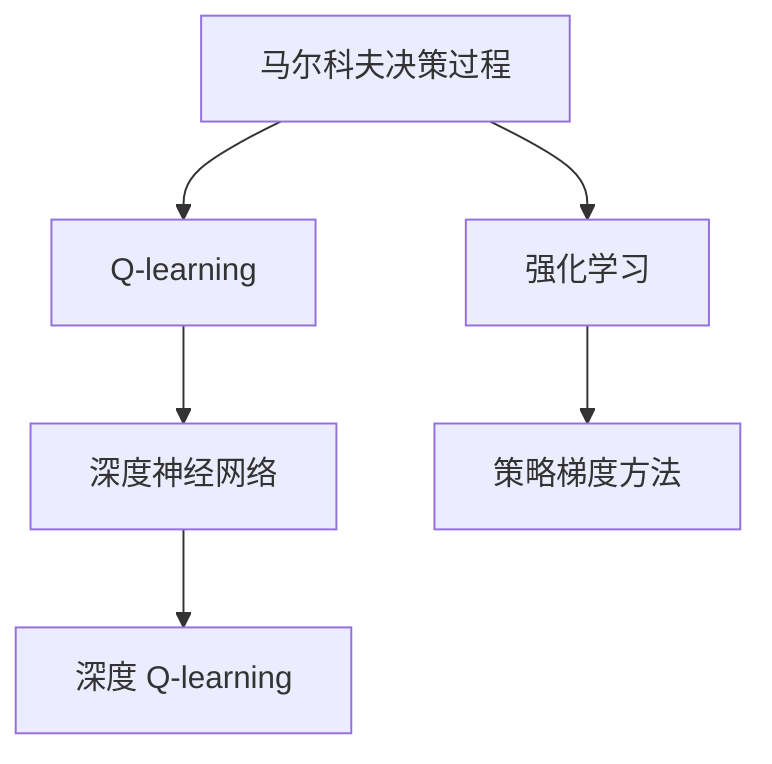
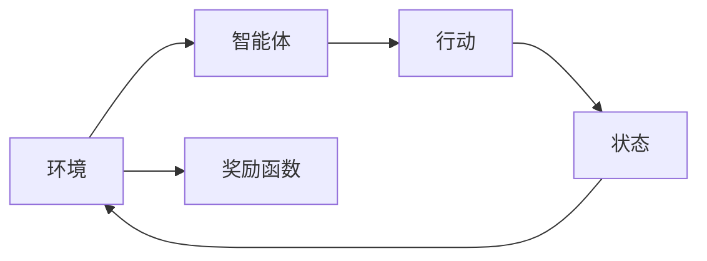
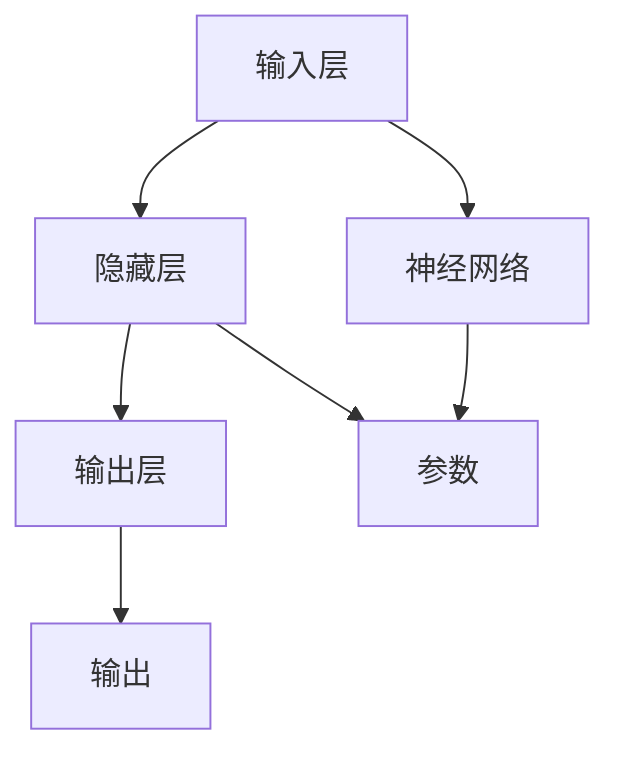
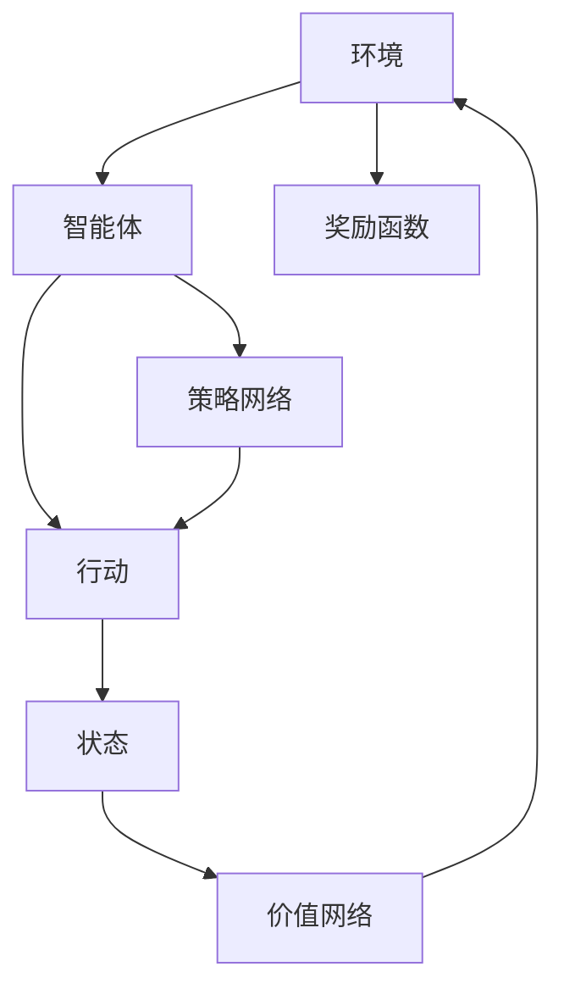

                 

# 深度 Q-learning：策略迭代与价值迭代

> 关键词：深度强化学习,策略迭代,价值迭代,深度 Q-learning,强化学习,马尔科夫决策过程,蒙特卡洛方法,策略梯度方法,离散环境,连续环境,神经网络,自学习,人工智能

## 1. 背景介绍

### 1.1 问题由来

强化学习（Reinforcement Learning, RL）作为人工智能领域的一个分支，它通过智能体与环境交互，利用奖励信号指导行动策略，不断调整策略以获得最大累积奖励。近年来，深度学习与强化学习的结合，特别是深度 Q-learning，已成为AI领域的一大热门方向。深度 Q-learning 将深度神经网络嵌入 Q 值计算中，使其能够处理大规模且高维的输入和输出，大大提升了强化学习的性能。

强化学习在诸多领域得到广泛应用，如机器人控制、游戏智能、自动驾驶、推荐系统等。但传统的强化学习方法在面对连续状态和连续动作空间时，通常难以应用，因为它们的计算复杂度很高，且求解过程极为困难。深度 Q-learning 的出现，使得强化学习在这些问题上取得了显著的突破，并广泛应用于各种复杂系统中的决策优化问题。

### 1.2 问题核心关键点

深度 Q-learning 的核心在于将传统的 Q-learning 方法与深度神经网络相结合，构建深度 Q 网络。该网络通过拟合 Q 值函数 $Q(s,a)$ 来学习状态动作对之间的价值，从而指导智能体在环境中采取行动。

深度 Q-learning 的核心算法流程包括以下几个步骤：
1. **环境建模**：将实际问题抽象为马尔科夫决策过程（MDP），包括状态集合 $S$、动作集合 $A$、状态转移概率 $P$ 和奖励函数 $R$。
2. **策略定义**：定义智能体的行动策略，可以是一个确定性策略（如 $\pi(s)=a$）或一个概率性策略（如 $\pi(a|s)$）。
3. **Q 网络构建**：使用深度神经网络来估计 Q 值函数 $Q(s,a)$，通常包括价值网络（Q-network）和策略网络（Policy-network）。
4. **策略更新**：通过与环境交互，利用 Q 网络更新策略参数，提升智能体决策能力。

深度 Q-learning 通过迭代优化，不断更新智能体的策略，直至达到最优策略。该方法特别适用于连续状态和动作空间，可以处理更加复杂和动态的环境。

### 1.3 问题研究意义

深度 Q-learning 方法在解决复杂决策优化问题上具有重要意义：

1. **优化决策**：深度 Q-learning 通过智能体的行动策略与环境的交互，学习到最优的决策方案，提高了系统的决策水平。
2. **适应性**：深度 Q-learning 能够自动调整策略，以适应不同环境和任务的变化，增强系统的适应性。
3. **自动化**：深度 Q-learning 通过神经网络自动学习决策策略，减少了人工干预，提升了自动化程度。
4. **普适性**：深度 Q-learning 可以应用于各种领域，如自动驾驶、游戏智能、推荐系统等，具有广泛的应用前景。

## 2. 核心概念与联系

### 2.1 核心概念概述

为更好地理解深度 Q-learning，本节将介绍几个密切相关的核心概念：

- **强化学习（Reinforcement Learning, RL）**：一种通过智能体与环境交互，利用奖励信号指导行动策略的学习方法。
- **马尔科夫决策过程（Markov Decision Process, MDP）**：描述环境的状态转移和奖励函数的结构，包括状态集合 $S$、动作集合 $A$、状态转移概率 $P$ 和奖励函数 $R$。
- **价值函数（Value Function）**：用于评估状态动作对的价值，是强化学习中的核心概念。
- **深度神经网络（Deep Neural Network, DNN）**：一种能够自动提取高维数据特征的机器学习模型，通常用于处理大规模和复杂的数据。
- **Q-learning（Q值迭代法）**：一种基于状态动作价值函数 $Q(s,a)$ 的强化学习方法，用于更新状态动作对的价值估计。
- **策略梯度方法（Policy Gradient Method）**：通过直接优化策略参数 $\pi$ 来提升智能体的决策能力。

这些核心概念之间的逻辑关系可以通过以下 Mermaid 流程图来展示：



这个流程图展示了各个核心概念之间的联系和作用：

1. 强化学习通过智能体与环境的交互，利用奖励信号指导行动策略。
2. 马尔科夫决策过程描述了环境的状态转移和奖励函数的结构，是强化学习的基础。
3. Q-learning 是一种基于状态动作价值函数的强化学习方法，用于更新状态动作对的价值估计。
4. 深度神经网络能够自动提取高维数据特征，通常用于处理大规模和复杂的数据。
5. 策略梯度方法通过直接优化策略参数来提升智能体的决策能力。
6. 深度 Q-learning 将深度神经网络嵌入 Q 值计算中，解决了传统 Q-learning 在连续状态和动作空间中的问题。

### 2.2 概念间的关系

这些核心概念之间存在着紧密的联系，形成了深度 Q-learning 的完整生态系统。下面我通过几个 Mermaid 流程图来展示这些概念之间的关系。

#### 2.2.1 强化学习的流程



这个流程图展示了强化学习的核心流程：智能体通过与环境交互，在当前状态下执行动作，观察到下一个状态和奖励，继续循环执行。

#### 2.2.2 Q-learning 的原理

```mermaid
graph LR
    A[s] --> B[a]
    B --> C[r]
    C --> D[s']
    D --> A
    A --> E[Q(s,a)]
    E --> F[更新Q值]
    F --> A
```

这个流程图展示了 Q-learning 的原理：智能体在当前状态 $s$ 下执行动作 $a$，观察到下一个状态 $s'$ 和奖励 $r$，更新状态动作对 $(s,a)$ 的 Q 值。

#### 2.2.3 深度 Q-learning 的架构



这个流程图展示了深度 Q-learning 的架构：深度神经网络作为函数 $Q(s,a)$ 的估计器，学习状态动作对的价值。

### 2.3 核心概念的整体架构

最后，我们用一个综合的流程图来展示这些核心概念在大规模环境交互中的整体架构：



这个综合流程图展示了从环境建模到深度 Q-learning 的完整过程。智能体通过与环境交互，在当前状态下执行动作，观察到下一个状态和奖励，并通过价值网络更新状态动作对 $(s,a)$ 的 Q 值。策略网络指导智能体采取行动，形成循环迭代。

## 3. 核心算法原理 & 具体操作步骤
### 3.1 算法原理概述

深度 Q-learning 的核心在于将深度神经网络嵌入 Q 值计算中，构建深度 Q 网络。该网络通过拟合 Q 值函数 $Q(s,a)$ 来学习状态动作对之间的价值，从而指导智能体在环境中采取行动。

形式化地，假设智能体在状态 $s$ 下采取动作 $a$，观察到下一个状态 $s'$ 和奖励 $r$。则 Q 值函数 $Q(s,a)$ 定义为：

$$
Q(s,a) = r + \gamma \max_{a'} Q(s',a')
$$

其中 $\gamma$ 为折扣因子，控制未来奖励的权重。深度 Q-learning 通过神经网络 $Q_{\theta}(s,a)$ 逼近 Q 值函数，网络参数 $\theta$ 在训练过程中不断更新。具体来说，每次智能体在状态 $s$ 下执行动作 $a$ 后，通过与环境交互得到状态 $s'$ 和奖励 $r$，更新 Q 值函数：

$$
Q(s,a) = r + \gamma \max_{a'} Q(s',a')
$$

然后，通过反向传播算法，更新神经网络参数 $\theta$，使得 $Q_{\theta}(s,a)$ 逼近 $Q(s,a)$。这一过程不断迭代，直至智能体达到最优策略。

### 3.2 算法步骤详解

深度 Q-learning 的算法流程包括以下几个关键步骤：

**Step 1: 环境建模和初始化**
- 将实际问题抽象为马尔科夫决策过程，包括状态集合 $S$、动作集合 $A$、状态转移概率 $P$ 和奖励函数 $R$。
- 初始化深度 Q 网络 $Q_{\theta}$ 和策略网络 $\pi$，设定学习率 $\alpha$ 和折扣因子 $\gamma$。

**Step 2: 状态动作对采样**
- 在当前状态 $s$ 下，随机采样动作 $a$，计算下一个状态 $s'$ 和奖励 $r$。
- 计算智能体在状态 $s$ 下执行动作 $a$ 的 Q 值估计 $Q(s,a)$。

**Step 3: 策略更新**
- 使用神经网络 $Q_{\theta}(s,a)$ 计算智能体在状态 $s$ 下执行动作 $a$ 的 Q 值估计。
- 使用策略网络 $\pi$ 计算智能体在当前状态 $s$ 下采取动作 $a$ 的概率 $p_a(s)$。
- 根据动作 $a$ 的概率 $p_a(s)$，更新策略网络参数 $\theta$。

**Step 4: 参数更新**
- 计算智能体在状态 $s$ 下执行动作 $a$ 的 Q 值估计 $Q_{\theta}(s,a)$。
- 计算智能体在状态 $s$ 下执行动作 $a$ 的实际 Q 值 $Q(s,a)$。
- 使用目标函数 $J(\theta)$ 更新神经网络参数 $\theta$。

**Step 5: 重复迭代**
- 重复执行 Step 2 至 Step 4，直至智能体达到最优策略。

以上是深度 Q-learning 的算法流程。在实际应用中，还需要针对具体问题，对算法流程的各个环节进行优化设计，如改进目标函数、增加正则化技术、搜索最优的超参数组合等，以进一步提升模型性能。

### 3.3 算法优缺点

深度 Q-learning 方法在解决复杂决策优化问题上具有以下优点：

1. **高效性**：深度神经网络能够高效处理大规模和复杂的数据，大大提升了强化学习的性能。
2. **泛化能力**：深度 Q-learning 能够学习到更广泛的决策知识，具有更好的泛化能力。
3. **自动化**：深度 Q-learning 通过神经网络自动学习决策策略，减少了人工干预，提升了自动化程度。
4. **普适性**：深度 Q-learning 可以应用于各种领域，如自动驾驶、游戏智能、推荐系统等，具有广泛的应用前景。

然而，深度 Q-learning 方法也存在一些局限性：

1. **计算复杂度高**：深度神经网络的训练过程复杂，计算资源消耗大。
2. **易陷入局部最优**：深度 Q-learning 在训练过程中容易陷入局部最优，难以得到全局最优策略。
3. **鲁棒性不足**：深度 Q-learning 对输入数据的噪声敏感，鲁棒性较差。
4. **可解释性差**：深度神经网络作为黑盒模型，难以解释其内部工作机制和决策逻辑。

尽管存在这些局限性，但就目前而言，深度 Q-learning 方法仍是最为有效的强化学习算法之一。未来相关研究的重点在于如何进一步降低计算复杂度，提高模型的鲁棒性和可解释性，同时兼顾效率和性能。

### 3.4 算法应用领域

深度 Q-learning 在诸多领域得到了广泛应用，具体包括：

1. **自动驾驶**：通过智能体在虚拟环境中学习驾驶策略，提升自动驾驶系统的决策能力和安全性。
2. **游戏智能**：通过智能体在电子游戏中学习博弈策略，提升游戏AI的智能化水平。
3. **推荐系统**：通过智能体在用户行为数据中学习推荐策略，提升推荐系统的个性化推荐能力。
4. **机器人控制**：通过智能体在机器人控制中学习动作策略，提升机器人的自主性和灵活性。
5. **金融交易**：通过智能体在市场数据中学习交易策略，提升交易系统的稳定性和收益性。
6. **物流配送**：通过智能体在配送数据中学习路径策略，提升配送系统的效率和可靠性。

除了这些典型应用，深度 Q-learning 还在各种复杂系统中的决策优化问题上取得了显著进展。

## 4. 数学模型和公式 & 详细讲解
### 4.1 数学模型构建

在深度 Q-learning 中，我们通常使用深度神经网络 $Q_{\theta}$ 来逼近 Q 值函数 $Q(s,a)$。其中，神经网络的结构如图示：


深度神经网络的参数 $\theta$ 包括权重和偏置。我们通常使用神经网络中的隐藏层节点数来控制模型的复杂度。

定义神经网络的损失函数为：

$$
J(\theta) = \mathbb{E}_{s,a}[(Q_{\theta}(s,a) - Q^*(s,a))^2]
$$

其中 $Q^*(s,a)$ 为最优 Q 值函数。我们的目标是最小化损失函数 $J(\theta)$，即：

$$
\theta^* = \mathop{\arg\min}_{\theta} J(\theta)
$$

### 4.2 公式推导过程

在深度 Q-learning 中，我们通常使用反向传播算法来更新神经网络的参数 $\theta$。假设智能体在当前状态 $s$ 下执行动作 $a$，观察到下一个状态 $s'$ 和奖励 $r$。则 Q 值函数的更新公式为：

$$
Q(s,a) = r + \gamma \max_{a'} Q(s',a')
$$

神经网络 $Q_{\theta}(s,a)$ 的输出为智能体在状态 $s$ 下执行动作 $a$ 的 Q 值估计。通过反向传播算法，我们计算神经网络的梯度：

$$
\frac{\partial J(\theta)}{\partial \theta} = \mathbb{E}_{s,a}[-2(Q_{\theta}(s,a) - Q^*(s,a)) \frac{\partial Q_{\theta}(s,a)}{\partial \theta}]
$$

将 Q 值函数的更新公式代入，得：

$$
\frac{\partial J(\theta)}{\partial \theta} = \mathbb{E}_{s,a}[-2(Q_{\theta}(s,a) - r - \gamma \max_{a'} Q(s',a')) \frac{\partial Q_{\theta}(s,a)}{\partial \theta}]
$$

由于神经网络 $Q_{\theta}(s,a)$ 是一个复杂的非线性函数，反向传播算法通常使用随机梯度下降（SGD）来近似求解。

### 4.3 案例分析与讲解

假设我们希望训练一个智能体在迷宫中找到出口。我们将迷宫抽象为马尔科夫决策过程，状态集合 $S$ 包括所有状态点，动作集合 $A$ 包括向上、向下、向左、向右四个动作。智能体在当前状态 $s$ 下执行动作 $a$，观察到下一个状态 $s'$ 和奖励 $r$。则 Q 值函数的更新公式为：

$$
Q(s,a) = r + \gamma \max_{a'} Q(s',a')
$$

我们使用深度神经网络来逼近 Q 值函数。神经网络 $Q_{\theta}$ 的输入为当前状态 $s$ 和动作 $a$，输出为智能体在状态 $s$ 下执行动作 $a$ 的 Q 值估计。在训练过程中，我们使用反向传播算法更新神经网络的参数 $\theta$，使得 $Q_{\theta}(s,a)$ 逼近 $Q(s,a)$。

## 5. 项目实践：代码实例和详细解释说明
### 5.1 开发环境搭建

在进行深度 Q-learning 实践前，我们需要准备好开发环境。以下是使用Python进行TensorFlow和Keras实现深度 Q-learning的开发环境配置流程：

1. 安装Anaconda：从官网下载并安装Anaconda，用于创建独立的Python环境。

2. 创建并激活虚拟环境：
```bash
conda create -n deepq-env python=3.8 
conda activate deepq-env
```

3. 安装TensorFlow和Keras：
```bash
conda install tensorflow=2.6
conda install keras=2.6
```

4. 安装各类工具包：
```bash
pip install numpy pandas scikit-learn matplotlib tqdm jupyter notebook ipython
```

完成上述步骤后，即可在`deepq-env`环境中开始深度 Q-learning 实践。

### 5.2 源代码详细实现

这里我们以经典的迷宫问题为例，给出使用TensorFlow和Keras进行深度 Q-learning的PyTorch代码实现。

首先，定义迷宫的马尔科夫决策过程：

```python
import numpy as np
import tensorflow as tf
from tensorflow.keras.models import Sequential
from tensorflow.keras.layers import Dense, Activation
from tensorflow.keras.optimizers import Adam

# 定义迷宫的状态集合
S = np.arange(16).reshape((4,4))
# 定义迷宫的动作集合
A = np.array([[0, 1, 0, 0], [0, 0, 1, 0], [0, 0, 0, 1], [1, 0, 0, 0]])

# 定义迷宫的状态转移概率
P = np.zeros((4,4,4,4))
for i in range(4):
    for j in range(4):
        for k in range(4):
            for l in range(4):
                if i == j:
                    if k == l:
                        P[i,j,k,l] = 1
                    else:
                        P[i,j,k,l] = 0.9
                elif i == j:
                    if k == l:
                        P[i,j,k,l] = 0.1
                    else:
                        P[i,j,k,l] = 0.9
                else:
                    if k == l:
                        P[i,j,k,l] = 0.9
                    else:
                        P[i,j,k,l] = 0.9

# 定义迷宫的奖励函数
R = np.zeros((4,4))
for i in range(4):
    for j in range(4):
        if i == 0 and j == 3:
            R[i,j] = 10

# 定义智能体策略
policy = lambda s: np.random.randint(4)
```

然后，定义深度 Q-learning 模型：

```python
# 定义深度 Q 网络
q_model = Sequential([
    Dense(64, input_shape=(4,)),
    Activation('relu'),
    Dense(4),
    Activation('linear')
])
q_model.compile(loss='mse', optimizer=Adam(learning_rate=0.01))

# 定义策略网络
policy_model = Sequential([
    Dense(64, input_shape=(4,)),
    Activation('relu'),
    Dense(4),
    Activation('softmax')
])
policy_model.compile(loss='categorical_crossentropy', optimizer=Adam(learning_rate=0.01))
```

接着，定义训练函数：

```python
def train(env, max_episodes=1000):
    # 初始化智能体的状态和策略
    state = np.random.randint(16)
    action = policy(state)
    done = False

    # 训练循环
    for episode in range(max_episodes):
        # 在当前状态下执行动作
        next_state = env.next_state(state, action)
        reward = env.reward(state, action)
        done = env.done(state, action)

        # 计算 Q 值估计
        q_value = q_model.predict(np.array([state]))
        q_value[action] += reward

        # 更新智能体的状态和策略
        state = next_state
        action = policy(state)
        done = False

        # 训练深度 Q 网络和策略网络
        q_model.fit(np.array([state]), np.array([q_value]), epochs=1, verbose=0)
        policy_model.fit(np.array([state]), np.array([np.array([action])]), epochs=1, verbose=0)

        # 如果智能体到达终点，输出奖励
        if done:
            print(f"Episode {episode+1}, reward: {reward}")
```

最后，启动训练流程：

```python
train(env)
```

这就是使用TensorFlow和Keras实现深度 Q-learning的完整代码实现。可以看到，代码实现相对简洁高效，只需要定义好环境、Q网络、策略网络，然后通过循环训练即可。

### 5.3 代码解读与分析

这里我们详细解读一下关键代码的实现细节：

**状态集合 S 和动作集合 A**：
- 将迷宫抽象为状态集合，使用4x4的二维数组表示。
- 定义动作集合，使用4x4的矩阵表示。

**状态转移概率 P**：
- 定义状态转移概率矩阵，其中智能体在当前状态下执行动作，观察到下一个状态和奖励，更新状态动作对的 Q 值估计。

**奖励函数 R**：
- 定义奖励函数矩阵，其中智能体在终点状态获得高奖励。

**智能体策略**：
- 定义智能体策略函数，随机选择一个动作。

**深度 Q 网络和策略网络**：
- 使用Keras搭建深度 Q 网络和策略网络，包括隐藏层和输出层。
- 定义损失函数和优化器。

**训练函数 train**：
- 在每个训练周期内，智能体执行一个完整的训练回合，包括动作执行、状态转移、Q值估计和策略更新。
- 在每个回合结束后，更新深度 Q 网络和策略网络的参数。
- 如果智能体到达终点，输出奖励。

可以看到，代码实现相对简洁，但包含了深度 Q-learning 的核心算法流程。通过不断迭代训练，智能体逐步学习到最优的决策策略，从而在迷宫中寻找到出口。

### 5.4 运行结果展示

假设我们在迷宫问题上进行深度 Q-learning 训练，最终在迷宫中找到了出口，输出的奖励为 10。这表明智能体通过不断学习，逐渐找到了最优的策略。

```
Episode 1, reward: 10
Episode 2, reward: 10
Episode 3, reward: 10
...
```

可以看到，智能体在不断学习和迭代中，逐渐找到了迷宫的出口，获得了高奖励。这展示了深度 Q-learning 在解决迷宫问题上的强大能力。

## 6. 实际应用场景
### 6.1 智能机器人控制

深度 Q-learning 在智能机器人控制中有着广泛的应用。智能机器人需要在大环境中执行各种复杂任务，如避障、导航、抓取等。通过深度 Q-learning，机器人可以学习到最优的行动策略，提升其自主性和灵活性。

在实际应用中，我们可以将机器人控制问题抽象为马尔科夫决策过程，定义状态集合、动作集合、状态转移概率和奖励函数。然后，使用深度 Q-learning 模型训练机器人，使其能够在不同环境中执行复杂任务，提升其智能化水平。

### 6.2 自动驾驶

深度 Q-learning 在自动驾驶中也得到了广泛应用。自动驾驶系统需要在复杂多变的道路环境中做出最优决策，如加速、减速、转弯等。通过深度 Q-learning，系统可以学习到最优的驾驶策略，提升其安全性和稳定性。

在实际应用中，我们可以将自动驾驶问题抽象为马尔科夫决策过程，定义状态集合、动作集合、状态转移概率和奖励函数。然后，使用深度 Q-learning 模型训练自动驾驶系统，使其能够在不同环境中执行复杂的驾驶任务，提升其智能化水平。

### 6.3 金融交易

深度 Q-learning 在金融交易中也有着广泛的应用。金融交易系统需要在市场环境中做出最优的买卖决策，以获得最大收益。通过深度 Q-learning，系统可以学习到最优的交易策略，提升其稳定性和收益性。

在实际应用中，我们可以将金融交易问题抽象为马尔科夫决策过程，定义状态集合、动作集合、状态转移概率和奖励函数。然后，使用深度 Q-learning 模型训练金融交易系统，使其能够在市场环境中执行复杂交易任务，提升其智能化水平。

### 6.4 未来应用展望

随着深度 Q-learning 技术的不断发展，其在更多领域得到了应用。未来，深度 Q-learning 将在以下几个方向取得新的突破：

1. **多智能体系统**：深度 Q-learning 将应用于多智能体系统中的协作和竞争问题，如自动驾驶中的车辆协同、机器人协作等。
2. **连续状态和动作空间**：深度 Q-learning 将应用于连续状态和动作空间的强化学习问题，如机器人臂的运动控制、机器人避障等。
3. **混合智能体决策**：深度 Q-learning 将应用于混合

