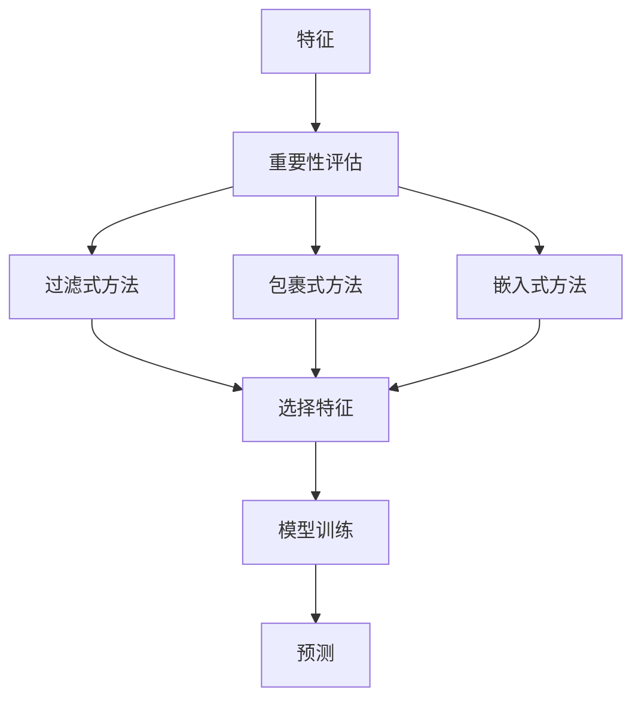

                 

# 特征选择 (Feature Selection) 原理与代码实例讲解

> 关键词：特征选择, 重要性评估, 模型性能, 代码实例, 数据科学

## 1. 背景介绍

在数据科学中，特征选择（Feature Selection）是一个至关重要的过程。其目的是从原始特征集合中选择那些最具有解释性和预测能力的特征，从而提高模型的性能并避免过拟合。这一过程涉及到的技术包括但不限于：过滤式方法、包裹式方法和嵌入式方法。

### 1.1 问题由来
在机器学习模型的构建过程中，选择合适的特征集至关重要。特征选择可以帮助我们：
1. **减少维度**：通过选择具有重要性的特征，降低数据集的维度，从而提高模型训练和预测的速度。
2. **提高模型性能**：确保模型能够捕捉到最重要的特征，避免冗余特征的干扰，提高模型的泛化能力。
3. **防止过拟合**：通过剔除噪声特征和冗余特征，降低模型对训练数据过度拟合的风险。

### 1.2 问题核心关键点
特征选择的方法主要有以下三种：
1. **过滤式方法**：在训练模型之前，通过统计方法或相关系数等指标，对特征进行筛选。
2. **包裹式方法**：在模型训练过程中，根据模型性能（如交叉验证误差）来确定特征的重要性。
3. **嵌入式方法**：在模型训练过程中，自动学习哪些特征对模型的预测能力有贡献，并舍弃不必要的特征。

每种特征选择方法有其优缺点，选择合适的方法取决于数据的性质、模型的复杂性以及应用场景的要求。

### 1.3 问题研究意义
特征选择的准确性直接影响机器学习模型的性能。通过有效的特征选择，可以提高模型的训练效率和预测准确性，减少计算资源的消耗，提高模型的可解释性。因此，对于数据科学实践来说，了解和掌握特征选择的方法和技术具有重要意义。

## 2. 核心概念与联系

### 2.1 核心概念概述

为了更好地理解特征选择的过程，我们需要先了解一些核心概念：

1. **特征**：数据集中的每个属性，可以是数值型、分类型、时间型等。
2. **重要性**：特征对模型预测能力的贡献度。
3. **过滤式方法**：在模型训练之前，基于统计学或相关性分析等方法对特征进行筛选。
4. **包裹式方法**：在模型训练过程中，通过交叉验证等技术评估特征的重要性。
5. **嵌入式方法**：在模型训练过程中，通过正则化等技术自动选择重要特征。
6. **过拟合**：模型在训练数据上表现良好，但在测试数据上表现差的现象。
7. **维度和降维**：原始特征集合的维数较高时，通过特征选择或降维技术降低数据的维度，以提高模型训练和预测的效率。

这些概念之间存在着紧密的联系，构成了特征选择的理论基础和实践框架。

### 2.2 概念间的关系

这些核心概念之间的关系可以通过以下Mermaid流程图来展示：



这个流程图展示了特征选择的核心流程：

1. 从原始特征集合中提取特征重要性。
2. 根据特征重要性，使用过滤式、包裹式或嵌入式方法选择重要特征。
3. 使用选择后的特征进行模型训练和预测。

## 3. 核心算法原理 & 具体操作步骤
### 3.1 算法原理概述

特征选择的基本原理是根据特征的重要性来筛选特征。特征的重要性可以通过多种方式评估，例如：方差、相关性、信息增益、互信息、L1正则化等。

在实际应用中，我们通常会使用以下几种方法：

1. **过滤式方法**：独立于具体模型，在模型训练之前对特征进行筛选。
2. **包裹式方法**：在模型训练过程中评估特征的重要性。
3. **嵌入式方法**：在模型训练过程中通过正则化等技术自动选择特征。

### 3.2 算法步骤详解

以过滤式方法中的方差选择为例，其步骤如下：

1. **计算特征的方差**：对于每个特征，计算其在训练集上的方差。
2. **设置阈值**：根据业务需求或经验，设置一个方差阈值。
3. **筛选特征**：将方差小于阈值的特征剔除。

### 3.3 算法优缺点

**优点**：
- 简单易懂：过滤式方法和嵌入式方法不需要额外的模型训练，简单易懂。
- 快速高效：这些方法在数据预处理阶段进行，计算量小，速度快。
- 适用范围广：适用于各种类型的特征，包括数值型、分类型等。

**缺点**：
- 缺乏上下文信息：过滤式方法忽略了特征之间的相互作用，可能导致重要特征被误判。
- 依赖于阈值设定：阈值设定不当可能导致关键特征被误判或漏判。

### 3.4 算法应用领域

特征选择在数据科学中应用广泛，以下是几个主要的应用领域：

1. **金融预测**：通过特征选择，减少无关特征，提高模型的预测能力。
2. **医疗诊断**：通过特征选择，筛选关键指标，提高诊断模型的准确性。
3. **图像识别**：通过特征选择，减少噪声特征，提高模型的分类能力。
4. **自然语言处理**：通过特征选择，提取重要特征，提高模型的语言理解能力。

## 4. 数学模型和公式 & 详细讲解  
### 4.1 数学模型构建

我们以过滤式方法中的方差选择为例，其数学模型构建如下：

假设特征集合为 $\{X_1, X_2, ..., X_n\}$，其中 $X_i$ 是第 $i$ 个特征。对于每个特征 $X_i$，计算其方差 $\sigma_i^2$。

方差的计算公式为：
$$
\sigma_i^2 = \frac{1}{n-1} \sum_{j=1}^n (x_{ij} - \mu_i)^2
$$
其中 $x_{ij}$ 是第 $j$ 个样本的第 $i$ 个特征值，$\mu_i$ 是第 $i$ 个特征的均值。

### 4.2 公式推导过程

通过方差选择，我们将方差小于阈值 $\theta$ 的特征剔除。方差阈值的设定需要根据业务需求和经验来确定。通常情况下，我们设定一个较小的阈值，以避免过拟合。

### 4.3 案例分析与讲解

假设我们有一个包含 10 个特征的样本集合，其中前 8 个特征的方差都大于 0.5，后 2 个特征的方差小于 0.5。根据方差阈值 0.5，我们将后 2 个特征剔除。

## 5. 项目实践：代码实例和详细解释说明
### 5.1 开发环境搭建

为了进行特征选择的实践，我们需要搭建一个Python开发环境。以下是一个简单的环境配置流程：

1. **安装Python**：从官网下载并安装Python。
2. **创建虚拟环境**：
   ```
   conda create --name feature_selection_env python=3.8
   conda activate feature_selection_env
   ```
3. **安装相关库**：
   ```
   pip install numpy pandas scikit-learn matplotlib
   ```

### 5.2 源代码详细实现

以下是一个使用方差选择特征选择的示例代码：

```python
import numpy as np
from sklearn.feature_selection import VarianceThreshold

# 构造一个包含10个特征的样本集合
X = np.random.randn(100, 10)

# 计算每个特征的方差
variances = np.var(X, axis=0)

# 设置方差阈值
threshold = 0.5

# 筛选特征
variance_threshold = VarianceThreshold(threshold)
X_selected = variance_threshold.fit_transform(X)

print("原始特征数量：", X.shape[1])
print("筛选后特征数量：", X_selected.shape[1])
```

### 5.3 代码解读与分析

在这段代码中，我们首先使用 `np.var` 函数计算了每个特征的方差。然后，根据业务需求设定方差阈值，并使用 `VarianceThreshold` 类进行特征筛选。最后，输出原始特征数量和筛选后特征数量。

### 5.4 运行结果展示

假设原始特征集合为 10 个特征，经过方差阈值为 0.5 的筛选，我们可能得到筛选后特征集合为 8 个特征。这表明有 2 个特征的方差小于 0.5，被剔除。

## 6. 实际应用场景
### 6.1 金融预测

在金融预测中，特征选择可以帮助我们筛选出对预测股票价格、市场波动等有显著影响的特征。例如，通过特征选择，我们可以剔除无关的噪音特征，保留对市场变化有贡献的特征，从而提高模型的预测能力。

### 6.2 医疗诊断

在医疗诊断中，特征选择可以帮助我们筛选出对疾病诊断有显著影响的特征。例如，通过特征选择，我们可以剔除无关的特征，保留对疾病诊断有贡献的特征，从而提高诊断模型的准确性。

### 6.3 图像识别

在图像识别中，特征选择可以帮助我们筛选出对图像分类有显著影响的特征。例如，通过特征选择，我们可以剔除无关的噪声特征，保留对图像分类有贡献的特征，从而提高分类模型的准确性。

### 6.4 自然语言处理

在自然语言处理中，特征选择可以帮助我们筛选出对语言理解有显著影响的特征。例如，通过特征选择，我们可以剔除无关的噪音特征，保留对语言理解有贡献的特征，从而提高模型的语言理解能力。

## 7. 工具和资源推荐
### 7.1 学习资源推荐

为了深入理解特征选择的原理和实践，以下是一些推荐的学习资源：

1. 《机器学习实战》：书中详细介绍了特征选择的多种方法，包括过滤式方法、包裹式方法和嵌入式方法。
2. 《Python数据科学手册》：书中提供了丰富的代码实例，帮助读者理解特征选择的具体实现。
3. 《统计学习方法》：书中详细介绍了特征选择的数学基础和统计方法。
4. Coursera上的《机器学习基础》课程：课程中介绍了特征选择的多种方法及其应用场景。

### 7.2 开发工具推荐

为了高效地进行特征选择，以下是一些推荐的开发工具：

1. Python：Python是一种易于学习和使用的编程语言，适合进行数据处理和特征选择。
2. Jupyter Notebook：Jupyter Notebook是一种交互式的编程环境，适合进行特征选择的实验和分析。
3. Scikit-learn：Scikit-learn是一个流行的Python机器学习库，提供了丰富的特征选择方法和工具。

### 7.3 相关论文推荐

以下是一些关于特征选择的经典论文：

1. "Feature Selection Using Mutual Information"：作者为Gennady Zliobaite，介绍了互信息在特征选择中的应用。
2. "A Survey of Feature Selection Techniques in Machine Learning"：作者为Juan Camilo Zapata-Giraldo，介绍了多种特征选择方法及其应用场景。
3. "Feature Selection for Ensemble Learning: From Past to Present"：作者为Suman Chattopadhyay，介绍了特征选择对集成学习方法的影响。

## 8. 总结：未来发展趋势与挑战
### 8.1 研究成果总结

特征选择是数据科学中一个重要的预处理步骤，可以帮助我们提高模型的性能和效率。通过有效的特征选择，可以降低数据的维度，减少模型的计算复杂度，提高模型的可解释性。

### 8.2 未来发展趋势

未来特征选择的发展趋势包括：

1. 自动化特征选择：使用自动化的特征选择方法，如神经网络等，可以进一步提高特征选择的效率和准确性。
2. 多模态特征选择：将不同模态的特征结合起来，进行综合评估，可以提高模型的泛化能力和准确性。
3. 跨领域特征选择：将不同领域的特征选择方法结合起来，进行综合评估，可以提高模型的适应性和泛化能力。

### 8.3 面临的挑战

尽管特征选择在数据科学中得到了广泛应用，但其仍然面临一些挑战：

1. 高维数据处理：当数据集的维度很高时，特征选择的计算复杂度会显著增加。
2. 特征依赖性：特征之间可能存在复杂的依赖关系，简单的特征选择方法可能无法处理这些关系。
3. 特征重要性评估：如何准确评估特征的重要性，仍然是一个复杂的问题。

### 8.4 研究展望

未来，特征选择的研究方向可能包括：

1. 结合深度学习的方法：将深度学习与特征选择结合起来，可以进一步提高特征选择的效率和准确性。
2. 引入外部知识：将领域知识与特征选择方法结合起来，可以进一步提高特征选择的准确性。
3. 多领域特征选择：将不同领域的特征选择方法结合起来，进行综合评估，可以提高模型的适应性和泛化能力。

## 9. 附录：常见问题与解答

**Q1: 什么是特征选择？**

A: 特征选择是指从原始特征集合中选择最有用的特征，以提高模型性能并避免过拟合的过程。

**Q2: 特征选择的目的是什么？**

A: 特征选择的目的是从原始特征集合中选择最具解释性和预测能力的特征，从而提高模型的性能并避免过拟合。

**Q3: 过滤式方法和包裹式方法的区别是什么？**

A: 过滤式方法在模型训练之前进行特征选择，不依赖于具体模型；包裹式方法在模型训练过程中进行特征选择，依赖于具体模型的性能。

**Q4: 嵌入式方法的特点是什么？**

A: 嵌入式方法在模型训练过程中通过正则化等技术自动选择重要特征，不需要额外的特征选择步骤。

**Q5: 如何进行特征选择？**

A: 特征选择可以通过多种方法进行，包括过滤式方法、包裹式方法和嵌入式方法。具体方法的选择取决于数据的性质、模型的复杂性以及应用场景的要求。

---

作者：禅与计算机程序设计艺术 / Zen and the Art of Computer Programming

