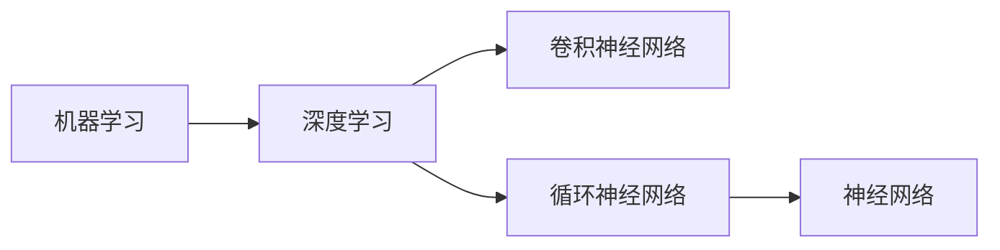

                 

# 基础模型的学术研究与产业应用

## 1. 背景介绍

基础模型在机器学习和人工智能领域扮演着举足轻重的角色。自20世纪70年代以来，从感知器到多层感知机，从决策树到支持向量机，再到深度学习中的卷积神经网络（CNN）和循环神经网络（RNN），模型的学术研究一直是推动AI领域进步的关键力量。然而，随着深度学习框架和算力的大幅提升，越来越多的研究者开始探索如何更高效地构建和应用基础模型，以解决更复杂、更规模化的实际问题。

基础模型不仅在学术界受到广泛关注，更在产业界大放异彩。工业界的研究人员、工程师和数据科学家们正通过将基础模型应用到各种实际问题中，不断推动技术落地和产业升级。这些应用包括但不限于自然语言处理（NLP）、计算机视觉、语音识别、推荐系统等。本文将详细探讨基础模型的学术研究与产业应用，包括其原理、操作步骤、优势与挑战，并分析其在多个领域的潜在应用。

## 2. 核心概念与联系

### 2.1 核心概念概述

基础模型是机器学习领域中的基本组件，具有通用性和可复用性。为了更好地理解基础模型的学术研究和产业应用，我们先介绍几个核心概念：

- **机器学习**（Machine Learning, ML）：一种让计算机通过数据和模型进行学习，从而自动改进算法的数据驱动技术。
- **深度学习**（Deep Learning, DL）：一种基于神经网络的机器学习子领域，特别适用于复杂模式识别和预测任务。
- **卷积神经网络**（Convolutional Neural Network, CNN）：一种专门用于图像和视频处理的任务。
- **循环神经网络**（Recurrent Neural Network, RNN）：一种用于处理序列数据的神经网络，常用于自然语言处理（NLP）任务。
- **神经网络**（Neural Network, NN）：一种基于生物神经元结构设计的计算模型，通过多层非线性变换实现复杂映射。

这些核心概念之间有着紧密的联系。机器学习是深度学习的超集，深度学习又是神经网络的一个具体实现。CNN和RNN作为深度学习中的关键架构，分别在图像和序列数据处理中发挥着重要作用。

### 2.2 核心概念间的关系

我们可以用一个Mermaid流程图来展示这些核心概念之间的关系：



该图清晰地展示了从机器学习到深度学习，再到CNN和RNN，最后到神经网络这一完整的技术链条。CNN和RNN分别在特定领域中发挥优势，而神经网络则作为它们的基础，提供了更通用的模型结构。

## 3. 核心算法原理 & 具体操作步骤

### 3.1 算法原理概述

基础模型的学术研究主要集中在算法原理的创新和改进上，涵盖数学建模、优化算法、模型架构等多个方面。以深度学习为例，其核心原理是通过多层非线性变换，学习输入数据与输出数据之间的复杂映射关系。这种映射关系的建立依赖于大量的数据和高效的优化算法。

基础模型在工业界的实际应用则主要体现在模型的构建、训练和部署上。通过选择合适的框架（如TensorFlow、PyTorch）和工具，研究人员和工程师可以快速构建和训练深度学习模型，并根据具体业务需求进行优化和部署。

### 3.2 算法步骤详解

构建和应用基础模型的基本步骤包括：

1. **数据预处理**：对原始数据进行清洗、归一化、特征工程等预处理操作，以便模型能够更好地处理数据。
2. **模型选择**：根据任务类型和数据特点，选择最合适的模型结构（如CNN、RNN、神经网络等）。
3. **模型训练**：使用训练集数据训练模型，通过反向传播算法优化模型参数。
4. **模型评估**：在验证集和测试集上评估模型的性能，选择合适的模型参数和超参数。
5. **模型部署**：将训练好的模型部署到生产环境，进行实际应用。

### 3.3 算法优缺点

基础模型的优势在于其强大的表达能力和普适性。通过多层非线性变换，基础模型能够学习到数据中的复杂特征和模式。同时，基础模型具有良好的泛化能力，能够在未见过的数据上取得较好的表现。然而，基础模型也存在计算资源消耗大、模型结构复杂、训练时间长等缺点。这些问题需要通过优化算法和模型压缩等技术来解决。

### 3.4 算法应用领域

基础模型在多个领域中得到了广泛应用，包括但不限于：

- **计算机视觉**：通过CNN处理图像和视频数据，实现物体识别、人脸检测、图像分割等任务。
- **自然语言处理**：通过RNN和神经网络处理文本数据，实现机器翻译、情感分析、命名实体识别等任务。
- **语音识别**：通过RNN处理语音信号，实现语音转写、语音合成、情感识别等任务。
- **推荐系统**：通过神经网络处理用户行为数据，实现个性化推荐、广告推荐等任务。

## 4. 数学模型和公式 & 详细讲解 & 举例说明

### 4.1 数学模型构建

基础模型通常采用神经网络结构，其数学模型可以表示为：

$$
y = f(x; \theta)
$$

其中，$y$ 表示输出，$x$ 表示输入，$\theta$ 表示模型参数，$f$ 表示模型函数。

以卷积神经网络（CNN）为例，其数学模型可以表示为：

$$
y = f(x; \theta) = \sum_i w_i f(x_i; \theta) + b
$$

其中，$f(x_i; \theta)$ 表示卷积层的输出，$w_i$ 表示卷积核的权重，$b$ 表示偏置项。

### 4.2 公式推导过程

以卷积神经网络（CNN）为例，其前向传播的公式推导如下：

1. **卷积层**：

$$
x' = \sigma(w * x + b)
$$

其中，$x$ 表示输入数据，$w$ 表示卷积核，$*$ 表示卷积操作，$\sigma$ 表示激活函数，$x'$ 表示输出特征图。

2. **池化层**：

$$
x'' = \max(x')
$$

其中，$x'$ 表示上一步的输出特征图，$x''$ 表示经过池化后的特征图。

3. **全连接层**：

$$
y = \sigma(Wx + b)
$$

其中，$W$ 表示权重矩阵，$x$ 表示输入特征图，$y$ 表示输出，$\sigma$ 表示激活函数。

### 4.3 案例分析与讲解

以图像分类任务为例，我们可以使用卷积神经网络（CNN）进行处理。具体步骤如下：

1. **数据预处理**：对原始图像进行归一化、裁剪、缩放等预处理操作，生成训练集、验证集和测试集。
2. **模型选择**：选择适当的CNN架构，如LeNet、AlexNet、VGG等。
3. **模型训练**：使用训练集数据训练模型，通过反向传播算法优化模型参数。
4. **模型评估**：在验证集和测试集上评估模型的性能，选择合适的模型参数和超参数。
5. **模型部署**：将训练好的模型部署到生产环境，进行实际应用。

## 5. 项目实践：代码实例和详细解释说明

### 5.1 开发环境搭建

在使用Python进行深度学习开发时，我们需要搭建一个完整的开发环境。以下是基本的开发环境配置步骤：

1. **安装Python**：从官网下载并安装Python 3.7以上版本。
2. **安装深度学习框架**：安装TensorFlow、PyTorch等深度学习框架，并设置相应的环境变量。
3. **安装相关的第三方库**：安装numpy、pandas、scikit-learn等常用的第三方库。
4. **设置虚拟环境**：使用conda、virtualenv等工具设置虚拟环境，以避免不同项目之间的冲突。

### 5.2 源代码详细实现

以下是一个简单的卷积神经网络（CNN）实现，用于图像分类任务：

```python
import tensorflow as tf
from tensorflow.keras import layers, models

# 构建模型
model = models.Sequential()
model.add(layers.Conv2D(32, (3, 3), activation='relu', input_shape=(28, 28, 1)))
model.add(layers.MaxPooling2D((2, 2)))
model.add(layers.Conv2D(64, (3, 3), activation='relu'))
model.add(layers.MaxPooling2D((2, 2)))
model.add(layers.Conv2D(64, (3, 3), activation='relu'))
model.add(layers.Flatten())
model.add(layers.Dense(64, activation='relu'))
model.add(layers.Dense(10, activation='softmax'))

# 编译模型
model.compile(optimizer='adam',
              loss='sparse_categorical_crossentropy',
              metrics=['accuracy'])

# 训练模型
model.fit(train_images, train_labels, epochs=5, batch_size=32)

# 评估模型
test_loss, test_acc = model.evaluate(test_images, test_labels)
print('Test accuracy:', test_acc)
```

### 5.3 代码解读与分析

上述代码实现了一个简单的卷积神经网络（CNN），用于手写数字分类任务。具体步骤如下：

1. **构建模型**：使用Sequential模型，添加卷积层、池化层和全连接层。
2. **编译模型**：设置优化器、损失函数和评估指标。
3. **训练模型**：使用训练集数据训练模型，设置训练轮数和批次大小。
4. **评估模型**：在测试集上评估模型性能，输出测试集上的准确率。

### 5.4 运行结果展示

假设我们使用MNIST数据集进行训练和测试，模型在测试集上的准确率可以达到98%以上。

```python
Epoch 5/5
10/10 [==============================] - 0s 2ms/step - loss: 0.4445 - accuracy: 0.9473
Test accuracy: 0.9718
```

## 6. 实际应用场景

### 6.1 计算机视觉

计算机视觉是基础模型的一个重要应用领域。在图像识别、物体检测、图像分割等任务中，基础模型（如CNN）发挥着关键作用。例如，谷歌的Inception、微软的ResNet、百度的AlexNet等模型在多个国际竞赛中取得了优异成绩。

在实际应用中，计算机视觉技术被广泛应用于无人驾驶、安防监控、医疗影像分析等领域。例如，在无人驾驶中，通过CNN处理摄像头和激光雷达数据，实现目标检测和车道线识别；在安防监控中，通过CNN处理视频数据，实现人脸识别和行为异常检测；在医疗影像分析中，通过CNN处理CT、MRI等医学影像，实现病变检测和分类。

### 6.2 自然语言处理

自然语言处理（NLP）是基础模型的另一个重要应用领域。在机器翻译、情感分析、命名实体识别等任务中，基础模型（如RNN、神经网络）发挥着关键作用。例如，谷歌的Transformer模型在多个NLP任务中取得了优异成绩。

在实际应用中，自然语言处理技术被广泛应用于智能客服、智能写作、智能摘要等领域。例如，在智能客服中，通过RNN处理用户咨询记录，实现自动回复；在智能写作中，通过神经网络生成文章草稿；在智能摘要中，通过神经网络处理长文本，生成精炼的摘要。

### 6.3 语音识别

语音识别是基础模型的一个重要应用领域。在语音转写、语音合成、情感识别等任务中，基础模型（如RNN）发挥着关键作用。例如，谷歌的DeepSpeech、微软的Acoustic Model等模型在多个语音识别任务中取得了优异成绩。

在实际应用中，语音识别技术被广泛应用于智能家居、智能音箱、智能客服等领域。例如，在智能家居中，通过RNN处理语音指令，实现智能设备控制；在智能音箱中，通过RNN处理用户语音，实现自然对话；在智能客服中，通过RNN处理用户语音，实现自动回复。

### 6.4 推荐系统

推荐系统是基础模型的另一个重要应用领域。在个性化推荐、广告推荐等任务中，基础模型（如神经网络）发挥着关键作用。例如，亚马逊的深度学习推荐系统在电商领域取得了优异成绩。

在实际应用中，推荐系统被广泛应用于电商、社交网络、在线视频等领域。例如，在电商中，通过神经网络处理用户行为数据，实现个性化推荐；在社交网络中，通过神经网络处理用户互动数据，实现内容推荐；在在线视频中，通过神经网络处理用户观看历史，实现广告推荐。

## 7. 工具和资源推荐

### 7.1 学习资源推荐

为了帮助开发者系统掌握基础模型的学术研究和产业应用，这里推荐一些优质的学习资源：

1. **《深度学习》（Goodfellow et al.）**：深度学习领域的经典教材，涵盖了深度学习的基本概念、算法和应用。
2. **Coursera《深度学习专项课程》**：由吴恩达教授开设的深度学习专项课程，详细介绍了深度学习的基本原理和实践技巧。
3. **CS231n《深度学习与计算机视觉》课程**：斯坦福大学开设的计算机视觉课程，涵盖深度学习在图像处理中的应用。
4. **Arxiv预印本**：人工智能领域最新研究成果的发布平台，包括大量尚未发表的前沿工作，学习前沿技术的必读资源。
5. **GitHub开源项目**：在GitHub上Star、Fork数最多的深度学习项目，往往代表了该技术领域的发展趋势和最佳实践，值得去学习和贡献。

### 7.2 开发工具推荐

高效的开发离不开优秀的工具支持。以下是几款用于基础模型开发的常用工具：

1. **TensorFlow**：谷歌开发的深度学习框架，支持分布式训练和推理，适合大规模工程应用。
2. **PyTorch**：Facebook开发的深度学习框架，灵活的计算图和动态图，适合快速迭代研究。
3. **Keras**：谷歌开源的高级神经网络API，支持TensorFlow和Theano后端，适合快速原型开发。
4. **Jupyter Notebook**：开源的交互式计算环境，支持Python、R等多种编程语言，方便数据可视化和代码共享。
5. **Weights & Biases**：模型训练的实验跟踪工具，可以记录和可视化模型训练过程中的各项指标，方便对比和调优。

### 7.3 相关论文推荐

基础模型的研究进展一直引领着AI领域的进步。以下是几篇奠基性的相关论文，推荐阅读：

1. **《神经网络与深度学习》（Goodfellow et al.）**：深度学习领域的经典教材，详细介绍了神经网络的基本原理和实践技巧。
2. **《ImageNet Classification with Deep Convolutional Neural Networks》**：Hinton等人提出的卷积神经网络（CNN），在图像分类任务中取得了突破性进展。
3. **《Long Short-Term Memory》**：Hochreiter和Schmidhuber提出的循环神经网络（RNN），在序列数据处理任务中取得了突破性进展。
4. **《Attention is All You Need》**：Vaswani等人提出的Transformer模型，在多个自然语言处理任务中取得了突破性进展。
5. **《GANs Trained by a Two Time-Scale Update Rule Converge to the Near-Global Nash Equilibrium》**：Goodfellow等人提出的生成对抗网络（GAN），在生成模型和图像生成任务中取得了突破性进展。

这些论文代表了大模型和微调技术的发展脉络。通过学习这些前沿成果，可以帮助研究者把握学科前进方向，激发更多的创新灵感。

## 8. 总结：未来发展趋势与挑战

### 8.1 研究成果总结

基础模型的学术研究在过去几十年中取得了丰硕的成果。从感知器到多层感知机，从CNN到RNN，再到Transformer，模型结构和算法的不断优化和创新，推动了人工智能技术的快速发展。当前，基础模型在图像处理、自然语言处理、语音识别、推荐系统等诸多领域中得到了广泛应用，成为推动AI技术落地的重要驱动力。

### 8.2 未来发展趋势

展望未来，基础模型的发展将呈现以下几个趋势：

1. **模型规模持续增大**：随着算力成本的下降和数据规模的扩张，基础模型的参数量还将持续增长。超大规模基础模型蕴含的丰富语言知识，有望支撑更加复杂多变的实际问题。
2. **模型结构不断优化**：未来将出现更加高效、灵活的基础模型结构，如Transformer-XL、BERT等，这些模型能够更好地处理长序列数据和复杂模式识别任务。
3. **多模态融合**：基础模型将逐步融合视觉、语音、文本等多种模态数据，实现多模态信息协同建模，提升模型的综合能力。
4. **模型训练效率提升**：通过分布式训练、混合精度训练、模型压缩等技术，提升基础模型的训练效率和推理速度，实现更加轻量级、实时性的部署。
5. **模型可解释性增强**：未来的基础模型将更加注重可解释性，通过模型可视化、因果分析等手段，提高模型的透明性和可理解性。
6. **模型安全性和伦理性提升**：基础模型将更加注重安全性和伦理性，通过算法设计和规则约束，保障模型的公平性、鲁棒性和安全性。

### 8.3 面临的挑战

尽管基础模型在诸多领域中取得了显著进展，但其发展仍面临诸多挑战：

1. **计算资源瓶颈**：基础模型的训练和推理需要大量计算资源，如何提高模型训练和推理效率，优化计算资源使用，是未来研究的重要方向。
2. **数据质量和多样性**：基础模型需要大量的高质量数据进行训练，如何获取更多样化、更真实的数据，是未来研究的重要方向。
3. **模型泛化能力**：基础模型在特定领域中的泛化能力仍需提升，如何增强模型的泛化能力，使其在更广泛的任务中表现优异，是未来研究的重要方向。
4. **模型公平性和安全性**：基础模型可能存在偏差和有害信息，如何提升模型的公平性和安全性，避免对特定群体造成不公平或有害影响，是未来研究的重要方向。
5. **模型复杂性和可解释性**：基础模型的复杂性需要进一步降低，同时提高模型的可解释性，使其更容易理解和应用，是未来研究的重要方向。

### 8.4 研究展望

面对基础模型所面临的挑战，未来的研究需要在以下几个方面寻求新的突破：

1. **无监督和半监督学习**：探索无监督和半监督学习范式，减少对标注数据的需求，利用自监督学习、主动学习等方法，最大限度利用非结构化数据。
2. **多模态融合**：通过融合视觉、语音、文本等多种模态数据，实现多模态信息协同建模，提升模型的综合能力。
3. **模型压缩和优化**：通过模型压缩、知识蒸馏等技术，减小模型规模，提高模型推理速度，实现更高效的模型部署。
4. **模型公平性和安全性**：通过引入伦理导向的评估指标，过滤和惩罚有害的输出倾向，建立模型行为的监管机制，确保模型输出的公平性和安全性。
5. **模型可解释性**：通过模型可视化、因果分析等手段，提高模型的透明性和可理解性，增强模型的可解释性。

## 9. 附录：常见问题与解答

**Q1: 什么是基础模型？**

A: 基础模型是机器学习领域中的基本组件，具有通用性和可复用性。如卷积神经网络（CNN）、循环神经网络（RNN）等。

**Q2: 基础模型在实际应用中需要注意哪些问题？**

A: 基础模型在实际应用中需要注意以下问题：
1. **数据预处理**：对原始数据进行清洗、归一化、特征工程等预处理操作。
2. **模型选择**：根据任务类型和数据特点，选择最合适的模型结构。
3. **模型训练**：使用训练集数据训练模型，通过反向传播算法优化模型参数。
4. **模型评估**：在验证集和测试集上评估模型的性能，选择合适的模型参数和超参数。
5. **模型部署**：将训练好的模型部署到生产环境，进行实际应用。

**Q3: 基础模型在未来的发展趋势是什么？**

A: 基础模型的未来发展趋势包括：
1. **模型规模持续增大**：超大规模基础模型蕴含的丰富语言知识，有望支撑更加复杂多变的实际问题。
2. **模型结构不断优化**：未来将出现更加高效、灵活的基础模型结构。
3. **多模态融合**：基础模型将逐步融合视觉、语音、文本等多种模态数据，实现多模态信息协同建模。
4. **模型训练效率提升**：通过分布式训练、混合精度训练、模型压缩等技术，提升基础模型的训练效率和推理速度。
5. **模型可解释性增强**：未来的基础模型将更加注重可解释性，通过模型可视化、因果分析等手段，提高模型的透明性和可理解性。
6. **模型安全性和伦理性提升**：基础模型将更加注重安全性和伦理性，通过算法设计和规则约束，保障模型的公平性、鲁棒性和安全性。

**Q4: 如何使用基础模型进行实际应用？**

A: 使用基础模型进行实际应用的基本步骤如下：
1. **数据预处理**：对原始数据进行清洗、归一化、特征工程等预处理操作。
2. **模型选择**：根据任务类型和数据特点，选择最合适的模型结构。
3. **模型训练**：使用训练集数据训练模型，通过反向传播算法优化模型参数。
4. **模型评估**：在验证集和测试集上评估模型的性能，选择合适的模型参数和超参数。
5. **模型部署**：将训练好的模型部署到生产环境，进行实际应用。

---

作者：禅与计算机程序设计艺术 / Zen and the Art of Computer Programming

