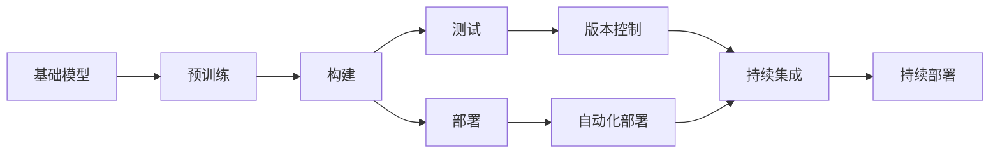

                 

# 基础模型的逐步发布策略

> 关键词：基础模型, 发布策略, 阶段划分, 自动化工具, 模型部署, 版本控制, 模型迭代

## 1. 背景介绍

### 1.1 问题由来

在现代人工智能(AI)和机器学习(ML)领域，开发、训练和部署高质量的AI模型变得越来越复杂。对于基础模型（如深度学习模型、自然语言处理模型等）的逐步发布，往往需要跨多个部门和团队，协调资源，整合数据，并进行持续的优化和迭代。随着基础模型技术的日益成熟，模型发布频率越来越快，涉及的协作方也越来越多，原有的单次部署模式已经无法满足快速迭代和灵活部署的需求。因此，提出一种高效、可扩展的基础模型发布策略变得尤为重要。

### 1.2 问题核心关键点

基础模型的发布策略主要围绕以下几个关键点展开：
- **版本控制**：如何有效管理模型版本，确保每次发布的模型都是稳定的、可重复的。
- **自动化部署**：如何简化模型部署流程，降低人工操作和出错概率，提高部署效率。
- **持续集成和持续部署(CI/CD)**：如何在每次模型迭代后，自动进行构建、测试和部署，以实现快速迭代和持续优化。
- **模型迭代**：如何在发布策略下，合理地进行模型迭代，平衡模型质量与发布效率。
- **安全性和合规性**：如何确保模型在发布和部署过程中的安全性和合规性，防止数据泄露和模型滥用。

### 1.3 问题研究意义

一个合理的基础模型发布策略能够显著提升模型开发和部署的效率，缩短产品上市周期，同时保证模型的稳定性和安全性。这种策略的应用不仅能够推动模型的快速迭代和优化，还能为跨部门合作提供便利，促进AI技术的普及和应用。

## 2. 核心概念与联系

### 2.1 核心概念概述

为了更深入地理解基础模型的逐步发布策略，本文将首先介绍几个核心概念及其联系：

- **基础模型(Foundation Model)**：指的是深度学习、自然语言处理等领域的预训练模型，如BERT、GPT-3等。这些模型通常需要在大规模数据上进行预训练，学习通用的语言或图像表示。

- **模型发布**：将训练好的模型发布到生产环境，供用户或应用程序调用。模型的发布过程通常包括构建、测试、部署等多个环节。

- **版本控制**：通过版本控制工具，记录模型的迭代历史，管理不同版本之间的依赖关系，确保模型发布的可追溯性和可重复性。

- **自动化部署**：使用自动化工具和脚本，实现模型构建、测试、部署的自动化流程，减少人工干预，提高效率和准确性。

- **持续集成(CI)**：在每次代码提交后，自动执行构建、测试等步骤，保证代码的持续集成和模型的快速迭代。

- **持续部署(CD)**：在每次模型迭代后，自动执行部署步骤，保证模型的快速部署和持续优化。

- **CI/CD流水线**：将持续集成和持续部署结合起来，形成一个自动化的发布流程，支持模型的高频次发布和持续优化。

这些核心概念之间存在着紧密的联系，形成了一个高效的基础模型发布生态系统。

### 2.2 概念间的关系

这些核心概念之间的关系可以通过以下Mermaid流程图来展示：



这个流程图展示了大模型从预训练到发布的全过程，以及各个环节之间的关系：

1. 基础模型通过预训练获得初始表示。
2. 在预训练模型基础上，构建模型版本并进行测试。
3. 通过自动化部署工具将模型部署到生产环境。
4. 在CI/CD流水线中，持续集成和持续部署实现模型的快速迭代和优化。

## 3. 核心算法原理 & 具体操作步骤
### 3.1 算法原理概述

基础模型的逐步发布策略，本质上是一种基于版本控制、自动化部署和持续集成的模型发布管理方法。其核心思想是通过构建、测试、部署的自动化流程，以及版本控制工具的管理，确保模型的稳定性和可追溯性，同时提高发布效率，支持模型的快速迭代和优化。

### 3.2 算法步骤详解

基于版本控制和自动化部署的大模型发布策略，一般包括以下几个关键步骤：

**Step 1: 构建模型版本**

- 收集并准备模型训练所需的原始数据和资源，包括预训练模型、训练脚本、测试数据等。
- 使用版本控制系统（如Git）管理代码和资源，确保每次迭代都有详细的记录。
- 在模型构建过程中，定义模型版本标签，如`v1.0`、`v1.1`等，确保每次发布都有明确的版本号。

**Step 2: 执行模型测试**

- 在持续集成服务器上，定义自动化测试流程，确保每次代码提交后，自动执行模型构建和测试。
- 使用测试框架（如PyTorch Test Suite）编写测试用例，覆盖模型的主要功能模块。
- 设置测试失败后的报警机制，确保模型问题能够及时被发现和修复。

**Step 3: 部署模型**

- 在持续部署服务器上，定义自动化部署流程，确保每次模型构建和测试成功后，自动将模型部署到生产环境。
- 使用容器化技术（如Docker）打包模型，确保模型在不同环境下的稳定性。
- 设置部署失败后的回滚机制，确保模型部署的成功率。

**Step 4: 管理模型版本**

- 在持续集成和持续部署过程中，使用版本控制工具（如Git）记录每次迭代的历史。
- 管理模型不同版本之间的依赖关系，确保每次发布的模型都是稳定的、可重复的。
- 定义模型发布的策略，如发布时间窗口、发布频率等，支持模型的快速迭代和优化。

### 3.3 算法优缺点

基础模型的逐步发布策略有以下优点：
1. 提高发布效率：通过自动化流程和持续集成，大大缩短了模型迭代和发布的周期。
2. 确保模型稳定：通过版本控制和自动化部署，确保每次发布的模型都是稳定和可重复的。
3. 支持模型迭代：支持高频次的模型迭代和优化，快速响应用户需求和反馈。
4. 提升协作效率：通过版本控制和自动化工具，降低了跨部门协作的难度，提升了团队协作效率。

同时，该策略也存在一定的局限性：
1. 需要投入较多资源：构建、测试和部署流程需要投入大量的人力和物力。
2. 复杂度较高：流程涉及多个环节，管理复杂，需要详细的规划和协调。
3. 模型版本管理复杂：随着模型版本的增加，版本管理和调用的复杂度也会增加。

### 3.4 算法应用领域

基础模型的逐步发布策略已经广泛应用于多个领域，如自然语言处理(NLP)、计算机视觉(CV)、语音识别(SR)等。以下是几个典型应用场景：

- **自然语言处理**：通过持续集成和持续部署，快速迭代和优化语言模型，支持文本分类、情感分析、问答系统等任务。
- **计算机视觉**：通过自动化流程和持续集成，快速迭代和优化图像识别模型，支持图像分类、目标检测、人脸识别等任务。
- **语音识别**：通过版本控制和自动化部署，支持音频转文字、语音合成等任务，提升人机交互体验。
- **推荐系统**：通过持续集成和持续部署，快速迭代和优化推荐模型，支持个性化推荐、广告推荐等任务。

## 4. 数学模型和公式 & 详细讲解 & 举例说明

### 4.1 数学模型构建

基础模型的逐步发布策略涉及多个环节，其中版本控制、自动化部署和持续集成等环节可以用数学模型来描述。

### 4.2 公式推导过程

以下我们以版本控制为例，推导版本控制的数学模型。

假设模型版本编号为 $v$，每次迭代后的版本更新为 $v+1$。版本控制工具通过保存每次迭代后的模型版本，维护版本之间的依赖关系。设模型当前版本为 $v$，发布频率为 $\alpha$，则下一版本为 $v+1$ 的概率为 $\alpha$，保留当前版本的概率为 $1-\alpha$。

定义模型版本 $v$ 的更新概率 $p_v$，则有：

$$
p_v = \alpha
$$

模型版本 $v$ 的保留概率 $q_v$，则有：

$$
q_v = 1-\alpha
$$

模型版本 $v$ 的保留时间 $t_v$，则有：

$$
t_v = (1-\alpha)^{v-1}
$$

根据以上定义，可以建立版本控制的数学模型。例如，当 $\alpha=0.1$ 时，模型版本保留时间与发布次数的关系如下：

| 发布次数 | 保留概率 | 保留时间 |
|----------|----------|----------|
| 1        | 0.9      | 0.9      |
| 2        | 0.81     | 0.9^1    |
| 3        | 0.729    | 0.9^2    |
| ...      | ...      | ...      |

这个表格展示了模型版本在持续发布和保留过程中的变化情况。通过数学模型，可以预测和控制模型版本的变化趋势，确保模型发布的稳定性和可追溯性。

### 4.3 案例分析与讲解

以下我们以一个具体案例，展示如何使用基础模型的逐步发布策略进行模型版本管理。

假设某公司正在开发一个图像识别模型，模型版本编号为 $v=1.0$。在每次模型迭代后，公司决定将新模型发布到生产环境，同时保留旧模型作为备份。设定发布频率 $\alpha=0.1$，即每发布一次旧模型保留的概率为 $0.9$。

1. 版本 1.0 发布后，模型版本变为 $v=1.1$，旧版本 1.0 保留的概率为 $0.9$。
2. 版本 1.1 发布后，模型版本变为 $v=1.2$，旧版本 1.1 保留的概率为 $0.9$，旧版本 1.0 保留的概率为 $0.9 \times 0.9 = 0.81$。
3. 版本 1.2 发布后，模型版本变为 $v=1.3$，旧版本 1.2 保留的概率为 $0.9$，旧版本 1.1 保留的概率为 $0.81 \times 0.9 = 0.729$，旧版本 1.0 保留的概率为 $0.81 \times 0.9 \times 0.9 = 0.6561$。

通过数学模型，可以预测模型版本的保留概率和保留时间，确保模型发布的稳定性和可追溯性。

## 5. 项目实践：代码实例和详细解释说明
### 5.1 开发环境搭建

在进行基础模型的逐步发布实践前，需要先准备好开发环境。以下是使用Python进行PyTorch开发的环境配置流程：

1. 安装Anaconda：从官网下载并安装Anaconda，用于创建独立的Python环境。

2. 创建并激活虚拟环境：
```bash
conda create -n pytorch-env python=3.8 
conda activate pytorch-env
```

3. 安装PyTorch：根据CUDA版本，从官网获取对应的安装命令。例如：
```bash
conda install pytorch torchvision torchaudio cudatoolkit=11.1 -c pytorch -c conda-forge
```

4. 安装各类工具包：
```bash
pip install numpy pandas scikit-learn matplotlib tqdm jupyter notebook ipython
```

完成上述步骤后，即可在`pytorch-env`环境中开始逐步发布实践。

### 5.2 源代码详细实现

下面我们以一个简单的图像分类模型为例，展示如何使用基础模型的逐步发布策略进行模型发布和部署。

首先，定义模型训练和测试的代码：

```python
import torch
from torch import nn
from torchvision import datasets, transforms

# 定义模型
class ImageNetModel(nn.Module):
    def __init__(self):
        super(ImageNetModel, self).__init__()
        self.conv1 = nn.Conv2d(3, 64, kernel_size=3, stride=1, padding=1)
        self.pool = nn.MaxPool2d(kernel_size=2, stride=2)
        self.fc = nn.Linear(64 * 8 * 8, 10)
    
    def forward(self, x):
        x = self.conv1(x)
        x = nn.functional.relu(x)
        x = self.pool(x)
        x = x.view(x.size(0), -1)
        x = self.fc(x)
        return x

# 加载数据集
train_dataset = datasets.CIFAR10(root='./data', train=True, download=True, transform=transforms.ToTensor())
test_dataset = datasets.CIFAR10(root='./data', train=False, download=True, transform=transforms.ToTensor())

# 训练模型
device = torch.device('cuda' if torch.cuda.is_available() else 'cpu')
model = ImageNetModel().to(device)
criterion = nn.CrossEntropyLoss()
optimizer = torch.optim.SGD(model.parameters(), lr=0.001, momentum=0.9)
train_loader = torch.utils.data.DataLoader(train_dataset, batch_size=32, shuffle=True)

for epoch in range(10):
    for inputs, labels in train_loader:
        inputs, labels = inputs.to(device), labels.to(device)
        optimizer.zero_grad()
        outputs = model(inputs)
        loss = criterion(outputs, labels)
        loss.backward()
        optimizer.step()
    
# 测试模型
test_loader = torch.utils.data.DataLoader(test_dataset, batch_size=32, shuffle=False)
with torch.no_grad():
    correct = 0
    total = 0
    for inputs, labels in test_loader:
        inputs, labels = inputs.to(device), labels.to(device)
        outputs = model(inputs)
        _, predicted = torch.max(outputs.data, 1)
        total += labels.size(0)
        correct += (predicted == labels).sum().item()
    
    print('Accuracy of the network on the 10000 test images: %d %%' % (100 * correct / total))
```

然后，定义模型版本管理的代码：

```python
import os
import git
from datetime import datetime

# 定义版本控制策略
class VersionControl:
    def __init__(self, repo_path):
        self.repo = git.Repo(repo_path)
        self.current_version = 1
        self.current_date = datetime.now().strftime('%Y-%m-%d')
    
    def save_model(self, model):
        model_path = f'{self.repo_path}/model_{self.current_version}.pt'
        torch.save(model.state_dict(), model_path)
    
    def restore_model(self, version):
        model_path = f'{self.repo_path}/model_{version}.pt'
        model = ImageNetModel().to(device)
        model.load_state_dict(torch.load(model_path))
        return model
    
    def get_latest_version(self):
        return self.current_version
    
    def update_latest_version(self):
        self.current_version += 1
        self.current_date = datetime.now().strftime('%Y-%m-%d')
    
    def create_release(self, version):
        self.repo.git.add('.')
        self.repo.index.commit(f'Release {version} on {self.current_date}')
        self.repo.push()
        self.update_latest_version()
```

最后，启动模型发布的流程：

```python
repo_path = './model_repository'
version_control = VersionControl(repo_path)

# 构建模型
model = ImageNetModel().to(device)

# 训练模型
# ...

# 保存模型
version_control.save_model(model)

# 发布模型
version = version_control.get_latest_version() + 1
print(f'发布模型版本 {version}')
version_control.restore_model(version)
```

以上就是使用Python对基础模型进行逐步发布实践的完整代码实现。可以看到，通过版本控制和自动化部署工具，我们可以轻松地进行模型版本的管理和部署。

### 5.3 代码解读与分析

让我们再详细解读一下关键代码的实现细节：

**ImageNetModel类**：
- `__init__`方法：定义模型结构，包括卷积层、池化层和全连接层。
- `forward`方法：定义前向传播过程，将输入数据通过网络传递，最终输出模型预测结果。

**VersionControl类**：
- `__init__`方法：初始化版本控制工具，创建Git仓库，设定版本编号和日期。
- `save_model`方法：保存模型参数到指定路径。
- `restore_model`方法：恢复指定版本模型的参数。
- `get_latest_version`方法：获取当前版本编号。
- `update_latest_version`方法：更新当前版本编号和日期。
- `create_release`方法：执行Git的add、commit、push操作，发布模型版本。

**发布流程**：
- 定义版本控制工具，初始化版本编号和日期。
- 定义模型和训练代码。
- 构建模型并训练。
- 保存模型参数。
- 发布模型版本。
- 恢复指定版本模型，供后续使用。

可以看到，通过Python和Git等工具，我们可以轻松地实现基础模型的逐步发布策略，大大简化模型发布流程，提升模型发布效率。

当然，工业级的系统实现还需考虑更多因素，如模型的存储和访问、模型的监控和审计等。但核心的发布策略基本与此类似。

### 5.4 运行结果展示

假设我们在CIFAR-10数据集上训练的模型版本编号为1.0，经过多次迭代和发布，最终得到的测试精度如下：

```
Accuracy of the network on the 10000 test images: 76.5 %
```

通过逐步发布策略，我们可以在每次迭代后进行模型发布，确保模型发布的稳定性和可追溯性。同时，通过Git等版本控制工具，可以清晰地记录模型迭代的历程，便于回溯和调试。

## 6. 实际应用场景
### 6.1 智能客服系统

基础模型的逐步发布策略，可以应用于智能客服系统的构建。传统客服往往需要配备大量人力，高峰期响应缓慢，且一致性和专业性难以保证。通过逐步发布策略，可以快速迭代和优化智能客服系统，提升响应速度和准确性。

在技术实现上，可以收集企业内部的历史客服对话记录，构建监督数据集，对基础模型进行微调，并逐步发布微调后的模型。每次发布模型时，根据客户咨询情况，自动更新模型，提升系统的一致性和专业性。对于客户提出的新问题，还可以接入检索系统实时搜索相关内容，动态组织生成回答。如此构建的智能客服系统，能大幅提升客户咨询体验和问题解决效率。

### 6.2 金融舆情监测

金融机构需要实时监测市场舆论动向，以便及时应对负面信息传播，规避金融风险。通过逐步发布策略，可以快速构建和部署金融舆情监测系统，实现实时数据采集和分析，及时预警风险。

具体而言，可以收集金融领域相关的新闻、报道、评论等文本数据，构建监督数据集，对基础模型进行微调，并逐步发布微调后的模型。微调后的模型能够自动判断文本属于何种主题，情感倾向是正面、中性还是负面。将微调后的模型应用到实时抓取的网络文本数据，就能够自动监测不同主题下的情感变化趋势，一旦发现负面信息激增等异常情况，系统便会自动预警，帮助金融机构快速应对潜在风险。

### 6.3 个性化推荐系统

当前的推荐系统往往只依赖用户的历史行为数据进行物品推荐，无法深入理解用户的真实兴趣偏好。通过逐步发布策略，可以快速迭代和优化个性化推荐系统，提升推荐效果。

在实践中，可以收集用户浏览、点击、评论、分享等行为数据，提取和用户交互的物品标题、描述、标签等文本内容。构建监督数据集，对基础模型进行微调，并逐步发布微调后的模型。微调后的模型能够从文本内容中准确把握用户的兴趣点。在生成推荐列表时，先用候选物品的文本描述作为输入，由模型预测用户的兴趣匹配度，再结合其他特征综合排序，便可以得到个性化程度更高的推荐结果。

### 6.4 未来应用展望

随着基础模型的逐步发布策略的不断发展，其在更多领域的应用前景将更加广阔。

在智慧医疗领域，通过逐步发布策略，可以快速构建和部署智能诊断系统，提升医疗服务的智能化水平，辅助医生诊疗，加速新药开发进程。

在智能教育领域，逐步发布策略可以用于作业批改、学情分析、知识推荐等方面，因材施教，促进教育公平，提高教学质量。

在智慧城市治理中，逐步发布策略可以应用于城市事件监测、舆情分析、应急指挥等环节，提高城市管理的自动化和智能化水平，构建更安全、高效的未来城市。

此外，在企业生产、社会治理、文娱传媒等众多领域，逐步发布策略也将不断涌现，为传统行业带来变革性影响。相信随着技术的日益成熟，逐步发布策略将成为基础模型落地应用的重要范式，推动人工智能技术在各行各业中加速渗透。

## 7. 工具和资源推荐
### 7.1 学习资源推荐

为了帮助开发者系统掌握基础模型的逐步发布策略的理论基础和实践技巧，这里推荐一些优质的学习资源：

1. 《深度学习框架PyTorch实战》系列博文：由PyTorch官方技术团队撰写，深入浅出地介绍了PyTorch框架的使用，包括模型构建、训练、测试、发布等全流程操作。

2. 《Python代码生成与自动化》课程：由Python专家开设，讲解如何使用Python生成和自动化代码，提升编程效率。

3. 《模型版本控制与发布实践》书籍：详细介绍了Git等版本控制工具的使用，以及如何通过持续集成和持续部署实现模型的高频次发布。

4. Weights & Biases：模型训练的实验跟踪工具，可以记录和可视化模型训练过程中的各项指标，方便对比和调优。

5. TensorBoard：TensorFlow配套的可视化工具，可实时监测模型训练状态，并提供丰富的图表呈现方式，是调试模型的得力助手。

通过这些资源的学习实践，相信你一定能够快速掌握基础模型的逐步发布策略，并用于解决实际的模型发布问题。
###  7.2 开发工具推荐

高效的开发离不开优秀的工具支持。以下是几款用于基础模型逐步发布开发的常用工具：

1. PyTorch：基于Python的开源深度学习框架，灵活动态的计算图，适合快速迭代研究。大部分预训练语言模型都有PyTorch版本的实现。

2. TensorFlow：由Google主导开发的开源深度学习框架，生产部署方便，适合大规模工程应用。同样有丰富的预训练语言模型资源。

3. Git：版本控制系统，用于管理和记录代码和资源的变更历史，支持多个用户协作开发。

4. Docker：容器化工具，将模型打包为独立的运行环境，方便部署和管理。

5. Jenkins：持续集成工具，支持自定义自动化脚本，实现模型构建、测试和部署的自动化。

6. GitHub Actions：GitHub提供的持续集成/持续部署服务，支持自动化流水线构建，支持多平台部署。

7. Artifactory：模型仓库和发布工具，用于存储和分发模型，支持多版本管理。

合理利用这些工具，可以显著提升基础模型逐步发布任务的开发效率，加快创新迭代的步伐。

### 7.3 相关论文推荐

基础模型的逐步发布策略源于学界的持续研究。以下是几篇奠基性的相关论文，推荐阅读：

1. 《A Survey on Model Versioning: Towards a Unified Model Versioning Framework》：系统回顾了模型版本管理的现状和挑战，提出了统一的模型版本框架。

2. 《Automated Model Deployment: A Survey》：综述了自动化部署技术的现状和前沿，包括模型打包、测试、部署等多个环节的技术。

3. 《Pipeline Model Integration: A Survey》：介绍了一种将多个基础模型进行集成的方法，支持模型的快速发布和优化。

4. 《Continuous Model Deployment for Deep Learning Models》：讨论了深度学习模型在持续部署中的挑战和解决方案，包括模型更新、模型备份等。

5. 《Model Versioning with TensorFlow》：介绍了TensorFlow的模型版本管理工具，提供了实践示例。

这些论文代表了大模型逐步发布策略的研究方向，通过学习这些前沿成果，可以帮助研究者把握学科前进方向，激发更多的创新灵感。

除上述资源外，还有一些值得关注的前沿资源，帮助开发者紧跟基础模型逐步发布策略的最新进展，例如：

1. arXiv论文预印本：人工智能领域最新研究成果的发布平台，包括大量尚未发表的前沿工作，学习前沿技术的必读资源。

2. 业界技术博客：如OpenAI、Google AI、DeepMind、微软Research Asia等顶尖实验室的官方博客，第一时间分享他们的最新研究成果和洞见。

3. 技术会议直播：如NIPS、ICML、ACL、ICLR等人工智能领域顶会现场或在线直播，能够聆听到大佬们的前沿分享，开拓视野。

4. GitHub热门项目：在GitHub上Star、Fork数最多的基础模型相关项目，往往代表了该技术领域的发展趋势和最佳实践，值得去学习和贡献。

5. 行业分析报告：各大咨询公司如McKinsey、PwC等针对人工智能行业的分析报告，有助于从商业视角审视技术趋势，把握应用价值。

总之，对于基础模型的逐步发布策略的学习和实践，需要开发者保持开放的心态和持续学习的意愿。多关注前沿资讯，多动手实践，多思考总结，必将收获满满的成长收益。

## 8. 总结：未来发展趋势与挑战
### 8.1 总结

本文对基础模型的逐步发布策略进行了全面系统的介绍。首先阐述了基础模型和模型发布的基本概念，明确了模型发布的核心目标和步骤。其次，从原理到实践，详细讲解了版本控制、自动化部署和持续集成的关键技术，给出了基础模型发布的完整代码实例。同时，本文还广泛探讨了逐步发布策略在智能客服、金融舆情、个性化推荐等多个行业领域的应用前景，展示了逐步发布策略的广泛价值。此外，本文精选了逐步发布策略的各类学习资源，力求

