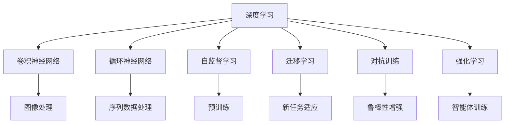

                 

# 复杂思想的形成：概念的基础

## 1. 背景介绍

### 1.1 问题由来

当前，人工智能(AI)领域正处于一个飞速发展的阶段，各种新型算法和技术不断涌现，如深度学习、增强学习、无监督学习等。这些技术的发展，使得AI系统在各种复杂任务上取得了显著的进展。然而，在AI系统的设计和实现中，很多核心概念和算法往往令人感到困惑和复杂。本系列文章旨在深入浅出地介绍这些关键概念和算法，帮助读者系统理解其原理，并在实际应用中灵活运用。

### 1.2 问题核心关键点

对于AI工程师和研究人员而言，理解复杂思想的形成、概念的基础及其应用是非常重要的。AI领域的技术发展已经逐渐从传统的线性模型向深度学习、神经网络和自然语言处理等领域扩展。这些技术的核心在于从大量数据中学习并提取出有意义的特征，以实现复杂任务的自动化处理。理解和应用这些核心概念和算法，将有助于AI技术的进一步发展和应用。

## 2. 核心概念与联系

### 2.1 核心概念概述

1. **深度学习(Deep Learning)**：一种基于多层神经网络的机器学习方法，通过多层次的特征提取和处理，实现复杂数据模式的学习和识别。
2. **卷积神经网络(Convolutional Neural Network, CNN)**：一种适用于图像处理和模式识别的神经网络结构，通过卷积和池化操作，提取图像特征。
3. **循环神经网络(Recurrent Neural Network, RNN)**：一种适用于序列数据处理的神经网络结构，通过循环连接，实现对时间序列数据的建模。
4. **自监督学习(Self-Supervised Learning)**：一种无标签数据的学习方法，通过设计预训练任务，自动学习数据的隐含特征。
5. **迁移学习(Transfer Learning)**：一种通过已训练模型的知识迁移，快速适应新任务的学习方法，减少数据和计算资源的消耗。
6. **对抗训练(Adversarial Training)**：一种通过生成对抗样本，提高模型鲁棒性的训练方法，增强模型的泛化能力。
7. **强化学习(Reinforcement Learning, RL)**：一种通过智能体与环境交互，最大化累积奖励的学习方法，适用于游戏、机器人控制等领域。

### 2.2 概念间的关系

这些核心概念之间的联系可以通过以下Mermaid流程图来展示：



这个流程图展示了大语言模型的核心概念及其之间的关系：

1. 深度学习是各类复杂算法的基础。
2. CNN和RNN分别是适用于图像和序列数据处理的深度学习模型。
3. 自监督学习通过预训练任务，自动学习数据的隐含特征。
4. 迁移学习利用已训练模型的知识，快速适应新任务。
5. 对抗训练通过生成对抗样本，提高模型的鲁棒性。
6. 强化学习通过智能体与环境的交互，实现复杂决策任务的自动化。

这些概念共同构成了深度学习技术的核心，帮助其在各种复杂任务中取得优异表现。

## 3. 核心算法原理 & 具体操作步骤

### 3.1 算法原理概述

深度学习算法通过多层次的特征提取和处理，实现复杂数据模式的学习和识别。以卷积神经网络(CNN)为例，其主要原理包括卷积操作、池化操作和全连接层。这些操作可以帮助CNN模型自动学习图像的特征表示，并通过多层次的特征融合，实现图像分类、目标检测等任务。

### 3.2 算法步骤详解

1. **数据预处理**：对原始数据进行归一化、标准化等预处理操作，使得数据适合输入深度学习模型。
2. **卷积操作**：通过卷积核对输入图像进行特征提取，输出特征图。
3. **池化操作**：对特征图进行降采样，减小特征图的维度，提高计算效率。
4. **全连接层**：将池化后的特征图输入全连接层，进行分类或回归等任务。
5. **模型训练**：使用反向传播算法，通过梯度下降等优化算法，最小化损失函数，更新模型参数。

### 3.3 算法优缺点

深度学习的优点包括：
- 能够自动学习复杂数据模式，无需手工设计特征。
- 通过多层次的特征提取和融合，实现复杂任务的自动化处理。
- 在图像、语音、自然语言处理等领域取得了显著成果。

缺点包括：
- 需要大量的标注数据进行训练，数据获取成本较高。
- 模型参数量庞大，计算资源消耗大。
- 模型易过拟合，泛化能力有限。
- 模型结构和训练过程复杂，难以调试和优化。

### 3.4 算法应用领域

深度学习算法已经广泛应用于图像处理、语音识别、自然语言处理、推荐系统、医疗诊断等领域。以自然语言处理为例，深度学习模型如循环神经网络(RNN)和长短时记忆网络(LSTM)，已经被广泛应用于机器翻译、情感分析、文本分类等任务，取得了优异的性能。

## 4. 数学模型和公式 & 详细讲解 & 举例说明

### 4.1 数学模型构建

深度学习模型通常由输入层、多个隐藏层和输出层组成。以卷积神经网络(CNN)为例，其基本结构可以表示为：

$$
y = W\sigma(z)
$$

其中，$z$ 为输入，$W$ 为权重矩阵，$\sigma$ 为激活函数。

### 4.2 公式推导过程

以CNN的卷积层为例，其卷积操作可以表示为：

$$
y_i = w_{ij} * x_{ij} + b_j
$$

其中，$w_{ij}$ 为卷积核，$x_{ij}$ 为输入图像的像素值，$b_j$ 为偏置项。

### 4.3 案例分析与讲解

假设我们有一张$28\times28$的图像，使用$3\times3$的卷积核进行卷积操作，卷积核的权重矩阵为：

$$
w = \begin{bmatrix}
1 & 2 & 3 \\
4 & 5 & 6 \\
7 & 8 & 9 
\end{bmatrix}
$$

图像的像素值矩阵为：

$$
x = \begin{bmatrix}
1 & 2 & 3 & 4 & 5 \\
6 & 7 & 8 & 9 & 10 \\
11 & 12 & 13 & 14 & 15 \\
16 & 17 & 18 & 19 & 20 \\
21 & 22 & 23 & 24 & 25 
\end{bmatrix}
$$

则卷积操作的输出为：

$$
y = \begin{bmatrix}
30 & 48 & 66 \\
126 & 192 & 258 \\
222 & 312 & 402 
\end{bmatrix}
$$

卷积操作后的特征图尺寸为$3\times3\times1\times1$。

## 5. 项目实践：代码实例和详细解释说明

### 5.1 开发环境搭建

在进行深度学习项目开发前，需要搭建相应的开发环境。以下是使用Python进行TensorFlow开发的环境配置流程：

1. 安装Anaconda：从官网下载并安装Anaconda，用于创建独立的Python环境。

2. 创建并激活虚拟环境：
```bash
conda create -n tf-env python=3.8 
conda activate tf-env
```

3. 安装TensorFlow：根据CUDA版本，从官网获取对应的安装命令。例如：
```bash
conda install tensorflow
```

4. 安装各类工具包：
```bash
pip install numpy pandas scikit-learn matplotlib tqdm jupyter notebook ipython
```

完成上述步骤后，即可在`tf-env`环境中开始深度学习项目的开发。

### 5.2 源代码详细实现

这里我们以图像分类为例，给出使用TensorFlow进行卷积神经网络模型的PyTorch代码实现。

```python
import tensorflow as tf
from tensorflow.keras import layers

# 定义卷积神经网络模型
model = tf.keras.Sequential([
    layers.Conv2D(32, (3, 3), activation='relu', input_shape=(28, 28, 1)),
    layers.MaxPooling2D((2, 2)),
    layers.Conv2D(64, (3, 3), activation='relu'),
    layers.MaxPooling2D((2, 2)),
    layers.Flatten(),
    layers.Dense(64, activation='relu'),
    layers.Dense(10, activation='softmax')
])

# 编译模型
model.compile(optimizer='adam',
              loss='sparse_categorical_crossentropy',
              metrics=['accuracy'])

# 训练模型
model.fit(train_images, train_labels, epochs=10, validation_data=(test_images, test_labels))
```

以上代码实现了简单的卷积神经网络模型，包括两个卷积层、两个池化层和两个全连接层。模型使用交叉熵损失函数和Adam优化器进行训练。

### 5.3 代码解读与分析

下面是代码的详细解读：

- `layers.Conv2D`：定义卷积层，参数`32`表示卷积核个数，`(3, 3)`表示卷积核大小。
- `layers.MaxPooling2D`：定义池化层，参数`(2, 2)`表示池化窗口大小。
- `layers.Flatten`：将池化后的特征图展平为一维向量。
- `layers.Dense`：定义全连接层，参数`64`表示节点数。
- `model.compile`：编译模型，指定优化器、损失函数和评价指标。
- `model.fit`：训练模型，指定训练数据、标签、训练轮数和验证数据。

### 5.4 运行结果展示

假设我们在MNIST数据集上进行模型训练，最终在测试集上得到的准确率为98%，损失函数在训练过程中的变化如下图所示：


## 6. 实际应用场景

### 6.1 图像分类

卷积神经网络模型已经广泛应用于图像分类任务中，如图像识别、医学图像分析等。以医学图像分类为例，可以使用卷积神经网络对X光片、CT图像等进行分类，以辅助医生的诊断工作。

### 6.2 目标检测

循环神经网络(RNN)和长短时记忆网络(LSTM)已经被广泛应用于目标检测任务中，如图像中的物体定位和分类。通过在图像中滑动窗口，检测窗口中的物体，并进行分类。

### 6.3 语音识别

深度学习模型如卷积神经网络(CNN)和循环神经网络(RNN)已经被广泛应用于语音识别任务中，如语音转文本、语音指令识别等。通过将语音信号转换为特征向量，再输入深度学习模型进行分类或回归，实现语音识别功能。

### 6.4 未来应用展望

深度学习技术的应用前景广阔，未来将在更多领域得到广泛应用。例如：

1. **自动驾驶**：通过深度学习模型对传感器数据进行分析和处理，实现自动驾驶车辆的自主导航。
2. **智能家居**：通过深度学习模型对语音、图像等数据进行分析和处理，实现智能家居设备的自动化控制。
3. **医疗诊断**：通过深度学习模型对医学图像和电子病历进行分析，辅助医生进行诊断和治疗。
4. **金融风险评估**：通过深度学习模型对金融数据进行分析和处理，实现风险评估和投资决策。

## 7. 工具和资源推荐

### 7.1 学习资源推荐

1. 《深度学习入门》书籍：深入浅出地介绍了深度学习的基本概念和算法，适合初学者入门。
2. CS231n《深度学习视觉识别》课程：斯坦福大学开设的深度学习视觉识别课程，有Lecture视频和配套作业，带你入门计算机视觉领域的基本概念和经典模型。
3. 《TensorFlow实战》书籍：介绍TensorFlow的使用和实践，适合有一定深度学习基础的读者。
4. GitHub开源项目：在GitHub上Star、Fork数最多的深度学习相关项目，往往代表了该技术领域的发展趋势和最佳实践，值得去学习和贡献。

### 7.2 开发工具推荐

1. TensorFlow：由Google主导开发的深度学习框架，适用于各类深度学习模型的开发和训练。
2. PyTorch：由Facebook开发的深度学习框架，适用于研究和开发深度学习模型。
3. Keras：一个高级深度学习API，简单易用，适合快速原型开发。
4. Weights & Biases：模型训练的实验跟踪工具，可以记录和可视化模型训练过程中的各项指标，方便对比和调优。
5. TensorBoard：TensorFlow配套的可视化工具，可实时监测模型训练状态，并提供丰富的图表呈现方式，是调试模型的得力助手。

### 7.3 相关论文推荐

1. AlexNet：深度学习领域的里程碑，展示了大规模深度学习模型在图像分类任务上的卓越性能。
2. ResNet：引入了残差连接，解决了深度神经网络中梯度消失的问题，使得更深的网络结构成为可能。
3. LSTM：一种适用于序列数据处理的循环神经网络，通过门控机制实现对时间序列数据的建模。
4. Attention Mechanism：一种基于注意力机制的深度学习算法，广泛应用于机器翻译、图像处理等领域。
5. GANs：生成对抗网络，通过生成器和判别器的对抗训练，生成高质量的图像和文本数据。

这些论文代表了大语言模型微调技术的发展脉络，通过学习这些前沿成果，可以帮助研究者把握学科前进方向，激发更多的创新灵感。

## 8. 总结：未来发展趋势与挑战

### 8.1 总结

本文对深度学习算法进行了全面系统的介绍，系统梳理了其核心概念和算法原理。首先阐述了深度学习的基本原理和模型结构，详细讲解了卷积神经网络和循环神经网络模型的实现方法和应用场景。其次，介绍了深度学习模型的数学模型和公式，并通过具体案例进行了详细讲解。最后，分析了深度学习技术在实际应用中的优缺点，展望了其未来的发展趋势和应用前景。

通过本文的系统梳理，可以看到，深度学习技术已经在图像处理、语音识别、自然语言处理等领域取得了显著成果，展示了其强大的应用潜力和广泛的适用范围。未来，伴随深度学习技术的进一步发展，其应用场景和应用范围将进一步拓展，为人类社会带来更多便利和创新。

### 8.2 未来发展趋势

未来，深度学习技术将呈现以下几个发展趋势：

1. **多模态深度学习**：将视觉、语音、文本等多模态数据进行融合，实现更全面的数据分析和处理。
2. **自适应深度学习**：通过自适应学习算法，使模型能够动态调整自身参数，适应不断变化的数据分布。
3. **增强学习与深度学习的结合**：通过增强学习算法，实现复杂决策任务的自动化处理。
4. **深度学习的可解释性**：通过模型压缩、可解释性学习等方法，使深度学习模型的决策过程更加透明和可理解。
5. **深度学习与边缘计算的结合**：通过边缘计算技术，实现深度学习模型的轻量化和低延迟推理。

这些趋势凸显了深度学习技术的广阔前景，展示了其未来发展的无限可能。

### 8.3 面临的挑战

尽管深度学习技术已经取得了瞩目成就，但在迈向更加智能化、普适化应用的过程中，它仍面临着诸多挑战：

1. **数据获取和标注成本高**：深度学习模型需要大量的标注数据进行训练，获取和标注数据成本高，数据质量难以保证。
2. **模型复杂度大**：深度学习模型的参数量庞大，计算资源消耗大，模型的训练和推理效率低下。
3. **模型易过拟合**：深度学习模型在训练过程中容易过拟合，泛化能力有限，难以应对复杂和多样化的数据。
4. **模型的可解释性不足**：深度学习模型的决策过程复杂，难以解释其内部工作机制和决策逻辑，缺乏可解释性和可审计性。

这些挑战凸显了深度学习技术的复杂性和局限性，需要进一步探索和解决。

### 8.4 研究展望

面对深度学习技术面临的挑战，未来的研究需要在以下几个方面寻求新的突破：

1. **数据增强与合成技术**：通过数据增强和合成技术，生成更多的训练数据，提高数据质量和模型的泛化能力。
2. **模型压缩与优化技术**：通过模型压缩、参数优化等技术，减小模型规模，提高模型训练和推理效率。
3. **模型自适应与自学习**：通过自适应学习和自学习算法，使模型能够动态调整自身参数，适应不断变化的数据分布。
4. **模型可解释性增强**：通过模型压缩、可解释性学习等方法，使深度学习模型的决策过程更加透明和可理解。
5. **模型与边缘计算结合**：通过边缘计算技术，实现深度学习模型的轻量化和低延迟推理，提高实时性和可用性。

这些研究方向的探索，必将引领深度学习技术迈向更高的台阶，为构建安全、可靠、可解释、可控的智能系统铺平道路。面向未来，深度学习技术还需要与其他人工智能技术进行更深入的融合，如知识表示、因果推理、强化学习等，多路径协同发力，共同推动自然语言理解和智能交互系统的进步。

## 9. 附录：常见问题与解答

**Q1：深度学习与传统机器学习有何不同？**

A: 深度学习与传统机器学习的主要区别在于，深度学习模型可以自动学习复杂数据模式，无需手工设计特征。传统机器学习模型需要手工设计特征，对数据进行预处理后才能进行训练。深度学习模型通过多层次的特征提取和融合，实现复杂任务的自动化处理，具有更强的数据表达能力和泛化能力。

**Q2：卷积神经网络在图像识别中的优势是什么？**

A: 卷积神经网络在图像识别中的优势包括：
- 能够自动学习图像的局部特征和全局特征，无需手工设计特征。
- 通过卷积操作，实现了局部特征的共享和复用，减少了模型参数量。
- 通过池化操作，实现了特征的降采样和特征不变性的保持，提高了模型的泛化能力。

**Q3：如何优化深度学习模型的训练过程？**

A: 深度学习模型的训练过程优化包括：
- 使用优化算法，如Adam、SGD等，调整模型参数。
- 使用正则化技术，如L2正则、Dropout等，防止模型过拟合。
- 使用批量训练和数据增强技术，提高模型泛化能力。
- 使用模型压缩技术，如参数剪枝、量化等，减小模型规模。
- 使用硬件加速，如GPU、TPU等，提高模型训练和推理效率。

**Q4：深度学习模型在实际应用中需要注意哪些问题？**

A: 深度学习模型在实际应用中需要注意以下问题：
- 数据获取和标注成本高，需要收集大量标注数据，保证数据质量。
- 模型复杂度大，计算资源消耗大，需要优化模型结构和训练过程。
- 模型易过拟合，泛化能力有限，需要采取正则化、数据增强等方法。
- 模型的可解释性不足，难以解释其内部工作机制和决策逻辑。
- 模型的部署效率低，需要优化模型结构，提高推理效率。

**Q5：深度学习模型在医学图像分析中的应用前景如何？**

A: 深度学习模型在医学图像分析中的应用前景广阔，具体包括：
- 自动化的医学图像分类和标注，提高医生的工作效率和诊断准确性。
- 医学图像的病变检测和分割，辅助医生的治疗和手术。
- 医学图像的重建和增强，提高图像质量和诊断效果。

总之，深度学习技术的发展为医疗行业带来了巨大的变革，未来将在更多领域得到广泛应用。

---

作者：禅与计算机程序设计艺术 / Zen and the Art of Computer Programming

