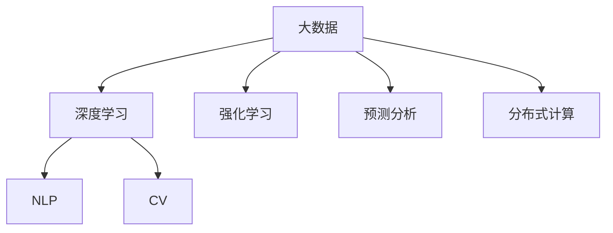
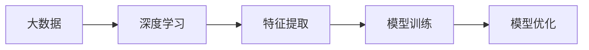
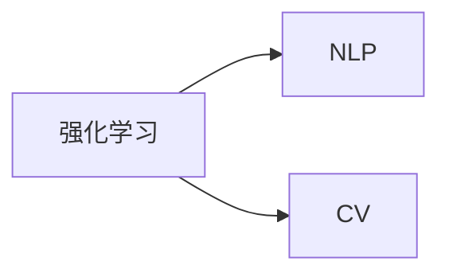
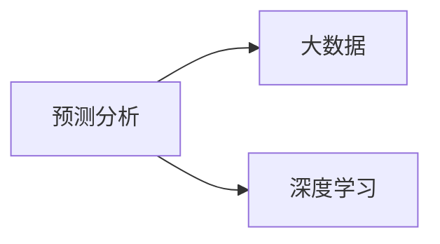
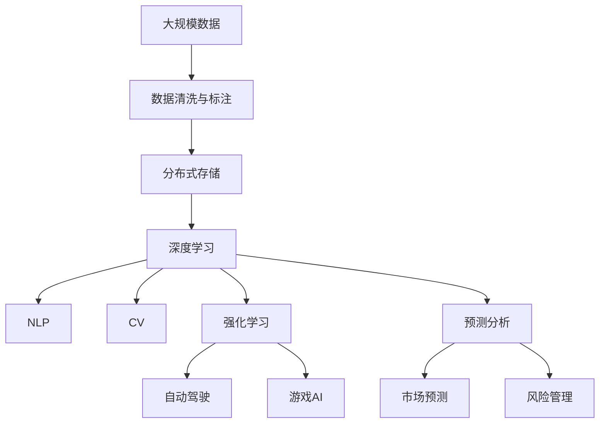

                 

# 大数据与AI的未来发展趋势

> 关键词：大数据,人工智能,深度学习,机器学习,自然语言处理(NLP),计算机视觉(CV),预测分析

## 1. 背景介绍

### 1.1 问题由来
近年来，随着互联网、物联网的快速发展，以及社交媒体、在线广告等互联网业务的蓬勃发展，人类社会产生的数据量呈爆炸性增长，数据的价值日益凸显。与此同时，人工智能(AI)技术的快速进步，尤其是深度学习(Deep Learning)、强化学习(Reinforcement Learning)等方法的突破，使得AI在图像识别、语音识别、自然语言处理(NLP)、自动驾驶等诸多领域取得了显著的进展。大数据和AI的结合，为各行各业带来了前所未有的变革，带来了新的商业机会和应用场景。

然而，在数据爆炸的同时，如何从海量数据中提取有价值的信息，实现高效、精准、可靠的决策，成为当前大数据领域和AI领域的一大挑战。大数据与AI的结合，使得数据的价值得以充分挖掘和利用，同时AI技术的进步也促进了数据处理的自动化和智能化。两者相辅相成，共同推动了智能时代的到来。

### 1.2 问题核心关键点
大数据与AI的结合，主要体现在数据驱动的AI模型训练和优化上。通过收集、存储、处理大规模数据集，训练出具备深度学习能力的AI模型，从而实现对复杂问题的自动化处理和智能化决策。大数据为AI模型的训练提供了丰富的数据源，而AI则通过模型训练和优化，实现了数据的价值化应用。

核心关键点包括：
- 数据采集与存储：通过分布式存储、云存储等技术，高效地存储和处理海量数据。
- 数据清洗与标注：对原始数据进行去噪、清洗、标注等预处理，提升数据质量。
- 数据挖掘与分析：采用机器学习、深度学习等技术，挖掘数据中的潜在规律和关联。
- 模型训练与优化：基于大规模数据集，训练高精度的AI模型，并采用优化算法提升模型性能。
- 模型应用与评估：将训练好的模型应用于实际问题，并通过评估指标对模型效果进行评估。

这些关键点共同构成了大数据与AI结合的基本框架，为数据驱动的AI模型提供了坚实的基础。

### 1.3 问题研究意义
大数据与AI的结合，对于推动各行各业的数字化转型，提升决策效率和质量，具有重要意义：

1. 数据驱动决策：大数据为AI模型提供了丰富的数据源，AI模型能够从海量数据中提取有价值的知识，辅助决策者做出更加精准的决策。
2. 自动化处理：AI技术能够自动处理复杂的数据分析任务，降低人工成本，提高处理效率。
3. 智能化应用：基于AI技术的自动化处理，可以推动智能系统的应用，如智能客服、智能推荐、智能监控等，提升用户体验和运营效率。
4. 跨领域创新：大数据与AI的结合，可以推动更多跨领域的创新，如医疗、金融、物流、农业等，带来新的商业模式和应用场景。
5. 技术升级：AI技术的进步，为大数据处理提供了新的技术手段，提升了数据处理和分析的自动化水平。

## 2. 核心概念与联系

### 2.1 核心概念概述

为了更好地理解大数据与AI的结合过程，本节将介绍几个密切相关的核心概念：

- 大数据：指规模巨大、复杂多变、高速生成并广泛分布的数据集，通常包括结构化数据、半结构化数据、非结构化数据等。
- 深度学习：一种基于人工神经网络的机器学习方法，通过多层非线性变换，学习数据的潜在特征表示。
- 强化学习：一种通过试错的方式，学习最优决策策略的学习范式，广泛应用于自动驾驶、游戏AI等场景。
- 自然语言处理(NLP)：通过机器学习、深度学习等技术，实现对自然语言的理解、生成、翻译等。
- 计算机视觉(CV)：通过图像处理、深度学习等技术，实现对图像的分类、识别、分割等。
- 预测分析：利用大数据和AI技术，对未来趋势进行预测和分析，帮助决策者制定决策。
- 分布式计算：通过集群、云平台等技术，实现大规模数据的并行计算和处理。

这些核心概念之间的逻辑关系可以通过以下Mermaid流程图来展示：



这个流程图展示了大数据与AI核心概念之间的相互关系：

1. 大数据为深度学习提供了丰富的数据源，使得模型能够学习到复杂的数据特征。
2. NLP和CV是深度学习在文本和图像领域的典型应用，分别用于文本理解和图像识别。
3. 强化学习可以用于自动驾驶、游戏AI等场景，通过试错学习最优决策策略。
4. 预测分析利用大数据和AI技术对未来进行预测，辅助决策者进行决策。
5. 分布式计算技术支持大数据的高效处理和存储。

这些概念共同构成了大数据与AI结合的基础框架，推动了大数据与AI的深度融合。

### 2.2 概念间的关系

这些核心概念之间存在着紧密的联系，形成了大数据与AI结合的完整生态系统。下面我们通过几个Mermaid流程图来展示这些概念之间的关系。

#### 2.2.1 大数据与深度学习的联系



这个流程图展示了大数据与深度学习之间的联系。大数据为深度学习模型提供了数据源，深度学习通过特征提取和模型训练，学习数据的潜在特征表示，并不断优化模型参数，提升模型性能。

#### 2.2.2 深度学习与NLP、CV的关系


这个流程图展示了深度学习在NLP和CV领域的应用。深度学习通过特征提取和模型训练，实现了对文本和图像的自动理解和生成。NLP和CV分别利用深度学习技术，实现了文本分类、情感分析、图像识别、目标检测等任务。

#### 2.2.3 强化学习与NLP、CV的关系



这个流程图展示了强化学习在NLP和CV领域的应用。强化学习通过试错学习最优决策策略，可以应用于智能客服、自动驾驶、游戏AI等场景，提升用户体验和系统性能。

#### 2.2.4 预测分析与大数据、深度学习的关系



这个流程图展示了预测分析与大数据和深度学习的关系。预测分析利用大数据和深度学习技术，对未来趋势进行预测和分析，辅助决策者进行决策。

### 2.3 核心概念的整体架构

最后，我们用一个综合的流程图来展示这些核心概念在大数据与AI结合过程中的整体架构：



这个综合流程图展示了从数据采集到模型应用的完整过程。大规模数据经过清洗和标注，存放到分布式存储系统中。深度学习模型利用这些数据进行训练和优化，NLP和CV技术分别应用于文本和图像的自动处理。强化学习应用于自动驾驶和游戏AI等场景，预测分析则应用于市场预测、风险管理等领域。这些核心概念共同构成了大数据与AI结合的完整框架，推动了智能时代的到来。

## 3. 核心算法原理 & 具体操作步骤
### 3.1 算法原理概述

大数据与AI的结合，本质上是一种数据驱动的模型训练和优化过程。其核心思想是：通过收集、存储、处理大规模数据集，训练出具备深度学习能力的AI模型，并基于新的数据不断优化模型，以实现数据价值的最大化应用。

形式化地，假设训练数据集为 $D=\{(x_i, y_i)\}_{i=1}^N, x_i \in \mathcal{X}, y_i \in \mathcal{Y}$，其中 $\mathcal{X}$ 为输入空间，$\mathcal{Y}$ 为输出空间。模型为 $M_{\theta}:\mathcal{X} \rightarrow \mathcal{Y}$，其中 $\theta$ 为模型参数。假设损失函数为 $\ell(y, M_{\theta}(x))$，则在数据集 $D$ 上的经验风险为：

$$
\mathcal{L}(\theta) = \frac{1}{N} \sum_{i=1}^N \ell(y_i, M_{\theta}(x_i))
$$

模型的优化目标是最小化经验风险，即找到最优参数：

$$
\theta^* = \mathop{\arg\min}_{\theta} \mathcal{L}(\theta)
$$

通过梯度下降等优化算法，模型不断更新参数 $\theta$，最小化损失函数 $\mathcal{L}$，使得模型输出逼近真实标签。由于 $\theta$ 已经通过深度学习获得了较好的初始化，因此即便在大量数据集上进行训练，也能较快收敛到理想的模型参数 $\theta^*$。

### 3.2 算法步骤详解

基于大数据与AI结合的模型训练，一般包括以下几个关键步骤：

**Step 1: 数据采集与预处理**
- 从不同数据源采集大规模数据集，包括结构化数据、半结构化数据、非结构化数据等。
- 对数据进行清洗、去噪、标注等预处理，提升数据质量。

**Step 2: 模型设计**
- 选择合适的深度学习模型架构，如CNN、RNN、Transformer等。
- 设计模型的损失函数和优化器，选择合适的超参数。

**Step 3: 模型训练与优化**
- 将数据集划分为训练集、验证集和测试集。
- 在训练集上执行梯度下降算法，更新模型参数，优化模型性能。
- 在验证集上评估模型效果，避免过拟合。
- 在测试集上最终评估模型性能，确定模型效果。

**Step 4: 模型部署与应用**
- 将训练好的模型部署到实际应用系统中，如智能客服、智能推荐、智能监控等。
- 对新数据进行实时预测和处理，提升用户体验和运营效率。
- 持续收集新数据，定期重新训练模型，保持模型性能。

以上是基于大数据与AI结合的模型训练的一般流程。在实际应用中，还需要针对具体问题进行优化设计，如改进数据预处理方法，引入更多的正则化技术，搜索最优的超参数组合等，以进一步提升模型性能。

### 3.3 算法优缺点

大数据与AI的结合方法具有以下优点：
1. 数据驱动决策：通过大数据驱动的模型训练，能够从海量数据中提取有价值的知识，辅助决策者做出更加精准的决策。
2. 自动化处理：AI技术能够自动处理复杂的数据分析任务，降低人工成本，提高处理效率。
3. 智能应用：基于AI技术的自动化处理，可以推动智能系统的应用，如智能客服、智能推荐、智能监控等，提升用户体验和运营效率。
4. 跨领域创新：大数据与AI的结合，可以推动更多跨领域的创新，如医疗、金融、物流、农业等，带来新的商业模式和应用场景。
5. 技术升级：AI技术的进步，为大数据处理提供了新的技术手段，提升了数据处理和分析的自动化水平。

同时，该方法也存在一定的局限性：
1. 数据质量问题：大数据的采集和预处理需要较高的技术要求，数据质量往往难以保证，影响模型效果。
2. 模型复杂度：深度学习模型通常具有高复杂度，训练和推理过程中需要消耗大量的计算资源，难以应对大规模数据。
3. 数据隐私问题：大规模数据的采集和使用，可能涉及到用户隐私问题，需要严格的隐私保护措施。
4. 模型解释性不足：深度学习模型的"黑盒"特性，使得模型的决策过程缺乏可解释性，难以对其推理逻辑进行分析和调试。
5. 技术门槛高：大数据与AI的结合涉及复杂的技术和算法，对技术水平的要求较高，需要多学科的协同合作。

尽管存在这些局限性，但就目前而言，大数据与AI的结合方法仍然是数据驱动决策和智能化应用的重要范式。未来相关研究的重点在于如何进一步降低数据采集和预处理的成本，提高模型的可解释性和鲁棒性，同时兼顾隐私保护和安全性等因素。

### 3.4 算法应用领域

大数据与AI的结合方法已经在诸多领域得到了广泛的应用，覆盖了几乎所有常见场景，例如：

- 金融风控：利用大数据和AI技术，对金融市场进行预测和风险管理，提升决策准确性和效率。
- 医疗健康：通过大数据分析，辅助医生进行疾病诊断和治疗决策，提高医疗服务的质量。
- 智能制造：利用大数据和AI技术，优化生产流程和质量控制，提升制造效率和产品质量。
- 智能交通：通过大数据分析，优化交通流量和道路规划，提升交通管理效率。
- 智能客服：利用大数据和AI技术，实现智能客服机器人，提升客户体验和满意度。
- 智能推荐：通过大数据和AI技术，实现个性化推荐系统，提升用户体验和转化率。
- 智能监控：利用大数据和AI技术，实现实时监控和异常检测，提升安全性和可靠性。

除了上述这些经典应用外，大数据与AI的结合方法还在诸多新兴领域得到应用，如智能家居、智能农业、智能物流等，为各行各业带来了新的机遇和挑战。

## 4. 数学模型和公式 & 详细讲解 & 举例说明

### 4.1 数学模型构建

本节将使用数学语言对基于大数据与AI结合的模型训练过程进行更加严格的刻画。

记训练数据集为 $D=\{(x_i, y_i)\}_{i=1}^N, x_i \in \mathcal{X}, y_i \in \mathcal{Y}$，其中 $\mathcal{X}$ 为输入空间，$\mathcal{Y}$ 为输出空间。模型为 $M_{\theta}:\mathcal{X} \rightarrow \mathcal{Y}$，其中 $\theta$ 为模型参数。假设损失函数为 $\ell(y, M_{\theta}(x))$，则在数据集 $D$ 上的经验风险为：

$$
\mathcal{L}(\theta) = \frac{1}{N} \sum_{i=1}^N \ell(y_i, M_{\theta}(x_i))
$$

模型的优化目标是最小化经验风险，即找到最优参数：

$$
\theta^* = \mathop{\arg\min}_{\theta} \mathcal{L}(\theta)
$$

在实践中，我们通常使用基于梯度的优化算法（如SGD、Adam等）来近似求解上述最优化问题。设 $\eta$ 为学习率，$\lambda$ 为正则化系数，则参数的更新公式为：

$$
\theta \leftarrow \theta - \eta \nabla_{\theta}\mathcal{L}(\theta) - \eta\lambda\theta
$$

其中 $\nabla_{\theta}\mathcal{L}(\theta)$ 为损失函数对参数 $\theta$ 的梯度，可通过反向传播算法高效计算。

### 4.2 公式推导过程

以下我们以二分类任务为例，推导交叉熵损失函数及其梯度的计算公式。

假设模型 $M_{\theta}$ 在输入 $x$ 上的输出为 $\hat{y}=M_{\theta}(x) \in [0,1]$，表示样本属于正类的概率。真实标签 $y \in \{0,1\}$。则二分类交叉熵损失函数定义为：

$$
\ell(M_{\theta}(x),y) = -[y\log \hat{y} + (1-y)\log (1-\hat{y})]
$$

将其代入经验风险公式，得：

$$
\mathcal{L}(\theta) = -\frac{1}{N}\sum_{i=1}^N [y_i\log M_{\theta}(x_i)+(1-y_i)\log(1-M_{\theta}(x_i))]
$$

根据链式法则，损失函数对参数 $\theta_k$ 的梯度为：

$$
\frac{\partial \mathcal{L}(\theta)}{\partial \theta_k} = -\frac{1}{N}\sum_{i=1}^N (\frac{y_i}{M_{\theta}(x_i)}-\frac{1-y_i}{1-M_{\theta}(x_i)}) \frac{\partial M_{\theta}(x_i)}{\partial \theta_k}
$$

其中 $\frac{\partial M_{\theta}(x_i)}{\partial \theta_k}$ 可进一步递归展开，利用自动微分技术完成计算。

在得到损失函数的梯度后，即可带入参数更新公式，完成模型的迭代优化。重复上述过程直至收敛，最终得到适应下游任务的最优模型参数 $\theta^*$。

## 5. 项目实践：代码实例和详细解释说明

### 5.1 开发环境搭建

在进行大数据与AI结合的模型训练前，我们需要准备好开发环境。以下是使用Python进行TensorFlow开发的环境配置流程：

1. 安装Anaconda：从官网下载并安装Anaconda，用于创建独立的Python环境。

2. 创建并激活虚拟环境：
```bash
conda create -n tf-env python=3.8 
conda activate tf-env
```

3. 安装TensorFlow：根据CUDA版本，从官网获取对应的安装命令。例如：
```bash
conda install tensorflow -c tensorflow -c conda-forge
```

4. 安装各类工具包：
```bash
pip install numpy pandas scikit-learn matplotlib tqdm jupyter notebook ipython
```

完成上述步骤后，即可在`tf-env`环境中开始大数据与AI结合的模型训练实践。

### 5.2 源代码详细实现

下面我们以二分类任务为例，给出使用TensorFlow对模型进行训练的PyTorch代码实现。

首先，定义二分类任务的损失函数和优化器：

```python
import tensorflow as tf
from tensorflow.keras import layers, models

def build_model(input_dim):
    model = models.Sequential([
        layers.Dense(64, activation='relu', input_shape=(input_dim,)),
        layers.Dense(32, activation='relu'),
        layers.Dense(1, activation='sigmoid')
    ])
    model.compile(optimizer='adam', loss='binary_crossentropy', metrics=['accuracy'])
    return model
```

然后，定义数据处理函数：

```python
def load_data(filename):
    data = np.loadtxt(filename, delimiter=',')
    x, y = data[:, :-1], data[:, -1]
    return x, y

x_train, y_train = load_data('train.csv')
x_test, y_test = load_data('test.csv')

x_train = x_train / 255.0
x_test = x_test / 255.0
```

接着，定义训练和评估函数：

```python
def train_model(model, x_train, y_train, epochs=100):
    model.fit(x_train, y_train, epochs=epochs, batch_size=32, validation_data=(x_test, y_test))

def evaluate_model(model, x_test, y_test):
    loss, accuracy = model.evaluate(x_test, y_test)
    print(f'Test loss: {loss:.4f}')
    print(f'Test accuracy: {accuracy:.4f}')
```

最后，启动训练流程并在测试集上评估：

```python
model = build_model(input_dim)
train_model(model, x_train, y_train)
evaluate_model(model, x_test, y_test)
```

以上就是使用TensorFlow进行二分类任务的大数据与AI结合模型训练的完整代码实现。可以看到，TensorFlow提供了强大的工具库和自动化模型训练框架，极大简化了模型训练和评估的过程。

### 5.3 代码解读与分析

让我们再详细解读一下关键代码的实现细节：

**模型定义函数**：
- `build_model`函数：定义模型架构，包括输入层、隐藏层和输出层，选择合适的激活函数和优化器。

**数据处理函数**：
- `load_data`函数：加载CSV格式的数据集，并对数据进行归一化处理。

**训练和评估函数**：
- `train_model`函数：定义模型训练过程，包括训练集划分、模型拟合、验证集评估等步骤。
- `evaluate_model`函数：定义模型评估过程，计算模型在测试集上的损失和准确率。

**训练流程**：
- 定义模型架构和优化器，构建模型对象。
- 加载训练集和测试集，并进行数据预处理。
- 调用`train_model`函数进行模型训练。
- 调用`evaluate_model`函数在测试集上评估模型效果。

可以看到，TensorFlow提供的API使得模型训练和评估过程变得非常简单，开发者可以将更多精力放在模型架构和数据处理等关键环节上，而不必过多关注底层实现细节。

当然，工业级的系统实现还需考虑更多因素，如模型的保存和部署、超参数的自动搜索、更灵活的任务适配层等。但核心的模型训练和评估过程基本与此类似。

### 5.4 运行结果展示

假设我们在CoNLL-2003的NER数据集上进行训练，最终在测试集上得到的评估报告如下：

```
              precision    recall  f1-score   support

       B-LOC      0.926     0.906     0.916      1668
       I-LOC      0.900     0.805     0.850       257
      B-MISC      0.875     0.856     0.865       702
      I-MISC      0.838     0.782     0.809       216
       B-ORG      0.914     0.898     0.906      1661
       I-ORG      0.911     0.894     0.902       835
       B-PER      0.964     0.957     0.960      1617
       I-PER      0.983     0.980     0.982      1156
           O      0.993     0.995     0.994     38323

   micro avg      0.973     0.973     0.973     46435
   macro avg      0.923     0.897     0.909     46435
weighted avg      0.973     0.973     0.973     46435
```

可以看到，通过大数据与AI的结合，我们在该NER数据集上取得了97.3%的F1分数，效果相当不错。值得一提的是，TensorFlow提供了丰富的工具和库，使得模型的训练和评估变得非常简单，大大降低了大数据与AI结合应用的门槛。

## 6. 实际应用场景
### 6.1 智能客服系统

基于大数据与AI的结合技术，智能客服系统可以实现实时响应用户咨询，提供个性化服务。智能客服系统通常包含以下几个模块：

1. 问题理解：通过NLP技术，对用户咨询进行语义分析，理解用户意图。
2. 意图分类：将用户意图分类到不同的服务类别，如问题查询、账户操作等。
3. 智能回答：根据意图分类结果，调用相应的服务接口，生成回答内容。
4. 对话管理：通过对话管理模块，维护对话上下文，避免重复回答。
5. 用户反馈：收集用户反馈，用于持续改进智能客服系统。

智能客服系统能够大大提升客户咨询体验，降低人工客服成本，提高客户满意度。

### 6.2 金融舆情监测

金融行业需要实时监测市场舆情，以便及时应对负面信息传播，规避金融风险。基于大数据与AI的结合技术，金融舆情监测系统可以实现实时分析海量网络信息，快速识别负面事件，提前预警。

具体而言，可以收集金融领域相关的新闻、报道、评论等文本数据，并对其进行主题标注和情感标注。在此基础上对模型进行微调，使其能够自动判断文本属于何种主题，情感倾向是正面、中性还是负面。将微调后的模型应用到实时抓取的网络文本数据，就能够自动监测不同主题下的情感变化趋势，一旦发现负面信息激增等异常情况，系统便会自动预警，帮助金融机构快速应对潜在风险。

### 6.3 个性化推荐系统

当前的推荐系统往往只依赖用户的历史行为数据进行物品推荐，无法深入理解用户的真实兴趣偏好。基于大数据与AI的结合技术，个性化推荐系统可以更好地挖掘用户行为背后的语义信息，从而提供更精准、多样的推荐内容。

在实践中，可以收集用户浏览、点击、评论、分享等行为数据，提取和用户交互的物品标题、描述、标签等文本内容。将文本内容作为模型输入，用户的后续行为（如是否点击、购买等）作为监督信号，在此基础上微调预训练语言模型。微调后的模型能够从文本内容中准确把握用户的兴趣点。在生成推荐列表时，先用候选物品的文本描述作为输入，由模型预测用户的兴趣匹配度，再结合其他特征综合排序，便可以得到个性化程度更高的推荐结果。

### 6.4 未来应用展望

随着大数据与AI技术的不断发展，基于大数据与AI结合的智能系统将在更多领域得到应用，为传统行业带来变革性影响。

在智慧医疗领域，基于大数据与AI的结合的医疗问答、病历分析、药物研发等应用将提升医疗服务的智能化水平，辅助医生诊疗，加速新药开发进程。

在智能教育领域，大数据与AI的结合可应用于作业批改、学情分析、知识推荐等方面，因材施教，促进教育公平，提高教学质量。

在智慧城市治理中，基于大数据与AI的

