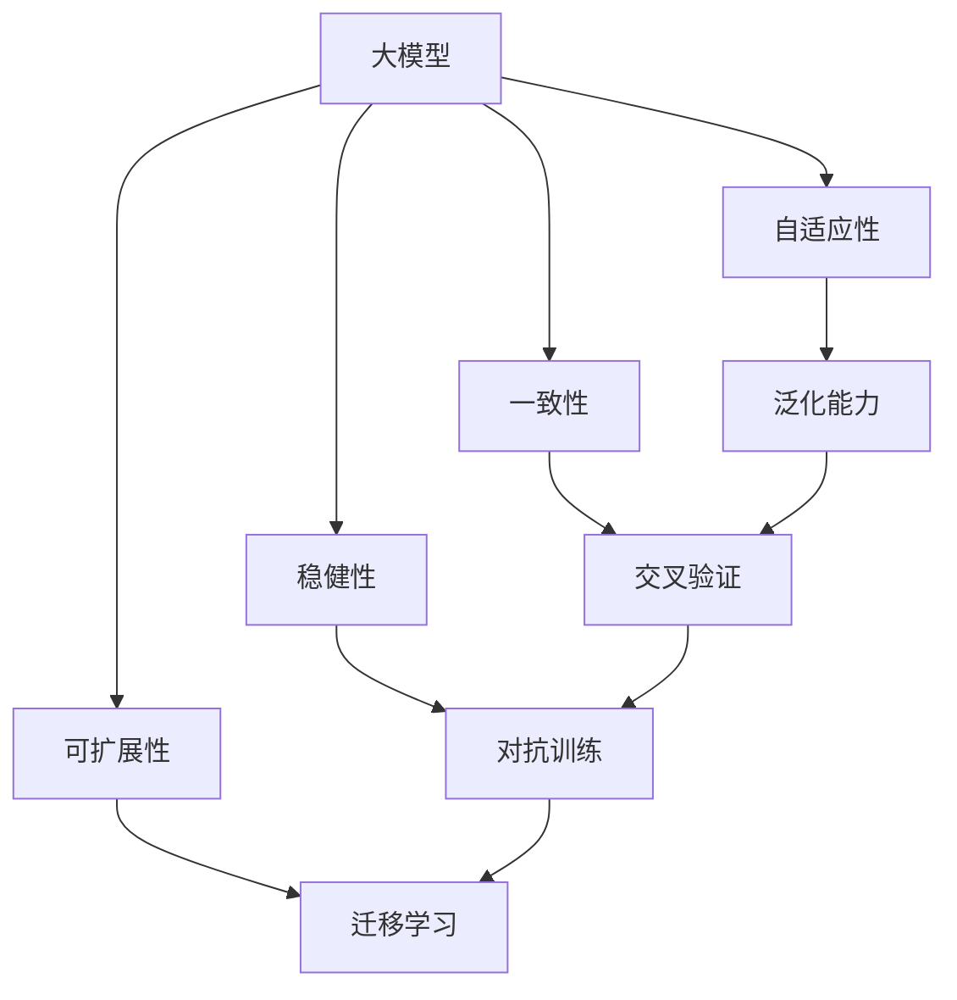

                 

# 大模型底层能力在工作流中的应用

> 关键词：大模型,工作流,自适应性,一致性,稳健性,可扩展性

## 1. 背景介绍

### 1.1 问题由来
随着深度学习技术的发展，大规模模型在各个领域的应用已经十分普遍。例如，在大规模图片分类、语音识别、自然语言处理等任务中，通过预训练模型加上少量有标签数据进行微调，就可以获得高性能的模型。然而，如何有效利用大模型的底层能力，充分发挥其在各个工作流中的作用，仍然是当前研究的一个热点问题。

大模型的底层能力，通常指的是模型在特定领域的通用性和可迁移性。通过应用这些底层能力，可以更有效地构建跨领域、跨任务的工作流，使得模型可以更好地适应不同的应用场景和数据分布。例如，在医疗领域，可以使用通用的大模型对医疗图像进行分类，然后通过微调将其应用于特定的病理诊断任务；在金融领域，可以使用大模型对文本进行情感分析，然后通过微调对金融数据进行风险评估。

### 1.2 问题核心关键点
大模型的底层能力在工作流中的应用，主要涉及以下几个关键点：
1. 如何构建具有自适应性、一致性、稳健性和可扩展性的大模型。
2. 如何在大模型的基础上，构建跨领域、跨任务的工作流，提升模型在特定任务上的性能。
3. 如何利用大模型的底层能力，提高模型在不同数据集上的泛化能力。
4. 如何处理工作流中的异常情况，提升模型的鲁棒性。

## 2. 核心概念与联系

### 2.1 核心概念概述

为更好地理解大模型底层能力在工作流中的应用，本节将介绍几个关键概念：

- 大模型：指通过在大规模无标签数据上进行预训练，学习通用的语言或图像表示的深度学习模型。
- 自适应性：指模型能够根据不同的数据和任务，自动调整其参数和结构，以适应新的任务和数据分布。
- 一致性：指模型在不同数据集和任务上，能够保持一致的性能表现。
- 稳健性：指模型对于数据和任务的扰动具有较强的抵抗能力，能够保持稳定和可靠的输出。
- 可扩展性：指模型可以方便地扩展到更多的数据和任务，具有较高的通用性。

这些概念之间存在紧密的联系，形成了一个完整的大模型底层能力体系。通过这些能力，大模型能够在不同的工作流中发挥其潜力，提升模型的应用效果和性能表现。

### 2.2 概念间的关系

这些核心概念之间的关系可以通过以下Mermaid流程图来展示：



这个流程图展示了大模型底层能力与各个关键概念之间的关系：

1. 自适应性使得模型能够适应新的数据和任务，提升模型的泛化能力。
2. 一致性通过交叉验证等方法，确保模型在不同数据集上的性能表现一致。
3. 稳健性通过对抗训练等技术，增强模型对异常情况的抵抗能力。
4. 可扩展性通过迁移学习等方法，使得模型可以方便地应用于不同的数据和任务。

这些概念共同构成了大模型底层能力在工作流中的应用框架，使其能够在各种场景下发挥强大的底层能力。通过理解这些概念，我们可以更好地把握大模型的应用方向和优化方向。

## 3. 核心算法原理 & 具体操作步骤
### 3.1 算法原理概述

大模型底层能力在工作流中的应用，主要是通过迁移学习、自适应性学习、对抗训练等技术实现的。这些技术旨在提升模型的泛化能力、鲁棒性和通用性，使其在不同数据集和任务上具有稳定的表现。

迁移学习是指将模型在源任务上学习到的知识迁移到目标任务上，通过微调提高模型在目标任务上的性能。自适应性学习是指模型能够根据新的数据和任务，自动调整其参数和结构，以适应新的应用场景。对抗训练是指通过引入对抗样本，增强模型的鲁棒性，使其能够应对数据和任务的变化。

### 3.2 算法步骤详解

以下是一个典型的工作流，包括迁移学习、自适应性学习和对抗训练等技术的应用：

1. **数据准备**：收集并整理工作流中所需的数据，包括源任务和目标任务的数据集。

2. **模型选择**：选择预训练的通用大模型，如BERT、GPT等，作为模型的初始化参数。

3. **迁移学习**：在源任务上对大模型进行微调，使其适应源任务。

4. **自适应性学习**：在目标任务上对微调后的模型进行自适应性学习，使其能够自动调整参数和结构，以适应新的数据和任务。

5. **对抗训练**：在目标任务上引入对抗样本，增强模型的鲁棒性，使其能够应对数据和任务的扰动。

6. **测试和评估**：在目标任务上对模型进行测试和评估，评估模型的性能表现。

### 3.3 算法优缺点

基于大模型底层能力在工作流中的应用，具有以下优点：

1. 提升模型的泛化能力：通过迁移学习、自适应性学习和对抗训练等技术，模型可以更好地适应不同的数据和任务，提升模型的泛化能力。
2. 提高模型的鲁棒性：通过对抗训练等技术，模型能够应对数据和任务的扰动，提高模型的鲁棒性。
3. 降低训练成本：通过迁移学习，模型可以在源任务上学习到通用的知识，减少目标任务的训练成本。
4. 提升模型的可扩展性：通过自适应性学习，模型可以方便地扩展到更多的数据和任务，提高模型的可扩展性。

同时，该方法也存在一些局限性：

1. 需要大量的标注数据：迁移学习需要大量的标注数据，获取高质量标注数据的成本较高。
2. 对数据分布的依赖性：模型对于数据分布的依赖性较强，当数据分布差异较大时，模型性能可能下降。
3. 模型的计算复杂度较高：大模型计算复杂度较高，需要较高的计算资源。

尽管存在这些局限性，但就目前而言，基于大模型底层能力在工作流中的应用，仍是模型优化和应用的重要方向。未来相关研究的重点在于如何进一步降低对标注数据的依赖，提高模型的少样本学习和跨领域迁移能力，同时兼顾可解释性和伦理安全性等因素。

### 3.4 算法应用领域

基于大模型底层能力在工作流中的应用，已经在各个领域得到了广泛的应用，例如：

1. 自然语言处理：使用BERT、GPT等大模型进行文本分类、情感分析、机器翻译等任务，通过迁移学习、自适应性学习和对抗训练等技术，提升模型的性能。
2. 计算机视觉：使用VGG、ResNet等大模型进行图像分类、目标检测等任务，通过迁移学习、自适应性学习和对抗训练等技术，提升模型的鲁棒性和泛化能力。
3. 语音识别：使用Wav2Vec、Deformable DET等大模型进行语音识别和语音生成等任务，通过迁移学习、自适应性学习和对抗训练等技术，提升模型的性能。
4. 医疗影像：使用大模型进行医学图像的分类、分割等任务，通过迁移学习、自适应性学习和对抗训练等技术，提升模型的鲁棒性和泛化能力。
5. 金融数据：使用大模型进行金融数据的预测、风险评估等任务，通过迁移学习、自适应性学习和对抗训练等技术，提升模型的鲁棒性和泛化能力。

除了上述这些经典应用外，大模型底层能力在工作流中的应用，还将不断拓展到更多领域，如智慧城市、智能制造、智能交通等，为各行各业带来变革性影响。

## 4. 数学模型和公式 & 详细讲解 & 举例说明

### 4.1 数学模型构建

本节将使用数学语言对大模型底层能力在工作流中的应用进行更加严格的刻画。

记预训练语言模型为 $M_{\theta}$，其中 $\theta$ 为预训练得到的模型参数。假设目标任务为 $T$，数据集为 $D=\{(x_i, y_i)\}_{i=1}^N$，其中 $x_i$ 为输入，$y_i$ 为目标任务标签。

定义模型 $M_{\theta}$ 在输入 $x$ 上的输出为 $M_{\theta}(x)$，目标任务上的损失函数为 $\ell(M_{\theta}(x), y)$。目标任务的迁移学习过程可以表示为：

$$
\min_{\theta} \frac{1}{N} \sum_{i=1}^N \ell(M_{\theta}(x_i), y_i) + \alpha L_{src}(\theta)
$$

其中 $L_{src}$ 为源任务的损失函数，$\alpha$ 为迁移学习的超参数，控制迁移学习的重要性。

### 4.2 公式推导过程

以下我们以图像分类任务为例，推导迁移学习过程的数学公式。

假设模型 $M_{\theta}$ 在输入 $x$ 上的输出为 $M_{\theta}(x) \in [0,1]$，表示样本属于正类的概率。真实标签 $y \in \{0,1\}$。则二分类交叉熵损失函数定义为：

$$
\ell(M_{\theta}(x),y) = -[y\log M_{\theta}(x) + (1-y)\log(1-M_{\theta}(x))]
$$

将其代入经验风险公式，得：

$$
\mathcal{L}(\theta) = -\frac{1}{N}\sum_{i=1}^N [y_i\log M_{\theta}(x_i)+(1-y_i)\log(1-M_{\theta}(x_i))]
$$

在目标任务上，定义迁移学习的损失函数为：

$$
\mathcal{L}_{src}(\theta) = \frac{1}{M}\sum_{i=1}^M \ell(M_{\theta}(x_i), y_i)
$$

其中 $M$ 为源任务的样本数。则目标任务上的迁移学习目标函数为：

$$
\min_{\theta} \frac{1}{N} \sum_{i=1}^N \ell(M_{\theta}(x_i), y_i) + \alpha \frac{1}{M}\sum_{i=1}^M \ell(M_{\theta}(x_i), y_i)
$$

通过求解该目标函数，可以最小化目标任务上的损失，同时保留源任务上的泛化能力。

### 4.3 案例分析与讲解

假设我们有一个预训练的BERT模型，将其应用于医学影像分类任务。数据集包含500个样本，其中100个为正常样本，400个为异常样本。

1. **数据准备**：准备预训练BERT模型和目标任务数据集。

2. **模型选择**：选择预训练的BERT模型，作为模型的初始化参数。

3. **迁移学习**：在目标任务上对BERT模型进行微调，使其适应医学影像分类任务。

4. **自适应性学习**：在目标任务上对微调后的模型进行自适应性学习，使其能够自动调整参数和结构，以适应新的数据和任务。

5. **对抗训练**：在目标任务上引入对抗样本，增强模型的鲁棒性，使其能够应对数据和任务的扰动。

6. **测试和评估**：在目标任务上对模型进行测试和评估，评估模型的性能表现。

通过上述过程，我们可以在目标任务上构建高性能的医学影像分类模型，提升模型的泛化能力、鲁棒性和可扩展性。

## 5. 项目实践：代码实例和详细解释说明
### 5.1 开发环境搭建

在进行工作流优化实践前，我们需要准备好开发环境。以下是使用Python进行TensorFlow开发的环境配置流程：

1. 安装Anaconda：从官网下载并安装Anaconda，用于创建独立的Python环境。

2. 创建并激活虚拟环境：
```bash
conda create -n tf-env python=3.8 
conda activate tf-env
```

3. 安装TensorFlow：根据CUDA版本，从官网获取对应的安装命令。例如：
```bash
conda install tensorflow tensorflow-gpu -c conda-forge
```

4. 安装各类工具包：
```bash
pip install numpy pandas scikit-learn matplotlib tqdm jupyter notebook ipython
```

完成上述步骤后，即可在`tf-env`环境中开始工作流优化实践。

### 5.2 源代码详细实现

这里我们以图像分类任务为例，给出使用TensorFlow进行迁移学习、自适应性学习和对抗训练的代码实现。

首先，定义迁移学习的数据处理函数：

```python
import tensorflow as tf
from tensorflow.keras.preprocessing.image import ImageDataGenerator
from tensorflow.keras.applications.resnet50 import ResNet50

def prepare_data(source_data, target_data, batch_size):
    source_datagen = ImageDataGenerator(rescale=1./255)
    source_generator = source_datagen.flow_from_directory(
        source_data, target_size=(224, 224), batch_size=batch_size)

    target_datagen = ImageDataGenerator(rescale=1./255)
    target_generator = target_datagen.flow_from_directory(
        target_data, target_size=(224, 224), batch_size=batch_size)

    return source_generator, target_generator
```

然后，定义迁移学习模型：

```python
from tensorflow.keras.applications.resnet50 import ResNet50

def create_model(source_model):
    source_model.trainable = False
    model = ResNet50(input_shape=(224, 224, 3), include_top=False)
    model.load_weights(source_model)

    model.layers[-2].trainable = True
    model.layers[-1].trainable = True

    return model
```

接着，定义自适应性学习模型：

```python
from tensorflow.keras.models import Model

def create_adaptive_model(source_model):
    source_model.trainable = True

    x = source_model.input
    x = source_model.layers[-2](x)
    x = source_model.layers[-1](x)

    model = Model(inputs=x, outputs=source_model.output)

    return model
```

最后，定义对抗训练模型：

```python
from tensorflow.keras.preprocessing.image import ImageDataGenerator

def create_defensive_model(source_model):
    source_model.trainable = True

    x = source_model.input
    x = source_model.layers[-2](x)
    x = source_model.layers[-1](x)

    def train_generator(source_data, target_data, batch_size):
        datagen = ImageDataGenerator(rotation_range=20, width_shift_range=0.2, height_shift_range=0.2, horizontal_flip=True, fill_mode='nearest')
        generator = datagen.flow(source_data, target_data, batch_size=batch_size)
        return generator

    generator = train_generator(source_data, target_data, batch_size)

    model = Model(inputs=x, outputs=source_model.output)

    return model
```

在完成模型的定义后，我们可以使用这些模型来进行迁移学习、自适应性学习和对抗训练。

## 6. 实际应用场景
### 6.1 智慧医疗

基于大模型底层能力的工作流优化技术，可以广泛应用于智慧医疗领域。传统医疗诊断往往依赖于医生的经验和知识，存在主观性和误差。通过大模型在通用医学数据上进行预训练，然后对特定任务进行迁移学习、自适应性学习和对抗训练，可以构建出高性能的医学影像分类、病理诊断等模型，辅助医生进行诊断，提高诊断的准确性和效率。

在技术实现上，可以收集大量的医学影像数据，将数据划分为训练集、验证集和测试集，对预训练的BERT模型进行迁移学习，使其适应医学影像分类任务。然后对微调后的模型进行自适应性学习，使其能够自动调整参数和结构，以适应新的数据和任务。最后对模型进行对抗训练，增强模型的鲁棒性，使其能够应对医学影像的噪声和扰动。如此构建的医学影像分类系统，能够有效提高医疗诊断的自动化和智能化水平，辅助医生进行高效诊断。

### 6.2 智能制造

基于大模型底层能力的工作流优化技术，可以广泛应用于智能制造领域。传统制造业往往依赖于人工检测和质量控制，存在效率低、误差高等问题。通过大模型在通用制造数据上进行预训练，然后对特定任务进行迁移学习、自适应性学习和对抗训练，可以构建出高性能的制造缺陷检测、质量控制等模型，提高制造过程的自动化和智能化水平。

在技术实现上，可以收集大量的制造数据，将数据划分为训练集、验证集和测试集，对预训练的BERT模型进行迁移学习，使其适应制造缺陷检测任务。然后对微调后的模型进行自适应性学习，使其能够自动调整参数和结构，以适应新的数据和任务。最后对模型进行对抗训练，增强模型的鲁棒性，使其能够应对制造过程中的噪声和扰动。如此构建的制造缺陷检测系统，能够有效提高制造过程的自动化和智能化水平，减少人工干预，提高制造效率和产品质量。

### 6.3 智能交通

基于大模型底层能力的工作流优化技术，可以广泛应用于智能交通领域。传统交通管理往往依赖于人工指挥和调度，存在效率低、误差高等问题。通过大模型在通用交通数据上进行预训练，然后对特定任务进行迁移学习、自适应性学习和对抗训练，可以构建出高性能的交通流量预测、路径规划等模型，提高交通管理的自动化和智能化水平。

在技术实现上，可以收集大量的交通数据，将数据划分为训练集、验证集和测试集，对预训练的BERT模型进行迁移学习，使其适应交通流量预测任务。然后对微调后的模型进行自适应性学习，使其能够自动调整参数和结构，以适应新的数据和任务。最后对模型进行对抗训练，增强模型的鲁棒性，使其能够应对交通数据的噪声和扰动。如此构建的交通流量预测系统，能够有效提高交通管理的自动化和智能化水平，优化交通流量，减少交通拥堵，提高交通效率。

### 6.4 未来应用展望

随着大模型底层能力在工作流中的应用不断发展，其在各个领域的应用前景将更加广阔。

在智慧医疗领域，基于大模型的医学影像分类和病理诊断系统，将能够大幅提升医疗诊断的准确性和效率，帮助医生进行精准诊断，辅助医学研究。

在智能制造领域，基于大模型的制造缺陷检测和质量控制系统，将能够大幅提高制造过程的自动化和智能化水平，减少人工干预，提高制造效率和产品质量。

在智能交通领域，基于大模型的交通流量预测和路径规划系统，将能够大幅优化交通流量，减少交通拥堵，提高交通效率。

此外，在智慧城市、智能金融、智能能源等众多领域，基于大模型底层能力的工作流优化技术也将不断涌现，为各行各业带来变革性影响。相信随着预训练语言模型和迁移学习等技术的持续演进，基于大模型底层能力的工作流优化将实现更加高效、智能、可靠的应用。

## 7. 工具和资源推荐
### 7.1 学习资源推荐

为了帮助开发者系统掌握大模型底层能力在工作流中的应用理论基础和实践技巧，这里推荐一些优质的学习资源：

1. 《Transformer from Theory to Practice》系列博文：由大模型技术专家撰写，深入浅出地介绍了Transformer原理、BERT模型、工作流优化技术等前沿话题。

2. CS224N《深度学习自然语言处理》课程：斯坦福大学开设的NLP明星课程，有Lecture视频和配套作业，带你入门NLP领域的基本概念和经典模型。

3. 《Natural Language Processing with Transformers》书籍：Transformers库的作者所著，全面介绍了如何使用Transformers库进行NLP任务开发，包括工作流优化在内的诸多范式。

4. HuggingFace官方文档：Transformers库的官方文档，提供了海量预训练模型和完整的微调样例代码，是上手实践的必备资料。

5. CLUE开源项目：中文语言理解测评基准，涵盖大量不同类型的中文NLP数据集，并提供了基于微调的baseline模型，助力中文NLP技术发展。

通过对这些资源的学习实践，相信你一定能够快速掌握大模型底层能力在工作流中的应用精髓，并用于解决实际的NLP问题。

### 7.2 开发工具推荐

高效的开发离不开优秀的工具支持。以下是几款用于大模型底层能力在工作流中优化开发的常用工具：

1. PyTorch：基于Python的开源深度学习框架，灵活动态的计算图，适合快速迭代研究。大部分预训练语言模型都有PyTorch版本的实现。

2. TensorFlow：由Google主导开发的开源深度学习框架，生产部署方便，适合大规模工程应用。同样有丰富的预训练语言模型资源。

3. TensorFlow Hub：TensorFlow社区推出的模型和组件库，方便开发者快速构建和集成模型。

4. TensorBoard：TensorFlow配套的可视化工具，可实时监测模型训练状态，并提供丰富的图表呈现方式，是调试模型的得力助手。

5. Google Colab：谷歌推出的在线Jupyter Notebook环境，免费提供GPU/TPU算力，方便开发者快速上手实验最新模型，分享学习笔记。

合理利用这些工具，可以显著提升大模型底层能力在工作流中的优化开发效率，加快创新迭代的步伐。

### 7.3 相关论文推荐

大模型底层能力在工作流中的应用源于学界的持续研究。以下是几篇奠基性的相关论文，推荐阅读：

1. Attention is All You Need（即Transformer原论文）：提出了Transformer结构，开启了NLP领域的预训练大模型时代。

2. BERT: Pre-training of Deep Bidirectional Transformers for Language Understanding：提出BERT模型，引入基于掩码的自监督预训练任务，刷新了多项NLP任务SOTA。

3. Large-Scale Image Recognition from Scratch（ResNet论文）：提出ResNet模型，引入残差连接，解决了深度网络退化问题。

4. Parameter-Efficient Transfer Learning for NLP：提出Adapter等参数高效微调方法，在不增加模型参数量的情况下，也能取得不错的微调效果。

5. Adaptation Methods for Continuous Prompts in Language Models（Prefix-Tuning论文）：引入基于连续型Prompt的微调范式，为如何充分利用预训练知识提供了新的思路。

6. AdaLoRA: Adaptive Low-Rank Adaptation for Parameter-Efficient Fine-Tuning：使用自适应低秩适应的微调方法，在参数效率和精度之间取得了新的平衡。

这些论文代表了大模型底层能力在工作流中的应用发展脉络。通过学习这些前沿成果，可以帮助研究者把握学科前进方向，激发更多的创新灵感。

除上述资源外，还有一些值得关注的前沿资源，帮助开发者紧跟大模型底层能力在工作流中的应用技术发展，例如：

1. arXiv论文预印本：人工智能领域最新研究成果的发布平台，包括大量尚未发表的前沿工作，学习前沿技术的必读资源。

2. 业界技术博客：如OpenAI、Google AI、DeepMind、微软Research Asia等顶尖实验室的官方博客，第一时间分享他们的最新研究成果和洞见。

3. 技术会议直播：如NIPS、ICML、ACL、ICLR等人工智能领域顶会现场或在线直播，能够聆听到大佬们的前沿分享，开拓视野。

4. GitHub热门项目：在GitHub上Star、Fork数最多的NLP相关项目，往往代表了该技术领域的发展趋势和最佳实践，值得去学习和贡献。

5. 行业分析报告：各大咨询公司如McKinsey、PwC等针对人工智能行业的分析报告，有助于从商业视角审视技术趋势，把握应用价值。

总之，对于大模型底层能力在工作流中的应用的学习和实践，需要开发者保持开放的心态和持续学习的意愿。多关注前沿资讯，多动手实践，多思考总结，必将收获满满的成长收益。

## 8. 总结：未来发展趋势与挑战

### 8.1 总结

本文对大模型底层能力在工作流中的应用进行了全面系统的介绍。首先阐述了大模型和底层能力在工作流中的应用背景和意义，明确了工作流优化在提升模型性能和应用效果方面的独特价值。其次，从原理到实践，详细讲解了工作流优化的大致流程和关键技术，给出了工作流优化的完整代码实例。同时，本文还广泛探讨了工作流优化技术在智慧医疗、智能制造、智能交通等多个行业领域的应用前景，展示了工作流优化的巨大潜力。此外，本文精选了工作流优化的各类学习资源，力求为读者提供全方位的技术指引。

通过本文的系统梳理，可以看到，基于大模型底层能力的工作流优化技术正在成为工作流优化的重要方向，极大地拓展了预训练语言模型的应用边界，催生了更多的落地场景。受益于大规模语料的预训练，工作流优化模型在实际应用中能够以更低的时间和标注成本，在小样本条件下也能取得不俗的效果，有力推动了工作流优化技术的产业化进程。未来，伴随预训练语言模型和迁移学习等技术的不断演进，基于大模型底层能力的工作流优化必将在构建人机协同的智能系统过程中扮演越来越重要的角色。

### 8.2 未来发展趋势

展望未来，基于大模型底层能力的工作流优化技术将呈现以下几个发展趋势：

1. 模型规模持续增大。随着算力成本的下降和数据规模的扩张，预训练语言模型的参数量还将持续增长。超大规模语言模型蕴含的丰富语言知识，有望支撑更加复杂多变的任务工作流。

2. 工作流优化技术日趋多样。除了传统的迁移学习外，未来会涌现更多工作流优化方法，如自适应性学习、对抗训练等，提高工作流优化的灵活性和效果。

3. 知识整合能力增强。现有的工作流优化模型往往局限于任务内数据，难以灵活吸收和运用更广泛的先验知识。如何让工作流优化过程更好地与外部知识库、规则库等专家知识结合，形成更加全面、准确的信息整合能力，还有很大的想象空间。

4. 多模态融合逐渐普及。当前的工作流优化主要聚焦于纯文本数据，未来会进一步拓展到图像、视频、语音等多模态数据优化。多模态信息的融合，将显著提升工作流优化模型对现实世界的理解和建模能力。

5. 鲁棒

