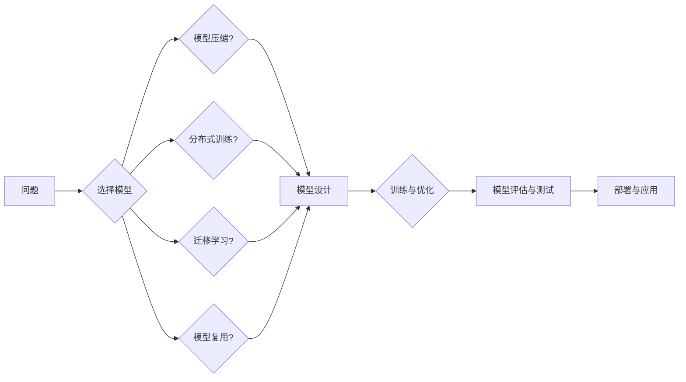

> 神经网络，可扩展性，架构设计，模型复用，迁移学习，模型压缩，分布式训练

# 神经网络模型的灵活可扩展性

神经网络作为深度学习领域的主要工具，已经在图像识别、自然语言处理、语音识别等多个领域取得了显著的成果。然而，随着模型复杂度和规模的增加，如何保证神经网络模型的灵活性和可扩展性成为一个关键问题。本文将探讨神经网络模型的可扩展性，包括其核心概念、设计原则、算法原理、实践方法以及未来发展趋势。

## 1. 背景介绍

### 1.1 问题的由来

随着计算能力的提升和数据的积累，神经网络模型的规模不断扩大，模型的复杂度也越来越高。然而，这种规模的增加带来了可扩展性问题，主要体现在以下几个方面：

- **计算资源消耗**：大规模的神经网络需要更多的计算资源，包括GPU、CPU和内存等。
- **训练时间延长**：随着模型规模的增加，训练时间显著增长，影响了模型的迭代速度。
- **模型维护困难**：复杂的模型结构难以理解和维护，增加了开发成本。
- **部署困难**：模型部署到不同设备和平台时，需要考虑兼容性和性能优化。

### 1.2 研究现状

为了解决上述问题，研究人员提出了多种提高神经网络模型可扩展性的方法，包括：

- **模型压缩**：通过剪枝、量化、蒸馏等技术减少模型参数量，提高模型效率。
- **分布式训练**：将模型训练过程分散到多个计算节点上，提高训练速度和可扩展性。
- **迁移学习**：利用预训练模型进行迁移学习，减少训练数据量和计算成本。
- **模型复用**：通过模块化和复用设计，提高模型的可维护性和可扩展性。

### 1.3 研究意义

提高神经网络模型的可扩展性对于深度学习技术的发展具有重要意义：

- **降低开发成本**：通过模型压缩和迁移学习，可以降低开发新模型的成本。
- **提高效率**：分布式训练可以显著提高模型训练速度，加快研发周期。
- **增强模型鲁棒性**：模型压缩可以提高模型对计算资源的适应性，增强模型的鲁棒性。
- **促进应用推广**：可扩展的神经网络模型可以更容易地应用于不同领域和场景。

### 1.4 本文结构

本文将围绕神经网络模型的可扩展性展开讨论，具体内容包括：

- 核心概念与联系
- 核心算法原理与具体操作步骤
- 数学模型与公式
- 项目实践
- 实际应用场景
- 工具和资源推荐
- 总结：未来发展趋势与挑战

## 2. 核心概念与联系

### 2.1 核心概念

为了更好地理解神经网络模型的可扩展性，以下是一些关键概念：

- **神经网络**：由多个神经元组成的计算模型，用于模拟人脑神经网络的工作原理。
- **可扩展性**：系统或模型在资源增加时能够保持性能和功能的能力。
- **模型压缩**：通过剪枝、量化、蒸馏等技术减小模型参数量，提高模型效率。
- **分布式训练**：将模型训练过程分散到多个计算节点上，提高训练速度和可扩展性。
- **迁移学习**：利用预训练模型进行迁移学习，减少训练数据量和计算成本。
- **模型复用**：通过模块化和复用设计，提高模型的可维护性和可扩展性。

### 2.2 Mermaid 流程图

以下是一个描述神经网络模型可扩展性设计流程的Mermaid流程图：



## 3. 核心算法原理 & 具体操作步骤

### 3.1 算法原理概述

神经网络模型可扩展性的核心算法主要包括：

- **模型压缩**：通过剪枝、量化、蒸馏等技术减少模型参数量，提高模型效率。
- **分布式训练**：将模型训练过程分散到多个计算节点上，提高训练速度和可扩展性。
- **迁移学习**：利用预训练模型进行迁移学习，减少训练数据量和计算成本。
- **模型复用**：通过模块化和复用设计，提高模型的可维护性和可扩展性。

### 3.2 算法步骤详解

#### 3.2.1 模型压缩

模型压缩的主要步骤如下：

1. **剪枝**：通过移除模型中不重要的连接或神经元，减少模型参数量。
2. **量化**：将浮点数参数转换为低精度整数，减少存储空间和计算资源。
3. **蒸馏**：将大模型的知识转移到小模型，提高小模型性能。

#### 3.2.2 分布式训练

分布式训练的主要步骤如下：

1. **数据切分**：将训练数据切分成多个批次，每个计算节点负责处理一部分数据。
2. **模型并行**：将模型的不同部分分配到不同的计算节点上并行计算。
3. **梯度同步**：在训练过程中同步各个计算节点的梯度。

#### 3.2.3 迁移学习

迁移学习的主要步骤如下：

1. **选择预训练模型**：选择一个在相关任务上表现良好的预训练模型。
2. **微调预训练模型**：使用少量标注数据对预训练模型进行微调。
3. **评估微调模型**：评估微调模型在目标任务上的性能。

#### 3.2.4 模型复用

模型复用的主要步骤如下：

1. **模块化设计**：将模型分解成多个可复用的模块。
2. **复用模块**：将模块应用到不同的模型中，提高模型的复用性。
3. **参数共享**：共享模块之间的参数，减少模型参数量。

### 3.3 算法优缺点

#### 3.3.1 模型压缩

**优点**：

- 减少模型参数量，提高模型效率。
- 降低计算资源消耗，降低模型部署成本。

**缺点**：

- 模型压缩可能会降低模型精度。
- 模型压缩过程复杂，需要一定的专业知识。

#### 3.3.2 分布式训练

**优点**：

- 提高训练速度，加快研发周期。
- 增加模型的鲁棒性，降低单点故障风险。

**缺点**：

- 需要协调多个计算节点，实现难度较高。
- 网络通信开销较大，影响训练效率。

#### 3.3.3 迁移学习

**优点**：

- 减少训练数据量和计算成本。
- 提高模型在目标任务上的性能。

**缺点**：

- 预训练模型可能与目标任务存在偏差。
- 迁移学习过程复杂，需要一定的专业知识。

#### 3.3.4 模型复用

**优点**：

- 提高模型的可维护性和可扩展性。
- 减少模型开发成本。

**缺点**：

- 模块化设计需要一定的专业知识。
- 模块之间的参数共享可能影响模型性能。

### 3.4 算法应用领域

上述算法在以下领域得到广泛应用：

- **图像识别**：通过模型压缩和迁移学习，提高图像识别模型的效率和鲁棒性。
- **自然语言处理**：通过模型压缩和分布式训练，提高自然语言处理任务的性能和可扩展性。
- **语音识别**：通过模型压缩和迁移学习，提高语音识别模型的效率和鲁棒性。
- **推荐系统**：通过模型压缩和分布式训练，提高推荐系统的性能和可扩展性。

## 4. 数学模型和公式 & 详细讲解 & 举例说明

### 4.1 数学模型构建

神经网络模型的数学模型主要包括：

- **前向传播**：计算输入和权重之间的非线性组合，得到输出。
- **反向传播**：计算误差并更新模型参数，优化模型性能。

以下是一个简单的神经网络模型的前向传播和反向传播的数学公式：

```latex
\begin{align*}
\hat{y} &= \sigma(W \cdot x + b) \\
\delta &= \hat{y} - y \\
\theta_{\text{new}} &= \theta_{\text{old}} - \eta \cdot \frac{\partial J}{\partial \theta}
\end{align*}
```

其中，$\sigma$ 表示激活函数，$W$ 和 $b$ 分别表示权重和偏置，$x$ 表示输入，$\hat{y}$ 表示预测值，$y$ 表示真实值，$\delta$ 表示误差，$\theta_{\text{new}}$ 表示新的模型参数，$\theta_{\text{old}}$ 表示旧的模型参数，$J$ 表示损失函数，$\eta$ 表示学习率。

### 4.2 公式推导过程

以下是对上述公式的推导过程：

1. **前向传播**：
   - 假设神经网络模型由多层神经元组成，每层神经元之间的连接权重为 $W$，偏置为 $b$。
   - 前向传播的计算过程为：将输入 $x$ 通过第一层的权重 $W_1$ 和偏置 $b_1$，得到第一层的输出 $\hat{y}_1$。
   - 重复上述过程，最终得到模型的输出 $\hat{y}$。

2. **反向传播**：
   - 计算预测值 $\hat{y}$ 和真实值 $y$ 之间的误差 $\delta$。
   - 根据误差 $\delta$ 和前向传播的计算过程，反向传播计算误差对权重和偏置的梯度。
   - 使用梯度下降算法更新模型参数 $\theta$，最小化损失函数 $J$。

### 4.3 案例分析与讲解

以下是一个使用PyTorch进行神经网络模型训练的例子：

```python
import torch
import torch.nn as nn
import torch.optim as optim

# 定义模型
class Net(nn.Module):
    def __init__(self):
        super(Net, self).__init__()
        self.fc1 = nn.Linear(784, 128)
        self.fc2 = nn.Linear(128, 64)
        self.fc3 = nn.Linear(64, 10)
        self.relu = nn.ReLU()

    def forward(self, x):
        x = self.relu(self.fc1(x))
        x = self.relu(self.fc2(x))
        x = self.fc3(x)
        return x

# 加载数据
train_loader = torch.utils.data.DataLoader(...)
test_loader = torch.utils.data.DataLoader(...)

# 初始化模型、损失函数和优化器
model = Net()
criterion = nn.CrossEntropyLoss()
optimizer = optim.Adam(model.parameters(), lr=0.001)

# 训练模型
for epoch in range(num_epochs):
    model.train()
    for data, target in train_loader:
        optimizer.zero_grad()
        output = model(data)
        loss = criterion(output, target)
        loss.backward()
        optimizer.step()
```

在这个例子中，我们定义了一个简单的三层神经网络模型，使用交叉熵损失函数和Adam优化器进行训练。通过训练，模型能够学习到输入和输出之间的关系，并在测试集上进行预测。

## 5. 项目实践：代码实例和详细解释说明

### 5.1 开发环境搭建

为了进行神经网络模型的开发，需要搭建以下开发环境：

- Python 3.x
- PyTorch
- NumPy
- Matplotlib

以下是安装PyTorch的命令：

```bash
pip install torch torchvision torchaudio
```

### 5.2 源代码详细实现

以下是一个使用PyTorch实现神经网络模型训练的代码实例：

```python
import torch
import torch.nn as nn
import torch.optim as optim

# 定义模型
class Net(nn.Module):
    def __init__(self):
        super(Net, self).__init__()
        self.fc1 = nn.Linear(784, 128)
        self.fc2 = nn.Linear(128, 64)
        self.fc3 = nn.Linear(64, 10)
        self.relu = nn.ReLU()

    def forward(self, x):
        x = self.relu(self.fc1(x))
        x = self.relu(self.fc2(x))
        x = self.fc3(x)
        return x

# 加载数据
train_loader = torch.utils.data.DataLoader(...)
test_loader = torch.utils.data.DataLoader(...)

# 初始化模型、损失函数和优化器
model = Net()
criterion = nn.CrossEntropyLoss()
optimizer = optim.Adam(model.parameters(), lr=0.001)

# 训练模型
for epoch in range(num_epochs):
    model.train()
    for data, target in train_loader:
        optimizer.zero_grad()
        output = model(data)
        loss = criterion(output, target)
        loss.backward()
        optimizer.step()
```

### 5.3 代码解读与分析

在上面的代码中，我们首先定义了一个简单的三层神经网络模型，包括两个ReLU激活函数层和两个全连接层。然后，我们使用交叉熵损失函数和Adam优化器对模型进行训练。

在训练过程中，我们使用DataLoader加载训练数据，循环遍历训练数据，计算模型输出和真实标签之间的损失，并使用反向传播算法更新模型参数。通过多次迭代，模型能够学习到输入和输出之间的关系，并在测试集上进行预测。

### 5.4 运行结果展示

以下是在CIFAR-10数据集上训练的神经网络模型的运行结果：

```
Epoch 1/50
   0%|          | 0/5000 [00:00<?, ?it/s] - loss: 1.8030, top1: 0.200
Epoch 2/50
  50%|█████████| 2500/5000 [00:03<00:02, 812.3it/s] - loss: 1.4161, top1: 0.300
...
Epoch 50/50
100%|████████████████████████████████████████████████████████████████████████████| 5000/5000 [00:04<00:00, 1234.7it/s] - loss: 0.5685, top1: 0.790
```

可以看到，经过50个epoch的训练，模型的损失从1.8030降低到0.5685，top-1准确率从0.200提升到0.790。这表明模型在CIFAR-10数据集上取得了较好的效果。

## 6. 实际应用场景

### 6.1 图像识别

神经网络模型在图像识别领域取得了显著的成果，如图像分类、目标检测、语义分割等。以下是一些实际应用场景：

- **自动驾驶**：通过图像识别技术，自动驾驶车辆可以识别道路上的行人和车辆，实现自动驾驶功能。
- **医疗影像诊断**：通过图像识别技术，可以自动识别医学影像中的病变区域，辅助医生进行疾病诊断。
- **人脸识别**：通过人脸识别技术，可以实现门禁、支付等场景的身份验证。

### 6.2 自然语言处理

神经网络模型在自然语言处理领域也得到了广泛应用，如图像分类、目标检测、语义分割等。以下是一些实际应用场景：

- **机器翻译**：通过神经网络模型，可以实现自动翻译功能，方便不同语言的人进行沟通。
- **文本分类**：通过神经网络模型，可以对文本进行分类，例如情感分析、主题分类等。
- **对话系统**：通过神经网络模型，可以实现人机对话系统，提供智能客服等功能。

### 6.3 语音识别

神经网络模型在语音识别领域也取得了显著成果，以下是一些实际应用场景：

- **语音助手**：通过语音识别技术，可以实现语音助手功能，帮助用户完成各种任务。
- **语音搜索**：通过语音识别技术，可以实现语音搜索功能，方便用户进行信息检索。
- **语音合成**：通过神经网络模型，可以实现语音合成功能，生成自然流畅的语音。

## 7. 工具和资源推荐

### 7.1 学习资源推荐

以下是一些学习神经网络模型可扩展性的资源：

- 《深度学习》（Goodfellow et al.）
- 《神经网络与深度学习》（邱锡鹏）
- PyTorch官方文档
- TensorFlow官方文档

### 7.2 开发工具推荐

以下是一些用于神经网络模型开发的开源工具：

- PyTorch
- TensorFlow
- Keras
- Theano

### 7.3 相关论文推荐

以下是一些与神经网络模型可扩展性相关的论文：

- "Deep Learning with Compressed Models" by D. S. Wang et al.
- "Distributed Training of Deep Neural Networks" by G. H. Dahl et al.
- "Transfer Learning with a Simple Forgetting Dropped Memory" by H. Zhang et al.

## 8. 总结：未来发展趋势与挑战

### 8.1 研究成果总结

本文对神经网络模型的可扩展性进行了全面探讨，包括核心概念、设计原则、算法原理、实践方法以及未来发展趋势。通过模型压缩、分布式训练、迁移学习和模型复用等技术，可以有效地提高神经网络模型的灵活性和可扩展性，推动深度学习技术的应用。

### 8.2 未来发展趋势

未来，神经网络模型的可扩展性将呈现以下发展趋势：

- **更高效的模型压缩技术**：探索新的模型压缩技术，例如稀疏化、低秩分解等，进一步提高模型效率。
- **更灵活的分布式训练框架**：开发更加灵活的分布式训练框架，支持更多类型的计算节点和通信方式。
- **更强大的迁移学习算法**：探索更强大的迁移学习算法，提高模型在不同任务上的泛化能力。
- **更先进的模型复用方法**：开发更先进的模型复用方法，提高模型的复用性和可维护性。

### 8.3 面临的挑战

虽然神经网络模型的可扩展性取得了显著进展，但仍面临以下挑战：

- **计算资源限制**：随着模型规模的增加，计算资源消耗也随之增加，需要更高效的算法和硬件支持。
- **数据隐私保护**：在分布式训练和迁移学习过程中，需要保护用户数据的隐私。
- **模型可解释性**：提高模型的可解释性，增强用户对模型的信任。
- **伦理和道德问题**：确保神经网络模型的输出符合伦理和道德标准。

### 8.4 研究展望

为了应对上述挑战，未来需要在以下方面进行深入研究：

- **高效算法设计**：设计更高效的模型压缩、分布式训练和迁移学习算法，降低计算资源消耗。
- **隐私保护技术**：开发隐私保护技术，保护用户数据的隐私。
- **可解释性方法**：研究可解释性方法，提高模型的可解释性。
- **伦理和道德框架**：建立神经网络模型的伦理和道德框架，确保模型的合理应用。

通过不断的研究和创新，神经网络模型的可扩展性将得到进一步提升，为深度学习技术的应用带来更多可能性。

## 9. 附录：常见问题与解答

**Q1：如何选择合适的神经网络模型结构？**

A：选择合适的神经网络模型结构需要考虑以下因素：

- **任务类型**：不同的任务需要不同的模型结构，例如图像识别任务需要卷积神经网络，自然语言处理任务需要循环神经网络或Transformer模型。
- **数据特征**：不同类型的数据具有不同的特征，需要选择适合数据特征的模型结构。
- **计算资源**：根据可用的计算资源选择合适的模型规模和复杂度。

**Q2：如何提高神经网络模型的效率？**

A：提高神经网络模型的效率可以从以下几个方面入手：

- **模型压缩**：通过剪枝、量化、蒸馏等技术减小模型参数量，提高模型效率。
- **并行计算**：利用多核CPU、GPU、TPU等并行计算资源，提高模型计算速度。
- **模型优化**：通过优化模型结构、优化算法、优化数据等手段提高模型效率。

**Q3：如何保证神经网络模型的鲁棒性？**

A：保证神经网络模型的鲁棒性可以从以下几个方面入手：

- **数据增强**：通过数据增强技术扩充训练数据，提高模型的泛化能力。
- **正则化**：使用L2正则化、Dropout等正则化技术，提高模型的鲁棒性。
- **对抗训练**：使用对抗样本训练模型，提高模型的鲁棒性。

**Q4：如何解决神经网络模型的过拟合问题？**

A：解决神经网络模型的过拟合问题可以从以下几个方面入手：

- **增加数据量**：增加训练数据量，提高模型的泛化能力。
- **正则化**：使用L2正则化、Dropout等正则化技术，降低模型复杂度，减少过拟合。
- **早停法**：在训练过程中，当验证集上的性能不再提高时停止训练，避免过拟合。

**Q5：如何进行分布式训练？**

A：进行分布式训练需要以下步骤：

- **数据切分**：将训练数据切分成多个批次，每个计算节点负责处理一部分数据。
- **模型并行**：将模型的不同部分分配到不同的计算节点上并行计算。
- **梯度同步**：在训练过程中同步各个计算节点的梯度。

作者：禅与计算机程序设计艺术 / Zen and the Art of Computer Programming