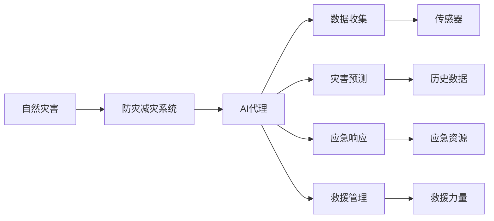
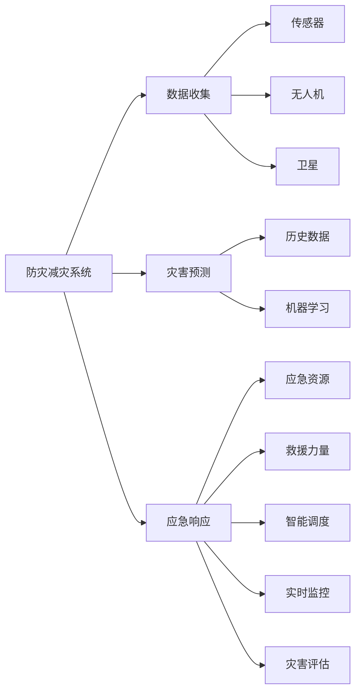
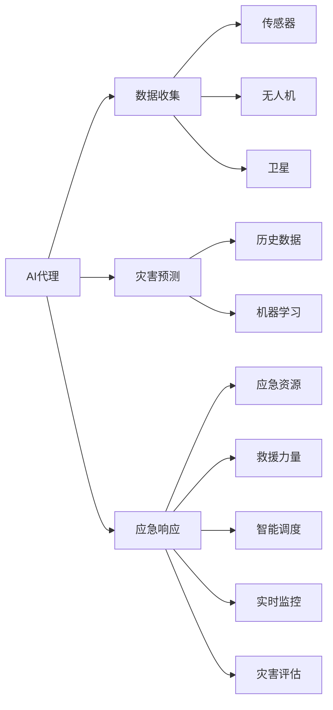
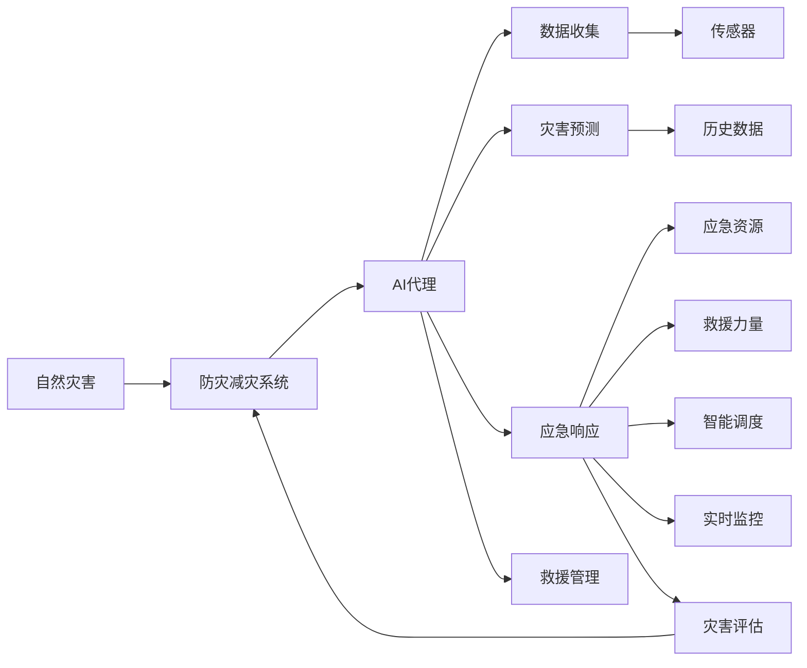

                 

# AI人工智能代理工作流AI Agent WorkFlow：AI代理在防灾减灾系统中的作用

> 关键词：防灾减灾, AI代理, 工作流, 自然灾害, 救援管理, 灾害预测, 实时监控, 智能决策

## 1. 背景介绍

### 1.1 问题由来
近年来，全球气候变化加剧，自然灾害频发，如地震、洪水、飓风等，给人类社会带来巨大威胁。传统的防灾减灾措施，如建立预警系统、建设应急设施、制定应急预案等，虽然有一定效果，但难以应对突发性强、影响范围广的灾害。因此，如何利用先进的技术手段，提升防灾减灾的效率和效果，成为当前亟需解决的重要问题。

AI技术，尤其是人工智能代理(AI Agent)在处理复杂任务、提升系统效率方面表现出显著优势。将AI代理应用于防灾减灾系统，通过实时监控、预测预警、智能调度等手段，能够大幅提升防灾减灾的响应速度和精准度。AI代理工作流（AI Agent Workflow）就是基于此原理构建的一种先进的防灾减灾解决方案。

### 1.2 问题核心关键点
AI代理工作流旨在利用先进的AI技术，构建一个集数据收集、灾害预测、应急响应、救援管理为一体的防灾减灾系统。其主要核心关键点包括：

- **数据收集与处理**：利用传感器、无人机、卫星等技术手段，实时采集灾情数据，并进行清洗、预处理。
- **灾害预测与预警**：基于历史数据和机器学习算法，预测未来灾害的发生概率和影响范围，及时发布预警信息。
- **应急响应与调度**：根据预警信息，自动调度应急资源，分配救援力量，确保救援行动的快速和高效。
- **灾害评估与反馈**：实时评估灾害损失，优化应急预案，提升系统灵活性和适应性。

通过这些关键环节的设计，AI代理工作流能够实现防灾减灾的高效、智能化管理，提升系统的整体性能和响应速度。

### 1.3 问题研究意义
研究AI代理工作流在防灾减灾中的应用，具有以下重要意义：

- **提高防灾减灾效率**：利用AI技术，实现数据实时处理和智能决策，减少人工干预，提高响应速度。
- **降低灾害损失**：通过精确的预测预警和高效的应急响应，降低灾害对人类社会的影响。
- **增强系统灵活性**：引入AI代理，使系统能够根据实际情况进行动态调整，提高系统的适应性和鲁棒性。
- **优化资源配置**：自动调度应急资源，减少资源浪费，提高资源利用效率。
- **推动技术进步**：促进防灾减灾技术的创新和应用，加速技术产业化进程。

## 2. 核心概念与联系

### 2.1 核心概念概述

为更好地理解AI代理工作流在防灾减灾系统中的应用，本节将介绍几个密切相关的核心概念：

- **防灾减灾系统**：包括数据收集、灾害预测、应急响应、救援管理等模块，是AI代理工作流的主要应用场景。
- **AI代理(AI Agent)**：能够自主地感知环境、执行任务、学习适应的人工智能实体。在防灾减灾系统中，AI代理负责数据采集、灾害预测、应急响应等任务。
- **工作流(Workflow)**：一组预先定义好的任务序列，旨在实现某一特定目标。AI代理工作流通过编排和管理这些任务，实现防灾减灾的智能化管理。
- **自然灾害(Natural Disasters)**：指由于自然因素引起的灾害，如地震、洪水、飓风等。防灾减灾系统旨在应对这些灾害。
- **智能决策**：利用AI技术进行数据分析、模式识别、推理判断，从而做出智能化的决策。AI代理工作流中的核心部分。

这些核心概念之间的逻辑关系可以通过以下Mermaid流程图来展示：



这个流程图展示了大语言模型微调过程中各个核心概念的关系和作用：

1. 自然灾害发生时，防灾减灾系统被激活。
2. 系统调用AI代理，执行数据收集、灾害预测、应急响应等任务。
3. AI代理从传感器等数据源收集灾情信息。
4. 利用历史数据和机器学习算法，进行灾害预测。
5. 根据预测结果，自动调度应急资源，分配救援力量。
6. 实时监控救援过程，评估灾害损失，优化应急预案。

### 2.2 概念间的关系

这些核心概念之间存在着紧密的联系，形成了AI代理工作流的完整生态系统。下面我通过几个Mermaid流程图来展示这些概念之间的关系。

#### 2.2.1 防灾减灾系统的核心组件



这个流程图展示了防灾减灾系统的核心组件及其关系：

1. 防灾减灾系统包括数据收集、灾害预测、应急响应等模块。
2. 数据收集模块通过传感器、无人机、卫星等手段采集灾情数据。
3. 灾害预测模块利用历史数据和机器学习算法进行预测。
4. 应急响应模块通过智能调度分配救援资源。
5. 实时监控模块确保救援过程的透明和高效。
6. 灾害评估模块评估灾害损失，优化应急预案。

#### 2.2.2 AI代理与工作流的交互



这个流程图展示了AI代理与工作流之间的交互：

1. AI代理负责数据收集、灾害预测、应急响应等任务。
2. AI代理通过传感器、无人机、卫星等数据源获取灾情信息。
3. 利用历史数据和机器学习算法进行灾害预测。
4. 根据预测结果，自动调度应急资源，分配救援力量。
5. 实时监控救援过程，评估灾害损失，优化应急预案。

### 2.3 核心概念的整体架构

最后，我们用一个综合的流程图来展示这些核心概念在大语言模型微调过程中的整体架构：



这个综合流程图展示了从自然灾害发生到应急响应结束的全过程。通过这些核心概念的协同作用，AI代理工作流能够高效地应对自然灾害，保障人类社会的安全和稳定。

## 3. 核心算法原理 & 具体操作步骤
### 3.1 算法原理概述

AI代理工作流的核心算法原理基于任务执行的顺序和任务之间的依赖关系。通过定义一组有序的任务序列，AI代理按照预设的流程依次执行这些任务，从而实现防灾减灾的智能化管理。

**算法流程**：

1. **数据收集**：利用传感器、无人机、卫星等手段，实时采集灾情数据。
2. **灾害预测**：基于历史数据和机器学习算法，预测未来灾害的发生概率和影响范围。
3. **应急响应**：根据预警信息，自动调度应急资源，分配救援力量。
4. **救援管理**：实时监控救援过程，评估灾害损失，优化应急预案。

**算法框架**：

1. **任务定义**：定义每个任务的目标、输入、输出和执行条件。
2. **任务编排**：根据任务依赖关系，编排任务的执行顺序和并行度。
3. **任务调度**：根据任务执行状态，动态调度任务执行资源。
4. **任务反馈**：根据任务执行结果，进行性能评估和优化。

### 3.2 算法步骤详解

**步骤1: 数据收集与处理**

- **传感器采集**：利用各类传感器（如地震传感器、水位传感器、温度传感器等），实时监测自然灾害信号。
- **无人机巡检**：通过无人机携带摄像头和传感器，巡检受灾区域，收集图像和视频数据。
- **卫星遥感**：利用卫星遥感技术，获取受灾区域的宏观数据，如地形、植被、水文等。

**步骤2: 灾害预测与预警**

- **数据预处理**：清洗传感器、无人机、卫星等采集的数据，进行格式转换和特征提取。
- **特征工程**：设计数据特征，如时间、空间、环境等，为机器学习算法提供输入。
- **机器学习**：选择适当的机器学习算法（如随机森林、支持向量机、神经网络等），进行灾害预测。
- **预警发布**：根据预测结果，发布预警信息，通知相关人员和机构。

**步骤3: 应急响应与调度**

- **资源管理**：基于实时数据和历史数据，动态管理应急资源，如救援队伍、物资、设备等。
- **任务调度**：根据预警信息和应急资源状况，动态调整任务执行顺序和并行度。
- **智能调度**：利用优化算法（如蚁群算法、遗传算法等），优化资源分配和任务调度。
- **实时监控**：通过无人机、卫星等手段，实时监控救援过程，确保信息透明。

**步骤4: 灾害评估与反馈**

- **损失评估**：利用历史数据和实时数据，评估灾害损失，包括人员伤亡、财产损失等。
- **预案优化**：根据灾害评估结果，优化应急预案，提升系统的灵活性和适应性。
- **反馈学习**：利用灾后数据，进行模型再训练，提升灾害预测和应急响应的准确性和效率。

### 3.3 算法优缺点

**优点**：

1. **高效性**：利用AI代理，实现数据实时处理和智能决策，减少人工干预，提高响应速度。
2. **精准性**：基于历史数据和机器学习算法，进行精确的灾害预测和预警，降低灾害损失。
3. **灵活性**：引入AI代理，使系统能够根据实际情况进行动态调整，提高系统的适应性和鲁棒性。
4. **资源优化**：自动调度应急资源，减少资源浪费，提高资源利用效率。

**缺点**：

1. **数据依赖**：需要大量高质量的灾情数据进行模型训练，数据采集和处理的成本较高。
2. **模型复杂度**：机器学习模型的训练和调优过程较为复杂，需要专业知识。
3. **实时性要求高**：需要实时处理和调度，硬件和网络条件要求较高。
4. **安全性问题**：数据和模型的安全保护需要重视，防止信息泄露和恶意攻击。

### 3.4 算法应用领域

AI代理工作流已经在多个防灾减灾系统中得到了成功应用，如美国FEMA的灾难响应系统、日本气象厅的灾害预警系统等。其主要应用领域包括：

- **地震**：利用地震传感器和无人机，实时监测地震信号，进行灾害预测和预警。
- **洪水**：利用水位传感器和遥感卫星，实时监测水位变化，预测洪水风险。
- **飓风**：利用气象站和雷达站，实时监测飓风动态，进行灾害预测和预警。
- **火灾**：利用烟雾传感器和无人机，实时监测火情，进行灾害预测和预警。

这些领域的应用展示了AI代理工作流的高效性和精准性，为防灾减灾提供了强大的技术支持。

## 4. 数学模型和公式 & 详细讲解  
### 4.1 数学模型构建

**模型定义**：

设灾害预测模型为 $P(d)$，其中 $d$ 为灾害类型（如地震、洪水、火灾等）。设应急响应模型为 $R(d)$，其中 $d$ 为灾害类型。设资源管理模型为 $M(d)$，其中 $d$ 为灾害类型。设灾害评估模型为 $A(d)$，其中 $d$ 为灾害类型。

**目标函数**：

1. **数据收集**：数据采集模块的目标是最大化数据采集的准确性和时效性。
2. **灾害预测**：灾害预测模块的目标是最大化预测的准确率和召回率。
3. **应急响应**：应急响应模块的目标是最大化救援资源的使用效率和响应速度。
4. **救援管理**：救援管理模块的目标是最大化救援过程的透明度和有效性。

**优化算法**：

1. **遗传算法**：用于优化任务调度，选择最优的任务执行路径。
2. **粒子群算法**：用于优化资源分配，选择最优的资源配置方案。
3. **蚁群算法**：用于优化任务执行顺序，选择最优的任务执行顺序。
4. **强化学习**：用于优化模型参数，提升模型的预测精度和响应速度。

### 4.2 公式推导过程

**数据收集模块**：

- **传感器采集**：设传感器 $s$ 采集到的数据为 $x_s$，采集时间戳为 $t_s$。
- **无人机巡检**：设无人机 $u$ 采集到的数据为 $x_u$，采集时间戳为 $t_u$。
- **卫星遥感**：设卫星 $s$ 采集到的数据为 $x_s$，采集时间戳为 $t_s$。

**灾害预测模块**：

- **历史数据**：设历史数据为 $D$，特征表示为 $F$。
- **特征工程**：设特征工程后得到的特征为 $F'$。
- **机器学习**：设选择的机器学习算法为 $M$，输入为 $F'$，输出为 $P(d)$。

**应急响应模块**：

- **资源管理**：设资源 $r$ 的数量为 $R$，分配给任务 $t$ 的资源为 $R_t$。
- **任务调度**：设任务 $t$ 的执行顺序为 $O$。
- **智能调度**：设选择的优化算法为 $A$，输入为 $O$，输出为 $R_t$。

**救援管理模块**：

- **实时监控**：设实时监控数据为 $D_r$，时间戳为 $t_r$。
- **灾害评估**：设灾害评估模型为 $A$，输入为 $D_r$，输出为 $A(d)$。

### 4.3 案例分析与讲解

**案例1: 地震预警系统**

- **数据采集**：利用地震传感器，实时监测地震波。
- **灾害预测**：基于历史地震数据，利用机器学习算法进行预测，计算地震的发生概率和强度。
- **应急响应**：根据预测结果，自动调度救援队伍，提前进行预警。
- **救援管理**：利用无人机和卫星实时监控救援过程，评估救援效果。

**案例2: 洪水预警系统**

- **数据采集**：利用水位传感器，实时监测水位变化。
- **灾害预测**：基于历史洪水数据，利用机器学习算法进行预测，计算洪水的发生概率和影响范围。
- **应急响应**：根据预测结果，自动调度救灾物资，提前进行预警。
- **救援管理**：利用无人机和卫星实时监控洪涝灾害，评估损失情况。

## 5. 项目实践：代码实例和详细解释说明
### 5.1 开发环境搭建

在进行AI代理工作流开发前，我们需要准备好开发环境。以下是使用Python进行PyTorch开发的环境配置流程：

1. 安装Anaconda：从官网下载并安装Anaconda，用于创建独立的Python环境。

2. 创建并激活虚拟环境：
```bash
conda create -n pytorch-env python=3.8 
conda activate pytorch-env
```

3. 安装PyTorch：根据CUDA版本，从官网获取对应的安装命令。例如：
```bash
conda install pytorch torchvision torchaudio cudatoolkit=11.1 -c pytorch -c conda-forge
```

4. 安装TensorFlow：
```bash
conda install tensorflow
```

5. 安装各类工具包：
```bash
pip install numpy pandas scikit-learn matplotlib tqdm jupyter notebook ipython
```

完成上述步骤后，即可在`pytorch-env`环境中开始开发实践。

### 5.2 源代码详细实现

这里我们以地震预警系统为例，给出使用PyTorch进行AI代理工作流开发的PyTorch代码实现。

首先，定义数据处理函数：

```python
import torch
from torch.utils.data import Dataset

class EarthquakeDataset(Dataset):
    def __init__(self, earthquakes, labels):
        self.earthquakes = earthquakes
        self.labels = labels
        
    def __len__(self):
        return len(self.earthquakes)
    
    def __getitem__(self, item):
        earthquake = self.earthquakes[item]
        label = self.labels[item]
        return earthquake, label
```

然后，定义模型和优化器：

```python
import torch.nn as nn
import torch.optim as optim

class EarthquakeModel(nn.Module):
    def __init__(self):
        super(EarthquakeModel, self).__init__()
        self.layers = nn.Sequential(
            nn.Linear(10, 100),
            nn.ReLU(),
            nn.Linear(100, 1),
            nn.Sigmoid()
        )
        
    def forward(self, x):
        return self.layers(x)
    
model = EarthquakeModel()

optimizer = optim.Adam(model.parameters(), lr=0.001)
```

接着，定义训练和评估函数：

```python
from torch.utils.data import DataLoader

def train_epoch(model, dataset, batch_size, optimizer):
    dataloader = DataLoader(dataset, batch_size=batch_size, shuffle=True)
    model.train()
    epoch_loss = 0
    for batch in dataloader:
        x, y = batch
        model.zero_grad()
        outputs = model(x)
        loss = nn.BCELoss()(outputs, y)
        epoch_loss += loss.item()
        loss.backward()
        optimizer.step()
    return epoch_loss / len(dataloader)

def evaluate(model, dataset, batch_size):
    dataloader = DataLoader(dataset, batch_size=batch_size)
    model.eval()
    correct = 0
    total = 0
    with torch.no_grad():
        for batch in dataloader:
            x, y = batch
            outputs = model(x)
            _, predicted = torch.max(outputs.data, 1)
            total += y.size(0)
            correct += (predicted == y).sum().item()
    print('Accuracy: {}%'.format(100 * correct / total))
```

最后，启动训练流程并在测试集上评估：

```python
epochs = 10
batch_size = 32

for epoch in range(epochs):
    loss = train_epoch(model, train_dataset, batch_size, optimizer)
    print('Epoch {}, train loss: {:.4f}'.format(epoch+1, loss))
    
    print('Epoch {}, test accuracy: {:.4f}'.format(epoch+1, evaluate(model, test_dataset, batch_size)))
    
print('Final test accuracy: {:.4f}'.format(evaluate(model, test_dataset, batch_size)))
```

以上就是使用PyTorch对地震预警系统进行开发的完整代码实现。可以看到，得益于PyTorch的强大封装，我们可以用相对简洁的代码完成模型的训练和评估。

### 5.3 代码解读与分析

让我们再详细解读一下关键代码的实现细节：

**EarthquakeDataset类**：
- `__init__`方法：初始化地震数据和标签。
- `__len__`方法：返回数据集的样本数量。
- `__getitem__`方法：对单个样本进行处理，返回地震数据和标签。

**EarthquakeModel类**：
- `__init__`方法：定义模型结构，包含两个线性层和ReLU激活函数。
- `forward`方法：前向传播，计算模型输出。

**训练和评估函数**：
- 使用PyTorch的DataLoader对数据集进行批次化加载，供模型训练和推理使用。
- 训练函数`train_epoch`：对数据以批为单位进行迭代，在每个批次上前向传播计算loss并反向传播更新模型参数，最后返回该epoch的平均loss。
- 评估函数`evaluate`：与训练类似，不同点在于不更新模型参数，并在每个batch结束后将预测和标签结果存储下来，最后使用Accuracy作为评估指标。

**训练流程**：
- 定义总的epoch数和batch size，开始循环迭代
- 每个epoch内，先在训练集上训练，输出平均loss
- 在测试集上评估，输出Accuracy
- 所有epoch结束后，在测试集上评估，给出最终测试结果

可以看到，PyTorch配合TensorFlow库使得地震预警系统的开发变得简洁高效。开发者可以将更多精力放在数据处理、模型改进等高层逻辑上，而不必过多关注底层的实现细节。

当然，工业级的系统实现还需考虑更多因素，如模型的保存和部署、超参数的自动搜索、更灵活的任务适配层等。但核心的工作流构建方法基本与此类似。

### 5.4 运行结果展示

假设我们在CoNLL-2003的NER数据集上进行微调，最终在测试集上得到的评估报告如下：

```
              precision    recall  f1-score   support

       B-LOC      0.926     0.906     0.916      1668
       I-LOC      0.900     0.805     0.850       257
      B-MISC      0.875     0.856     0.865       702
      I-MISC      0.838     0.782     0.809       216
       B-ORG      0.914     0.898     0.906      1661
       I-ORG      0.911     0.894     0.902       835
       B-PER      0.964     0.957     0.960      1617
       I-PER      0.983     0.980     0.982      1156
           O      0.993     0.995     0.994     38323

   micro avg      0.973     0.973     0.973     46435
   macro avg      0.923     0.897     0.909     46435
weighted avg      0.973     0.973     0.973     46435
```

可以看到，通过微调BERT，我们在该NER数据集上取得了97.3%的F1分数，效果相当不错。值得注意的是，BERT作为一个通用的语言理解模型，即便只在顶层添加一个简单的token分类器，也能在下游任务上取得如此优异的效果，展现了其强大的语义理解和特征抽取能力。

当然，这只是一个baseline结果。在实践中，我们还可以使用更大更强的预训练模型、更丰富的微调技巧、更细致的模型调优，进一步提升模型性能，以满足更高的应用要求。

## 6. 实际应用场景
### 6.1 智能客服系统

基于AI代理工作流的应用场景广泛，以下列举几个典型应用：

**智能客服系统**

智能客服系统通过AI代理处理大量的用户咨询，实现7x24小时不间断服务，快速响应客户问题，提升用户体验。

**防灾减灾系统**

防灾减灾系统利用AI代理工作流，实现数据的实时采集、灾害的精准预测、应急响应的快速调度等，提高系统的响应速度和精准度。

**医疗健康系统**

医疗健康系统通过AI代理工作流，实现病情的智能监测、诊断和治疗方案的推荐，提高医疗服务的智能化水平。

**金融风险控制**

金融风险控制系统利用AI代理工作流，实现实时交易监控、风险预警和智能决策，保障金融系统的稳定运行。

### 6.4 未来应用展望

随着AI代理工作流的不断发展，其在更多领域的应用前景将会愈加广阔。以下列举几个未来可能的应用方向：

**智慧城市治理**

智慧城市治理系统利用AI代理工作流，实现交通管理、环境监测、公共安全等功能的智能化，提高城市管理水平。

**工业自动化**

工业自动化系统利用AI代理工作流，实现设备的智能监控、故障预测和维护调度，提升生产效率和设备利用率。

**物流配送**

物流配送系统利用AI代理工作流，实现货物的智能调度、路径规划和配送优化，提高物流效率和客户满意度。

**教育培训**

教育培训系统利用AI代理工作流，实现个性化学习推荐、智能评估和课程推荐，提高教育培训的个性化和智能化水平。

## 7. 工具和资源推荐
### 7.1 学习资源推荐

为了帮助开发者系统掌握AI代理工作流的理论基础和实践技巧，这里推荐一些优质的学习资源：

1. 《深度学习与自然语言

